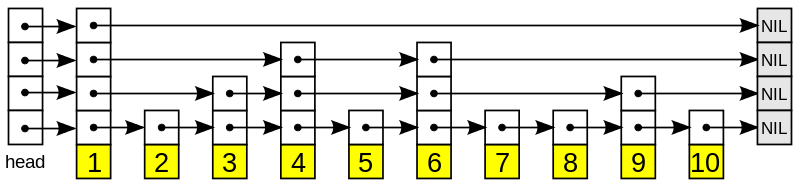
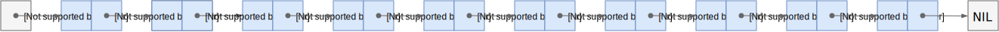
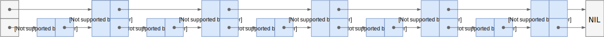
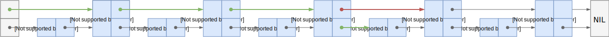
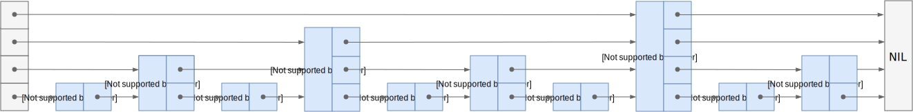
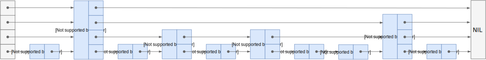

> @Date    : 2020-06-18 15:37:19
>
> @Author  : Lewis Tian (taseikyo@gmail.com)
>
> @Link    : github.com/taseikyo


跳表（Skip List）介绍，找了两篇博客，分布用谷歌搜「skip list」和「跳表」得到的第一条结果。

- [Skip List](#skip-list)
- [跳表──没听过但很犀利的数据结构](#跳表没听过但很犀利的数据结构)

## Skip List

- https://brilliant.org/wiki/skip-lists/

Alex Chumbley, Christopher Williams, Jorge Branco, and 2 others contributed

## Table of Contents
- [Properties](#properties)
- [Time and Space Complexity](#time-and-space-complexity)
- [Algorithm Pseudocode](#algorithm-pseudocode)
- [Height of the Skip List](#height-of-the-skip-list)
- [Proving Complexity](#proving-complexity)
- [References](#references)

The skip list is a [probabilisitc data structure](https://brilliant.org/wiki/probabilistic-data-structures/) that is built upon the general idea of a [linked list](https://brilliant.org/wiki/linked-lists-basic/). The skip list uses probability to build subsequent layers of linked lists upon an original linked list. Each additional layer of links contains fewer elements, but no new elements.

You can think about the skip list like a subway system. There's one train that stops at every single stop. However, there is also an express train. This train doesn't visit any unique stops, but it will stop at fewer stops. This makes the express train an attractive option if you know where it stops.

Skip lists are very useful when you need to be able to concurrently access your data structure. Imagine a [red-black tree](https://brilliant.org/wiki/red-black-tree/), an implementation of the [binary search tree](https://brilliant.org/wiki/binary-search-trees/). If you insert a new node into the red-black tree, you might have to rebalance the entire thing, and you won't be able to access your data while this is going on. In a skip list, if you have to insert a new node, only the adjacent nodes will be affected, so you can still access large part of your data while this is happening.

### Properties

A skip list starts with a basic, ordered, linked list. This list is sorted, but we can't do a binary search on it because it is a linked list and we cannot index into it. But the ordering will come in handy later.

Then, another layer is added on top of the bottom list. This new layer will include any given element from the previous layer with probability $ p $. This probability can vary, but oftentimes $ \frac{1}{2} $ is used. Additionally, the first node in the linked list is often always kept, as a header for the new layer. Take a look at the following graphics and see how some elements are kept but others are discarded. Here, it just so happened that half of the elements are kept in each new layer, but it could be more or less--it's all probabilistic. In all cases, each new layer is still ordered.



A skip list $ S $ has a few important properties that are referenced in its analysis. It has a height of $ h $ which is the number of linked lists in it. It has a number of distinct elements, $ n $. And it has a probability $ p $, which is usually $ \frac{1}{2} $.

The highest element (one that appears in the most lists) will appear in $ \log_\frac{1}{p}(n) $ lists, on average--we'll prove this [later](#height-of-the-skip-list). This, if we use $ p = \frac{1}{2} $, there are $ \log_2(n) $ lists. This is the average value of $ h $. Another way of saying "Every element in a linked list is in the linked list below it" is "Every element in level $ S_{i+1} $ exists in level $ S_i $."

Each element in the skip list has four pointers. It points to the node to its left, its right, its top, and its bottom. These quad-nodes will allow us to efficiently search through the skip list.

### Time and Space Complexity

#### Time

The complexity of a skip list is complicated due to its probabilistic nature. We will prove its time complexity [below](#proving-complexity), but for now we will just look at the results. It is important to note, though, that these bounds are expected or average-case bounds. This is because we use randomization in this data structure:

$$
Insertion - O(log(n)), Deletion - O(log(n)), Indexing - O(log(n)), Search - O(log(n)).
$$

The *worst-case* bounds for the skip list are below, but we won't worry about these for analysis:

$$
Insertion - O(n), Deletion - O(n), Indexing - O(n), Search - O(n).
$$

#### Space

Space is a little easier to reason about. Suppose we have the total number of positions in our skip list equal to

$$
n\sum\limits_{i=0}^{h}\frac{1}{2^i}
$$

因为上面一层的个数大概是下面一层的 1/2，$ S_{i+1}=S_{i}*p, S_0 = n, S_1 = n*\frac{1}{2}, ... $

That is equal to

$$
n*(1+\frac{1}{2}+\frac{1}{4}+\frac{1}{8}+...)=n*2
$$

because of the infinite summation. Therefore, our expected space utilization is simply

$$
Space-O(n)
$$

This is also not concrete. Probabilistically, our skip list could grow much higher. However, this is the expected space complexity.

### Algorithm Pseudocode

There are four main operations in the skip list.

#### Search

The input to this function is a search `key`. The output of this function is a position, `p`, such that the value at this position is the largest that is less than or equal to `key`.

```python
Search(key)
	p = top-left node in S
	while (p.below != null) do        //Scan down
		p = p.below
		while (key >= p.next) do      //Scan forward
		p = p.next
	return p
```

Essentially, we are scanning down the skip list, then scanning forward.

#### Indexing

This functions in the exact same way as `Search`, so we will omit the code.

#### Insertion

The input for insertion is a `key`. The output is the topmost position, `p`, at which the input is inserted. Note that we are using the `Search` method from above. We use a function called `CoinFlip()` that mimics a fair coin and returns either heads or tails. Finally, the function `insertAfter(a, b)` simply inserts the node `a` after the node `b`.

```python
Insert(key)
    p = Search(key)
    q = null
    i = 1
    repeat
        i = i + 1                   //Height of tower for new element
        if i >= h
            h = h + 1
            createNewLevel()        //Creates new linked list level
        while (p.above == null)
            p = p.prev              //Scan backwards until you can go up
        p = p.above
        q = insertAfter(key, p)     //Insert our key after position p
    until CoinFlip() == 'Tails'
    n = n + 1
    return q
```

First, we always insert the `key` into the bottom list at the correct location. Then, we have to promote the new element. We do so by flipping a fair coin. If it comes up heads, we promote the new element. By flipping this fair coin, we are essentially deciding how big to make the tower for the new element. We scan backwards from our position until we can go up, and then we go up a level and insert our `key` right after our current position.

While we are flipping our coin, if the number of heads starts to grow larger than our current height, we have to make sure to create new levels in our skip list to accommodate this. Lines 7-9 of this function take care of that for us.

#### Deletion

Deletion takes advantage of the `Search` operation and is simpler than the `Insertion` operation. We will save space by writing the pseudocode more verbosely.

```python
Delete(key)
    Search for all positions p_0, ..., p_i where key exists
    if none are found
        return
    Delete all positions p_0, ..., p_i
    Remove all empty layers of skip list
```

Delete can be implemented in many ways. Since we know when we find our first instance of key, it will be connected to all others instances of key, and we can easily delete them all at once.

### Height of the Skip List

Earlier, we said that there will be $ \log_2(n) $ lists in total. But why? If each newly created level is done so probabilistically, how can we know that?

The probability $ P_i $ that an element in skip list $ S $ with nn total elements gets up to level $ i $ is just

$$
P_i=\frac{1}{2^i}
$$

because if the probability is $ \frac{1}{2} $, then to create a new level, we're tossing a coin for each element to see if it should be included. So, the probability that at least one of the nn elements gets to level $ i $ is

$$
P_i \le \frac{n}{2^i}
$$

Let's try some numbers to see what this means. If $ i = \log_2(n) $, then

$$
P_i \le \frac{n}{2^{\log_2(n)}} = 1
$$

If $ i $ increases slightly to $ i = 3 \cdot \log_2(n) $, then

$$
P_i \le \frac{n}{2^{3 \log_2(n)}} = \frac{1}{n^2}
$$

This means, that if n = 1000, there is **one in a million** chance of any one particular element making it to the top layer. This analysis, of course, is not strict, but with a high probability (a word used often in randomized algorithms), $ S $ has a height of $ \log_2(n) $.

### Proving Complexity

As we discussed earlier, the worst-case scenario for skip lists is quite bad. In fact, the height of the skip list can stretch towards $ \infty $ because we are using random coin flips. However, this analysis is not fair because skip lists perform much better on average. Let's take the operation `Search`. This is the main focus of the skip list because both `Insertion` and `Deletion` are proved the same way.

#### Search

There are two nested `while` loops in this function. There is the outer loop that is akin to "scanning down" the skip list, and there is the inner loop which is like "scanning forward" in the skip list.

We have proven [above](#height-of-the-skip-list) that the height hh of the skip list is $ O(log_2(n)) $. So, the maximum number of moves down the skip list we can make is $ O(log_2(n)) $.

Now, let's bound the number of scans forward we can make. Let's say we scanned $ n_i $ keys at level ii before we dropped down to level $ i-1 $. Each subsequent key that we scan after we drop into this level cannot exist in level $ i $, or otherwise we would have already seen it. The probability that any given key in this level is in level $ i $ is $ \frac{1}{2} $. That means the expected number of keys we will be encountering in our new level once we've dropped down is 2, a O(1) operation.

So, our two steps of scanning down and scanning forward take $ O(log_2(n)) $ and O(1) time, respectively. That means our total time for search is $ O(log_2(n)) $.

If this analysis feels similar to binary search trees, that's because it is! If you look closely at the skip list, it resembles a tree, with lower levels larger than higher levels.

### References

- Mula, W. *Wikipedia Skip Lists*. Retrieved April 20, 2016, from https://en.wikipedia.org/wiki/Skip_list


## 跳表──没听过但很犀利的数据结构

- https://lotabout.me/2018/skip-list/

跳表(skip list) 对标的是平衡树(AVL Tree)，是一种 插入/删除/搜索 都是 O(log n) 的数据结构。它最大的优势是原理简单、容易实现、方便扩展、效率更高。因此在一些热门的项目里用来替代平衡树，如 redis, leveldb 等。

## Table of Contents
- [跳表的基本思想](#跳表的基本思想)
- [跳表](#跳表)
- [简单的性能分析](#简单的性能分析)
	- [每层的节点数目](#每层的节点数目)
	- [最高的层数](#最高的层数)
	- [搜索的时间复杂度](#搜索的时间复杂度)
- [小结](#小结)
- [参考](#参考)

### 跳表的基本思想

首先，跳表处理的是有序的链表（一般是双向链表，下图未表示双向），如下：



这个链表中，如果要搜索一个数，需要从头到尾比较每个元素是否匹配，直到找到匹配的数为止，即时间复杂度是 O(n)。同理，插入一个数并保持链表有序，需要先找到合适的插入位置，再执行插入，总计也是 O(n) 的时间。

那么如何提高搜索的速度呢？很简单，做个索引：



如上图，我们新创建一个链表，它包含的元素为前一个链表的偶数个元素。这样在搜索一个元素时，我们先在上层链表进行搜索，当元素未找到时再到下层链表中搜索。例如搜索数字 19 时的路径如下图：



先在上层中搜索，到达节点 17 时发现下一个节点为 21，已经大于 19，于是转到下一层搜索，找到的目标数字 19。

我们知道上层的节点数目为 n/2，因此，有了这层索引，我们搜索的时间复杂度降为了：O(n/2)。同理，我们可以不断地增加层数，来减少搜索的时间：



在上面的 4 层链表中搜索 25，在最上层搜索时就可以直接跳过 21 之前的所有节点，因此十分高效。

更一般地，如果有 k 层，我们需要的搜索次数会小于 ⌈$ \frac{n}{2^k} $⌉+k ，这样当层数 k 增加到 ⌈$ log_2n $⌉ 时，搜索的时间复杂度就变成了 log n。其实这背后的原理和二叉搜索树或二分查找很类似，通过索引来跳过大量的节点，从而提高搜索效率。

### 跳表

上节的结构是“静态”的，即我们先拥有了一个链表，再在之上建了多层的索引。但是在实际使用中，我们的链表是通过多次插入/删除形成的，换句话说是“动态”的。上节的结构要求上层相邻节点与对应下层节点间的个数比是 1:2，随意插入/删除一个节点，这个要求就被被破坏了。

因此跳表（skip list）表示，我们就不强制要求 1:2 了，一个节点要不要被索引，建几层的索引，都在节点插入时由抛硬币决定。当然，虽然索引的节点、索引的层数是随机的，为了保证搜索的效率，要大致保证每层的节点数目与上节的结构相当。下面是一个随机生成的跳表：



可以看到它每层的节点数还和上节的结构差不多，但是上下层的节点的对应关系已经完全被打破了。

现在假设节点 17 是最后插入的，在插入之前，我们需要搜索得到插入的位置：


接着，抛硬币决定要建立几层的索引，伪代码如下：

```python
randomLevel()
    lvl := 1
    -- random() that returns a random value in [0...1)
    while random() < p and lvl < MaxLevel do
        lvl := lvl + 1
    return lvl
```

上面的伪代码相当于抛硬币，如果是正面（random() < p）则层数加一，直到抛出反面为止。其中的 MaxLevel 是防止如果运气太好，层数就会太高，而太高的层数往往并不会提供额外的性能，一般 $ MaxLevel=log_{1/p}n $。现在假设 randomLevel 返回的结果是 2，那么就得到下面的结果。


如果要删除节点，则把节点和对应的所有索引节点全部删除即可。当然，要删除节点时需要先搜索得到该节点，搜索过程中可以把路径记录下来，这样删除索引层节点的时候就不需要多次搜索了。

显然，在最坏的情况下，所有节点都没有创建索引，时间复杂度为O(n)，但在平均情况下，搜索的时间复杂度却是 O(logn)，为什么呢？

### 简单的性能分析

一些严格的证明会涉及到比较复杂的概率统计学知识，所以这里只是简单地说明。

#### 每层的节点数目

上面我们提到 MaxLevel，[原版论文](ftp://ftp.cs.umd.edu/pub/skipLists/skiplists.pdf) 中用 L(n) 来表示，要求 L(n) 层有 1/p 个节点，在搜索时可以不理会比 L(n) 更高的层数，直接从 L(n) 层开始搜索，这样效率最高。

直观上看，第 l 层的节点中在第 l+1 层也有索引的个数是 $ n_{l+1} = n_l  p $ 因此第 l 层的节点个数为：

$$
n_l = n p^{l-1}
$$

于是代入 $ n_{L(n)} = 1/p $ 得到 $ L(n) = \log_{1/p}n $。

#### 最高的层数

上面推导到每层的节点数目，直观上看，如果某一层的节点数目小于等于 1，则可以认为它是最高层了，代入 $ np^{l-1} = 1 $ 得到层数 $ L_{max} = \log_{1/p}n + 1 = L(n) + 1 = O(\log n) $。

实际上这个问题并没有直接的解析解，我们能知道的是，当 n 足够大时，最大能达到的层数为 O(logn)，详情可以参见我的另一篇博客 [最高楼层问题](https://lotabout.me/2018/max-level-of-skiplist)。

#### 搜索的时间复杂度

为了计算搜索的时间复杂度，我们可以将查找的过程倒过来，从搜索最后的节点开始，一直向左或向上，直到最顶层。如下图，在路径上的每一点，都可能有两种情况：


1. 节点有上一层的节点，向上。这种情况出现的概率是 p。
2. 节点没有上一层的节点，向左。出现的概率是 1-p。


于是，设 C(k) 为反向搜索爬到第 k 层的平均路径长度，则有：

```
C(0) = 0
C(k) = p * (情况1) + (1-p) * (情况2)
```

将两种情况也用 C 代入，有：

```
C(k) = p*(1 + C(k–1)) + (1–p)*(1 + C(k))
C(k) = C(k–1) + 1/p
C(k) = k/p
```

上式表明，搜索时，平均在每层上需要搜索的路径长度为 1/p，从平均的角度上和我们第一小节构造的“静态”结构相同（p 取 1/2）。

又注意到，上小节我们知道跳表的最大层数为 O(logn)，因此，搜索的复杂度 O(logn)/p=O(logn)。

P.S. 这里我们用到的是最大层数，原论文证明时用到的是 L(n)，然后再考虑从 L(n) 层到最高层的平均节点个数。这里为了理解方便不再详细证明。

### 小结

1. 各种搜索结构提高效率的方式都是通过空间换时间得到的。
2. 跳表最终形成的结构和搜索树很相似。
3. 跳表通过随机的方式来决定新插入节点来决定索引的层数。
4. 跳表搜索的时间复杂度是 O(logn)，插入/删除也是。


想到快排(quick sort)与其它排序算法（如归并排序/堆排序）虽然时间复杂度是一样的，但复杂度的常数项较小；跳表的原论文也说跳表能提供一个常数项的速度提升，因此想着常数项小是不是随机算法的一个特点？这也它们大放异彩的重要因素吧。

### 参考

- ftp://ftp.cs.umd.edu/pub/skipLists/skiplists.pdf 原论文
- https://ticki.github.io/blog/skip-lists-done-right/ skip list 的一些变种、优化
- https://eugene-eeo.github.io/blog/skip-lists.html skip list 的一些相关复杂度分析
- http://cglab.ca/~morin/teaching/5408/refs/p90b.pdf skip list cookbook，算是 skip list 各方面的汇总
- 一个可以在有序元素中实现快速查询的数据结构 包含 skip list 的 C++ 实现
- Redis内部数据结构详解(6)——skiplist 图文并茂讲解 skip list，可与本文交叉对照
- https://www.youtube.com/watch?v=2g9OSRKJuzM MIT 关于 skip list 的课程
- https://courses.csail.mit.edu/6.046/spring04/handouts/skiplists.pdf MIT 课程讲义
