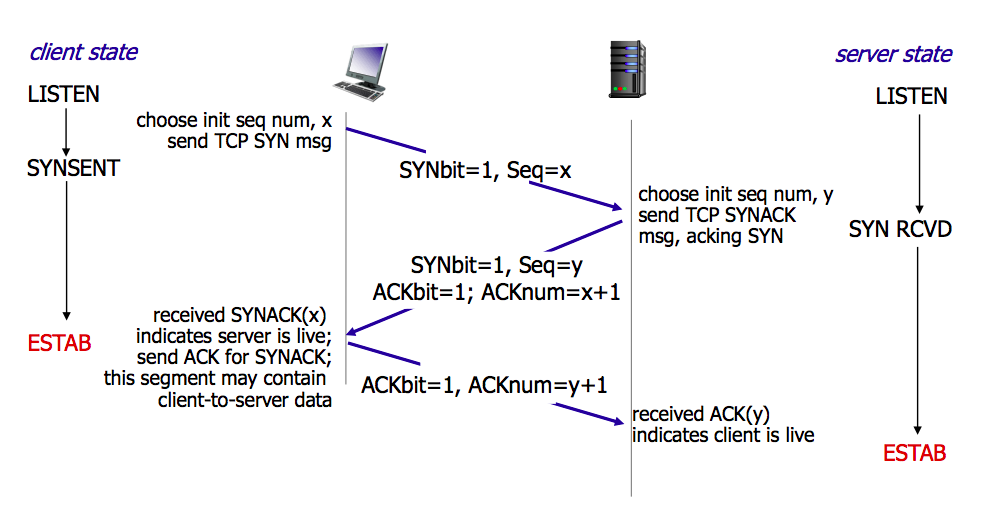

> @Date    : 2020-06-10 15:39:21
>
> @Author  : Lewis Tian (taseikyo@gmail.com)
>
> @Link    : github.com/taseikyo

# TCP 与 UDP 的区别

- https://hit-alibaba.github.io/interview/basic/network/TCP.html
- https://hit-alibaba.github.io/interview/basic/network/UDP.html

## TCP 的特性

- TCP 提供一种面向连接的、可靠的字节流服务
- 在一个 TCP 连接中，仅有两方进行彼此通信。广播和多播不能用于 TCP
- TCP 使用校验和，确认和重传机制来保证可靠传输
- TCP 给数据分节进行排序，并使用累积确认保证数据的顺序不变和非重复
- TCP 使用滑动窗口机制来实现流量控制，通过动态改变窗口的大小进行拥塞控制

**注意：**TCP 并不能保证数据一定会被对方接收到，因为这是不可能的。TCP 能够做到的是，如果有可能，就把数据递送到接收方，否则就（通过放弃重传并且中断连接这一手段）通知用户。因此准确说 TCP 也不是 100% 可靠的协议，它所能提供的是数据的可靠递送或故障的可靠通知。

### 三次握手与四次挥手

所谓三次握手(Three-way Handshake)，是指建立一个 TCP 连接时，需要客户端和服务器总共发送3个包。

三次握手的目的是连接服务器指定端口，建立 TCP 连接，并同步连接双方的序列号和确认号，交换 TCP 窗口大小信息。在 socket 编程中，客户端执行 connect() 时。将触发三次握手。

-   第一次握手(SYN=1, seq=x):

    客户端发送一个 TCP 的 SYN 标志位置1的包，指明客户端打算连接的服务器的端口，以及初始序号 X,保存在包头的序列号(Sequence Number)字段里。

    发送完毕后，客户端进入 SYN_SEND 状态。

-   第二次握手(SYN=1, ACK=1, seq=y, ACKnum=x+1):

    服务器发回确认包(ACK)应答。即 SYN 标志位和 ACK 标志位均为1。服务器端选择自己 ISN 序列号，放到 Seq 域里，同时将确认序号(Acknowledgement Number)设置为客户的 ISN 加1，即X+1。 发送完毕后，服务器端进入 SYN_RCVD 状态。

    第三次握手(ACK=1，ACKnum=y+1)

-   客户端再次发送确认包(ACK)，SYN 标志位为0，ACK 标志位为1，并且把服务器发来 ACK 的序号字段+1，放在确定字段中发送给对方，并且在数据段放写ISN的+1

    发送完毕后，客户端进入 ESTABLISHED 状态，当服务器端接收到这个包时，也进入 ESTABLISHED 状态，TCP 握手结束。

三次握手的过程的示意图如下：

TCP 的连接的拆除需要发送四个包，因此称为四次挥手(Four-way handshake)，也叫做改进的三次握手。客户端或服务器均可主动发起挥手动作，在 socket 编程中，任何一方执行 close() 操作即可产生挥手操作。

-   第一次挥手(FIN=1，seq=x)

    假设客户端想要关闭连接，客户端发送一个 FIN 标志位置为1的包，表示自己已经没有数据可以发送了，但是仍然可以接受数据。

    发送完毕后，客户端进入 FIN_WAIT_1 状态。

-   第二次挥手(ACK=1，ACKnum=x+1)

    服务器端确认客户端的 FIN 包，发送一个确认包，表明自己接受到了客户端关闭连接的请求，但还没有准备好关闭连接。

    发送完毕后，服务器端进入 CLOSE_WAIT 状态，客户端接收到这个确认包之后，进入 FIN_WAIT_2 状态，等待服务器端关闭连接。

-   第三次挥手(FIN=1，seq=y)

    服务器端准备好关闭连接时，向客户端发送结束连接请求，FIN 置为1。

    发送完毕后，服务器端进入 LAST_ACK 状态，等待来自客户端的最后一个ACK。

-   第四次挥手(ACK=1，ACKnum=y+1)

    客户端接收到来自服务器端的关闭请求，发送一个确认包，并进入 TIME_WAIT状态，等待可能出现的要求重传的 ACK 包。

    服务器端接收到这个确认包之后，关闭连接，进入 CLOSED 状态。

    客户端等待了某个固定时间（两个最大段生命周期，2MSL，2 Maximum Segment Lifetime）之后，没有收到服务器端的 ACK ，认为服务器端已经正常关闭连接，于是自己也关闭连接，进入 CLOSED 状态。

四次挥手的示意图如下：

### SYN攻击

-   什么是 SYN 攻击（SYN Flood）？

    在三次握手过程中，服务器发送 SYN-ACK 之后，收到客户端的 ACK 之前的 TCP 连接称为半连接(half-open connect)。此时服务器处于 SYN_RCVD 状态。当收到 ACK 后，服务器才能转入 ESTABLISHED 状态.

    SYN 攻击指的是，攻击客户端在短时间内伪造大量不存在的IP地址，向服务器不断地发送SYN包，服务器回复确认包，并等待客户的确认。由于源地址是不存在的，服务器需要不断的重发直至超时，这些伪造的SYN包将长时间占用未连接队列，正常的SYN请求被丢弃，导致目标系统运行缓慢，严重者会引起网络堵塞甚至系统瘫痪。

    SYN 攻击是一种典型的 DoS/DDoS 攻击。

-   如何检测 SYN 攻击？

    检测 SYN 攻击非常的方便，当你在服务器上看到大量的半连接状态时，特别是源IP地址是随机的，基本上可以断定这是一次SYN攻击。在 Linux/Unix 上可以使用系统自带的 netstats 命令来检测 SYN 攻击。

-   如何防御 SYN 攻击？

    SYN攻击不能完全被阻止，除非将TCP协议重新设计。我们所做的是尽可能的减轻SYN攻击的危害，常见的防御 SYN 攻击的方法有如下几种：

    - 缩短超时（SYN Timeout）时间
    - 增加最大半连接数
    - 过滤网关防护
    - SYN cookies技术

### TCP KeepAlive

TCP 的连接，实际上是一种纯软件层面的概念，在物理层面并没有“连接”这种概念。TCP 通信双方建立交互的连接，但是并不是一直存在数据交互，有些连接会在数据交互完毕后，主动释放连接，而有些不会。在长时间无数据交互的时间段内，交互双方都有可能出现掉电、死机、异常重启等各种意外，当这些意外发生之后，这些 TCP 连接并未来得及正常释放，在软件层面上，连接的另一方并不知道对端的情况，它会一直维护这个连接，长时间的积累会导致非常多的半打开连接，造成端系统资源的消耗和浪费，为了解决这个问题，在传输层可以利用 TCP 的 KeepAlive 机制实现来实现。主流的操作系统基本都在内核里支持了这个特性。

TCP KeepAlive 的基本原理是，隔一段时间给连接对端发送一个探测包，如果收到对方回应的 ACK，则认为连接还是存活的，在超过一定重试次数之后还是没有收到对方的回应，则丢弃该 TCP 连接。

[TCP-Keepalive-HOWTO](http://www.tldp.org/HOWTO/html_single/TCP-Keepalive-HOWTO/) 有对 TCP KeepAlive 特性的详细介绍，有兴趣的同学可以参考。这里主要说一下，TCP KeepAlive 的局限。首先 TCP KeepAlive 监测的方式是发送一个 probe 包，会给网络带来额外的流量，另外 TCP KeepAlive 只能在内核层级监测连接的存活与否，而连接的存活不一定代表服务的可用。例如当一个服务器 CPU 进程服务器占用达到 100%，已经卡死不能响应请求了，此时 TCP KeepAlive 依然会认为连接是存活的。因此 TCP KeepAlive 对于应用层程序的价值是相对较小的。需要做连接保活的应用层程序，例如 QQ，往往会在应用层实现自己的心跳功能。

### 参考资料

- 计算机网络：自顶向下方法
- [TCP三次握手及四次挥手详细图解](http://www.cnblogs.com/hnrainll/archive/2011/10/14/2212415.html)
- [TCP协议三次握手过程分析](http://www.cnblogs.com/rootq/articles/1377355.html)
- [TCP协议中的三次握手和四次挥手(图解)](http://blog.csdn.net/whuslei/article/details/6667471)
- [百度百科：SYN攻击](http://baike.baidu.com/subview/32754/8048820.htm)
- [TCP-Keepalive-HOWTO](http://www.tldp.org/HOWTO/html_single/TCP-Keepalive-HOWTO/)

## UDP 简介

UDP 是一个简单的传输层协议。和 TCP 相比，UDP 有下面几个显著特性：

- UDP 缺乏可靠性。UDP 本身不提供确认，序列号，超时重传等机制。UDP 数据报可能在网络中被复制，被重新排序。即 UDP 不保证数据报会到达其最终目的地，也不保证各个数据报的先后顺序，也不保证每个数据报只到达一次
- UDP 数据报是有长度的。每个 UDP 数据报都有长度，如果一个数据报正确地到达目的地，那么该数据报的长度将随数据一起传递给接收方。而 TCP 是一个字节流协议，没有任何（协议上的）记录边界。
- UDP 是无连接的。UDP 客户和服务器之前不必存在长期的关系。UDP 发送数据报之前也不需要经过握手创建连接的过程。
- UDP 支持多播和广播。
