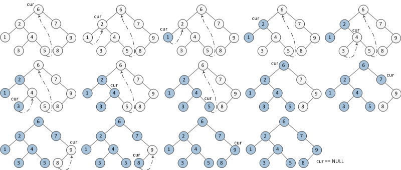
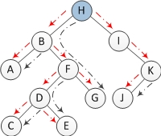
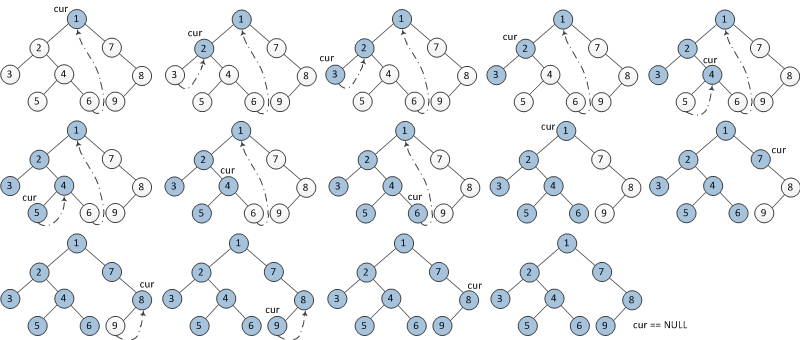
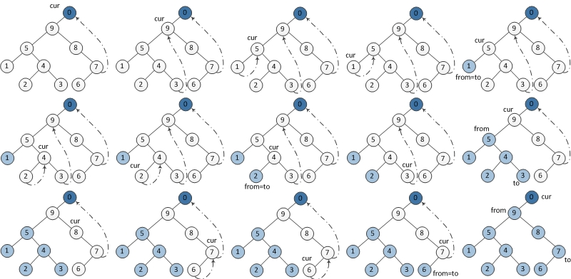

> @Date    : 2020-06-06 18:08:38
>
> @Author  : Lewis Tian (taseikyo@gmail.com)
>
> @Link    : github.com/taseikyo

## Morris Traversal方法遍历二叉树（非递归，不用栈，O(1)空间）

- https://www.cnblogs.com/AnnieKim/archive/2013/06/15/morristraversal.html

本文主要解决一个问题，如何实现二叉树的前中后序遍历，有两个要求：

1. O(1)空间复杂度，即只能使用常数空间；

2. 二叉树的形状不能被破坏（中间过程允许改变其形状）。

通常，实现二叉树的前序（preorder）、中序（inorder）、后序（postorder）遍历有两个常用的方法：一是递归(recursive)，二是使用栈实现的迭代版本(stack+iterative)。这两种方法都是O(n)的空间复杂度（递归本身占用stack空间或者用户自定义的stack），所以不满足要求。（用这两种方法实现的中序遍历实现可以参考 [这里](https://github.com/AnnieKim/LeetCode/blob/master/BinaryTreeInorderTraversal.h)。）

**Morris Traversal** 方法可以做到这两点，与前两种方法的不同在于该方法只需要O(1)空间，而且同样可以在O(n)时间内完成。

要使用O(1)空间进行遍历，最大的难点在于，遍历到子节点的时候怎样重新返回到父节点（假设节点中没有指向父节点的p指针），由于不能用栈作为辅助空间。为了解决这个问题，Morris方法用到了 [线索二叉树](http://en.wikipedia.org/wiki/Threaded_binary_tree#The_array_of_Inorder_traversal)（threaded binary tree）的概念。在Morris方法中不需要为每个节点额外分配指针指向其前驱（predecessor）和后继节点（successor），只需要利用叶子节点中的左右空指针指向某种顺序遍历下的前驱节点或后继节点就可以了。

Morris只提供了中序遍历的方法，在中序遍历的基础上稍加修改可以实现前序，而后续就要再费点心思了。所以先从中序开始介绍。

首先定义在这篇文章中使用的二叉树节点结构，即由val，left和right组成：

```c++
struct TreeNode {
    int val;
    TreeNode *left;
    TreeNode *right;
    TreeNode(int x) : val(x), left(NULL), right(NULL) {}
};
```

### 一、中序遍历

**步骤：**

1. 如果当前节点的左孩子为空，则输出当前节点并将其右孩子作为当前节点。

2. 如果当前节点的左孩子不为空，在当前节点的左子树中找到当前节点在中序遍历下的前驱节点。

	- 如果前驱节点的右孩子为空，将它的右孩子设置为当前节点。当前节点更新为当前节点的左孩子。

	- 如果前驱节点的右孩子为当前节点，将它的右孩子重新设为空（恢复树的形状）。输出当前节点。当前节点更新为当前节点的右孩子。

3. 重复以上1、2直到当前节点为空。

**图示：**

下图为每一步迭代的结果（从左至右，从上到下），cur代表当前节点，深色节点表示该节点已输出。



**代码：**

```c++
void inorderMorrisTraversal(TreeNode *root) {
	TreeNode *cur = root, *prev = NULL;
	while (cur != NULL) {
		if (cur->left == NULL) {        // 1.
			printf("%d ", cur->val);
			cur = cur->right;
		} else {
			// find predecessor
			prev = cur->left;
			while (prev->right != NULL && prev->right != cur)
				prev = prev->right;
			if (prev->right == NULL) { // 2.a)
				prev->right = cur;
				cur = cur->left;
			} else {                   // 2.b)
				prev->right = NULL;
				printf("%d ", cur->val);
				cur = cur->right;
			}
		}
	}
}
```

**复杂度分析：**

空间复杂度：O(1)，因为只用了两个辅助指针。

时间复杂度：O(n)。证明时间复杂度为O(n)，最大的疑惑在于寻找中序遍历下二叉树中所有节点的前驱节点的时间复杂度是多少，即以下两行代码：

```c++
while (prev->right != NULL && prev->right != cur)
    prev = prev->right;
```

直觉上，认为它的复杂度是O(nlgn)，因为找单个节点的前驱节点与树的高度有关。但事实上，寻找所有节点的前驱节点只需要O(n)时间。n个节点的二叉树中一共有n-1条边，整个过程中每条边最多只走2次，一次是为了定位到某个节点，另一次是为了寻找上面某个节点的前驱节点，如下图所示，其中红色是为了定位到某个节点，黑色线是为了找到前驱节点。所以复杂度为O(n)。



### 二、前序遍历

前序遍历与中序遍历相似，代码上只有一行不同，不同就在于输出的顺序。

**步骤：**

1. 如果当前节点的左孩子为空，则输出当前节点并将其右孩子作为当前节点。

2. 如果当前节点的左孩子不为空，在当前节点的左子树中找到当前节点在中序遍历下的前驱节点。

	- 如果前驱节点的右孩子为空，将它的右孩子设置为当前节点。**输出当前节点（在这里输出，这是与中序遍历唯一一点不同）**。当前节点更新为当前节点的左孩子。

	- 如果前驱节点的右孩子为当前节点，将它的右孩子重新设为空。当前节点更新为当前节点的右孩子。

3. 重复以上1、2直到当前节点为空。

**图示：**



```c++
void preorderMorrisTraversal(TreeNode *root) {
	TreeNode *cur = root, *prev = NULL;
	while (cur != NULL) {
		if (cur->left == NULL) {
			printf("%d ", cur->val);
			cur = cur->right;
		} else {
			prev = cur->left;
			while (prev->right != NULL && prev->right != cur)
				prev = prev->right;

			if (prev->right == NULL) {
				printf("%d ", cur->val);  // the only difference with inorder-traversal
				prev->right = cur;
				cur = cur->left;
			} else {
				prev->right = NULL;
				cur = cur->right;
			}
		}
	}
}
```

**复杂度分析：**

时间复杂度与空间复杂度都与中序遍历时的情况相同。

### 三、后序遍历

后续遍历稍显复杂，需要建立一个临时节点dump，令其左孩子是root。并且还需要一个子过程，就是倒序输出某两个节点之间路径上的各个节点。

**步骤：**

当前节点设置为临时节点dump。

1. 如果当前节点的左孩子为空，则将其右孩子作为当前节点。

2. 如果当前节点的左孩子不为空，在当前节点的左子树中找到当前节点在中序遍历下的前驱节点。

   a) 如果前驱节点的右孩子为空，将它的右孩子设置为当前节点。当前节点更新为当前节点的左孩子。

   b) 如果前驱节点的右孩子为当前节点，将它的右孩子重新设为空。**倒序输出从当前节点的左孩子到该前驱节点这条路径上的所有节点**。当前节点更新为当前节点的右孩子。

3. 重复以上1、2直到当前节点为空。

**图示：**



**代码：**

```c++
void reverse(TreeNode *from,
             TreeNode *to) { // reverse the tree nodes 'from' -> 'to'.
	if (from == to)
		return;
	TreeNode *x = from, *y = from->right, *z;
	while (true) {
		z = y->right;
		y->right = x;
		x = y;
		y = z;
		if (x == to)
			break;
	}
}

void printReverse(TreeNode* from,
                  TreeNode *to) { // print the reversed tree nodes 'from' -> 'to'.
	reverse(from, to);

	TreeNode *p = to;
	while (true) {
		printf("%d ", p->val);
		if (p == from)
			break;
		p = p->right;
	}

	reverse(to, from);
}

void postorderMorrisTraversal(TreeNode *root) {
	TreeNode dump(0);
	dump.left = root;
	TreeNode *cur = &dump, *prev = NULL;
	while (cur) {
		if (cur->left == NULL) {
			cur = cur->right;
		} else {
			prev = cur->left;
			while (prev->right != NULL && prev->right != cur)
				prev = prev->right;

			if (prev->right == NULL) {
				prev->right = cur;
				cur = cur->left;
			} else {
				printReverse(cur->left, prev);  // call print
				prev->right = NULL;
				cur = cur->right;
			}
		}
	}
}
```

**复杂度分析：**

空间复杂度同样是O(1)；时间复杂度也是O(n)，倒序输出过程只不过是加大了常数系数。

**注：**

以上所有的代码以及测试代码可以在我的Github里获取。

参考：

- http://www.geeksforgeeks.org/inorder-tree-traversal-without-recursion-and-without-stack/
- http://www.geeksforgeeks.org/morris-traversal-for-preorder/
- http://stackoverflow.com/questions/6478063/how-is-the-complexity-of-morris-traversal-on
- http://blog.csdn.net/wdq347/article/details/8853371

Data Structures and Algorithms in C++ by Adam Drozdek

---------------

以前我只知道递归和栈+迭代实现二叉树遍历的方法，昨天才了解到有使用O(1)空间复杂度的方法。以上都是我参考了网上的资料加上个人的理解来总结，如果有什么不对的地方非常欢迎大家的指正。

原创文章，欢迎转载，转载请注明出处：http://www.cnblogs.com/AnnieKim/archive/2013/06/15/MorrisTraversal.html。