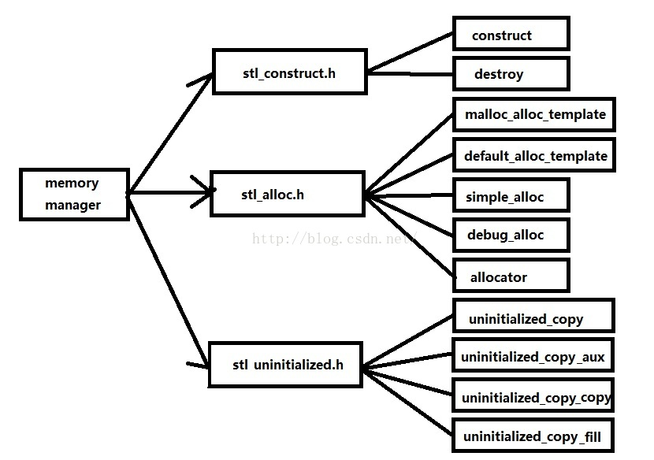
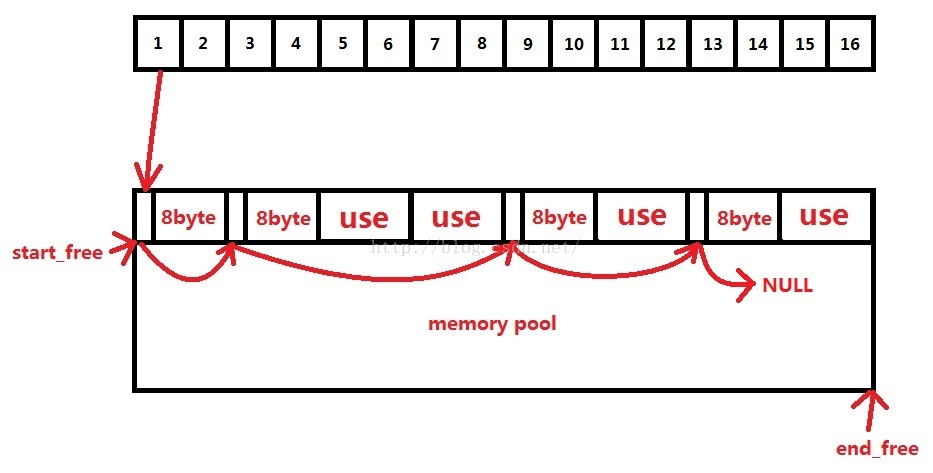
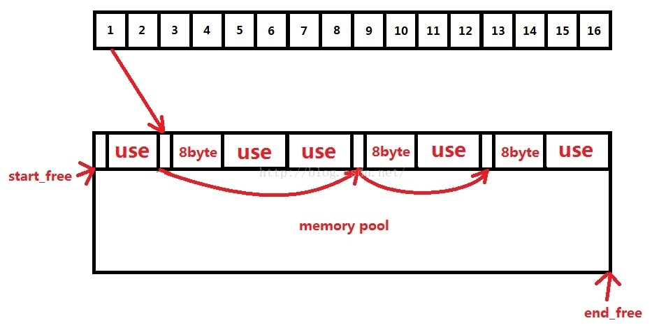
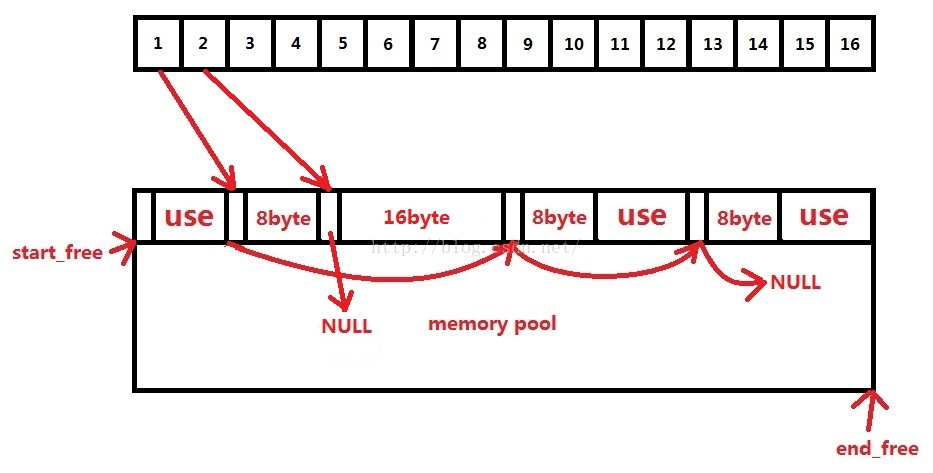
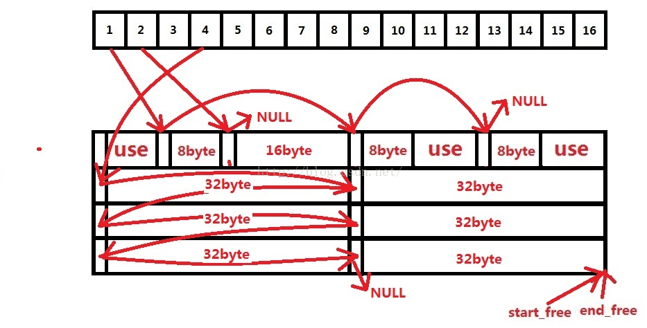
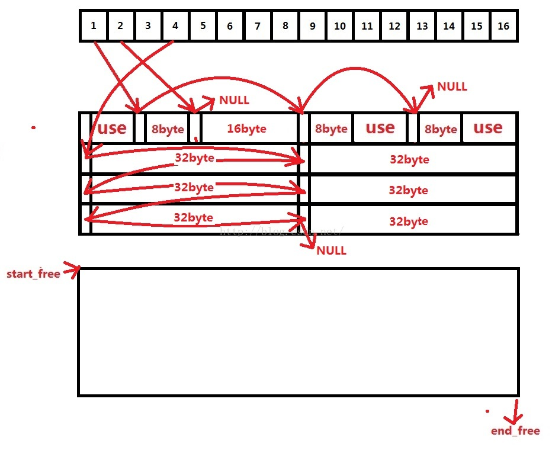
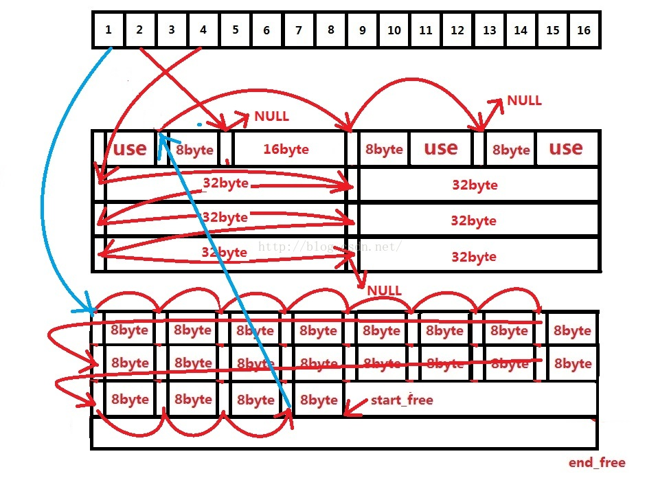
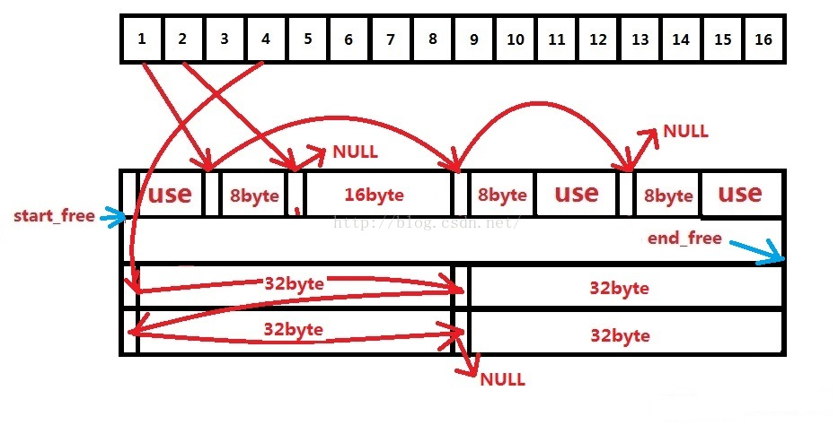

> @Date   : 2020-07-11 23:01:05
>
> @Author : Lewis Tian (taseikyo@gmail.com)
>
> @Link   : github.com/taseikyo

# STL Memory Pool

是一篇 16 年的 CSDN 博客，不知道有没有过时，看了一遍，感觉讲的还不错，于是拿了过来，顺便说一句，CSDN 的样式真是一言难尽...

## STL 学习——STL 中的内存池管理技术

- https://blog.csdn.net/a987073381/article/details/52245795

> 2016-08-18 23:08:53

## Table of Contents
- [一、STL 中的内存管理](#一、stl-中的内存管理)
- [二、第一级配置器](#二、第一级配置器)
- [三、第二级配置器](#三、第二级配置器)
	- [（1）空闲链表的设计](#（1）空闲链表的设计)
	- [（2）空间配置函数 allocate](#（2）空间配置函数-allocate)
	- [（3）空间释放函数 deallocate](#（3）空间释放函数-deallocate)
	- [（4）重新填充空闲链表](#（4）重新填充空闲链表)
	- [（5）从内存池取空间](#（5）从内存池取空间)
- [参考](#参考)

### 一、STL 中的内存管理

当我们 new 一个对象时，实际做了两件事情：（1）使用 malloc 申请了一块内存。（2）执行构造函数。在 SGI 中，这两步独立出了两个函数：allocate 申请内存，construct 调用构造函数。这两个函数分别在 <stl_alloc.h> 和 <stl_construct.h> 中。



### 二、第一级配置器

第一级配置器以 malloc()，free()，realloc() 等 C 函数执行实际的内存配置、释放、重新配置等操作，并且能在内存需求不被满足的时候，调用一个指定的函数。

### 三、第二级配置器

在 STL 的第二级配置器中多了一些机制，避免太多小区块造成的内存碎片，小额区块带来的不仅是内存碎片，配置时还有额外的负担。区块越小，额外负担所占比例就越大。

- 如果要分配的区块大于 128bytes，则移交给第一级配置器处理。
- 如果要分配的区块小于 128bytes，则以内存池管理（memory pool），又称之次层配置（sub-allocation）：每次配置一大块内存，并维护对应的 16 个空闲链表（free-list）。下次若有相同大小的内存需求，则直接从 free-list 中取。如果有小额区块被释放，则由配置器回收到 free-list 中。

#### （1）空闲链表的设计

这里的 16 个空闲链表分别管理大小为 8、16、24......120、128 的数据块。这里空闲链表节点的设计十分巧妙，这里用了一个联合体既可以表示下一个空闲数据块（存在于空闲链表中）的地址，也可以表示已经被用户使用的数据块（不存在空闲链表中）的地址。



```c++
template <bool threads，int inst>
class __default_alloc_template {
private:
    // 将 bytes 上调至 8 的倍数
    static size_t ROUND_UP(size_t bytes){
        return (((bytes) + __ALIGN - 1) & ~(__ALIGN - 1));// 等价于 (bytes + 7) / 8
    }
    // 空闲链表的节点构造
    union obj {
        union obj * free_list_link;
        char client_data[1];
    };
private:
    //16 个空闲链表，初始化为 0，即每个链表中都没有空闲数据块
    static obj * volatile free_list[__NFREELISTS];
    // 根据申请数据块大小找到相应空闲链表的下标
    static  size_t FREELIST_INDEX(size_t bytes) {
        return (((bytes) + __ALIGN - 1)/__ALIGN - 1);
    }
    ......
}
```


#### （2）空间配置函数 allocate

首先先要检查申请空间的大小，如果大于 128 字节就调用第一级配置器，小于 128 字节就检查对应的空闲链表，如果该空闲链表中有可用数据块，则直接拿来用（拿取空闲链表中的第一个可用数据块，然后把该空闲链表的地址设置为该数据块指向的下一个地址），如果没有可用数据块，则调用 refill 重新填充空间。



```c++
// 申请大小为 n 的数据块，返回该数据块的起始地址
static void * allocate(size_t n) {
    obj * __VOLATILE * my_free_list;
    obj * __RESTRICT result;
 
    if (n > (size_t) __MAX_BYTES)// 大于 128 字节调用第一级配置器
    {
        return(malloc_alloc::allocate(n));
    }
    my_free_list = free_list + FREELIST_INDEX(n);// 根据申请空间的大小寻找相应的空闲链表（16 个空闲链表中的一个）
 
    result = *my_free_list;
    if (result == 0)// 如果该空闲链表没有空闲的数据块
    {
        void *r = refill(ROUND_UP(n));// 为该空闲链表填充新的空间
        return r;
    }
    *my_free_list = result -> free_list_link;// 如果空闲链表中有空闲数据块，则取出一个，并把空闲链表的指针指向下一个数据块
    return (result);
};
```

#### （3）空间释放函数 deallocate

首先先要检查释放数据块的大小，如果大于 128 字节就调用第一级配置器，小于 128 字节则根据数据块的大小来判断回收后的空间会被插入到哪个空闲链表。
例如回收下面指定位置大小为 16 字节的数据块，首先数据块的大小判断回收后的数据块应该插入到第二个空闲链表，把该节点指向的下一个地址修改为原链表指向的地址（这里是 NULL），然后将原链表指向该节点。



```c++
// 释放地址为 p，释放大小为 n
static void deallocate(void *p，size_t n) {
    obj *q = (obj *)p;
    obj * __VOLATILE * my_free_list;
 
    if (n > (size_t) __MAX_BYTES)// 如果空间大于 128 字节，采用普通的方法析构
    {
        malloc_alloc::deallocate(p，n);
        return;
    }
 
    my_free_list = free_list + FREELIST_INDEX(n);// 否则将空间回收到相应空闲链表（由释放块的大小决定）中
    q -> free_list_link = *my_free_list;
    *my_free_list = q;
}
```

#### （4）重新填充空闲链表

在用 allocate 配置空间时，如果空闲链表中没有可用数据块，就会调用 refill 来重新填充空间，新的空间取自内存池。缺省取 20 个数据块，如果内存池空间不足，那么能取多少个节点就取多少个。



```c++
template <bool threads，int inst>
void* refill(size_t n) {
    int nobjs = 20;
    char * chunk = chunk_alloc(n，nobjs);// 从内存池里取出 nobjs 个大小为 n 的数据块，返回值 nobjs 为真实申请到的数据块个数，注意这里 nobjs 个大小为 n 的数据块所在的空间是连续的
    obj * __VOLATILE * my_free_list;
    obj * result;
    obj * current_obj，* next_obj;
    int i;
 
    if (1 == nobjs) return(chunk);// 如果只获得一个数据块，那么这个数据块就直接分给调用者，空闲链表中不会增加新节点
    my_free_list = free_list + FREELIST_INDEX(n);// 否则根据申请数据块的大小找到相应空闲链表
 
    result = (obj *)chunk;
    *my_free_list = next_obj = (obj *)(chunk + n);// 第 0 个数据块给调用者，地址访问即 chunk~chunk + n - 1
    for (i = 1; ; i++)//1~nobjs-1 的数据块插入到空闲链表
    {
        current_obj = next_obj;
        next_obj = (obj *)((char *)next_obj + n);// 由于之前内存池里申请到的空间连续，所以这里需要人工划分成小块一次插入到空闲链表
 
        if (nobjs - 1 == i) {
            current_obj -> free_list_link = 0;
            break;
        }
        else {
            current_obj -> free_list_link = next_obj;
        }
    }
 
    return(result);
}
```

#### （5）从内存池取空间

从内存池取空间给空闲链表用是 chunk_alloc 的工作：
首先根据 end_free - start_free 来判断内存池中的剩余空间是否足以调出 nobjs 个大小为 size 的数据块出去，如果内存连一个数据块的空间都无法供应，需要用 malloc 取堆中申请内存。



申请内存后，如果要拨出去 20 个大小为 8 字节的数据块。



假如山穷水尽，整个系统的堆空间都不够用了，malloc 失败，那么 chunk_alloc 会从空闲链表中找是否有大的数据块，然后将该数据块的空间分给内存池（这个数据块会从链表中去除）。



```c++
template <bool threads，int inst>
class __default_alloc_template {
private:
    ......
    static char *start_free;// 内存池可用空间的起始位置，初始化为 0
    static char *end_free;// 内存池可用空间的结束位置，初始化为 0
    static size_t heap_size;// 内存池的总大小
 
public:
    // 申请 nobjs 个大小为 size 的数据块，返回值为真实申请到的数据块个数，放在 nobjs 中
    static char *chunk_alloc(size_t size，int &nobjs) {
        char * result;
        size_t total_bytes = size * nobjs;// 需要申请空间的大小
        size_t bytes_left = end_free - start_free;// 计算内存池剩余空间
 
        // 如果内存池剩余空间完全满足需求量
        if (bytes_left >= total_bytes) {
            result = start_free;
            start_free += total_bytes;
            return(result);
        }
        // 内存池剩余空间不满足需求量，但是至少能够提供一个以上数据块
        else if (bytes_left >= size) {
            nobjs = bytes_left / size;
            total_bytes = size * nobjs;
            result = start_free;
            start_free += total_bytes;
            return(result);
        }
        // 剩余空间连一个数据块（大小为 size）也无法提供
        else {
            size_t bytes_to_get = 2 * total_bytes + ROUND_UP(heap_size >> 4);
 
            // 内存池的剩余空间分给合适的空闲链表
            if (bytes_left > 0) {
                obj * __VOLATILE * my_free_list = free_list + FREELIST_INDEX(bytes_left);
 
                ((obj *)start_free) -> free_list_link = *my_free_list;
                *my_free_list = (obj *)start_free;
            }
            start_free = (char *)malloc(bytes_to_get);// 配置 heap 空间，用来补充内存池
            if (0 == start_free) {
                int i;
                obj * __VOLATILE * my_free_list，*p;
 
                // 从空闲链表中找出一个比较大的空闲数据块还给内存池（之后会将这个大的空闲数据块切成多个小的空闲数据块再次加入到空闲链表）
                for (i = size; i <= __MAX_BYTES; i += __ALIGN) {
                    my_free_list = free_list + FREELIST_INDEX(i);
                    p = *my_free_list;
                    if (0 != p) {
                        *my_free_list = p -> free_list_link;
                        start_free = (char *)p;
                        end_free = start_free + i;
                        return(chunk_alloc(size，nobjs));// 递归调用自己，为了修正 nobjs
                    }
                }
                end_free = 0;
                start_free = (char *)malloc_alloc::allocate(bytes_to_get);// 如果连这个大的数据块都找不出来则调用第一级配置器
            }
            // 如果分配成功
            heap_size += bytes_to_get;// 内存池大小增加
            end_free = start_free + bytes_to_get;// 修改内存池可用空间的结束位置
            return(chunk_alloc(size，nobjs));// 递归调用自己，为了修正 nobjs
        }
    }
};
```

### 参考

- 《STL 源码剖析》
- http://www.cnblogs.com/sld666666/archive/2010/07/01/1769448.html