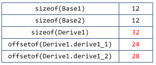

> @Date    : 2020-07-28 17:16:46
>
> @Author  : Lewis Tian (taseikyo@gmail.com)
>
> @Link    : github.com/taseikyo

> 本文由 [简悦 SimpRead](http://ksria.com/simpread/) 转码， 原文地址 [blog.twofei.com](https://blog.twofei.com/496/)

# C++ 中的虚函数 (表) 实现机制以及用 C 语言对其进行的模拟实现

## 前言

大家都应该知道 C++ 的精髓是虚函数吧? 虚函数带来的好处就是: 可以定义一个基类的指针, 其指向一个继承类, 当通过基类的指针去调用函数时, 可以在运行时决定该调用基类的函数还是继承类的函数. 虚函数是实现多态 (动态绑定)/ 接口函数的基础. 可以说: 没有虚函数, C++ 将变得一无是处!

既然是 C++ 的精髓, 那么我们有必要了解一下她的实现方式吗? 有必要! 既然 C++ 是从 C 语言的基础上发展而来的, 那么我们可以尝试用 C 语言来模拟实现吗? 有可能! 接下来, 就是我一步一步地来解析 C++ 的虚函数的实现方式, 以及用 C 语言对其进行的模拟.

## C++ 对象的内存布局

要想知道 C++ 对象的内存布局, 可以有多种方式, 比如:

1.  输出成员变量的偏移, 通过 offsetof 宏来得到
2.  通过调试器查看, 比如常用的 VS

### 只有数据成员的对象

类实现如下:

```c++
class Base1 {
public:
    int base1_1;
    int base1_2;
};
```

对象大小及偏移:

<table><tbody><tr><td>sizeof(Base1)</td><td>8</td></tr><tr><td>offsetof(Base1, base1_1)</td><td>0</td></tr><tr><td>offsetof(Base1, base1_2)</td><td>4</td></tr></tbody></table>

可知对象布局:


可以看到, 成员变量是按照定义的顺序来保存的, 最先声明的在最上边, 然后依次保存!  
类对象的大小就是所有成员变量大小之和.

### 没有虚函数的对象

类实现如下:

```c++
class Base1 {
public:
    int base1_1;
    int base1_2;

    void foo(){}
};
```

结果如下:

<table><tbody><tr><td>sizeof(Base1)</td><td>8</td></tr><tr><td>offsetof(Base1, base1_1)</td><td>0</td></tr><tr><td>offsetof(Base1, base1_2)</td><td>4</td></tr></tbody></table>

和前面的结果是一样的? 不需要有什么疑问对吧?  
因为如果一个函数不是虚函数, 那么他就不可能会发生动态绑定, 也就不会对对象的布局造成任何影响.  
当调用一个非虚函数时, 那么调用的一定就是当前指针类型拥有的那个成员函数. 这种调用机制在编译时期就确定下来了.

### 拥有仅一个虚函数的类对象

类实现如下:

```c++
class Base1 {
public:
    int base1_1;
    int base1_2;

    virtual void base1_fun1() {}
};
```

结果如下:

<table><tbody><tr><td>sizeof(Base1)</td><td>12</td></tr><tr><td>offsetof(Base1, base1_1)</td><td>4</td></tr><tr><td>offsetof(Base1, base1_2)</td><td>8</td></tr></tbody></table>

咦? 多了 4 个字节? 且 base1_1 和 base1_2 的偏移都各自向后多了 4 个字节!  
说明类对象的最前面被多加了 4 个字节的 "东东", what's it?  
现在, 我们通过 VS2013 来瞧瞧类 Base1 的变量 b1 的内存布局情况:  
(由于我没有写构造函数, 所以变量的数据没有根据, 但虚函数是编译器为我们构造的, 数据正确!)  
(Debug 模式下, 未初始化的变量值为 0xCCCCCCCC, 即:-858983460)


看到没? base1_1 前面多了一个变量 __vfptr(常说的虚函数表 vtable 指针), 其类型为 void**, 这说明它是一个 void * 指针 (**注意:** 不是数组).

再看看 [0] 元素, 其类型为 void*, 其值为 ConsoleApplication2.exe!Base1::base1_fun1(void), 这是什么意思呢? 如果对 WinDbg 比较熟悉, 那么应该知道这是一种惯用表示手法, 她就是指 Base1::base1_fun1() 函数的地址.

可得, __vfptr 的定义伪代码大概如下:

```c++
void*   __fun[1] = { &Base1::base1_fun1 };
const void**  __vfptr = &__fun[0];
```

值得注意的是:

1.  上面只是一种伪代码方式, 语法不一定能通过
2.  该类的对象大小为 12 个字节, 大小及偏移信息如下:
    
    <table><tbody><tr><td>sizeof(Base1)</td><td>12</td></tr><tr><td>offsetof(__vfptr)</td><td>0</td></tr><tr><td>offsetof(base1_1)</td><td>4</td></tr><tr><td>offsetof(base1_2)</td><td>8</td></tr></tbody></table>
    
3.  大家有没有留意这个__vfptr? 为什么它被定义成一个指向指针数组的指针, 而不是直接定义成一个指针数组呢?
    
    我为什么要提这样一个问题? 因为如果仅是一个指针的情况, 您就无法轻易地修改那个数组里面的内容, 因为她并不属于类对象的一部分.  
    属于类对象的, 仅是一个指向**虚函数表的一个指针__vfptr** 而已, 下一节我们将继续讨论这个问题.
    
4.  注意到__vfptr 前面的 const 修饰. 她修饰的是那个虚函数表, 而不是__vfptr.

现在的对象布局如下:


虚函数指针__vfptr 位于所有的成员变量之前定义.

注意到: 我并未在此说明__vfptr 的具体指向, 只是说明了现在类对象的布局情况.  
接下来看一个稍微复杂一点的情况, 我将清楚地描述虚函数表的构成.

### 拥有多个虚函数的类对象

和前面一个例子差不多, 只是再加了一个虚函数. 定义如下:

```c++
class Base1 {
public:
    int base1_1;
    int base1_2;

    virtual void base1_fun1() {}
    virtual void base1_fun2() {}
};
```

大小以及偏移信息如下:


有情况!? 多了一个虚函数, 类对象大小却依然是 12 个字节!

再来看看 VS 形象的表现:


呀, __vfptr 所指向的函数指针数组中出现了第 2 个元素, 其值为 Base1 类的第 2 个虚函数 base1_fun2() 的函数地址.

现在, 虚函数指针以及虚函数表的伪定义大概如下:

```c++
void* __fun[] = { &Base1::base1_fun1, &Base1::base1_fun2 };
const void** __vfptr = &__fun[0];
```

通过上面两张图表, 我们可以得到如下结论:

1.  更加肯定前面我们所描述的: __vfptr 只是一个指针, 她指向一个函数指针数组 (即: 虚函数表)
2.  增加一个虚函数, 只是简单地向该类对应的虚函数表中增加一项而已, 并不会影响到类对象的大小以及布局情况

前面已经提到过: __vfptr 只是一个指针, 她指向一个数组, 并且: 这个数组没有包含到类定义内部, 那么她们之间是怎样一个关系呢?  
不妨, 我们再定义一个类的变量 b2, 现在再来看看__vfptr 的指向:


通过 Watch 1 窗口我们看到:

1.  b1 和 b2 是类的两个变量, 理所当然, 她们的地址是不同的 (见 &b1 和 &b2)
2.  虽然 b1 和 b2 是类的两个变量, 但是: 她们的__vfptr 的指向却是同一个虚函数表

由此我们可以总结出:

同一个类的不同实例共用同一份虚函数表, 她们都通过一个所谓的虚函数表指针__vfptr(定义为 void** 类型) 指向该虚函数表.

是时候该展示一下类对象的内存布局情况了:


不出意外, 很清晰明了地展示出来了吧? :-) hoho~~

那么问题就来了! 这个虚函数表保存在哪里呢? 其实, 我们无需过分追究她位于哪里, 重点是:

1.  她是编译器在**编译时期**为我们创建好的, 只存在一份
2.  定义类对象时, 编译器自动将类对象的__vfptr 指向这个虚函数表
### 单继承且本身不存在虚函数的继承类的内存布局

前面研究了那么多啦, 终于该到研究继承类了! 先研究单继承!

依然, 简单地定义一个继承类, 如下:

```c++
class Base1 {
public:
    int base1_1;
    int base1_2;

    virtual void base1_fun1() {}
    virtual void base1_fun2() {}
};

class Derive1 : public Base1 {
public:
    int derive1_1;
    int derive1_2;
};
```

我们再来看看现在的内存布局 (定义为 Derive1 d1):


没错! 基类在上边, 继承类的成员在下边依次定义! 展开来看看:


经展开后来看, 前面部分完全就是 Base1 的东西: 虚函数表指针 + 成员变量定义.  
并且, Base1 的虚函数表的 [0][1] 两项还是其本身就拥有的函数: base1_fun1() 和 base1_fun2().

现在类的布局情况应该是下面这样:


### 本身不存在虚函数 (不严谨) 但存在基类虚函数覆盖的单继承类的内存布局

标题 ` 本身不存在虚函数 ` 的说法有些不严谨, 我的意思是说: 除经过继承而得来的基类虚函数以外, 自身没有再定义其它的虚函数.

Ok, 既然存在基类虚函数覆盖, 那么来看看接下来的代码会产生何种影响:

```c++
class Base1 {
public:
    int base1_1;
    int base1_2;

    virtual void base1_fun1() {}
    virtual void base1_fun2() {}
};

class Derive1 : public Base1 {
public:
    int derive1_1;
    int derive1_2;

    // 覆盖基类函数
    virtual void base1_fun1() {}
};
```

可以看到, Derive1 类 重写了 Base1 类的 base1_fun1() 函数, 也就是常说的虚函数覆盖. 现在是怎样布局的呢?


特别注意我高亮的那一行: 原本是 Base1::base1_fun1(), 但由于**继承类重写**了基类 Base1 的此方法, 所以现在变成了 Derive1::base1_fun1()!

那么, 无论是通过 Derive1 的指针还是 Base1 的指针来调用此方法, 调用的都将是被继承类重写后的那个方法 (函数), 多态发生鸟!!!

那么新的布局图:


### 定义了基类没有的虚函数的单继承的类对象布局

说明一下: 由于前面一种情况只会造成覆盖基类虚函数表的指针, 所以接下来我不再同时讨论虚函数覆盖的情况.

继续贴代码:

```c++
class Base1 {
public:
    int base1_1;
    int base1_2;

    virtual void base1_fun1() {}
    virtual void base1_fun2() {}
};

class Derive1 : public Base1 {
public:
    int derive1_1;
    int derive1_2;

    virtual void derive1_fun1() {}
};
```

和第 5 类不同的是多了一个自身定义的虚函数. 和第 6 类不同的是没有基类虚函数的覆盖.


咦, 有没有发现问题? 表面上看来几乎和第 5 种情况完全一样? 为嘛呢?  
现在继承类明明定义了自身的虚函数, 但不见了??  
那么, 来看看类对象的大小, 以及成员偏移情况吧:


居然没有变化!!! 前面 12 个字节是 Base1 的, 有没有觉得很奇怪?

好吧, 既然表面上没办法了, 我们就只能从汇编入手了, 来看看调用 derive1_fun1() 时的代码:

```c++
Derive1 d1;
Derive1* pd1 = &d1;
pd1->derive1_fun1();
```

要注意: 我为什么使用指针的方式调用? 说明一下: 因为如果不使用指针调用, 虚函数调用是不会发生动态绑定的哦! 你若直接 d1.derive1_fun1(); , 是不可能会发生动态绑定的, 但如果使用指针: pd1->derive1_fun1(); , 那么 pd1 就无从知道她所指向的对象到底是 Derive1 还是继承于 Derive1 的对象, 虽然这里我们并没有对象继承于 Derive1, 但是她不得不这样做, 毕竟继承类不管你如何继承, 都不会影响到基类, 对吧?

```asm
; pd1->derive1_fun1();
00825466  mov         eax,dword ptr [pd1]  
00825469  mov         edx,dword ptr [eax]  
0082546B  mov         esi,esp  
0082546D  mov         ecx,dword ptr [pd1]  
00825470  mov         eax,dword ptr [edx+8]  
00825473  call        eax
```

汇编代码解释:

第 2 行: 由于 pd1 是指向 d1 的指针, 所以执行此句后 eax 就是 **d1 的地址**  
第 3 行: 又因为 Base1::__vfptr 是 Base1 的第 1 个成员, 同时也是 Derive1 的第 1 个成员, 那么: &__vfptr == &d1, clear? 所以当执行完 mov edx, dword ptr[eax] 后, edx 就得到了__vfptr 的值, 也就是**虚函数表的地址**.  
第 5 行: 由于是__thiscall 调用, 所以把 this 保存到 ecx 中.  
第 6 行: 一定要注意到那个 edx+8, 由于 edx 是虚函数表的地址, 那么 edx+8 将是虚函数表的第 3 个元素, 也就是__vftable[2]!!!  
第 7 行: 调用虚函数.

结果:

1.  现在我们应该知道内幕了! 继承类 Derive1 的虚函数表被加在基类的后面! 事实的确就是这样!
2.  由于 Base1 只知道自己的两个虚函数索引 [0][1], 所以就算在后面加上了 [2], Base1 根本不知情, 不会对她造成任何影响.
3.  如果**基类没有虚函数**呢? 这个问题我们留到第 9 小节再来讨论!

最新的类对象布局表示:


### 多继承且存在虚函数覆盖同时又存在自身定义的虚函数的类对象布局

真快, 该看看多继承了, 多继承很常见, 特别是接口类中!

依然写点小类玩玩:

```c++
class Base1 {
public:
    int base1_1;
    int base1_2;

    virtual void base1_fun1() {}
    virtual void base1_fun2() {}
};

class Base2 {
public:
    int base2_1;
    int base2_2;

    virtual void base2_fun1() {}
    virtual void base2_fun2() {}
};

// 多继承
class Derive1 : public Base1, public Base2 {
public:
    int derive1_1;
    int derive1_2;

    // 基类虚函数覆盖
    virtual void base1_fun1() {}
    virtual void base2_fun2() {}

    // 自身定义的虚函数
    virtual void derive1_fun1() {}
    virtual void derive1_fun2() {}
};
```

代码变得越来越长啦! 为了代码结构清晰, 我尽量简化定义.

初步了解一下对象大小及偏移信息:



貌似, 若有所思? 不管, 来看看 VS 再想:


哇, 不摆了! 一丝不挂啊! :-)

结论:

1.  按照基类的声明顺序, 基类的成员依次分布在继承中.
2.  注意被我高亮的那两行, 已经发生了虚函数覆盖!
3.  我们自己定义的虚函数呢? 怎么还是看不见?!

好吧, 继承反汇编, 这次的调用代码如下:

```c++
Derive1 d1;
Derive1* pd1 = &d1;
pd1->derive1_fun2();
```

反汇编代码如下:

```asm
; pd1->derive1_fun2();
00995306  mov         eax,dword ptr [pd1]  
00995309  mov         edx,dword ptr [eax]  
0099530B  mov         esi,esp  
0099530D  mov         ecx,dword ptr [pd1]  
00995310  mov         eax,dword ptr [edx+0Ch]  
00995313  call        eax
```

解释下, 其实差不多:

第 2 行: 取 d1 的地址  
第 3 行: 取 Base1::__vfptr 的值!!  
第 6 行: 0x0C, 也就是第 4 个元素 (下标为 [3])

结论:

Derive1 的虚函数表依然是保存到第 1 个拥有虚函数表的那个基类的后面的.

看看现在的类对象布局图:

（注：图中有点错误，右上角应该是 `void* __vftable[4]`，多谢 shadow3002 的提醒）

（注：图中有点错误，Derive1 是存在虚函数覆盖的。源图丢失，请读者注意不要被误导。[多谢 Oyster 的提醒](#comment-577)）


如果第 1 个基类没有虚函数表呢? 进入第 9 节!

### 如果第 1 个直接基类没有虚函数 (表)

这次的代码应该比上一个要稍微简单一些, 因为把第 1 个类的虚函数给去掉鸟!

```c++
class Base1
{
public:
    int base1_1;
    int base1_2;
};

class Base2
{
public:
    int base2_1;
    int base2_2;

    virtual void base2_fun1() {}
    virtual void base2_fun2() {}
};

// 多继承
class Derive1 : public Base1, public Base2
{
public:
    int derive1_1;
    int derive1_2;

    // 自身定义的虚函数
    virtual void derive1_fun1() {}
    virtual void derive1_fun2() {}
};
```

来看看 VS 的布局:


这次相对前面一次的图来说还要简单啦! Base1 已经没有虚函数表了! (真实情况并非完全这样, 请继续往下看!)

现在的大小及偏移情况: 注意: sizeof(Base1) == 8;


重点是看虚函数的位置, 进入函数调用 (和前一次是一样的):

```c++
Derive1 d1;
Derive1* pd1 = &d1;
pd1->derive1_fun2();
```

反汇编调用代码:

```asm
; pd1->derive1_fun2();
012E4BA6  mov         eax,dword ptr [pd1]  
012E4BA9  mov         edx,dword ptr [eax]  
012E4BAB  mov         esi,esp  
012E4BAD  mov         ecx,dword ptr [pd1]  
012E4BB0  mov         eax,dword ptr [edx+0Ch]  
012E4BB3  call        eax
```

这段汇编代码和前面一个完全一样!, 那么问题就来了! Base1 已经没有虚函数表了, 为什么还是把 b1 的第 1 个元素当作__vfptr 呢?  
不难猜测: 当前的布局已经发生了变化, 有虚函数表的基类放在对象内存前面!? , 不过事实是否属实? 需要仔细斟酌.

我们可以通过对基类成员变量求偏移来观察:


可以看到:

```c++
&d1==0x~d4
&d1.Base1::__vfptr==0x~d4
&d1.base2_1==0x~d8
&d1.base2_2==0x~dc
&d1.base1_1==0x~e0
&d1.base1_2==0x~e4
```

所以不难验证: 我们前面的推断是正确的, 谁有虚函数表, 谁就放在前面!

现在类的布局情况:


那么, 如果两个基类都没有虚函数表呢?

### What if 两个基类都没有虚函数表

代码如下:

```c++
class Base1 {
public:
    int base1_1;
    int base1_2;
};

class Base2 {
public:
    int base2_1;
    int base2_2;
};

// 多继承
class Derive1 : public Base1, public Base2 {
public:
    int derive1_1;
    int derive1_2;

    // 自身定义的虚函数
    virtual void derive1_fun1() {}
    virtual void derive1_fun2() {}
};

```

前面吃了个亏, 现在先来看看 VS 的基本布局:


可以看到, 现在__vfptr 已经独立出来了, 不再属于 Base1 和 Base2!

看看求偏移情况:


Ok, 问题解决! 注意高亮的那两行, &d1==&d1.__vfptr, 说明虚函数始终在最前面!

不用再废话, 相信大家对这种情况已经有底了.

对象布局:


### 如果有三个基类: 虚函数表分别是有, 没有, 有!

这种情况其实已经无需再讨论了, 作为一个完结篇....

上代码:

```c++
class Base1 {
public:
    int base1_1;
    int base1_2;

    virtual void base1_fun1() {}
    virtual void base1_fun2() {}
};

class Base2 {
public:
    int base2_1;
    int base2_2;
};

class Base3 {
public:
    int base3_1;
    int base3_2;

    virtual void base3_fun1() {}
    virtual void base3_fun2() {}
};

// 多继承
class Derive1 : public Base1, public Base2, public Base3 {
public:
    int derive1_1;
    int derive1_2;

    // 自身定义的虚函数
    virtual void derive1_fun1() {}
    virtual void derive1_fun2() {}
};

```

以下是偏移图：


以下是对象布局图（多谢 [@Oyster](#comment-577) 的手绘）：


只需知道: 谁有虚函数表, 谁就往前靠!
    

## C++ 中父子对象指针间的转换与函数调用

讲了那么多布局方面的东东, 终于到了尾声, 好累呀!!!

通过前面的讲解内容, 大家至少应该明白了各类情况下类对象的内存布局了. 如果还不会..... 呃..... !@#$%^&*

进入正题~

由于继承完全拥有父类的所有, 包括数据成员与虚函数表, 所以: **把一个继承类强制转换为一个基类**是完全可行的.

如果有一个 Derive1 的指针, 那么:

*   得到 Base1 的指针: Base1* pb1 = pd1;
*   得到 Base2 的指针: Base2* pb2 = pd1;
*   得到 Base3 的指针: Base3* pb3 = pd1;

非常值得注意的是:

这是在基类与继承类之间的转换, 这种转换会自动计算偏移! 按照前面的布局方式!  
也就是说: 在这里极有可能: pb1 != pb2 != pb3 ~~, 不要以为她们都等于 pd1!

至于函数调用, 我想, 不用说大家应该知道了:

1.  如果不是虚函数, 直接调用指针对应的基本类的那个函数
2.  如果是虚函数, 则查找虚函数表, 并进行后续的调用. 虚函数表在定义一个时, 编译器就为我们创建好了的. 所有的, 同一个类, 共用同一份虚函数表.

## 用 C 语言完全模拟 C++ 虚函数表的实现与运作方式

如果对前面两大节的描述仔细了解了的话, 想用 C 语言来模拟 C++ 的虚函数以及多态, 想必是轻而易举的事情鸟!

### 前提

但是, 话得说在前面, C++ 的编译器在生成类及对象的时候, 帮助我们完成了很多事件, 比如生成虚函数表!  
但是, C 语言编译器却没有, 因此, 很多事件我们必须手动来完成, 包括但不限于:

1.  手动构造父子关系
2.  手动创建虚函数表
3.  手动设置__vfptr 并指向虚函数表
4.  手动填充虚函数表
5.  若有虚函数覆盖, 还需手动修改函数指针
6.  若要取得基类指针, 还需手动强制转换
7.  ......

总之, 要想用 C 语言来实现, 要写的代码绝对有点复杂.

### C++ 原版调用

接下来, 我们都将以最后那个, 最繁杂的那个 3 个基类的实例来讲解, 但作了一些简化与改动:

1.  用构造函数初始化成员变量
2.  减少成员变量的个数
3.  减少虚函数的个数
4.  调用函数时产生相关输出
5.  Derive1 增加一个基类虚函数覆盖

以下是对类的改动, 很少:

```c++
class Base1 {
public:
    Base1() : base1_1(11) {}
    int base1_1;
    virtual void base1_fun1() {
        std::cout << "Base1::base1_fun1()" << std::endl;
    }
};

class Base2 {
public:
    Base2() : base2_1(21) {}
    int base2_1;
};

class Base3 {
public:
    Base3() : base3_1(31) {}
    int base3_1;
    virtual void base3_fun1() {
        std::cout << "Base3::base3_fun1()" << std::endl;
    }
};

class Derive1 : public Base1, public Base2, public Base3 {
public:
    Derive1() : derive1_1(11) {}
    int derive1_1;

    virtual void base3_fun1() {
        std::cout << "Derive1::base3_fun1()" << std::endl;
    }
    virtual void derive1_fun1() {
            std::cout << "Derive1::derive1_fun1()" << std::endl;
    }
};

```

为了看到多态的效果, 我们还需要定义一个函数来看效果:

```c++
void foo(Base1* pb1, Base2* pb2, Base3* pb3, Derive1* pd1) {
    std::cout << "Base1::\n"
        << "    pb1->base1_1 = " << pb1->base1_1 << "\n"
        << "    pb1->base1_fun1(): ";
    pb1->base1_fun1();

    std::cout << "Base2::\n"
        << "    pb2->base2_1 = " << pb2->base2_1
        << std::endl;

    std::cout << "Base3::\n"
        << "    pb3->base3_1 = " << pb3->base3_1 << "\n"
        <<"    pb3->base3_fun1(): ";
    pb3->base3_fun1();

    std::cout << "Derive1::\n"
        << "    pd1->derive1_1 = " << pd1->derive1_1<< "\n"
        <<"    pd1->derive1_fun1(): ";
    pd1->derive1_fun1();
    std::cout<< "    pd1->base3_fun1(): ";
    pd1->base3_fun1();
    
    std::cout << std::endl;
}

```

调用方式如下:

```c++
Derive1 d1;
foo(&d1, &d1, &d1, &d1);
```

输出结果:


可以看到输出结果全部正确 (当然了! :-), 哈哈~  
同时注意到 pb3->base3_fun1() 的多态效果哦!

### 用 C 语言来模拟

必须要把前面的理解了, 才能看懂下面的代码!

为了有别于已经完成的 C++ 的类, 我们分别在类前面加一个大写的 C 以示区分 (平常大家都是习惯在 C++ 写的类前面加 C, 今天恰好反过来, 哈哈).

##### C 语言无法实现的部分

C/C++ 是两个语言, 有些语言特性是 C++ 专有的, 我们无法实现! 不过, 这里我是指调用约定, 我们应该把她排除在外.

对于类的成员函数, C++ 默认使用__thiscall, 也即 this 指针通过 ecx 传递, 这在 C 语言无法实现, 所以我们必须手动声明调用约定为:

1.  __stdcall, 就像微软的组件对象模型那样
2.  __cdecl, 本身就 C 语言的调用约定, 当然能使用了.

上面那种调用约定, 使用哪一种无关紧要, 反正不能使用__thiscall 就行了.

因为使用了非__thiscall 调用约定, 我们就必须手动传入 this 指针, 通过成员函数的第 1 个参数!

##### 从最简单的开始: 实现 Base2

由于没有虚函数, 仅有成员变量, 这个当然是最好模拟的咯!

```c++
struct CBase2 {
    int base2_1;
};
```

##### 有了虚函数表的 Base1, 但没被覆盖

下面是 Base1 的定义, 要复杂一点了, 多一个__vfptr:

```c++
struct CBase1
{
    void** __vfptr;
    int base1_1;
};
```

因为有虚函数表, 所以还得单独为虚函数表创建一个结构体的哦!  
但是, 为了更能清楚起见, 我并未定义前面所说的指针数组, 而是用一个包含一个或多个函数指针的结构体来表示!  
因为数组能保存的是同一类的函数指针, 不太很友好!  
但他们的效果是完全一样的, 希望读者能够理解明白!

```c++
struct CBase1_VFTable
{
    void(__stdcall* base1_fun1)(CBase1* that);
};
```

**注意:** base1_fun1 在这里是一个指针变量!  
**注意:** base1_fun1 有一个 CBase1 的指针, 因为我们不再使用__thiscall, 我们必须手动传入! Got it?

Base1 的成员函数 base1_fun1() 我们也需要自己定义, 而且是定义成全局的:

```c++
void __stdcall base1_fun1(CBase1* that){
    std::cout << "base1_fun1()" << std::endl;
}
```

##### 有虚函数覆盖的 Base3

虚函数覆盖在这里并不能体现出来, 要在构造对象初始化的时候才会体现, 所以: base3 其实和 Base1 是一样的.

```c++
struct CBase3{
    void** __vfptr;
    int base3_1;
};

struct CBase3_VFTable{
    void(__stdcall* base3_fun1)(CBase3* that);
};
```

Base3 的成员函数:

```c++
void __stdcall base3_fun1(CBase3* that){
    std::cout << "base3_fun1()" << std::endl;
}
```

##### 定义继承类 CDerive1

相对前面几个类来说, 这个类要显得稍微复杂一些了, 因为包含了前面几个类的内容:

```c++
struct CDerive1 {
    CBase1 base1;
    CBase3 base3;
    CBase2 base2;

    int derive1_1;
};
```

特别注意: CBase123 的顺序不能错!

另外: 由于 Derive1 本身还有虚函数表, 而且所以项是加到第一个虚函数表 (CBase1) 的后面的, 所以此时的 CBase1::__vfptr 不应该单单指向 CBase1_VFTable, 而应该指向下面这个包含 Derive1 类虚函数表的结构体才行:

```c++
struct CBase1_CDerive1_VFTable {
    void (__stdcall* base1_fun1)(CBase1* that);
    void(__stdcall* derive1_fun1)(CDerive1* that);
};
```

因为 CDerive1 覆盖了 CBase3 的 base3_fun1() 函数, 所以不能直接用 Base3 的那个表:

```c++
struct CBase3_CDerive1_VFTable {
    void(__stdcall* base3_fun1)(CDerive1* that);
};
```

Derive1 覆盖 Base3::base3_fun1() 的函数以及自身定义的 derive1_fun1() 函数:

```c++
void __stdcall base3_derive1_fun1(CDerive1* that) {
    std::cout << "base3_derive1_fun1()" << std::endl;
}

void __stdcall derive1_fun1(CDerive1* that) {
    std::cout << "derive1_fun1()" << std::endl;
}
```

##### 构造各类的全局虚函数表

由于没有了编译器的帮忙, 在定义一个类对象时, 所有的初始化工作都只能由我们自己来完成了!

首先构造全局的, 被同一个类共同使用的虚函数表!

```c++
// CBase1 的虚函数表
CBase1_VFTable __vftable_base1;
__vftable_base1.base1_fun1 = base1_fun1;

// CBase3 的虚函数表
CBase3_VFTable __vftable_base3;
__vftable_base3.base3_fun1 = base3_fun1;
```

然后构造 CDerive1 和 CBase1 共同使用的虚函数表:

```c++
// CDerive1 和 CBase1 共用的虚函数表
CBase1_CDerive1_VFTable __vftable_base1_derive1;
__vftable_base1_derive1.base1_fun1 = base1_fun1;
__vftable_base1_derive1.derive1_fun1 = derive1_fun1;
```

再构造 CDerive1 覆盖 CBase3 后的虚函数表: 注意: 数覆盖会替换原来的函数指针

```c++
CBase3_CDerive1_VFTable __vftable_base3_derive1;
__vftable_base3_derive1.base3_fun1 = base3_derive1_fun1;
```

##### 开始! 从 CDerive1 构造一个完整的 Derive1 类

先初始化成员变量与__vfptr 的指向: 注意不是指错了!

```c++
CDerive1 d1;
d1.derive1 = 1;

d1.base1.base1_1 = 11;
d1.base1.__vfptr = reinterpret_cast<void**>(&__vftable_base1_derive1);
    
d1.base2.base2_1 = 21;

d1.base3.base3_1 = 31;
d1.base3.__vfptr = reinterpret_cast<void**>(&__vftable_base3_derive1);
```

由于目前的 CDerive1 是我们手动构造的, 不存在真正语法上的继承关系, 如要得到各基类指针, 我们就不能直接来取, 必须手动根据偏移计算:

```c++
char* p = reinterpret_cast<char*>(&d1);
Base1* pb1 = reinterpret_cast<Base1*>(p + 0);
Base2* pb2 = reinterpret_cast<Base2*>(p + sizeof(CBase1) + sizeof(CBase3));
Base3* pb3 = reinterpret_cast<Base3*>(p + sizeof(CBase1));
Derive1* pd1 = reinterpret_cast<Derive1*>(p);
```

真正调用:

```c++
foo(pb1, pb2, pb3, pd1);
```

调用结果:


**结果相当正确!!!**

## 源代码

我以为我把源代码搞丢了，结果过了一年多发现其实并没有。--- 2015-12-24（每个圣诞我都在写代码）

有两个，忘了区别了：[Source1.cpp](https://blog.twofei.com/496/Source1.cpp), [Source2.cpp](https://blog.twofei.com/496/Source2.cpp).