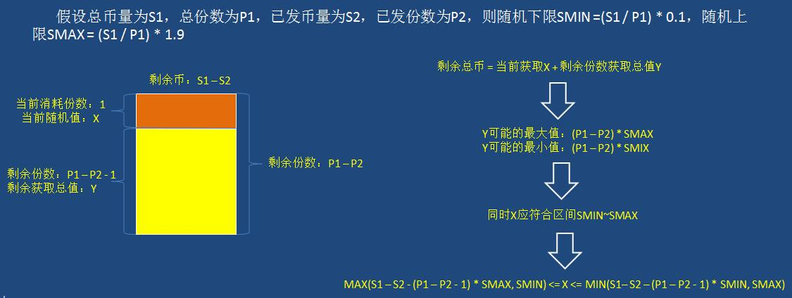
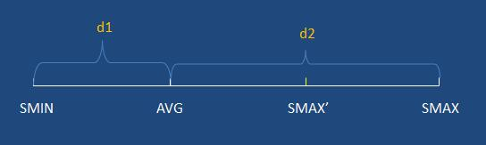
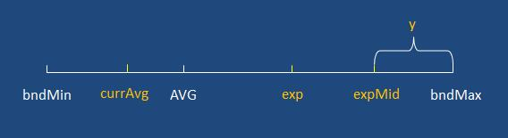

> @Date    : 2020-07-28 16:24:50
>
> @Author  : Lewis Tian (taseikyo@gmail.com)
>
> @Link    : github.com/taseikyo


- https://blog.csdn.net/paincupid/article/details/82054647

# 微信红包算法以及带上下限的红包算法


原文地址：

[带上下限的红包算法实践总结](https://www.cnblogs.com/hanganglin/p/6496422.html)

[微信红包的随机算法是怎样实现的？ - 知乎](https://www.zhihu.com/question/22625187)

## 一、微信红包算法

代码大致意思是这样的：假设有 100 元钱，分给十个人。那么第一个人获得红包大小怎么计算呢？100/10 = 10 元。这是期望值。从 0.01 到 20 的区间中（其中 20=10 乘以 2）随机抽取一个数，就是第一个人获得红包的大小。假设第一个人获得了 15 元，那么剩下的 85 元平均分给 9 个人，这九个人平均获得红包大小为 9.4 元，那么第二个人的红包大小均匀分布于 0.01 元到 18.80 元的区间中，依次类推。算法保证最后一个人至少抽到 0.01 元。

微信的红包算法代码

```java
public static double getRandomMoney(LeftMoneyPackage _leftMoneyPackage) {
    // remainSize 剩余的红包数量
    // remainMoney 剩余的钱
    if (_leftMoneyPackage.remainSize == 1) {
        _leftMoneyPackage.remainSize--;
        return (double) Math.round(_leftMoneyPackage.remainMoney * 100) / 100;
    }
    Random r = new Random();
    double min = 0.01; //
    double max = _leftMoneyPackage.remainMoney / _leftMoneyPackage.remainSize * 2;
    if (max > 6) {
        max = 6;
    }
    double money = r.nextDouble() * max;
    money = money <= min ? 0.01 : money;
    money = Math.floor(money * 100) / 100;
    _leftMoneyPackage.remainSize--;
    _leftMoneyPackage.remainMoney -= money;
    return money;
}

public static void main(String[] args) {
    LeftMoneyPackage moneyPackage = new LeftMoneyPackage();
    moneyPackage.remainMoney = 40;
    moneyPackage.remainSize = 10;

    while (moneyPackage.remainSize != 0) {
        System.out.print(Cal.getRandomMoney(moneyPackage) + 6 + "   ");

    }
}
```

## 二、需求分析与实现 - 带上下限对称随机红包算法

与此不同的是，我们项目中要求每份红包在一定范围内波动，分配第 n 个红包依赖于前 n-1 个红包的分配结果，详细分析如下（金币代表红包）：

假设总金币数量为 S1，总份数为 P1，已发币量为 S2，已发份数为 P2，则:  
平均值为 S1/P1，则随机下限 SMIN=(S1/P1)*0.1，随机上限 SMAX=(S1/P1)*1.9。  
设生成的第 n 个随机币值为 X，剩余获取总值为 Y，则剩余币 S1-S2=X+Y，当 Y 取最大值时 X 取最小值，当 Y 取最小值时 X 取最大值，同时 X 应处于限定随机上下限 (SMIN~SMAX) 之间，得出：  
X 的随机范围为：MAX(S1–S2-(P1–P2-1)*SMAX,SMIN)<=X<=MIN(S1–S2–(P1–P2-1)*SMIN,SMAX)

分析示意图如图 1：


　　  
得出公式，程序实现就很简单了，使用 java 实现的分配算法如下：

```java
/**
 * 返回min~max区间内随机数，含min和max
 * @param min
 * @param max
 * @return
 */
private static int getRandomVal(int min, int max) {
    Random random = new Random();
    return random.nextInt(max - min + 1) + min;
}

/**
 * 随机分配第n个红包
 * @param totalBonus 总红包量
 * @param totalNum 总份数
 * @param sendedBonus 已发送红包量
 * @param sendedNum 已发送份数
 * @param rdMin 随机下限
 * @param rdMax 随机上限
 * @return
 */
private static Integer randomBonusWithSpecifyBound(Integer totalBonus, Integer totalNum, Integer sendedBonus,
        Integer sendedNum, Integer rdMin, Integer rdMax) {
    Integer boundMin = Math.max((totalBonus - sendedBonus - (totalNum - sendedNum - 1) * rdMax), rdMin);
    Integer boundMax = Math.min((totalBonus - sendedBonus - (totalNum - sendedNum - 1) * rdMin), rdMax);
    return getRandomVal(boundMin, boundMax);
}

/**
 * 生成红包一次分配结果
 * @param totalBonus 总红包量
 * @param totalNum 总份数
 * @return
 */
public static List<Integer> createBonusList(Integer totalBonus, Integer totalNum) {
    Integer sendedBonus = 0;
    Integer sendedNum = 0;
    Integer rdMin = (int) (totalBonus / totalNum * 0.1);
    Integer rdMax = (int) (totalBonus / totalNum * 1.9);
    List<Integer> bonusList = new ArrayList<>();
    while (sendedNum < totalNum) {
        Integer bonus = randomBonusWithSpecifyBound(totalBonus, totalNum, sendedBonus, sendedNum, rdMin, rdMax);
        bonusList.add(bonus);
        sendedNum++;
        sendedBonus += bonus;
    }
    return bonusList;
}
```

## 三、升级版 - 带上下限非对称随机红包算法

以上算法合理运行的前提是随机范围是对称的，SMIN~SMAX 的平均值为期望的平均值，此时 S1/P2=(SMIN+SMAX)/2。需求方希望在稳定的玩法上增加少许刺激，即允许让少数用户拿到较多数量的金币，此时 S1/P2<(SMIN+SMAX)/2。此时使用上述算法仍然可以运行，每一份仍然可以分配到 SMIN~SMAX 之间的金币数量，并且总金币数能刚好被分完。

改造下方法 createBonusList，动态传入 rdMin 和 rdMax：

```java
/**
 * 生成红包一次分配结果
 * @param totalBonus 总红包量
 * @param totalNum 总份数
 * @return
 */
public static List<Integer> createBonusList(Integer totalBonus, Integer totalNum, Integer rdMin, Integer rdMax) {
    Integer sendedBonus = 0;
    Integer sendedNum = 0;
    List<Integer> bonusList = new ArrayList<>();
    while (sendedNum < totalNum) {
        Integer bonus = randomBonusWithSpecifyBound(totalBonus, totalNum, sendedBonus, sendedNum, rdMin, rdMax);
        bonusList.add(bonus);
        sendedNum++;
        sendedBonus += bonus;
    }
    return bonusList;
}
```

改造后，我们来运行一次，设置总金币数为 5000，总份数为 50，随机下限为 50，随机上限为 400，测试运行 100 次 createBonusList(5000, 50, 50, 400)，结果如下：

```
第1次随机：[66, 386, 327, 101, 106, 284, 107, 353, 77, 323, 119, 237, 349, 146, 186, 111, 66, 56, 50, 50, 50, 50, 50, 50, 50, 50, 50, 50, 50, 50, 50, 50, 50, 50, 50, 50, 50, 50, 50, 50, 50, 50, 50, 50, 50, 50, 50, 50, 50, 50]
第2次随机：[314, 362, 386, 349, 349, 262, 356, 96, 158, 266, 129, 68, 53, 50, 52, 50, 50, 50, 50, 50, 50, 50, 50, 50, 50, 50, 50, 50, 50, 50, 50, 50, 50, 50, 50, 50, 50, 50, 50, 50, 50, 50, 50, 50, 50, 50, 50, 50, 50, 50]
第3次随机：[302, 384, 207, 72, 210, 362, 397, 143, 265, 283, 314, 72, 59, 115, 64, 51, 50, 50, 50, 50, 50, 50, 50, 50, 50, 50, 50, 50, 50, 50, 50, 50, 50, 50, 50, 50, 50, 50, 50, 50, 50, 50, 50, 50, 50, 50, 50, 50, 50, 50]
第4次随机：[349, 218, 253, 128, 252, 208, 380, 266, 273, 376, 117, 83, 154, 143, 50, 50, 50, 50, 50, 50, 50, 50, 50, 50, 50, 50, 50, 50, 50, 50, 50, 50, 50, 50, 50, 50, 50, 50, 50, 50, 50, 50, 50, 50, 50, 50, 50, 50, 50, 50]
第5次随机：[274, 238, 335, 224, 279, 282, 57, 336, 261, 69, 163, 86, 138, 389, 94, 57, 57, 56, 51, 52, 50, 52, 50, 50, 50, 50, 50, 50, 50, 50, 50, 50, 50, 50, 50, 50, 50, 50, 50, 50, 50, 50, 50, 50, 50, 50, 50, 50, 50, 50]
第6次随机：[308, 104, 282, 272, 157, 76, 382, 343, 133, 95, 261, 299, 219, 256, 55, 50, 53, 54, 50, 51, 50, 50, 50, 50, 50, 50, 50, 50, 50, 50, 50, 50, 50, 50, 50, 50, 50, 50, 50, 50, 50, 50, 50, 50, 50, 50, 50, 50, 50, 50]
第7次随机：[128, 171, 99, 226, 129, 347, 111, 390, 293, 286, 65, 75, 308, 174, 53, 241, 223, 53, 72, 56, 50, 50, 50, 50, 50, 50, 50, 50, 50, 50, 50, 50, 50, 50, 50, 50, 50, 50, 50, 50, 50, 50, 50, 50, 50, 50, 50, 50, 50, 50]
第8次随机：[180, 171, 105, 243, 66, 364, 193, 216, 308, 205, 132, 201, 325, 234, 67, 89, 243, 58, 50, 50, 50, 50, 50, 50, 50, 50, 50, 50, 50, 50, 50, 50, 50, 50, 50, 50, 50, 50, 50, 50, 50, 50, 50, 50, 50, 50, 50, 50, 50, 50]
第9次随机：[306, 72, 195, 175, 276, 142, 106, 391, 299, 204, 345, 89, 222, 115, 234, 106, 63, 60, 50, 50, 50, 50, 50, 50, 50, 50, 50, 50, 50, 50, 50, 50, 50, 50, 50, 50, 50, 50, 50, 50, 50, 50, 50, 50, 50, 50, 50, 50, 50, 50]
第10次随机：[279, 259, 365, 140, 148, 137, 124, 249, 359, 358, 128, 242, 207, 127, 88, 59, 62, 60, 53, 52, 53, 51, 50, 50, 50, 50, 50, 50, 50, 50, 50, 50, 50, 50, 50, 50, 50, 50, 50, 50, 50, 50, 50, 50, 50, 50, 50, 50, 50, 50]
第11次随机：[198, 377, 118, 220, 265, 224, 218, 341, 113, 151, 189, 373, 56, 263, 78, 54, 63, 70, 58, 68, 50, 51, 51, 51, 50, 50, 50, 50, 50, 50, 50, 50, 50, 50, 50, 50, 50, 50, 50, 50, 50, 50, 50, 50, 50, 50, 50, 50, 50, 50]
第12次随机：[288, 197, 210, 159, 247, 93, 322, 275, 351, 333, 151, 52, 257, 207, 63, 92, 50, 53, 50, 50, 50, 50, 50, 50, 50, 50, 50, 50, 50, 50, 50, 50, 50, 50, 50, 50, 50, 50, 50, 50, 50, 50, 50, 50, 50, 50, 50, 50, 50, 50]
第13次随机：[99, 284, 398, 186, 307, 111, 51, 67, 399, 360, 374, 122, 230, 56, 97, 121, 85, 50, 50, 53, 50, 50, 50, 50, 50, 50, 50, 50, 50, 50, 50, 50, 50, 50, 50, 50, 50, 50, 50, 50, 50, 50, 50, 50, 50, 50, 50, 50, 50, 50]
第14次随机：[260, 62, 270, 177, 285, 300, 198, 99, 326, 242, 351, 205, 51, 324, 96, 54, 50, 50, 50, 50, 50, 50, 50, 50, 50, 50, 50, 50, 50, 50, 50, 50, 50, 50, 50, 50, 50, 50, 50, 50, 50, 50, 50, 50, 50, 50, 50, 50, 50, 50]
第15次随机：[352, 357, 105, 177, 367, 133, 331, 112, 74, 200, 80, 74, 140, 348, 223, 64, 89, 113, 55, 64, 81, 53, 54, 53, 51, 50, 50, 50, 50, 50, 50, 50, 50, 50, 50, 50, 50, 50, 50, 50, 50, 50, 50, 50, 50, 50, 50, 50, 50, 50]
第16次随机：[92, 310, 258, 97, 121, 103, 72, 237, 113, 88, 94, 133, 64, 214, 231, 298, 353, 121, 138, 277, 97, 51, 83, 50, 50, 52, 53, 50, 50, 50, 50, 50, 50, 50, 50, 50, 50, 50, 50, 50, 50, 50, 50, 50, 50, 50, 50, 50, 50, 50]
第17次随机：[225, 380, 219, 336, 67, 261, 330, 368, 291, 282, 165, 104, 52, 61, 56, 83, 58, 53, 51, 56, 51, 51, 50, 50, 50, 50, 50, 50, 50, 50, 50, 50, 50, 50, 50, 50, 50, 50, 50, 50, 50, 50, 50, 50, 50, 50, 50, 50, 50, 50]
第18次随机：[203, 153, 314, 254, 377, 131, 114, 398, 84, 297, 204, 233, 255, 149, 70, 62, 51, 51, 50, 50, 50, 50, 50, 50, 50, 50, 50, 50, 50, 50, 50, 50, 50, 50, 50, 50, 50, 50, 50, 50, 50, 50, 50, 50, 50, 50, 50, 50, 50, 50]
第19次随机：[281, 126, 177, 187, 54, 346, 115, 351, 79, 57, 90, 145, 369, 354, 160, 395, 51, 62, 50, 51, 50, 50, 50, 50, 50, 50, 50, 50, 50, 50, 50, 50, 50, 50, 50, 50, 50, 50, 50, 50, 50, 50, 50, 50, 50, 50, 50, 50, 50, 50]
第20次随机：[330, 363, 71, 212, 165, 177, 98, 357, 178, 152, 127, 400, 189, 286, 62, 62, 81, 64, 72, 51, 51, 50, 51, 50, 50, 51, 50, 50, 50, 50, 50, 50, 50, 50, 50, 50, 50, 50, 50, 50, 50, 50, 50, 50, 50, 50, 50, 50, 50, 50]
第21次随机：[54, 215, 225, 252, 368, 242, 196, 321, 196, 222, 267, 143, 164, 334, 50, 51, 50, 50, 50, 50, 50, 50, 50, 50, 50, 50, 50, 50, 50, 50, 50, 50, 50, 50, 50, 50, 50, 50, 50, 50, 50, 50, 50, 50, 50, 50, 50, 50, 50, 50]
第22次随机：[238, 184, 366, 182, 61, 222, 197, 221, 360, 224, 303, 277, 265, 51, 59, 88, 52, 50, 50, 50, 50, 50, 50, 50, 50, 50, 50, 50, 50, 50, 50, 50, 50, 50, 50, 50, 50, 50, 50, 50, 50, 50, 50, 50, 50, 50, 50, 50, 50, 50]
第23次随机：[299, 76, 151, 325, 263, 329, 228, 67, 313, 90, 316, 161, 168, 194, 124, 144, 57, 90, 53, 51, 51, 50, 50, 50, 50, 50, 50, 50, 50, 50, 50, 50, 50, 50, 50, 50, 50, 50, 50, 50, 50, 50, 50, 50, 50, 50, 50, 50, 50, 50]
第24次随机：[237, 211, 374, 60, 113, 62, 204, 110, 110, 213, 174, 165, 293, 166, 317, 213, 117, 116, 132, 70, 60, 57, 54, 58, 53, 55, 52, 51, 53, 50, 50, 50, 50, 50, 50, 50, 50, 50, 50, 50, 50, 50, 50, 50, 50, 50, 50, 50, 50, 50]
第25次随机：[52, 316, 287, 222, 211, 71, 52, 306, 306, 342, 236, 304, 57, 96, 66, 316, 106, 54, 50, 50, 50, 50, 50, 50, 50, 50, 50, 50, 50, 50, 50, 50, 50, 50, 50, 50, 50, 50, 50, 50, 50, 50, 50, 50, 50, 50, 50, 50, 50, 50]
第26次随机：[256, 138, 358, 175, 344, 175, 77, 80, 330, 273, 133, 53, 134, 329, 167, 93, 59, 208, 64, 52, 51, 51, 50, 50, 50, 50, 50, 50, 50, 50, 50, 50, 50, 50, 50, 50, 50, 50, 50, 50, 50, 50, 50, 50, 50, 50, 50, 50, 50, 50]
第27次随机：[305, 198, 58, 101, 146, 59, 215, 157, 389, 364, 254, 350, 108, 346, 123, 122, 53, 50, 50, 52, 50, 50, 50, 50, 50, 50, 50, 50, 50, 50, 50, 50, 50, 50, 50, 50, 50, 50, 50, 50, 50, 50, 50, 50, 50, 50, 50, 50, 50, 50]
第28次随机：[81, 160, 210, 271, 191, 255, 127, 289, 254, 384, 315, 187, 82, 147, 290, 56, 50, 51, 50, 50, 50, 50, 50, 50, 50, 50, 50, 50, 50, 50, 50, 50, 50, 50, 50, 50, 50, 50, 50, 50, 50, 50, 50, 50, 50, 50, 50, 50, 50, 50]
第29次随机：[236, 309, 273, 261, 254, 237, 350, 175, 333, 314, 300, 52, 52, 53, 50, 50, 50, 51, 50, 50, 50, 50, 50, 50, 50, 50, 50, 50, 50, 50, 50, 50, 50, 50, 50, 50, 50, 50, 50, 50, 50, 50, 50, 50, 50, 50, 50, 50, 50, 50]
第30次随机：[61, 270, 382, 350, 50, 219, 323, 213, 177, 118, 197, 109, 253, 151, 147, 117, 187, 67, 54, 51, 51, 51, 52, 50, 50, 50, 50, 50, 50, 50, 50, 50, 50, 50, 50, 50, 50, 50, 50, 50, 50, 50, 50, 50, 50, 50, 50, 50, 50, 50]
第31次随机：[265, 135, 57, 61, 336, 261, 336, 149, 122, 82, 104, 224, 346, 337, 259, 126, 102, 97, 51, 50, 50, 50, 50, 50, 50, 50, 50, 50, 50, 50, 50, 50, 50, 50, 50, 50, 50, 50, 50, 50, 50, 50, 50, 50, 50, 50, 50, 50, 50, 50]
第32次随机：[250, 306, 383, 179, 395, 337, 224, 188, 93, 359, 319, 50, 61, 51, 51, 51, 51, 52, 50, 50, 50, 50, 50, 50, 50, 50, 50, 50, 50, 50, 50, 50, 50, 50, 50, 50, 50, 50, 50, 50, 50, 50, 50, 50, 50, 50, 50, 50, 50, 50]
第33次随机：[122, 384, 344, 210, 107, 355, 263, 173, 273, 311, 174, 352, 71, 59, 50, 52, 50, 50, 50, 50, 50, 50, 50, 50, 50, 50, 50, 50, 50, 50, 50, 50, 50, 50, 50, 50, 50, 50, 50, 50, 50, 50, 50, 50, 50, 50, 50, 50, 50, 50]
第34次随机：[117, 163, 161, 313, 159, 248, 256, 138, 147, 214, 347, 382, 300, 165, 70, 50, 98, 64, 58, 50, 50, 50, 50, 50, 50, 50, 50, 50, 50, 50, 50, 50, 50, 50, 50, 50, 50, 50, 50, 50, 50, 50, 50, 50, 50, 50, 50, 50, 50, 50]
第35次随机：[254, 197, 304, 398, 141, 70, 118, 188, 360, 86, 333, 118, 336, 175, 117, 98, 53, 54, 50, 50, 50, 50, 50, 50, 50, 50, 50, 50, 50, 50, 50, 50, 50, 50, 50, 50, 50, 50, 50, 50, 50, 50, 50, 50, 50, 50, 50, 50, 50, 50]
第36次随机：[287, 242, 184, 204, 237, 291, 77, 318, 131, 279, 323, 290, 71, 132, 166, 54, 63, 51, 50, 50, 50, 50, 50, 50, 50, 50, 50, 50, 50, 50, 50, 50, 50, 50, 50, 50, 50, 50, 50, 50, 50, 50, 50, 50, 50, 50, 50, 50, 50, 50]
第37次随机：[174, 343, 397, 361, 225, 53, 328, 237, 210, 79, 198, 186, 201, 75, 154, 72, 54, 53, 50, 50, 50, 50, 50, 50, 50, 50, 50, 50, 50, 50, 50, 50, 50, 50, 50, 50, 50, 50, 50, 50, 50, 50, 50, 50, 50, 50, 50, 50, 50, 50]
第38次随机：[372, 109, 197, 339, 389, 262, 209, 397, 238, 242, 147, 106, 109, 52, 68, 56, 50, 53, 54, 51, 50, 50, 50, 50, 50, 50, 50, 50, 50, 50, 50, 50, 50, 50, 50, 50, 50, 50, 50, 50, 50, 50, 50, 50, 50, 50, 50, 50, 50, 50]
第39次随机：[51, 123, 156, 224, 160, 253, 228, 178, 266, 392, 156, 329, 248, 283, 186, 52, 52, 57, 54, 50, 50, 52, 50, 50, 50, 50, 50, 50, 50, 50, 50, 50, 50, 50, 50, 50, 50, 50, 50, 50, 50, 50, 50, 50, 50, 50, 50, 50, 50, 50]
第40次随机：[165, 367, 330, 163, 215, 242, 356, 147, 363, 228, 218, 225, 58, 111, 55, 54, 51, 50, 51, 51, 50, 50, 50, 50, 50, 50, 50, 50, 50, 50, 50, 50, 50, 50, 50, 50, 50, 50, 50, 50, 50, 50, 50, 50, 50, 50, 50, 50, 50, 50]
第41次随机：[107, 171, 236, 68, 298, 311, 74, 254, 127, 281, 206, 256, 327, 352, 65, 96, 94, 65, 58, 51, 53, 50, 50, 50, 50, 50, 50, 50, 50, 50, 50, 50, 50, 50, 50, 50, 50, 50, 50, 50, 50, 50, 50, 50, 50, 50, 50, 50, 50, 50]
第42次随机：[62, 349, 253, 203, 130, 318, 357, 152, 131, 351, 185, 95, 374, 214, 65, 60, 51, 50, 50, 50, 50, 50, 50, 50, 50, 50, 50, 50, 50, 50, 50, 50, 50, 50, 50, 50, 50, 50, 50, 50, 50, 50, 50, 50, 50, 50, 50, 50, 50, 50]
第43次随机：[259, 257, 162, 288, 126, 93, 109, 124, 353, 99, 170, 59, 341, 232, 132, 234, 97, 234, 56, 59, 62, 52, 51, 50, 50, 50, 50, 51, 50, 50, 50, 50, 50, 50, 50, 50, 50, 50, 50, 50, 50, 50, 50, 50, 50, 50, 50, 50, 50, 50]
第44次随机：[266, 86, 392, 335, 101, 257, 367, 299, 119, 366, 204, 178, 93, 108, 70, 50, 51, 50, 50, 54, 53, 51, 50, 50, 50, 50, 50, 50, 50, 50, 50, 50, 50, 50, 50, 50, 50, 50, 50, 50, 50, 50, 50, 50, 50, 50, 50, 50, 50, 50]
第45次随机：[193, 186, 350, 278, 299, 217, 239, 260, 399, 309, 267, 70, 52, 65, 60, 54, 50, 50, 50, 50, 52, 50, 50, 50, 50, 50, 50, 50, 50, 50, 50, 50, 50, 50, 50, 50, 50, 50, 50, 50, 50, 50, 50, 50, 50, 50, 50, 50, 50, 50]
第46次随机：[282, 245, 130, 108, 360, 230, 144, 54, 95, 284, 334, 305, 67, 133, 81, 357, 108, 70, 62, 50, 51, 50, 50, 50, 50, 50, 50, 50, 50, 50, 50, 50, 50, 50, 50, 50, 50, 50, 50, 50, 50, 50, 50, 50, 50, 50, 50, 50, 50, 50]
第47次随机：[316, 259, 234, 190, 220, 262, 138, 59, 226, 185, 349, 148, 268, 289, 54, 51, 79, 61, 53, 59, 50, 50, 50, 50, 50, 50, 50, 50, 50, 50, 50, 50, 50, 50, 50, 50, 50, 50, 50, 50, 50, 50, 50, 50, 50, 50, 50, 50, 50, 50]
第48次随机：[178, 55, 216, 373, 208, 272, 388, 277, 144, 383, 387, 121, 114, 58, 75, 51, 50, 50, 50, 50, 50, 50, 50, 50, 50, 50, 50, 50, 50, 50, 50, 50, 50, 50, 50, 50, 50, 50, 50, 50, 50, 50, 50, 50, 50, 50, 50, 50, 50, 50]
第49次随机：[130, 85, 309, 278, 163, 390, 195, 238, 238, 111, 398, 250, 293, 76, 68, 72, 56, 50, 50, 50, 50, 50, 50, 50, 50, 50, 50, 50, 50, 50, 50, 50, 50, 50, 50, 50, 50, 50, 50, 50, 50, 50, 50, 50, 50, 50, 50, 50, 50, 50]
第50次随机：[175, 269, 106, 167, 347, 390, 384, 211, 156, 289, 135, 152, 62, 219, 82, 143, 61, 52, 50, 50, 50, 50, 50, 50, 50, 50, 50, 50, 50, 50, 50, 50, 50, 50, 50, 50, 50, 50, 50, 50, 50, 50, 50, 50, 50, 50, 50, 50, 50, 50]
第51次随机：[341, 214, 316, 310, 185, 274, 206, 363, 290, 352, 120, 70, 68, 72, 50, 67, 51, 51, 50, 50, 50, 50, 50, 50, 50, 50, 50, 50, 50, 50, 50, 50, 50, 50, 50, 50, 50, 50, 50, 50, 50, 50, 50, 50, 50, 50, 50, 50, 50, 50]
第52次随机：[308, 148, 268, 240, 260, 395, 240, 295, 337, 244, 92, 79, 228, 50, 50, 51, 55, 55, 53, 51, 51, 50, 50, 50, 50, 50, 50, 50, 50, 50, 50, 50, 50, 50, 50, 50, 50, 50, 50, 50, 50, 50, 50, 50, 50, 50, 50, 50, 50, 50]
第53次随机：[155, 282, 366, 159, 204, 271, 187, 383, 210, 61, 227, 176, 329, 127, 99, 54, 53, 53, 50, 52, 51, 50, 51, 50, 50, 50, 50, 50, 50, 50, 50, 50, 50, 50, 50, 50, 50, 50, 50, 50, 50, 50, 50, 50, 50, 50, 50, 50, 50, 50]
第54次随机：[323, 114, 291, 161, 176, 309, 159, 397, 241, 98, 253, 399, 152, 73, 61, 58, 79, 56, 50, 50, 50, 50, 50, 50, 50, 50, 50, 50, 50, 50, 50, 50, 50, 50, 50, 50, 50, 50, 50, 50, 50, 50, 50, 50, 50, 50, 50, 50, 50, 50]
第55次随机：[159, 159, 109, 108, 145, 128, 237, 279, 356, 374, 64, 270, 92, 337, 393, 79, 59, 50, 52, 50, 50, 50, 50, 50, 50, 50, 50, 50, 50, 50, 50, 50, 50, 50, 50, 50, 50, 50, 50, 50, 50, 50, 50, 50, 50, 50, 50, 50, 50, 50]
第56次随机：[86, 327, 286, 302, 162, 141, 200, 165, 159, 374, 280, 270, 109, 338, 50, 51, 50, 50, 50, 50, 50, 50, 50, 50, 50, 50, 50, 50, 50, 50, 50, 50, 50, 50, 50, 50, 50, 50, 50, 50, 50, 50, 50, 50, 50, 50, 50, 50, 50, 50]
第57次随机：[223, 71, 72, 92, 123, 139, 306, 349, 254, 290, 194, 263, 293, 326, 239, 60, 54, 52, 50, 50, 50, 50, 50, 50, 50, 50, 50, 50, 50, 50, 50, 50, 50, 50, 50, 50, 50, 50, 50, 50, 50, 50, 50, 50, 50, 50, 50, 50, 50, 50]
第58次随机：[304, 210, 74, 102, 170, 67, 333, 184, 229, 164, 89, 94, 370, 101, 394, 208, 133, 143, 54, 55, 69, 52, 51, 50, 50, 50, 50, 50, 50, 50, 50, 50, 50, 50, 50, 50, 50, 50, 50, 50, 50, 50, 50, 50, 50, 50, 50, 50, 50, 50]
第59次随机：[309, 163, 128, 319, 220, 161, 300, 253, 220, 209, 305, 129, 365, 56, 65, 82, 66, 50, 50, 50, 50, 50, 50, 50, 50, 50, 50, 50, 50, 50, 50, 50, 50, 50, 50, 50, 50, 50, 50, 50, 50, 50, 50, 50, 50, 50, 50, 50, 50, 50]
第60次随机：[325, 177, 106, 356, 259, 267, 59, 232, 279, 237, 57, 271, 80, 349, 191, 54, 50, 51, 50, 50, 50, 50, 50, 50, 50, 50, 50, 50, 50, 50, 50, 50, 50, 50, 50, 50, 50, 50, 50, 50, 50, 50, 50, 50, 50, 50, 50, 50, 50, 50]
第61次随机：[180, 354, 383, 83, 250, 84, 238, 241, 190, 396, 328, 257, 92, 101, 70, 53, 50, 50, 50, 50, 50, 50, 50, 50, 50, 50, 50, 50, 50, 50, 50, 50, 50, 50, 50, 50, 50, 50, 50, 50, 50, 50, 50, 50, 50, 50, 50, 50, 50, 50]
第62次随机：[259, 212, 205, 322, 351, 100, 393, 311, 92, 254, 234, 252, 67, 108, 76, 53, 57, 50, 50, 50, 54, 50, 50, 50, 50, 50, 50, 50, 50, 50, 50, 50, 50, 50, 50, 50, 50, 50, 50, 50, 50, 50, 50, 50, 50, 50, 50, 50, 50, 50]
第63次随机：[71, 216, 203, 200, 237, 294, 51, 228, 278, 159, 314, 157, 375, 257, 91, 127, 88, 50, 54, 50, 50, 50, 50, 50, 50, 50, 50, 50, 50, 50, 50, 50, 50, 50, 50, 50, 50, 50, 50, 50, 50, 50, 50, 50, 50, 50, 50, 50, 50, 50]
第64次随机：[243, 75, 121, 143, 103, 296, 124, 197, 126, 363, 186, 159, 342, 380, 334, 95, 61, 51, 51, 50, 50, 50, 50, 50, 50, 50, 50, 50, 50, 50, 50, 50, 50, 50, 50, 50, 50, 50, 50, 50, 50, 50, 50, 50, 50, 50, 50, 50, 50, 50]
第65次随机：[380, 155, 63, 346, 246, 158, 207, 128, 287, 248, 287, 80, 286, 192, 104, 69, 83, 51, 54, 52, 73, 51, 50, 50, 50, 50, 50, 50, 50, 50, 50, 50, 50, 50, 50, 50, 50, 50, 50, 50, 50, 50, 50, 50, 50, 50, 50, 50, 50, 50]
第66次随机：[393, 355, 169, 152, 183, 212, 383, 270, 185, 197, 141, 71, 341, 72, 97, 77, 51, 50, 50, 50, 50, 50, 50, 50, 50, 51, 50, 50, 50, 50, 50, 50, 50, 50, 50, 50, 50, 50, 50, 50, 50, 50, 50, 50, 50, 50, 50, 50, 50, 50]
第67次随机：[291, 64, 271, 198, 345, 267, 223, 384, 285, 64, 172, 223, 230, 155, 52, 62, 55, 56, 50, 50, 52, 50, 51, 50, 50, 50, 50, 50, 50, 50, 50, 50, 50, 50, 50, 50, 50, 50, 50, 50, 50, 50, 50, 50, 50, 50, 50, 50, 50, 50]
第68次随机：[72, 387, 219, 274, 229, 342, 158, 294, 72, 384, 147, 89, 297, 135, 136, 56, 53, 50, 54, 52, 50, 50, 50, 50, 50, 50, 50, 50, 50, 50, 50, 50, 50, 50, 50, 50, 50, 50, 50, 50, 50, 50, 50, 50, 50, 50, 50, 50, 50, 50]
第69次随机：[228, 371, 332, 194, 137, 147, 172, 319, 320, 261, 191, 398, 60, 70, 50, 50, 50, 50, 50, 50, 50, 50, 50, 50, 50, 50, 50, 50, 50, 50, 50, 50, 50, 50, 50, 50, 50, 50, 50, 50, 50, 50, 50, 50, 50, 50, 50, 50, 50, 50]
第70次随机：[344, 98, 232, 151, 161, 186, 283, 223, 315, 346, 318, 325, 143, 50, 50, 52, 55, 65, 52, 50, 50, 51, 50, 50, 50, 50, 50, 50, 50, 50, 50, 50, 50, 50, 50, 50, 50, 50, 50, 50, 50, 50, 50, 50, 50, 50, 50, 50, 50, 50]
第71次随机：[76, 235, 382, 179, 104, 318, 265, 56, 162, 352, 365, 254, 71, 132, 179, 64, 127, 69, 51, 58, 50, 50, 50, 50, 51, 50, 50, 50, 50, 50, 50, 50, 50, 50, 50, 50, 50, 50, 50, 50, 50, 50, 50, 50, 50, 50, 50, 50, 50, 50]
第72次随机：[197, 396, 152, 206, 300, 255, 159, 319, 359, 195, 336, 78, 69, 95, 113, 63, 54, 53, 50, 50, 50, 51, 50, 50, 50, 50, 50, 50, 50, 50, 50, 50, 50, 50, 50, 50, 50, 50, 50, 50, 50, 50, 50, 50, 50, 50, 50, 50, 50, 50]
第73次随机：[90, 259, 50, 171, 99, 173, 251, 202, 108, 328, 87, 351, 246, 246, 152, 166, 125, 249, 61, 68, 54, 52, 52, 60, 50, 50, 50, 50, 50, 50, 50, 50, 50, 50, 50, 50, 50, 50, 50, 50, 50, 50, 50, 50, 50, 50, 50, 50, 50, 50]
第74次随机：[315, 304, 91, 122, 327, 80, 373, 354, 130, 76, 201, 282, 293, 181, 109, 50, 52, 58, 50, 50, 50, 52, 50, 50, 50, 50, 50, 50, 50, 50, 50, 50, 50, 50, 50, 50, 50, 50, 50, 50, 50, 50, 50, 50, 50, 50, 50, 50, 50, 50]
第75次随机：[320, 182, 366, 226, 268, 52, 193, 129, 51, 399, 211, 206, 284, 91, 103, 194, 58, 61, 52, 53, 50, 50, 51, 50, 50, 50, 50, 50, 50, 50, 50, 50, 50, 50, 50, 50, 50, 50, 50, 50, 50, 50, 50, 50, 50, 50, 50, 50, 50, 50]
第76次随机：[317, 180, 70, 365, 143, 326, 155, 228, 150, 97, 174, 263, 377, 203, 182, 58, 57, 53, 52, 50, 50, 50, 50, 50, 50, 50, 50, 50, 50, 50, 50, 50, 50, 50, 50, 50, 50, 50, 50, 50, 50, 50, 50, 50, 50, 50, 50, 50, 50, 50]
第77次随机：[83, 59, 73, 384, 55, 250, 149, 57, 280, 320, 113, 118, 316, 336, 323, 129, 144, 69, 85, 127, 54, 56, 60, 59, 50, 50, 50, 51, 50, 50, 50, 50, 50, 50, 50, 50, 50, 50, 50, 50, 50, 50, 50, 50, 50, 50, 50, 50, 50, 50]
第78次随机：[109, 355, 353, 75, 63, 140, 380, 104, 86, 381, 174, 269, 110, 173, 226, 290, 55, 52, 50, 52, 53, 50, 50, 50, 50, 50, 50, 50, 50, 50, 50, 50, 50, 50, 50, 50, 50, 50, 50, 50, 50, 50, 50, 50, 50, 50, 50, 50, 50, 50]
第79次随机：[189, 214, 160, 104, 111, 108, 319, 252, 132, 370, 237, 275, 266, 299, 195, 66, 52, 51, 50, 50, 50, 50, 50, 50, 50, 50, 50, 50, 50, 50, 50, 50, 50, 50, 50, 50, 50, 50, 50, 50, 50, 50, 50, 50, 50, 50, 50, 50, 50, 50]
第80次随机：[86, 384, 316, 290, 129, 234, 299, 223, 151, 189, 68, 294, 114, 86, 257, 72, 142, 66, 50, 50, 50, 50, 50, 50, 50, 50, 50, 50, 50, 50, 50, 50, 50, 50, 50, 50, 50, 50, 50, 50, 50, 50, 50, 50, 50, 50, 50, 50, 50, 50]
第81次随机：[352, 197, 358, 222, 178, 120, 215, 390, 229, 330, 114, 169, 77, 200, 86, 62, 50, 51, 50, 50, 50, 50, 50, 50, 50, 50, 50, 50, 50, 50, 50, 50, 50, 50, 50, 50, 50, 50, 50, 50, 50, 50, 50, 50, 50, 50, 50, 50, 50, 50]
第82次随机：[161, 76, 124, 103, 239, 362, 158, 97, 276, 267, 358, 92, 386, 329, 135, 66, 63, 96, 57, 51, 50, 50, 50, 54, 50, 50, 50, 50, 50, 50, 50, 50, 50, 50, 50, 50, 50, 50, 50, 50, 50, 50, 50, 50, 50, 50, 50, 50, 50, 50]
第83次随机：[161, 229, 234, 227, 289, 207, 227, 196, 302, 300, 82, 310, 59, 171, 91, 94, 65, 53, 91, 55, 80, 72, 52, 51, 52, 50, 50, 50, 50, 50, 50, 50, 50, 50, 50, 50, 50, 50, 50, 50, 50, 50, 50, 50, 50, 50, 50, 50, 50, 50]
第84次随机：[58, 138, 140, 320, 318, 354, 317, 100, 173, 292, 209, 229, 269, 170, 130, 73, 51, 51, 51, 52, 52, 52, 51, 50, 50, 50, 50, 50, 50, 50, 50, 50, 50, 50, 50, 50, 50, 50, 50, 50, 50, 50, 50, 50, 50, 50, 50, 50, 50, 50]
第85次随机：[167, 270, 358, 340, 96, 193, 370, 67, 345, 356, 68, 209, 181, 139, 67, 70, 51, 53, 50, 50, 50, 50, 50, 50, 50, 50, 50, 50, 50, 50, 50, 50, 50, 50, 50, 50, 50, 50, 50, 50, 50, 50, 50, 50, 50, 50, 50, 50, 50, 50]
第86次随机：[323, 171, 345, 312, 92, 367, 124, 312, 114, 112, 266, 318, 58, 261, 68, 57, 50, 50, 50, 50, 50, 50, 50, 50, 50, 50, 50, 50, 50, 50, 50, 50, 50, 50, 50, 50, 50, 50, 50, 50, 50, 50, 50, 50, 50, 50, 50, 50, 50, 50]
第87次随机：[217, 272, 179, 299, 234, 105, 325, 139, 51, 60, 375, 286, 123, 341, 69, 172, 103, 50, 50, 50, 50, 50, 50, 50, 50, 50, 50, 50, 50, 50, 50, 50, 50, 50, 50, 50, 50, 50, 50, 50, 50, 50, 50, 50, 50, 50, 50, 50, 50, 50]
第88次随机：[369, 306, 373, 175, 144, 208, 77, 224, 93, 191, 152, 77, 231, 283, 117, 110, 170, 77, 59, 50, 57, 57, 50, 50, 50, 50, 50, 50, 50, 50, 50, 50, 50, 50, 50, 50, 50, 50, 50, 50, 50, 50, 50, 50, 50, 50, 50, 50, 50, 50]
第89次随机：[161, 148, 139, 363, 162, 318, 84, 306, 88, 177, 66, 180, 212, 240, 103, 280, 99, 97, 87, 155, 60, 69, 52, 53, 50, 50, 51, 50, 50, 50, 50, 50, 50, 50, 50, 50, 50, 50, 50, 50, 50, 50, 50, 50, 50, 50, 50, 50, 50, 50]
第90次随机：[276, 100, 372, 124, 52, 297, 290, 240, 199, 273, 324, 312, 106, 55, 197, 56, 63, 62, 50, 52, 50, 50, 50, 50, 50, 50, 50, 50, 50, 50, 50, 50, 50, 50, 50, 50, 50, 50, 50, 50, 50, 50, 50, 50, 50, 50, 50, 50, 50, 50]
第91次随机：[300, 99, 324, 355, 213, 305, 277, 347, 60, 300, 309, 54, 59, 168, 70, 59, 51, 50, 50, 50, 50, 50, 50, 50, 50, 50, 50, 50, 50, 50, 50, 50, 50, 50, 50, 50, 50, 50, 50, 50, 50, 50, 50, 50, 50, 50, 50, 50, 50, 50]
第92次随机：[94, 179, 222, 167, 336, 148, 363, 279, 341, 267, 297, 380, 61, 56, 59, 51, 50, 50, 50, 50, 50, 50, 50, 50, 50, 50, 50, 50, 50, 50, 50, 50, 50, 50, 50, 50, 50, 50, 50, 50, 50, 50, 50, 50, 50, 50, 50, 50, 50, 50]
第93次随机：[214, 50, 58, 361, 82, 168, 180, 93, 133, 99, 141, 146, 138, 142, 89, 294, 258, 117, 157, 295, 320, 58, 53, 54, 50, 50, 50, 50, 50, 50, 50, 50, 50, 50, 50, 50, 50, 50, 50, 50, 50, 50, 50, 50, 50, 50, 50, 50, 50, 50]
第94次随机：[246, 198, 171, 398, 121, 153, 392, 70, 150, 344, 232, 327, 106, 97, 173, 93, 65, 51, 51, 55, 50, 55, 52, 50, 50, 50, 50, 50, 50, 50, 50, 50, 50, 50, 50, 50, 50, 50, 50, 50, 50, 50, 50, 50, 50, 50, 50, 50, 50, 50]
第95次随机：[391, 205, 237, 290, 362, 383, 147, 278, 114, 60, 359, 137, 107, 54, 64, 108, 51, 51, 51, 50, 50, 50, 50, 51, 50, 50, 50, 50, 50, 50, 50, 50, 50, 50, 50, 50, 50, 50, 50, 50, 50, 50, 50, 50, 50, 50, 50, 50, 50, 50]
第96次随机：[134, 335, 255, 333, 96, 237, 397, 343, 232, 386, 253, 51, 50, 54, 89, 53, 52, 50, 50, 50, 50, 50, 50, 50, 50, 50, 50, 50, 50, 50, 50, 50, 50, 50, 50, 50, 50, 50, 50, 50, 50, 50, 50, 50, 50, 50, 50, 50, 50, 50]
第97次随机：[332, 63, 375, 352, 342, 73, 394, 215, 203, 114, 110, 124, 398, 102, 53, 50, 50, 50, 50, 50, 50, 50, 50, 50, 50, 50, 50, 50, 50, 50, 50, 50, 50, 50, 50, 50, 50, 50, 50, 50, 50, 50, 50, 50, 50, 50, 50, 50, 50, 50]
第98次随机：[139, 199, 52, 122, 201, 305, 117, 369, 207, 87, 81, 375, 166, 128, 136, 182, 131, 163, 120, 71, 61, 146, 52, 64, 59, 67, 50, 50, 50, 50, 50, 50, 50, 50, 50, 50, 50, 50, 50, 50, 50, 50, 50, 50, 50, 50, 50, 50, 50, 50]
第99次随机：[297, 311, 175, 188, 65, 67, 388, 79, 230, 282, 164, 361, 153, 292, 143, 104, 50, 50, 50, 50, 51, 50, 50, 50, 50, 50, 50, 50, 50, 50, 50, 50, 50, 50, 50, 50, 50, 50, 50, 50, 50, 50, 50, 50, 50, 50, 50, 50, 50, 50]
第100次随机：[272, 332, 310, 121, 219, 281, 296, 100, 243, 352, 93, 67, 260, 199, 84, 50, 60, 61, 50, 50, 50, 50, 50, 50, 50, 50, 50, 50, 50, 50, 50, 50, 50, 50, 50, 50, 50, 50, 50, 50, 50, 50, 50, 50, 50, 50, 50, 50, 50, 50]
最小值50平均出现次数：30
```

可以发现，前几份领到的金币数量较大，导致队列后相当部分份数的金币数量为随机最小值，此时虽然整个分配算法数值上是符合要求的，但是体验上确是非常差的，需要对算法进行改造。

出现此现象的原因是，随机范围 50~400 的平均值为 225，前几次分配时将金币领的差不多了，后面分配的金币只能领取最小值。我们需要对会引起分配失衡的范围 150~400 进行概率限制，其出现次数越多，分配失衡问题越严重。此时随机范围分布示意图如图 2（SMAX’为 SMIN 相对平均值 AVG 的对称点）：



假设 d2>d1，设置 SMIN~SMAX 出现的概率 r=d1/(d1+d2)，设置剩下的概率 1-r 在 SMIN~SMAX’中随机。r 随与 d2 距离成反比，与 d1 距离成正比。当 d2 越大时，SMIN~SMAX 出现的概率越小，避免出现严重的失衡问题。使用 java 实现的升级版非对称随机红包分配算法如下：

```java
/**
 * 返回一次抽奖在指定中奖概率下是否中奖
 * @param rate 中奖概率
 * @return
 */
public static boolean canReward(double rate) {
    return Math.random() <= rate;
}

/**
 * 返回min~max区间内随机数，含min和max
 * @param min
 * @param max
 * @return
 */
private static int getRandomVal(int min, int max) {
    Random random = new Random();
    return random.nextInt(max - min + 1) + min;
}

/**
 * 随机分配第n个红包
 * @param totalBonus 总红包量
 * @param totalNum 总份数
 * @param sendedBonus 已发送红包量
 * @param sendedNum 已发送份数
 * @param rdMin 随机下限
 * @param rdMax 随机上限
 * @return
 */
private static Integer randomBonusWithSpecifyBound(Integer totalBonus, Integer totalNum, Integer sendedBonus,
        Integer sendedNum, Integer rdMin, Integer rdMax) {
    Integer avg = totalBonus / totalNum;
    Integer leftLen = avg - rdMin;
    Integer rightLen = rdMax - avg;
    Integer boundMin = 0, boundMax = 0;
    if (leftLen.equals(rightLen)) {
        boundMin = Math.max((totalBonus - sendedBonus - (totalNum - sendedNum - 1) * rdMax), rdMin);
        boundMax = Math.min((totalBonus - sendedBonus - (totalNum - sendedNum - 1) * rdMin), rdMax);
    } else if (rightLen.compareTo(leftLen) > 0) {
        // 上限偏离
        double bigRate = leftLen / (double)(leftLen + rightLen);
        Integer standardRdMax = avg + leftLen;  // 右侧对称上限点
        Integer _rdMax = canReward(bigRate) ? rdMax : standardRdMax;
        boundMin = Math.max((totalBonus - sendedBonus - (totalNum - sendedNum - 1) * standardRdMax), rdMin);
        boundMax = Math.min((totalBonus - sendedBonus - (totalNum - sendedNum - 1) * rdMin), _rdMax);
    } else {
        // 下限偏离
        double smallRate = rightLen / (double)(leftLen + rightLen);
        Integer standardRdMin = avg - rightLen;  // 左侧对称下限点
        Integer _rdMin = canReward(smallRate) ? rdMin : standardRdMin;
        boundMin = Math.max((totalBonus - sendedBonus - (totalNum - sendedNum - 1) * rdMax), _rdMin);
        boundMax = Math.min((totalBonus - sendedBonus - (totalNum - sendedNum - 1) * standardRdMin), rdMax);
    } 
    return getRandomVal(boundMin, boundMax);
}

/**
 * 生成红包一次分配结果
 * @param totalBonus 总红包量
 * @param totalNum 总份数
 * @return
 */
public static List<Integer> createBonusList(Integer totalBonus, Integer totalNum, Integer rdMin, Integer rdMax) {
    Integer sendedBonus = 0;
    Integer sendedNum = 0;
    List<Integer> bonusList = new ArrayList<>();
    while (sendedNum < totalNum) {
        Integer bonus = randomBonusWithSpecifyBound(totalBonus, totalNum, sendedBonus, sendedNum, rdMin, rdMax);
        bonusList.add(bonus);
        sendedNum++;
        sendedBonus += bonus;
    }
    return bonusList;
}
```

可以发现，相比之前的分配算法，末尾的最小值 1 出现数量已经大大降低。

## 四、升级版 - 带上下限非对称平均值偏移修正随机红包算法

算法二虽然相比算法一，已经大大降低了对尾最小值出现的次数，但是仍然有一定数目最小值出现在队列末尾，这并不能让人满意。主要原因还是随机范围的不对称导致前面分配的红包平均值越来越大于理想平均值 AVG，如果能在每一次红包分配时就尽量考虑将分配后的已发平均值往 AVG 靠，就能够尽可能减少对尾最小值出现的次数。

当分配第 n 份红包时，  
已发红包平均值 currAvg=sendedBonus/sendedNum，  
期望当前分配值 exp=avg-(currAvg-avg)*sendedNum/(totalNum-sendedNum)，  
我们取 exp 和 boundMax 的中间值 expMid=(exp+boundMax)/2，设置 expMid~boundMax 出现的概率为 y，boundMin~boundMAx 出现的概率为 1-y，  
希望本次随机后期望值为 exp，即 exp=expMid*y+(boundMin+boundMax)/2*(1-y)，  
得出 y=(exp-(boundMin+boundMax)/2)/(expMid-(boundMin+boundMax)/2)。  
　　  
非对称随机范围平均值偏移修正示意图



使用 java 实现算法如下：

```java
/**
 * 返回一次抽奖在指定中奖概率下是否中奖
 * @param rate 中奖概率
 * @return
 */
public static boolean canReward(double rate) {
    return Math.random() <= rate;
}

/**
 * 返回min~max区间内随机数，含min和max
 * @param min
 * @param max
 * @return
 */
private static int getRandomVal(int min, int max) {
    Random random = new Random();
    return random.nextInt(max - min + 1) + min;
}

/**
 * 带概率偏向的随机算法，概率偏向subMin~subMax区间
 * 返回boundMin~boundMax区间内随机数（含boundMin和boundMax），同时可以指定子区间subMin~subMax的优先概率
 * 例：传入参数(10, 50, 20, 30, 0.8)，则随机结果有80%概率从20~30中随机返回，有20%概率从10~50中随机返回 
 * @param boundMin 边界
 * @param boundMax
 * @param subMin
 * @param subMax
 * @param subRate
 * @return
 */
public static int getRandomValWithSpecifySubRate(int boundMin, int boundMax, int subMin, int subMax, double subRate) {
    if (canReward(subRate)) {
        return getRandomVal(subMin, subMax);
    }
    return getRandomVal(boundMin, boundMax);
}

/**
 * 随机分配第n个红包
 * @param totalBonus 总红包量
 * @param totalNum 总份数
 * @param sendedBonus 已发送红包量
 * @param sendedNum 已发送份数
 * @param rdMin 随机下限
 * @param rdMax 随机上限
 * @return
 */
private static Integer randomBonusWithSpecifyBound(Integer totalBonus, Integer totalNum, Integer sendedBonus,
        Integer sendedNum, Integer rdMin, Integer rdMax) {
    Integer avg = totalBonus / totalNum;  // 平均值
    Integer leftLen = avg - rdMin;  
    Integer rightLen = rdMax - avg;
    Integer boundMin = 0, boundMax = 0;

    // 大范围设置小概率
    if (leftLen.equals(rightLen)) {
        boundMin = Math.max((totalBonus - sendedBonus - (totalNum - sendedNum - 1) * rdMax), rdMin);
        boundMax = Math.min((totalBonus - sendedBonus - (totalNum - sendedNum - 1) * rdMin), rdMax);
    } else if (rightLen.compareTo(leftLen) > 0) {
        // 上限偏离
        double bigRate = leftLen / (double)(leftLen + rightLen);
        Integer standardRdMax = avg + leftLen;  // 右侧对称上限点
        Integer _rdMax = canReward(bigRate) ? rdMax : standardRdMax;
        boundMin = Math.max((totalBonus - sendedBonus - (totalNum - sendedNum - 1) * standardRdMax), rdMin);
        boundMax = Math.min((totalBonus - sendedBonus - (totalNum - sendedNum - 1) * rdMin), _rdMax);
    } else {
        // 下限偏离
        double smallRate = rightLen / (double)(leftLen + rightLen);
        Integer standardRdMin = avg - rightLen;  // 左侧对称下限点
        Integer _rdMin = canReward(smallRate) ? rdMin : standardRdMin;
        boundMin = Math.max((totalBonus - sendedBonus - (totalNum - sendedNum - 1) * rdMax), _rdMin);
        boundMax = Math.min((totalBonus - sendedBonus - (totalNum - sendedNum - 1) * standardRdMin), rdMax);
    } 

    // 已发平均值偏移修正-动态比例
    if (boundMin.equals(boundMax)) {
        return getRandomVal(boundMin, boundMax);
    }
    double currAvg = sendedNum == 0 ? (double)avg : (sendedBonus / (double)sendedNum);  // 当前已发平均值
    double middle = (boundMin + boundMax) / 2.0;
    Integer subMin = boundMin, subMax = boundMax;
    // 期望值 
    double exp = avg - (currAvg - avg) * sendedNum / (double)(totalNum - sendedNum);
    if (middle > exp) {
        subMax = (int) Math.round((boundMin + exp) / 2.0);
    } else {
        subMin = (int) Math.round((exp + boundMax) / 2.0);
    }
    Integer expBound = (boundMin + boundMax) / 2;
    Integer expSub = (subMin + subMax) / 2;
    double subRate = (exp - expBound) / (double)(expSub - expBound);
    return getRandomValWithSpecifySubRate(boundMin, boundMax, subMin, subMax, subRate);
}


/**
 * 生成红包一次分配结果
 * @param totalBonus 总红包量
 * @param totalNum 总份数
 * @return
 */
public static List<Integer> createBonusList(Integer totalBonus, Integer totalNum, Integer rdMin, Integer rdMax) {
    Integer sendedBonus = 0;
    Integer sendedNum = 0;
    List<Integer> bonusList = new ArrayList<>();
    while (sendedNum < totalNum) {
        Integer bonus = randomBonusWithSpecifyBound(totalBonus, totalNum, sendedBonus, sendedNum, rdMin, rdMax);
        bonusList.add(bonus);
        sendedNum++;
        sendedBonus += bonus;
    }
    return bonusList;
}
```

同样测试运行 100 次 createBonusList(5000, 50, 50, 400)

从结果可以看出，对尾出现最小值的情况已经基本不存在了，而且红包分配中有一定概率出现，基本上满足了需求。如果希望波动大数据出现概率大一些，可以手动调整概率，修改如下：

```java
/**
 * 随机分配第n个红包
 * @param totalBonus 总红包量
 * @param totalNum 总份数
 * @param sendedBonus 已发送红包量
 * @param sendedNum 已发送份数
 * @param rdMin 随机下限
 * @param rdMax 随机上限
 * @return
 */
private static Integer randomBonusWithSpecifyBound(Integer totalBonus, Integer totalNum, Integer sendedBonus,
        Integer sendedNum, Integer rdMin, Integer rdMax, double bigRate) {
    Integer avg = totalBonus / totalNum;  // 平均值
    Integer leftLen = avg - rdMin;  
    Integer rightLen = rdMax - avg;
    Integer boundMin = 0, boundMax = 0;

    // 大范围设置小概率
    if (leftLen.equals(rightLen)) {
        boundMin = Math.max((totalBonus - sendedBonus - (totalNum - sendedNum - 1) * rdMax), rdMin);
        boundMax = Math.min((totalBonus - sendedBonus - (totalNum - sendedNum - 1) * rdMin), rdMax);
    } else if (rightLen.compareTo(leftLen) > 0) {
        // 上限偏离
        Integer standardRdMax = avg + leftLen;  // 右侧对称上限点
        Integer _rdMax = canReward(bigRate) ? rdMax : standardRdMax;
        boundMin = Math.max((totalBonus - sendedBonus - (totalNum - sendedNum - 1) * standardRdMax), rdMin);
        boundMax = Math.min((totalBonus - sendedBonus - (totalNum - sendedNum - 1) * rdMin), _rdMax);
    } else {
        // 下限偏离
        Integer standardRdMin = avg - rightLen;  // 左侧对称下限点
        Integer _rdMin = canReward(bigRate) ? rdMin : standardRdMin;
        boundMin = Math.max((totalBonus - sendedBonus - (totalNum - sendedNum - 1) * rdMax), _rdMin);
        boundMax = Math.min((totalBonus - sendedBonus - (totalNum - sendedNum - 1) * standardRdMin), rdMax);
    } 

    // 已发平均值偏移修正-动态比例
    if (boundMin.equals(boundMax)) {
        return getRandomVal(boundMin, boundMax);
    }
    double currAvg = sendedNum == 0 ? (double)avg : (sendedBonus / (double)sendedNum);  // 当前已发平均值
    double middle = (boundMin + boundMax) / 2.0;
    Integer subMin = boundMin, subMax = boundMax;
    // 期望值 
    double exp = avg - (currAvg - avg) * sendedNum / (double)(totalNum - sendedNum);
    if (middle > exp) {
        subMax = (int) Math.round((boundMin + exp) / 2.0);
    } else {
        subMin = (int) Math.round((exp + boundMax) / 2.0);
    }
    Integer expBound = (boundMin + boundMax) / 2;
    Integer expSub = (subMin + subMax) / 2;
    double subRate = (exp - expBound) / (double)(expSub - expBound);
    return getRandomValWithSpecifySubRate(boundMin, boundMax, subMin, subMax, subRate);
}


/**
 * 生成红包一次分配结果
 * @param totalBonus
 * @param totalNum
 * @param rdMin
 * @param rdMax
 * @param bigRate 指定大范围区间的概率
 * @return
 */
public static List<Integer> createBonusList(Integer totalBonus, Integer totalNum, Integer rdMin, Integer rdMax, double bigRate) {
    Integer sendedBonus = 0;
    Integer sendedNum = 0;
    List<Integer> bonusList = new ArrayList<>();
    while (sendedNum < totalNum) {
        Integer bonus = randomBonusWithSpecifyBound(totalBonus, totalNum, sendedBonus, sendedNum, rdMin, rdMax, bigRate);
        bonusList.add(bonus);
        sendedNum++;
        sendedBonus += bonus;
    }
    return bonusList;
}
```

再测试运行 100 次 createBonusList(5000, 50, 50, 400, 0.8)，结果如下：

```
第1次随机：[58, 54, 51, 60, 68, 73, 91, 76, 128, 50, 130, 68, 73, 148, 71, 73, 78, 59, 77, 111, 82, 70, 75, 281, 78, 64, 250, 100, 60, 73, 307, 59, 50, 77, 122, 69, 138, 72, 61, 56, 65, 66, 103, 148, 127, 150, 150, 150, 150, 150]
第2次随机：[121, 93, 305, 102, 58, 85, 364, 65, 130, 64, 65, 68, 56, 70, 97, 65, 54, 66, 66, 59, 61, 150, 51, 376, 67, 62, 65, 56, 55, 211, 61, 68, 70, 73, 68, 54, 62, 100, 107, 57, 67, 58, 65, 53, 372, 237, 50, 69, 52, 50]
第3次随机：[66, 54, 59, 87, 62, 50, 77, 59, 51, 68, 209, 76, 59, 57, 151, 50, 61, 73, 71, 55, 69, 81, 68, 62, 76, 52, 57, 382, 55, 103, 68, 133, 370, 52, 69, 336, 238, 63, 60, 76, 61, 55, 96, 81, 62, 144, 99, 150, 140, 147]
第4次随机：[326, 144, 63, 57, 72, 98, 73, 57, 71, 71, 56, 72, 57, 55, 60, 68, 56, 68, 90, 74, 78, 299, 53, 61, 52, 179, 206, 71, 75, 54, 72, 59, 209, 73, 73, 146, 148, 63, 85, 78, 50, 69, 79, 141, 121, 140, 130, 148, 150, 150]
第5次随机：[64, 66, 74, 310, 66, 52, 268, 70, 69, 52, 64, 103, 64, 71, 56, 75, 69, 61, 52, 141, 62, 61, 71, 52, 54, 65, 59, 51, 54, 138, 64, 67, 54, 115, 60, 147, 58, 121, 150, 150, 150, 150, 150, 150, 150, 150, 150, 150, 150, 150]
第6次随机：[57, 63, 66, 254, 58, 75, 75, 56, 70, 72, 75, 60, 54, 52, 186, 51, 70, 50, 140, 75, 62, 136, 54, 119, 55, 116, 400, 54, 260, 58, 67, 173, 58, 382, 63, 55, 60, 68, 84, 53, 67, 59, 70, 57, 80, 65, 116, 150, 150, 150]
第7次随机：[67, 143, 267, 68, 120, 53, 66, 68, 64, 382, 194, 66, 194, 66, 68, 54, 60, 63, 56, 56, 255, 370, 53, 60, 115, 62, 91, 54, 64, 61, 50, 83, 82, 54, 60, 63, 58, 59, 67, 59, 243, 50, 52, 110, 59, 51, 55, 106, 131, 148]
第8次随机：[238, 134, 65, 74, 59, 276, 64, 60, 59, 69, 68, 313, 51, 66, 61, 72, 70, 115, 379, 56, 54, 69, 55, 50, 51, 200, 70, 62, 137, 55, 55, 209, 59, 54, 151, 59, 51, 62, 126, 378, 56, 51, 51, 134, 54, 54, 70, 67, 56, 51]
第9次随机：[62, 117, 73, 54, 51, 116, 58, 67, 71, 53, 52, 52, 80, 69, 54, 60, 148, 146, 77, 86, 149, 63, 81, 73, 70, 135, 71, 72, 140, 87, 282, 58, 76, 97, 140, 53, 90, 137, 57, 76, 148, 112, 149, 140, 148, 150, 150, 150, 150, 150]
第10次随机：[73, 71, 132, 53, 316, 206, 67, 311, 67, 52, 123, 69, 135, 52, 52, 67, 66, 52, 67, 69, 202, 83, 72, 68, 376, 51, 165, 51, 58, 66, 68, 280, 54, 56, 52, 65, 143, 54, 139, 51, 69, 120, 134, 51, 52, 56, 53, 52, 92, 67]
第11次随机：[72, 146, 59, 52, 60, 137, 72, 102, 55, 155, 60, 61, 68, 50, 230, 50, 63, 72, 52, 76, 134, 52, 119, 61, 58, 58, 64, 55, 83, 158, 54, 139, 122, 75, 84, 148, 75, 57, 276, 200, 51, 66, 379, 169, 55, 113, 53, 147, 131, 72]
第12次随机：[367, 63, 63, 65, 51, 54, 74, 192, 144, 60, 60, 60, 51, 105, 56, 64, 56, 166, 123, 52, 226, 283, 50, 64, 70, 340, 51, 56, 67, 244, 65, 52, 63, 59, 66, 59, 70, 140, 67, 69, 58, 60, 57, 146, 127, 72, 112, 94, 73, 114]
第13次随机：[64, 85, 108, 76, 75, 80, 69, 105, 66, 66, 65, 70, 326, 67, 112, 86, 61, 73, 54, 267, 62, 59, 64, 148, 239, 326, 60, 50, 111, 68, 71, 52, 55, 66, 51, 51, 54, 64, 53, 274, 51, 75, 76, 83, 71, 93, 148, 150, 150, 150]
第14次随机：[85, 104, 89, 70, 62, 72, 257, 75, 377, 53, 53, 115, 140, 61, 65, 63, 59, 326, 55, 69, 51, 73, 52, 69, 61, 74, 317, 54, 104, 80, 66, 65, 106, 109, 333, 55, 62, 80, 61, 58, 62, 56, 64, 71, 85, 50, 121, 58, 132, 121]
第15次随机：[68, 56, 359, 129, 60, 55, 57, 75, 108, 64, 50, 122, 66, 62, 65, 53, 171, 64, 66, 74, 50, 66, 60, 394, 192, 58, 60, 68, 57, 76, 73, 243, 58, 63, 67, 137, 71, 75, 133, 78, 79, 77, 57, 64, 149, 348, 120, 94, 53, 56]
第16次随机：[69, 150, 111, 72, 319, 70, 104, 58, 59, 70, 68, 71, 59, 58, 66, 139, 59, 95, 122, 68, 52, 55, 51, 59, 264, 57, 299, 54, 388, 139, 112, 58, 53, 50, 88, 67, 99, 151, 58, 59, 67, 50, 125, 251, 88, 80, 53, 59, 67, 60]
第17次随机：[74, 321, 65, 60, 64, 62, 64, 72, 294, 192, 59, 56, 66, 69, 146, 70, 104, 63, 73, 251, 71, 63, 59, 70, 96, 55, 62, 71, 241, 72, 98, 56, 50, 67, 59, 73, 77, 65, 178, 50, 52, 281, 91, 52, 73, 247, 50, 193, 52, 51]
第18次随机：[68, 65, 140, 81, 327, 258, 56, 54, 56, 89, 303, 53, 93, 64, 184, 101, 58, 53, 61, 314, 138, 62, 50, 78, 67, 54, 205, 61, 50, 145, 54, 56, 54, 53, 55, 342, 56, 51, 62, 59, 61, 55, 50, 65, 53, 66, 99, 51, 126, 144]
第19次随机：[85, 54, 307, 71, 61, 64, 64, 246, 55, 72, 60, 74, 57, 52, 53, 101, 53, 52, 67, 63, 146, 58, 99, 62, 83, 51, 60, 69, 80, 64, 313, 55, 223, 70, 67, 67, 85, 146, 67, 89, 83, 61, 145, 146, 150, 150, 150, 150, 150, 150]
第20次随机：[61, 50, 72, 70, 114, 72, 68, 369, 270, 67, 56, 55, 55, 67, 240, 63, 71, 64, 315, 359, 52, 58, 66, 103, 51, 60, 59, 53, 61, 70, 66, 62, 62, 141, 65, 70, 57, 149, 58, 73, 63, 73, 52, 56, 211, 55, 87, 129, 212, 68]
第21次随机：[99, 234, 62, 68, 62, 51, 169, 51, 68, 60, 146, 144, 74, 61, 305, 71, 67, 261, 69, 68, 64, 57, 70, 76, 70, 63, 108, 339, 58, 64, 65, 65, 58, 74, 162, 52, 273, 66, 60, 65, 109, 61, 357, 51, 52, 51, 51, 52, 63, 54]
第22次随机：[67, 57, 78, 60, 332, 53, 62, 52, 189, 145, 51, 55, 73, 65, 54, 56, 126, 102, 63, 50, 51, 82, 52, 65, 59, 156, 97, 64, 58, 184, 90, 57, 78, 68, 82, 64, 69, 86, 106, 142, 150, 150, 150, 150, 150, 150, 150, 150, 150, 150]
第23次随机：[266, 53, 70, 67, 65, 140, 129, 64, 286, 61, 367, 66, 270, 56, 61, 58, 68, 62, 73, 59, 59, 62, 54, 56, 70, 61, 90, 380, 65, 65, 59, 138, 55, 116, 51, 64, 50, 52, 64, 120, 63, 127, 57, 61, 73, 150, 210, 60, 77, 50]
第24次随机：[59, 68, 114, 63, 167, 59, 76, 68, 83, 97, 57, 81, 71, 61, 101, 170, 62, 75, 131, 59, 55, 139, 55, 105, 138, 68, 66, 87, 150, 136, 80, 339, 65, 66, 67, 117, 63, 74, 77, 201, 67, 52, 85, 64, 113, 149, 150, 150, 150, 150]
第25次随机：[56, 64, 64, 50, 276, 309, 50, 66, 298, 54, 51, 67, 60, 71, 55, 67, 70, 59, 55, 68, 54, 77, 312, 105, 55, 71, 146, 70, 338, 62, 57, 153, 55, 65, 67, 62, 71, 52, 70, 108, 81, 67, 71, 66, 60, 182, 69, 149, 146, 149]
第26次随机：[51, 78, 74, 59, 67, 51, 379, 68, 56, 66, 91, 282, 60, 187, 322, 68, 50, 52, 128, 354, 74, 55, 58, 92, 64, 123, 250, 59, 58, 63, 59, 57, 51, 66, 55, 54, 50, 64, 181, 57, 52, 65, 64, 63, 69, 68, 150, 78, 109, 149]
第27次随机：[56, 69, 51, 61, 53, 257, 63, 161, 279, 60, 69, 71, 62, 51, 67, 124, 138, 57, 161, 109, 53, 138, 59, 52, 137, 149, 69, 277, 70, 57, 269, 338, 60, 56, 56, 57, 59, 56, 55, 53, 57, 66, 344, 61, 51, 53, 54, 50, 52, 73]
第28次随机：[64, 51, 74, 81, 54, 58, 88, 141, 70, 60, 63, 75, 133, 72, 53, 54, 62, 63, 145, 140, 55, 217, 56, 68, 70, 60, 84, 148, 76, 75, 136, 86, 89, 226, 332, 137, 62, 51, 63, 287, 127, 65, 53, 150, 293, 97, 54, 54, 71, 57]
第29次随机：[59, 60, 73, 57, 234, 54, 51, 56, 159, 146, 51, 79, 112, 66, 126, 148, 73, 71, 175, 85, 98, 57, 58, 53, 350, 69, 51, 222, 148, 53, 64, 62, 72, 142, 55, 55, 332, 58, 55, 54, 126, 57, 248, 55, 50, 154, 69, 60, 77, 61]
第30次随机：[117, 65, 53, 112, 52, 219, 105, 73, 63, 69, 115, 137, 66, 70, 73, 77, 56, 70, 65, 51, 57, 73, 147, 73, 57, 66, 132, 377, 98, 61, 68, 123, 62, 60, 58, 67, 70, 65, 149, 84, 359, 52, 146, 211, 61, 74, 80, 90, 125, 147]
第31次随机：[64, 93, 79, 72, 100, 350, 150, 65, 53, 63, 74, 52, 63, 57, 73, 127, 52, 121, 306, 73, 133, 64, 59, 150, 68, 58, 353, 61, 75, 53, 58, 58, 52, 64, 54, 76, 314, 51, 377, 145, 53, 79, 53, 61, 53, 52, 54, 52, 52, 81]
第32次随机：[57, 63, 55, 105, 130, 50, 92, 54, 65, 50, 66, 77, 55, 145, 76, 372, 67, 216, 62, 146, 61, 57, 79, 259, 53, 73, 66, 131, 65, 51, 69, 95, 124, 75, 68, 83, 61, 63, 77, 64, 99, 369, 136, 76, 53, 124, 141, 183, 51, 91]
第33次随机：[53, 57, 51, 64, 62, 68, 81, 128, 123, 51, 128, 71, 130, 64, 140, 65, 334, 56, 76, 91, 50, 71, 64, 73, 74, 72, 53, 50, 66, 379, 131, 113, 69, 116, 56, 68, 66, 55, 63, 83, 194, 73, 264, 184, 58, 69, 86, 109, 149, 149]
第34次随机：[62, 69, 50, 66, 65, 75, 77, 62, 60, 70, 58, 138, 56, 68, 219, 134, 68, 111, 63, 57, 258, 74, 69, 187, 55, 61, 56, 68, 311, 66, 74, 52, 69, 70, 216, 126, 133, 77, 64, 124, 82, 53, 78, 81, 123, 145, 150, 150, 150, 150]
第35次随机：[73, 97, 75, 58, 58, 58, 58, 63, 130, 101, 148, 309, 68, 52, 59, 74, 61, 57, 60, 70, 80, 359, 74, 74, 54, 52, 94, 50, 61, 309, 107, 84, 54, 51, 72, 52, 87, 51, 51, 142, 84, 147, 69, 379, 51, 219, 152, 83, 64, 65]
第36次随机：[115, 103, 59, 57, 57, 148, 50, 76, 56, 79, 82, 71, 199, 128, 213, 73, 69, 170, 70, 68, 348, 55, 52, 69, 113, 54, 62, 150, 52, 71, 114, 65, 123, 64, 106, 67, 71, 144, 64, 59, 132, 81, 57, 68, 71, 145, 150, 150, 150, 150]
第37次随机：[61, 61, 59, 69, 50, 130, 88, 74, 52, 76, 189, 56, 149, 56, 89, 62, 144, 336, 324, 53, 53, 67, 65, 63, 51, 51, 56, 148, 52, 300, 66, 59, 58, 364, 51, 102, 55, 57, 54, 58, 104, 173, 53, 122, 65, 73, 71, 50, 133, 148]
第38次随机：[75, 71, 50, 176, 62, 73, 52, 166, 263, 51, 74, 263, 389, 65, 57, 98, 105, 61, 63, 156, 50, 67, 70, 62, 55, 65, 69, 58, 57, 56, 55, 118, 57, 56, 100, 67, 145, 77, 149, 159, 72, 66, 291, 63, 231, 51, 58, 78, 61, 67]
第39次随机：[239, 61, 59, 74, 66, 56, 66, 56, 95, 55, 65, 58, 60, 61, 54, 83, 240, 78, 156, 90, 111, 51, 357, 382, 67, 369, 50, 61, 62, 58, 144, 57, 65, 52, 65, 51, 67, 64, 60, 69, 62, 53, 328, 57, 63, 61, 60, 59, 145, 78]
第40次随机：[326, 79, 60, 181, 54, 134, 59, 254, 68, 50, 56, 56, 90, 133, 57, 52, 121, 51, 143, 65, 270, 66, 127, 69, 69, 60, 53, 56, 55, 64, 257, 57, 332, 62, 64, 63, 62, 51, 52, 56, 62, 67, 57, 76, 98, 66, 103, 138, 149, 150]
第41次随机：[73, 66, 198, 65, 125, 120, 62, 56, 72, 61, 57, 74, 50, 52, 70, 391, 225, 105, 158, 59, 66, 283, 52, 64, 58, 70, 76, 125, 53, 71, 398, 291, 53, 94, 57, 60, 316, 50, 51, 50, 51, 50, 50, 52, 64, 50, 50, 55, 51, 50]
第42次随机：[79, 94, 241, 84, 72, 60, 51, 74, 293, 59, 64, 352, 62, 120, 204, 53, 53, 58, 59, 62, 71, 61, 111, 138, 56, 396, 59, 132, 59, 61, 52, 51, 53, 90, 70, 55, 62, 60, 51, 56, 69, 74, 383, 87, 52, 53, 55, 64, 84, 141]
第43次随机：[63, 53, 54, 76, 89, 100, 57, 70, 74, 54, 222, 52, 74, 55, 73, 138, 138, 60, 51, 130, 94, 75, 50, 104, 390, 66, 58, 139, 313, 59, 68, 357, 223, 54, 50, 89, 63, 131, 59, 60, 359, 50, 53, 50, 51, 52, 50, 50, 50, 50]
第44次随机：[75, 108, 64, 73, 69, 88, 61, 70, 59, 76, 55, 95, 79, 76, 178, 62, 72, 73, 148, 124, 259, 317, 87, 257, 60, 72, 99, 61, 114, 74, 67, 289, 52, 55, 159, 67, 305, 54, 59, 55, 53, 50, 56, 65, 55, 119, 65, 129, 76, 65]
第45次随机：[90, 135, 107, 393, 53, 383, 68, 56, 62, 66, 395, 82, 373, 59, 336, 51, 56, 56, 59, 51, 54, 59, 54, 77, 94, 59, 54, 242, 96, 53, 52, 51, 139, 53, 50, 53, 50, 54, 55, 62, 84, 54, 54, 114, 50, 50, 50, 50, 51, 51]
第46次随机：[67, 357, 61, 58, 303, 65, 116, 61, 59, 54, 234, 58, 67, 58, 62, 220, 172, 55, 74, 53, 58, 50, 276, 63, 56, 277, 51, 57, 59, 199, 54, 119, 57, 62, 57, 57, 64, 59, 143, 51, 59, 66, 66, 53, 162, 57, 202, 55, 102, 55]
第47次随机：[60, 74, 73, 50, 143, 56, 67, 59, 59, 229, 73, 62, 56, 61, 76, 67, 92, 67, 135, 59, 215, 78, 125, 68, 75, 359, 69, 50, 61, 102, 346, 53, 226, 104, 196, 62, 132, 63, 61, 63, 52, 61, 52, 73, 54, 55, 100, 133, 145, 149]
第48次随机：[75, 55, 57, 78, 73, 129, 66, 59, 63, 296, 57, 95, 224, 59, 58, 75, 69, 67, 72, 131, 98, 62, 104, 74, 75, 369, 62, 67, 330, 52, 55, 52, 83, 56, 63, 65, 55, 65, 250, 66, 140, 55, 63, 71, 91, 137, 77, 135, 125, 145]
第49次随机：[54, 72, 68, 76, 133, 65, 122, 61, 78, 75, 144, 51, 77, 349, 71, 58, 89, 62, 59, 199, 60, 71, 393, 57, 83, 56, 50, 59, 55, 69, 77, 72, 55, 65, 143, 69, 80, 315, 75, 386, 58, 59, 58, 61, 64, 57, 56, 59, 125, 150]
第50次随机：[144, 94, 64, 65, 53, 356, 53, 121, 58, 69, 65, 148, 146, 78, 63, 85, 67, 71, 67, 144, 95, 58, 66, 63, 109, 60, 57, 64, 62, 121, 70, 77, 76, 314, 72, 68, 72, 69, 198, 59, 322, 66, 60, 134, 52, 56, 212, 66, 129, 62]
第51次随机：[109, 115, 61, 123, 130, 51, 365, 66, 71, 50, 110, 51, 62, 62, 70, 229, 54, 118, 61, 74, 50, 76, 65, 125, 55, 64, 55, 63, 380, 50, 366, 165, 262, 58, 58, 202, 51, 51, 51, 56, 55, 51, 50, 60, 58, 183, 53, 54, 50, 51]
第52次随机：[354, 54, 209, 68, 80, 50, 53, 321, 60, 66, 114, 58, 172, 69, 131, 62, 360, 64, 59, 61, 51, 64, 69, 65, 51, 83, 62, 277, 50, 55, 56, 56, 60, 260, 51, 57, 60, 66, 54, 50, 52, 56, 71, 69, 77, 171, 59, 94, 142, 147]
第53次随机：[74, 75, 149, 186, 73, 104, 51, 80, 74, 366, 57, 65, 52, 72, 63, 67, 176, 120, 65, 59, 100, 75, 382, 70, 53, 231, 57, 70, 57, 61, 53, 63, 65, 124, 70, 65, 65, 400, 54, 57, 50, 67, 56, 54, 61, 312, 50, 50, 50, 50]
第54次随机：[65, 60, 59, 61, 138, 71, 288, 73, 68, 68, 56, 69, 291, 54, 74, 79, 74, 52, 66, 70, 234, 62, 212, 85, 59, 52, 75, 66, 61, 347, 256, 56, 55, 72, 139, 63, 65, 83, 65, 59, 111, 74, 127, 66, 316, 68, 53, 52, 51, 80]
第55次随机：[110, 73, 58, 68, 68, 52, 64, 65, 74, 64, 164, 74, 199, 67, 73, 59, 53, 146, 58, 73, 208, 96, 73, 56, 150, 244, 134, 81, 68, 140, 51, 134, 65, 54, 256, 51, 126, 70, 56, 61, 90, 64, 143, 139, 72, 84, 150, 128, 144, 150]
第56次随机：[58, 367, 133, 71, 59, 60, 56, 232, 62, 58, 57, 68, 69, 219, 65, 153, 72, 62, 66, 60, 61, 156, 52, 74, 65, 72, 147, 58, 64, 92, 54, 86, 51, 54, 67, 65, 52, 66, 62, 87, 150, 124, 146, 148, 150, 150, 150, 150, 150, 150]
第57次随机：[342, 72, 67, 50, 59, 61, 122, 50, 60, 82, 64, 62, 73, 64, 76, 71, 70, 61, 66, 67, 60, 133, 79, 71, 140, 217, 52, 147, 110, 110, 54, 73, 135, 58, 278, 196, 91, 116, 76, 75, 113, 61, 140, 74, 63, 350, 59, 81, 98, 51]
第58次随机：[58, 56, 66, 62, 71, 66, 387, 54, 393, 59, 71, 69, 129, 102, 392, 58, 62, 157, 67, 124, 55, 59, 68, 129, 58, 337, 150, 56, 317, 55, 51, 54, 53, 52, 51, 50, 56, 131, 52, 52, 152, 58, 50, 50, 50, 50, 50, 50, 51, 50]
第59次随机：[75, 64, 226, 59, 330, 199, 59, 69, 69, 65, 68, 56, 272, 54, 60, 102, 86, 63, 71, 67, 328, 68, 57, 223, 56, 76, 54, 56, 61, 54, 63, 61, 63, 59, 70, 60, 69, 67, 59, 356, 61, 366, 54, 118, 51, 53, 50, 72, 51, 50]
第60次随机：[72, 59, 344, 67, 257, 57, 64, 107, 61, 68, 125, 57, 71, 70, 53, 142, 62, 115, 72, 73, 66, 69, 56, 56, 90, 74, 70, 64, 52, 52, 77, 335, 139, 278, 50, 52, 342, 54, 56, 61, 254, 61, 61, 52, 135, 54, 58, 128, 55, 53]
第61次随机：[74, 60, 70, 60, 62, 151, 124, 258, 67, 74, 59, 149, 56, 332, 65, 281, 51, 59, 128, 59, 69, 60, 71, 131, 361, 130, 94, 60, 55, 59, 63, 131, 59, 55, 86, 51, 253, 50, 62, 62, 134, 53, 54, 56, 52, 64, 87, 137, 87, 75]
第62次随机：[61, 119, 59, 120, 102, 60, 56, 61, 67, 70, 50, 60, 66, 76, 52, 72, 71, 58, 135, 133, 346, 74, 63, 185, 103, 124, 121, 64, 151, 62, 212, 60, 59, 72, 55, 56, 54, 84, 96, 83, 218, 306, 55, 55, 80, 74, 101, 145, 215, 79]
第63次随机：[191, 62, 73, 103, 350, 60, 51, 111, 53, 79, 63, 64, 66, 53, 55, 128, 392, 63, 377, 67, 174, 53, 279, 248, 55, 57, 59, 57, 57, 60, 58, 58, 59, 86, 54, 57, 63, 62, 56, 57, 57, 66, 65, 69, 107, 70, 179, 111, 53, 53]
第64次随机：[200, 365, 87, 51, 138, 68, 175, 66, 50, 240, 62, 64, 53, 342, 63, 62, 228, 108, 57, 50, 51, 58, 60, 61, 214, 54, 57, 60, 57, 52, 55, 246, 126, 53, 62, 71, 65, 57, 61, 62, 164, 57, 66, 93, 61, 78, 184, 53, 65, 68]
第65次随机：[115, 67, 379, 177, 53, 125, 70, 104, 63, 246, 69, 50, 65, 148, 64, 108, 124, 99, 62, 62, 61, 53, 72, 63, 104, 56, 73, 60, 301, 186, 52, 66, 63, 231, 259, 51, 250, 50, 50, 50, 53, 54, 56, 52, 50, 50, 134, 50, 50, 50]
第66次随机：[244, 171, 55, 69, 53, 56, 69, 68, 228, 61, 61, 346, 53, 64, 257, 67, 310, 236, 55, 65, 50, 65, 66, 56, 60, 50, 63, 106, 68, 53, 109, 68, 59, 60, 55, 54, 74, 315, 54, 64, 54, 60, 60, 52, 104, 116, 140, 58, 108, 111]
第67次随机：[98, 67, 61, 50, 65, 94, 65, 71, 80, 148, 126, 216, 68, 75, 134, 56, 132, 61, 58, 64, 275, 53, 273, 62, 60, 68, 136, 59, 266, 56, 176, 283, 54, 61, 100, 54, 59, 79, 118, 55, 60, 70, 58, 164, 51, 244, 56, 53, 51, 57]
第68次随机：[68, 50, 130, 76, 156, 60, 99, 69, 72, 59, 70, 64, 58, 62, 73, 57, 78, 59, 139, 72, 100, 65, 69, 69, 144, 66, 82, 263, 53, 68, 61, 67, 268, 224, 71, 266, 77, 61, 79, 82, 71, 67, 76, 99, 150, 138, 143, 150, 150, 150]
第69次随机：[57, 65, 74, 279, 91, 127, 57, 55, 218, 66, 63, 284, 123, 125, 62, 61, 53, 346, 67, 51, 147, 64, 54, 59, 52, 351, 60, 143, 62, 56, 93, 120, 54, 65, 55, 60, 57, 51, 64, 61, 84, 59, 222, 58, 54, 109, 162, 52, 70, 78]
第70次随机：[74, 64, 68, 64, 270, 65, 75, 57, 51, 70, 73, 400, 66, 52, 65, 70, 60, 96, 65, 180, 341, 150, 53, 61, 102, 197, 64, 50, 145, 59, 57, 58, 62, 53, 50, 55, 65, 64, 179, 59, 64, 63, 83, 71, 137, 100, 124, 149, 150, 150]
第71次随机：[63, 51, 56, 61, 52, 61, 78, 64, 54, 60, 72, 147, 95, 75, 55, 97, 54, 81, 70, 322, 60, 74, 78, 52, 73, 136, 248, 331, 78, 60, 56, 70, 80, 398, 351, 54, 50, 230, 51, 54, 94, 151, 77, 54, 87, 54, 54, 76, 51, 50]
第72次随机：[68, 362, 61, 58, 54, 65, 64, 100, 68, 63, 67, 65, 209, 324, 52, 53, 129, 54, 291, 89, 149, 56, 52, 241, 58, 65, 60, 55, 56, 355, 52, 59, 86, 62, 61, 54, 56, 68, 51, 68, 71, 76, 56, 62, 55, 78, 100, 142, 150, 150]
第73次随机：[156, 62, 143, 171, 69, 72, 337, 93, 58, 68, 182, 70, 58, 64, 64, 72, 57, 139, 56, 73, 60, 97, 68, 61, 65, 60, 72, 76, 54, 95, 198, 51, 68, 89, 61, 274, 367, 56, 201, 103, 138, 64, 54, 52, 145, 56, 55, 55, 89, 52]
第74次随机：[146, 107, 63, 65, 97, 141, 55, 51, 74, 133, 56, 307, 64, 65, 53, 57, 126, 63, 59, 63, 62, 77, 150, 109, 378, 65, 91, 177, 72, 72, 126, 65, 101, 88, 58, 59, 142, 344, 57, 52, 66, 74, 62, 206, 51, 57, 56, 92, 67, 79]
第75次随机：[54, 75, 129, 65, 66, 72, 67, 112, 65, 54, 77, 53, 66, 146, 333, 176, 65, 75, 71, 58, 67, 65, 61, 66, 110, 61, 306, 309, 51, 83, 64, 54, 67, 74, 126, 65, 71, 71, 56, 212, 68, 109, 71, 142, 398, 75, 59, 53, 57, 50]
第76次随机：[68, 74, 61, 74, 52, 79, 52, 215, 63, 58, 69, 70, 52, 127, 134, 69, 64, 73, 66, 119, 71, 51, 83, 80, 58, 79, 116, 74, 61, 77, 323, 79, 80, 144, 50, 87, 52, 156, 93, 145, 70, 150, 138, 145, 149, 150, 150, 150, 150, 150]
第77次随机：[360, 56, 56, 63, 138, 69, 72, 68, 80, 63, 74, 61, 55, 283, 109, 233, 67, 67, 52, 98, 142, 54, 73, 57, 71, 177, 125, 188, 62, 66, 56, 99, 60, 69, 59, 108, 234, 51, 60, 78, 148, 51, 63, 85, 74, 314, 53, 68, 69, 62]
第78次随机：[113, 50, 56, 73, 108, 114, 323, 147, 54, 61, 53, 83, 72, 55, 143, 270, 57, 69, 57, 65, 61, 143, 156, 53, 298, 77, 66, 60, 141, 69, 51, 146, 63, 62, 72, 168, 71, 58, 66, 64, 51, 389, 56, 61, 54, 52, 57, 69, 105, 138]
第79次随机：[75, 69, 55, 303, 87, 71, 51, 74, 63, 56, 109, 71, 131, 147, 63, 51, 71, 131, 69, 75, 137, 105, 118, 73, 373, 276, 135, 56, 68, 57, 67, 50, 61, 70, 51, 280, 50, 60, 107, 69, 56, 66, 69, 211, 125, 183, 54, 50, 51, 50]
第80次随机：[67, 57, 57, 65, 73, 93, 125, 132, 52, 113, 60, 50, 71, 127, 78, 68, 50, 61, 60, 172, 73, 123, 94, 58, 67, 60, 56, 50, 74, 52, 143, 61, 264, 324, 224, 59, 64, 82, 276, 70, 202, 58, 74, 234, 65, 57, 75, 124, 131, 75]
第81次随机：[92, 57, 229, 138, 75, 71, 333, 56, 55, 58, 69, 246, 62, 58, 64, 381, 68, 66, 119, 106, 66, 57, 107, 57, 55, 62, 57, 243, 68, 64, 65, 370, 58, 62, 63, 53, 84, 51, 93, 63, 62, 58, 54, 239, 77, 50, 97, 52, 59, 51]
第82次随机：[63, 56, 365, 101, 67, 53, 88, 54, 117, 51, 70, 56, 55, 57, 65, 61, 73, 140, 166, 266, 74, 65, 59, 61, 51, 84, 282, 61, 385, 318, 66, 61, 54, 88, 61, 63, 53, 215, 50, 61, 54, 207, 60, 55, 121, 62, 52, 51, 52, 50]
第83次随机：[51, 158, 69, 50, 56, 274, 100, 67, 147, 58, 55, 400, 56, 60, 51, 215, 77, 112, 51, 51, 398, 53, 64, 79, 67, 68, 164, 52, 55, 59, 69, 70, 69, 68, 195, 191, 59, 50, 51, 65, 66, 67, 60, 299, 82, 114, 50, 50, 57, 51]
第84次随机：[71, 52, 69, 59, 146, 150, 399, 59, 54, 50, 68, 66, 100, 100, 231, 63, 317, 52, 115, 68, 53, 105, 279, 62, 68, 52, 59, 60, 97, 57, 88, 65, 64, 55, 89, 110, 147, 123, 52, 74, 52, 66, 58, 142, 293, 53, 94, 62, 71, 61]
第85次随机：[237, 50, 87, 69, 61, 127, 62, 52, 71, 93, 63, 61, 268, 50, 51, 60, 145, 55, 60, 140, 67, 140, 64, 77, 68, 67, 64, 69, 67, 172, 78, 56, 51, 137, 398, 59, 54, 296, 147, 60, 54, 61, 72, 65, 63, 145, 111, 101, 126, 149]
第86次随机：[63, 67, 112, 107, 56, 53, 59, 57, 65, 379, 50, 69, 56, 66, 57, 65, 65, 76, 77, 63, 53, 65, 128, 133, 57, 379, 75, 78, 67, 143, 70, 71, 141, 72, 182, 210, 69, 50, 79, 57, 84, 304, 53, 54, 326, 98, 56, 82, 51, 51]
第87次随机：[64, 127, 57, 61, 331, 60, 53, 60, 88, 66, 55, 51, 66, 89, 57, 294, 52, 63, 107, 72, 67, 58, 62, 65, 60, 54, 361, 55, 148, 58, 60, 147, 53, 53, 60, 65, 75, 110, 56, 167, 395, 132, 316, 104, 53, 50, 68, 70, 52, 53]
第88次随机：[93, 60, 74, 160, 137, 83, 55, 51, 58, 69, 52, 55, 376, 73, 60, 162, 65, 74, 57, 141, 262, 53, 73, 88, 52, 68, 312, 70, 71, 336, 55, 60, 350, 139, 52, 56, 55, 54, 56, 55, 57, 56, 57, 169, 51, 52, 51, 85, 72, 78]
第89次随机：[77, 148, 78, 74, 181, 54, 53, 392, 63, 52, 60, 63, 61, 56, 57, 56, 66, 197, 140, 65, 51, 68, 113, 54, 59, 122, 73, 70, 111, 77, 70, 127, 83, 62, 69, 54, 115, 145, 160, 198, 152, 122, 66, 198, 71, 70, 58, 89, 150, 150]
第90次随机：[74, 62, 74, 75, 53, 56, 52, 252, 157, 76, 52, 58, 77, 96, 277, 50, 122, 56, 70, 77, 59, 76, 65, 149, 57, 57, 78, 140, 379, 143, 65, 61, 84, 63, 70, 343, 55, 59, 62, 136, 252, 58, 204, 53, 56, 52, 67, 85, 50, 56]
第91次随机：[132, 51, 75, 62, 73, 71, 138, 50, 58, 355, 146, 121, 62, 52, 56, 62, 333, 68, 56, 64, 87, 58, 98, 115, 369, 66, 130, 121, 67, 50, 53, 55, 64, 64, 69, 72, 55, 72, 50, 55, 81, 78, 69, 150, 66, 101, 150, 150, 150, 150]
第92次随机：[122, 224, 133, 62, 68, 60, 63, 53, 75, 342, 57, 73, 69, 375, 62, 69, 68, 248, 53, 51, 150, 233, 64, 60, 65, 149, 64, 57, 61, 54, 53, 57, 79, 70, 52, 71, 54, 54, 58, 52, 61, 150, 132, 61, 50, 71, 142, 149, 150, 150]
第93次随机：[62, 52, 53, 63, 60, 57, 50, 394, 55, 67, 75, 72, 69, 57, 144, 55, 60, 74, 63, 135, 60, 72, 274, 50, 75, 229, 62, 140, 89, 72, 67, 56, 66, 78, 59, 51, 62, 66, 54, 148, 103, 150, 150, 150, 150, 150, 150, 150, 150, 150]
第94次随机：[115, 75, 50, 58, 66, 53, 345, 55, 50, 56, 73, 118, 75, 55, 58, 124, 77, 57, 144, 63, 68, 57, 65, 138, 290, 68, 271, 50, 73, 275, 50, 65, 66, 318, 357, 53, 58, 55, 58, 61, 62, 56, 61, 122, 50, 60, 54, 51, 91, 130]
第95次随机：[58, 56, 58, 56, 135, 68, 154, 59, 113, 71, 97, 57, 51, 69, 58, 363, 333, 67, 89, 67, 115, 51, 54, 315, 50, 53, 56, 58, 100, 320, 250, 101, 71, 52, 64, 50, 53, 56, 54, 65, 400, 55, 96, 52, 52, 51, 52, 73, 51, 51]
第96次随机：[65, 137, 66, 61, 68, 91, 56, 66, 71, 63, 190, 52, 102, 72, 191, 53, 74, 64, 398, 87, 75, 69, 63, 125, 55, 52, 53, 51, 113, 364, 57, 57, 64, 70, 50, 59, 52, 51, 55, 72, 384, 253, 64, 50, 58, 100, 80, 77, 150, 150]
第97次随机：[51, 54, 54, 117, 347, 352, 139, 68, 376, 50, 54, 134, 52, 55, 50, 288, 51, 61, 56, 145, 55, 54, 308, 60, 146, 56, 62, 60, 63, 146, 50, 53, 60, 57, 57, 58, 209, 154, 55, 51, 52, 53, 166, 51, 50, 50, 51, 52, 56, 51]
第98次随机：[228, 70, 51, 51, 60, 56, 66, 74, 77, 98, 67, 68, 220, 70, 198, 57, 318, 60, 72, 385, 66, 63, 68, 54, 395, 58, 62, 128, 52, 144, 55, 55, 58, 59, 161, 105, 348, 50, 51, 52, 67, 52, 51, 53, 54, 58, 50, 53, 66, 66]
第99次随机：[90, 93, 206, 53, 71, 58, 329, 61, 71, 56, 55, 57, 131, 87, 95, 74, 291, 58, 66, 371, 56, 147, 116, 59, 50, 67, 149, 228, 51, 61, 54, 67, 63, 54, 66, 60, 71, 170, 58, 55, 69, 103, 130, 190, 51, 61, 79, 51, 121, 70]
第100次随机：[133, 120, 61, 72, 59, 63, 61, 53, 62, 54, 74, 76, 379, 71, 399, 138, 94, 52, 99, 53, 50, 68, 57, 61, 125, 214, 53, 54, 71, 66, 62, 65, 146, 63, 64, 61, 146, 64, 96, 143, 129, 66, 56, 61, 57, 133, 147, 149, 150, 150]
最小值50平均出现次数：1
大区间值150~400平均出现次数：6，即一次红包队列分配结果中平均出现6份红包位于大区间范围150~400内
```

至此本次红包算法改造已完成，已满足产品需求。