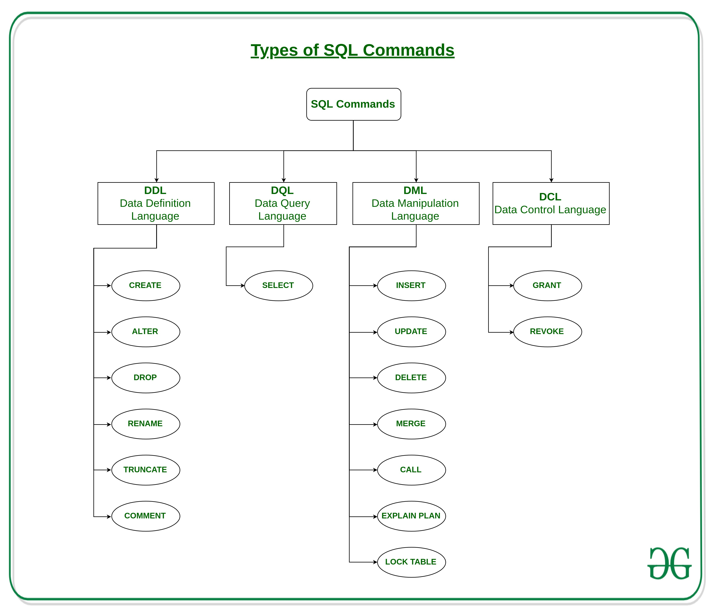

> @Date    : 2020-08-30 15:25:18
>
> @Author  : Lewis Tian (taseikyo@gmail.com)
>
> @Link    : github.com/taseikyo

# 数据库中 DQL、DML、DDL 与 DCL 的概念与区别

> 原文：https://www.cnblogs.com/kawashibara/p/8961646.html 2018-04-27 11:43 [张欣橙](https://www.cnblogs.com/kawashibara/)

昨天（20-8-29）农行笔试分三部分，第一部分是单选题，第二部分是编程，第三部分是性格测试。第一部分又分为若干部分，其中数据库的比重较大，很多数据库基础知识，如基本的 SQL 语句，数据库的范式等等，其中就考到了 DCL，原题不记得了，就是给出了几个命令（SELECT DROP REVOKE INSERT）哪一个属于 DCL，于是来搜一下数据库一共分哪几种语句，以及他们之间的区别。

## GFG

- https://www.geeksforgeeks.org/sql-ddl-dql-dml-dcl-tcl-commands/

来自 gfg 的图片，一下子归类好了，舒服！

### 1. DDL(Data Definition Language)

DDL or Data Definition Language actually consists of the SQL commands that can be used to define the database schema. It simply deals with descriptions of the database schema and is used to create and modify the structure of database objects in the database.

- CREATE - is used to create the database or its objects (like table, index, function, views, store procedure and triggers).
- DROP - is used to delete objects from the database.
- ALTER - is used to alter the structure of the database.
- TRUNCATE - is used to remove all records from a table, including all spaces allocated for the records are removed.
- COMMENT - is used to add comments to the data dictionary.
- RENAME - is used to rename an object existing in the database.

### 2. DQL (Data Query Language)

DML statements are used for performing queries on the data within schema objects. The purpose of DQL Command is to get some schema relation based on the query passed to it.

- SELECT - is used to retrieve data from the a database.

### 3. DML(Data Manipulation Language)

The SQL commands that deals with the manipulation of data present in the database belong to DML or Data Manipulation Language and this includes most of the SQL statements.

- INSERT - is used to insert data into a table.
- UPDATE - is used to update existing data within a table.
- DELETE - is used to delete records from a database table.

### 4. DCL(Data Control Language)

DCL includes commands such as GRANT and REVOKE which mainly deals with the rights, permissions and other controls of the database system.

- GRANT-gives user’s access privileges to database.
- REVOKE-withdraw user’s access privileges given by using the GRANT command.

### 5. TCL(transaction Control Language)

TCL commands deals with the transaction within the database.

- COMMIT - commits a Transaction.
- ROLLBACK - rollbacks a transaction in case of any error occurs.
- SAVEPOINT - sets a savepoint within a transaction.
- SET TRANSACTION - specify characteristics for the transaction.

## DDL

DDL(Data Definition Language 数据定义语言)用于操作对象和对象的属性，这种对象包括数据库本身，以及数据库对象，像：表、视图等等，DDL 对这些对象和属性的管理和定义具体表现在 Create、Drop 和 Alter 上。特别注意：DDL 操作的 “对象” 的概念，”对象“包括对象及对象的属性，而且对象最小也比记录大个层次。以表举例：Create 创建数据表，Alter 可以更改该表的字段，Drop 可以删除这个表，从这里我们可以看到，DDL 所站的高度，他不会对具体的数据进行操作。

**DDL 操作是隐性提交的，不能 rollback！**

### DDL 的主要语句 (操作)

Create 语句：可以创建数据库和数据库的一些对象。

Drop 语句：可以删除数据表、索引、触发程序、条件约束以及数据表的权限等。

Alter 语句：修改数据表定义及属性。

### DDL 的操作对象：表

1. 表的概念

表的创建就是用来存放数据用的，由于我们存放的数据的不通，所以我们需要定义些数据类型，以方便管理。

2. 表的属性

主键属性：主键就是主键约束，只不过起的名字不同了，主键的起名偏向于虚的 (就是描述描述这件事)，主键约束起名偏向于实得 (就是描述操作的实施)，描述的都是同一件事，主键约束就是表中的一个属性; 在一个表中最多可以有一个主键; 一个主键可以定义在一个或多个字段; 主键使一个或多个字段的值必须唯一且不为空，这样做可以通过该字段或该组字段中的值唯一的代表一条记录。

唯一属性：一个表中只能有一个主键属性，为了方表用户，提出唯一约束; 唯一约束可以定义在一个或多个字段上; 唯一约束使该字段或该组字段中的值唯一，可以为空，但是，不能重复。

外键属性：又叫外键，又叫外键约束，跟主键和主键约束的关系是一样的; 外键约束针对的两个表，如果表 A 的主关键字是表 B 中的字段，则该字段称为表 B 的外键，表 A 称为主表，表 B 称为从表，但要注意，必须要计算机要知道你是这种关系。

核查、Null 和缺省属性：核查属性又叫核查约束，Null 属性又叫 Null 约束，缺省属性又叫缺省约束; 这些名称是描述一件事，描述一种情况，这件事或这张情况我们当然可以人为的那样特意做 (输入数据是注意就行)，但是，他们的本意是实现自动化，也就是让计算机做这件事。

(你知道为什么建立主键和唯一约束的时候，会自动的创建索引吗? 而且是唯一索引，想一想索引大多在那些字段上用，以及索引的作用就会知道了。像主键约束、唯一约束、非空约束、外键约束、核查约束和缺省约束这些操作都是使表具有某些特性，所以在这里我认为他们都是表的属性。)

## DML

DML(Data Manipulation Language 数据操控语言) 用于操作数据库对象中包含的数据，也就是说操作的单位是记录。

### DML 的主要语句 (操作)

- Insert 语句：向数据表张插入一条记录。
- Delete 语句：删除数据表中的一条或多条记录，也可以删除数据表中的所有记录，但是，它的操作对象仍是记录。
- Update 语句：用于修改已存在表中的记录的内容。

### DML 的操作对象：记录

注意：当我们对记录进行 Insert、Delete 和 Update 操作的时候，一定要注意，一定要清楚 DDL 对其的一些操作。

### DCL

DCL(Data Control Language 数据控制语句) 的操作是数据库对象的权限，这些操作的确定使数据更加的安全。

### DCL 的主要语句 (操作)

- Grant 语句：允许对象的创建者给某用户或某组或所有用户 (PUBLIC) 某些特定的权限。
- Revoke 语句：可以废除某用户或某组或所有用户访问权限
- ROLLBACK [WORK] TO [SAVEPOINT]：回退到某一点

### DCL 的操作对象：用户

此时的用户指的是数据库用户

## DQL

DQL (Data Query Language 数据查询语言)

DQL 基本结构是由 SELECT 子句，FROM 子句，WHERE 子句组成的查询块：

SELECT <字段名表> FROM <表或视图名> WHERE <查询条件>