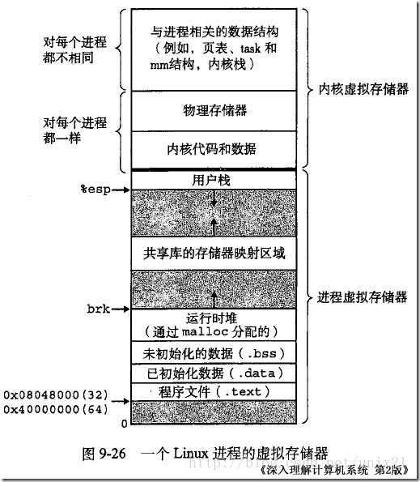
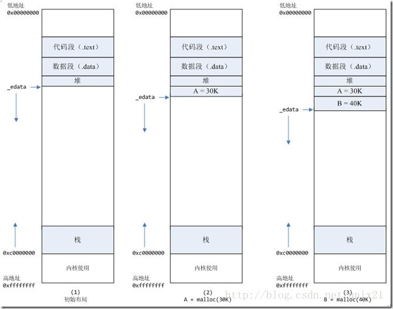
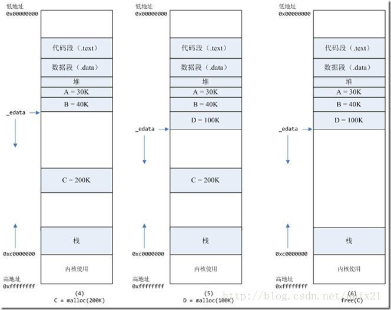
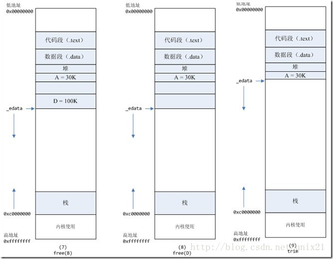

> @Date    : 2020-08-31 11:21:58
>
> @Author  : Lewis Tian (taseikyo@gmail.com)
>
> @Link    : github.com/taseikyo

# Linux 内存分配原理

> 原文：https://www.cnblogs.com/dongzhiquan/p/5621906.html 2016-06-27 23:23 [dzqabc](https://home.cnblogs.com/u/dongzhiquan/)

## Table of Contents

- [Linux 的虚拟内存管理有几个关键概念](#linux-的虚拟内存管理有几个关键概念)
- [一、Linux 虚拟地址空间如何分布？](#一linux-虚拟地址空间如何分布)
	- [32 位系统有 4G 的地址空间](#32-位系统有-4g-的地址空间)
	- [64 位系统结果怎样呢](#64-位系统结果怎样呢)
- [二、malloc 和 free 是如何分配和释放内存？](#二malloc-和-free-是如何分配和释放内存)
	- [如何查看进程发生缺页中断的次数？](#如何查看进程发生缺页中断的次数)
	- [发成缺页中断后，执行了那些操作？](#发成缺页中断后执行了那些操作)
	- [内存分配的原理](#内存分配的原理)
	- [下面以一个例子来说明内存分配的原理](#下面以一个例子来说明内存分配的原理)
	- [真相大白](#真相大白)
	- [解决办法](#解决办法)
- [三、如何查看堆内内存的碎片情况](#三如何查看堆内内存的碎片情况)
- [四、既然堆内内存 brk 和 sbrk 不能直接释放，为什么不全部使用 mmap 来分配，munmap 直接释放呢？](#四既然堆内内存-brk-和-sbrk-不能直接释放为什么不全部使用-mmap-来分配munmap-直接释放呢)
- [五、如何查看进程的缺页中断信息？](#五如何查看进程的缺页中断信息)
- [六、除了 glibc 的 malloc/free ，还有其他第三方实现吗？](#六除了-glibc-的-mallocfree-还有其他第三方实现吗)
- [参考资料](#参考资料)

也可以说是 malloc 的底层分配原理吧

### Linux 的虚拟内存管理有几个关键概念

Linux 虚拟地址空间如何分布？malloc 和 free 是如何分配和释放内存？如何查看堆内内存的碎片情况？既然堆内内存 brk 和 sbrk 不能直接释放，为什么不全部使用 mmap 来分配，munmap 直接释放呢 ？

1、每个进程都有独立的虚拟地址空间，进程访问的虚拟地址并不是真正的物理地址；  
2、虚拟地址可通过每个进程上的页表 (在每个进程的内核虚拟地址空间) 与物理地址进行映射，获得真正物理地址；  
3、如果虚拟地址对应物理地址不在物理内存中，则产生缺页中断，真正分配物理地址，同时更新进程的页表；如果此时物理内存已耗尽，则根据内存替换算法淘汰部分页面至物理磁盘中。 

## 一、Linux 虚拟地址空间如何分布？

Linux 使用虚拟地址空间，大大增加了进程的寻址空间，**由低地址到高地址分别为**：
1. 只读段：该部分空间只能读，不可写；(包括：代码段、rodata 段 (C 常量字符串和 #define 定义的常量) ) 
2. 数据段：保存全局变量、静态变量的空间；
3. 堆 ：就是平时所说的动态内存，malloc/new 大部分都来源于此。其中堆顶的位置可通过函数 brk 和 sbrk 进行动态调整。
4. 文件映射区域：如动态库、共享内存等映射物理空间的内存，一般是 mmap 函数所分配的虚拟地址空间。
5. 栈：用于维护函数调用的上下文空间，一般为 8M ，可通过 ulimit –s 查看。
6. 内核虚拟空间：用户代码不可见的内存区域，由内核管理 (页表就存放在内核虚拟空间)。

下图是 32 位系统典型的虚拟地址空间分布 (来自《深入理解计算机系统》)。



### 32 位系统有 4G 的地址空间

其中 0x08048000 ~ 0xbfffffff 是用户空间，0xc0000000 ~ 0xffffffff 是内核空间，包括内核代码和数据、与进程相关的数据结构（如页表、内核栈）等。另外，**%esp 执行栈顶，往低地址方向变化；brk/sbrk 函数控制堆顶_edata 往高地址方向变化**。

### 64 位系统结果怎样呢

64 位系统是否拥有 2^64 的地址空间吗？

事实上，64 位系统的虚拟地址空间划分发生了改变：

1. 地址空间大小不是 2^32，也不是 2^64，而一般是 2^48。

因为并不需要 2^64 这么大的寻址空间，过大空间只会导致资源的浪费。64 位 Linux 一般使用 48 位来表示虚拟地址空间，40 位表示物理地址

这可通过 `#cat /proc/cpuinfo` 来查看：


2. 其中，0x0000000000000000 ~ 0x00007fffffffffff 表示用户空间，0xFFFF800000000000 ~  0xFFFFFFFFFFFFFFFF 表示内核空间，共提供 256TB(2^48) 的寻址空间。这两个区间的特点是，第 47 位与 48 ~ 63 位相同，若这些位为 0 表示用户空间，否则表示内核空间。 

3. 用户空间由低地址到高地址仍然是**只读段、数据段、堆、文件映射区域和栈**；

## 二、malloc 和 free 是如何分配和释放内存？

### 如何查看进程发生缺页中断的次数？

用 `#ps -o majflt,minflt -C program` 命令查看


**majflt** **代表 major fault，中文名叫大错误，minflt 代表 minor fault，中文名叫小错误**。

**这两个数值表示一个进程自启动以来所发生的缺页中断的次数。**

可以用命令 ps -o majflt minflt -C program 来查看进程的 majflt, minflt 的值，这两个值都是累加值，从进程启动开始累加。在对高性能要求的程序做压力测试的时候，我们可以多关注一下这两个值。 
如果一个进程使用了 mmap 将很大的数据文件映射到进程的虚拟地址空间，我们需要重点关注 majflt 的值，因为相比 minflt，majflt 对于性能的损害是致命的，随机读一次磁盘的耗时数量级在几个毫秒，而 minflt 只有在大量的时候才会对性能产生影响。

### 发成缺页中断后，执行了那些操作？

当一个进程发生缺页中断的时候，进程会陷入内核态，执行以下操作：

1. 检查要访问的虚拟地址是否合法  
2. 查找 / 分配一个物理页  
3. 填充物理页内容（读取磁盘，或者直接置 0，或者啥也不干）  
4. 建立映射关系（虚拟地址到物理地址）

重新执行发生缺页中断的那条指令，如果第 3 步，需要读取磁盘，那么这次缺页中断就是 majflt，否则就是 minflt。

### 内存分配的原理

从操作系统角度来看，进程分配内存有两种方式，分别由两个系统调用完成：**brk 和 mmap（不考虑共享内存）。**

1. brk 是将数据段 (.data) 的最高地址指针_edata 往高地址推；
2. mmap 是在进程的虚拟地址空间中（堆和栈中间，称为文件映射区域的地方）找一块空闲的虚拟内存。

**这两种方式分配的都是虚拟内存，没有分配物理内存**。在第一次访问已分配的虚拟地址空间的时候，发生缺页中断，操作系统负责分配物理内存，然后建立虚拟内存和物理内存之间的映射关系。

在标准 C 库中，提供了 malloc/free 函数分配释放内存，这两个函数底层是由 brk，mmap，munmap 这些系统调用实现的。

### 下面以一个例子来说明内存分配的原理

情况一、malloc 小于 128k 的内存，使用 brk 分配内存，将_edata 往高地址推 (只分配虚拟空间，不对应物理内存 (因此没有初始化)，第一次读 / 写数据时，引起内核缺页中断，内核才分配对应的物理内存，然后虚拟地址空间建立映射关系)，如下图：



1. 进程启动的时候，其（虚拟）内存空间的初始布局如图 1 所示。

其中，**mmap 内存映射文件是在堆和栈的中间**（例如 libc-2.2.93.so，其它数据文件等），为了简单起见，省略了内存映射文件。

`_edata` 指针（glibc 里面定义）指向数据段的最高地址。

2. 进程调用 A=malloc(30K) 以后，内存空间如图 2：

malloc 函数会调用 brk 系统调用，将_edata 指针往高地址推 30K，就完成虚拟内存分配。

你可能会问：只要把_edata+30K 就完成内存分配了？

事实是这样的，`_edata+30K` 只是完成虚拟地址的分配，A 这块内存现在还是没有物理页与之对应的，等到进程第一次读写 A 这块内存的时候，发生缺页中断，这个时候，内核才分配 A 这块内存对应的物理页。**也就是说，如果用 malloc 分配了 A 这块内容，然后从来不访问它，那么，A 对应的物理页是不会被分配的。**

3. 进程调用 B=malloc(40K) 以后，内存空间如图 3。

情况二、malloc 大于 128k 的内存，使用 mmap 分配内存，在堆和栈之间找一块空闲内存分配 (对应独立内存，而且初始化为 0)，如下图：



4. 进程调用 C=malloc(200K) 以后，内存空间如图 4：

默认情况下，**malloc 函数分配内存，如果请求内存大于 128K（可由 M_MMAP_THRESHOLD 选项调节），那就不是去推_edata 指针了，而是利用 mmap 系统调用，从堆和栈的中间分配一块虚拟内存。**

这样子做主要是因为:

**brk 分配的内存需要等到高地址内存释放以后才能释放（例如，在 B 释放之前，A 是不可能释放的，这就是内存碎片产生的原因，什么时候紧缩看下面），而 mmap 分配的内存可以单独释放。**

当然，还有其它的好处，也有坏处，再具体下去，有兴趣的同学可以去看 glibc 里面 malloc 的代码了。

5. 进程调用 D=malloc(100K) 以后，内存空间如图 5；
6. 进程调用 free(C) 以后，C 对应的虚拟内存和物理内存一起释放。



7. 进程调用 free(B) 以后，如图 7 所示：B 对应的虚拟内存和物理内存都没有释放，因为只有一个_edata 指针，如果往回推，那么 D 这块内存怎么办呢？

当然，B 这块内存，是可以重用的，如果这个时候再来一个 40K 的请求，那么 malloc 很可能就把 B 这块内存返回回去了。

8. 进程调用 free(D) 以后，如图 8 所示：B 和 D 连接起来，变成一块 140K 的空闲内存。
9. 默认情况下：**当最高地址空间的空闲内存超过 128K（可由 M_TRIM_THRESHOLD 选项调节）时，执行内存紧缩操作（trim）。**在上一个步骤 free 的时候，发现最高地址空闲内存超过 128K，于是内存紧缩，变成图 9 所示。

### 真相大白

说完内存分配的原理，那么被测模块在内核态 cpu 消耗高的原因就很清楚了：每次请求来都 malloc 一块 2M 的内存，默认情况下，malloc 调用 mmap 分配内存，请求结束的时候，调用 munmap 释放内存。假设每个请求需要 6 个物理页，那么每个请求就会产生 6 个缺页中断，在 2000 的压力下，每秒就产生了 10000 多次缺页中断，这些缺页中断不需要读取磁盘解决，所以叫做 minflt；缺页中断在内核态执行，因此进程的内核态 cpu 消耗很大。缺页中断分散在整个请求的处理过程中，所以表现为分配语句耗时（10us）相对于整条请求的处理时间（1000us）比重很小。

### 解决办法

将动态内存改为静态分配，或者启动的时候，用 malloc 为每个线程分配，然后保存在 threaddata 里面。但是，由于这个模块的特殊性，静态分配，或者启动时候分配都不可行。另外，Linux 下默认栈的大小限制是 10M，如果在栈上分配几 M 的内存，有风险。

禁止 malloc 调用 mmap 分配内存，禁止内存紧缩。

在进程启动时候，加入以下两行代码：  
- mallopt(M_MMAP_MAX, 0); // 禁止 malloc 调用 mmap 分配内存
- mallopt(M_TRIM_THRESHOLD, -1); // 禁止内存紧缩

效果：加入这两行代码以后，用 ps 命令观察，压力稳定以后，majlt 和 minflt 都为 0。进程的系统态 cpu 从 20 降到 10。

## 三、如何查看堆内内存的碎片情况

glibc 提供了以下结构和接口来查看堆内内存和 mmap 的使用情况。 

```C
struct mallinfo {
  int arena;          /* non-mmapped space allocated from system */
  int ordblks;       /* number of free chunks */
  int smblks;        /* number of fastbin blocks */
  int hblks;           /* number of mmapped regions */
  int hblkhd;         /* space in mmapped regions */
  int usmblks;      /* maximum total allocated space */
  int fsmblks;       /* space available in freed fastbin blocks */
  int uordblks;      /* total allocated space */
  int fordblks;       /* total free space */
  int keepcost;     /* top-most, releasable (via malloc_trim) space */
};
```

```C++
// 返回 heap(main_arena) 的内存使用情况，以 mallinfo 结构返回
struct mallinfo mallinfo();

// 将 heap 和 mmap 的使用情况输出到 stderr
void malloc_stats();
```

可通过以下例子来验证 mallinfo 和 malloc_stats 输出结果。

```C++
#include <stdlib.h>
#include <stdio.h>
#include <string.h>
#include <unistd.h>
#include <sys/mman.h>
#include <malloc.h>

size_t heap_malloc_total, heap_free_total, mmap_total,
       mmap_count;

void print_info() {
  struct mallinfo mi = mallinfo();
  printf("count by itself:\n");
  printf("\theap_malloc_total=%lu heap_free_total=%lu heap_in_use=%lu\n\tmmap_total=%lu mmap_count=%lu\n",
         heap_malloc_total * 1024,
         heap_free_total * 1024,
         heap_malloc_total * 1024 - heap_free_total * 1024,
         mmap_total * 1024, mmap_count);
  printf("count by mallinfo:\n");
  printf("\theap_malloc_total=%lu heap_free_total=%lu heap_in_use=%lu\n\tmmap_total=%lu mmap_count=%lu\n",
         mi.arena, mi.fordblks, mi.uordblks,
         mi.hblkhd, mi.hblks);
  printf("from malloc_stats:\n");
  malloc_stats();
}

#define ARRAY_SIZE 200
int main(int argc, char** argv) {
  char** ptr_arr[ARRAY_SIZE];
  int i;
  for (i = 0; i < ARRAY_SIZE; i++) {
    ptr_arr[i] = malloc(i * 1024);
//glibc 默认 128k 以上使用 mmap
    if (i < 128) {
      heap_malloc_total += i;
    } else {
      mmap_total += i;
      mmap_count++;
    }
  }
  print_info();

  for (i = 0; i < ARRAY_SIZE; i++) {
    if (i % 2 == 0)
      continue;
    free(ptr_arr[i]);
    if (i < 128) {
      heap_free_total += i;
    } else {
      mmap_total -= i;
      mmap_count--;
    }
  }
  printf("\nafter free\n");
  print_info();

  return 1;
}
```

**第一个循环**为指针数组每个成员分配索引位置 (KB) 大小的内存块，并通过 128 为分界分别对 heap 和 mmap 内存分配情况进行计数；

**第二个循环**是 free 索引下标为奇数的项，同时更新计数情况。通过程序的计数与 mallinfo/malloc_stats 接口得到结果进行对比，并通过 print_info 打印到终端。

下面是一个执行结果：

```
count by itself:
  heap_malloc_total=8323072 heap_free_total=0 heap_in_use=8323072
  mmap_total=12054528 mmap_count=72
count by mallinfo:
  heap_malloc_total=8327168 heap_free_total=2032 heap_in_use=8325136
  mmap_total=12238848 mmap_count=72

from malloc_stats:  
Arena 0:  
system bytes     =    8327168  
in use bytes     =    8325136  
Total (incl. mmap):  
system bytes     =   20566016  
in use bytes     =   20563984  
max mmap regions =         72  
max mmap bytes   =   12238848

after free  
count by itself:  
        heap_malloc_total=8323072 heap_free_total=4194304 heap_in_use=4128768  
        mmap_total=6008832 mmap_count=36

count by mallinfo:  
        heap_malloc_total=8327168 heap_free_total=4197360 heap_in_use=4129808  
        mmap_total=6119424 mmap_count=36

from malloc_stats:  
Arena 0:  
system bytes     =    8327168  
in use bytes     =    4129808  
Total (incl. mmap):  
system bytes     =   14446592  
in use bytes     =   10249232  
max mmap regions =         72  
max mmap bytes   =   12238848
```

由上可知，程序统计和 mallinfo 得到的信息基本吻合，其中 heap_free_total 表示堆内已释放的内存碎片总和。

**如果想知道堆内究竟有多少碎片，可通过 mallinfo 结构中的 fsmblks 、smblks 、ordblks 值得到，这些值表示不同大小区间的碎片总个数，这些区间分别是 0~80 字节，80~512 字节，512~128k**。如果 fsmblks、smblks 的值过大，那碎片问题可能比较严重了。

不过，mallinfo 结构有一个很致命的问题，就是其成员定义全部都是 int ，在 64 位环境中，其结构中的 uordblks/fordblks/arena/usmblks 很容易就会导致溢出，应该是历史遗留问题，使用时要注意！

## 四、既然堆内内存 brk 和 sbrk 不能直接释放，为什么不全部使用 mmap 来分配，munmap 直接释放呢？

既然堆内碎片不能直接释放，导致疑似 “内存泄露” 问题，为什么 malloc 不全部使用 mmap 来实现呢(mmap 分配的内存可以会通过 munmap 进行 free ，实现真正释放)？而是仅仅对于大于 128k 的大块内存才使用 mmap ？

其实，进程向 OS 申请和释放地址空间的接口 sbrk/mmap/munmap 都是系统调用，频繁调用系统调用都比较消耗系统资源的。并且，mmap 申请的内存被 munmap 后，重新申请会产生更多的缺页中断。例如使用 mmap 分配 1M 空间，第一次调用产生了大量缺页中断 (1M/4K 次) ，当 munmap 后再次分配 1M 空间，会再次产生大量缺页中断。**缺页中断是内核行为，会导致内核态 CPU 消耗较大。**另外，如果使用 mmap 分配小内存，会导致地址空间的分片更多，内核的管理负担更大。

**同时堆是一个连续空间，并且堆内碎片由于没有归还 OS ，如果可重用碎片，再次访问该内存很可能不需产生任何系统调用和缺页中断，这将大大降低 CPU 的消耗**。因此，glibc 的 malloc 实现中，充分考虑了 sbrk 和 mmap 行为上的差异及优缺点，默认分配大块内存 (128k) 才使用 mmap 获得地址空间，也可通过 mallopt(M_MMAP_THRESHOLD, <SIZE>) 来修改这个临界值。

## 五、如何查看进程的缺页中断信息？

可通过以下命令查看缺页中断信息  

```bash
ps -o majflt,minflt -C <program_name>
ps -o majflt,minflt -p <pid>
```

其中 majflt 代表 major fault ，指大错误；minflt 代表 minor fault，指小错误。

这两个数值表示一个进程自启动以来所发生的缺页中断的次数。 
其中 majflt 与 minflt 的不同是：

majflt 表示需要读写磁盘，可能是内存对应页面在磁盘中需要 load 到物理内存中，也可能是此时物理内存不足，需要淘汰部分物理页面至磁盘中。

参看：http://blog.163.com/xychenbaihu@yeah/blog/static/132229655201210975312473/

## 六、除了 glibc 的 malloc/free ，还有其他第三方实现吗？

其实，很多人开始诟病 glibc 内存管理的实现，特别是高并发性能低下和内存碎片化问题都比较严重，因此，陆续出现一些第三方工具来替换 glibc 的实现，最著名的当属 google 的 tcmalloc 和 facebook 的 jemalloc。

网上有很多资源，可以自己查 (只用使用第三方库，代码不用修改，就可以使用第三方库中的 malloc)。

## 参考资料

- 《深入理解计算机系统》第 10 章
- http://www.kernel.org/doc/Documentation/x86/x86_64/mm.txt
- https://www.ibm.com/developerworks/cn/linux/l-lvm64/
- http://www.kerneltravel.net/journal/v/mem.htm
- http://blog.csdn.net/baiduforum/article/details/6126337
- http://www.nosqlnotes.net/archives/105
- http://www.man7.org/linux/man-pages/man3/mallinfo.3.html

```C++
#include <malloc.h>
#include <string.h>
#include <stdlib.h>
#include <iostream>

static void
display_mallinfo(void) {
  struct mallinfo mi;

  mi = mallinfo();

  printf("Total non-mmapped bytes (arena):       %d\\n",
         mi.arena);
  printf("# of free chunks (ordblks):            %d\\n",
         mi.ordblks);
  printf("# of free fastbin blocks (smblks):     %d\\n",
         mi.smblks);
  printf("# of mapped regions (hblks):           %d\\n",
         mi.hblks);
  printf("Bytes in mapped regions (hblkhd):      %d\\n",
         mi.hblkhd);
  printf("Max. total allocated space (usmblks):  %d\\n",
         mi.usmblks);
  printf("Free bytes held in fastbins (fsmblks): %d\\n",
         mi.fsmblks);
  printf("Total allocated space (uordblks):      %d\\n",
         mi.uordblks);
  printf("Total free space (fordblks):           %d\\n",
         mi.fordblks);
  printf("Topmost releasable block (keepcost):   %d\\n",
         mi.keepcost);
}

int
main(int argc, char *argv[]) {
#define MAX_ALLOCS 2000000
  char *alloc[MAX_ALLOCS];
  int numBlocks, j, freeBegin, freeEnd, freeStep;
  size_t blockSize;

  if (argc < 3 || strcmp(argv[1], "--help") == 0) {
    printf("%s num-blocks block-size [free-step [start-free "
           "[end-free]]]\\n", argv[0]);
    return 0;
  }
  numBlocks = atoi(argv[1]);
  blockSize = atoi(argv[2]);
  freeStep = (argc > 3) ? atoi(argv[3]) : 1;
  freeBegin = (argc > 4) ? atoi(argv[4]) : 0;
  freeEnd = (argc > 5) ? atoi(argv[5]) : numBlocks;

  printf("============== Before allocating blocks ==============\\n");
  display_mallinfo();

  for (j = 0; j < numBlocks; j++) {
    if (numBlocks >= MAX_ALLOCS)
      std::cout << "Too many allocations" << std::endl;

    alloc[j] = (char *)malloc(blockSize);
    if (alloc[j] == NULL)
      std::cout << "malloc" << std::endl;
  }

  printf("\\n============== After allocating blocks ==============\\n");
  display_mallinfo();

  for (j = freeBegin; j < freeEnd; j += freeStep) {
    free(alloc[j]);
  }
  printf("\\n============== After freeing blocks ==============\\n");
  display_mallinfo();

  exit(EXIT_SUCCESS);
}
```

===================== 上面是拷贝别人的基础知识，有了基础才好继续领悟 ========================

1. 通过 gdb 查找 main 的栈起始地址（可以考虑增加一个全局变量，在它调用构造函数时记录下其地址。）

操作系统栈的地址分配是每个程序分配 127T(64 位) 虚拟内存，程序看到的只是虚拟地址，任何程序线程栈入口都是接近 0x7fffffffffff（由 0x7fffffffffff 加上一个随机值）。进入 main 函数时的栈指针并不是真正栈起始地址，因为编译器添加的其他准备代码处理在调用到 main 之前已经消耗一部分的栈空间。

2. 进一步考虑

由于虚拟内存的存在，系统整理内存也就成为可能。分析即使系统内存整理调整后，虚拟内存的地址也不会变，各个线程的栈内存也应该不会发生变化，只是每个内存页对应的物理内存发生变化。进程启动后增加各个线程栈起始地址打印，应该可以用于某些 core 之后无栈问题的定位。