> @Date    : 2020-08-31 10:18:52
>
> @Author  : Lewis Tian (taseikyo@gmail.com)
>
> @Link    : github.com/taseikyo

> 本文由 [简悦 SimpRead](http://ksria.com/simpread/) 转码， 原文地址 [blog.csdn.net](https://blog.csdn.net/u012410733/article/details/63684663) [carl-zhao](https://me.csdn.net/u012410733) 2017-03-19 14:49:07

# mysql 的几种 join

之前学习 mysql 的时候对于老师说的左连接，右连接… 之类的概念一直不清楚，模模糊糊的。工作之后理解这些名词一概念，现在把它记录一下。也希望能够帮助对于 mysql 中 join 不太清晰的朋友。这样可以根据自己的业务场景选择合适的 join 语句。

**初始化 SQL 语句:**

```SQL
/*join 建表语句*/
drop database if exists test;
create database test;
use test;

/* 左表t1*/
drop table if exists t1;
create table t1 (id int not null,name varchar(20));
insert into t1 values (1,'t1a');
insert into t1 values (2,'t1b');
insert into t1 values (3,'t1c');
insert into t1 values (4,'t1d');
insert into t1 values (5,'t1f');

/* 右表 t2*/
drop table if exists t2;
create table t2 (id int not null,name varchar(20));
insert into t2 values (2,'t2b');
insert into t2 values (3,'t2c');
insert into t2 values (4,'t2d');
insert into t2 values (5,'t2f');
insert into t2 values (6,'t2a');
```

### 1、笛卡尔积

两表关联，把左表的列和右表的列通过笛卡尔积的形式表达出来。

```SQL
mysql> select * from t1 join t2;
```

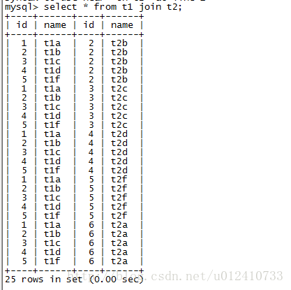

### 2、左连接

两表关联，左表全部保留，右表关联不上用 null 表示。

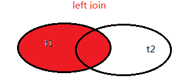

```SQL
mysql> select * from t1 left join t2 on t1.id = t2.id;
```

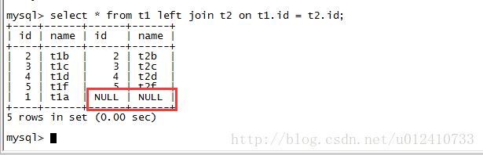

### 3、右连接

右表全部保留，左表关联不上的用 null 表示。

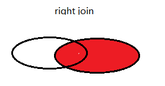

```SQL
mysql> select * from t1 right join t2 on t1.id =t2.id;
```

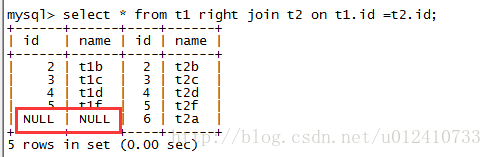

### 4、内连接

两表关联，保留两表中交集的记录。

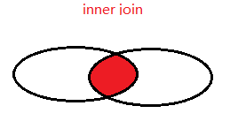

```SQL
mysql> select * from t1 inner join t2 on t1.id = t2.id;
```

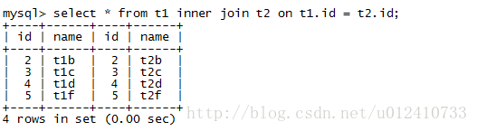

### 5、左表独有

两表关联，查询左表独有的数据。

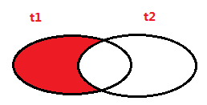

```SQL
mysql> select * from t1 left join t2 on t1.id = t2.id where t2.id is null;
```

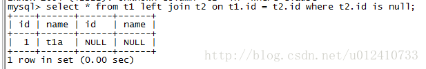

### 6、右表独有

两表关联，查询右表独有的数据。

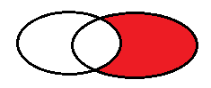

```SQL
mysql> select * from t1 right join t2 on t1.id = t2.id where t1.id is  null;
```

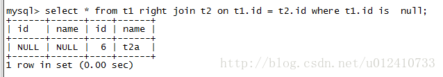

### 7、全连接

两表关联，查询它们的所有记录。


oracle 里面有 full join, 但是在 mysql 中没有 full join。我们可以使用 union 来达到目的。

```SQL
mysql> select * from t1 left join t2 on t1.id = t2.id
    -> union 
    -> select * from t1 right join t2 on t1.id = t2.id;
```

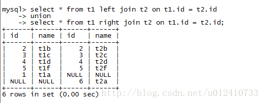

### 8、并集去交集

两表关联，取并集然后去交集。


```SQL
mysql> select * from t1 left join t2 on t1.id = t2.id where t2.id is null
    -> union 
    -> select * from t1 right join t2 on t1.id = t2.id where t1.id is null;
```

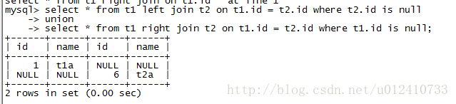