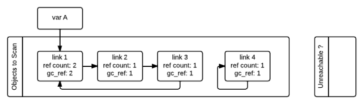
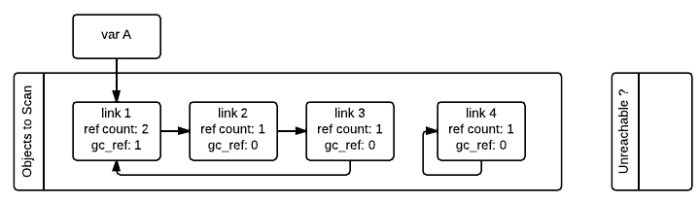
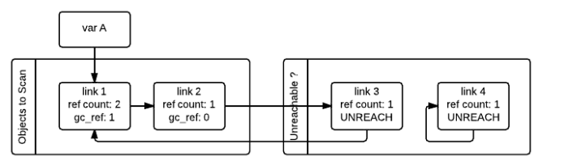
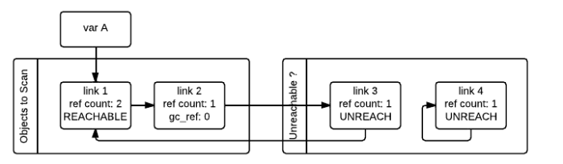
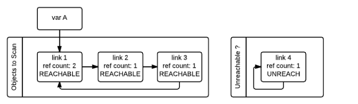

> @Date    : 2020-09-14 17:37:23
>
> @Author  : Lewis Tian (taseikyo@gmail.com)
>
> @Link    : github.com/taseikyo

# 聊聊Python内存管理

> 原文：https://andrewpqc.github.io/2018/10/08/python-memory-management/ 作者：[Andrew](https://andrewpqc.github.io/) 2018-10-08

python 作为一门解释型语言，以代码简洁易懂著称。我们可以直接对名称赋值，而不必声明类型。名称类型的确定、内存空间的分配与释放都是由 python 解释器在运行时自动进行的。python 这一自动管理内存功能极大的减小了程序员负担，这也是成就 python 自身的重要原因之一。所以，这一篇文章我们就聊一聊 python 的内存管理。

Python 中，主要通过**引用计数（Reference Counting）**进行垃圾回收。

```C
typedef struct_object {
    int ob_refcnt;
    struct_typeobject *ob_type;
} PyObject;
```

在 Python 中每一个对象的核心就是一个结构体 PyObject，它的内部有一个引用计数器（ob_refcnt）。程序在运行的过程中会实时的更新 ob_refcnt 的值，来反映引用当前对象的名称数量。当某对象的引用计数值为 0，那么它的内存就会被立即释放掉。  
以下情况是导致引用计数加一的情况:

- 对象被创建，例如 a=2
- 对象被引用，b=a
- 对象被作为参数，传入到一个函数中
- 对象作为一个元素，存储在容器中

下面的情况则会导致引用计数减一:

- 对象别名被显示销毁 del
- 对象别名被赋予新的对象
- 一个对象离开他的作用域
- 对象所在的容器被销毁或者是从容器中删除对象

我们还可以通过 sys 包中的`getrefcount()`来获取一个名称所引用的对象当前的引用计数 (注意，这里 getrefcount() 本身会使得引用计数加一)

```python
sys.getrefcount(a)
```

引用计数法有其明显的优点，如高效、实现逻辑简单、具备实时性，一旦一个对象的引用计数归零，内存就直接释放了。不用像其他机制等到特定时机。将垃圾回收随机分配到运行的阶段，处理回收内存的时间分摊到了平时，正常程序的运行比较平稳。但是，引用计数也存在着一些缺点，通常的缺点有：

- 逻辑简单，但实现有些麻烦。每个对象需要分配单独的空间来统计引用计数，这无形中加大的空间的负担，并且需要对引用计数进行维护，在维护的时候很容易会出错。
- 在一些场景下，可能会比较慢。正常来说垃圾回收会比较平稳运行，但是当需要释放一个大的对象时，比如字典，需要对引用的所有对象循环嵌套调用，从而可能会花费比较长的时间。
- 循环引用。这将是引用计数的致命伤，引用计数对此是无解的，因此必须要使用其它的垃圾回收算法对其进行补充。

也就是说，Python 的垃圾回收机制，很大一部分是为了处理可能产生的循环引用，是对引用计数的补充。

Python 采用了 **"标记 - 清除"(Mark and Sweep)** 算法，解决容器对象可能产生的循环引用问题。(注意，只有容器对象才会产生循环引用的情况，比如列表、字典、用户自定义类的对象、元组等。而像数字，字符串这类简单类型不会出现循环引用。作为一种优化策略，对于只包含简单类型的元组也不在标记清除算法的考虑之列)

跟其名称一样，该算法在进行垃圾回收时分成了两步，分别是：

- A）标记阶段，遍历所有的对象，如果是可达的（reachable），也就是还有对象引用它，那么就标记该对象为可达；
- B）清除阶段，再次遍历对象，如果发现某个对象没有标记为可达，则就将其回收。

如下图所示，在标记清除算法中，为了追踪容器对象，需要每个容器对象维护两个额外的指针，用来将容器对象组成一个双端链表，指针分别指向前后两个容器对象，方便插入和删除操作。python 解释器 (Cpython) 维护了两个这样的双端链表，一个链表存放着需要被扫描的容器对象，另一个链表存放着临时不可达对象。在图中，这两个链表分别被命名为 "Object to Scan" 和 "Unreachable"。图中例子是这么一个情况：link1，link2，link3 组成了一个引用环，同时 link1 还被一个变量 A(其实这里称为名称 A 更好)引用。link4 自引用，也构成了一个引用环。从图中我们还可以看到，每一个节点除了有一个记录当前引用计数的变量`ref_count`还有一个`gc_ref`变量，这个`gc_ref`是`ref_count`的一个副本，所以初始值为`ref_count`的大小。



gc 启动的时候，会逐个遍历"Object to Scan" 链表中的容器对象，并且将当前对象所引用的所有对象的`gc_ref`减一。(扫描到 link1 的时候，由于 link1 引用了 link2，所以会将 link2 的`gc_ref`减一，接着扫描 link2，由于 link2 引用了 link3，所以会将 link3 的`gc_ref`减一…..) 像这样将"Objects to Scan" 链表中的所有对象考察一遍之后，两个链表中的对象的`ref_count`和`gc_ref`的情况如下图所示。这一步操作就相当于解除了循环引用对引用计数的影响。



接着，gc 会再次扫描所有的容器对象，如果对象的`gc_ref`值为 0，那么这个对象就被标记为`GC_TENTATIVELY_UNREACHABLE`，并且被移至"Unreachable" 链表中。下图中的 link3 和 link4 就是这样一种情况。



如果对象的`gc_ref`不为 0，那么这个对象就会被标记为`GC_REACHABLE`。同时当 gc 发现有一个节点是可达的，那么他会递归式的将从该节点出发可以到达的所有节点标记为`GC_REACHABLE`，这就是下图中 link2 和 link3 所碰到的情形。



除了将所有可达节点标记为`GC_REACHABLE`之外，如果该节点当前在"Unreachable" 链表中的话，还需要将其移回到"Object to Scan" 链表中，下图就是 link3 移回之后的情形。



第二次遍历的所有对象都遍历完成之后，存在于"Unreachable" 链表中的对象就是真正需要被释放的对象。如上图所示，此时 link4 存在于 Unreachable 链表中，gc 随即释放之。

**上面描述的垃圾回收的阶段，会暂停整个应用程序，等待标记清除结束后才会恢复应用程序的运行。**

在循环引用对象的回收中，整个应用程序会被暂停，为了减少应用程序暂停的时间，Python 通过 **"分代回收"(Generational Collection)** 以空间换时间的方法提高垃圾回收效率。

分代回收是基于这样的一个统计事实，**对于程序，存在一定比例的内存块的生存周期比较短；而剩下的内存块，生存周期会比较长，甚至会从程序开始一直持续到程序结束。生存期较短对象的比例通常在 80%～90% 之间，这种思想简单点说就是：对象存在时间越长，越可能不是垃圾，应该越少去收集。这样在执行标记 - 清除算法时可以有效减小遍历的对象数，从而提高垃圾回收的速度。**

python gc 给对象定义了三种世代 (0,1,2)，每一个新生对象在 generation zero 中，如果它在一轮 gc 扫描中活了下来，那么它将被移至 generation one，在那里他将较少的被扫描，如果它又活过了一轮 gc，它又将被移至 generation two，在那里它被扫描的次数将会更少。

gc 的扫描在什么时候会被触发呢? 答案是**当某一世代中被分配的对象与被释放的对象之差达到某一阈值的时候，就会触发 gc 对某一世代的扫描。**值得注意的是**当某一世代的扫描被触发的时候，比该世代年轻的世代也会被扫描。**也就是说如果世代 2 的 gc 扫描被触发了，那么世代 0，世代 1 也将被扫描，如果世代 1 的 gc 扫描被触发，世代 0 也会被扫描。

该阈值可以通过下面两个函数查看和调整:

```c
gc.get_threshold() # (threshold0, threshold1, threshold2).
gc.set_threshold(threshold0[, threshold1[, threshold2]])
```

下面对 set_threshold() 中的三个参数 threshold0，threshold1，threshold2 进行介绍。gc 会记录自从上次收集以来新分配的对象数量与释放的对象数量，当两者之差超过 threshold0 的值时，gc 的扫描就会启动，初始的时候只有世代 0 被检查。如果自从世代 1 最近一次被检查以来，世代 0 被检查超过 threshold1 次，那么对世代 1 的检查将被触发。相同的，如果自从世代 2 最近一次被检查以来，世代 1 被检查超过 threshold2 次，那么对世代 2 的检查将被触发。get_threshold() 是获取三者的值，默认值为 (700,10,10).

**总体来说，在 Python 中，主要通过引用计数进行垃圾回收；通过 "标记 - 清除" 解决容器对象可能产生的循环引用问题；通过 "分代回收" 以空间换时间的方法提高垃圾回收效率。**

参考：

- https://docs.python.org/2/library/gc.html
- https://rushter.com/blog/python-garbage-collector/
- https://pythoninternal.wordpress.com/2014/08/04/the-garbage-collector/
- https://www.quora.com/How-does-garbage-collection-in-Python-work-What-are-the-pros-and-cons