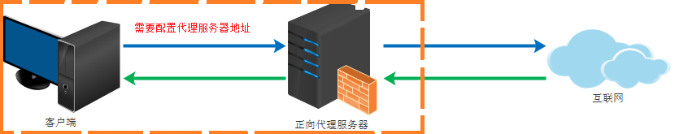
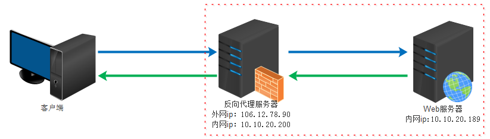
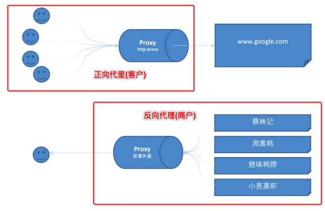
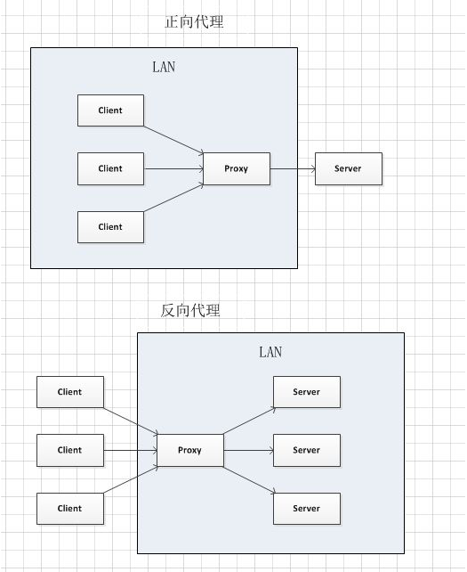

> @Date    : 2020-09-06 17:01:22
>
> @Author  : Lewis Tian (taseikyo@gmail.com)
>
> @Link    : github.com/taseikyo

# 正向代理与反向代理的区别

> 本文由 [简悦 SimpRead](http://ksria.com/simpread/) 转码， 原文地址 [www.cnblogs.com](https://www.cnblogs.com/taostaryu/p/10547132.html)

## Table of Contents

- [一 什么是代理](#一-什么是代理)
- [二 正向代理](#二-正向代理)
- [三 反向代理](#三-反向代理)
- [四 总结](#四-总结)
	- [看图理解一](#看图理解一)
	- [看图理解二](#看图理解二)
	- [总结](#总结)

## 一 什么是代理

代理其实就是一个中介，A 和 B 本来可以直连，中间插入一个 C，C 就是中介。  
刚开始的时候，代理多数是帮助内网 client 访问外网 server 用的  
后来出现了反向代理，"反向" 这个词在这儿的意思其实是指方向相反，即代理将来自外网客户端的请求转发到内网服务器，从外到内

## 二 正向代理

正向代理类似一个跳板机，代理访问外部资源

比如我们国内访问谷歌，直接访问访问不到，我们可以通过一个正向代理服务器，请求发到代理服，代理服务器能够访问谷歌，这样由代理去谷歌取到返回数据，再返回给我们，这样我们就能访问谷歌了

正向代理的用途：

1. 访问原来无法访问的资源，如 google
2. 可以做缓存，加速访问资源
3. 对客户端访问授权，上网进行认证
4. 代理可以记录用户访问记录（上网行为管理），对外隐藏用户信息

## 三 反向代理

反向代理（Reverse Proxy）实际运行方式是指以代理服务器来接受 internet 上的连接请求，然后将请求转发给内部网络上的服务器，并将从服务器上得到的结果返回给 internet 上请求连接的客户端，此时代理服务器对外就表现为一个服务器

反向代理的作用

1. 保证内网的安全，阻止 web 攻击，大型网站，通常将反向代理作为公网访问地址，Web 服务器是内网
2. 负载均衡，通过反向代理服务器来优化网站的负载

## 四 总结

正向代理即是客户端代理，代理客户端，服务端不知道实际发起请求的客户端。

  
反向代理即是服务端代理，代理服务端，客户端不知道实际提供服务的服务端

### 看图理解一

### 看图理解二

- 正向代理中，proxy 和 client 同属一个 LAN，对 server 透明；  
- 反向代理中，proxy 和 server 同属一个 LAN，对 client 透明。  
- 实际上 proxy 在两种代理中做的事都是代为收发请求和响应，不过从结构上来看正好左右互换了下，所以把后出现的那种代理方式叫成了反向代理

### 总结

- 正向代理: 买票的黄牛
- 反向代理: 租房的代理