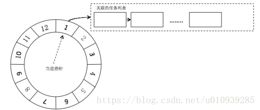

> @Date    : 2020-09-02 11:18:23
>
> @Author  : Lewis Tian (taseikyo@gmail.com)
>
> @Link    : github.com/taseikyo

# 时间轮定时器简介

今天看到一个面试题【讲一下时间轮定时器实现的数据结构？】，又懵逼了，到处都是知识盲区 ;O

找了两篇 CSDN 博客和一篇英文博客，CSDN 主要是介绍时间轮定时器怎么做的，以及多级定时器怎么做。英文的博客则介绍了 7 中定时器

## Table of Contents

- [时间轮定时器简介](#时间轮定时器简介)
- [时间轮](#时间轮)
	- [简述](#简述)
	- [代码分析](#代码分析)
	- [代码实现（含注释）](#代码实现（含注释）)
- [基于时间轮的定时器方案设计](#基于时间轮的定时器方案设计)
	- [一．时间轮简介](#一．时间轮简介)
	- [二．设计方案](#二．设计方案)
- [Hashed and Hierarchical Timing Wheels: Data Structures for the Efficient Implementation of a Timer Facility](#hashed-and-hierarchical-timing-wheels:-data-structures-for-the-efficient-implementation-of-a-timer-facility)
	- [1. Unordered Timer List](#1.-unordered-timer-list)
	- [2. Ordered Timer List](#2.-ordered-timer-list)
	- [3. Timer Trees](#3.-timer-trees)
	- [4. Simple Timing Wheels](#4.-simple-timing-wheels)
	- [5. Hashing Wheel with Ordered Timer Lists](#5.-hashing-wheel-with-ordered-timer-lists)
	- [6. Hashing Wheel with Unordered Timer Lists](#6.-hashing-wheel-with-unordered-timer-lists)
	- [7. Hierarchical Timing Wheels](#7.-hierarchical-timing-wheels)
	- [Choosing between schemes 6 and 7…](#choosing-between-schemes-6-and-7…)

## 时间轮

> 本文由 [简悦 SimpRead](http://ksria.com/simpread/) 转码， 原文地址 [blog.csdn.net](https://blog.csdn.net/liushall/article/details/81316863) [niliushall.](https://blog.csdn.net/liushall) 2018-07-31 17:08:21

### 简述

顾名思义，时间轮就像一个轮子，在转动的时候外界会指向轮子不同的区域，该区域就可以被使用。因此只要将不同时间的定时器按照一定的方法散列到时间轮的不同槽（即时间轮划分的区域）之中，就可以实现在运转到某个槽时，进行判断该定时器是否已经到达运行时间（需要判断是由于有的定时器并非在这一圈就需要运行，可能需要后面几圈才会运行。


从图中也可以看出，每个槽中的定时器是以（双向）链表形式存储的，每次添加的时候直接插入到链表的开始（头插法）。值得注意的是，由于使用头插法，因此在运行到某个槽时，需要遍历一遍链表，已检查是否有到达时间的计时器，有的话就运行，并删除结点。

至于在每转到一个槽时都要检查是否到达运行时间，可以这样理解：时间轮进行散列的方法就是取余运算，假设每个槽的间隔为 1s，共有 n 个槽，当前转到了第 cur 个槽，那么一个定时在 t s 以后运行的定时器就要放在第 `（ cur + t % n ） % n` 个槽，并在运行 `t / n` 圈后到达该槽时才会运行。因此一个槽中的定时器运行的时间是相差 i（i >= 0）个周期的。

所以时间轮简单来说就是 `散列 + 链表`，这样与使用升序链表相比，散列可以直接定位要插入的槽所在位置，可以提高添加定时器的效率，由 O(N) 到了 O(1)。

对实现时间轮来说，最主要的还是链表的操作是否熟练，当然也主要是双向链表的添加与删除。

### 代码分析

* 记录定时器的时间信息，从而获取在时间轮中槽的位置，以及在多少圈之后被触发。在定时时间不足槽之间切换的时间时，要将 t/n 记为 1，否则记录 t/n 的整除结果。

```C++
// timeout为定时时间，SI为槽之间切换的时间
int ticks;
if ( timeout < SI ) {
    ticks = 1;
} else {
    ticks = timeout / SI;
}

int rotation = ticks / N;  // 被触发的圈数
int ts = ( cur_slot + ticks % N ) % N;  // 被插入的槽
```

* 为提高定时器的添加效率，使用头插法，将定时器添加在槽的开始位置。
* 使用双向链表，需要注意将后面的结点的 `pre` 指向前一个结点。
* 删除链表时要注意结点是否是第一个结点

### 代码实现（含注释）

```C++
#ifndef _TIMEWHEEL_H_
#define _TIMEWHEEL_H_

#include <time.h>
#include <netinet/in.h>

const int BUFFER_SIZE = 64;

class TwTimer;

// 用户数据，绑定socket和定时器
struct client_data {
    sockaddr_in address;
    int sock_fd;
    char buf[BUFFER_SIZE];
    TwTimer* timer;
};

// 定时器类，时间轮采用双向链表
class TwTimer {
  public:
    int rotation;  // 定时器转多少圈后生效
    int time_slot;  // 记录定时器属于时间轮的哪个时间槽
    client_data* user_data;  // 客户数据
    TwTimer* next;  // 指向下一个定时器
    TwTimer* pre;  // 指向上一个定时器
  public:
    TwTimer( int rot, int ts ) : rotation(rot), time_slot(ts),
        next(NULL), pre(NULL) {}
    void (*cb_func)( client_data * );  // 回调函数
};

class TimeWheel {
  private:
    static const int N = 60;  // 槽的数目
    static const int SI = 1;  // 定时器槽之间时间间隔
    TwTimer* slot[ N ];  // 时间轮的槽，指向一个定时器链表，链表无序
    int cur_slot;  // 当前槽
  public:
    TimeWheel() : cur_slot(0) {
        for ( int i = 0; i < N; i++ ) {
            slot[i] = NULL;
        }
    }

    ~TimeWheel() {
        for ( int i = 0; i < N; i++ ) {
            TwTimer* tmp;
            while ( tmp = slot[i], tmp ) {
                slot[i] = tmp->next;
                delete tmp;
            }
        }
    }

    TwTimer* add_timer( int
                        timeout );  // 根据定时值创建定时器，并插入槽中
    void del_timer( TwTimer* timer );
    void tick();
};

TwTimer* TimeWheel::add_timer( int timeout ) {
    if ( timeout < 0 ) {
        return NULL;
    }

    // 记录多少个tick后被触发，不足最小单位SI的记为1，其余为timeout/SI
    int ticks = 0;
    if ( timeout < SI ) {
        ticks = 1;
    } else {
        ticks = timeout / SI;
    }

    int rotation = ticks / N;  // 被触发的圈数
    int ts = ( cur_slot + ticks % N ) % N;  // 被插入的槽
    TwTimer* timer = new TwTimer( rotation, ts );

    // 如果链表为空，则放到头，否则插入到第一个位置
    if ( !slot[ts] ) {
        slot[ts] = timer;
    } else {
        timer->next = slot[ts];
        slot[ts]->pre = timer;
        slot[ts] = timer;
    }

    return timer;
}


// 删除定时器
void TimeWheel::del_timer( TwTimer* timer ) {
    if ( !timer ) {
        return;
    }

    // 注意链表为双向的
    int ts = timer->time_slot;
    if ( timer == slot[ts] ) {
        slot[ts] = slot[ts]->next;
        if ( slot[ts] ) {
            slot[ts]->pre = NULL;
        }
    } else {
        timer->pre->next = timer->next;
        if ( timer->next ) {
            timer->next->pre = timer->pre;
        }
    }
    delete timer;
}

// SI时间到后，条用该函数，时间轮向前滚动一个槽的间隔
void TimeWheel::tick() {
    TwTimer* tmp = slot[cur_slot];
    while ( tmp ) {
        if ( tmp->rotation > 0 ) { // 定时时间未到
            tmp->rotation--;
            tmp = tmp->next;
        } else {  // 定时时间已到
            tmp->cb_func( tmp->user_data );
            if ( tmp == slot[cur_slot] ) { // tmp位于链表首
                slot[cur_slot] = tmp->next;
                if ( slot[cur_slot] ) {
                    slot[cur_slot]->pre = NULL;
                }
                delete tmp;
                tmp = slot[cur_slot];
            } else {  // tmp位于链表中
                tmp->pre->next = tmp->next;
                if ( tmp->next ) {
                    tmp->next->pre = tmp->pre;
                }
                TwTimer* tmp2 = tmp->next;
                delete tmp;
                tmp = tmp2;
            }
        }
    }
    cur_slot = ( cur_slot + 1 ) % N;
}

#endif
```


## 基于时间轮的定时器方案设计

> 本文由 [简悦 SimpRead](http://ksria.com/simpread/) 转码， 原文地址 [blog.csdn.net](https://blog.csdn.net/u010939285/article/details/80049412) [鲸落1024](https://me.csdn.net/u010939285) 2018-04-23 13:42:08

### 一．时间轮简介

时间轮简介：时间轮方案将现实生活中的时钟概念引入到软件设计中，主要思路是定义一个时钟周期（比如时钟的 12 小时）和步长（比如时钟的一秒走一次），当指针每走一步的时候，会获取当前时钟刻度上挂载的任务并执行:

### 二．设计方案

1. 单层时间轮设计：如图  



以上图为例，假设一个格子为 1 秒，整个一圈表示的时间为 12 秒，此时需要添加 5 秒后执行的任务，则此时改任务一个放到第（1+5=6）的格子内，如果此时添加 13 秒后执行任务，此时该任务应该等转完一圈后 round 为 1 放到第二格子中，指针每转动一个一格，获取当前 round 为 0 的任务执行，格子上的其他任务 round 减 1  
问题：当时间跨度很大，数量很大时，单层的时间轮造成的 round 很大，一个格子中链很长，所以衍生出多级时间轮的设计方案

2. 多级时间轮设计方案：

如图所示:  


最小轮子走一圈，它的上层轮子走一格

假设图中每层轮子为 20 个格子，第一层轮子最小时间间隔为 1ms，第二层为 20ms，第三层为 400ms，此时添加 5ms 后执行的任务，此时应该添加到第一层的第 5 格子中。如果此时添加 445ms 后执行的任务，则第一层表示的时间跨度不够，第二层表示的时间跨度也不够，第三层表示的时间跨度足够，该任务应该放到第三层轮子第二格子中，该轮子指针指到第二格子中时，计算离任务启动时间还有多长时间，慢慢将该任务移动到底层轮子上，最终任务到期执行

附上 java 版实现代码:

https://download.csdn.net/download/u010939285/10368178

## Hashed and Hierarchical Timing Wheels: Data Structures for the Efficient Implementation of a Timer Facility

> 本文由 [简悦 SimpRead](http://ksria.com/simpread/) 转码， 原文地址 [blog.acolyer.org](https://blog.acolyer.org/2015/11/23/hashed-and-hierarchical-timing-wheels/) NOVEMBER 23, 2015 ~ [ADRIAN COLYER])(https://blog.acolyer.org/author/adriancolyer/)

[Hashed and Hierarchical Timing Wheels: Data Structures for the Efficient Implementation of a Timer Facility](http://www.cs.columbia.edu/~nahum/w6998/papers/sosp87-timing-wheels.pdf) – Varghese & Lauck 1987

Yashiro Matsuda recently wrote a blog post describing [Apache Kafka's use of Hierarchical Timing Wheels to keep track of large numbers of outstanding requests](http://www.confluent.io/blog/apache-kafka-purgatory-hierarchical-timing-wheels). In the Kafka use case, each request lives in a 'purgatory' data structure and is associated with a timeout timer and a map of watcher lists for event driven processing. Efficiently keeping track of expiry timers is a common problem. The principle can apply to any system keeping track of outstanding requests or messages with an expiry time.

Today's choice is the 1987 paper by Varghese and Lauck in which they study a number of different approaches for the efficient management of timers, and introduce the concept of hierarchical timing wheels as used by Kafka. They model timers as composed of two user-facing operations, *start* and *stop*, and two internal operations: *per-tick bookkeeping* and *expiry processing*.

* Start timer is called by clients specifying a timer duration and a callback. In the author's model the client also passes in a *request id* to distinguish the timer, though nowadays we would be more inclined to return a *timer-id* in response to a start-timer request.
* Stop timer takes a request (timer) id and finds and stops (removes) the associated timer.
* Per-tick bookkeeping happens on every 'tick' of the timer clock. If the unit of granularity for setting timers is T units of time (e.g. 1 second), then per-tick bookkeeping will happen every T units of time. It checks whether any outstanding timers have expired, and if so it removes them and invokes *expiry processing*.
* Expiry processing is responsible for invoked the user-supplied callback (or other user requested action, depending on your model).

Different data structures and algorithms have differing complexities in the costs of performing these operations (for example, is starting a timer a constant time operation, or does it depend on the number of existing timers or perhaps even some other variable?). We get seven different schemes for managing timers, with the guidance that "for a general timer module… that is expected to work well in a variety of environments, we recommend scheme 6 or 7." Scheme 6 is 'hashed timing wheels' and scheme 7 is 'hierarchical timing wheels'.

Let's take a look at the schemes…

### 1. Unordered Timer List

Keep an unordered list of timers and track the remaining time for each. On start, simply add the new timer to the list. Per-tick bookkeeping must traverse the full list and decrement the remaining time for each timer on every tick. If a timer reaches zero, it is removed from the list and expiry processing is invoked. Starting a timer is therefore O(1), stopping a timer is O(1), and per-tick bookkeeping is O(n) where n is the number of outstanding timers.

### 2. Ordered Timer List

Keep a list of timers as in scheme 1, but record the absolute expiry time (not remaining time) and keep the timer list ordered by this expiry time (with the timers closest to expiry at the head of the list). On each tick compare the expiry time of the timer at the head of the list with the current wall clock and remove & expire the timer if its expiry time is ≤ the current time. Keep doing this until the head of the list contains a timer with an expiry time in the future.

Starting a timer is now O(n) due to searching the correct place in the list to insert it, but per-tick bookkeeping is O(1).

### 3. Timer Trees

For large n, we can improve on scheme 2 by keeping timers in a tree-based data structure. This means we can insert (start) timers in O(log(n)) vs O(n) for the ordered list.

### 4. Simple Timing Wheels

The basic timing wheel approach is applicable when all timers have a maximum period of no more than MaxInterval, and we can construct a circular buffer with MaxInterval slots (each representing one tick). The current time is represented by an index into the buffer. To insert a timer that expires *j ≤ MaxInterval* time units in the future, we move j slots around the ring and add the timer to a list of timers held in that slot. Every tick, the current time index moves one slot around the ring and does expiry processing on all timers held in the new slot. Start, stop, and per-tick bookkeeping are all O(1).

### 5. Hashing Wheel with Ordered Timer Lists

If MaxInterval is comparatively large (e.g. 32-bit timers), simple timing wheels can use a lot of memory. Instead of using one slot per time unit, we could use a form of hashing instead. Construct a circular buffer with a fixed number of slots – a power of 2 for efficiency and have the current time index advance one position in the ring on a tick as before. To insert a timer that expires *j* time units in the future, compute a slot delta *s = j % num-buckets* . Insert the timer *s* slots around the ring with its time of expiry. Since there may be many timers in any given slot, we maintain an ordered list of timers for each slot.

Per-tick bookkeeping advances the current time index and processes the list of timers found there as in scheme 2. The worst case latency for inserting a timer is O(n), but the average is O(1). Per-tick bookkeeping is O(1).

### 6. Hashing Wheel with Unordered Timer Lists

This is a variant on scheme 5 where instead of storing absolute time of expiry we store a count of how many times around the ring each timer is in the future. To insert a timer that expires *j* time units in the future, compute a counter value * c = j / num-buckets* and a slot delta *s = j % num-buckets* . Insert the timer *s* slots around the ring with its counter value *c*. Keep the timers in an unordered list in each slot.

Starting a timer now has both worst and average case O(1), and per-tick bookkeeping is worst case O(n) , but O(1) on average.

### 7. Hierarchical Timing Wheels

Another way to deal with the memory issues caused by the simple timing wheel approach is to use multiple timing wheels in a hierarchy. Suppose we want to store timers with second granularity, that can be set for up to 100 days in the future. We might construct four wheels:

* A *days* wheel with 100 slots
* An *hours* wheel with 24 slots
* A *minutes* wheel with 60 slots
* A *seconds* wheel with 60 slots

This is a total of 244 slots to address a total of 8.64 million possible timer values. Every time we make one complete revolution in a wheel, we advance the next biggest wheel by one slot (the paper describes a slight variation with minute, hour, and day ticking clocks, but the effect is the same). For example, when the seconds wheel has rotated back to index '0' we move the index pointer in the minutes wheel round by one position. We then take all the timers in that slot on the minutes wheel (which are now due to expire within the next 60 seconds) and insert them into their correct positions in the seconds wheel. Expiry time processing in the seconds wheel works exactly as described in scheme 4 (it's just a simple timer wheel that happens to get replenished on every revolution).

To insert a timer, find the first wheel (from largest units to smallest) for which the timer should expire 1 or more wheel-units into the future. For example, a timer due to expire 11 hours, 15 minutes and 15 seconds into the future would be inserted at slot 'current-index + 11' in the hours wheel , storing the remainder of 15 minutes and 15 seconds with the timer. After the hours wheel has advanced by 11 positions, this timer will be removed from that wheel and inserted at 'current index + 15' slots round in the minutes wheel, storing the remainder of 15 seconds. When the minutes wheel has subsequently advanced by 15 positions, this timer will be removed from the wheel and placed in the seconds wheel at 'current index + 15' slots round in the seconds wheel. 15 seconds later, the timer will expire!

Note: the paper uses the seconds, minutes, hours, days example and it certainly makes it easy to follow, but if you just get given timers as e.g. *t* seconds in the future for up to a 32 bit timer value, then it would be more efficient to simply divide this into four wheels with 2^8 slots in each, or similar (which makes it very efficient to determine which wheel an entry should go in).

### Choosing between schemes 6 and 7…

Whether scheme 6 or 7 is better in any given situation depends on a number of parameters:

* n, the number of timers
* M, the total number of slots available
* m, the number of levels (for the hierarchical approach)
* T, the average timer interval
* $ cost_{index} $ the cost of hashing and indexing under scheme 6 for one entry
* $ cost_{migrate} $ the cost of moving timer entries to the next wheel under scheme 7.

For scheme 6 the cost is approximately $ n.cost_{index}/M $, and for scheme 7, $ nm.cost_{migrate}/T $.

> Since $ cost_{index} $ and $ cost_{migrate} $ will not be drastically different, for small values of T and large values of M, Scheme 6 can be better than Scheme 7 for both START-TIMER and PER-TICK-BOOKKEEPING. However, for large values of T and small values of M, Scheme 7 will have a better average cost (latency) for PER-TICK-BOOKKEEPING but a greater cost for START-TIMER.