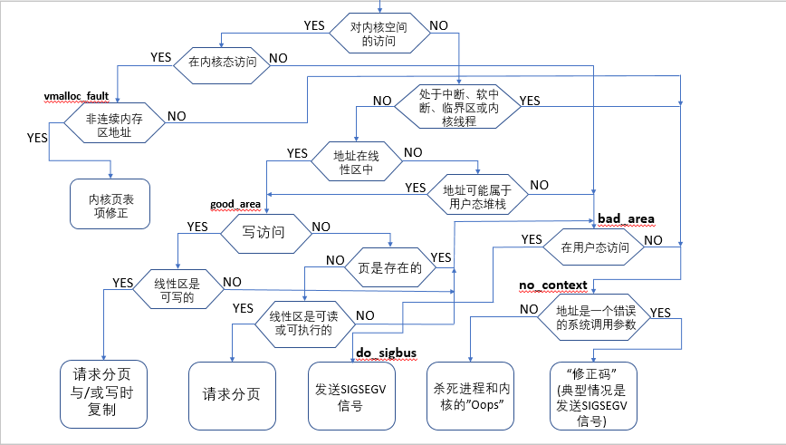

> @Date    : 2020-10-27 10:18:05
>
> @Author  : Lewis Tian (taseikyo@gmail.com)
>
> @Link    : github.com/taseikyo

# Linux 内存管理--缺页异常处理源码分析

> 原文：https://blog.csdn.net/wenwuge_topsec/article/details/16825881 [砖头他爸](https://blog.csdn.net/wenwuge_topsec) 2013-11-19 15:51:18

## 介绍

1. 缺页异常在 Linux 内核处理中占有非常重要的位置，很多 Linux 特性，如写时复制，页框延迟分配，内存回收中的磁盘和内存交换，都需要借助缺页异常来进行，缺页异常处理程序主要处理以下四种情形：
	1. 请求调页: 当进程调用 malloc() 之类的函数调用时，并未实际上分配物理内存，而是仅仅分配了一段线性地址空间，在实际访问该页框时才实际去分配物理页框，这样可以节省物理内存的开销，还有一种情况是在内存回收时，该物理页面的内容被写到了磁盘上，被系统回收了，这时候需要再分配页框，并且读取其保存的内容。
	2. 写时复制: 当 fork() 一个进程时，子进程并未完整的复制父进程的地址空间，而是共享相关的资源，父进程的页表被设为只读的，当子进程进行写操作时，会触发缺页异常，从而为子进程分配页框。
	3. 地址范围外的错误: 内核访问无效地址，用户态进程访问无效地址等。
	4. 内核访问非连续性地址：用于内核的高端内存映射，高端内存映射仅仅修改了主内核页表的内容，当进程访问内核态时需要将该部分的页表内容复制到自己的进程页表里面。
2. 缺页异常处理程序有可能发生在用户态或者内核态的代码中，在这两种形态下，有可能访问的是内核空间或者用户态空间的内存地址，按照排列组合，一共可能有四种情形。



\**一张图弄清缺页异常处理程序的来龙去脉（摘自 https://www.cnblogs.com/linhaostudy/p/12563001.html）*


\**Linux中的缺页异常的处理流程，分别为 x86 和 MIPS 版本（摘自 https://www.cnblogs.com/gngshn/p/4651796.html）*

## 源代码分析（选自 2.6.10 内核）

### do_page_fault

```C
fastcall void do_page_fault(struct pt_regs *regs, unsigned long error_code)
{
	struct task_struct *tsk;
	struct mm_struct *mm;
	struct vm_area_struct * vma;
	unsigned long address;
	unsigned long page;
	int write;
	siginfo_t info;
	//将引发缺页异常的线性地址保存在address变量里面
	__asm__("movl %%cr2,%0":"=r" (address));
 
	if (notify_die(DIE_PAGE_FAULT, "page fault", regs, error_code, 14,
					SIGSEGV) == NOTIFY_STOP)
		return;

	tsk = current;
	//info是内核发送信号使用的信息结构体
	info.si_code = SEGV_MAPERR;

	//该分支表明发生缺页时是发生在访问内核空间时
	if (unlikely(address >= TASK_SIZE)) { 
		//该分支表示发生缺页异常时，代码是在内核态访问内核态不存在
		//的地址，转到vmalloc_fault处理分支，可能是访问了不连续的内核页面
		if (!(error_code & 5))
			goto vmalloc_fault;
		//做相应出错处理
		goto bad_area_nosemaphore;
	} 

	mm = tsk->mm;
	//在中断或者软中断中访问用户态空间，发生问题，是不可以的，因为中断或者
	//软中断不代表任何的进程,mm为NULL代表着该进程是内核线程，内核线程
	//继承了上一个普通进程页表，不能对其进行修改
	if (in_atomic() || !mm)
		goto bad_area_nosemaphore;

	//尝试获取到读锁，若获得读锁失败时
	if (!down_read_trylock(&mm->mmap_sem)) {
		//在内核态访问用户态的地址，这种情况发生在在
		//进程的系统调用中去访问用户态的地址，在访问
		//地址前，内核是不会去写对应的读锁的，所以可能是
		//别的进程写了，相应的锁，所以需要等待，其它情况
		//属于错误情况
		if ((error_code & 4) == 0 &&
		    !search_exception_tables(regs->eip))
			goto bad_area_nosemaphore;
		down_read(&mm->mmap_sem);
	}

	//下面这几句话是来判断出错地址是否在进程的线性区内
	vma = find_vma(mm, address);
	//不在线性区内，地址错误
	if (!vma)
		goto bad_area;
	//在线性区内，跳到正常处理部分
	if (vma->vm_start <= address)
		goto good_area;
	//下面这些代码属于扩展进程栈的相关处理，该地址可能由push或者pusha指令引起
	//向低地址扩展的栈其线性区的标志位会置上VM_GROWSDOWN
	if (!(vma->vm_flags & VM_GROWSDOWN))
		goto bad_area;
	if (error_code & 4) {//异常发生在用户态
		//对于栈操作，发生错误的内存地址不应该比esp小太多，不该小32
		//个字节以上
		if (address + 32 < regs->esp)
			goto bad_area;
	}
	//扩展进程的用户态堆栈
	if (expand_stack(vma, address))
		goto bad_area;
good_area:
	info.si_code = SEGV_ACCERR;
	write = 0;
	switch (error_code & 3) {
		default://写，存在该页框，写时复制的情况
		case 2:	//写但不存在该页框
			//该线性区不让写，发生错误
			if (!(vma->vm_flags & VM_WRITE))
				goto bad_area;
			write++;
			break;
		case 1:	//读，存在该页框
			goto bad_area;
		case 0:	//读但是不存在该页框，缺页，需要进行调页
			if (!(vma->vm_flags & (VM_READ | VM_EXEC)))
				goto bad_area;
	}

 survive:
	//在handle_mm_fault()函数里面处理缺页的情况
	switch (handle_mm_fault(mm, vma, address, write)) {
		case VM_FAULT_MINOR:
			//在没有阻塞的情况下，完成了调页
			tsk->min_flt++;
			break;
		case VM_FAULT_MAJOR:
			//在阻塞的情况下，完成了调页操作
			tsk->maj_flt++;
			break;
		case VM_FAULT_SIGBUS:
			//发生其他错误
			goto do_sigbus;
		case VM_FAULT_OOM:
			//内存不足
			goto out_of_memory;
		default:
			BUG();
	}

	/*
	 * Did it hit the DOS screen memory VA from vm86 mode?
	 */
	if (regs->eflags & VM_MASK) {
		unsigned long bit = (address - 0xA0000) >> PAGE_SHIFT;
		if (bit < 32)
			tsk->thread.screen_bitmap |= 1 << bit;
	}
	up_read(&mm->mmap_sem);
	return;

/*
 * Something tried to access memory that isn't in our memory map..
 * Fix it, but check if it's kernel or user first..
 */
bad_area:
	up_read(&mm->mmap_sem);
 
bad_area_nosemaphore:
	//该错误发生在用户态代码访问时
	if (error_code & 4) {
		
		if (is_prefetch(regs, address, error_code))
			return;

		tsk->thread.cr2 = address;
		tsk->thread.error_code = error_code | (address >= TASK_SIZE);
		tsk->thread.trap_no = 14;
		info.si_signo = SIGSEGV;
		info.si_errno = 0;
		info.si_addr = (void __user *)address;
		//发送sigsegv信号给当前的进程
		force_sig_info(SIGSEGV, &info, tsk);
		return;
	}

//剩下的错误，发生在内核态
no_context:
	//是否有动态修正代码，该异常通常发生在将用户态线性地址
	//作为参数传递给了系统调用，该错误发生在内核态访问一个
	//用户态地址，但用户态地址不属于进程的地址空间
	if (fixup_exception(regs))
		return;	
 	if (is_prefetch(regs, address, error_code))
 		return;

	bust_spinlocks(1);
	//发生了真正的内核错误，往输出上打印相关错误信息
	if (address < PAGE_SIZE)
		printk(KERN_ALERT "Unable to handle kernel NULL pointer dereference");
	else
		printk(KERN_ALERT "Unable to handle kernel paging request");
	printk(" at virtual address %08lx\n",address);
	printk(KERN_ALERT " printing eip:\n");
	printk("%08lx\n", regs->eip);
	asm("movl %%cr3,%0":"=r" (page));
	page = ((unsigned long *) __va(page))[address >> 22];
	printk(KERN_ALERT "*pde = %08lx\n", page);

#ifndef CONFIG_HIGHPTE
	if (page & 1) {
		page &= PAGE_MASK;
		address &= 0x003ff000;
		page = ((unsigned long *) __va(page))[address >> PAGE_SHIFT];
		printk(KERN_ALERT "*pte = %08lx\n", page);
	}
#endif	
	//产生Oops的消息
	die("Oops", regs, error_code);
	bust_spinlocks(0);
	//退出相关进程
	do_exit(SIGKILL);
 
out_of_memory:
	//内存不足，删除当前进程
	up_read(&mm->mmap_sem);
	if (tsk->pid == 1) {
		yield();
		down_read(&mm->mmap_sem);
		goto survive;
	}
	printk("VM: killing process %s\n", tsk->comm);
	if (error_code & 4)//用户态进程，杀死用户态进程
		do_exit(SIGKILL);
	goto no_context;

do_sigbus:
	//发送SIGBUS信号给当前进程
	up_read(&mm->mmap_sem);
 
	//内核态进程，生成oops等
	if (!(error_code & 4))
		goto no_context;
 
	if (is_prefetch(regs, address, error_code))
		return;
	//用户态进程的话，发送SIGBUS给当前用户态进程
	tsk->thread.cr2 = address;
	tsk->thread.error_code = error_code;
	tsk->thread.trap_no = 14;
	info.si_signo = SIGBUS;
	info.si_errno = 0;
	info.si_code = BUS_ADRERR;
	info.si_addr = (void __user *)address;
	force_sig_info(SIGBUS, &info, tsk);
	return;

vmalloc_fault:
	{
		//在内核态访问内核空间内存，访问非连续性内存
		int index = pgd_index(address);
		unsigned long pgd_paddr;
		pgd_t *pgd, *pgd_k;
		pmd_t *pmd, *pmd_k;
		pte_t *pte_k;

		asm("movl %%cr3,%0":"=r" (pgd_paddr));
		pgd = index + (pgd_t *)__va(pgd_paddr);
		pgd_k = init_mm.pgd + index;
 
		if (!pgd_present(*pgd_k))
			goto no_context;

		pmd = pmd_offset(pgd, address);
		pmd_k = pmd_offset(pgd_k, address);
		if (!pmd_present(*pmd_k))
			goto no_context;
		//主要操作就是把主内核页表上对应的表项复制到当前进程的页表中
		set_pmd(pmd, *pmd_k);
		
		pte_k = pte_offset_kernel(pmd_k, address);
		if (!pte_present(*pte_k))
			goto no_context;
		return;
	}
}
```

### handle_mm_fault

```C
int handle_mm_fault(struct mm_struct *mm, struct vm_area_struct * vma,
	unsigned long address, int write_access)
{
	pgd_t *pgd;
	pmd_t *pmd;

	__set_current_state(TASK_RUNNING);
	pgd = pgd_offset(mm, address);

	inc_page_state(pgfault);

	if (is_vm_hugetlb_page(vma))
		return VM_FAULT_SIGBUS;	

	spin_lock(&mm->page_table_lock);
	//找到相应的pmd表的地址，没有的话，分配一个
	pmd = pmd_alloc(mm, pgd, address);

	if (pmd) {
		//找到对应的pte表的地址，即页表的地址，找不到
		//的话，分配一个
		pte_t * pte = pte_alloc_map(mm, pmd, address);
		//进行相应的缺页处理:
		//1请求调页，2写时复制
		if (pte)
			return handle_pte_fault(mm, vma, address, write_access, pte, pmd);
	}
	spin_unlock(&mm->page_table_lock);
	return VM_FAULT_OOM;
}
```

### handle_pte_fault

```C
static inline int handle_pte_fault(struct mm_struct *mm,
	struct vm_area_struct * vma, unsigned long address,
	int write_access, pte_t *pte, pmd_t *pmd)
{
	pte_t entry;

	entry = *pte;
	if (!pte_present(entry)) {
		//页面从未被访问过，需要申请页面进行调页，匿名映射
		//或者是磁盘文件映射都有可能
		if (pte_none(entry))
			return do_no_page(mm, vma, address, write_access, pte, pmd);
		//非线性磁盘文件映射
		if (pte_file(entry))
			return do_file_page(mm, vma, address, write_access, pte, pmd);
		//相关页框被作为交换页写到了磁盘上
		return do_swap_page(mm, vma, address, pte, pmd, entry, write_access);
	}
	//写时复制
	if (write_access) {
		if (!pte_write(entry))
			return do_wp_page(mm, vma, address, pte, pmd, entry);

		entry = pte_mkdirty(entry);
	}
	entry = pte_mkyoung(entry);
	ptep_set_access_flags(vma, address, pte, entry, write_access);
	update_mmu_cache(vma, address, entry);
	pte_unmap(pte);
	spin_unlock(&mm->page_table_lock);
	return VM_FAULT_MINOR;
}
```
