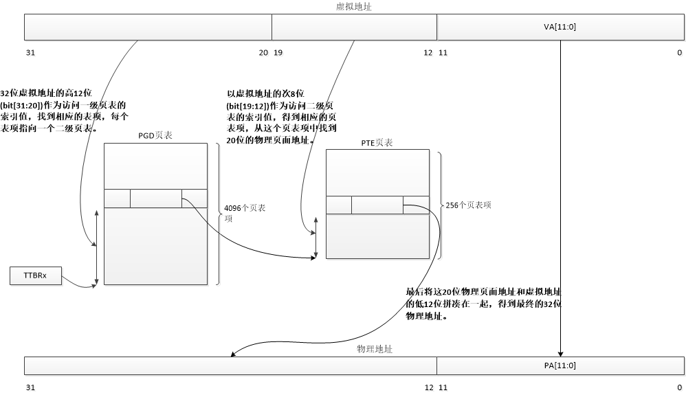
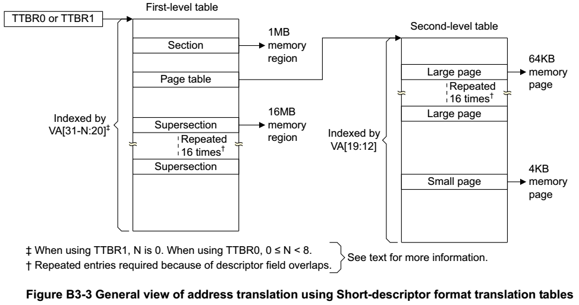
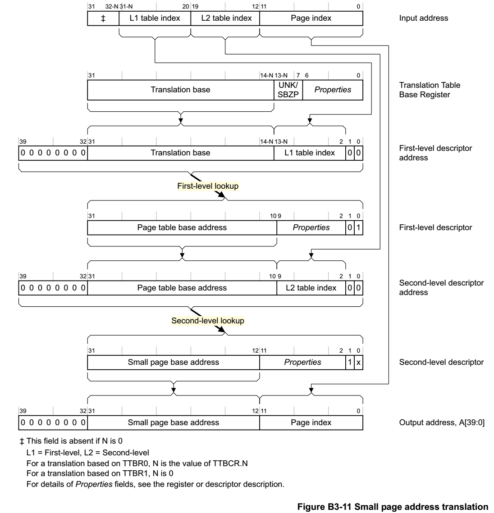
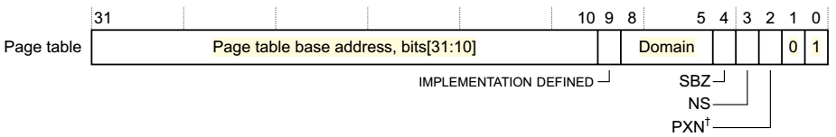
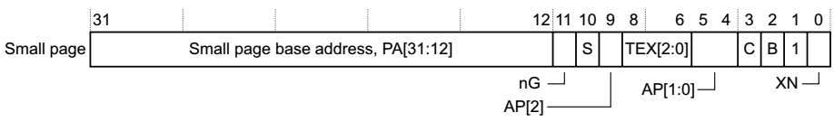
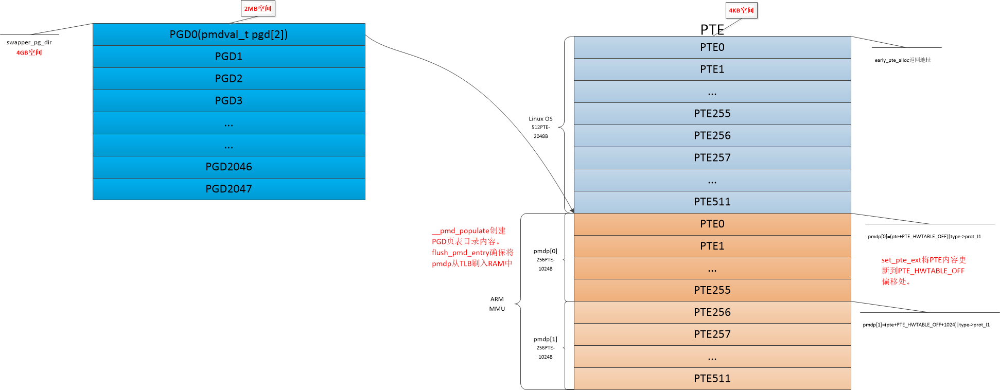
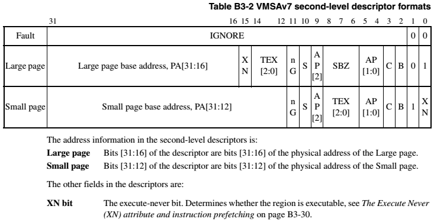
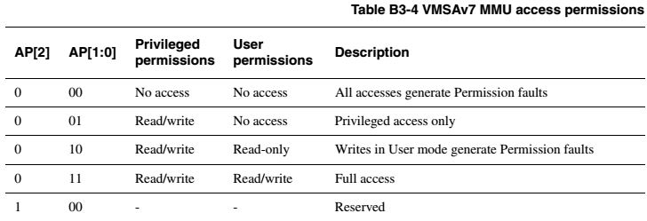
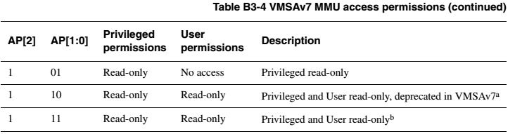
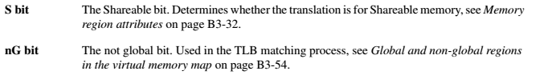

> @Date    : 2020-10-28 19:41:56
>
> @Author  : Lewis Tian (taseikyo@gmail.com)
>
> @Link    : github.com/taseikyo

# Linux 内存管理（2）页表的映射过程

> 原文：https://www.cnblogs.com/arnoldlu/p/8087022.html 2017-12-30 22:41

专题：[Linux 内存管理专题](linux-memory-management-topics-0.md)

关键词：swapper_pd_dir、ARM PGD/PTE、Linux PGD/PTE、pgd_offset_k。

## Table of Contents

- [1 ARM32 页表映射](#1-arm32-页表映射)
	- [1.1 ARM32 处理器查询页表](#11-arm32-处理器查询页表)
	- [1.1.1 ARM32 架构 MMU4KB 页面映射过程](#111-arm32-架构-mmu4kb-页面映射过程)
	- [1.1.2 ARMv7-AR 中关于 Short Descriptor 映射概览图](#112-armv7-ar-中关于-short-descriptor-映射概览图)
		- [规格书中 Small Page 映射过程](#规格书中-small-page-映射过程)
	- [1.2 Linux 页表映射相关数据结构](#12-linux-页表映射相关数据结构)
	- [ARM32 中 PGD 定义](#arm32-中-pgd-定义)
	- [ARM32 中 PTE 定义](#arm32-中-pte-定义)
	- [Linux 中 PTE 定义](#linux-中-pte-定义)
	- [1.3 设置 PGD 页面目录](#13-设置-pgd-页面目录)
		- [pgd_offset_k](#pgd_offset_k)
		- [pgd_addr_end](#pgd_addr_end)
		- [alloc_init_pte](#alloc_init_pte)
	- [1.4 设置 PTE 表项](#14-设置-pte-表项)

Linux 下的页表映射分为两种，一是 Linux 自身的页表映射，另一种是 ARM32 MMU 硬件的映射。

## 1 ARM32 页表映射

由于 ARM32 和 Linux 内核维护的页表项有所不同，所以维护了两套 PTE。

PGD 存放在 swapper_pd_dir 中，一个 PGD 目录项其实包含了两份 ARM32 PGD。

所以再分配 PTE 的时候，共分配了 1024 个 PTE，512 个给 Linux OS 维护用；512 个给 ARM32 MMU 用，对应两个 PGD 的页表数目。

由于 Linux OS 和 ARM32 的 PTE 紧邻，所以两者的转换也方便进行。

### 1.1 ARM32 处理器查询页表

32bit 的 Linux 采用三级映射：PGD-->PMD-->PTE，64bit 的 Linux 采用四级映射：PGD-->PUD-->PMD-->PTE，多了个 PUD。

缩写是 PGD：Page Global Directory、PUD：Page Upper Directory、PMD：Page Middle Directory、PTE：Page Table Entry。

在 ARM32 Linux 采用两层映射，省略了 PMD，除非在定义了 CONFIG_ARM_LPAE 才会使用 3 级映射。

在 ARM32 架构中，可以按段 (section) 来映射，这是采用单层映射模式。

使用页面映射需要两层映射结构，页面可以是 64KB 或 4KB 大小。

### 1.1.1 ARM32 架构 MMU4KB 页面映射过程

如果采用页表映射的方式，段映射表就变成一级映射表 (Linux 中称为 PGD)，其页表项提供的不再是物理地址，而是二级页表的基地址。

32 位虚拟地址的高 12 位 (bit[31:20]) 作为访问一级页表的索引值，找到相应的表项，每个表项指向一个二级页表。

以虚拟地址的次 8 位 (bit[19:12]) 作为访问二级页表的索引值，得到相应的页表项，从这个页表项中找到 20 位的物理页面地址。

最后将这 20 位物理页面地址和虚拟地址的低 12 位拼凑在一起，得到最终的 32 位物理地址。

这个过程在 ARM32 架构中由 MMU 硬件完成，软件不需要接入。



\**ARM32 架构 MMU 页表映射过程*

### 1.1.2 ARMv7-AR 中关于 Short Descriptor 映射概览图

关于 4K 页表的映射过程在 ARMv7-AR 用户架构手册有关介绍。

一个地址映射的概览图，32 位虚拟地址从 TTBR1 中找到 First-level table 地址，然后取虚拟地址 VA[31:20] 作为序号找到 Second-level table 地址。

取虚拟地址 VA[19:12] 作为序号找到 Page 地址。



#### 规格书中 Small Page 映射过程

Figure B3-11 Small page address translation 是映射的细节：



### 1.2 Linux 页表映射相关数据结构

我们知道在 map_lowmem() 使用 create_mapping() 创建页表映射，这个函数的参数结构是 struct map_desc。

下面来研究它的相关结构，有助于理解内核是如何处理页表映射的。

```C
// arch/arm/include/asm/mach/map.h:

struct map_desc {
    unsigned long virtual; // 虚拟地址起始地址
    unsigned long pfn; //物理地址开始页帧号
    unsigned long length; // 内存空间大小
    unsigned int type; // mem_types中的序号
};
```

map_desc 中的 type 指向类型为 struct mem_type 的 mem_types 数组：

```C
// arch/arm/mm/mm.h:
struct mem_type {
    pteval_t prot_pte; // PTE属性
    pteval_t prot_pte_s2; // 定义CONFIG_ARM_LPAE才有效
    pmdval_t prot_l1; //PMD属性
    pmdval_t prot_sect; // Section类型映射
    unsigned int domain; // 定义ARM中不同的域
};

arch/arm/mm/mmu.c:
static struct mem_type mem_types[] = {
...
    [MT_MEMORY_RWX] = {
        .prot_pte  = L_PTE_PRESENT | L_PTE_YOUNG | L_PTE_DIRTY, // 注意这里都是L_PTE_*类型，需要在写入MMU对应PTE时进行转换。
        .prot_l1   = PMD_TYPE_TABLE,
        .prot_sect = PMD_TYPE_SECT | PMD_SECT_AP_WRITE,
        .domain    = DOMAIN_KERNEL,
    },
    [MT_MEMORY_RW] = {
        .prot_pte  = L_PTE_PRESENT | L_PTE_YOUNG | L_PTE_DIRTY |
                 L_PTE_XN,
        .prot_l1   = PMD_TYPE_TABLE,
        .prot_sect = PMD_TYPE_SECT | PMD_SECT_AP_WRITE,
        .domain    = DOMAIN_KERNEL,
    },
...
}
```

下面重点关注 Page Table 类型的一级页表和二级页表的细节，以及 Linux 内核中的定义：

### ARM32 中 PGD 定义

 下面是 First-level descriptor 详细说明：



```C
/*
 * Hardware page table definitions.
 *
 * + Level 1 descriptor (PMD)
 *   - common
 */
#define PMD_TYPE_MASK        (_AT(pmdval_t, 3) << 0) // 01对应PageTable
#define PMD_TYPE_FAULT        (_AT(pmdval_t, 0) << 0)
#define PMD_TYPE_TABLE        (_AT(pmdval_t, 1) << 0)
#define PMD_TYPE_SECT        (_AT(pmdval_t, 2) << 0)
#define PMD_PXNTABLE        (_AT(pmdval_t, 1) << 2)     /* v7 */
#define PMD_BIT4        (_AT(pmdval_t, 1) << 4)
#define PMD_DOMAIN(x)        (_AT(pmdval_t, (x)) << 5)
#define PMD_PROTECTION        (_AT(pmdval_t, 1) << 9)        /* v5 */
```

### ARM32 中 PTE 定义

下面是 Second-level descriptor 详细说明：



```C
/*
 * + Level 2 descriptor (PTE)
 *   - common
 */
#define PTE_TYPE_MASK        (_AT(pteval_t, 3) << 0)
#define PTE_TYPE_FAULT        (_AT(pteval_t, 0) << 0)
#define PTE_TYPE_LARGE        (_AT(pteval_t, 1) << 0)
#define PTE_TYPE_SMALL        (_AT(pteval_t, 2) << 0)
#define PTE_TYPE_EXT        (_AT(pteval_t, 3) << 0)        /* v5 */
#define PTE_BUFFERABLE        (_AT(pteval_t, 1) << 2)
#define PTE_CACHEABLE        (_AT(pteval_t, 1) << 3)

/*
 *   - extended small page/tiny page
 */
#define PTE_EXT_XN        (_AT(pteval_t, 1) << 0)        /* v6 */
#define PTE_EXT_AP_MASK        (_AT(pteval_t, 3) << 4)
#define PTE_EXT_AP0        (_AT(pteval_t, 1) << 4)
#define PTE_EXT_AP1        (_AT(pteval_t, 2) << 4)
#define PTE_EXT_AP_UNO_SRO    (_AT(pteval_t, 0) << 4)
#define PTE_EXT_AP_UNO_SRW    (PTE_EXT_AP0)
#define PTE_EXT_AP_URO_SRW    (PTE_EXT_AP1)
#define PTE_EXT_AP_URW_SRW    (PTE_EXT_AP1|PTE_EXT_AP0)
#define PTE_EXT_TEX(x)        (_AT(pteval_t, (x)) << 6)    /* v5 */
#define PTE_EXT_APX        (_AT(pteval_t, 1) << 9)        /* v6 */
#define PTE_EXT_COHERENT    (_AT(pteval_t, 1) << 9)        /* XScale3 */
#define PTE_EXT_SHARED        (_AT(pteval_t, 1) << 10)    /* v6 */
#define PTE_EXT_NG        (_AT(pteval_t, 1) << 11)    /* v6 */
```

### Linux 中 PTE 定义

由于 Linux 对于 PTE 的定义和 ARM 硬件不一致，下面的 L_开头的定义都是针对 Linux 的，L_MT 开头的是 bit[5:2] 表示的内存类型。

```C
/*
 * "Linux" PTE definitions.
 *
 * We keep two sets of PTEs - the hardware and the linux version.
 * This allows greater flexibility in the way we map the Linux bits
 * onto the hardware tables, and allows us to have YOUNG and DIRTY
 * bits.
 *
 * The PTE table pointer refers to the hardware entries; the "Linux"
 * entries are stored 1024 bytes below.
 */
#define L_PTE_VALID        (_AT(pteval_t, 1) << 0)        /* Valid */
#define L_PTE_PRESENT        (_AT(pteval_t, 1) << 0)
#define L_PTE_YOUNG        (_AT(pteval_t, 1) << 1)
#define L_PTE_DIRTY        (_AT(pteval_t, 1) << 6)
#define L_PTE_RDONLY        (_AT(pteval_t, 1) << 7)
#define L_PTE_USER        (_AT(pteval_t, 1) << 8)
#define L_PTE_XN        (_AT(pteval_t, 1) << 9)
#define L_PTE_SHARED        (_AT(pteval_t, 1) << 10)    /* shared(v6), coherent(xsc3) */
#define L_PTE_NONE        (_AT(pteval_t, 1) << 11)

/*
 * These are the memory types, defined to be compatible with
 * pre-ARMv6 CPUs cacheable and bufferable bits:   XXCB
 */
#define L_PTE_MT_UNCACHED    (_AT(pteval_t, 0x00) << 2)    /* 0000 */
#define L_PTE_MT_BUFFERABLE    (_AT(pteval_t, 0x01) << 2)    /* 0001 */
#define L_PTE_MT_WRITETHROUGH    (_AT(pteval_t, 0x02) << 2)    /* 0010 */
#define L_PTE_MT_WRITEBACK    (_AT(pteval_t, 0x03) << 2)    /* 0011 */
#define L_PTE_MT_MINICACHE    (_AT(pteval_t, 0x06) << 2)    /* 0110 (sa1100, xscale) */
#define L_PTE_MT_WRITEALLOC    (_AT(pteval_t, 0x07) << 2)    /* 0111 */
#define L_PTE_MT_DEV_SHARED    (_AT(pteval_t, 0x04) << 2)    /* 0100 */
#define L_PTE_MT_DEV_NONSHARED    (_AT(pteval_t, 0x0c) << 2)    /* 1100 */
#define L_PTE_MT_DEV_WC        (_AT(pteval_t, 0x09) << 2)    /* 1001 */
#define L_PTE_MT_DEV_CACHED    (_AT(pteval_t, 0x0b) << 2)    /* 1011 */
#define L_PTE_MT_VECTORS    (_AT(pteval_t, 0x0f) << 2)    /* 1111 */
#define L_PTE_MT_MASK        (_AT(pteval_t, 0x0f) << 2)
```

ARM PMD 描述符 bit[8:5] 用于描述 Domain，但 ARM Linux 只定义使用三个：

```C
#define DOMAIN_KERNEL    2 // 用于内核空间
#define DOMAIN_TABLE    2
#define DOMAIN_USER    1 // 用于用户空间
#define DOMAIN_IO    0 // 用于I/O地址域
```

### 1.3 设置 PGD 页面目录

create_mapping 的参数是 struct map_desc 类型，用于描述一个虚拟地址区域线性映射到物理区域。基于这块区域创建 PGD/PTE。

```C
static void __init create_mapping(struct map_desc *md)
{
    unsigned long addr, length, end;
    phys_addr_t phys;
    const struct mem_type *type;
    pgd_t *pgd;
...
    type = &mem_types[md->type]; // 找到对应的struct mem_type
...
    addr = md->virtual & PAGE_MASK; // 对齐到页
    phys = __pfn_to_phys(md->pfn); // 页到物理地址转换
    length = PAGE_ALIGN(md->length + (md->virtual & ~PAGE_MASK));
...
    pgd = pgd_offset_k(addr); // 根据addr找到对应虚拟地址对应的pgd地址
    end = addr + length;
    do {
        unsigned long next = pgd_addr_end(addr, end);

        alloc_init_pud(pgd, addr, next, phys, type); // 初始化下一级页表

        phys += next - addr;
        addr = next;
    } while (pgd++, addr != end); // 遍历区间地址，步长是PGDIR_SIZE，即2MB大小的空间。
}
```

这里面有三个地方需要解释：

#### pgd_offset_k

将虚拟地址进行转换得到 PMD 的指针。

```C
#define PGDIR_SHIFT 21

/* to find an entry in a page-table-directory */
#define pgd_index(addr)    ((addr) >> PGDIR_SHIFT)

#define pgd_offset(mm, addr)    ((mm)->pgd + pgd_index(addr))


#define pgd_offset_k(addr)    pgd_offset(&init_mm, addr)

struct mm_struct init_mm = {
    .mm_rb        = RB_ROOT,
    .pgd        = swapper_pg_dir,
    .mm_users    = ATOMIC_INIT(2),
    .mm_count    = ATOMIC_INIT(1),
    .mmap_sem    = __RWSEM_INITIALIZER(init_mm.mmap_sem),
    .page_table_lock =  __SPIN_LOCK_UNLOCKED(init_mm.page_table_lock),
    .mmlist        = LIST_HEAD_INIT(init_mm.mmlist),
    INIT_MM_CONTEXT(init_mm)
};
```

由虚拟内存布局图中 swapper_pg_dir（见 #3）可知，大小为 16KB，里面有详细的解释。init_mm.pgd 指向 swapper_pg_dir。

#### pgd_addr_end

```C
// include/asm-generic/pgtable.h:

#define pgd_addr_end(addr, end)     \
({    unsigned long __boundary = ((addr) + PGDIR_SIZE) & PGDIR_MASK;    \
    (__boundary - 1 < (end) - 1)? __boundary: (end);        \
})

archarmincludeasmpgtable-2level.h:
/*
 * PMD_SHIFT determines the size of the area a second-level page table can map
 * PGDIR_SHIFT determines what a third-level page table entry can map
 */
#define PMD_SHIFT        21
#define PGDIR_SHIFT      21

#define PMD_SIZE        (1UL << PMD_SHIFT)
#define PMD_MASK        (~(PMD_SIZE-1))
#define PGDIR_SIZE        (1UL << PGDIR_SHIFT)
#define PGDIR_MASK        (~(PGDIR_SIZE-1))
```

由于 PGDIR_SHIFT 为 21，所以一个 PGD 页表目录对应 2MB 大小的空间，即 [addr, addr+PGDIR_SIZE)。所以 PGD 的数目为 2^11，2028 个。整个 PGD 页表占用空间为 2048 * 4B=8KB。

这和 ARM 硬件的 4096 PGD 不一致。这里涉及到 Linux 实现技巧，在创建 PTE 中进行分析。

所以此处按照 2MB 步长，遍历 [virtual, virtual+length) 空间创建 PDG 页表和 PTE。

#### alloc_init_pte

由于 ARM-Linux 采用两级页表映射，跳过 PUD/PMD，直接到 alloc_init_pte 创建 PTE。

```C
alloc_init_pud-->alloc_init_pmd-->alloc_init_pte

arch/arm/mm/mmu.c:
static void __init alloc_init_pte(pmd_t *pmd, unsigned long addr, // 这里的pmd=pud=pgd。
                  unsigned long end, unsigned long pfn,
                  const struct mem_type *type)
{
    pte_t *pte = early_pte_alloc(pmd, addr, type->prot_l1); // 使用prot_l1作为参数，创建PGD页表目录,返回addr对应的pte地址。
    do {
        set_pte_ext(pte, pfn_pte(pfn, __pgprot(type->prot_pte)), 0); // 调用体系结构相关汇编，配置PTE。
        pfn++;
    } while (pte++, addr += PAGE_SIZE, addr != end); // 遍历[addr, end)区间内存，以PAGE_SIZE为步长。
}
```

下面看看如何分配 PGD 页表目录：

```C
static pte_t * __init early_pte_alloc(pmd_t *pmd, unsigned long addr, unsigned long prot) {
    if (pmd_none(*pmd)) { // 如果PGD的内容为空，即PTE还没有创建，择取建立页面。
        pte_t *pte = early_alloc(PTE_HWTABLE_OFF + PTE_HWTABLE_SIZE); // 分配512+512个PTE页表项
        __pmd_populate(pmd, __pa(pte), prot); // 生成pmd页表目录，并刷入RAM
    }
    BUG_ON(pmd_bad(*pmd));
    return pte_offset_kernel(pmd, addr); // 返回当前addr对应的PTE地址
}

early_alloc-->early_alloc_aligned：
static void __init *early_alloc_aligned(unsigned long sz, unsigned long align) {
    void *ptr = __va(memblock_alloc(sz, align)); // 基于memblock进行分配，这里分配4096B，刚好是一页大小。
    memset(ptr, 0, sz);
    return ptr;
}
```

所以存放 PGD 需要的空间通过 memblock 进行申请，PTE_HWTABLE_OFF 和 PTE_HWTABLE_SIZE 都为 512，所以一个 1024 个 PTE。

下面是 early_pte_alloc 分配的空间示意图：前面 512 个表项是给 Linux OS 使用的，后 512 个表项是给 ARM 硬件 MMU 用的。



Linux 内核 PGD/PTE 映射关系

```C
static inline void __pmd_populate(pmd_t *pmdp, phys_addr_t pte,
                  pmdval_t prot)
{
    pmdval_t pmdval = (pte + PTE_HWTABLE_OFF) | prot; // 生成pmdp[0]的内容
    pmdp[0] = __pmd(pmdval);
#ifndef CONFIG_ARM_LPAE
    pmdp[1] = __pmd(pmdval + 256 * sizeof(pte_t)); // 生成紧邻的pmdp[1]的内容
#endif
    flush_pmd_entry(pmdp); // 将pmdp两个刷入到RAM中
}
```

Linux 的 PGD 页表目录和 ARM32 不同，总数和 ARM32 是一样的。


在 arm_mm_memblock_reserve 中，通过 swapper_pg_dir 可以知道其大小为 16KB。

就来看看 SWAPPER_PG_DIR_SIZE，一共 2048 个 PGD，但是每个 PGD 包含了两个相邻的 PGD 页面目录项。

```C
typedef pmdval_t pgd_t[2]; // 8 字节

#define SWAPPER_PG_DIR_SIZE (PTRS_PER_PGD * sizeof(pgd_t))  // 2048*8B=16KB
/*
 * Reserve the special regions of memory
 */
void __init arm_mm_memblock_reserve(void)
{
    /*
     * Reserve the page tables.  These are already in use,
     * and can only be in node 0.
     */
    memblock_reserve(__pa(swapper_pg_dir), SWAPPER_PG_DIR_SIZE);
...
}
```

### 1.4 设置 PTE 表项

要理解是如何设置 PTE 表项，就需要参照 B3.3.1 Translation table entry formants 中关于 Second-level descriptors 的描述。









```C
// arch/arm/include/asm/pgtable-2level.h:
#define set_pte_ext(ptep,pte,ext) cpu_set_pte_ext(ptep,pte,ext)

// arch/arm/include/asm/glue-proc.h:
#ifndef MULTI_CPU
...
#define cpu_set_pte_ext            __glue(CPU_NAME,_set_pte_ext)
...
#endif


// arch/arm/mm/proc-v7-2level.S:
/*
 *    cpu_v7_set_pte_ext(ptep, pte)
 *
 *    Set a level 2 translation table entry.
 *
 *    - ptep  - pointer to level 2 translation table entry // 放入r0
 *          (hardware version is stored at +2048 bytes)
 *    - pte   - PTE value to store // 放入r1
 *    - ext    - value for extended PTE bits // 放入r2
 */
ENTRY(cpu_v7_set_pte_ext)
#ifdef CONFIG_MMU
    str    r1, [r0]            @ linux version // 将r1的值存入r0地址的内存中

    bic    r3, r1, #0x000003f0 // 清除r1的bit[9:4]，存入r3
    bic    r3, r3, #PTE_TYPE_MASK // PTE_TYPE_MASK为0x03，记清除低2位
    orr    r3, r3, r2 // r3与r2或，存入r3
    orr    r3, r3, #PTE_EXT_AP0 | 2 // 这里将bit1和bit4置位，所以是Small page。

    tst    r1, #1 << 4 // 判断r1的bit4是否为0
    orrne    r3, r3, #PTE_EXT_TEX(1) // 设置TEX为1

    eor    r1, r1, #L_PTE_DIRTY
    tst    r1, #L_PTE_RDONLY | L_PTE_DIRTY
    orrne    r3, r3, #PTE_EXT_APX // 设置AP[2]

    tst    r1, #L_PTE_USER
    orrne    r3, r3, #PTE_EXT_AP1 // 设置AP[1]

    tst    r1, #L_PTE_XN
    orrne    r3, r3, #PTE_EXT_XN // 设置XN位

    tst    r1, #L_PTE_YOUNG
    tstne    r1, #L_PTE_VALID
    eorne    r1, r1, #L_PTE_NONE
    tstne    r1, #L_PTE_NONE
    moveq    r3, #0

    ARM(    str    r3, [r0, #2048]! ) // 并没有写入r0，而是写入r0+2048Bytes的偏移。
    THUMB(    add    r0, r0, #2048 )
    THUMB(    str    r3, [r0] )
    ALT_SMP(W(nop))
    ALT_UP (mcr    p15, 0, r0, c7, c10, 1)        @ flush_pte
#endif
    bx    lr
ENDPROC(cpu_v7_set_pte_ext)
```
