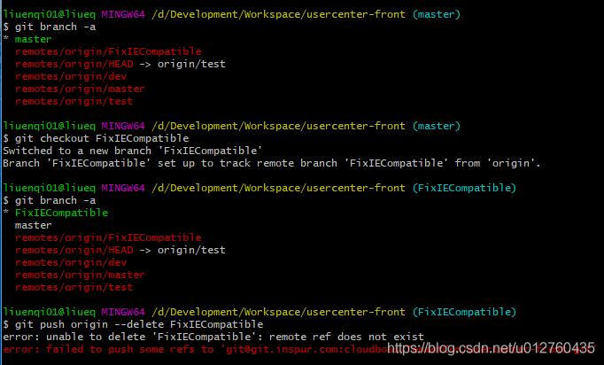

> @Date    : 2020-10-29 09:35:27
>
> @Author  : Lewis Tian (taseikyo@gmail.com)
>
> @Link    : github.com/taseikyo

# Git 删除远端分支后本地不同步的问题

> 原文：https://blog.csdn.net/u012760435/article/details/84977933 [半斤米粉闯天下](https://me.csdn.net/u012760435) 2018-12-12 19:17:50

踩到一个小坑，如果在 gitlab 或其他 web 端删除 git 某分支，本地 pull 的话并不会更新分支列表，也就是会出现远端分支 A 已经被删掉了，但是在本地 git bash 里面仍然能看到远端分支 A 这种灵异的情况。



就像这样，本地使用 branch -a 命令可以看到分支 FixIECompatible，并且还可以检出。但是想删除远端分支的时候就报错了，说分支不存在 (事实上远端就是不存在)。

可用如下命令刷新分支列表，可解决此问题

```Bash
git remote update origin --prune
```

另外还可使用如下方法查看需要清理的本地分支

```Bash
git remote prune origin --dry-run
```

或

```Bash
git remote prune origin -n
```
