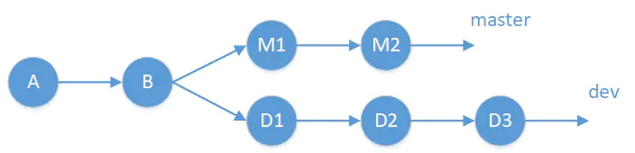
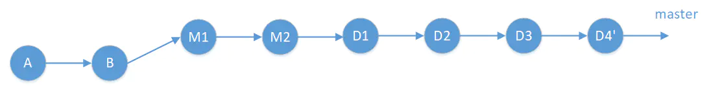
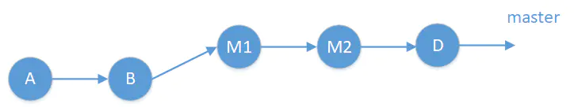
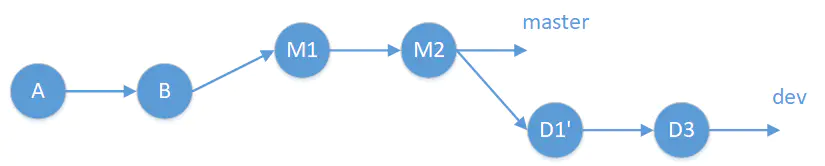
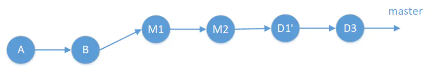

> @Date    : 2020-10-03 15:37:10
>
> @Author  : Lewis Tian (taseikyo@gmail.com)
>
> @Link    : github.com/taseikyo

昨天第一次使用 GitHub 的分支，结果 merge 出现了问题，因为上周在 TheAlgorithm/Python 提交 PR 被 merge 之后我的几次 commit 信息被合成一个 commit 加在最后，然而我操作自己的库却发现是以单个 commit 形式 merge 的，我哭了

# git merge 的三种操作：merge, squash merge 和 rebase merge

> 原文：https://www.jianshu.com/p/ff1877c5864e 作者：[CodingCode](https://www.jianshu.com/u/369b8227740a) 2018.04.02 12:21:07

## Table of Contents

- [merge](#merge)
- [squash merge](#squash-merge)
- [rebase merge](#rebase-merge)

举例来说：假设在 master 分支的 B 点拉出一个新的分支 dev，经过一段时间开发后：

- master 分支上有两个新的提交 M1 和 M2
- dev 分支上有三个提交 D1，D2，和 D3

如下图所示：



现在我们完成了 dev 分支的开发测试工作，需要把 dev 分支合并回 master 分支

## merge

这是最基本的 merge，就是把提交历史原封不动的拷贝过来，包含完整的提交历史记录

```Bash
$ git checkout master
$ git merge dev
```



此时还会生产一个 merge commit (D4')，这个 merge commit 不包含任何代码改动，而包含在 dev 分支上的几个 commit 列表 (D1, D2 和 D3)。查看 git 的提交历史(git log) 可以看到所有的这些提交历史记录

## squash merge

根据字面意思，这个操作完成的是压缩的提交；解决的是什么问题呢，由于在 dev 分支上执行的是开发工作，有一些很小的提交，或者是纠正前面的错误的提交，对于这类提交对整个工程来说不需要单独显示出来一次提交，不然导致项目的提交历史过于复杂；所以基于这种原因，我们可以把 dev 上的所有提交都合并成一个提交；然后提交到主干

```Bash
$ git checkout master
$ git merge --squash dev
```



在这个例子中，我们把 D1，D2 和 D3 的改动合并成了一个 D

注意，squash merge 并不会替你产生提交，它只是把所有的改动合并，然后放在本地文件，需要你再次手动执行 git commit 操作；此时又要注意了，因为你要你手动 commit，也就是说这个 commit 是你产生的，不是有原来 dev 分支上的开发人员产生的，提交者本身发生了变化。也可以这么理解，就是你把 dev 分支上的所有代码改动一次性 porting 到 master 分支上而已

## rebase merge

由于 squash merge 会变更提交者作者信息，这是一个很大的问题，后期问题追溯不好处理（当然也可以由分支 dev 的所有者来执行 squash merge 操作，以解决部分问题），rebase merge 可以保留提交的作者信息，同时可以合并 commit 历史，完美的解决了上面的问题

```Bash
$ git checkout dev
$ git rebase -i master
$ git checkout master
$ git merge dev
```

rebase merge 分两步完成：

1. 执行 rebase 操作，结果是看起来 dev 分支是从 M2 拉出来的，而不是从 B 拉出来的，然后使用 -i 参数手动调整 commit 历史，是否合并如何合并。例如下 rebase -i 命令会弹出文本编辑框：

```Bash
pick <D1> Message for commit #1
pick <D2> Message for commit #2
pick <D3> Message for commit #3
```

假设 D2 是对 D1 的一个拼写错误修正，因此可以不需要显式的指出来，我们把 D2 修改为 fixup：

```Bash
pick <D1> Message for commit #1
fixup <D2> Message for commit #2
pick <D3> Message for commit #3
```

rebase 之后的状态变为：



D1' 是 D1 和 D2 的合并。

第二步：再执行 merge 操作，把 dev 分支合并到 master 分支：



注意：在执行 rebase 的时候可能会出现冲突的问题，此时需要手工解决冲突的问题，然后执行 (git add) 命令；所有冲突解决完之后，这时不需要执行 (git commit) 命令，而是运行 (git rebase --continue) 命令，一直到 rebase 完成；如果中途想放弃 rebase 操作，可以运行 (git rebase --abort) 命令回到 rebase 之前的状态
