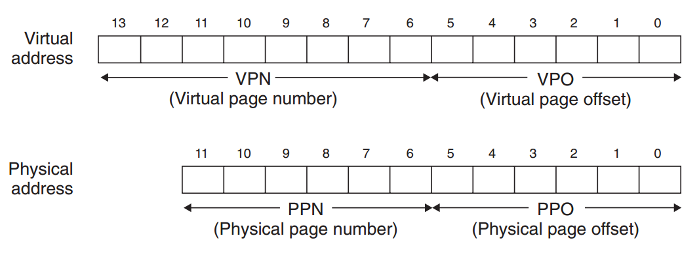
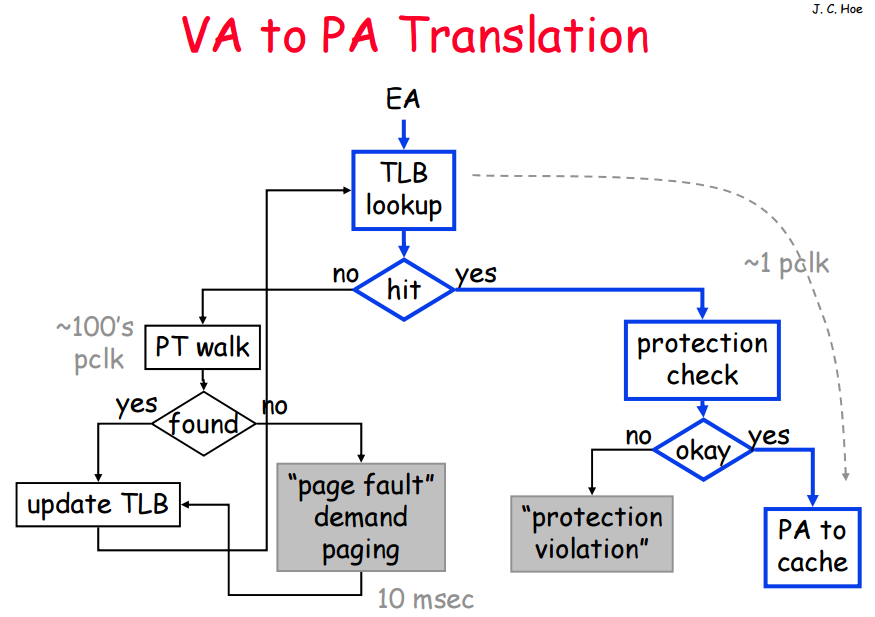
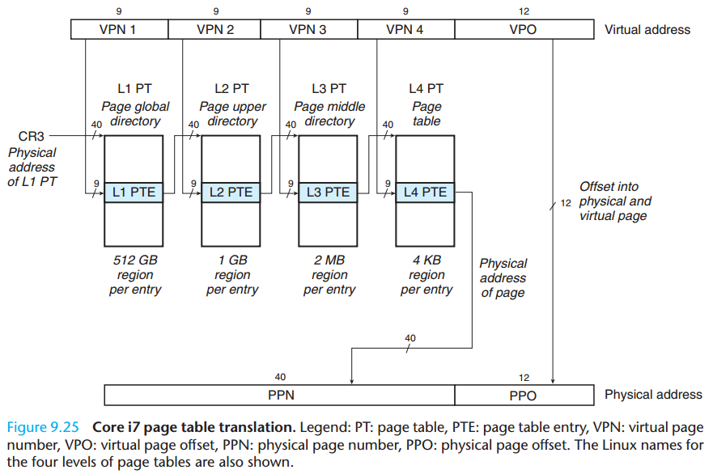
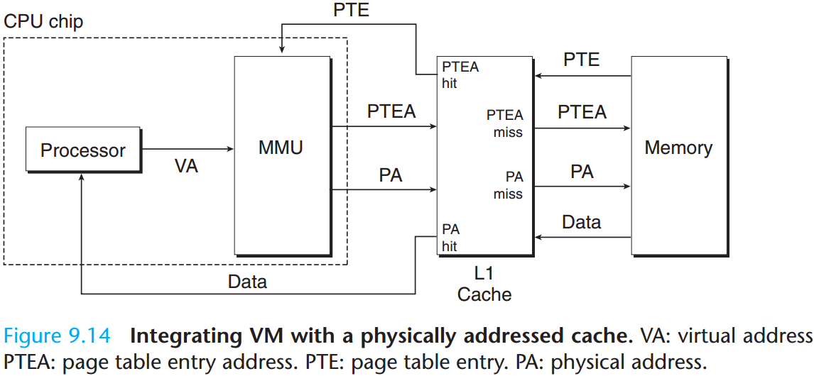
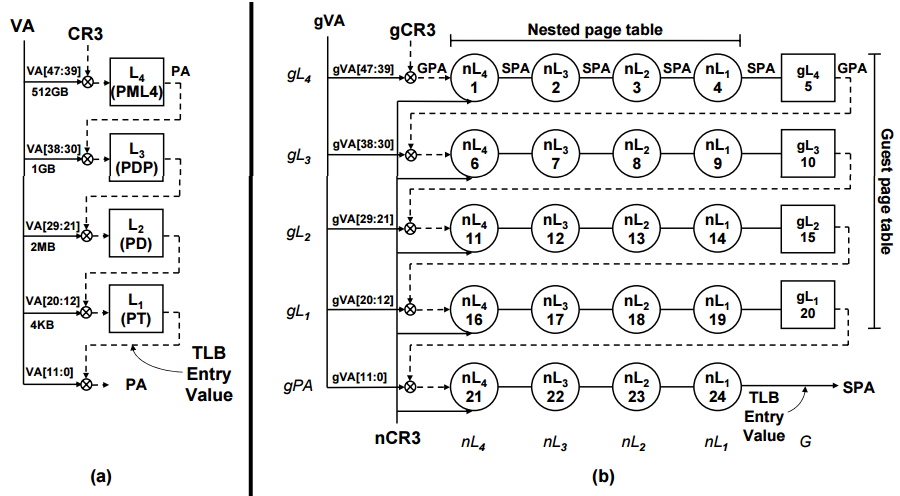
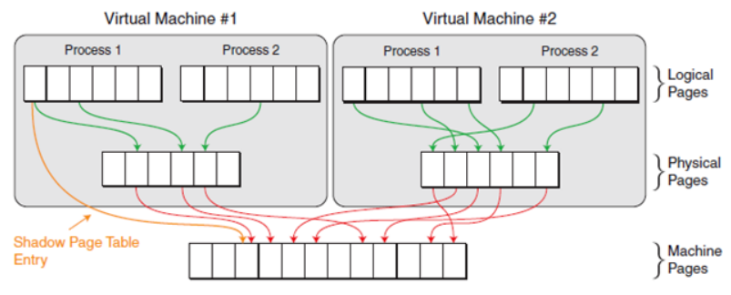
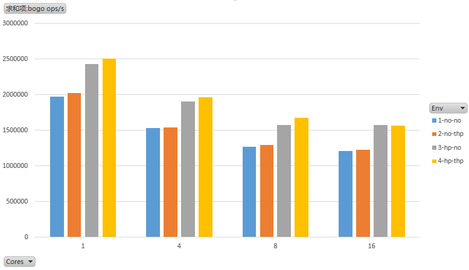
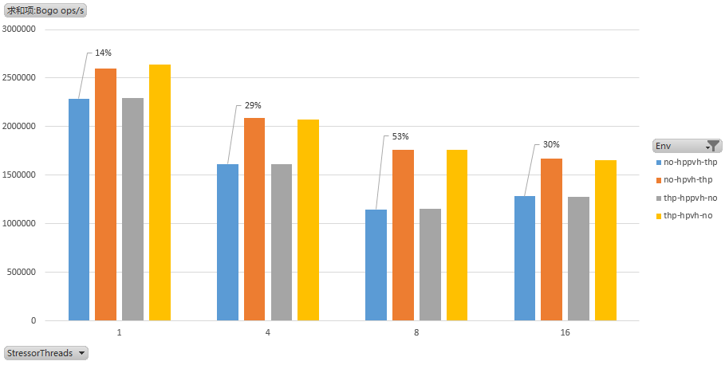
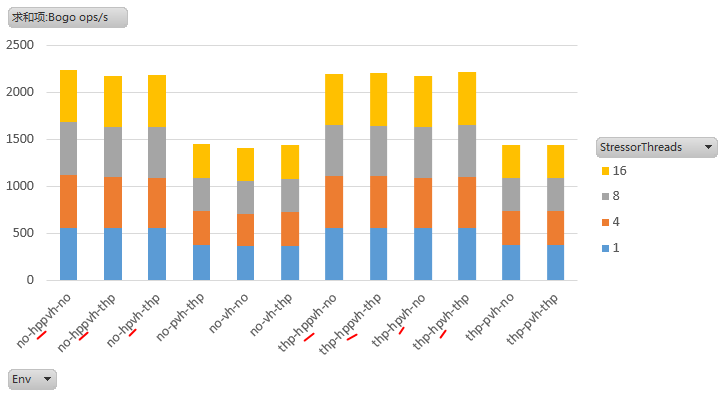
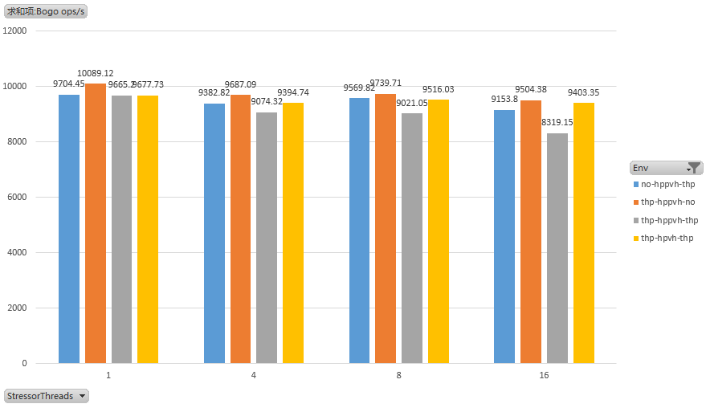

> @Date    : 2020-10-11 21:20:09
>
> @Author  : Lewis Tian (taseikyo@gmail.com)
>
> @Link    : github.com/taseikyo

# 大页内存在虚拟化中的应用

> 原文：http://mnstory.net/2016/06/30/qemu-hugepages/ 作者：http://mnstory.net/ 2016-06-30

## Table of Contents

- [原理](#原理)
	- [虚拟内存](#虚拟内存)
	- [逻辑地址与物理地址](#逻辑地址与物理地址)
	- [虚拟机地址转换](#虚拟机地址转换)
	- [大页如何提升性能](#大页如何提升性能)
- [配置](#配置)
	- [HOST 机启动透明大页步骤](#host-机启动透明大页步骤)
	- [GUEST 机启动透明大页步骤](#guest-机启动透明大页步骤)
	- [QEMU 为 GUEST 机指定大页内存](#qemu-为-guest-机指定大页内存)
- [测试方法](#测试方法)
- [测试结论](#测试结论)
- [参考资料](#参考资料)

## 原理

### 虚拟内存

简单说，没有虚拟内存的概念，那么 COPY ON WRITE，SWAP 等技术都不是必要的，但是系统的弹性和容量会大打折扣。对比物理内存，我们可以认为虚拟内存比物理内存多许多，这个优点依赖于一个重要实现手段叫做 page fault，我们将进程 “分配内存” 和“访问内存”概念分开，分配了内存不访问，是可以不占物理内存的（未初始化未置零等），分配了内存访问，也不一定占用更多的物理内存（COPY ON WRITE）。假设某一虚拟内存已经分配给进程 A，当进程 A 去访问所在内存页时，可能出现：

1. 内存页已经存在于 CPU Cache 或物理内存，并且进程 A 有访问权限。这是正常情况
2. 内存页已经存在于 CPU Cache 或物理内存，但是进程 A 还没有访问权限或者第一次访问前并没有实际载入，例如，进程 A 要访问 libc.so 的代码段，这段虚拟内存其实已经被其他进程加载到物理内存了，但是还没有赋给进程 A 访问权限，此时发生 page fault，我们称之为 minor page fault
3. 内存页不存在于 CPU Cache 和物理内存。可能原因是内存已经被交换到交换分区，此时我们需要通过 IO 将内存页读入物理内存再给进程 A 访问，此过程我们称之为 major page fault

想要证明 min_flt 和 maj_flt 的发生，我们可以使用 /usr/bin/time -v CMD 来执行命令，例如，我们运行一个记事本，第一次运行的时候，会从磁盘载入共享库，所以会有 Major (requiring I/O) page faults，第二次，我们先运行一个记事本程序，再使用 /usr/bin/time –v 运行记事本，由于使用到的共享库已经加载到内存了，我们会看到 Major (requiring I/O) page faults 会减少甚至为 0。

通过 PS 命令，我们可以查看进程的 min_flt 和 maj_flt，用于判断是否有内存访问瓶颈：

```Bash
[root@oracle ~]# ps -eo min_flt,maj_flt,pid,%cpu,%mem,pagein,args  --sort=-min_flt

 MINFL  MAJFL   PID %CPU %MEM PAGEIN COMMAND

363908      0  2649 75.5  0.3      0 stress-ng --mlock 4 --metrics-brief

 15213    168  2423  0.3  0.2    168 ohasd.bin
```

用 vmstat 命令，查看 swap 项的 si(swap in) 和 so(swap out)，如果 si/so 数字过大，表示系统整体存在内存瓶颈：

```Bash
[root@oracle ~] # vmstat 1

procs -----------memory---------- ---swap-- -----io---- -system-- ----cpu----

 r  b   swpd   free   buff  cache   si   so    bi    bo   in   cs us sy id wa

27  0     12 351440 11292 442848    0    0   386   202    1    1 57 27 16  0

39  0     12 350620 11296 442436    0    30  536   216 275955 407329 39 30 32  0

22  0     12 351192 11204 442644    2    0   516   548 259866 388894 36 29 34  1
```

swap 分区用来交换内存，si 表示 swap in 次数， so 表示 swap out 次数，vm.swappiness 参数可以设置 swap 的权重，swappiness 值越小，表示越应该保留在内存，反之，越应该保留在交换分区，默认为 60。

### 逻辑地址与物理地址

对进程而已，能操作的都是虚拟内存地址，我也称它为逻辑地址，程序要读取一个内存，要经历如下步骤：

1. 逻辑地址转换为线性地址

CPU 将逻辑地址先送到 MMU（Memory Management Unit），这是一个辅助硬件，它根据当前的段选择符取得段基址，然后加上虚拟地址中的偏移，转换为线性地址。在 64 位系统中，线性地址使用 48bit 用于存放地址索引，从高位到低位分有 PML4，PDP，PD，PT 和最终偏移，如下表，参考 [48-bit_virtual_address_space](http://wiki.osdev.org/Page_Tables#48-bit_virtual_address_space)：
  
| Level | Table  | Range             |           | Bits           | Pages          |               |
|-------|--------|-------------------|-----------|----------------|----------------|---------------|
| 0     | (page) | 0x1000            | (4 KiB)   | [11:0] 12 bits | 0x1            | (1)           |
| 1     | PT     | 0x20 0000         | (2 MiB)   | [20:12] 9 bits | 0x200          | (512)         |
| 2     | PD     | 0x4000 0000       | (1 GiB)   | [29:21] 9 bits | 0x40000        | (262144)      |
| 3     | PDP    | 0x80 0000 0000    | (512 GiB) | [38:30] 9 bits | 0x800 0000     | (134217728)   |
| 4     | PML4   | 0x10000 0000 0000 | (256 TiB) | [47:39] 9 bits | 0x10 0000 0000 | (68719476736) |

对比线性地址和物理地址的结构，尾巴都是一样，皆为一页内 offset：


  
2. MMU 通过查找 TLB 和 PT 查找，得到物理地址

借用 [18-447 Lecture 21: Virtual Memory: Page Tables and TLBs](https://users.ece.cmu.edu/~jhoe/course/ece447/handouts/L21.pdf) 的图一张，说明 VA 到 PA 的转换流程：



这里 TLB lookup 是对每一节 VPN（Virtual Page Number） 都有 lookup，最常见的就是 64 位地址下的 PML4，PDP，PD，PT 四节 VPN，上一级找到下一级的 PTA（Page Table Address），然后载入下一级 PT 内容加上下一级 VPN 号（就是一个 PT 内偏移序号），再获得下一级的 PTA，如此往复，所以，只有 VPN1 的 PTA 是存储在 CR3 寄存器里的，因为它没有上级，其他的都是一级一级查到的。参考[Virtual Memory](http://zacharski.org/files/courses/cs405/computerSystemsChapter9.pdf)



经过上面步骤，虚拟地址到物理地址转换完成，然后 MMU 还要负责从内存读取指定物理地址的数据，数据达到 CPU 前先缓存到 L1 Cache 里面，以便下次还要用，如下盗图很好诠释了 CPU、MMU、Cache 和 Memory 之间复杂的四角恋关系：



当要访问的数据，已经存在内存中，但是还没有分配给你，比如你是后启动的进程，需要加载共享代码 libc.so，但是 libc.so 早被其他进程 load 进入内存，只是你还没有访问权限，此时发生 minor page faults

准确地说，完成一次内存数据读取，是五角恋，当数据不在 Cache 里面，而要在 Memory 里面查找，我们称此次访问为 min fault，如果 Memory 里面也这不到，那很有可能是被交换到交换分区了，那还要去磁盘查找，我们称此次访问为 max pagefault

### 虚拟机地址转换

前面介绍了物理机逻辑地址转换为物理地址的过程，这事挺复杂，不过，当系统运行在虚拟机内部时，事儿就更复杂了。
盗用[Accelerating Two-Dimensional Page Walks for Virtualized Systems](http://vglab.cse.iitd.ac.in/~sbansal/csl862-virt/readings/p26-bhargava.pdf) 里的一张图，给大家感受一下，这事儿有多复杂（左边 (a) 是物理机从 VA 翻译到 PA 的流程，右边 (b) 是虚拟机 VA 到 PA 的流程）



因为，物理机 L4 获取到的地址是 PA，虚拟机 L4 获取的地址是 GPA（Guest Physical Address），GPA 不能直接读数据，要转换为 SPA（System Physical Address）才能读，所以，每一节 VPN 载入 TP 的时候，都多了 GPA 到 SPA 的步骤，而 GPA 到 SPA 是如何转换的？

一种方案是 Shadow Paging 技术，由 Hypervisor 维护一个由 GVA 到 SPA 的映射关系，如图（图片来源 [Address Translation for Virtual Machines](http://www.cs.rochester.edu/~sandhya/csc256/seminars/hedayati_vm_npt.pdf)）：


 
看上去很美，一步到位，但是，这过程是由 Hypervisor 来完成，通过对 Guest PT 写保护，跳到软件实现的虚拟 TLB 来查找，效益大打折扣。
后来 INTEL 跳出来，说你们这个太 LOW，你看我搞硬件搞的这么 NB，再给你们搞个硬件版的 GPA 到 SPA 的映射，不就 OK 了？INTEL 取名叫 EPT（Extended Page Table），AMD 不甘示弱了，也搞了个类似的，叫 NPT（Nested Page Table）。

于是，你看到了，如上上图，现在有了 EPT 技术，查表过程一下有了深度，从一维变成了 Two-Dimensional，看上去，步骤是有点多。

### 大页如何提升性能

大页的原理很简单，以 64 位地址为例，48bit 的地址划分了 PML4，PDP，PD，PT 四节 VPN 和一节 VPO，查表查到 PT 这个级别，就是 4K 一页，如果查到 PD 级别，就是 4k * 512=2M 一页，如果查到 PDP 级别，就是 2M * 512=1G 一页，所以，你只听说过 2M 或 1G 的大页，没有听说个 16M 的大页。

假设我们分配 2M 的页，那么查表查到 PD 级别，相当于减少了 1/5 的查表工作，速度是不是应该快点？其次，粒度变大了，TLB 在相同容量下，不用 switch out 更多的表项，带来 TLB Hit 增加 Miss 减少，是不是也能提高性能？（不要小看 TLB 的 Cache Miss 哦，只要频率足够，它就可以成为瓶颈，而内存访问，基本贯穿了每条 CPU 指令）

## 配置

### HOST 机启动透明大页步骤

HOST 机使用的是 debain 7，查看当前是否开启透明大页，值为 never 表示未开启：

```Bash
host/~ # cat /sys/kernel/mm/transparent_hugepage/enabled 

always madvise [never]
```

其中 AnonHugePages 内存项的使用也为 0：

```Bash
host/~ # grep AnonHugePages /proc/meminfo

AnonHugePages:         0 kB
```

将 transparent_hugepage 的 enabled 设置为 always，开启 THP：

```Bash
host/~ # echo always > /sys/kernel/mm/transparent_hugepage/enabled
```

下面这个 defrag 是用于回收碎片的，我测试的时候发现上面的 enabled 开启后，下面也会跟着变，不用单独设置 /sys/kernel/mm/transparent_hugepage/defrag。

做一些耗内存的操作，可以看到 AnonHugePages 值有所变化，表示开启成功：

```
host/~ # grep AnonHugePages /proc/meminfo

AnonHugePages:    327680 kB
```

### GUEST 机启动透明大页步骤

为保证 GUEST 机测试的一致性，我们不使用类似 HOST 机的运行时开启方式，而是在启动参数里面开启或关闭，每次测试都重启 GUEST 系统，GUEST 使用的是 redhat6.4，默认都是开启 THP 的，如果想关闭，在启动参数里添加 transparent_hugepage=never 即可：

```Bash
guest/~ # cat /boot/grub/grub.conf 

default=0

timeout=5

splashimage=(hd0,0)/grub/splash.xpm.gz

hiddenmenu

title Red Hat Enterprise Linux (2.6.32-358.el6.x86_64)

    root (hd0,0)

    kernel /vmlinuz-2.6.32-358.el6.x86_64 ro root=/dev/mapper/vg_oracle-lv_root rd_NO_LUKS LANG=en_US.UTF-8 rd_LVM_LV=vg_oracle/lv_root rd_NO_MD rd_LVM_LV=vg_oracle/lv_swap SYSFONT=latarcyrheb-sun16 crashkernel=128M  KEYBOARDTYPE=pc KEYTABLE=us transparent_hugepage=never rd_NO_DM rhgb quiet

#    kernel /vmlinuz-2.6.32-358.el6.x86_64 ro root=/dev/mapper/vg_oracle-lv_root rd_NO_LUKS LANG=en_US.UTF-8 rd_LVM_LV=vg_oracle/lv_root rd_NO_MD rd_LVM_LV=vg_oracle/lv_swap SYSFONT=latarcyrheb-sun16 crashkernel=128M  KEYBOARDTYPE=pc KEYTABLE=us rd_NO_DM rhgb quiet

initrd /initramfs-2.6.32-358.el6.x86_64.img
```

### QEMU 为 GUEST 机指定大页内存

先查看下 Host 机大页内存当前状况，HugePages_Total 为 0 表示并未开启：

```Bash
host/~ # grep Huge /proc/meminfo

AnonHugePages:         0 kB

HugePages_Total:       0

HugePages_Free:        0

HugePages_Rsvd:        0

HugePages_Surp:        0

Hugepagesize:       2048 kB
```

我们 mount 一个 hugetlbfs 先：

```Bash
host/~ # mkdir -p  /dev/hugepages

host/~ # mount -t hugetlbfs hugetlbfs /dev/hugepages
```

这时候，使用 df 命令，可以看到 mount 的 /dev/hugepages，mount 参数是否指定大小不影响效果，例如你也可以这样：mount -t hugetlbfs hugetlbfs -o size=162282626k /dev/hugepages
（类似 vhost_user 之类的，可以指定默认页大小，也可以指定大页，如果使用默认页大小，将上述命令中的 hugetlbfs 修改为 tmpfs 即可）

有了 hugetlbfs，还要指定系统可以使用多少大页内存，如上，我们的 Hugepagesize 使用默认的 2048 kB，那么，假设虚拟设置的是 16G 内存，我们想为其指定 16G 内存，就需要 8192 块 2048 kB 页：

```Bash
host/~ # sysctl vm.nr_hugepages=8192

vm.nr_hugepages = 8192
```

再看 meminfo，HugePages_Total 为 8192，当前剩余量为 HugePages_Free-HugePages_Rsvd=8192。

```Bash
host/~ # grep Huge /proc/meminfo

AnonHugePages:         0 kB

HugePages_Total:    8192

HugePages_Free:     8192

HugePages_Rsvd:        0

HugePages_Surp:        0

Hugepagesize:       2048 kB
```

虚拟机启动参数里，需要显示指定大页内存，加上类似如下参数：

```Bash
-object memory-backend-file,id=mem,size=16384M,mem-path=/dev/hugepages,share=on -numa node,memdev=mem -mem-prealloc
```

至于后面这个 - mem-prealloc，如果添加，内存会提前分配，表现为启动 QEMU 后 HugePages 立即减少，Rsvd 为 0，(10240-2044) * 2/1024 = 16。

```Bash
host/~ # grep Huge /proc/meminfo 

HugePages_Total:   10240

HugePages_Free:     2044

HugePages_Rsvd:        0
```

如果不添加，就是延迟分配，那么启动 QEMU 后会有些内存属于 HugePages_Rsvd，并没有实际分配，(10240-(9747-7703)) * 2/1024 = 16。

```Bash
host/~ # grep Huge /proc/meminfo 

HugePages_Total:   10240

HugePages_Free:     9747

HugePages_Rsvd:     7703
```

## 测试方法

测试使用 stress-ng 工具（此工具请自行 google），选择 stressor 为 mlock，malloc，remap。
先写一个测试脚本跑在 GUEST 机里面，保证人工介入更少，测试工作顺利开展：

```Bash
#!/bin/bash
# hugepages effect test script, write by mnstory.net@20160601
EXE=stress-ng
main()
{
    if [ $# -lt 2 ]; then
        echo "$0, $hostenv=[no thp] $qemuenv=[vh pvh hpvh hppvh]" 1>&2
        return 1
    fi
    local he="$1" #no thp
    local qe="$2" #vh pvh hpvh hppvh
    local ge="no"
    local mem_thp=$(cat /proc/meminfo | grep AnonHugePages | awk '{print $2}')
    if [ $mem_thp -ne 0 ]; then
        ge="thp"
        echo "Guest THP on"
    else
        echo "Guest THP off"
    fi
    local tag="$he-$qe-$ge"
    local outstress="./stress.$tag"
    local cpu_p=$(cat /proc/cpuinfo  | grep 'physical id' | sort | uniq | wc -l)
    local cpu_c=$(cat /proc/cpuinfo  | grep 'core id' | sort | uniq | wc -l)
    local cpu_i=$(cat /proc/cpuinfo  | grep 'model name'  | head -1 | awk -F: '{print $2}' | sed -e 's/s//g')
    local mem_t=$(cat /proc/meminfo | grep MemTotal | awk '{print $2}')
    local numa_hit=$(numastat -n | grep Numa_Hit | awk '{print $NF}')
    local numa_miss=$(numastat -n | grep Numa_Miss | awk '{print $NF}')
    for s in remap malloc mlock; do
        for t in 60; do
            for c in 1 4 8 16; do
                # stress-ng --mlock 1 --timeout 2s --metrics-brief 2>/dev/null | grep '] mlock' | awk -F] '{print $2}'
                # mlock            21747      2.07      0.00      1.58     10519.09     13763.92
                echo "$EXE --$s $c --timeout ${t}s --metrics-brief"
                local numa_hit2=$(numastat -n | grep Numa_Hit | awk '{print $NF}')
                local numa_miss2=$(numastat -n | grep Numa_Miss | awk '{print $NF}')
                local record="$($EXE --$s $c --timeout ${t}s --metrics-brief 2>/dev/null | grep "] $s" | awk -F] '{print $2}')"
                local numa_hit_diff=$(echo "$numa_hit2-$numa_hit" | bc -l)
                local numa_miss_diff=$(echo "$numa_miss2-$numa_miss" | bc -l)
                numa_hit=$numa_hit2
                numa_miss=$numa_miss2
                echo "$tag $he $qe $ge $c $cpu_p $cpu_c $cpu_i $mem_t $numa_hit_diff $numa_miss_diff $record" >> $outstress
            done
        done
    done
}
main "$@
```

脚本中需要两个参数，其中参数 1，2 我取如下值，表示：

|||
|-|-|
| no    | Host或Guest保持系统默认，不开启透明大页             |
| thp   | Host或Guest开启透明大页内存(Transparent Huge Pages) |
| vh    | Qemu为Guest指定vhost_user方式                       |
| pvh   | Qemu为Guest指定预分配vhost_user方式                 |
| hpvh  | Qemu为Guest指定大页vhost_user方式                   |
| hppvh | Qemu为Guest指定大页预分配vhost_user方式             |

## 测试结论

1. Host 是否开启透明大页对 GUEST 无影响或者影响甚微。
2. Guest 是否开启透明大页对测试结果无影响或者影响甚微。
3. QEMU 是否为 GUEST 指定大页内存有影响，总的来说，最优选择是使用**大页延迟分配**。如下图为 HOST 不开启透明大页，QEMU 为 GUEST 指定大页内存与否的测试效果，性能提升 26%-32%：


  
| Stressor | 耗时 | QEMU是否为GUEST指定大页内存 |
|-|-|-|
| Malloc | 90%为user耗时 | 指定大页情况下，是否延迟分配对效果影响明显，“预分配”比“延迟分配”,单线程压力差14%，多线程压力平均差36%，如图A2 不指定大页时，是否延迟分配对效果无影响 |
| Remap | 88%为sys耗时 | 指定大页效果比不指定效果好53%，如图B2 |
| Mlock | 88%为sys耗时 | 指定预分配大页情况下，如果Host机和Guest同时启用透明大页，效果相对差6%，也可能在误差范围内，如图C2 |
  


Finger A2，预分配效果比延迟分配, 单核情况差 14%，多核情况平均差 36%（测试图中 Env 项，例如 no-hpvh-thp 表示：主机使用默认配置不开启透明大页， Qemu 为 Guest 指定大页 vhost_user 方式，Guest 开启透明大页，参照表）
  


Finger B2，指定大页效果比不指定效果好 53%



Finger C2，指定预分配大页情况下，如果 Host 机和 Guest 同时启用透明大页，效果相对差 6%，也可能在误差范围内
  
**在 GUEST 为 ORACLE 场景下，开启大页后，内存密集型的测试性能提升也在 30% 左右，而且开启后消耗内存更稳定。**
  
## 参考资料

* Address Translation for Virtual Machines http://www.cs.rochester.edu/~sandhya/csc256/seminars/hedayati_vm_npt.pdf
* Accelerating Two-Dimensional Page Walks for Virtualized Systems http://vglab.cse.iitd.ac.in/~sbansal/csl862-virt/readings/p26-bhargava.pdf
* Virtual Memory http://zacharski.org/files/courses/cs405/computerSystemsChapter9.pdf
* Virtual Memory Manager https://www.ibm.com/support/knowledgecenter/ssw_aix_71/com.ibm.aix.osdevice/virt_mem_mgr.htm
* UNDERSTANDING PAGE FAULTS AND MEMORY SWAP-IN/OUTS: WHEN SHOULD YOU WORRY? http://blog.scoutapp.com/articles/2015/04/10/understanding-page-faults-and-memory-swap-in-outs-when-should-you-worry
* Best Practices for Paravirtualization Enhancements from Intel? Virtualization Technology: EPT and VT-d https://software.intel.com/en-us/articles/best-practices-for-paravirtualization-enhancements-from-intel-virtualization-technology-ept-and-vt-d
* KVM MMU Virtualization https://events.linuxfoundation.org/slides/2011/linuxcon-japan/lcj2011_guangrong.pdf
* 18-447 Lecture 21: Virtual Memory: Page Tables and TLBs https://users.ece.cmu.edu/~jhoe/course/ece447/handouts/L21.pdf

下载 [Accelerating Two-Dimensional PageWalks.pdf](http://mnstory.net/2016/06/30/qemu-hugepages/Accelerating%20Two-Dimensional%20PageWalks.pdf)