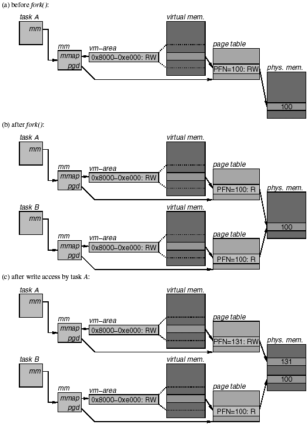
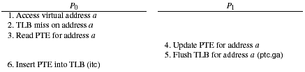
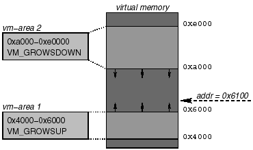

> @Date    : 2020-10-20 ‏‎11:22:59
>
> @Author  : Lewis Tian (taseikyo@gmail.com)
>
> @Link    : github.com/taseikyo

> 原文：https://www.informit.com/articles/article.aspx?p=29961&seqNum=5

## 4.5 Page Fault Handling

A page fault occurs when a process accesses a virtual page for which there is no PTE in the page table or whose PTE in some way prohibits the access, e.g., because the page is not present or because the access is in conflict with the access rights of the page. Page faults are triggered by the CPU and handled in the page_fault_handler.

Because Linux uses demand paging and page-fault-based optimizations such as copy-on-write, page faults occur during the normal course of operation and do not necessarily indicate an error. Thus, when the page fault handler is invoked, it first needs to determine whether the page fault is caused by an access to a valid page. If not, the page fault handler simply sends a segmentation violation signal to the faulting process and returns. Otherwise, it takes one of several possible actions:

- If the page is being accessed for the first time, the handler allocates a new page frame and initializes it, e.g., by reading its content from disk. Page faults caused by first-time accesses are called demand_page_faults.
- If the page has been paged out to swap space, the handler reads it back from disk into a newly allocated page frame.
- If the page fault occurred because of a page-fault-based optimization (such as copy-on-write), the handler takes the appropriate recovery action (such as performing the delayed page copy).

Each of these actions results either in a new or updated page, and the handler must accordingly either create or update the PTE in the page table. Because the page-table tree is also created on demand, installing a new PTE may require allocating and initializing a middle and a PTE directory (the global directory is guaranteed to exist already). The page fault handler can use the pmd_alloc() and pte_alloc() routines from Section 4.3.6 for this purpose. Before the handler installs the PTE, it updates the **accessed** and **dirty** bits as well. Since the page fault itself is an indication that the page is being accessed, the handler uses pte_mkyoung() to unconditionally turn on the **accessed** bit. On the other hand, the **dirty** bit is turned on by pte_mkdirty() only if the page fault is the result of a write access. After updating the page table, the page fault handler returns and execution resumes in the faulting process. There, the instruction that previously faulted is restarted and, thanks to the updated page table, it can now complete execution.

The above description glanced over two important questions: how does the kernel determine whether an access is valid and, if it is, how does it determine what action to take?

To verify the validity of an access, the page fault handler must search the vm-area list (or the AVL tree if it exists) for the vm-area that covers the page being accessed. If the vm-area exists and its access right flags (VM_READ, VM_WRITE, and VM_EXEC) permit the access, then the access is valid. The answer to the second question is determined primarily by the state of the page table as it exists on entry to the handler:

1. The handler can determine whether it is dealing with a demand page fault by checking whether the PTE exists in the page table. If either pmd_none() or pte_none() returns **true**, then the PTE does not yet exist and the fault is a demand page fault. The exact action to be taken for such a fault depends on the vm-area that covers the page. If this vm-area defines its own nopage() callback, the handler deals with the fault by invoking the callback; otherwise, it handles the fault by creating an anonymous page. The nopage() handler often ends up reading the content of the page from a file, but more complex actions, such as reading the page from a remote machine, are also possible.
2. The **present** bit of the Pte tells the handler whether a page has been paged out to swap space. If the bit is cleared (pte_present() returns **false**), the handler knows that it is dealing with a page that has been paged out. The appropriate action is for the handler to read the page back in from swap space.
3. Finally, page-fault-based optimizations manifest themselves as differences between the PTE and the vm-area for the page. For example, a copy-on-write page can be identified by the fact that the PTE disallows write accesses (pte_write() returns **false**), yet the vm-area permits them (the VM_WRITE access right is enabled). The appropriate action to handle such faults depends on the exact optimization that is being performed. For a copy-on-write page, the handler would have to perform the delayed page copy.

The discussion so far illustrates that page fault handling is a complex operation: it may involve reading a page from swap space, from an arbitrary filesystem, or even from a remote machine. Fortunately, as we see in Section 4.5.2, the platform-specific part of the kernel only has to handle those aspects that are unique to the platform, because all other work is taken care of by the Linux page fault handler.

### 4.5.1 Example: How copy-on-write really works

To get a better idea of how the page fault handler coordinates its work with the rest of the kernel, let us look at how Linux handles copy-on-write pages. Let us assume a process A with a single region of virtual memory that is writable and that occupies the address range from 0x8000 to 0xe000. Let us further assume that only the page at address 0xa000 is resident in the virtual memory. Figure 4.35 (a) illustrates this case. At the top left, we find the task structure labeled task A. The task structure contains a pointer to the mm structure that represents the address space of this process. In the box labeled mm, we find a pointer to the vm-area list, labeled mmap, and a pointer to the page table, labeled pgd. In reality, pgd_points to the global directory of the page table. However, for simplicity the figure represents



**Figure 4.35. Example of a copy-on-write operation.**

the page table as the linear table labeled page table. Because the process has only a single region mapped in the virtual memory, the vm-area list has just a single entry, represented by the box labeled vm-area. To keep the complexity of the figure within reason, the vm-area shows only the starting and ending address of the region and the access rights (RW, for read and write access). Because we assumed that the page at 0xa000is resident, it has an entry in the page table and maps to some page frame. In the figure, we assumed that the virtual page is backed by physical page frame 100. Since the page is both readable and writable, the PTE for this page has the permission bits set to RW.

Now let us assume that process A invokes the clone2() system call without specifying the CLONE_VM flag. In a traditional UNIX system, this would be equivalent to calling fork() and has the effect of creating a new process that is a copy of the caller. The state as it would exist after clone2() returns is illustrated in Figure 4.35 (b). As the figure shows, the new process has its own task structure, labeled task B and its own copies of mm, vm-area, and page table. The two processes are identical, but note how clone2() turned off write permission in the PTEs of both the parent and the child. It does this for every writable PTE in an attempt to delay the copying of writable pages as long as possible. Turning off write permission in the PTEs of writable pages is the first step of a copy-on-write; it ensures that neither process can write to the page without first causing a page fault. Note that the access permissions in the vm-area structures remain unchanged at RW.

So what happens when one of the processes attempts to write to the virtual page at 0x8000? Suppose process A writes to the page first. Because the PTE allows only read accesses, this write triggers a page fault. The page fault handler goes through the steps described in the previous section and first locates the matching vm-area. It then checks whether the vm-area permits write accesses. Because the vm-area in process A still has the access rights set to RW, the write access is permitted. The page fault handler then checks whether the PTE exists in the page table and whether the PTE has the **present** bit on. Because the page is resident, both of these checks pass. In the last step, the page fault handler checks whether it is dealing with a write access to a page whose PTE does not permit write accesses. Because this is the case, the handler detects that it is time to copy a copy-on-write page. It proceeds by checking the page frame descriptor of page frame 100 to see how many processes are currently using this page. Because process B is also using this page frame, the count is 2 and the page fault handler decides that it must copy the page frame. It does this by first allocating a free page frame, say, page frame 131, copying the original frame to this new frame, and then updating the PTE in process A to point to page frame 131. Because process A now has a private copy of the page, the access permission in the PTE can be set to RW again. The page fault handler then returns, and at this point the write access can complete without any further errors. Figure 4.35 (c) illustrates the state as it exists at this point.

Note that the PTE in process B still has write permission turned off, even though it is now the sole user of page frame 100. This remains so until the process attempts a write access. When that happens, the page fault handler is invoked again and the same steps are repeated as for process A. However, when checking the page frame descriptor of page frame 100, it finds that there are no other users and goes ahead to turn on write permission in the PTE without first making a copy of the page.

The Linux kernel provides a platform-independent page_fault_handler (handle_mm_fault() in file mm/memory.c) that takes care of handling most aspects of page fault handling. Platform-specific code is responsible for intercepting any virtual-memory-related faults that a CPU may raise and invoking the handler as necessary. The interface of the Linux page fault handler is shown below:

```C
int handle mm fault( mm, vma, addr, access type);
```

The routine takes four arguments: mm is a pointer to the mm structure of the address space in which the fault occurred, vma is a pointer to the vm-area that covers the page that is being accessed, addr is the virtual address that caused the fault, and access type is an integer indicating the type of access (read, write, or execute). The return value is an indication of how the page fault was handled. A return value of 1 signifies that the fault was handled successfully and that it should be counted as a minor fault. This means that the page installed was already in memory, e.g., because the page is in use by another process as well. A return value of 2 signifies that the fault was also handled successfully, but that it should be counted as a major fault because the page had to be read from disk, e.g., from a file or swap space. A value of 0 signifies that the page fault could not be handled properly and that the kernel should send a bus error signal (SIGBUS) to the process. Finally, a negative return value signifies that the kernel is completely out of memory and that the faulting process should be terminated immediately.

Before invoking handle_mm_fault(), platform-specific code must perform these steps:

1. Determine the virtual address addr that triggered the fault.
2. Determine the access type (read, write, or execute).
3. Verify that the fault occurred in user mode and, if so, get the mm structure pointer mm of the currently running process (task).
4. Find the vm-area structure that covers the page being accessed.
5. Verify that the access type is permitted by the vm-area structure.

If all of these steps are completed successfully, the Linux page fault handler can be invoked. After the handler returns, the platform-specific code is responsible to account the fault either as a minor or a major fault, depending on whether the return value was 1 or 2, respectively (this accounting info is stored in the task structure described in Chapter 3, _Processes, Tasks, and Threads_). If the return value is 0, a bus error signal must be sent to the process and if it is negative, the process must be terminated immediately (as if it had called exit()).

What should the platform-specific code do if one of the above steps fails? The answer depends on exactly which step failed. The first two steps (determining the fault address and access type) usually cannot fail.

If the third step fails, the page fault occurred in kernel mode. This is normally an indication of a kernel bug and results in a panic (kernel stops execution). However, the Linux kernel may legitimately cause page faults while copying data across the user/kernel boundary. Thus, when a page fault happens in kernel mode, platform-specific code must check whether it was the result of such a copy and, if so, initiate an appropriate recovery action. We describe in Chapter 5, _Kernel Entry and Exit_, exactly what this entails.

If the fourth step fails, there is no vm-area that covers the page being accessed; this is normally an indication of an attempt to access nonexistent virtual memory. If this failure occurs, the platform-specific code sends a segmentation violation signal to the process. There are two special cases, however: If the page accessed is just above a vm-area with the VM_GROWSUP flag set or just below a vm-area with the VM_GROWSDOWN flag set, the platform-specific code must expand the corresponding vm-area to include the page being accessed and then use this expanded vm-area to finish processing the page fault in the normal fashion. This mechanism is intended for automatic stack expansion and is permitted only if the resulting stack size does not exceed the stack size limit (RLIMIT_STACK) or the virtual-address-space limit (RLIMIT_AS) established by the setrlimit() system call.

If the fifth and last step fails, the process attempted to access the address space in an illegal fashion (e.g., it tried to execute a read-only page) and the platform-specific code again sends a segmentation violation signal to the process.

### 4.5.3 IA-64 implementation

When a virtual-memory-related fault occurs on IA-64, the interruption handling described in Chapter 2, _IA-64 Architecture_, is initiated. Recall that, among other things, this handling switches the CPU to the most-privileged execution level (level 0), turns off the interruption collection (ic is cleared in psr), activates bank 0 of registers r16 to r31, and then hands over control to the appropriate handler in the interruption vector table (IVT).

The architecture defines a total of 13 virtual-memory-related faults, each with its own handler. A set of six faults handles TLB misses and another set of seven faults handles PTE-related faults. Three primary control registers pass information to these handlers:

- The _interruption status register_ (isr) contains various flag bits that indicate the type of access that caused the fault. For example, three bits indicate whether the fault occurred as a result of a read, write, or execute access.
- The _interruption faulting address_ (ifa) register contains the virtual address that caused the fault.
- The _interruption hash address_ (iha) register is used when a TLB miss occurs as a result of the VHPT walker attempting to access the virtually-mapped linear page table. When this happens, the iha register contains the virtual address that the VHPT walker was attempting to access.

The fault handlers first read these control registers to determine how to handle the fault. The bank 0 registers are active at that time, so the handlers can use registers r16 to r31 for this purpose. Doing so avoids the need to save CPU state to memory. Indeed, whenever possible, the handlers attempt to complete the entire fault handling with only the bank 0 registers. However, because the bank 0 registers are available only while ic is off, more complicated fault handling, in particular any fault handling that requires invoking the Linux page fault handler, forces the handlers off the fast path and also forces them to save the essential CPU state in a pt-regs structure in memory (see Chapter 3, _Processes, Tasks, and Threads_). Once this state has been saved, control can be handed over to the Linux page fault handler.

#### Table 4.4. IA-64 TLB miss faults.

| Fault                  | Description                                                                       |
|------------------------|-----------------------------------------------------------------------------------|
| ITLB FAULT             | Instruction access missed in the instruction TLB.                                 |
| DTLB FAULT             | Data access missed in the data TLB.                                               |
| VHPT TRANSLATION FAULT | VHPT access missed in the data TLB.                                               |
| ALTERNATE ITLB FAULT   | Instruction access missed in the instruction TLB and the VHPT walker is disabled. |
| ALTERNATE DTLB FAULT   | Data access missed in the data TLB and the VHPT walker is disabled.               |
| DATA NESTED TLB FAULT  | Data access missed in the TLB during execution with ic off.                       |

#### TLB miss handlers

Table 4.4 lists the six types of TLB-related misses. As the table shows, IA-64 breaks down TLB faults according to the cause of the miss. There are separate handlers for misses triggered by instruction fetches (execute accesses), data accesses (read or write accesses), and VHPT walker accesses. The alternate ITLB and DTLB miss handlers are triggered when the VHPT walker is disabled for the region being accessed (as controlled by a bit in the region register) or when the walker is disabled completely (as controlled by the page table address register bit pta.ve). The DATA NESTED TLB FAULT is triggered when a TLB miss occurs while interruption collection is disabled (ic bit is off), i.e., while another fault is being handled. Ordinarily, a nested fault would indicate a kernel bug. However, as we will see below, Linux/ia64 uses nested TLB misses to support nonspeculative accesses to the virtually-mapped linear page table.

#### Nested DTLB miss handler

Let us start by taking a look at how the handler for the DATA NESTED TLB FAULT works. It is effectively a helper routine that translates a virtual address addr to the physical address pte_paddr at which the corresponding PTE can be found. Because this fault is triggered only while ic is off, the CPU does not update the control registers and they instead continue to contain the information for the original fault. Unfortunately, the information in the control registers is not sufficient for the nested DLTB miss handler to complete its job. Thus, Linux/ia64 uses three bank 0 registers to pass additional information between the handler of the original fault and the nested DTLB miss handler. The first register is used to pass the virtual address addr, and the second is used to pass the address rlabel to which execution should return once the nested DTLB handler is done. The third register serves as the result register and is used to return pte_paddr.

The nested DTLB miss handler operates by turning off the data translation bit psr.dt and then walking the three-level page table. Because physical data accesses are used during the page-table walk, there is no danger of triggering further TLB misses. The starting point of the page-table walk is determined by the region that addr is accessing. If it accesses region 5, the kernel page table is used; otherwise (access to region 0 to 4), the page table of the currently running process is used. If the walk is completed successfully, the physical address of the found PTE is placed in the result register and control is returned to the original handler by a jump to address rlabel. If any error is encountered during the page-table walk (e.g., because the virtual address is not mapped), control is transferred to the Linux page fault handler instead.

#### ITLB/DTLB miss handler

With the operation of the nested DTLB miss handler explained, it is straightforward to describe the ITLB and DTLB miss handlers. In a first step the TLB miss handlers read the ifa control register to determine the faulting address addr. In a second step, the bank 0 registers are set up so that the nested DTLB handler can find the necessary information in case execution later triggers a DATA NESTED TLB FAULT. Specifically, the faulting address addr and the return address rlabel are placed in the bank 0 registers used for this purpose. In the third step, the actual work can begin: The handlers use the thash instruction to translate the faulting address addr to pte_vaddr, the address in the virtually-mapped linear page table at which the PTE for addr can be found. The handlers then attempt to read the PTE by loading the word at this address. If the TLB entry for pte_vaddr exists, the load succeeds and the PTE can be installed either in the ITLB (for an ITLB miss) or in the DTLB (for a DTLB miss). Conversely, if the TLB entry for pte_vaddr is missing, a DATA NESTED TLB FAULT is triggered and the CPU hands over control to the nested DTLB miss handler. As described previously, this handler walks the page table in physical mode and, if a mapping exists for addr, places the physical address pte_paddr of the PTE in the result register. The nested miss handler then returns control to the original handler with the data translation bit dt still turned off. The original handler now has the physical address pte_paddr of the PTE, and because data accesses are still done in physical mode, the handler can directly load the word at this address, without the risk of causing any further faults. This procedure again yields the desired PTE, which can then be installed in the appropriate TLB (ITLB or DTLB).

The elegance of handling TLB misses in this fashion derives from the fact that both the virtual and physical access cases use exactly the same instruction sequence once the PTE address has been determined. The only difference is whether loading the PTE occurs in physical or in virtual mode. This means that the address rlabel can be the address of the same load instruction that attempts to read the PTE from the virtually-mapped linear page table. If the virtual access fails, the load instruction is reexecuted after the nested DTLB miss handler returns, but now in physical mode. Note that, for this technique to work, the address register of the load instruction must be the same as the result register that the nested DTLB handler uses to return the physical address of the PTE.

#### VHPT miss handler

When a TLB miss occurs in a region for which the VHPT walker has been enabled, the walker first attempts to handle the miss on its own. Conceptually, it does this by using the thash instruction to translate the faulting address addr to pte_vaddr, the address in the virtually-mapped linear page table at which the PTE for addr can be found. If the TLB entry for pte_vaddr is present in the TLB, the VHPT walker (usually) can handle the miss on its own. On the other hand, if this TLB entry is also missing, the CPU raises a VHPT TRANSLATION FAULT and passes addr in control register ifa and pte_vaddr in iha.

Once the VHPT miss handler starts executing, it extracts the original faulting address addr from ifa and then traverses the page table in physical mode, just like the nested DTLB miss handler. Once the physical address of the PTE has been found, the PTE is loaded and installed in the appropriate TLB (DTLB if the original access was a data access, ITLB otherwise). In addition, the VHPT constructs and inserts into the DTLB a translation that maps the address contained in iha. This ensures that future TLB misses to nearby addresses can be handled through the virtually-mapped linear page table.

Because this handler inserts two translations in the TLB, care must be taken to ensure that the CPU can make forward progress, even if only one of the two translations survives. Fortunately, in this particular case, the order of insertion does not matter because the CPU can make forward progress either way: If the translation for the original faulting address survives, the access that caused the fault can obviously complete without further TLB misses. Conversely, if translation for the virtually-mapped linear page table survives, the VHPT walker is either able to handle the reoccurrence of the TLB miss for the original faulting address on its own or the CPU raises a regular ITLB or DTLB FAULT, which would also resolve the fault.

Note that with a perfect VHPT walker, the CPU would only raise VHPT TRANSLATION FAULTs—regular ITLB or DTLB FAULTs would never be raised. However, the IA-64 architecture leaves CPU designers the option of implementing an imperfect VHPT walker or of omitting it completely. This flexibility is achieved by the requirement that if a VHPT walker cannot handle a particular TLB miss, the CPU must raise an ITLB or DTLB FAULT instead. In the most extreme case of a nonexistent VHPT walker, this means that instead of VHPT TRANSLATION FAULTs, only ITLB or DTLB FAULTs would occur. In a more realistic scenario, the VHPT walker would be able to handle most TLB misses except that in certain corner cases, it would have to resort to raising an ITLB or DTLB FAULT. For example, the Itanium VHPT walker can handle virtual page-table accesses as long as the PTE can be found in the second-level cache. If the PTE is not cached, the walker gives up and raises an ITLB or DTLB FAULT instead.

#### Alternate ITLB/DTLB miss handler

The CPU dispatches to the alternate ITLB and DTLB handlers when a TLB miss occurs and the VHPT walker is disabled. Because regions 6 and 7 of the virtual address space of Linux/ia64 are identity-mapped, they have no associated page table and the VHPT walker has to be disabled for those regions. In other words, TLB misses caused by accesses to regions 6 and 7 always result in the one of the alternate TLB miss handlers being invoked.

For the other regions, the VHPT walker is normally enabled. However, for performance measurements and debugging purposes, it is sometimes useful to turn off the VHPT in these regions as well. The bottom line is that accesses to region 6 and 7 are always handled by the alternate miss handlers, and accesses to region 0 to 5 are only sometimes handled here. Thus, before doing anything else, the alternate TLB miss handlers first check whether the faulting access is to region 6 or 7. If not, the miss is redirected to the normal ITLB/DTLB miss handler described earlier. If it is, the handler can calculate the necessary PTE directly from the address being accessed. That is, there is no need to walk a page table. The PTE calculated in this fashion permits read, write, and execute accesses by the kernel only and maps to the physical address that is equal to the least significant 61 bits of the virtual address. The **dirty** and **accessed** bits are set to 1, and the memory attribute is derived from the region being accessed: For region 6 the **uncacheable** attribute is used, and for region 7 the **cacheable** attribute is used.

Calculating the PTE is straightforward, but a few corner cases need to be taken care of. First, user-level accesses to regions 6 and 7 have to be intercepted and redirected to cause a segmentation fault. This may seem strange because the permission bits in the translations that would be inserted in response to such accesses would prevent user-level accesses at any rate. However, the reason the redirection is necessary is that the IA-64 architecture does not permit the same physical address to be mapped with conflicting memory attributes. Suppose an application accessed a particular physical address first through region 6 and then through region 7. Both accesses would trigger a segmentation violation signal, but the application can intercept those and skip over the faulting instruction. Now, if user-level accesses were not intercepted, the two accesses would result in the same physical address being mapped both cached and uncached, which violates the architecture and could cause a failure on some CPUs. Because this is an unacceptable risk, the alternate TLB miss handlers must prevent such translations from being inserted in the first place. This is most easily achieved by rejecting all user-level accesses to regions 6 and 7.

A related problem arises from speculative loads in the kernel. If TLB misses are not deferred (dcr.dm is 0), a speculative load inside the kernel may cause a TLB miss to an arbitrary address. If that address happens to fall inside region 6 or 7, the speculative load would trigger an alternate TLB fault. This again poses the risk of inserting a translation with conflicting memory attributes. To prevent this, the alternate DTLB miss handler also checks whether the faulting access was caused by a speculative load and, if so, turns on the exception deferral bit (ed in psr) instead of installing a translation. The net effect of this method is that all speculative loads to region 6 and 7 produce a NaT value, unless the translation for the page being accessed happens to be in the TLB already. This solution may sometimes produce a NaT unnecessarily, but apart from a small performance impact, does not affect the correct operation of the kernel. This solution also has the advantage that speculative loads cannot pollute the TLB with unnecessary translations.

#### PTE fault handlers

Let us now turn our attention to the PTE-related faults. As Table 4.5 shows, there are seven such faults. The INSTRUCTION ACCESS-BIT FAULT and DATA ACCESS-BIT FAULTs are raised if an instruction fetch or a data access is performed to a page with the **accessed** (A) bit turned off in the PTE. Linux uses this bit to drive its page replacement algorithm, and the handlers for these faults turn on this bit in the PTE, update the TLB entry, and then return. Just like the DTLB/ITLB miss handlers, they use the virtually-mapped linear page table to access the PTE and fall back on the nested DTLB miss handler if necessary.

#### Table 4.5. IA-64 PTE faults.

| Fault                     | Description                                                          |
|---------------------------|----------------------------------------------------------------------|
| INSTR. ACCESS-BIT FAULT   | Instruction fetch to a page with the accessed bit cleared.           |
| DATA ACCESS-BIT FAULT     | Data (read or write) access to a page with the accessed bit cleared. |
| DIRTY-BIT FAULT           | Write access to a page with the dirty bit cleared.                   |
| PAGE NOT PRESENT FAULT    | Access to a page with the present bit cleared.                       |
| INSTR. ACCESS RIGHT FAULT | Instruction fetch to a page with no execute access right.            |
| DATA ACCESS RIGHTS FAULT  | Data (read or write) access to page violates access rights.          |
| KEY PERMISSION FAULT      | Access to a page violates protection key permissions.                |

The DIRTY-BIT FAULT is raised on a write access to a page with the **dirty** (D) bit turned off in the PTE. This fault is handled exactly like the DATA ACCESS-BIT FAULT except that it turns on both the **dirty** and the **accessed** bits. Turning on just the **dirty** bit would also work correctly but would be suboptimal because as soon as the handler returned, the lower-priority DATA ACCESS-BIT FAULT would be raised. In other words, by turning on both bits in this handler, the work of two faults can be accomplished with a single fault, which results in better performance.

The PAGE NOT PRESENT FAULT, INSTRUCTION ACCESS RIGHT FAULT, and DATA ACCESS RIGHTS FAULT are raised when the **present** bit is cleared in a PTE or when a page is accessed in a way that violates the permission bits in the PTE. None of these faults can be handled in the IVT itself. Consequently, the handlers for these faults unconditionally transfer control to the Linux page fault handler, where the appropriate action is taken. This action often has the effect of changing the PTE. If so, Linux normally takes care of flushing the old TLB entry. However, Linux assumes that PTEs with the **present** bit cleared are never installed in the TLB, so it does not flush the TLB after turning on the **present** bit on a page that was paged in. Because IA-64 violates this assumption, the PAGE NOT PRESENT FAULT handler must flush the TLB entry before calling the Linux page fault handler.

The final PTE-related fault is the KEY PERMISSION FAULT. This fault can only be raised if protection key checking is enabled (psr.pk is 1). Because Linux/ia64 does not use protection key registers, this checking is disabled and hence the fault cannot occur.

#### Multiprocessor considerations

The combination of a global TLB purge instruction and software TLB miss handling creates a subtle race condition. Suppose there are two CPUs, P0 and P1, with P0 accessing virtual address a, and P1 updating the page-table entry for this address. We could then get the sequence of events illustrated in Figure 4.36. P0 accesses virtual memory address a, and this might trigger a TLB miss. The TLB miss handler would then start executing and read the corresponding PTE from the page table. Right after that, P1 might update this PTE and, to ensure that all CPUs are aware of this modification, it would use ptc.ga to flush the TLB entries for the page at address a. On P0, this instruction would have no effect, because the TLB entry for address a is not yet present. However, right after the TLB flush has completed, P0 might finish the TLB miss handling and execute an itc instruction to insert the PTE it read in step 3. This means that after step 6, the TLB of P0 would contain a stale translation: address a would be mapped according to the old PTE read in step 3, not according to the updated PTE written in step 4!



**Figure 4.36. Example race condition between TLB miss handling on CPU P0 and TLB flush on CPU P1.**

To avoid this problem, the TLB miss handler can reread the PTE from the page table after step 6 and check to see if it changed. If it did change, there are two options: the handler can either restart miss handling from the beginning or it can return after flushing the entry inserted in step 6. In the latter case, the memory access will be reexecuted, and because the translation for address a is still missing, the TLB miss handler will be invoked again. Eventually, the miss handler will be able to execute without encountering a race condition, and at that point the correct PTE for address a will be inserted into the TLB.

Note that even though we used a TLB miss to illustrate the race condition, it can arise with any fault handler that inserts a TLB translation based on the content of a page table. Also note that the race condition arises from the fact that the fault handling is not atomic with respect to the ptc.ga instruction. If global TLB flushes were implemented with inter-processor interrupts instead, the fault handling would be atomic and the PTE rechecking would not be necessary.

#### Dispatching to the Linux page fault handler

The previous discussion of the fault handlers makes it amply clear that there are many cases in which the assistance of the Linux page fault handler is required. However, before the platform-independent handle_mm_fault() can be invoked, the IA-64–specific code must locate the appropriate vm-area structure and verify that the access does not violate the access rights in the vm-area structure. Because these actions must be performed whenever control is transferred to the Linux page fault handler, they are implemented in a common routine called ia64_do_page_fault(). Most actions performed by this routine are straightforward and follow the steps outlined at the beginning of this section. However, two interesting IA-64–specific aspects warrant further discussion.

First, note that the platform-specific code is responsible for supporting automatic expansion of vm-areas with the flag VM_GROWSUP or VM_GROWSDOWN set. For most platforms, stacks grow either toward higher or lower addresses, and consequently these platforms support just the flag that corresponds to the stack growth direction. IA-64 is special in that it needs to support both growth directions as the register stack grows toward higher addresses and the memory stack grows toward lower addresses. As Figure 4.37 illustrates, this requirement introduces a potential ambiguity. Suppose vm-area 1 covers the address range 0x4000 to 0x6000 and grows toward higher addresses and vm-area 2 covers the range 0xa000 to 0xe000 and grows toward lower addresses. Now, if a process accesses address 0x6100, should vm-area 1 or vm-area 2 be expanded? Without knowing the intent of the process there is no way to resolve this ambiguity in a way that is guaranteed to be correct. However, because the register stack engine (RSE) accesses the register backing store in a strictly sequential fashion, Linux/ia64 adopts the policy that a vm-area with the VM_GROWSUP flag set is expanded only if the page fault was caused by an access to the word immediately above the end of the vm-area. This implies that the case illustrated in the figure would be resolved in favor of expanding vm-area 2. Only if address 0x6000 were to be accessed would vm-area 1 be expanded. This policy is guaranteed to make the right choice provided VM_GROWSUP is used only to map register backing store memory.



**Figure 4.37. Ambiguity caused by vm-areas with different growth directions.**

The second question is how faults caused by speculative loads should be treated (see Chapter 2, _IA-64_ _Architecture_, for more information on speculation). The IA-64 architecture defines two speculation models: **recovery** and **no-recovery** [76]. The **recovery** model requires that speculative loads are always accompanied by corresponding recovery code. As the name suggest, the **no-recovery** model does not require recovery code. For this model to work, speculative faults must not produce a NaT unless it is _guaranteed_ that a nonspeculative load to the same address would also fail.

Linux/ia64 does not support the **no-recovery** model at the user level because it could cause unexpected application failures. To see why, consider an application that implements a distributed shared memory system (DSM) by using segmentation violation signals to detect which pages need to be fetched from a remote machine. The TreadMarks DSM is an example of such a system [3]. If this application performed a speculative load to unmapped memory and the offending code uses the **no-recovery** model, the Linux page fault handler would be faced with the difficult choice of returning a NaT or sending a segmentation violation signal. If it were to return a NaT, it would have made an error if the speculative load was to a DSM page that the signal handler would have fetched from the remote machine. On the other hand, if it were to deliver the signal, then it would have made an error if the speculative load was accessing an address that was indeed illegal. This problem could be solved if the application knew about speculative loads and could decide on its own whether a NaT should be produced. However, because this would result in an application that is not portable to other architectures, Linux/ia64 does not support the **no-recovery** model.

The **recovery** model does not suffer from this problem because the presence of the recovery code ensures that it is always safe to return a NaT. This behavior also answers how page faults caused by speculative loads should be handled: Because Linux/ia64 does not support the **no-recovery** model, it handles such accesses by setting the ed bit in the processor status register (psr) of the interrupted process. This action instructs the CPU to place a NaT value in the target register when the speculative load is restarted after returning from the page fault handler. In our DSM example, this might cause the application's recovery code to be invoked unnecessarily at times, but other than a slight performance degradation, there are no ill effects.
