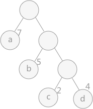
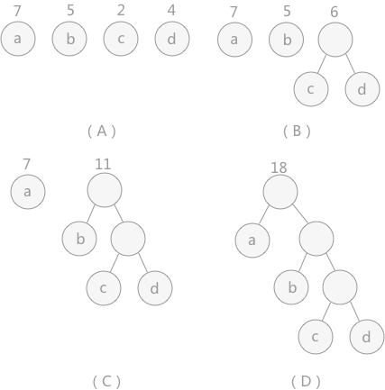
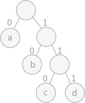
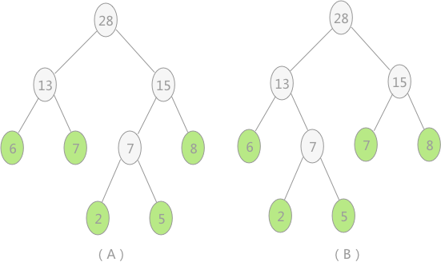

> @Date    : 2020-11-19 11:07:05
>
> @Author  : Lewis Tian (taseikyo@gmail.com)
>
> @Link    : github.com/taseikyo

# 哈夫曼树（赫夫曼树、最优树）及 C 语言实现

> 原文：http://data.biancheng.net/view/33.html 解学武

## Table of Contents

- [哈夫曼树相关的几个名词](#哈夫曼树相关的几个名词)
- [什么是哈夫曼树](#什么是哈夫曼树)
- [构建哈夫曼树](#构建哈夫曼树)
- [哈弗曼树中结点结构](#哈弗曼树中结点结构)
- [哈弗曼树中的查找算法](#哈弗曼树中的查找算法)
- [构建哈弗曼树的代码实现](#构建哈弗曼树的代码实现)
- [哈夫曼编码](#哈夫曼编码)
- [本节完整代码（可运行）](#本节完整代码（可运行）)

赫夫曼树，别名 “哈夫曼树”、“最优树” 以及“最优二叉树”。学习哈夫曼树之前，首先要了解几个名词。

## 哈夫曼树相关的几个名词

路径：在一棵树中，一个结点到另一个结点之间的通路，称为路径。

图1 中，从根结点到结点 a 之间的通路就是一条路径。

路径长度：在一条路径中，每经过一个结点，路径长度都要加 1 。例如在一棵树中，规定根结点所在层数为 1 层，那么从根结点到第 i 层结点的路径长度为 i - 1 。图 1 中从根结点到结点 c 的路径长度为 3。

结点的权：给每一个结点赋予一个新的数值，被称为这个结点的权。例如，图 1 中结点 a 的权为 7，结点 b 的权为 5。

结点的带权路径长度：指的是从根结点到该结点之间的路径长度与该结点的权的乘积。例如，图 1 中结点 b 的带权路径长度为 2 * 5 = 10 。

树的带权路径长度为树中所有叶子结点的带权路径长度之和。通常记作 “WPL” 。例如图 1 中所示的这颗树的带权路径长度为：

> WPL = 7 * 1 + 5 * 2 + 2 * 3 + 4 * 3

  

图 1 哈夫曼树

## 什么是哈夫曼树

当用 n 个结点（都做叶子结点且都有各自的权值）试图构建一棵树时，如果构建的这棵树的带权路径长度最小，称这棵树为 “最优二叉树”，有时也叫“赫夫曼树” 或者“哈夫曼树”。

在构建哈弗曼树时，要使树的带权路径长度最小，只需要遵循一个原则，那就是：权重越大的结点离树根越近。在图 1 中，因为结点 a 的权值最大，所以理应直接作为根结点的孩子结点。

## 构建哈夫曼树

对于给定的有各自权值的 n 个结点，构建哈夫曼树有一个行之有效的办法：

1.  在 n 个权值中选出两个最小的权值，对应的两个结点组成一个新的二叉树，且新二叉树的根结点的权值为左右孩子权值的和；
2.  在原有的 n 个权值中删除那两个最小的权值，同时将新的权值加入到 n–2 个权值的行列中，以此类推；
3.  重复 1 和 2 ，直到所以的结点构建成了一棵二叉树为止，这棵树就是哈夫曼树。



图 2 哈夫曼树的构建过程  
 

图 2 中，（A）给定了四个结点 a，b，c，d，权值分别为 7，5，2，4；第一步如（B）所示，找出现有权值中最小的两个，2 和 4 ，相应的结点 c 和 d 构建一个新的二叉树，树根的权值为 2 + 4 = 6，同时将原有权值中的 2 和 4 删掉，将新的权值 6 加入；进入（C），重复之前的步骤。直到（D）中，所有的结点构建成了一个全新的二叉树，这就是哈夫曼树。

## 哈弗曼树中结点结构

构建哈夫曼树时，首先需要确定树中结点的构成。由于哈夫曼树的构建是从叶子结点开始，不断地构建新的父结点，直至树根，所以结点中应包含指向父结点的指针。但是在使用哈夫曼树时是从树根开始，根据需求遍历树中的结点，因此每个结点需要有指向其左孩子和右孩子的指针。

所以，哈夫曼树中结点构成用代码表示为：

```c
//哈夫曼树结点结构
typedef struct {
    int weight;//结点权重
    int parent, left, right;//父结点、左孩子、右孩子在数组中的位置下标
}HTNode, *HuffmanTree;
```

## 哈弗曼树中的查找算法

构建哈夫曼树时，需要每次根据各个结点的权重值，筛选出其中值最小的两个结点，然后构建二叉树。

查找权重值最小的两个结点的思想是：从树组起始位置开始，首先找到两个无父结点的结点（说明还未使用其构建成树），然后和后续无父结点的结点依次做比较，有两种情况需要考虑：

*   如果比两个结点中较小的那个还小，就保留这个结点，删除原来较大的结点；
*   如果介于两个结点权重值之间，替换原来较大的结点；

实现代码：

```c
//HT数组中存放的哈夫曼树，end表示HT数组中存放结点的最终位置，s1和s2传递的是HT数组中权重值最小的两个结点在数组中的位置
void Select(HuffmanTree HT, int end, int *s1, int *s2) {
    int min1, min2;
    //遍历数组初始下标为 1
    int i = 1;
    //找到还没构建树的结点
    while (HT[i].parent != 0 && i <= end) {
        i++;
    }
    min1 = HT[i].weight;
    *s1 = i;

    i++;
    while (HT[i].parent != 0 && i <= end) {
        i++;
    }
    //对找到的两个结点比较大小，min2为大的，min1为小的
    if (HT[i].weight < min1) {
        min2 = min1;
        *s2 = *s1;
        min1 = HT[i].weight;
        *s1 = i;
    } else {
        min2 = HT[i].weight;
        *s2 = i;
    }
    //两个结点和后续的所有未构建成树的结点做比较
    for (int j = i + 1; j <= end; j++) {
        //如果有父结点，直接跳过，进行下一个
        if (HT[j].parent != 0) {
            continue;
        }
        //如果比最小的还小，将min2=min1，min1赋值新的结点的下标
        if (HT[j].weight < min1) {
            min2 = min1;
            min1 = HT[j].weight;
            *s2 = *s1;
            *s1 = j;
        }
        //如果介于两者之间，min2赋值为新的结点的位置下标
        else if (HT[j].weight >= min1 && HT[j].weight < min2) {
            min2 = HT[j].weight;
            *s2 = j;
        }
    }
}
```

> 注意：s1 和 s2 传入的是实参的地址，所以函数运行完成后，实参中存放的自然就是哈夫曼树中权重值最小的两个结点在数组中的位置。

## 构建哈弗曼树的代码实现

```c
//HT为地址传递的存储哈夫曼树的数组，w为存储结点权重值的数组，n为结点个数
void CreateHuffmanTree(HuffmanTree *HT, int *w, int n) {
    if (n <= 1) return; // 如果只有一个编码就相当于0
    int m = 2 * n - 1; // 哈夫曼树总节点数，n就是叶子结点
    *HT = (HuffmanTree) malloc((m + 1) * sizeof(
                                   HTNode)); // 0号位置不用
    HuffmanTree p = *HT;
    // 初始化哈夫曼树中的所有结点
    for (int i = 1; i <= n; i++) {
        (p + i)->weight = *(w + i - 1);
        (p + i)->parent = 0;
        (p + i)->left = 0;
        (p + i)->right = 0;
    }
    //从树组的下标 n+1 开始初始化哈夫曼树中除叶子结点外的结点
    for (int i = n + 1; i <= m; i++) {
        (p + i)->weight = 0;
        (p + i)->parent = 0;
        (p + i)->left = 0;
        (p + i)->right = 0;
    }
    //构建哈夫曼树
    for (int i = n + 1; i <= m; i++) {
        int s1, s2;
        Select(*HT, i - 1, &s1, &s2);
        (*HT)[s1].parent = (*HT)[s2].parent = i;
        (*HT)[i].left = s1;
        (*HT)[i].right = s2;
        (*HT)[i].weight = (*HT)[s1].weight + (*HT)[s2].weight;
    }
}
```

## 哈夫曼编码

哈夫曼编码就是在哈夫曼树的基础上构建的，这种编码方式最大的优点就是用最少的字符包含最多的信息内容。

根据发送信息的内容，通过统计文本中相同字符的个数作为每个字符的权值，建立哈夫曼树。对于树中的每一个子树，统一规定其左孩子标记为 0 ，右孩子标记为 1 。这样，用到哪个字符时，从哈夫曼树的根结点开始，依次写出经过结点的标记，最终得到的就是该结点的哈夫曼编码。

> 文本中字符出现的次数越多，在哈夫曼树中的体现就是越接近树根。编码的长度越短。

  
图 3 哈夫曼编码  
 

如图 3 所示，字符 a 用到的次数最多，其次是字符 b 。字符 a 在哈夫曼编码是 `0` ，字符 b 编码为 `10` ，字符 c 的编码为 `110` ，字符 d 的编码为 `111` 。

使用程序求哈夫曼编码有两种方法：

1.  从叶子结点一直找到根结点，逆向记录途中经过的标记。例如，图 3 中字符 c 的哈夫曼编码从结点 c 开始一直找到根结点，结果为：0 1 1 ，所以字符 c 的哈夫曼编码为：1 1 0（逆序输出）。
2.  从根结点出发，一直到叶子结点，记录途中经过的标记。例如，求图 3 中字符 c 的哈夫曼编码，就从根结点开始，依次为：1 1 0。

采用方法 1 的实现代码为：

```c
//HT为哈夫曼树，HC为存储结点哈夫曼编码的二维动态数组，n为结点的个数
void HuffmanCoding(HuffmanTree HT, HuffmanCode *HC, int n) {
    *HC = (HuffmanCode) malloc((n + 1) * sizeof(char *));
    char *cd = (char *)malloc(n * sizeof(
                                  char)); //存放结点哈夫曼编码的字符串数组
    cd[n - 1] = '\0'; //字符串结束符

    for (int i = 1; i <= n; i++) {
        //从叶子结点出发，得到的哈夫曼编码是逆序的，需要在字符串数组中逆序存放
        int start = n - 1;
        //当前结点在数组中的位置
        int c = i;
        //当前结点的父结点在数组中的位置
        int j = HT[i].parent;
        // 一直寻找到根结点
        while (j != 0) {
            // 如果该结点是父结点的左孩子则对应路径编码为0，否则为右孩子编码为1
            if (HT[j].left == c)
                cd[--start] = '0';
            else
                cd[--start] = '1';
            //以父结点为孩子结点，继续朝树根的方向遍历
            c = j;
            j = HT[j].parent;
        }
        //跳出循环后，cd数组中从下标 start 开始，存放的就是该结点的哈夫曼编码
        (*HC)[i] = (char *)malloc((n - start) * sizeof(char));
        strcpy((*HC)[i], &cd[start]);
    }
    //使用malloc申请的cd动态数组需要手动释放
    free(cd);
}
```

采用第二种算法的实现代码为：

```c
//HT为哈夫曼树，HC为存储结点哈夫曼编码的二维动态数组，n为结点的个数
void HuffmanCoding(HuffmanTree HT, HuffmanCode *HC, int n) {
    *HC = (HuffmanCode) malloc((n + 1) * sizeof(char *));
    int m = 2 * n - 1;
    int p = m;
    int cdlen = 0;
    char *cd = (char *)malloc(n * sizeof(char));
    //将各个结点的权重用于记录访问结点的次数，首先初始化为0
    for (int i = 1; i <= m; i++) {
        HT[i].weight = 0;
    }
    //一开始 p 初始化为 m，也就是从树根开始。一直到p为0
    while (p) {
        //如果当前结点一次没有访问，进入这个if语句
        if (HT[p].weight == 0) {
            HT[p].weight = 1; //重置访问次数为1
            //如果有左孩子，则访问左孩子，并且存储走过的标记为0
            if (HT[p].left != 0) {
                p = HT[p].left;
                cd[cdlen++] = '0';
            }
            //当前结点没有左孩子，也没有右孩子，说明为叶子结点，直接记录哈夫曼编码
            else if (HT[p].right == 0) {
                (*HC)[p] = (char*)malloc((cdlen + 1) * sizeof(char));
                cd[cdlen] = '\0';
                strcpy((*HC)[p], cd);
            }
        }
        //如果weight为1，说明访问过一次，即是从其左孩子返回的
        else if (HT[p].weight == 1) {
            HT[p].weight = 2; //设置访问次数为2
            //如果有右孩子，遍历右孩子，记录标记值 1
            if (HT[p].right != 0) {
                p = HT[p].right;
                cd[cdlen++] = '1';
            }
        }
        //如果访问次数为 2，说明左右孩子都遍历完了，返回父结点
        else {
            HT[p].weight = 0;
            p = HT[p].parent;
            --cdlen;
        }
    }
}
```

## 本节完整代码（可运行）

```c
#include<stdlib.h>
#include<stdio.h>
#include<string.h>
//哈夫曼树结点结构
typedef struct {
    int weight;//结点权重
    int parent, left,
        right;//父结点、左孩子、右孩子在数组中的位置下标
} HTNode, *HuffmanTree;
//动态二维数组，存储哈夫曼编码
typedef char ** HuffmanCode;

//HT数组中存放的哈夫曼树，end表示HT数组中存放结点的最终位置，s1和s2传递的是HT数组中权重值最小的两个结点在数组中的位置
void Select(HuffmanTree HT, int end, int *s1, int *s2) {
    int min1, min2;
    //遍历数组初始下标为 1
    int i = 1;
    //找到还没构建树的结点
    while (HT[i].parent != 0 && i <= end) {
        i++;
    }
    min1 = HT[i].weight;
    *s1 = i;

    i++;
    while (HT[i].parent != 0 && i <= end) {
        i++;
    }
    //对找到的两个结点比较大小，min2为大的，min1为小的
    if (HT[i].weight < min1) {
        min2 = min1;
        *s2 = *s1;
        min1 = HT[i].weight;
        *s1 = i;
    } else {
        min2 = HT[i].weight;
        *s2 = i;
    }
    //两个结点和后续的所有未构建成树的结点做比较
    for (int j = i + 1; j <= end; j++) {
        //如果有父结点，直接跳过，进行下一个
        if (HT[j].parent != 0) {
            continue;
        }
        //如果比最小的还小，将min2=min1，min1赋值新的结点的下标
        if (HT[j].weight < min1) {
            min2 = min1;
            min1 = HT[j].weight;
            *s2 = *s1;
            *s1 = j;
        }
        //如果介于两者之间，min2赋值为新的结点的位置下标
        else if (HT[j].weight >= min1 && HT[j].weight < min2) {
            min2 = HT[j].weight;
            *s2 = j;
        }
    }
}

//HT为地址传递的存储哈夫曼树的数组，w为存储结点权重值的数组，n为结点个数
void CreateHuffmanTree(HuffmanTree *HT, int *w, int n) {
    if (n <= 1) return; // 如果只有一个编码就相当于0
    int m = 2 * n - 1; // 哈夫曼树总节点数，n就是叶子结点
    *HT = (HuffmanTree) malloc((m + 1) * sizeof(
                                   HTNode)); // 0号位置不用
    HuffmanTree p = *HT;
    // 初始化哈夫曼树中的所有结点
    for (int i = 1; i <= n; i++) {
        (p + i)->weight = *(w + i - 1);
        (p + i)->parent = 0;
        (p + i)->left = 0;
        (p + i)->right = 0;
    }
    //从树组的下标 n+1 开始初始化哈夫曼树中除叶子结点外的结点
    for (int i = n + 1; i <= m; i++) {
        (p + i)->weight = 0;
        (p + i)->parent = 0;
        (p + i)->left = 0;
        (p + i)->right = 0;
    }
    //构建哈夫曼树
    for (int i = n + 1; i <= m; i++) {
        int s1, s2;
        Select(*HT, i - 1, &s1, &s2);
        (*HT)[s1].parent = (*HT)[s2].parent = i;
        (*HT)[i].left = s1;
        (*HT)[i].right = s2;
        (*HT)[i].weight = (*HT)[s1].weight + (*HT)[s2].weight;
    }
}
//HT为哈夫曼树，HC为存储结点哈夫曼编码的二维动态数组，n为结点的个数
void HuffmanCoding(HuffmanTree HT, HuffmanCode *HC, int n) {
    *HC = (HuffmanCode) malloc((n + 1) * sizeof(char *));
    char *cd = (char *)malloc(n * sizeof(
                                  char)); //存放结点哈夫曼编码的字符串数组
    cd[n - 1] = '\0'; //字符串结束符

    for (int i = 1; i <= n; i++) {
        //从叶子结点出发，得到的哈夫曼编码是逆序的，需要在字符串数组中逆序存放
        int start = n - 1;
        //当前结点在数组中的位置
        int c = i;
        //当前结点的父结点在数组中的位置
        int j = HT[i].parent;
        // 一直寻找到根结点
        while (j != 0) {
            // 如果该结点是父结点的左孩子则对应路径编码为0，否则为右孩子编码为1
            if (HT[j].left == c)
                cd[--start] = '0';
            else
                cd[--start] = '1';
            //以父结点为孩子结点，继续朝树根的方向遍历
            c = j;
            j = HT[j].parent;
        }
        //跳出循环后，cd数组中从下标 start 开始，存放的就是该结点的哈夫曼编码
        (*HC)[i] = (char *)malloc((n - start) * sizeof(char));
        strcpy((*HC)[i], &cd[start]);
    }
    //使用malloc申请的cd动态数组需要手动释放
    free(cd);
}
//打印哈夫曼编码的函数
void PrintHuffmanCode(HuffmanCode htable, int *w, int n) {
    printf("Huffman code : \n");
    for (int i = 1; i <= n; i++)
        printf("%d code = %s\n", w[i - 1], htable[i]);
}
int main(void) {
    int w[5] = {2, 8, 7, 6, 5};
    int n = 5;
    HuffmanTree htree;
    HuffmanCode htable;
    CreateHuffmanTree(&htree, w, n);
    HuffmanCoding(htree, &htable, n);
    PrintHuffmanCode(htable, w, n);
    return 0;
}
```

运行结果

Huffman code :  
2 code = 100  
8 code = 11  
7 code = 01  
6 code = 00  
5 code = 101

> 本节中介绍了两种遍历哈夫曼树获得哈夫曼编码的方法，同时也给出了各自完整的实现代码的函数，在完整代码中使用的是第一种逆序遍历哈夫曼树的方法。

总结
--

  
图 4 程序运行效果图

本节的程序中对权重值分别为 2，8，7，6，5 的结点构建的哈夫曼树如图 4（A）所示。图 4（B）是另一个哈夫曼树，两棵树的带权路径长度相同。

程序运行效果图之所以是（A）而不是（B），原因是在构建哈夫曼树时，结点 2 和结点 5 构建的新的结点 7 存储在动态树组的最后面，所以，在程序继续选择两个权值最小的结点时，直接选择了的叶子结点 6 和 7 。