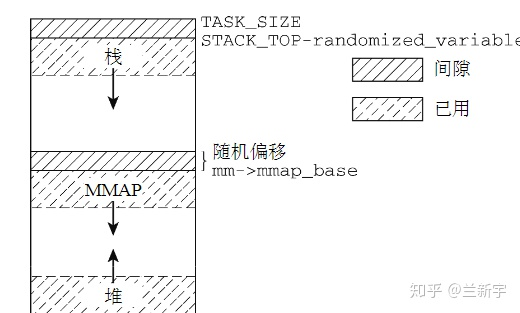

> @Date    : 2020-12-25 15:39:42
>
> @Author  : Lewis Tian (taseikyo@gmail.com)
>
> @Link    : github.com/taseikyo

# Linux 的进程地址空间

> 原文：https://zhuanlan.zhihu.com/p/66794639 2020-04-17 [兰新宇](https://www.zhihu.com/people/lan-xin-yu)

所谓进程地址空间（process address space），就是从进程的视角看到的地址空间，是进程运行时所用到的虚拟地址的集合。

## 32 位系统的进程地址空间

以 IA-32 处理器为例，其虚拟地址为 32 位，因此其虚拟地址空间的范围为 $2^{32}=4GB$ ，Linux 系统将地址空间按 3:1 比例划分，其中用户空间（user space）占 3GB，内核空间（kernel space）占 1GB。

假设物理内存也是 4GB（事实上，虚拟地址空间的范围不一定需要和物理地址空间的大小相同），则虚拟地址空间和物理地址空间的转换如下图所示：


因为内核的虚拟地址空间只有 1GB，但它需要访问整个 4GB 的物理空间，因此从物理地址 0 ~ 896MB 的部分（ZONE_DMA+ZONE_NORMAL），直接加上 3GB 的偏移（在 Linux 中用 PAGE_OFFSET 表示），就得到了对应的虚拟地址，这种映射方式被称为**线性 / 直接映射**（Direct Map）。

而 896M ~ 4GB 的物理地址部分（ZONE_HIGHMEM）需要映射到 (3G+896M) ~ 4GB 这 128MB 的虚拟地址空间，显然也按线性映射是不行的。

采用的是做法是，ZONE_HIGHMEM 中的某段物理内存和这 128M 中的某段虚拟空间建立映射，完成所需操作后，需要断开与这部分虚拟空间的映射关系，以便 ZONE_HIGHMEM 中其他的物理内存可以继续往这个区域映射，即**动态映射**的方式。

用户空间的进程只能访问整个虚拟地址空间的 0 ~ 3GB 部分，不能直接访问 3G ~ 4GB 的内核空间部分，但出于对性能方面的考虑，Linux 中内核使用的地址也是映射到进程地址空间的（被所有进程共享），因此进程的虚拟地址空间可视为整个 4GB（虽然实际只有 3GB）。


## 64 位系统的进程地址空间

在 64 位系统中，进程地址空间的大小就不固定了，以 ARMv8-A 为例，它的 page 大小可以是 4KB, 16KB 或者 64KB（默认为 4KB，选一种来用，不要混用），可采用 3 级页表或 4 级页表，因此可以有多种组合的形式。

以采用 4KB 的页，4 级页表，虚拟地址为 48 位的系统为例（从 ARMv8.2 架构开始，支持虚拟地址和物理地址的大小最多为 52 位），其虚拟地址空间的范围为 $2^{48}=256TB$，按照 1:1 的比例划分，内核空间和用户空间各占 128TB。


256TB 已经很大很大了，但是面对 64 位系统所具备的 16EB 的地址范围，根本就用不完。为了以后扩展的需要（比如虚拟地址扩大到 56 位），用户虚拟空间和内核虚拟空间不再是挨着的，但同 32 位系统一样，还是一个占据底部，一个占据顶部，所以这时 user space 和 kernel space 之间偌大的区域就空出来了。

但这段空闲区域也不是一点用都没有，它可以辅助进行地址有效性的检测。如果某个虚拟地址落在这段空闲区域，那就是既不在 user space，也不在 kernel space，肯定是非法访问了。使用 48 位虚拟地址，则 kernel space 的高 16 位都为 1，如果一个试图访问 kernel space 的虚拟地址的高 16 位不全为 1，则可以判断这个访问也是非法的。同理，user space 的高 16 位都为 0。这种高位空闲地址被称为 canonical。


在 64 位系统中，内核空间的映射变的简单了，因为这时内核的虚拟地址空间已经足够大了，即便它要访问所有的物理内存，直接映射就是，不再需要 ZONE_HIGHMEM 那种动态映射机制了。


64 位系统中用户空间的映射和 32 位系统没有太大的差别。


ARM 公司宣称 64 位的 ARMv8 是兼容 32 位的 ARM 应用的，所有的 32 位应用都可以不经修改就在 ARMv8 上运行。那 32 位应用的虚拟地址在 64 位内核上是怎么分布的呢？事实上，64 位内核上的所有进程都是一个 64 位进程。要运行 32 位的应用程序, Linux 内核仍然从 64 位 init 进程创建一个进程, 但将用户地址空间限制为 4GB。通过这种方式, 我们可以让 64 位 Linux 内核同时支持 32 位和 64 位应用程序。


要注意的是, 32 位应用程序仍然对应 128TB 的内核虚拟地址空间, 并且不与内核共享自己的 4GB 虚拟地址空间, 此时用户应用程序具有完整的 4GB 虚拟地址。而 32 位内核上的 32 位应用程序只有 3GB 真正意义上的虚拟地址空间。


那进程地址空间到底是由哪些元素构成的呢？

## segments

一个进程通常由加载一个 elf 文件启动，而 elf 文件是由若干 segments 组成的，同样的，进程地址空间也由许多不同属性的 segments 组成，但这与硬件意义上的 segmentation 机制（参考[这篇文章](https://zhuanlan.zhihu.com/p/67735248)）不同，后者在某些体系结构（比如 x86）中起重要作用，充当内存中物理地址连续的独立空间。Linux 进程中的 segment 是虚拟地址空间中用于保存数据的区域，只在虚拟地址上连续。


**text 段**包含了当前运行进程的二进制代码，其起始地址在 IA32 体系中中通常为 0x08048000，在 IA64 体系中通常为 0x0000000000400000（都是虚拟地址哈）。**data 段**存储已初始化的全局变量，**bss 段**存储未初始化的全局变量。从上图可以看出，这 3 个 segments 是紧挨者的，因为它们的大小是确定的，不会动态变化。

与之相对应的就是 heap 段和 stack 段。**heap 段**存储动态分配的内存中的数据，**stack 段**用于保存局部变量和实现函数 / 过程调用的上下文，它们的大小都是会在进程运行过程中发生变化的，因此中间留有空隙，heap 向上增长，stack 向下增长，因为不知道 heap 和 stack 哪个会用的多一些，这样设置可以最大限度的利用中间的空隙空间。

还有一个段比较特殊，是 mmap() 系统调用映射出来的。**mmap 映射**的大小也是不确定的。3GB 的虚拟地址空间已经很大了，但 heap 段, stack 段，mmap 段在动态增长的过程还是有重叠（碰撞）的可能。为了避免重叠发生，通常将 mmap 映射段的起始地址选在 TASK_SIZE/3（也就是 1GB）的位置。如果是 64 位系统，则虚拟地址空间更加巨大，几乎不可能发生重叠。

如果 stack 段和 mmap 段都采用固定的起始地址，这样实现起来简单，而且所有 Linux 系统都能保持统一，但是真实的世界不是那么简单纯洁的，正邪双方的较量一直存在。对于攻击者来说，如果他知道你的这些 segments 的起始地址，那么他构建恶意代码（比如通过缓冲区溢出获得栈内存区域的访问权，进而恶意操纵栈的内容）就变得容易了。

一个可以采用的反制措施就是不为这些 segments 的起点选择固定位置，而是在每次新进程启动时（通过设置 PF_RANDOMIZE 标志）随机改变这些值的设置。



那这些 segments 的加载顺序是怎样的呢？以下图为例，首先通过 execve() 执行 elf，则该可执行文件的 text 段，data 段，stack 段就建立了，在进程运行过程中，可能需要借助 ld.so 加载动态链接库，比如最常用的 libc，则 libc.so 的 text 段，data 段也建立了，而后可能通过 mmap() 的匿名映射来实现与其他进程的共享内存，还有可能通过 brk() 来扩大 heap 段的大小。


## vm_area_struct

在 Linux 中，每个 segment 用一个 vm_area_struct（以下简称 vma）结构体表示。vma 是通过一个双向链表（早期的内核实现是单向链表）串起来的，现存的 vma 按起始地址以递增次序被归入链表中，每个 vma 是这个链表里的一个节点。


在用户空间可通过 "/proc/PID/maps" 接口来查看一个进程的所有 vma 在虚拟地址空间的分布情况，其内部实现靠的就是对这个链表的遍历。


同时，vma 又通过**红黑树**（red black tree）组织起来，每个 vma 又是这个红黑树里的一个节点。为什么要同时使用两种数据结构呢？使用链表管理固然简单方便，但是通过查找链表找到与特定地址关联的 vma，其时间复杂度是 O(N)，而现实应用中，在进程地址空间中查找 vma 又是非常频繁的操作（比如发生 page fault 的时候）。

使用红黑树的话时间复杂度是 O($log_2N$)，尤其在 vma 数量很多的时候，可以显著减少查找所需的时间（数量翻倍，查找次数也仅多一次）。同时，红黑树是一种非平衡二叉树，可以简化重新平衡树的过程。

现在我们来看一下 vm_area_struct 结构体在 Linux 中是如何定义的（这里为了讲解的需要对结构体内元素的分布有所调整，事实上，结构体元素的分布是有讲究的，将相关的元素相邻放置并按 cache line 对齐，有利于它们在 cache 中处于同一条 cache line 上，提高效率）：

```C
struct vm_area_struct {
	unsigned long vm_start;
	unsigned long vm_end;
	struct vm_area_struct *vm_next, *vm_prev;
	rb_node_t vm_rb;
	unsigned long vm_flags;
	struct file * vm_file;
	unsigned long vm_pgoff;
	struct mm_struct * vm_mm;
	...
}
```

其中，vm_start 和 vm_end 分别是这个 vma 所指向区域的起始地址和结束地址，虽然 vma 是虚拟地址空间，但最终毕竟是要映射到物理内存上去的，所以也要求是 4KB 对齐的。

vm_next 是指向链表的下一个 vma，vm_rb 是作为红黑树的一个节点。


vm_flags 描述的是 vma 的属性，flag 可以是 VM_READ、VM_WRITE、VM_EXEC、VM_SHARED，分别指定 vma 的内容是否可以读、写、执行，或者由几个进程共享。[前面](https://zhuanlan.zhihu.com/p/67053210)介绍的页表 PTE 中也有类似的 Read/Write 权限限制位，那它和 vma 中的这些标志位是什么关系呢？


vma 由许多的虚拟 pages 组成，每个虚拟 page 需要经过 page table 的转换才能找到对应的物理页面。PTE 中的 Read/Write 位是由软件设置的，设置依据就是这个 page 所属的 vma，因此一个 vma 设置的 VM_READ/VM_WRITE 属性会复制到这个 vma 所含 pages 的 PTE 中。

之后，硬件 MMU 就可以在地址翻译的过程中根据 PTE 的标志位来检测访问是否合法，这也是为什么 PTE 是一个软件实现的东西，但又必须按照处理器定义的格式去填充，这可以理解为软硬件之间的一种约定。那可以用软件去检测 PTE 么？当然可以，但肯定没有用专门的硬件单元来处理更快嘛。

可执行文件和动态链接库的 text 段和 data 段是基于 elf 文件的，mmap 对文件的映射也是对应外部存储介质中这个被映射的文件的，这两种情况下，vm_file 指向这个被映射的文件，进而可获得该文件的 inode 信息，而 "vm_pgoff" 是这个段在该文件内的偏移。

对于 text 段，一般偏移就是 0。对于 heap 段，stack 段以及 mmap 的匿名映射，没有与之相对应的文件实体，此时 "vm_file" 就为 NULL，"vm_pgoff" 的值没有意义。

那一个进程是怎么找到它的这些 vma 的呢？

## mm_struct

vm_area_struct 中还有一个 vm_mm 没讲到，而这个 vm_mm，则是联系 vm_area_struct 和它所属进程的关键纽带。它指向的是负责管理内存的 mm_struct 结构体，而这个 mm_struct 又可以从 task_struct 这个几乎记录了一个进程所有信息的结构体中获取。


来看下 struct mm_struct 中与 vma 相关的元素有哪些：

```C
struct mm_struct {
	struct vm_area_struct * mmap;
	struct rb_root mm_rb;
	int map_count;
	unsigned long total_vm;
	struct vm_area_struct * mmap_cache;
	unsigned long (*)()get_unmapped_area;
	...
}
```

其中 mmap 指向 vma 链表的头节点，mm_rb 指向 vma 红黑树的根节点。map_count 是 vma 的总个数，total_vm 是进程地址空间的总大小（以 page 为单位）。

mmap_cache 保存了上一次找到的 vma，根据局部性原理，下一次要用到的 vma 正好是上次使用的 vma 的可能性是比较大的，因此使用 find_vma() 函数查找 vma 时，会首先从 mmap_cache 中找，找到了就直接返回。

```C
vma = mm->mmap_cache;
if (vma && vma->vm_end > addr && vma->vm_start <= addr)
	return vma;
```

没找到再去红黑树里面找：

```C
rb_node = mm->mm_rb.rb_node;
vma = NULL;
while (rb_node) {
	vma_tmp = rb_entry(rb_node, struct vm_area_struct, vm_rb);
	if (vma_tmp->vm_end > addr) {
		vma = vma_tmp;
		if (vma_tmp->vm_start <= addr)
			break;
		rb_node = rb_node->rb_left;
	} else
		rb_node = rb_node->rb_right;
}
if (vma)
	mm->mmap_cache = vma;
return vma;
```

这种 mmap_cache 的命中率通常只有 35%-50%，之后内核开发者又在此基础上，设计了[新的 VMA cache 方案](https://zhuanlan.zhihu.com/p/99124666)。

对 vma 的操作除了查找，还有增加和删除。加载一个动态链接库或者通过 mmap 创建映射时，都需要在进程地址空间中增加一个 vma。

具体过程是首先通过 get_unmapped_area() 找到虚拟地址空间中一块空闲且大小满足要求的区域（根据你上报的你家的人数，给你街道中一个住的下你家所有人的空房子），分配给新 vma 并设置其 flag 属性（限制你家对这个房子的使用，比如只能住，不能私自改建），返回该 vma 起始处的虚拟地址（告诉你这个房子的门牌号）。

当然，你出于某种目的，也可以指定就街道上的某间房子（调用 mmap() 时指定参数 addr），如果这间房子正好是空的，就可以分配给你。

```C
if (addr) {
	addr = PAGE_ALIGN(addr);
	vma = find_vma(mm, addr);
	if (TASK_SIZE - len >= addr &&
	        (!vma || addr + len <= vma->vm_start))
		return addr;
}
```

这里的房子有点特殊，街道上房间的总数是固定的，每个房间的大小是 4 平方米（页面大小 4KB），只要是相邻的空房间，就可以组成一个空房子。房间总数也是有限的（3GB 内存的话差不多是 75 万个房间），你来晚了，或者你狮子大开口，要一个 50 万房间的空房子（比如通过 malloc(2G)），那就有可能出现分配不到的情况（可用虚拟地址空间不足）。

如果新建的 vma 和它地址上紧挨着的 vma 有相同的属性，且基于相同的映射对象（比如是同一个文件），则还会产生 vma 的合并（上下两层楼打通，做成一个跃层）。减少 vma 的数量有利于减轻内核的管理工作量，降低系统开销。如果没有发生合并，则需要调用 insert_vm_struct( ) 在 vma 链表和 vma 红黑树中分别插入代表新 vma 的节点（给你家的房子被街道办事处登记，方便日后管理）。

要注意的是，房子的分配是按照你上报的人数，但具体给你几个房间的钥匙（分配几个物理页面），取决于你家实际住进来的人数，比如你申请的是 10 个房间，但只住进来 3 个人，就只有 3 个房间的钥匙，剩下的钥匙等真正有人搬进来再给，房间资源有限，占着不住不是浪费么。分配的 vma 只是这段虚拟地址的使用权，而不是物理地址的使用权。

那是不是我申请成功 10 个房间，就可以保证 10 个人都能住进来呢？这个嘛，街道（进程）最开始也是这样以为的，后来出现了房间申请成功，结果拿钥匙开不了门的情况，街道就向上级管理者（内核）反映啊，这才被告知了一个残酷的现实：除了本条街道，还有很多条其他街道，大家处在一个平行空间中（虚拟地址空间都是 0 ~ 3GB），这 70 多万个房间，其实是被所有街道共享的，谁先拿到一个房间的钥匙（使用物理页面），谁才真正拥有这个房间。

一切都是假象…… 然后街道问上级：那你为啥一直允许我们街道上的人一口气申请那么多房间呢？上级若有所思的说：我当时设计这个制度啊，主要是考虑到很多人可能申请的多，但实际用不了那么多（比如 malloc(2G)，但实际只用了 1M）, 我也不知道实际谁会用的多一点，为了让资源（这些房间）得到最充分的利用，我只能先允许他们申请着。以后这种事情多了，大家也渐渐明白，别一下申请那么多，不合理的需求，到了上级那里是通不过的，这种申请超过实际可用物理内存的现象，被称为 [memory overcommit](http://linuxperf.com/?p=102)。

通过 munmap() 解除映射时，则需要在进程地址空间中删除对应的 vma，并释放该 vma 占有的虚拟地址资源。

## 参考

- http://jake.dothome.co.kr/pt64/ ，里面对 ARM64 的各种 page size 和页表级数的组合做了详尽介绍。
- https://www.kernel.org/doc/Documentation/arm64/memory.txt
- http://thinkiii.blogspot.com/2014/02/arm64-linux-kernel-virtual-address-space.html ，这是本文后半部分的图片来源和主要参考。
- [How The Kernel Manages Your Memory](https://manybutfinite.com/post/how-the-kernel-manages-your-memory/)
- [理解 LINUX 的 MEMORY OVERCOMMIT](http://linuxperf.com/?p=102)
- understanding the linux kernel
- professional linux kernel architecture
- understanding the linux virtual memory manager
