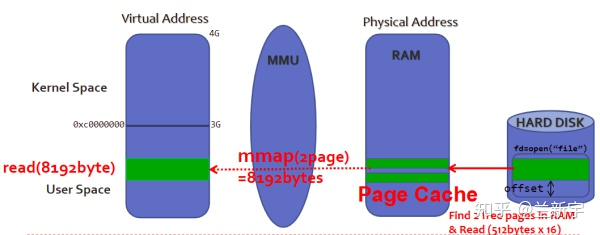
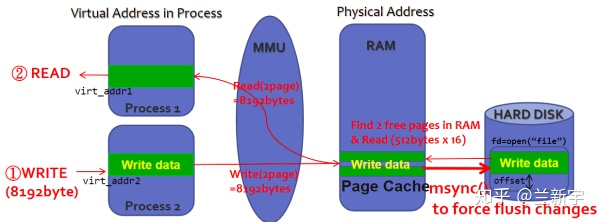
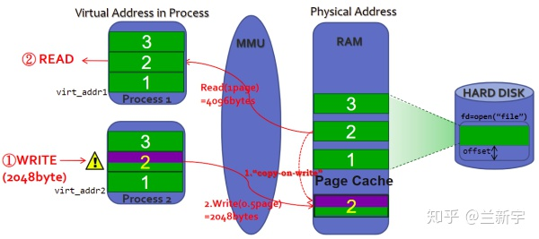

> @Date    : 2020-12-25 09:52:20
>
> @Author  : Lewis Tian (taseikyo@gmail.com)
>
> @Link    : github.com/taseikyo

# Linux 中的 mmap 映射

原文分为两部分，这里我直接合二为一了。

> 原文 https://zhuanlan.zhihu.com/p/67894878 2020-04-17 [兰新宇](https://www.zhihu.com/people/lan-xin-yu)

除了传统的 read() 和 write() 系统调用，Linux 还提供了另一种读写文件数据的方式，那就是 mmap()。

先来看下用户进程调用 read() 在 Linux 中是怎样实现的。比如要读取磁盘上某个文件的 8192 个字节数据，那么这 8192 个字节会首先拷贝到内存中作为 [page cache](https://zhuanlan.zhihu.com/p/68071761)（方便以后快速读取），然后再从 page cache 拷贝到用户指定的 buffer 中，也就是说，在数据已经加载到 page cache 后，还需要一次内存拷贝操作和一次系统调用。


如果使用 mmap()，则在磁盘数据加载到 page cache 后，用户进程可以通过指针操作直接读写 page cache，不再需要系统调用和内存拷贝。看起来 mmap() 好像完胜 read() 有没有？

其实，mmap() 在数据加载到 page cache 的过程中，会触发大量的 page fault 和建立页表映射的操作，开销并不小。另一方面，随着硬件性能的发展，内存拷贝消耗的时间已经大大降低了。所以啊，很多情况下，mmap() 的性能反倒是比不过 read() 和 write() 的。



mmap() 其实只是将一个文件的一部分内容映射到了进程虚拟地址空间中的一个 [VMA 区域](https://zhuanlan.zhihu.com/p/67936075)，并没有真正分配物理内存，只有等到进程真正访问这个 VMA 的时候，才会触发 page fault，将这部分文件内容从磁盘拷贝到内存中。


Linux 中的文件是一个抽象的概念，并不是所有类型的文件都可以被 mmap 映射，比如目录和管道就不可以。一个文件可能被多个进程通过 mmap 映射后访问并修改，根据所做的修改是否对其他进程可见，mmap 可分为共享映射和私有映射两种。

对于共享映射，修改对所有进程可见，也就是说，如果进程 A 修改了其中某个 page 上的数据，进程 B 之后读取这个 page 得到的就是修改后的内容。有共享就有竞态（race condition），mmap 本身并没有提供互斥机制，需要调用者在使用的过程中自己加锁。**共享文件映射**的一个应用场景就是两个进程共同读写一个文本文件，比如你用 vim 编辑保存后，再用 cat 命令查看。



对于私有映射，进程 A 的修改对进程 B 是不可见的，都是同一份数据，这是如何做到的呢？这里利用的是 Copy On Write(COW) 机制。

当进程 A 试图修改某个 page 上的数据时，内核会将这个 page 的内容拷贝一份，之后 A 的写操作实际是在这个拷贝的 page 上进行的（进程 A 中对应这个 page 的页表项也需要被修改，以指向新拷贝的 page），这样进程 B 看到的这个 page 还是原来未经改动的。这种修改只会存在于内存中，不会同步到外部的磁盘文件上（事实上也没法同步，因为不同进程所做的修改是不同的）。**私有文件映射**最典型的应用就是进程对动态链接库（比如 libc.so）的使用。



以上介绍了的是 mmap 基于文件的映射（file-backed），其实 mmap 还可以用于对没有文件关联的内容进行映射，也就是[匿名映射](https://zhuanlan.zhihu.com/p/70964551)。同文件映射一样，匿名映射也有共享映射和私有映射两种。

**共享匿名映射**的一个典型应用是作为进程间通信机制的 POSIX [共享内存](http://hustcat.github.io/shared-memory-tmpfs/)。在 Linux 中，POSIX 共享内存是通过挂载在 /dev/shm 下的 tmpfs 内存文件系统实现的，创建的每一个共享内存都对应 tmpfs 中的一个文件，因此 POSIX 共享内存也可视为共享文件映射。

而**私有匿名映射**可以用来实现 glibc 中的 malloc()。传统的 malloc() 实现靠的是 brk，通常 brk 用于分配小块内存，mmap 则用于分配大块内存，这个分界的阈值默认是 128KB（可通过 mallopt 函数调整）。

```
#include <sys/mman.h>
void *mmap(void *addr, size_t length, int prot, int flags, int fd, off_t offset);
```

看起来参数好像比较多，但对照着下面这张图看，应该会清晰不少。


其中 **fd,** **offset** 和 **length** 都是用来描述要映射的文件区域的，"fd" 是文件描述符，对于匿名映射，fd 应该是 - 1（如果是通过打开 /dev/zero 这个特殊的文件来创建匿名映射，则它也是有不为 -1 的正常 fd 值的）。"offset" 是文件中映射的起始位置，"length" 是映射的长度。如果访问了超出映射的区域，则有可能触发 **SIGSEGV** 异常（segmentation fault）。

为什么说是有可能呢？因为只有访问的地址没有落在进程的任何 VMAs（关于 VMA 请参考[这篇文章](https://zhuanlan.zhihu.com/p/67936075)）里，才应该触发 SIGSEGV，如果超出映射的这段区域正好落在另一个 VMA 里，那就可以侥幸逃过 SIGSEGV。其实这样更糟糕，触发 SIGSEGV 可以让你及时知道事故的第一现场，如果继续运行，然后在某个不可预知的地方崩溃，那这 bug 排查起来就困难了。


Linux 是以 page 为单位管理内存的，mmap 也是以 page 为单位建立映射的，因此 offset 必须是按 page size 对齐的（不对齐的话就会映射失败）。文件是有长度的，offset 和 offset+length 的值都应该小于被映射文件的长度。

然而，mmap() 并不会对此作出检查，所以有可能建立的映射区域并不完全在文件的长度范围内。比如一个文件的长度是 4KB，而你映射了 8KB，那么在访问后面的这 4KB 内存的时候，就会触发 **SIGBUS** 异常，表明你访问的这段内存区域，没有对应的文件。


如果用户给定的 length 不是按 page size 对齐的，那么内核会填充一部分长度以保证对齐（可见，offset 对齐是用户自己保证的，length 对齐是靠内核来保证的）。比如文件长度是 10KB，你映射了 5KB，那么内核会将其扩充到 8KB。如果你访问下图中 5120 字节到 8191 字节的这段内存，因为既没有超出映射的内存区域，也没有超出文件的长度，所以是不会触发任何异常的。


你以为只要保证映射的区域完全落在文件的长度范围内就可以高枕无忧了么？事务都是变化的，被映射的文件也不例外，比如它可以通过 truncate()/ftruncate() 截断，截断之后文件的长度如果减小了（truncate 也是可以增大的），然后你刚好访问了被截断的这段区域，依然会触发 SIGBUS。


映射区域的大小可以通过 mremap() 动态调整，事实上，glibc 中的 realloc() 就是调用 mremap() 实现的。

**"prot"** 是 protection 的意思，表示的是对内存映射区域的保护，包括 PROT_READ（可读），PROT_WRITE（可写）和 PROT_EXEC（可执行）。还有一个很特殊的 PROT_NONE，就是既不可读也不可写更不可执行，啥操作都不可以，那映射出来干吗？

普通场景下没有用，不代表特殊场景下没用，PROT_NONE 可以用于实现防范攻击的 guard page。如果攻击者访问了某个 guard page，就会触发 SIGSEV，作用和地雷是差不多的。在布了地雷的土地上，你不能种田，不能盖房，但是可以防范敌人的入侵，只是，你得记住地雷放的位置，别自己踩着了。

prot 属性是可以通过 mprotect() 动态修改的（mprotect 并不局限于操作由 mmap 映射的内存区域，它可以操作任意区域的内存），[这篇文章](https://zhuanlan.zhihu.com/p/64713140)介绍的 JIT 实现就是对此一个颇有意思的应用。

"**flags**" 用于指定映射是基于文件的还是匿名（MAP_ANONYMOUS）的，是共享的（MAP_SHARED）还是私有的（MAP_PRIVATE）。共享映射和私有映射在写操作上是有区别的，前者是直接写，后者是 COW，先 copy 再写。


**addr** 用于指定映射到的 VMA 的起始地址，这个地址也必须按 page size 对齐。映射是由内核完成的，但进程可以通过 addr 参数建议一个它认为的最佳地址（没有这种要求就设置 addr 为 NULL），毕竟进程最了解它自身的应用场景嘛。

但这对内核来说不是强制的，如果 addr 和 addr+length 之间的虚拟内存空间恰好是可用的，那么内核会满足进程的这一要求。如果 flags 中加上 MAP_FIXED，那就是进程要求必须映射到这个 addr 起始的区域，当然，这会增加映射失败的概率。

实际映射到的 VMA 起始地址保存在 mmap() 的**返回值**中。

同 read() 和 write() 一样，要获得 mmap() 中的参数 fd，自然是要先 open() 一下，而调用 open() 的时候是需要设置对文件的读写权限的，比如 O_RDONLY（只读），O_RDWD（可读写），mmap() 中 prot 和 flags 的设置需要和进程打开文件时的属性设置保持一致。

上文提到，mmap() 的实现主要是在进程虚拟地址空间创建了一个 VMA，而一个 VMA 是有 VM_READ, VM_WRITE, VM_EXEC, VM_SHARED 等诸多属性的。如果是通过 mmap 创建的 VMA，则这个 VMA 的属性就是由 mmap() 中 prot 和 flags 参数传递进去的。

参考：

- [浅析 Linux 的共享内存与 tmpfs 文件系统](http://hustcat.github.io/shared-memory-tmpfs/)
- 《Linux 环境编程：从应用到内核》第 11.4 节