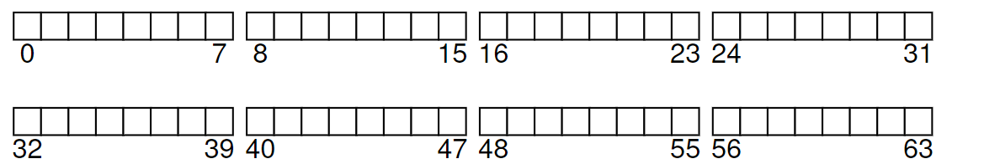
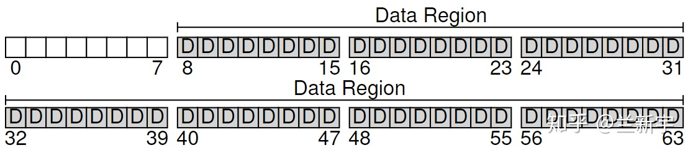
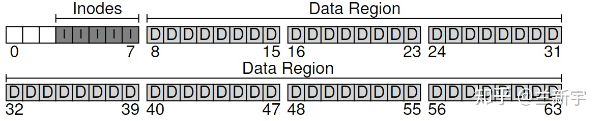
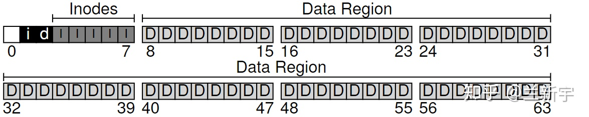
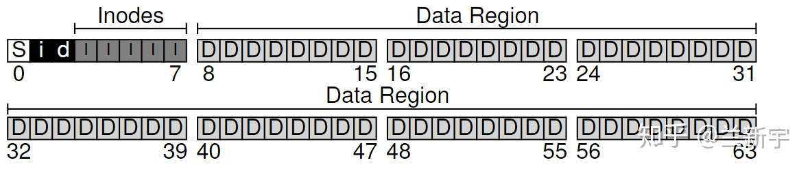
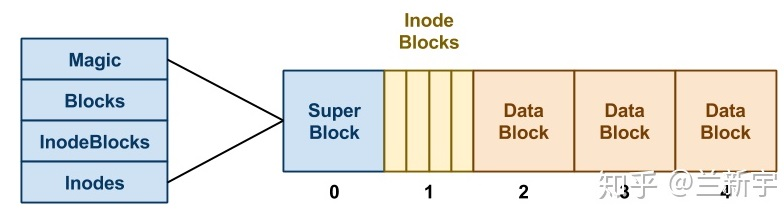
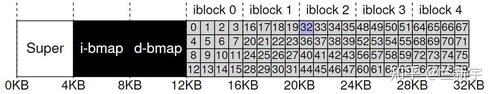
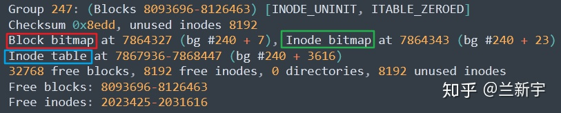
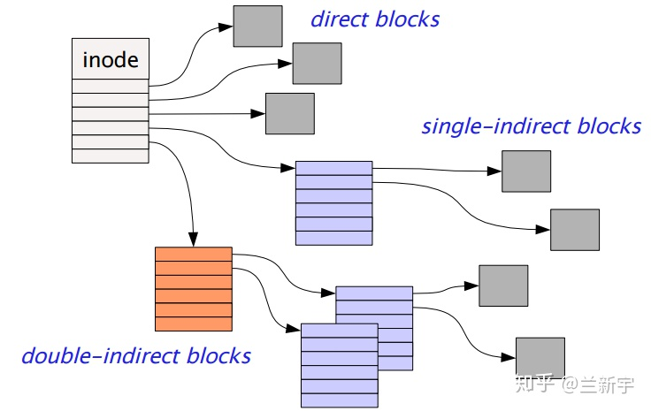
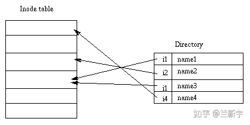

> @Date    : 2020-12-25 16:52:50
>
> @Author  : Lewis Tian (taseikyo@gmail.com)
>
> @Link    : github.com/taseikyo


# 文件系统的原理

> 原文：https://zhuanlan.zhihu.com/p/106459445 2020-06-06 [兰新宇](https://www.zhihu.com/people/lan-xin-yu)

持久性的数据是存储在外部磁盘上的<sup id="a1">[注 1](#f1)</sup>，如果没有文件系统，访问这些数据就需要直接读写磁盘的 sector，实在太不方便了。而文件系统存在的意义，就是能更有效的组织、管理和使用磁盘上的这些 raw data。

## 文件系统的组成

要管理，就得先划分，那按照什么粒度划分呢？因为磁盘上的数据要和内存交互，而内存通常是以 4KB 为单位的，所以从逻辑上，把磁盘按照 4KB 划分比较方便（称为一个 block）。现在假设由一个文件系统管理 64 个 blocks 的一个磁盘区域：



那在这些 blocks 中应该存储些什么？文件系统的基础要素自然是文件，而文件作为一个数据容器的逻辑概念，本质上是一些字节构成的集合，这些字节就是文件的 **user data**（对应下图的 "D"）。



除了文件本身包含的数据，还有文件的访问权限、大小和创建时间等控制信息，这些信息被称为 **meta data**。meta data 可理解为是关于文件 user data 的 data，这些 meta data 存储的数据结构就是 **inode**（对应下图的 "I"，有些文件系统称之为 dnode 或 fnode）。

inode 是 "index node" 的简称，在早期的 Unix 系统中，这些 nodes 是通过数组组织起来的，因此需要依靠 index 来索引数组中的 node。假设一个 inode 占据 256 字节，那么一个 4KB 的 block 可以存放 16 个 inodes，使用 5 个 blocks 可以存放 80 个 inodes，也就是最多支持 80 个文件。



同[内存分配](https://zhuanlan.zhihu.com/p/73468738)一样，当有了新的数据产生时，我们需要选择一个空闲的 block 来存放数据，此外还需要一个空闲的 inode。所以，需要追踪这些 inodes 和 data blocks 的分配和释放情况，以判断哪些是已用的，哪些是空闲的。

最简单的办法就是使用 bitmap，包括记录 inode 使用情况的 bitmap（对应下图的 "i"），和记录 data block 使用情况的 bitmap（对应下图的 "d"）。空闲就标记为 0，正在使用就标记为 1。



因为 block 是最小划分单位，所以这里使用了两个 blocks 来分别存储 inode bitmap 和 data block bitmap，每个 block 可以容纳的 bits 数量是 4096 * 8。而这里我们只有 80 个 inodes 和 56 个 data blocks，所以是绰绰有余的。

还剩下开头的一个 block，这个 block 是留给 **superblock** 的（对应下图的 "S"）。



这个 superblock 包含了一个文件系统所有的控制信息，比如文件系统中有多少个 inodes 和 data blocks，inode 的信息起始于哪个 block（这里是第 3 个），可能还有一个区别不同文件系统类型的 magic number。因此，superblock 可理解为是文件系统的 meta data。



## 文件寻址

这 5 个 blocks 中的 80 个 inodes 构成了一个 **inode table**。假设一个 inode 的大小是 256 字节，现在我们要访问第 32 个文件，那就要先找到这个文件的控制信息，也就是第 32 个 inode 所在的磁盘位置。它应该在相对 inode table 起始地址的 8KB 处（32 * 256=8192），而 inode table 的起始地址是 12KB，所以实际位置是 20KB。



磁盘同内存不同，它在物理上不是按字节寻址的，而是按 sector。一个 sector 的大小通常是 512 字节，因此换算一下就是第 40 个 sector（20 * 1024/512）。

对于 ext2/3/4 文件系统，以上介绍的这些 inode bitmap, data block bitmap 和 inode table，都可以通过一个名为 **"dumpe2fs"** 的工具来查看其在磁盘上的具体位置：



如果只需要查看 inode 的使用情况，那么直接使用 "df -i" 命令即可：


### 寻址方式

那通过 inode 如何找到对应的文件呢？根据大小的不同，一个文件需要占据若干个 blocks，这些 blocks 可能是磁盘上连续分布的，也可能不是。所以，比较好的办法是使用指针，指针存储在 inode 中，一个指针指向一个 block。

不过，在这个简化的示例里，并不需要 C 语言里那种指针，只需要一个 block 的编号就可以了。如果文件比较小，占有的 blocks 数目就比较少，那么一个 256 字节的 inode 就能存储这些指针。假设一个 inode 最多能包含 12 个指针，那么文件的大小不能超过 48KB。

那如果超过了怎么办？可由 inode 先指向一个 block，这个 block 再指向分散的 data block，这种方法称为 **multi-level index**。inode 在指向中间 block 的同时，也可以直接指向 data block。假设一个指针占据 4 个字节，那么一个中间 block 可存储 1024 个指针，二级 index 的寻址范围就可超过 4MB，三级 index 则可超过 4GB。



有没有觉得很像内存管理中的[多级页表](https://zhuanlan.zhihu.com/p/64978946)？事实上，它们的原理可以说是一样的，文件在磁盘上的实际 block 分布对等于内存的物理地址，而各级 index 就对等于内存的虚拟地址。

这种只使用 block 指针的方式被 **ext2 和 ext3** 文件系统所采用，但它存在一个问题，对于各种大小的文件，都需要较多的 meta data。而在实际的应用中，大多数文件的体积都很小，meta data 相对 user data 的占比就较大。

**另一种实现**是使用一个 block 指针加上一个 length 来表示一组物理上连续的 blocks（称为一个 **extent**，其中 length 以 block 为单位计），一个文件由若干个 extents 构成。这样，小文件所需要的 meta data 就较少，这种更灵活的实现方式被后来的 **ext4** 文件系统所采用。

```C
struct ext4_extent {
	__le32  ee_block;   /* first logical block extent covers */
	__le16  ee_len;     /* number of blocks covered by extent */
	...
};
```

## 目录和路径

各级目录构成了访问文件的路径，不同于 windows 操作系统的 drive 分区，类 Unix 系统中的 "mount" 操作让所有的文件系统的挂载点都是一个路径，形成了树形结构。从抽象的角度，目录也可视作一种文件，只是这种文件比较特殊，它的 user data 存储的是该路径下的普通文件的 inode 编号。



所以，如下图所示的这样一个路径结构，假设要在 "/foo" 目录下创建一个文件 "bar.txt"，那么需要从 inode bitmap 中分配一个空闲的 inode，并在 "/foo" 这个目录中分配一个 entry，以关联这个 inode 号。


接下来，我们要读取刚才创建的这个 "/foo/bar.txt" 文件，那么先得找到 "/" 这个目录文件的 inode 号（这必须是事先知道的，假设是 2）。然后访问这个 inode 指向的 data block，从中找到一个名为 "foo" 的 entry，得到目录文件 "foo" 的 inode 号（假设是 44）。重复此过程，按图索骥，直到找到文本文件 "bar.txt" 的 inode 号。

## 小结

现代文件系统的实现是很庞杂的，但文件系统的原理本身并不深奥，基本的构成要素就是 file data，管理各个文件的 inode 和管理整个文件系统的 superblock。基于这些要素，[下文](https://zhuanlan.zhihu.com/p/100329177)将开始介绍读写一个文件的具体方式和接口。

<b id="f1">注 1：</b>所谓持久性（persistance），就是指即便面对困难、挑战，依然可以持续，对于设备来说，就是面对掉电、操作系统 crash，依然可以保持数据的持久存在。[↩](#a1)

## 参考

- http://pages.cs.wisc.edu/~remzi/OSTEP/file-implementation.pdf
- https://ext4.wiki.kernel.org/index.php/Ext4_Design
