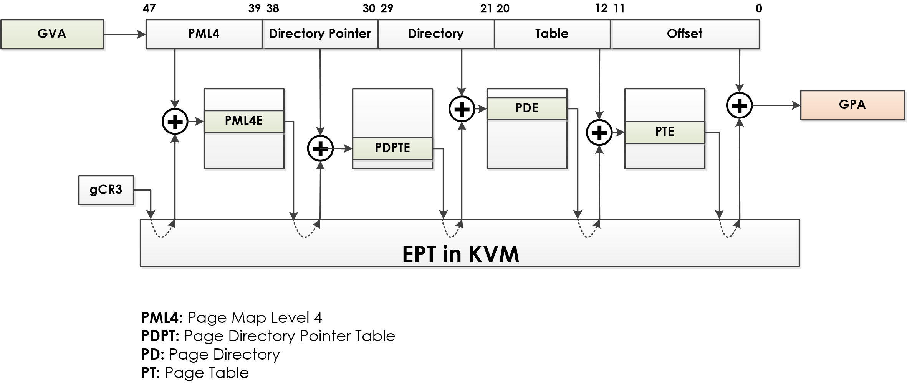
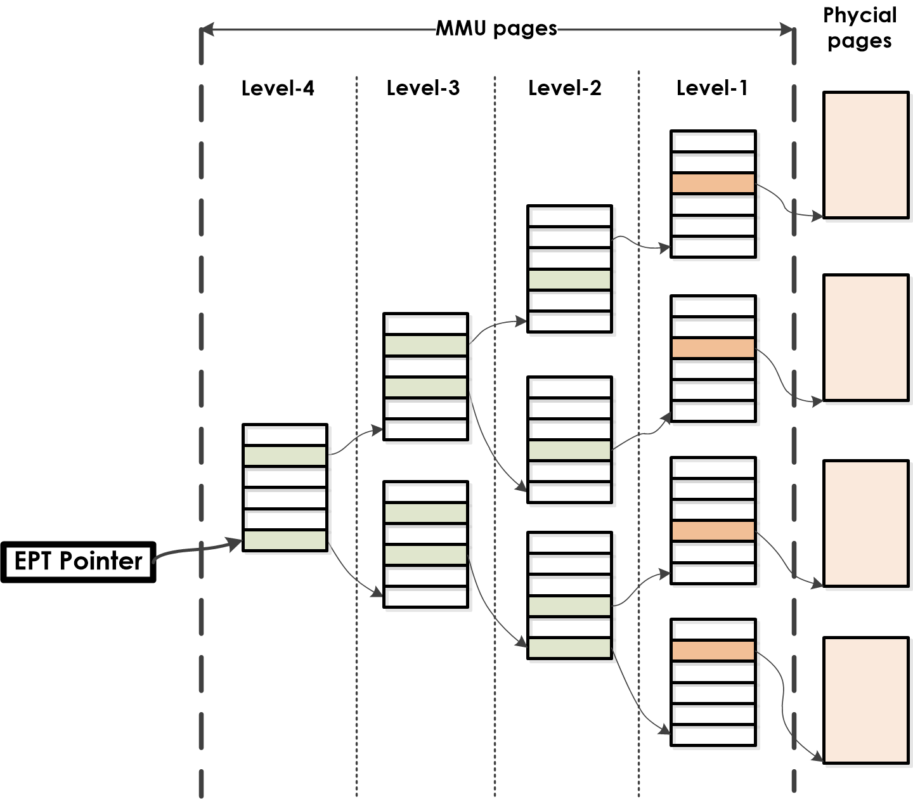
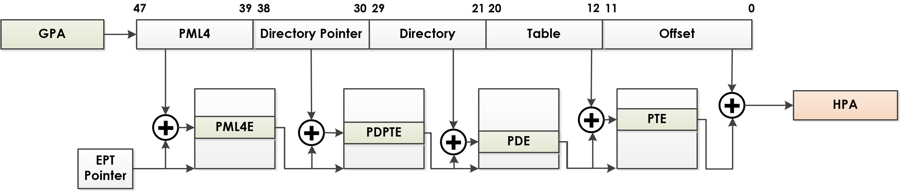
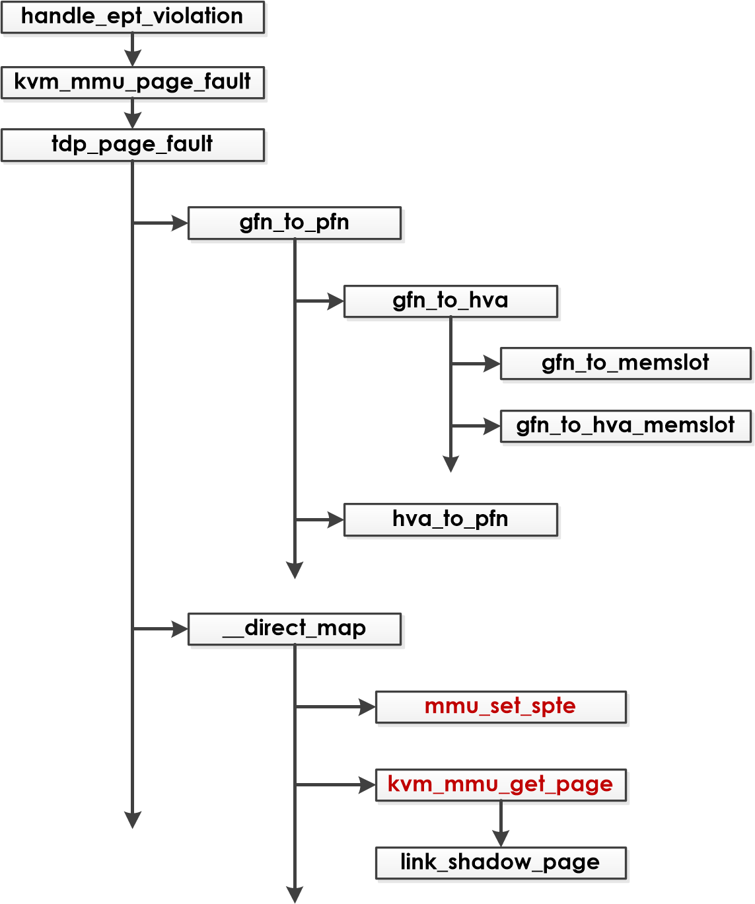
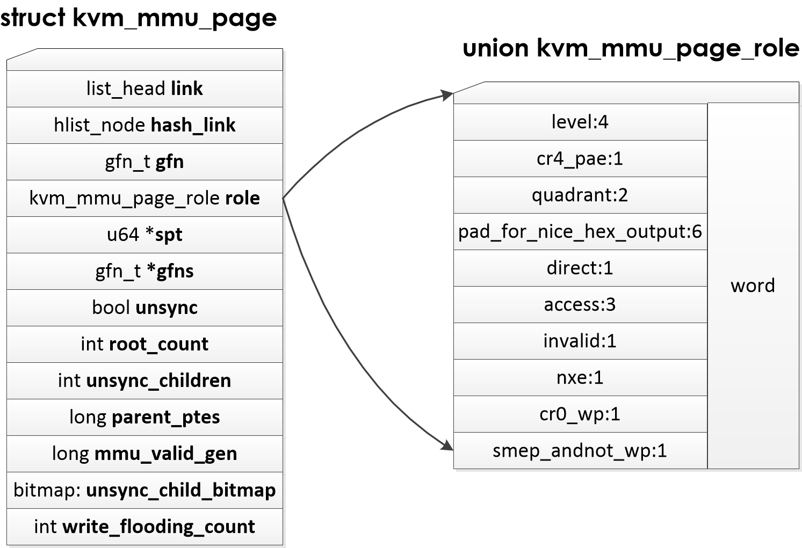
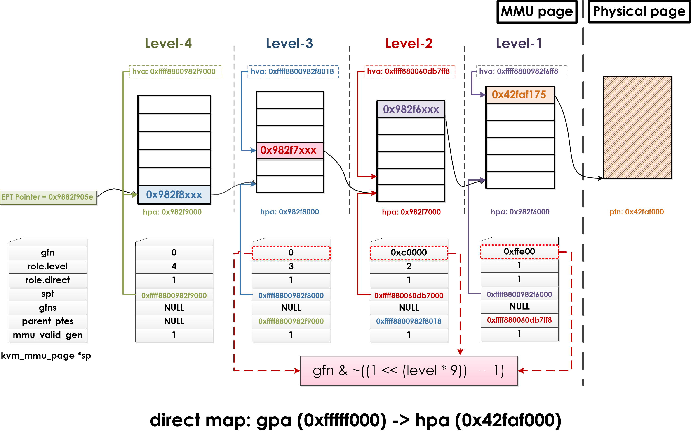
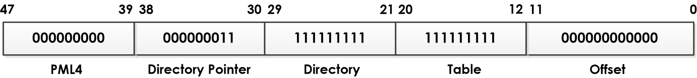
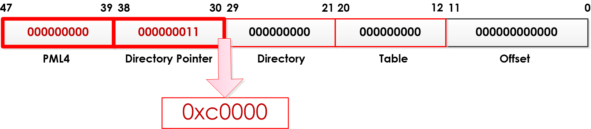
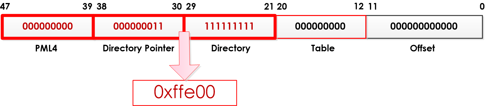

> @Date    : 2020-12-30 09:11:11
>
> @Author  : Lewis Tian (taseikyo@gmail.com)
>
> @Link    : github.com/taseikyo

# 史上最详细的 kvm_mmu_page 结构和用法解析

其实这是去年杨荡发我的一个 PDF，我后来找到原博客，是个 GitHub 主页，现在已经挂了，于是我把 repo 下载下来，用 hfs 临时搭个服务器渲染出这个页面并保存。

> 原文：https://ytliu.github.io-master/blog/2014/11/24/shi-shang-zui-xiang-xi-de-kvm-mmu-pagejie-gou-he-yong-fa-jie-xi/ 2014-11-24 Liu Yutao

这段时间在研究 KVM 内存虚拟化的代码，看的那叫一个痛苦。网上大部分能找到的资料，不管是中文的还是英文的，写的都非常含糊，很多关键的数据结构和代码都讲的闪烁其辞，有些就是简单的把 KVM 的文档翻译了一下，但是 KVM 的文档也让人（至少让我）看的挺费解的，只能着眼于代码，一直挣扎到如今，终于有那么一点开窍了。

于是乎，本着 “利己又为人” 的原则，我决定将这段时间自己所理解的东西倾情奉献出，特别是对 kvm_mmu_page 这个最为关键的数据结构，以及它在 handle EPT violation 时每个域的作用和意义。

需要说明的是，这篇博客并不是一个针对初学者理解 “内存虚拟化” 的教程，“内存虚拟化” 涉及到的很多概念需要读者去翻阅其它资料来获取，以下内容均建立在读者已经了解了 “内存虚拟化” 的基本概念的基础上，比如对于什么是影子页表（Shadow page table），什么是 EPT 等，请自行 google。以下内容大部分是我阅读目前 KVM 的文档和源码，以及在运行时生成 log 进行验证来确定的。

我会尽最大的努力让以下内容足够完整和准确，如果读者发现有什么不清楚或者觉得不正确的地方，望请告知。这篇博文也会实时并且持续更新。

现在开始进入 “史上最详细的” 系列：

我们知道在 KVM 最新的内存虚拟化技术中，采用的是两级页表映射 tdp (two-dimentional paging)，客户虚拟机采用的是传统操作系统的页表，被称做 guest page table (GPT)，记录的是客户机虚拟地址（GVA）到客户机物理地址（GPA）的映射；而 KVM 维护的是第二级页表 extended page table (EPT，注：AMD 的体系架构中其被称为 NPT，nested page table，在这篇文章中统一采用 Intel 的称法 EPT)，记录的是虚拟机物理地址（GPA）到宿主机物理地址（HPA）的映射。

在介绍主体内容之前，需要先统一下几个缩写（摘自 KVM 文档：linux/Documentation/virtual/kvm/mmu.txt）：

- pfn: host page frame number，宿主机中某个物理页的帧数
- hpa: host physical address，宿主机的物理地址
- hva: host virtual address，宿主机的虚拟地址
- gfn: guest page frame number，虚拟机中某个物理页的帧数
- gpa: guest physical address，虚拟机的物理地址
- gva: guest virtual address，虚拟机的虚拟地址
- pte: page table entry，指向下一级页表或者页的物理地址，以及相应的权限位
- gpte: guest pte，指向 GPT 中下一级页表或者页的 gpa，以及相应的权限位
- spte: shadow pte，指向 EPT 中下一级页表或者页的 hpa，以及相应的权限位
- tdp: two dimentional paging，也就是我们所说的 EPT 机制

以上唯一需要解释的是 spte，在这里被叫做 shadow pte，如果不了解的话，会很容易和以前的 shadow paging 机制搞混。

KVM 在还没有 EPT 硬件支持的时候，采用的是影子页表（shadow page table）机制，为了和之前的代码兼容，在当前的实现中，EPT 机制是在影子页表机制代码的基础上实现的，所以 EPT 里面的 pte 和之前一样被叫做 shadow pte，这个会在之后进行详细的说明。

## 两级页表寻址 (tdp)

其实这个不是重点，就简单地贴张图吧：



在上图中，包括 guest CR3 在内，算上 PML4E、PDPTE、PDE、PTE，总共有 5 个客户机物理地址（GPA），这些 GPA 都需要通过硬件再走一次 EPT，得到下一个页表页相对应的宿主机物理地址。

接下来，也就是这篇博文主要的关注点，给定一个 GPA，如何通过 EPT 计算出其相对应的 HPA 呢？换句话说，如果发生一个 EPT violation，即在客户虚拟机中发现某个 GPA 没有映射到相对应的 HPA，那么在 KVM 这一层会进行什么操作呢？

## EPT

下图是 EPT 的总体结构：



和传统的页表一样，EPT 的页表结构也是分为四层（PML4、PDPT、PD、PT），EPT Pointer (EPTP) 指向 PML4 的首地址，在没有大页（huge page）的情况下（大页会在以后的博文中说明，这篇博文不考虑大页的情况），一个 gpa 通过四级页表的寻址，得到相应的 pfn，然后加上 gpa 最后 12 位的 offset，得到 hpa，如下图所示：



### 物理页与页表页

在这个过程中，有两种不同类型的页结构：物理页（physical page）和页表页（MMU page）。物理页就是真正存放数据的页，而页表页，顾名思义，就是存放页表的页，而且存放的是 EPT 的页表。其中，第四级（level-4）页表，也就是 EPTP 指向的那个页表，是所有 MMU pages 的根（root），它只有一个页，包含 512（4096/8）个页表项（PML4E），每个页表项指向一个第三级（level-3）的页表页（PDPT），类似的，每个 PDPT 页表页也是 512 个页表项指向下一级页表，直到最后一级（level-1）PT，PT 中的每个页表项（PTE）指向的是一个物理页的页帧（pfn）异或上相对应的 access bits。

物理页和页表页除了功能和里面存储的内容不同外，它们被创建的方式也是不同的：

- 物理页可以通过内核提供的 `__get_free_page` 来创建，该函数最后会通过底层的 `alloc_page` 来返回一段指定大小的内存区域。
- 页表页则是从 `mmu_page_cache` 获得，该 page cache 是在 KVM 模块初始化 vcpu 的时候通过 linux 内核中的 slab 机制分配好作为之后 MMU pages 的 cache 使用的。

在 KVM 的代码实现中，每个页表页（MMU page）对应一个数据结构 kvm_mmu_page。这个数据结构是理解整个 EPT 机制的关键，接下来的篇幅就主要围绕这个 `kvm_mmu_page` 进行分析。

### ept violation 处理流程

在引入这个数据结构之前，我们先来整体了解下在发生 ept violation 之后 KVM 是如何进行处理的（也可参考 [这篇博文](http://blog.csdn.net/lux_veritas/article/details/9284635))：



`handle_ept_violation` 最终会调用到 `arch/x86/kvm/mmu.c` 里面的 `tdp_page_fault`。在该函数中，有两个大的步骤：

- gfn_to_pfn：在这个过程中，通过 gfn->memslot->hva->pfn 这一系列步骤得到最后的 pfn，这个过程以后会专门用一篇博客来描述；
- __direct_map：这个函数所做的事情就是把上一步中得到的 pfn 和 gfn 的映射关系反映在 EPT 中，该过程是这篇博文介绍的重点。

顺便提一句，为什么这里叫 `direct_map` 呢，即这里的 `direct` 是什么意思呢？在我的理解中，这个 `direct` 和 `shadow` 是相对应的，`direct` 是指在 EPT 的模式下进行映射，而 `shadow` 是在之前 shadow paging 的模式下进行映射，这主要反映在后面的 `kvm_mmu_get_page` 传参过程中（请参阅之后的介绍）。

`__direct_map` 的主要逻辑如下（可参阅 [这里](http://blog.csdn.net/lux_veritas/article/details/9284635) 的解释）：

arch/x86/kvm/mmu.c

```
static int __direct_map (args...)
{
  ...
  for_each_shadow_entry (vcpu, (u64) gfn << PAGE_SHIFT, iterator) {
    if (iterator.level == level) {
      mmu_set_spte (vcpu, iterator.sptep, ACC_ALL,
             write, &emulate, level, gfn, pfn,
             prefault, map_writable);
      ...
      break;
    }

    if (!is_shadow_present_pte (*iterator.sptep)) {
      u64 base_addr = iterator.addr;

      base_addr &= PT64_LVL_ADDR_MASK (iterator.level);
      pseudo_gfn = base_addr >> PAGE_SHIFT;
      sp = kvm_mmu_get_page (vcpu, pseudo_gfn, iterator.addr,
                iterator.level - 1,
                1, ACC_ALL, iterator.sptep);

      link_shadow_page (iterator.sptep, sp, true);
    }
  }
  return emulate;
}
```

这里的函数代码将映射的建立分成两种情况：

arch/x86/kvm/mmu.c

```
if (iterator.level == level) {
  mmu_set_spte (...);
  ...
}
```

arch/x86/kvm/mmu.c

```
else if (!is_shadow_present_pte (*iterator.sptep)) {
  kvm_mmu_get_page (...);
  link_shadow_page (...);
}
```

简单来说，`__direct_map` 这个函数是根据传进来的 gpa 进行计算，从第 4 级（level-4）页表页开始，一级一级地填写相应页表项，这些都是在 `for_each_shadow_entry (vcpu, (u64) gfn << PAGE_SHIFT, iterator)` 这个宏定义里面实现的，这里不展开。这两种情况是这样子的：

- 第一种情况是指如果当前页表页的层数（`iterator.level`）是最后一层（`level`）的页表页，那么直接通过调用 `mmu_set_spte`（之后会细讲）设置页表项。
- 第二种情况是指如果当前页表页 `A` 不是最后一层，而是中间某一层（leve-4, level-3, level-2)，而且该页表项之前并没有初始化（`!is_shadow_present_pte (*iterator.sptep)`），那么需要调用 `kvm_mmu_get_page` 得到或者新建一个页表页 `B`，然后通过 `link_shadow_page` 将其 link 到页表页 `A` 相对应的页表项中。

### kvm_mmu_get_page

根据代码可能发生的前后关系，我们先来解释下第二种情况，即如何新建一个页表页，即之前所提到的 kvm_mmu_page。

这是 `kvm_mmu_get_page` 的声明：

arch/x86/kvm/mmu.c

```
static struct kvm_mmu_page *kvm_mmu_get_page (struct kvm_vcpu *vcpu, gfn_t gfn,
        gva_t gaddr, unsigned level, int direct, unsigned access, u64 *parent_pte);
```

首先解释下传进来的参数都是什么意思：

- gaddr：产生该 ept violation 的 gpa；
- gfn：gaddr 通过某些计算得到的 gfn，计算的公式是 `(gaddr >> 12) & ~((1 << (level * 9)) - 1)`，这个会在之后进行解释；
- level：该页表页对应的 level，可能取值为 3，2，1；
- direct：在 EPT 机制下，该值始终为 1，如果是 shadow paging 机制，该值为 0；
- access：该页表页的访问权限；
- parent_pte：上一级页表页中指向该级页表页的页表项的地址。

下面举个例子来说明：

假设在 `__direct_map` 中，产生 ept violation 的 gpa 为 0xfffff000，当前的 level 为 3，这个时候，发现 EPT 中第 3 级的页表页对应的页表项为空，那么我们就需要创建一个第 2 级的页表页，然后将其物理地址填在第 3 级页表页对应的页表项中，那么传给 `kvm_mmu_get_page` 的参数很可能是这样子的：

- gaddr：0xfffff000；
- gfn: 0xc0000 (通过 `(0xfffff000 >> 12) & ~((1 << (3 - 1) * 9) - 1)` 得到）；
- level：2 （通过 `3 - 1` 得到）；
- direct：1；
- access：7（表示可读、可写、可执行）；
- parent_pte：0xffff8800982f8018（这个是第 3 级页表页相应的页表项的宿主机虚拟地址 hva）；

#### struct kvm_mmu_page

接下来看看这个函数的返回值：`struct kvm_mmu_page`：



以上是它的定义，该函数定义在 `arch/x86/include/asm/kvm_host.h` 中。那么它们分别是什么意思呢？这里先有一个大概的解释（有几个域还不确定，之后会持续更新），等会儿我们会通过一个具体的例子来说明：

|   kvm_mmu_page 子域  |                                                   解释                                                   |
|:--------------------:|:--------------------------------------------------------------------------------------------------------:|
| link                 | 将该页结构链接到 kvm->arch.active_mmu_pages 和 invalid_list 上，标注该页结构不同的状态                   |
| hash_link            | KVM 中会为所有的 mmu_page 维护一个 hash 链表，用于快速找到对应的 kvm_mmu_page 实例，详见之后代码分析     |
| gfn                  | 通过 kvm_mmu_get_page 传进来的 gfn，在 EPT 机制下，每个 kvm_mmu_page 对应一个 gfn，shadow paging 见 gfns |
| role                 | kvm_mmu_page_role 结构，详见之后分析                                                                     |
| spt                  | 该 kvm_mmu_page 对应的页表页的宿主机虚拟地址 hva                                                         |
| gfns                 | 在 shadow paging 机制下，每个 kvm_mmu_page 对应多个 gfn，存储在该数组中                                  |
| unsync               | 用在最后一级页表页，用于判断该页的页表项是否与 guest 的翻译同步（即是否所有 pte 都和 guest 的 tlb 一致） |
| root_rount           | 用在第 4 级页表，标识有多少 EPTP 指向该级页表页                                                          |
| unsync_children      | 记录该页表页中有多少个 spte 是 unsync 状态的                                                             |
| parent_ptes          | 表示有哪些上一级页表页的页表项指向该页表页（之后会详细介绍）                                             |
| mmu_valid_gen        | 该页的 generation number，用于和 < code>kvm->arch.mmu_valid_gen 进行比较，比它小表示该页是 invalid 的    |
| unsync_child_bitmap  | 记录了 unsync 的 sptes 的 bitmap，用于快速查找                                                           |
| write_flooding_count | 在页表页写保护模式下，用于避免过多的页表项修改造成的模拟（emulation）                                    |

其中，`role` 指向了一个 `union kvm_mmu_page_role` 结构，解释如下：

| kvm_mmu_page_role 子域 |                          解释                         |
|:----------------------:|:-----------------------------------------------------:|
| level                  | 该页表页的层级                                        |
| cr4_pae                | 记录了 cr4.pae 的值，如果是 direct 模式，该值为 0     |
| quadrant               | 暂时不清楚                                            |
| direct                 | 如果是 EPT 机制，则该值为 1，否则为 0                 |
| access                 | 该页表页的访问权限，参见之后的说明                    |
| invalid                | 表示该页是否有效（暂时不确定）                        |
| nxe                    | 记录了 efer.nxe 的值（暂时不清楚什么作用）            |
| cr0_wp                 | 记录了 cr0.wp 的值，表示该页是否写保护                |
| smep_andnot_wp         | 记录了 cr4.smep && !cr0.wp 的值（暂时不确定什么作用） |

#### kvm_mmu_get_page 源码分析

在了解了大部分子域的意义之后，我们来看下 `kvm_mmu_get_page` 的代码：

arch/x86/kvm/mmu.c

```
static struct kvm_mmu_page *kvm_mmu_get_page (...)
{
  ...
  role = vcpu->arch.mmu.base_role;
  role.level = level;
  role.direct = direct;
  if (role.direct)
    role.cr4_pae = 0;
  role.access = access;
  ...
  for_each_gfn_sp (vcpu->kvm, sp, gfn) {
    ...
    mmu_page_add_parent_pte (vcpu, sp, parent_pte);
    ...
    return sp;
  }
  ...
  sp = kvm_mmu_alloc_page (vcpu, parent_pte, direct);
  if (!sp)
    return sp;
  sp->gfn = gfn;
  sp->role = role;
  hlist_add_head (&sp->hash_link,
    &vcpu->kvm->arch.mmu_page_hash [kvm_page_table_hashfn (gfn)]);
  ...
  sp->mmu_valid_gen = vcpu->kvm->arch.mmu_valid_gen;
  init_shadow_page_table (sp);
  return sp;
}
```

- 一开始会初始化 `role`，在 EPT 机制下，`vcpu->arch.mmu.base_role` 最开始是被初始化为 0 的：

arch/x86/kvm/mmu.c

```
static void init_kvm_tdp_mmu (struct kvm_vcpu *vcpu)
{
    ...
    context->base_role.word = 0;
    ...
}
```

- 然后调用 `for_each_gfn_sp` 查找之前已经使用过的 `kvm_mmu_page`，该宏根据 gfn 的值在 `kvm_mmu_page` 结构中的 hash_link 进行，具体可参阅以下代码：

arch/x86/kvm/mmu.c

```
#define for_each_gfn_sp (_kvm, _sp, _gfn)  \  
  hlist_for_each_entry (_sp,   \
    &(_kvm)->arch.mmu_page_hash [kvm_page_table_hashfn (_gfn)], hash_link) \
      if ((_sp)->gfn != (_gfn)) {} else
```

- 如果找到了，调用 `mmu_page_add_parent_pte`，设置 parent_pte 对应的 reverse map（reverse map 一章会在之后对其进行详细的说明）；
- 如果该 gfn 对应的页表页不存在，则调用 `kvm_mmu_alloc_page`：

arch/x86/kvm/mmu.c

```
static struct kvm_mmu_page *kvm_mmu_alloc_page (...)
{
  struct kvm_mmu_page *sp;

  sp = mmu_memory_cache_alloc (&vcpu->arch.mmu_page_header_cache);
  sp->spt = mmu_memory_cache_alloc (&vcpu->arch.mmu_page_cache);
  ...
  list_add (&sp->link, &vcpu->kvm->arch.active_mmu_pages);
  sp->parent_ptes = 0;
  mmu_page_add_parent_pte (vcpu, sp, parent_pte);
  return sp;
}
```

- 改函数调用 `mmu_memory_cache_alloc` 从之前分配好的 mmu page 的 memory cache 中得到一个 `kvm_mmu_page` 结构体实例，然后将其插入 `kvm->arch.active_mmu_pages` 中，同时调用 `mmu_page_add_parent_pte` 函数设置 parent pte 对应的 reverse map。

#### 一个例子

讲到这里，我们来看一个例子：



在上图中，我们假设需要映射 gpa（0xfffff000）到其相对应的 hpa（0x42faf000）。

另外，对于每一个 MMU page，我们都列出了其相对应的 `kvm_mmu_page` 对应的页结构中几个比较关键的域的值。

对于 gpa 为 `0xfffff000` 的地址，其 gfn 为 `0xfffff`，我们将其用二进制表示出来，并按照 EPT entry 的格式进行分割：



比如，对于 EPT pointer 指向的第 4 级（level-4）页表页，它的 `role.level` 为 4，它的 `sp->spt` 为该页表页的 `hva` 值 `0xffff8800982f9000`。另外，对于最高层级的页表页来说，它的 `sp->gfn` 为 0，表示 gfn 为 0 的地址可以通过寻址找到该页表页。而由于 ept entry 中第 4 段的 index 为 0，所以改页表页的第 1 个页表项（PML4E）指向了下一层的页表页。

同样的，对于第 3 级（level-3）页表页，它的 `role.level` 为 3，`sp->spt` 为该页表页的 `hva` 值 `0xffff8800982f8000`。由上图可知，在 ept entry 中，它的上一层（即第 4 段）的 index 值为 0，所以其 `sp->gfn` 也是 0，同样表示 gfn 为 0 的地址可以通过寻址找到该页表页。另外，在该层的页表页中，其 `parent_ptes` 填的是上一层的页表页中指向该页表页的页表项的地址，即第 4 级页表页的第一个页表项的地址 `0xffff8800982f9000`，而在 ept entry 中，由于第 3 段的 index 为 3，所以该页表页的第 3 个页表项（PDPTE）指向了下一层的页表页。

以此类推，到第 2 级（level-2）页表页，前面几项都和之前是类似的，而对于 `sp->gfn` 来说，由于它的上一层（第 3 层）的 index 值为 3，那么通过计算公式 `(gaddr >> 12) & ~((1 << (level * 9)) - 1)` 可以得到以下的值：



将其转化为十六进制数，即可得到 `0xc0000`，表示 gfn 为 `0xc0000` 的地址在寻址过程中会找到该页表页。而它的 `parent_ptes` 就指向了第 3 层页表页中第 3 个页表项的地址 `0xffff8800982f8018`，ept entry 中第 2 段的 index `0xfff` 表示它最后一项页表项（PDE）指向了下一级的页表页。

类似的，可以算出第 1 级页表页的 `sp->gfn` 为 `0xffe00`，`parent_ptes` 为 `0xffff880060db7ff8`，同时，它的最后一个页表项（PTE）指向了真正的 hpa`0x42faf000`。



到此为止，gpa 被最终映射为 hpa，并放映在 EPT 中，于是下次客户虚拟机应用程序访问该 gpa 的时候就不会再发生 ept violation 了。

### reverse map

似乎讲到这里就该结束了？

确实，基本上这篇博文的内容就要接近尾声了，只是还有那么一小点内容，关于 reverse map。

如果你倒回去看会发现，我们还有两个很重要的函数没有展开：

- mmu_page_add_parent_pte
- mmu_set_spte

这两个函数是干什么的呢？其实它们都和 reverse map 有关。

首先，对于低层级（level-3 to level-1）的页表页结构 kvm_mmu_page，我们需要设置上一级的相应的页表项地址，然后通过 `mmu_page_add_parent_pte` 设置其 parent_pte 的 reverse map：

arch/x86/kvm/mmu.c

```
static void mmu_page_add_parent_pte (...)
{
  if (!parent_pte)
    return;

  pte_list_add (vcpu, parent_pte, &sp->parent_ptes);
}
```

另外一点，我说过，页分为两类，物理页和页表页，但是我之前没有说的一点是，页表页本身也被分为两类，高层级（level-4 to level-2）的页表页，和最后一级（level-1）的页表页。

对于高层级的页表页，我们只需要调用 `link_shadow_page`，将页表项的值和相应的权限位直接设置上去就好了，但是对于最后一级的页表项，我们除了设置页表项对应的值之外，还需要做另一件事，`rmap_add`：

arch/x86/kvm/mmu.c

```
static void mmu_set_spte (...)
{
  ...

  if (set_spte (vcpu, sptep, pte_access, level, gfn, pfn, speculative,
        true, host_writable)) {
    ...
  }
  ...
  if (is_shadow_present_pte (*sptep)) {
    if (!was_rmapped) {
      rmap_count = rmap_add (vcpu, sptep, gfn);
      ...
    }
  }

  ...
}

static int rmap_add (struct kvm_vcpu *vcpu, u64 *spte, gfn_t gfn)
{
  ...
  sp = page_header (__pa (spte));
  kvm_mmu_page_set_gfn (sp, spte - sp->spt, gfn);
  rmapp = gfn_to_rmap (vcpu->kvm, gfn, sp->role.level);
  return pte_list_add (vcpu, spte, rmapp);
}
```

可以看到，不管是 `mmu_page_add_parent_pte`，还是 `mmu_set_spte` 调用的 `rmap_add`，最后都会调用到 `pte_list_add`。

那么问题来了，这货是干嘛的呢？

翻译成中文的话，reverse map 被称为反向映射，在上面提到的两个反向映射中，第一个叫 parent_ptes，记录的是页表页和指向它的页表项对应的映射，另一个是每个 gfn 对应的反向映射 rmap，记录的是该 gfn 对应的 spte。

我们举 rmap 为例，给定一个 gfn，我们怎么找到其对应的 rmap 呢？

- 首先，我们通过 `gfn_to_memslot` 得到这个 gfn 对应的 memory slot（这个机制会在以后的博文中提到）；
- 通过得到的 slot 和 gfn，算出相应的 index，然后从 `slot->arch.rmap` 数组中取出相应的 rmap：

arch/x86/kvm/mmu.c

```
static unsigned long *__gfn_to_rmap (gfn_t gfn, int level,
            struct kvm_memory_slot *slot)
{
  unsigned long idx;

  idx = gfn_to_index (gfn, slot->base_gfn, level);
  return &slot->arch.rmap [level - PT_PAGE_TABLE_LEVEL][idx];
}
```

有了 gfn 对应的 rmap 之后，我们再调用 `pte_list_add` 将这次映射得到的 spte 加到这个 rmap 中

arch/x86/kvm/mmu.c

```
static int pte_list_add (struct kvm_vcpu *vcpu, u64 *spte,
      unsigned long *pte_list)
{
  struct pte_list_desc *desc;
  int i, count = 0;

  if (!*pte_list) {
    rmap_printk ("pte_list_add: % p % llx 0->1\n", spte, *spte);
    *pte_list = (unsigned long) spte;
  } else if (!(*pte_list & 1)) {
    rmap_printk ("pte_list_add: % p % llx 1->many\n", spte, *spte);
    desc = mmu_alloc_pte_list_desc (vcpu);
    desc->sptes [0] = (u64 *)*pte_list;
    desc->sptes [1] = spte;
    *pte_list = (unsigned long) desc | 1;
    ++count;
  } else {
    rmap_printk ("pte_list_add: % p % llx many->many\n", spte, *spte);
    desc = (struct pte_list_desc *)(*pte_list & ~1ul);
    while (desc->sptes [PTE_LIST_EXT-1] && desc->more) {
      desc = desc->more;
      count += PTE_LIST_EXT;
    }
    if (desc->sptes [PTE_LIST_EXT-1]) {
      desc->more = mmu_alloc_pte_list_desc (vcpu);
      desc = desc->more;
    }
    for (i = 0; desc->sptes [i]; ++i)
      ++count;
    desc->sptes [i] = spte;
  }
  return count;
}
```

看到这里你可能还是一头雾水，rmap 到底是什么，为什么加一个 rmap 的项要那么复杂？

好吧，其实我的理解是这样的：

- 首先，rmap 就是一个数组，这个数组的每个项都对应了这个 gfn 反向映射出的某个 spte 的地址；
- 其次，由于大部分情况下一个 gfn 对应的 spte 只有一个，也就是说，大部分情况下这个数组的大小是 1；
- 但是，这个数组也可能很大，大到你也不知道应该把数组的大小设到多少合适；
- 所以，总结来说，rmap 是一个不确定大小，但是大部分情况下大小为 1 的数组。

那么，怎么做？

我想说，这是一个看上去很完美的设计！

由于 spte 的地址只可能是 8 的倍数（自己想为什么），所以其第一位肯定是 0，那么我们就利用这个特点：

- 我们用一个 `unsigned long *` 来表示一个 rmap，即上文中的 `pte_list`；
- 如果这个 `pte_list` 为空，则表示这个 rmap 之前没有创建过，那么将其赋值，即上文中 `0->1` 的情况；
- 如果这个 `pte_list` 不为空，但是其第一位是 `0`，则表示这个 rmap 之前已经被设置了一个值，那么需要将这个 `pte_list` 的值改为某个 `struct pte_list_desc` 的地址，然后将第一位设成 `1`，来表示该地址并不是单纯的一个 spte 的地址，而是指向某个 `struct pte_list_desc`，这是上文中 `1->many` 的情况；
- 如果这个 `pte_list` 不为空，而且其第一位是 `1`，那么通过访问由这个地址得到的 `struct pte_list_desc`，得到更多的 sptes，即上文中 `many->many` 的情况。

`struct pte_list_desc` 结构定义如下：

arch/x86/kvm/mmu.c

```
struct pte_list_desc {
    u64 *sptes [PTE_LIST_EXT];
    struct pte_list_desc *more;
};
```

它是一个单链表的节点，每个节点都存有 3 个 spte 的地址，以及下一个节点的位置。

好了，最后一个问题，rmap 到底有什么用？

当然，信息总归是有用的，特别是这些和映射相关的信息。

举个例子吧，假如操作系统需要进行页面回收或换出，如果宿主机需要把某个客户机物理页换到 disk，那么它就需要修改这个页的物理地址 gpa 对应的 spte，将其设置成不存在。

那么这个该怎么做呢？

当然，你可以用软件走一遍 ept 页表，找到其对应的 spte。但是，这样太慢了！这个时候你就会想，如果有一个 gfn 到 spte 的反向映射岂不方便很多！于是，reverse map 就此派上用场。

这里最后说一点，如果说有这么一个需求：宿主机想要废除当前客户机所有的 MMU 页结构，那么如何做最快呢？

当然，你可以从 EPTP 开始遍历一遍所有的页表页，处理掉所有的 MMU 页面和对应的映射，但是这种方法效率很低。

如果你还记得之前 `kvm_mmu_page` 结构里面的 `mmu_valid_gen` 域的话，你就可以通过将 kvm->arch.mmu_valid_gen 加 1，那么当前所有的 MMU 页结构都变成了 invalid，而处理掉页结构的过程可以留给后面的过程（如内存不够时）再处理，这样就可以加快这个过程。

而当 mmu_valid_gen 值达到最大时，可以调用 kvm_mmu_invalidate_zap_all_pages 手动废弃掉所有的 MMU 页结构。

完。