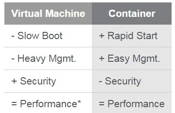
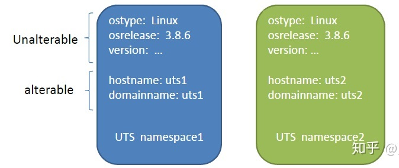
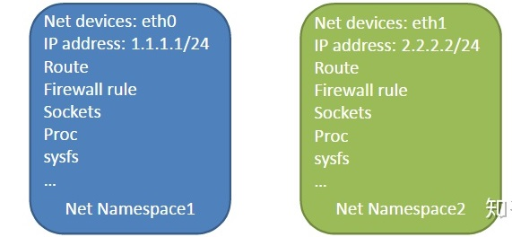
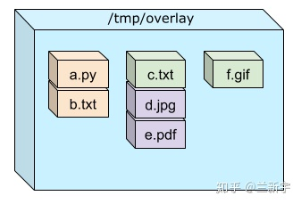

> @Date    : 2020-12-25 16:11:40
>
> @Author  : Lewis Tian (taseikyo@gmail.com)
>
> @Link    : github.com/taseikyo

# 理解 docker

> 原文：https://zhuanlan.zhihu.com/p/143253843 2020-09-16 [兰新宇](https://www.zhihu.com/people/lan-xin-yu)

## 另一种虚拟化

docker 作为一种将应用及其依赖进行 package 后发布的容器，就像可以被货轮承载和迁移的集装箱一样。现在的港口的设备当然是很强力了，不过在以前，货物达到码头后，还是需要码头工人来搬运，这似乎就是 "docker" 一词的原意。

作为一种基于 OS 的虚拟化技术，和传统的基于 [hypervisor](https://zhuanlan.zhihu.com/p/69629212) 的虚拟机技术一样，都是需要共享物理主机上的资源。但相比 hypervisor 中的 Virtual Machine（以下简称 VM）而言，docker 的隔离度更弱，但同时资源消耗更小，相同平台可运行的 container 数目也更多。


而且，由于 docker 中的 container 是共享底层 OS 的，因此启动非常迅速。而像 KVM 这样的 hypervisor 在启动一个 VM 的时候，需要解压和引导 VM 所使用的内核，因而耗时更长。



## 三大支撑技术

docker 最初是基于 Linux 设计的容器技术（现在也可以通过 docker toolbox 在 Windows 上做一个模拟层来移植到 Windows 上），它的实现依赖于 Linux 中众多的基础机制，包括用于资源限制的 cgroup，用于隔离的 Namespace，以及用于实现 docker 文件系统的 Union FS 等。


## 画土分疆 - Control Group

### 为什么要有 group

"cgroup" 代表的是 "control group"，这里 "**group**" 是进程的集合。“进程的集合” 似乎不是一个新鲜的概念，「进程组」不就是吗？对，但「进程组」的这个集合包括的是协同工作的一组进程（比如作为整体去接收信号），而 cgroup 这个集合的主要目的在于控制资源的使用：多个进程作为一个整体享有资源的配额（quota），同时接受资源的限制。

在 cgroup 出现之前，只能对一个进程做一些资源控制，例如通过 "nice" 值限定对 CPU 的使用，或者用 ulimit 限制一个进程的打开文件上限、栈大小等。而 cgroup 可以对进程进行任意的分组，如何分组是用户自定义的，一个 group 即对应一个 docker container。

### 控制什么

来看一下 "/sys/fs/cgroup" 下的目录结构，cgroup 支持的资源种类都在这里了，它们被称为 cgroup 中的 subsystem 或者 resource controller（因为不是所有 subsystem 都完全具备 controller 的属性，所以本文接下来将统称 "**subsystem**"）。


分配 CPU 的时间不难理解，可这里关于 CPU 的好像不止一个，有 cpu, cpuacct 和 cpuset。额，可能因为 CPU 对一个系统来说实在太重要了吧。

那它们的区别在哪里呢？"**cpu**"是限制各个 group 对 CPU 的使用时间（比如 50%），时间一到，就强制转入睡眠。"**cpuacct**"中的"acct"是"accouting" 的缩写，用于统计每个 group 消耗的 CPU 时间（包括 user time 和 system time）。

两者的关系好像非常紧密啊。是的，所以 "cpu" 和 "cpuacct" 都是 link 到 "cpu, cpuacct" 的：


而 **cpuset** 是限制 SMP 系统中，一个 group 可以使用哪几个 CPU。为什么要做出这种限制，而不是让 OS 随意调度呢？要回答这个问题，还是先进 "cpuset" 的目录看一下：


你会发现有很多关于 memory 的条目，不是有单独的 memory cgroup（简称 memcg）来管理内存资源么？再想想什么时候 CPU 和内存在物理上的分布会是个问题？就是 [NUMA](https://zhuanlan.zhihu.com/p/68465952) 啦。其实，cpuset 主要是用于在 NUMA 这种有着复杂结构的大型系统中，根据 CPU 和内存节点的分布情况，更加合理地调度和使用 CPU 和内存资源。


### 如何控制

subsystem 已经是事先准备好的，那如何创建一个 control group 呢？很简单，因为这是 sysfs 文件系统，只需在对应的 subsystem（比如 "cpu"）目录下，直接 "mkdir" 新建一个文件夹（比如 "c1"）。


然后，"c1" 这个 group 所需的基础实施就分分钟配套完成，只是里面还没有人居住。那 process 怎么才可以住进来呢？把自己的 pid 打到 "tasks" 里面去就好了。

```
echo [pid] >> /sys/fs/cgroup/cpu,cpuacct/c1/task
```

不过，进了这个 group 的家门，就得按照这个 group 的规矩来（包括各种资源的限制）。当然，想换一个 group 也是可以的，把自己的 pid 移动到新的 group 里即可，这是 process 的自由。

那 group 有什么自由呢？subsystem 是支持多层级 group 嵌套的，就是一个 group 可以再包含若干的 sub-group，这样一个 subsystem 就形成了树形的 **hierarchy**。至于这样设计的理由，举个例子，Linux 是支持多用户的，比如你可以让 root 用户占其中 75% 的 CPU 资源，然后在里面再进行细分，让数据库业务占 50%，其他占 25%。

所以，一个 group 可以选择放或者不放在一个 subsystem 中，也可以选择放在一个 subsystem 的哪个层级，哪个 sub-group 下。比如上面示例中新建的 "c1" 这个 group，如果它需要被限制对内存的使用，就应该放在 "memory" 这个 subsystem 中的某个结点下。不过，一个 group 只能放在一个 subsystem hierarchy 的一个节点上（要不然就乱套了）。


这就像上图所示的一个矩阵的关系，它其实是可以形成很多组合的，不过这些组合搭配并不一定都行的通，需要使用者自己去保证。cgroup 的这种设计确实为应用提供了极大的灵活性，但同时也更容易出问题。

### 重构 - 反对的声音

作为 cgroup 的 maintainer，Tejun Heo 随后对 cgroup 的设计发起了历时多年的修改，这个新设计的版本被称为 "**cgroup v2**"。相比起 v1 以 subsystem 为主的 hierarchy 结构，v2 最核心的变化是以 group 为主导，它的层级结构如下图所示：


这样就不是每个 subsystem 有一个 hierarchy，而是一个整体的 **unified hierarchy**，对一个 group 可使用的 CPU 和内存等资源的限制，在其内部就规定好了。

### 更多的变化

v1 允许同一个 process 的不同 thread 分布在不同的 control group，但 v2 取消了这个特性。在新的版本中增加新的功能可能不会受到太大的阻力，但是要减少一个曾经存在的功能，就难免引起一些争议，因为确实有实际的项目使用到这个特性。

不过，Heo 最终决定做出这个改动，想必也是对需求（收益）、设计复杂度（投入）、适用场景（范围）综合考量的结果，用他的原话说就是 "sometimes too much flexibility causes a hindrance"。选择恐惧症的福音啊。

此外，v2 还有一个限制：既然 cgroup hierarchy 可以被视作一棵树，那么 group 就是枝干，枝干上长出叶子，而 process 只能添加在叶子上。也就是说：process 和 group 不能是同级的关系，一个 process 不能单独和一个 group 去争用 CPU 的时间（做出这个限制的原因，主要也是为了降低实现的复杂度）。

比如下图的这个结构，在 C1, C3, C4 下面都是可以添加 process 的，但是在 C2 下面就不行。不过也有变通的方法，就是在一个 group 下只包含这一个 process（比如 C1 这种），只是层级深了一点，但在争用 CPU 的时间上还是可以达到同样的效果。


在 RHEL 8 中，目前默认支持的依然是 v1，这是因为像 kvm 使用的 libvirt、docker 的 runc 等，大都还依赖于 v1。不过，如果你的系统中没有这些虚拟化的应用，你倒是完全可以尝试通过更改 grub 的配置文件，来看看 v2 到底长什么样（参考[这篇文章](https://www.redhat.com/zh/blog/world-domination-cgroups-rhel-8-welcome-cgroups-v2)）。

说到 v2 的 redesign，其实对于一个公司的产品代码来说，亦可遵循这种轨迹。由于最初设计时的需求考虑不够完善等因素，经过几年的维护和修修补补，随着人员进进出出的不断变动，代码可能变的比较乱，甚至你都不知道其中的哪些代码实际是没有对应的功能的（废代码）。

这时投入相当的精力去做重构，虽然会消耗一定的人力资源，且可能对既有的业务模块造成影响，不过经历短暂的阵痛之后，更加清晰的代码结构和更加简洁的设计，也许可以让它以后走的更快和更远。

## 虚幻世界 - Namespace

"namespace" 通常被翻译为「命名空间」，听起来好像比较抽象，其实重点是在这个 "space"。它和描述进程的[虚拟地址空间](https://zhuanlan.zhihu.com/p/66794639)的 address space 一样，都是提供一种独占的视角（假象）。只是 address space 针对的是进程的地址，而 namespace 针对的是 docker container，且维度更多，但它们的目的都是一样的：隔离，以尽可能地减少互相的干扰和影响。

### 多维时空

目前，Linux 可以为 docker 提供的 namespace 种类包括文件系统 mount、进程间通信、网络等，它们其实大都在内核 2.6.24 前就已经完成了。所以啊，docker 所依赖的 Linux 的这些机制并不新鲜，但它通过一种新的需求，让这些沉淀多年的模块又重新焕发了生机。

### 文件系统 - Mount

那么多 namespace，从哪个介绍起呢。按照先来后到的顺序，先来说说在内核 2.4.19 时代就出现的 mount namespace 吧（也许叫做 "mount space" 更好理解）。其实现原理大致是在前面介绍过的 [bind mount](https://zhuanlan.zhihu.com/p/144893220) 的基础上，又增加了 mount propagation 的特性（参考[这篇文章](https://www.ibm.com/developerworks/library/l-mount-namespaces/index.html)）。

在新的 mount space 中，进程对文件系统的 mount/unmount 操作都被 “隐藏” 了起来，对其他 space 不可见，也不会影响到其他的 space。之后介绍了创建 namespace 的方法后，将通过一个小实验来印证这一点。

### 进程间通信 - IPC

接下来出场的是在 2.6.19 版本诞生的 IPC namespace，用上这个 space 之后，进程间的通信（**I**nter **P**rocess **C**ommunication）就被限定在了同一个 space 内部，即一个 container 中的某个进程只能和同一 container 中的其他进程通信，container 外部的进程对它来说好像不存在一样，因为它根本看不到。


### 主机域名 - UTS

UTS: UNIX Time-sharing System

由于多个 container 是共享 OS 内核的，因而像 UTS 里的 os type 和 os release 等信息是不可能更改的，但是每个 container 可以有自己独立的 host name 和 domain name，以便于标识和区分（比如可以通过主机名来访问网络中的机器），这就是 UTS namespace 的作用。



### 进程编号 - PID

当你启动了多个 container，然后在每个 container 内部用 "ps" 命令看一下，你会发现它们都有一个 PID 为 1 的进程。要知道，在一个 Linux 系统中，应该只有一个 1 号进程（以前是 SysVinit，现在是 systemd）。

想想 Linux 上物理地址也是唯一的，但不同的进程不是可以有相同的虚拟地址嘛，只要通过 [page table](https://zhuanlan.zhihu.com/p/64978946) 映射一下就可以了。同样地，这些 container 内部 PID 为 1 的进程，也会**映射**到 host 上其对应的真实的 PID 号上。从 Linux host 的视角，这都是些普通进程，但在 container 内部，它们却有了特殊的地位和意义。


那如何知道这种映射的对应关系呢？一个办法是在 `/proc/<pid>/status` 中找到 "NSpid" 后面有两列的 item:


### 网络设备 - network

然后来到 2.6.24 时代，出现了针对网络的 namespace。在每个 network space 内部，可以有独立的网络设备（虚拟的或者真实的）、IP 地址、路由表和防火墙规则等。其中的应用所 bind 的端口也是 per-namespace 的，比如 http 默认使用的是 80 端口，使用 network space 后，同一 host 上的各个 container 内部就都可以运行各自的 web server。



### 用户控制 - User

在 host 上全局的 user id(uid) 和 group id(gid)，到了 user namespace 内部就分别被映射成了各自的 kuid 和 kgid。这样做有什么用呢？比如在 container 内部是 root 用户（kuid 为 0），可以「为所欲为」，但是在 container 外部，就是一个普通的 unprivileged user（uid 非 0）。


看完以上这六种给 container 带来虚幻错觉的花招，不难发现，其实它们要达到的效果都是差不多的，就是在不同的 space 里面，可以有相同的 name，不会重名，只能看见和使用与该 namespace 相关的资源。这种 isolation，是一种软件层面的隔离，而不是物理上「泾渭分明」的隔离。

随着 cgroup namespace（4.6 版本引入）和 time namespace 的新鲜出炉，截止内核 5.6 版本，Linux 支持的 namespace 已经多达 8 种。也许以后 namespace 的种类还会继续增加，以提供更多的隔离性选择（比如正在 proposal 阶段的 syslog namespace）。在使用 container 的时候，也并不是所有 namepsace 都必须要有，可以根据需要选择其中的几个。

### 自立门户

同挂在 sysfs 中，依靠 mkdir/rmdir/mv 等基础的文件操作命令来新建/销毁/移动的 cgroup 不同，创建一个 namespace 需要使用 **clone()** 系统调用，namespace 的种类由标志位 "CLONE_NEWxxx" 来决定。


clone() 不是用于创建新的进程/线程的函数吗？没错，与 fork() 相比，clone() 可以更细粒度地控制与父进程共享哪些资源，因此也就可以用于选择是否与父进程共用 namespace。

就像 fork()可以搭配 "unshare" 来实现和 clone 同样的效果，对于一个既有的进程（创建阶段没有脱离父进程的 namespace），也还是有第二次 “分家的” 机会，就是通过 "**unshare**" 来创建新的 namespace（借助[这个小实验](http://redhatgov.io/workshops/containers_the_hard_way/exercise1/)，可以更好地体会 "unshare" 和 mount namespace 的用法及其意义）。

### 改弦更张

那如果一个进程并不想开宗立派，只是想加入一个既有的 namespace 呢？在 Linux 中，进程的相关信息一般是记录在 procfs 里，namspace 也不例外，在 `/proc/<pid>/ns` 中，通过 symbol link 的形式，给出了该进程所属的各个 namespace 的编号。


namespace 也可被抽象为一个广义上的文件，因此这个编号其实就是文件的 inode 号。如果两个进程的某一 ns 指向的 inode 号相同，说明它们在这个 ns 对应的属性上，是属于同一 namespace 的。

当进程通过 open() 操作打开 ns 对应的文件，就获得了一个 "fd"，接下来再使用 **setns()**，就可以加入这个 namespace：

```C
int setns(int fd, int nstype);
```

## 横空出世 - OverlayFS

假设有三个文件系统，它们的目录和文件布局如下图所示：


现在将它们按照从左到右的顺序，层层堆叠起来：


这实际上是做了一个合并，其结果就是：如果底层在某个目录下有文件而顶层没有，那么合并后你还可以看到它，而如果顶层的文件系统在这个位置上也有文件，那么底层对应位置的文件就被无情的覆盖了。



如果你看过前面介绍[文件系统 mount](https://zhuanlan.zhihu.com/p/144893220) 的文章，应该发现这其实利用的就是 "union mount" 的方式。想象你用画图软件（比如笔者常用的 draw.io）先后画两个方框，如果这两个方框在图纸上的位置有重叠的部分，那么先画的那个框在重叠的部分就看不到了。

在类 Unix 系统中（比如 [Plan 9](https://blog.youxu.info/2011/03/21/story-of-plan-9-revised/)），union mount/filesystem 的概念其实由来已久，即便是相对年轻的 Linux，也早在 93 年就开始了对它的探索，但很多年过去了，它却一直没能进入 Linux 的 mainline。

2010 年的时候，Valerie Aurora 曾在 LWN 上[撰文](https://lwn.net/Articles/396020/)说：如果你是和 Linux 中 union mount 的第一版实现同时出生的话，那么现在应该已经开始准备大学入学的申请了（整整 17 年啊）。而且 Valerie 还表示自己要转行了，不做程序员了，他的一位朋友给他发 email 说：

> 看到你要转行的消息，最开始是觉得很遗憾的，我们又少了一位 hacker，但是我突然想起你在 blog 里曾经说过：在转行之前要让 union mount 进入 mainline。看来，这至少还得好几年呢，你呀，一时半会儿转不了行了，我们还可以一起 hack 啊。

可见，union mount/filesystem 进入 mainline 的过程，真是「路漫漫其修远兮」啊。

一方面原因是 union fs 可能涉及到 VFS 层的改动，牵涉面较广，另一方面是因为 Linux 支持的文件系统千差万别，除了基于磁盘的文件系统（像 ext4, xfs），还有基于网络的文件系统（比如 NFS），甚至还有内存文件系统（proc, sys 等），要将这些存在巨大差异的文件系统都和 union filesystem 融合起来，难度着实不小。

直到我们的主角 docker 的出现，才推动并完成了这一场马拉松。一个名为 OverlayFS 的 union 文件系统的实现被 docker 所采用，并最终于 3.18 版本正式 merge 进内核。而 OverlayFS 之所以能够成功突围，很大程度上是因为它的简洁性。

OverlayFS 是一种抽象的文件系统，它并不直接参与存储，而是建立在其他文件系统之上（比如 xfs），其主要功能是合并底层文件系统，然后提供统一的文件视图供上层使用。OverlayFS 最开始使用的驱动是 overlay，而后升级为 overlay2，使用 overlay2 需要 4.0 内核（或者 redhat/centos7.3 对应的 3.10.0.514）之后的版本。

那 OverlayFS 到底是如何在 docker 中发挥作用的呢？实践出真知，当你接下来扎扎实实地使用一下 docker，应该就能理解个八九不离十了。

### 安装 docker

以 CentOS 7 作为 host（宿主机）为例，直接使用以下命令安装 docker 服务：

`# yum install docker`

如果不能成功（可能由于 CentOS 版本或者镜像源的不同），请参考[官方文档](https://docs.docker.com/engine/install/centos/)进行安装。安装后默认是没有启动 docker 服务的，需手动启动：

`# systemctl enable --now docker`

### 获取 images

然后，可以通过 "pull" 命令（和 git 一样）从 docker 的远端仓库（称为 registry）拉取所需的镜像。比如下载和 host 一样的 CentOS 7.7 的 docker 版本的镜像：

`# docker pull centos:7.7.1908`

如果不指定具体的版本号（在[这里](https://hub.docker.com/_/centos)查询），那么将默认下载最新的 CentOS 版本。在下载的过程中，你会发现镜像大小只有几十 MB，extracting 解压后也只有 200 多 MB，远小于一个标准的 CentOS 镜像的大小。


来看下此时 docker 的 layer 分布，只有一层 "**Image layer**"：


### 启动 container

一个 ELF 可执行文件，启动后形成一个进程。同样地，基于这个下载的 image 启动的，就是一个 container。ID 是用来识别不同的 images 和 containers 的，所以这里只需用前面两个数字 "08"，docker 就知道你指定的是哪一个 image。

`# docker run -it 08 /bin/bash`

先退出 docker 的 bash（用 "ctrl+p" 加上 "ctrl+q"），在 host 上使用 "ps" 命令（和查看进程的命令一样）查看系统中运行的所有 containers 的信息。目前有一个正在运行的 container，它是基于 ID 为 "08" 的 image 创建的。


再来看下 docker layer 的变化，新增的这一部分就是这个 container 对应的 layer（称为 "**Container layer**"）：


### 修改 container

现在，通过 "attach" 的方式重新进入这个 ID 为 "8e" 开头的 container 的 bash。

`# docker attach 8e`

进入 container 后，先做一些目录的查看，以便之后的实验对比（红框部分是接下来准备操作的文件）：


对一个文件的写操作包括修改、新建、重命名和删除，下面就在 container 的根目录下分别执行这 4 种操作：


对于**修改**操作，会触发 copy on write（简称 COW），从 "Image layer" 中找到这个文件，复制一份到 "Container layer" 中（如图 a 的 file2）。因为是向上层 layer 复制，所以这个过程被称为 "**copy up**"。

OverlayFS 因为是工作在文件系统层，而不是 block 层，对于一个较大的文件，即便只修改了一小部分，也需要整体复制，这会对性能造成一定的影响（好在只需要第一次修改的时候进行 copy up 操作）。

对于**新建**操作，新生成的文件（如图 a 中的 file4）只存在于 "Container layer" 中。


\**图 a: Docker 操作示意图*

真正麻烦一些的是**删除**操作，因为 "Image layer" 是只读的，container 不能、也不应该去删除 "Image layer" 中的东西，所以 OverlayFS 采用的办法是：在 "upperdir" 创建一个 **whiteout** 文件，"lowerdir" 对应的文件依然存在，但 whiteout 文件可以阻止对 "lowerdir" 的这个文件的访问，从 container 的用户视角，就是删除了。

上面说的这个「container 的用户视角」，在 docker 的层次里，就是 "**Container mount**"，对应 OverlayFS 的"merged" 层。

*   对于没有被修改的文件（如图 a 中的 file1 和 file3），"merged" 层中的文件直接 link 到 "Image layer" 中（link 关系由蓝色箭头表示）。
*   对于修改过和新增的文件，"merged" 层中的文件 link 到 "Container layer" 中。
*   删除的文件，在 "merged" 层中不再存在。

### 查看变化

接下来再次退出 docker，进入 host 中表示 "Container layer" 的目录：


"diff" 目录存储的是 "Container layer" 相对于 "Image layer" 差异的部分，不过现在里面的内容好像并没有反映出我们之前在 container 中的修改（原因将在之后给出）：


"merged" 目录存放的是图 a 所示的 "Container mount/merged" 层，嗯，结果符合预期。


如果想把之前 container 所做的修改保存下来，那么就用 "commit" 提交一下：

`# docker commit -m "commit-test" 8e http://docker.io/centos:7.7.commit`

不光命令的名称，连添加 comment 的参数都和 git 一样。git 执行 commit 后会形成一个新的节点，docker 同样如此：


从输出结果的 "SIZE" 来看，大小和原来的 image 差不多，难道是整体复制了一份？git 可不是这样玩的啊，每 commit 一次，只会多一个 diff。还是先来看下此时 docker 的 layer 又有哪些变化吧：


又多了一个目录，通过对比，可以知道这就是 commit 后新生成的 image 对应的 layer。进入这个目录：


重点是这个 diff 文件夹：


不就是我们之前动过的那些文件么。所以啊，要 commit 之后才能生成 diff。讲到这里，来一张 git 的 flow 图示：


拿着这张图，套到 docker 身上，"Unmodified" 就是只在 "Image layer" 中的，如果在 container 中被修改了，就变成 "Modified" 状态了，需要 commit，将修改保存下来。在新生成的 "Image layer" 中，它又是 "Unmodified" 的，可以基于这个新的 "Image layer" 再运行 container，进行新的修改。

对于 container 中删除的文件，新的 "Image layer" 中不会含有，但如果像 git 一样，checkout 到删除之前的某个 commit 节点（对应更底层的 "Image layer"），还是可以找到这个文件。

就像可以基于任何一个 git 的 commit 节点来 checkout 一个 branch 一样，你也可以基于任何一层 "Image layer" 来运行一个 container。如果 checkout 了 branch 不进行修改，那么只是增加了一个对原节点的 link，如果修改后不 commit 就删除了这个 branch（对应 container），那么不会新增任何内容，就好像什么都没有发生过一样。


copy on write 技术还用在父进程 fork 子进程的实现中，所以从某种程度上，"Container layer" 也理解为是 fork 了 "Image layer"。

### 多个 containers

基于一个 ELF 镜像文件，可以启动多个进程，同样地，基于一个 docker 的 image 可运行多个 container，每个 container 都是这个 image 的一个 instance。


### 存在的问题

要判断一个 "merged" 层中的文件是不是基于 "Image layer" 修改过的，可通过 "ls -i" 命令查看其 inode 编号，再对比 "Image layer" 中对应文件的 inode 编号。

如果两者的 inode 编号相同，说明是同一个文件，即便有多个 container 中的 "merged" 层都指向这个文件，它们也是共享该 inode 对应的 adress_space 的，或者说**共享 page cache** 的，因而没有额外的内存开销。

而如果 inode 编号不同（比如上面示例中的 file2），那么就是修改过的，对应两个不同的文件实体。因此，即便它们只有微小的差异，也不能共享 page cache。比如这个文件在 page cache 中包含 10 个 page，"Container layer" 只修改了这个文件对应的 1 个 page 的内容，那么它们在 page cache 中总共也是占 20 个 pages。

那如何让它们在 page cache 中共享内容相同的那 9 个 pages 呢？在容器技术出现之前，它的先驱（即传统的虚拟机技术），也遇到过同样的问题，采用的办法是 **KSM**，即通过 hash 比对，合并相同的 pages。

多个 inodes 带来的问题还不止于此，比如 "Image layer" 的一个文件是被 lock 的，那你 copy up 到 "Container layer" 是不是也要复制这个 lock 状态呢？再比如 fanotify，当你设定了对 "Image layer" 中的某个文件的 notify，而之后它在 "Container layer" 中被修改了，那能得到通知吗？

## 小结与展望

容器技术还没有发展到完美的程度，但它确实在伴随着 Linux 内核技术不断地完善，比如之前 container 可以看到过多的 procfs 信息这一饱受诟病的缺陷，就正在通过 proc 中支持多个 [private instance](https://lwn.net/Articles/812068/) 的特性来解决。

docker 自 2013 年出道以来，仅过了 1-2 年的时间就红透了半边天，在业界几乎无人不知，无人不晓。就笔者自身的使用体验来看，可能因为它真的太好用了吧，比如用来搭建适用于不同发行版的 package 的编译环境，可以共享 host 上的文件（减少磁盘空间占用），同步代码修改，不 “污染”host 上的环境，安装便捷，启动快速，还方便迁移……

最后，来思考一个问题："container" 对 Linux 来说到底是什么？Cgroup, Namespace, OverlayFS，这都只是一些 utilites，它们被 container 利用起来，在 user space 构建了一个个运行时环境。而在内核中，并没有像 task_struct, file_struct 这样一个对 container 进行描述和抽象的数据结构。也就是说，container 它并不是一个 kernel object，从内核的角度，它并不知道 "container" 是什么。

## 参考
- [Docker 核心技术与实现原理](https://draveness.me/docker/)
- [华为 Docker 实践小组 - 《Docker 进阶与实战》](https://book.douban.com/subject/26701218/)
- [World domination with cgroups in RHEL 8: welcome cgroups v2](https://www.redhat.com/zh/blog/world-domination-cgroups-rhel-8-welcome-cgroups-v2)
- [LWN - Namespaces in operation](https://lwn.net/Articles/531114/)
- [Wiki - Linux namespaces](https://en.wikipedia.org/wiki/Linux_namespaces)
- [LWN - Namespace file descriptors](https://lwn.net/Articles/407495/)
- [Mount Namespace 在 Kernel 里是怎么实现的](https://feichashao.com/kernel-namespace-implementation/)
- [https://www.grant.pizza/blog/overlayfs/](https://www.grant.pizza/blog/overlayfs/)
- [https://docs.docker.com/storage/storagedriver/overlayfs-driver/](https://docs.docker.com/storage/storagedriver/overlayfs-driver/)
- [Red Hat Enterprise Linux Atomic Host 7 Overview of Containers](https://access.redhat.com/documentation/en-us/red_hat_enterprise_linux_atomic_host/7/pdf/overview_of_containers_in_red_hat_systems/Red_Hat_Enterprise_Linux_Atomic_Host-7-Overview_of_Containers_in_Red_Hat_Systems-en-US.pdf)
- [《Linux 开源存储全栈详解》第 9 章](https://book.douban.com/subject/34815557/)
- [LWN - Overlayfs issues and experience](https://lwn.net/Articles/636943/)
