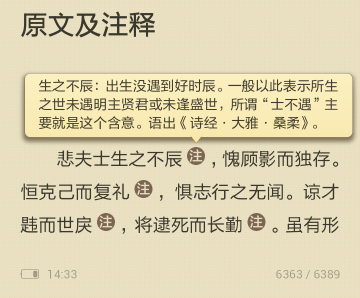

> @Date    : 2020-12-18 16:23:49
>
> @Author  : Lewis Tian (taseikyo@gmail.com)
>
> @Link    : github.com/taseikyo

# 用 pandoc 制作带弹出式注释的 EPUB 和 MOBI 电子书

> 原文：http://fromwiz.com/share/s/2yNneO1LOQap2-bdmA21_AH12-kyXg1YMABU2rGeUT14mwnz

以电子书 [《史记注释》](https://github.com/sadhen/shiji) 的制作为例。

## 利用 Markdown 源文件生成原始的 EPUB 文件

源文件1：shiji.md

```
# 十二本纪 五帝本纪第一
bla bla bla
# 十二本纪 夏本纪第二
bla bla bla
```

源文件2：title.txt

```
---
title: 史记注译
author: 司马迁
language: zh-CN
...
```


然后可以用 `pandoc` 来生成 EPUB 文件，具体命令为 `pandoc shiji.md title.txt -o 
shiji.epub`。这样就生成了带有目录的 EPUB 文件。

EPUB 文件实质上是一个 `zip` 的压缩包。所以可以利用 `unzip` 命令来解压，当然也可以使用文件浏览器中的右键菜单，解压到此处。

解压之后，我们可以看到，使用 `pandoc` 生成的 EPUB 文件每一章实际都是一个 XHTML 文件。

## 制作弹出式注释

对于多看，可以参考：[多看电子书规范扩展开放计划（20140819第四弹）](http://www.miui.com/thread-1960799-1-1.html)。关键信息如下：

```
用户可以通过单击文内脚注的图标，弹出显示脚注内容的窗口。文内注可以支持复杂的内容描述，比如多段落，带有样式的文本等等，具体描述如下：
在需要插入注的位置插入如下代码：
<a class="duokan-footnote" href="#df-1"></a>
在文章的末尾插入如下代码：
<ol class="duokan-footnote-content">
   <li class="duokan-footnote-item" id="df-1"><p>这是一个注释文本。</p></li>
</ol>
注和内容之间使用id链接，通过这样的扩展方式，可以将整个章节的所有文内注内容集中在一个有序列表中，这部分内容不会直接在页面上渲染出来，而是通过应用层的交互来呈现。
```

效果如图所示：



对于 Kindle，我没有直接去看规范，而是参考现有的带弹出式的 MOBI 文件，利用 `Calibre` 转为 EPUB 文件之后参考其组织方式总结的。一个示例如下所示：

```
悲夫士生之不辰<a id="fnref1" href="#fn1"><span><sup>[1]</sup></span></a>，愧顾影而独存。
<p><span><a id="fn1" href="#fnref1"><span>[1]</span></a>生之不辰：出生没遇到好时辰。一般以此表示所生之世未遇明主贤君或未逢盛世，所谓“士不遇”主要就是这个含意。语出《诗经·大雅·桑柔》。</span></p>
```

利用搜索替换操作，将相应的注和内容修正之后，把所有的文件压缩为一个 zip 压缩文件，在把压缩文件的文件名后缀改为 `shiji.epub` 即可。对于 Kindle 原生系统，由于不支持 EPUB，还需要我们利用 `Calibre` 将 EPUB 文件转化为 MOBI 文件。

## 后记

在电子书 [《史记注释》](https://github.com/sadhen/shiji) 的制作中，我使用了 `python3` 和 `pandoc`，自动化所有的小动作。对于整个制作流程有什么不清楚的地方，不妨看一下代码。
