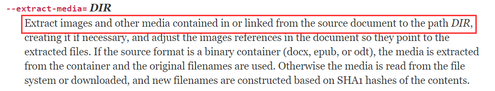
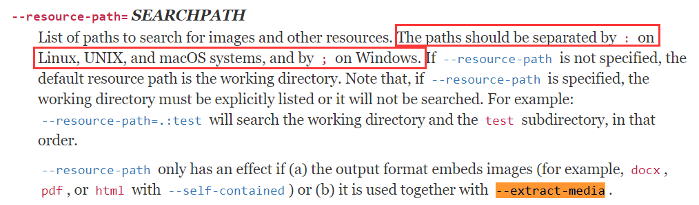
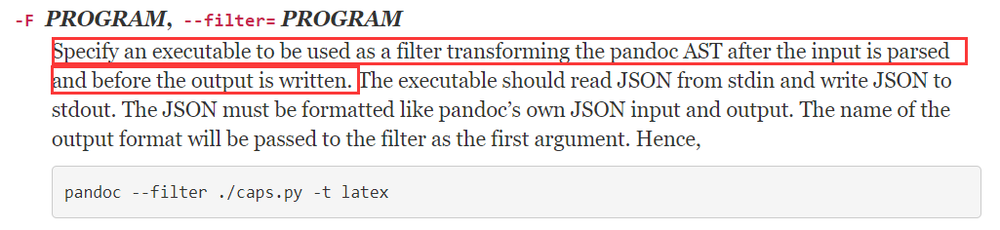

> @Date    : 2021-03-17 09:41:32
>
> @Author  : Lewis Tian (taseikyo@gmail.com)
>
> @Link    : github.com/taseikyo

# pandoc 将 latex 转为 docx

## Table of Contents
- [怎么用 Pandoc 把 Latex 转换成 MS Word 文档](#怎么用-pandoc-把-latex-转换成-ms-word-文档)
	- [第一步：安装](#第一步安装)
	- [第二步：从 Latex 转换到 Word](#第二步从-latex-转换到-word)
		- [数学公式](#数学公式)
		- [文献引用](#文献引用)
		- [文档格式](#文档格式)
		- [交叉引用](#交叉引用)
	- [小结](#小结)
- [Windows 下 pandoc 转换 LaTex 成 Word 最全指令（包含公式、图片、参考文献、交叉引用）](#windows-下-pandoc-转换-latex-成-word-最全指令包含公式图片参考文献交叉引用)
	- [1. pandoc](#1-pandoc)
	- [2. 转换方法](#2-转换方法)
	- [3. 注意](#3-注意)

## 怎么用 Pandoc 把 Latex 转换成 MS Word 文档

> 原文：https://www.jianshu.com/p/dc62b915920e [Micro胖](https://www.jianshu.com/u/f3fdb6d5706a) 2019.02.25 12:02:42

作为一名研究生，我喜欢在 Latex 中写作。它很容易入手，可以很好地处理不同发布者的所有格式要求，具有很好的对引用文献的支持等等。所有这些优势使得在 Latex 中撰写学术文章比在 MS Word 中写作更有乐趣。但是一个缺点是，并非所有合作者都知道如何使用 Latex，比如说我的导师经常希望我用 Word 来撰写论文，因为 Word 中的 “评论” 和“跟踪更改”的功能对于写作方面的协作非常有用。因此，很多时候需要在 Latex 和 MS Word 之间进行转换，而我也经常使用笨办法，那就是手动的重新写一遍 Word 文档，这个过程非常痛苦和耗时。

有一些软件可以完成这项工作，但它们要么是付费软件，要么结果不尽如人意。直到我发现 Pandoc，这是一个很棒的程序，可以在各种标记格式之间进行转换（包括 markdown，latex 和 docx 文档之间）。更重要的是，Pandoc 也是免费的开源软件。

### 第一步：安装

Pandoc 的安装相对容易，并且在 [网页](http://pandoc.org/installing.html) 中提供了针对不同操作系统的详细过程。这里我就不加赘述了。

### 第二步：从 Latex 转换到 Word

我将假设您已准备好一个想要转化成 Word 的 Latex 文件。然后，您需要打开一个 CMD 窗口并指向包含要转换的 Latex 文件的目录。然后我们可以通过以下命令转换文件。

```Bash
pandoc mydoc.tex -o mydoc.docx
```

这个命令就是告诉 Pandoc 将 mydoc.tex 转换为 mydoc.docx。 -o 告诉 Pandoc 我们想要的输出。请注意，我们可以将输出 docx 文件命名为我们想要的任何内容 - 它不需要与输入的 Latex 文档具有相同的名称。

#### 数学公式

Pandoc 可以很好地处理 Latex 方程，所有方程都转换成 Word 里用 Equation Editor 编辑的公式，因此不需要 MathType。

但是，目前没有使用 Equation Editor 对 MS Word 中的公式进行正确编号的好方法，常见的方法是创建一个三列表，将公式放在中间列中，将公式编号放在右列中。如果我们有很多方程式，这在许多学术出版物中通常都都是如此，那么编辑方程式的编号非常耗时。

#### 文献引用

Latex 中的 Citations 可能无法在转换后的 Word 文件中正确显示。我们可以通过 pandoc-citeproc 解决这个问题，这通常是在我们安装 Pandoc 时安装的。我们只需要让 Pandoc 知道参考文件的位置，例如. bib 文件。如果文件与 Latex 文档位于同一文件夹中，我们可以使用以下命令，

```Bash
pandoc mydoc.tex --bibliography=myref.bib -o mydoc.docx
```

#### 文档格式

Pandoc 的另一个不错的功能是，我们可以通过引用 docx 文件指定生成的 docx 文件的样式。例如，如果我们要向 IEEE 提交论文，我们可以从 IEEE 下载 Word 模板，并将其用作参考文件，然后 Pandoc 生成的 docx 文件将具有与 IEEE 模板相同的样式。这可以通过以下命令实现，

```Bash
pandoc mydoc.tex --bibliography=myref.bib --reference-docx=IEEE_template.doc -o mydoc.docx
```

#### 交叉引用

为了处理数字，方程式，表格和交叉引用的编号，有一个名为 [pandoc-crossref](https://github.com/lierdakil/pandoc-crossref) 的文件管理器。我正在使用的电脑是 Windows 操作系统，因此我下载了 GitHub Repo [发布页面](https://github.com/lierdakil/pandoc-crossref/releases/tag/v0.3.4.0c) 上提供的预构建好的. exe 文件。然后我将可执行文件放在 Pandoc 的安装目录中（默认情况下通常在 C 盘中）。

然后我们可以在命令中指定 pandoc-crossref 作为 Pandoc 的 filter，

```Bash
pandoc mydoc.tex --filter pandoc-crossref --bibliography=myref.bib --reference-docx=IEEE_template.doc -o mydoc.docx
```

### 小结

我认为使用 Pandoc 将 Latex 转换为 Word 对于与使用 MS Word 的共同作者的合作来说已经足够了。如果我们想要提交只接受 docx 文件的期刊，Pandoc 也可以节省我们很多时间，我们只需要对生成的 docx 文件进行小的更改，而不是手动重新输入 MS Word 中的整个文件。

## Windows 下 pandoc 转换 LaTex 成 Word 最全指令（包含公式、图片、参考文献、交叉引用）

> 原文：https://blog.csdn.net/qq_27464321/article/details/88853270 [lamesoeur](https://blog.csdn.net/qq_27464321) 2019-03-27 19:31:02

### 1. pandoc

- http://pandoc.org/installing.html
- 支持 Linux，Windows，以及苹果操作系统
- [pandoc 使用手册](https://www.pandoc.org/MANUAL.html)

### 2. 转换方法

- 基础转换命令： `pandoc input.tex -o output.docx`
- 图片的提取：需要同时指定文件搜索目录和图片的目录。
    - `--extract-media=filename` 其中`filename` 是 tex 源文件转换的目的文件的文件名。建议将要提取的图片都存于同一个文件夹下，**图片只支持 jpg，png 等格式**，**对 pdf 不支持**，需要先手动转换成 jpg。
    - `--resource-path=.;path` 其中`.` 表示当前工作目录，`;` 是 windows 系统的分隔符号（Linux,Unix,macOs 用 `:`），`path` 是图片目录的名字，这句表示将在当前工作目录的 path 文件下来搜素图片和其他资源。  
        
- 参考文献的提取： `--bibliography=ref.bib` `ref.bib` 是参考文献文件，放在跟. tex 文件一个目录下
- 交叉引用的提取：`--filter pandoc-crossref` 为了处理数字、方程式、表格和交叉引用的编号，有一个名为 [pandoc-crossref](https://github.com/lierdakil/pandoc-crossref) 的文件管理器。对于 Windows 系统，需要下载 [GitHub Repo 发布页面](https://github.com/lierdakil/pandoc-crossref/releases/tag/v0.3.4.0c) 上提供的预构建好的. exe 文件。然后将可执行文件放在 Pandoc 的安装目录中。**【注意 pandoc-crossref 的版本必须与 pandoc 的版本匹配】**。  
    
- 完整的转换命令：`pandoc input.tex --filter pandoc-crossref --extract-media=output --resource-path=.;path --bibliography=ref.bib -o output.docx`

### 3. 注意

tex 源程序中部分函数可能不支持转换，比如 `\thanks{}` 相关的内容就无法转化，需要先对这部分进行屏蔽，才能转换成功。每次修改源程序 tex 文件后，需要重新编译后才能生效。
