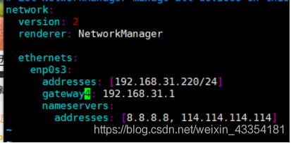
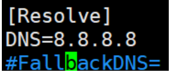

> @Date    : 2021-03-29 10:22:21
>
> @Author  : Lewis Tian (taseikyo@gmail.com)
>
> @Link    : github.com/taseikyo

# Ubuntu 18.04 解决Temporary failure in name resolution DNS 解析问题

> 原文：https://blog.csdn.net/weixin_43354181/article/details/105352203 [vv安的浅唱](https://blog.csdn.net/weixin_43354181) 2020-04-06 22:12:18

事情是这样的，我在 win10 电脑上的 VM VirtualBox 上新装了一个 Ubuntu 18.04 系统，然后设置静态 IP，设置如下：

```Bash
#/etc/network/interfaces
auto lo
iface lo inet loopback

auto enp0s3
iface enp0s3 inet static
address 192.168.31.220
netmask 255.255.255.0
gateway 192.168.31.1
```

设置好以后重启服务，然后发现不能访问互联网了， `ping www.baidu.com` 就报如标题所示错误：

```Bash
Temporary failure in name resolution
```

然后我就去找答案啊，互联网告我这是 DNS 解析的问题，如下 1、2、3、4 点是我查找、用过、并且证实无效的方法。

## 1、/etc/network/interfaces

这个方法直接把 nameserver 这个参数加在 interfaces 最后一行。

**证实无效！**

因为这个地方不支持配置 nameserver。

## 2、/etc/resolv.conf

在这个文件很后面 加上 nameserver 参数，重启网络相关服务，没问题，静态 IP 地址有了，也能访问互联网了。

**但是，** 凡是就怕但是，一旦把机器重启，也就是 **sudo reboot** 操作，这个文件就会恢复原始状态，也就是说我们重启前加的 nameserver 参数就没有了。

这种方法每次开机都要自己设置，肯定不行，pass 掉。

**判定无效！！**

## 3、/run/systemd/resolve/stub-resolv.conf

当我们在 /etc 文件夹下，使用如下命令：

```Bash
ls -l | grep resolv.conf
```

也就是查出 resolv.conf 的具体信息可以发现，这个文件夹其实是个软链接，链接到哪儿呢？

**/run/systemd/resolve/stub-resolv.conf**

查看这个文件，发现这里面有 nameserver，但是不管了，我把 nameserver 8.8.8.8 加在了最后一行，忘了是无效还是重启之后无效，反正就是 **无效！！！**

## 4、/etc/netplan

然后我又去找啊，网上说，在 18.0.4 里面，**netplan** 这玩意儿 接管了网络服务，然后又屁颠儿屁颠儿地跑去这个文件夹下加了这些东西。（这个文件夹下只有 **01-network-manager-all.yaml** 这一个文件）



按照网上的方法，大致配置如上所示，然而，并卵，

**无效！！！！**

## 5、解决之道

最后的最后，王子和公主会过上没羞没臊的生活。

我也解决了这个问题，解决方法就是编辑 **/etc/systemd/resolved.conf** 这个文件，把 DNS 那一行解开注释，如下图所示：



重启机器，有静态 IP 地址，也能访问互联网了。

牛逼！！！！！！！

解决措施链接：https://www.cnblogs.com/tinkone/p/10498524.html

我是个感恩的人，奉上来源链接。（狗头
