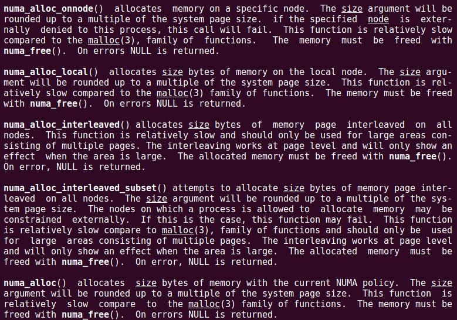

> @Date    : 2021-03-23 10:06:38
>
> @Author  : Lewis Tian (taseikyo@gmail.com)
>
> @Link    : github.com/taseikyo

# 使用 libnuma + jemalloc 将不同数据分配在不同的 NUMA node 上

> 原文：https://zhou-yuxin.github.io/articles/2019/%E4%BD%BF%E7%94%A8libnuma%20+%20jemalloc%E5%B0%86%E4%B8%8D%E5%90%8C%E6%95%B0%E6%8D%AE%E5%88%86%E9%85%8D%E5%9C%A8%E4%B8%8D%E5%90%8C%E7%9A%84NUMA%20node%E4%B8%8A/index.html zhou-yuxin

之前基于 DAX（Direct Access）模式的 NVM 改了一版 Redis，基本思想就是在 pmem-aware filesystem 上 mmap 一个很大的文件，作为内存空间。然后把 sds 和 ziplist 这两个占用大量空间、但是访问比较顺序的数据结构分配在 NVM 上。但是这样做有一个比较大的问题，就是不能自然地支持 Copy on Write（以下简称 COW）。这是因为，既然要使用 DAX，那么 mmap 必须是共享映射，而既然是共享映射，那么 fork() 出来的子进程可以实时看到文件内容的改动。于是 RDB、AOF rewriting 和 replication 所依赖的 COW 特性就被破坏了。尽管我们后来实现了用户态的 COW 来补救，但是解决方案终究不完美。但是，为了支持 PBA（Pointer based AOF，在 AOF 中只记录 sds 在 NVM 上的地址，而不记录实际内容，从而大幅缩短 AOF 文件长度，提升性能），这是唯一的方案。

后来，某互联网巨头 T，对于持久化并不在意，但是对于内存比例很敏感。什么是内存比例呢？比如说，一条 SET 命令，创建了一个键值对。该键值对的 sds 可以放在 NVM 上，但是其他的数据结构（比如 dictEntry）必须放在 DRAM 上，以利用其 COW 的特性。这些额外的数据结构的大小基本是固定，假设是 64 字节。那么，如果值很大，比如有 1KB，那么 DRAM 和 NVM 的使用比例是 64 : 1024 = 1 : 16，于是，可以买大量的 NVM 和少量的 DRAM，从而大幅降低硬件成本。但是，如果值比较小，比如都是写 64 字节左右的短字符串，那么 DRAM 和 NVM 的使用比例是 1 : 1，此时 NVM 的价格优势不太明显。T 公司遇到的情况就是后者。

为此，我们考虑针对 volatile 场景（就是把 redis 当作纯粹的缓存使用，不需要 RDB 和 AOF 等持久化能力）做一些优化。基本思路是这样的：首先，启用 NVM as NUMA node 特性，即把 NVM 作为一个单独的 NUMA 节点，该节点上有大量的内存空间（其实都是 NVM 硬件），但是没有 CPU 核心。之后，让 redis 里面所有的数据结构的内存分配来自 DRAM 的 NUMA 节点，而 sds 和 ziplist 来自 NVM 的内存节点。这样的好处是，sds 和 ziplist 所占用的内存依旧来自 NVM，其他数据结构依旧在 DRAM 上，但是，NVM 也天然地支持 COW 了，于是如果 DRAM 被用完，也可以把数据结构放到 NVM 上（最多是性能问题，但没有功能问题）。

如何让 kernel 把 NVM 当作 NUMA 节点的问题我就略过了，因为这个不是重点。重点在于 libnuma 的坑。首先，我们需要让 jemalloc 管理不同的内存，可以参考《[libmemkind 探究（一）—— 让 jemalloc 管理指定的空间](https://zhou-yuxin.github.io/articles/2018/libmemkind%E6%8E%A2%E7%A9%B6%EF%BC%88%E4%B8%80%EF%BC%89%E2%80%94%E2%80%94%E8%AE%A9jemalloc%E7%AE%A1%E7%90%86%E6%8C%87%E5%AE%9A%E7%9A%84%E7%A9%BA%E9%97%B4/index.html)》。为什么需要 jemalloc 呢？因为 libnuma 是以页为单位分配内存的，libnuma 分得的内存需要用 jemalloc 来细分。不过，由于 jemalloc 已经升级到了 5.1.0 版本了，chunk 的概念被 extent 取代了，所以代码也要变了。这里给出新的 test.c：

```C
#include <stdio.h>
#include <jemalloc.h>

void* nvm_extent_alloc(extent_hooks_t* extent_hooks,
                       void* new_addr, size_t size, size_t alignment, bool* zero,
                       bool* commit, unsigned arena_index) {
	// TODO: allocate from NVM by libnuma
	return NULL;
}

bool nvm_extent_dalloc(extent_hooks_t* extent_hooks,
                       void* addr, size_t size, bool committed, unsigned arena_index) {
	// TODO: free to NVM by libnuma
	return false;
}

void nvm_extent_destroy(extent_hooks_t* extent_hooks,
                        void* addr, size_t size, bool committed, unsigned arena_index) {
}

bool nvm_extent_commit(extent_hooks_t* extent_hooks,
                       void* addr, size_t size, size_t offset, size_t length, unsigned arena_index) {
	return false;
}

bool nvm_extent_decommit(extent_hooks_t* extent_hooks,
                         void* addr, size_t size, size_t offset, size_t length, unsigned arena_index) {
	return true;
}

bool nvm_extent_purge(extent_hooks_t* extent_hooks,
                      void* addr, size_t size, size_t offset, size_t length, unsigned arena_index) {
	return true;
}

bool nvm_extent_split(extent_hooks_t *extent_hooks,
                      void *addr, size_t size, size_t size_a, size_t size_b, bool committed, unsigned arena_index) {
	return false;
}

bool nvm_extent_merge(extent_hooks_t* extent_hooks,
                      void *addr_a, size_t size_a, void *addr_b, size_t size_b, bool committed, unsigned arena_index) {
	return false;
}

extent_hooks_t nvm_extent_hooks = {
	.alloc = nvm_extent_alloc,
	.dalloc = nvm_extent_dalloc,
	.destroy = nvm_extent_destroy,
	.commit = nvm_extent_commit,
	.decommit = nvm_extent_decommit,
	.purge_lazy = nvm_extent_purge,
	.purge_forced = nvm_extent_purge,
	.split = nvm_extent_split,
	.merge = nvm_extent_merge,
};

int main() {
	unsigned nvm_arena_index;
	size_t unsigned_size = sizeof(unsigned);
	if (je_mallctl("arenas.create", (void*)&nvm_arena_index, &unsigned_size, NULL, 0)) {
		fprintf(stderr, "je_mallctl('arenas.create', ...) failed!\n");
		exit(1);
	}
	char cmd[64];
	sprintf(cmd, "arena.%u.extent_hooks", nvm_arena_index);
	extent_hooks_t* phooks = &nvm_extent_hooks;
	if (je_mallctl(cmd, NULL, NULL, (void*)&phooks, sizeof(extent_hooks_t*))) {
		fprintf(stderr, "je_mallctl('%s', ...) failed!\n", cmd);
		exit(1);
	}
	void* dram_ptr = je_malloc(128);
	void* nvm_ptr = je_mallocx(128, MALLOCX_ARENA(nvm_arena_index) | MALLOCX_TCACHE_NONE);
	printf("dram_ptr: %p, nvm_ptr: %p\n", dram_ptr, nvm_ptr);
	return 0;
}
```

可见，单独为 NVM 创建一个 arena 之后，DRAM 的内存分配依旧使用默认方式，而 NVM 内存分配则指定新建的 arena。

现在，需要使用 libnuma 为该新建的 arena 提供底层的支持。假设当前系统有两个 NUMA node，node 0 是 DRAM，node 1 是 NVM。那么完善后的代码如下：

```C
#include <numa.h>
#include <assert.h>
#include <stdio.h>
#include <jemalloc.h>

#define PAGE_SIZE   4096

int nvm_node = -1;

void* nvm_extent_alloc(extent_hooks_t* extent_hooks,
                       void* new_addr, size_t size, size_t alignment, bool* zero,
                       bool* commit, unsigned arena_index) {
	assert(size % PAGE_SIZE == 0);
	if (new_addr)
		return NULL;
	assert(nvm_node >= 0);
	void* mem = numa_alloc_onnode(size, nvm_node);
	if (!mem)
		return NULL;
	(*zero) = false;
	(*commit) = true;
	return mem;
}

bool nvm_extent_dalloc(extent_hooks_t* extent_hooks,
                       void* addr, size_t size, bool committed, unsigned arena_index) {
	assert((size_t)addr % PAGE_SIZE == 0);
	assert(size % PAGE_SIZE == 0);
	numa_free(addr, size);
	return false;
}

void nvm_extent_destroy(extent_hooks_t* extent_hooks,
                        void* addr, size_t size, bool committed, unsigned arena_index) {
}

bool nvm_extent_commit(extent_hooks_t* extent_hooks,
                       void* addr, size_t size, size_t offset, size_t length, unsigned arena_index) {
	return false;
}

bool nvm_extent_decommit(extent_hooks_t* extent_hooks,
                         void* addr, size_t size, size_t offset, size_t length, unsigned arena_index) {
	return true;
}

bool nvm_extent_purge(extent_hooks_t* extent_hooks,
                      void* addr, size_t size, size_t offset, size_t length, unsigned arena_index) {
	return true;
}

bool nvm_extent_split(extent_hooks_t *extent_hooks,
                      void *addr, size_t size, size_t size_a, size_t size_b, bool committed, unsigned arena_index) {
	return false;
}

bool nvm_extent_merge(extent_hooks_t* extent_hooks,
                      void *addr_a, size_t size_a, void *addr_b, size_t size_b, bool committed, unsigned arena_index) {
	return false;
}

extent_hooks_t nvm_extent_hooks = {
	.alloc = nvm_extent_alloc,
	.dalloc = nvm_extent_dalloc,
	.destroy = nvm_extent_destroy,
	.commit = nvm_extent_commit,
	.decommit = nvm_extent_decommit,
	.purge_lazy = nvm_extent_purge,
	.purge_forced = nvm_extent_purge,
	.split = nvm_extent_split,
	.merge = nvm_extent_merge,
};

int main() {
	nvm_node = 1;
	unsigned nvm_arena_index;
	size_t unsigned_size = sizeof(unsigned);
	if (je_mallctl("arenas.create", (void*)&nvm_arena_index, &unsigned_size, NULL, 0)) {
		fprintf(stderr, "je_mallctl('arenas.create', ...) failed!\n");
		exit(1);
	}
	char cmd[64];
	sprintf(cmd, "arena.%u.extent_hooks", nvm_arena_index);
	extent_hooks_t* phooks = &nvm_extent_hooks;
	if (je_mallctl(cmd, NULL, NULL, (void*)&phooks, sizeof(extent_hooks_t*))) {
		fprintf(stderr, "je_mallctl('%s', ...) failed!\n", cmd);
		exit(1);
	}
	void* dram_ptr = je_malloc(128);
	printf("dram_ptr: %p\n", dram_ptr);
	void* nvm_ptr = je_mallocx(128, MALLOCX_ARENA(nvm_arena_index) | MALLOCX_TCACHE_NONE);
	printf("nvm_ptr: %p\n", nvm_ptr);
	return 0;
}
```

通过 numa_alloc_onnode() 函数，可以指定从哪个 NUMA node 分配内存。一开始工作得很正常，直到遇到了 NVM 节点内存不够用的情况。我们希望的是，sds 和 ziplist 优先从 NVM 分，但是如果 NVM 用完了，则从其他节点分。换言之，我们希望

```C
void* numa_alloc_onnode(size_t size, int node);
```

中的 node 是一个 preference 而不是 command。然而，该函数确实是把 node 当作一个命令而非建议，当 NVM 节点内存不够时，直接触发了 kernel 的 OOM，导致进程被杀死。为此，我开始寻找解决方案。中间的各种弯路就跳过，就说最后的思路历程吧。

```C
man numa
```

之后，可以 `numa_alloc_*` 函数总共就只有 5 个，分别为：

```C
void *numa_alloc_onnode(size_t size, int node);
void *numa_alloc_local(size_t size);
void *numa_alloc_interleaved(size_t size);
void *numa_alloc_interleaved_subset(size_t size, struct bitmask *nodemask);
void *numa_alloc(size_t size);
```

各自的介绍：



首先，numa_alloc_onnode() 直接 pass 掉，因为已经验证它把 node 当作命令而不是建议。numa_alloc_local() 也明显不可以，因为 NVM 的节点是 Memory-Only 的虚拟节点，没有 CPU 核心，因此使用 numa_alloc_local() 分配的内存肯定是 DRAM。numa_alloc_interleaved() 会在当前进程被允许的节点之间交替地分配内存页，那么在内存充足的情况下，就有一半概率分配 DRAM，一半概率分配 NVM，也不符合要求。numa_alloc() 也无法控制分配的内存来自哪个节点。那么看来只有 numa_alloc_interleaved_subset()。该函数会在 nodemask 指定的那些节点中交替地分配内存。那么，如果 nodemask 中只有 NVM 节点呢？那么该函数理所当然就只会在 NVM 节点上分配内存～而且经过验证，如同除去 numa_alloc_onnode() 之外的所有 numa_alloc_* 函数一样，numa_alloc_interleaved_subset() 在指定的节点上分配失败后，会转到其他节点去分配。这行为就是我想要的！

于是，最后的代码如下：

```C
#include <numa.h>
#include <assert.h>
#include <stdio.h>
#include <jemalloc.h>

#define PAGE_SIZE   4096

struct bitmask* nodemask = NULL;

void* nvm_extent_alloc(extent_hooks_t* extent_hooks,
                       void* new_addr, size_t size, size_t alignment, bool* zero,
                       bool* commit, unsigned arena_index) {
	assert(size % PAGE_SIZE == 0);
	if (new_addr)
		return NULL;
	assert(nodemask);
	void* mem = numa_alloc_interleaved_subset(size, nodemask);
	if (!mem)
		return NULL;
	(*zero) = false;
	(*commit) = true;
	return mem;
}

bool nvm_extent_dalloc(extent_hooks_t* extent_hooks,
                       void* addr, size_t size, bool committed, unsigned arena_index) {
	assert((size_t)addr % PAGE_SIZE == 0);
	assert(size % PAGE_SIZE == 0);
	numa_free(addr, size);
	return false;
}

void nvm_extent_destroy(extent_hooks_t* extent_hooks,
                        void* addr, size_t size, bool committed, unsigned arena_index) {
}

bool nvm_extent_commit(extent_hooks_t* extent_hooks,
                       void* addr, size_t size, size_t offset, size_t length, unsigned arena_index) {
	return false;
}

bool nvm_extent_decommit(extent_hooks_t* extent_hooks,
                         void* addr, size_t size, size_t offset, size_t length, unsigned arena_index) {
	return true;
}

bool nvm_extent_purge(extent_hooks_t* extent_hooks,
                      void* addr, size_t size, size_t offset, size_t length, unsigned arena_index) {
	return true;
}

bool nvm_extent_split(extent_hooks_t *extent_hooks,
                      void *addr, size_t size, size_t size_a, size_t size_b, bool committed, unsigned arena_index) {
	return false;
}

bool nvm_extent_merge(extent_hooks_t* extent_hooks,
                      void *addr_a, size_t size_a, void *addr_b, size_t size_b, bool committed, unsigned arena_index) {
	return false;
}

extent_hooks_t nvm_extent_hooks = {
	.alloc = nvm_extent_alloc,
	.dalloc = nvm_extent_dalloc,
	.destroy = nvm_extent_destroy,
	.commit = nvm_extent_commit,
	.decommit = nvm_extent_decommit,
	.purge_lazy = nvm_extent_purge,
	.purge_forced = nvm_extent_purge,
	.split = nvm_extent_split,
	.merge = nvm_extent_merge,
};

int main() {
	nodemask = numa_parse_nodestring("1");
	unsigned nvm_arena_index;
	size_t unsigned_size = sizeof(unsigned);
	if (je_mallctl("arenas.create", (void*)&nvm_arena_index, &unsigned_size, NULL, 0)) {
		fprintf(stderr, "je_mallctl('arenas.create', ...) failed!\n");
		exit(1);
	}
	char cmd[64];
	sprintf(cmd, "arena.%u.extent_hooks", nvm_arena_index);
	extent_hooks_t* phooks = &nvm_extent_hooks;
	if (je_mallctl(cmd, NULL, NULL, (void*)&phooks, sizeof(extent_hooks_t*))) {
		fprintf(stderr, "je_mallctl('%s', ...) failed!\n", cmd);
		exit(1);
	}
	void* dram_ptr = je_malloc(128);
	printf("dram_ptr: %p\n", dram_ptr);
	void* nvm_ptr = je_mallocx(128, MALLOCX_ARENA(nvm_arena_index) | MALLOCX_TCACHE_NONE);
	printf("nvm_ptr: %p\n", nvm_ptr);
	return 0;
}
```

于是，

```C
je_mallocx(128, MALLOCX_ARENA(nvm_arena_index) | MALLOCX_TCACHE_NONE);
```

会优先在 node 1 上分配，node 1 分配失败会在其他节点上分配～
