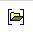

> @Date    : 2021-04-14 16:55:54
>
> @Author  : Lewis Tian (taseikyo@gmail.com)
>
> @Link    : github.com/taseikyo

# bib+windows+word=bibtex4word 插件使用方法

> 原文：https://www.cnblogs.com/PiaYie/p/14457485.html [PiaYie](https://home.cnblogs.com/u/PiaYie) 2021-03-10 20:32

## Table of Contents

- [写在前面](#写在前面)
- [下载 bibtex4word](#下载-bibtex4word)
- [添加用户变量](#添加用户变量)
- [获取引文 bib](#获取引文-bib)
- [set bibtex4word style](#set-bibtex4word-style)
- [使用 Bibtex4Word](#使用-bibtex4word)
	- [导入数据库](#导入数据库)
	- [设置 bibtex4word 版式](#设置-bibtex4word-版式)
	- [添加 citation](#添加-citation)
	- [生成文后引文列表](#生成文后引文列表)

访问官网：http://www.ee.ic.ac.uk/hp/staff/dmb/perl/index.html

## 写在前面

首先需要确定电脑上已经装好 texlive，包含了 bibtex.exe

## 下载 bibtex4word

http://www.ee.ic.ac.uk/hp/staff/dmb/perl/bibtex4word.zip

即官网的 bibtex4word.zip 文件。下载后解压在合适的地方，将其中的 bibtex4word.dot 拷贝到 "%APPDATA%/Microsoft/Word/STARTUP" 目录下

## 添加用户变量

需要添加两个用户变量

变量名 BIB_EXE

变量值 `D:/Program Files (x86)/TexliveRoot/texlive/2020/bin/win32/bibtex.exe`

变量名 OPENOUT_ANY

变量值 r

添加完后，关闭 word，重新打开，就会发现，在工具栏中点击加载项，就有我们想要的工具了!

在前面解压的 bibtex4word.zip 文件中，有文件 Test4w.doc，内容是官网使用教程。

## 获取引文 bib

方法诸多，例在 [dblp](https://dblp.uni-trier.de) 中，点击文章左侧下载 button，选择 BibTeX 就可以获取很详细的引文信息

## set bibtex4word style

还有很重要的一步，定义 bibtex4word 在 word 中，使用的风格，即版式。

Choosing a BibTeX Style：纯英文引用请查看 http://www.ee.ic.ac.uk/hp/staff/dmb/perl/index.html 说明

但是很多时候，我们写个中文报告材料什么的，中英混用是很正常的。首先去下载一个国风 style。

增加参考文献样式 bst 文件。如 [GBT7714-2005.bst](https://github.com/Haixing-Hu/GBT7714-2005-BibTeX-Style)

下载后，拷入 "D:/Program Files (x86)/TexliveRoot/texlive/2020/texmf-dist/bibtex/bst/gbt7714" 文件下。

打开 TexLive command-line（在开始程序中即可找到）

输入 texhash 则会刷新 texlive 文件夹

```Bash
Microsoft Windows [版本 10.0.18363.1379]
(c) 2019 Microsoft Corporation。保留所有权利。

C:\Users\user>texhash
texhash: Updating D:/Program Files (x86)/TexliveRoot/texlive/texmf-local/ls-R...
texhash: Updated D:/Program Files (x86)/TexliveRoot/texlive/texmf-local/ls-R.
texhash: Updating D:/Program Files (x86)/TexliveRoot/texlive/2020/texmf-config/ls-R...
texhash: Updated D:/Program Files (x86)/TexliveRoot/texlive/2020/texmf-config/ls-R.
texhash: Updating D:/Program Files (x86)/TexliveRoot/texlive/2020/texmf-var/ls-R...
texhash: Updated D:/Program Files (x86)/TexliveRoot/texlive/2020/texmf-var/ls-R.
texhash: Updating D:/Program Files (x86)/TexliveRoot/texlive/2020/texmf-dist/ls-R...
texhash: Updated D:/Program Files (x86)/TexliveRoot/texlive/2020/texmf-dist/ls-R.
texhash: Done.
```

排版时参考文献样式可选 **GBT7714-2005/^/nsch**

- n，表示强制文后文献以数字顺序排列，不管选用的样式文件是著者年还是顺序方式的；
- s，表示 "sort"，将顺序引用的标记[2,4,1,3] 整理为[1,2,3,4]；
- c，表示 "compress"，将顺序引用的标记[1,2,3,4] 压缩为[1-4]；
- h，表示 "hyperlink"(如：plain/h；acm/h)，将引用标记与文后文献的对应条目之间建立超链接关系，按住"ctrl" 键用鼠标左击标记即可跳转至对应的文献条目，返回则是按住 "alt" 键后按一下方向键中的 "left" 键即可；
- ^，表示上标引用方式，即 $^{[4]}$ 样式；
- [，表示引用标记采用方括号样式，例如 [4-9];
- (，表示引用标记采用圆括号样式，例如 (Smith, 2000);

## 使用 Bibtex4Word

### 导入数据库

选择导入 bib 文件，reference.bib

bib 数据库的编码要和选用的 bst 文件保持一致，若选择的是 GBK 编码形式的 bst 文件，则 bib 数据库也必须是 GBK 编码的。

### 设置 bibtex4word 版式

点击图标在输入框中填入 "GBT7714-2005/^/nsch"

###  添加 citation

在合适的位置，贴入 bib 文件中的关键词 

### 生成文后引文列表

点击即可

建议先用一个测试文件熟悉操作
