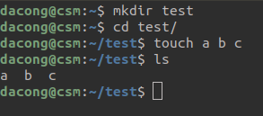
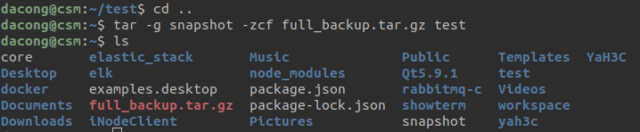
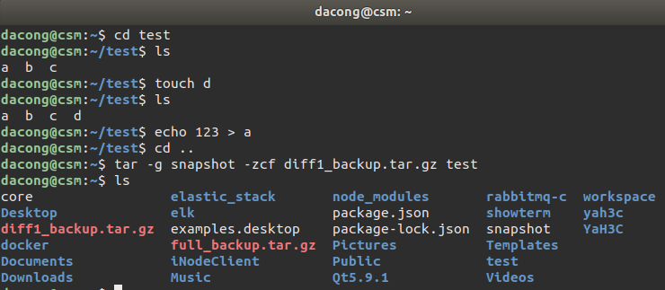
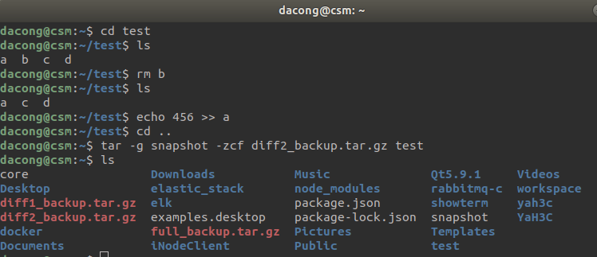
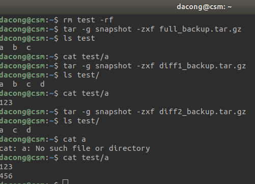

> @Date    : 2021-04-09 15:38:23
>
> @Author  : Lewis Tian (taseikyo@gmail.com)
>
> @Link    : github.com/taseikyo

# 使用 tar 进行文件夹的差异备份、还原

> 原文：https://blog.csdn.net/csm201314/article/details/79903454 [csm201314](https://blog.csdn.net/csm201314) 2018-04-11 21:29:44

### 首先，建立测试文件夹和测试文件

这里创建了一个 test 文件夹，在 test 文件夹中创建了 a，b，c 三个文件作为测试数据文件。

### 然后，执行一次全备份

这里进行一次全备份，备份指令格式为：
 
`tar -g 记录文件名 -zcf 压缩得到的文件名称 目标文件夹`

记录文件如果不存在，会自动创建，里边记录的是关于文件夹中数据的信息，还原时需要用到。
 
如图，我们在主目录生成了一个记录文件 **snapshot** 和一个全备份压缩文件 **full_backup.tar.gz**

### 新增一个数据文件, 并修改一个数据文件，然后进行一次差异备份

在 test 文件夹中生成新测试数据文件 d，同时修改 a 的内容，然后进行一次差异备份，**做差异备份时选定的记录文件需要跟之前全备份时的记录文件相同**，否则会进行一次重新的全备份。差异备份得到 **diff1_backup.tar.gz**

### 删除一个数据文件, 并再次修改一个数据文件，然后再进行一次差异备份

在 test 文件夹中删除测试数据文件 b，同时再次修改 a 的内容，然后再进行一次差异备份，得到备份文件 **diff2_backup.tar.gz**

### 删除 test 文件夹，利用备份进行还原

首先删除文件夹，然后依照刚才生成备份的顺序依次还原备份（先还原全备份，再还原差异备份），备份指令格式如下：

`tar -g 记录文件名 -zxf 对应压缩文件`

这里再强调一遍，**一定要加 -g 参数，-g 后边是记录文件**，如果不加的话，会导致仅仅已删除的文件在还原后不会删除，这里可理解为第二份差异备份前删除文件文件 b 的操作没有记录，导致备份还原后的 test 文件夹中再次出现 b，这当然不是我们需要的，只是类似于增量备份（我之前在百度搜到的文章就是没加 - g 参数，导致我一度以为 tar 指令无法进行差异备份）。

在每次恢复备份时，我也列出 test 中文件的变化，可以看出，的确是一步步还原我们对文件夹的操作。
