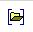
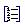

> @Date    : 2021-04-12 17:39:02
>
> @Author  : Lewis Tian (taseikyo@gmail.com)
>
> @Link    : github.com/taseikyo

# Word 中使用 bib 管理参考文献

> 原文地址：https://www.scholat.com/vpost.html?pid=72303 2018-02-22 16:52:43 [黄可坤](https://www.scholat.com/huangkekun)

在 Latex 中写论文时，参考文献一般用 bib 文件统一管理，能自动维护正文中的引用编号和参考文献列表的格式，非常方便。

那在 Word 中写论文或者申请书时，有没有像 tex 那样的文献管理方式呢？

我在网上找了一下，发现是有的，于是把相关的软件和方法整理如下：

## 一、工具准备：

1. MiKTeX 核心，如果已经装个 Tex 软件，比如 CTeX 就不用装了。没有的话可以在这里下载 CTex 安装 [http://www.ctex.org/CTeXDownload/](http://www.ctex.org/CTeXDownload/)。
2.Bibtex4Word 模板，可在这里下载 ([http://www.scholat.com/downloadPostAtt.html?fileid=6610&user=huangkekun](http://www.scholat.com/downloadPostAtt.html?fileid=6610&user=huangkekun))。解压后将文件夹中的 "bibtex4word.dot" 文件，复制粘贴至 Word 的启动文件夹。Win8\Win10 系统所在路径是："%APPDATA%/Microsoft/Word/STARTUP"
3. 准备好你要使用的所有论文的 bib 引用格式（可以在百度学术或者 google 学术搜索论文题目后，直接下载论文 bib，用记事本打开便可看到，格式如下），并全部放在一个 .bib 文件，当然也可以在这个文件里随时增加参考文献。

## 二、使用方法：

1. 正确复制 “bibtex4word.dot” 文件后，重新启动 word，在加载项页面可以发现 Bibtex4Word 的工具条，点击打开图标，选择你的 bib 文件。

  
    
2. 用记事本打开 bib 文件，找到你要插入的参考文献，把如 “Huang2017Learning” 的关键字复制。回到 Word 界面，把光标放在你想要插入类似 [1] 的数字标号处，点击 Bibtex4Word 工具条中的 "+" 图标 "insert citation"，在弹出的框中粘贴或输入刚才的字符串“Huang2017Learning”，确定。
    
  
    
3. 最后将光标移到你论文的参考文献那一章节，点击 "+" 右边的 "insert/update bib"，便可自动生成文献的相关信息，而步骤 2 中的代码串也变成了对应的数字标号。首次点击 "insert/update bib" 时的光标位置很重要，以后都会自动在那里更新参考文献列表。
