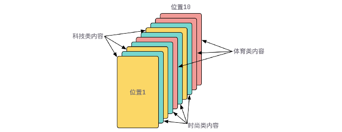

> @Date    : 2022-05-28 14:16:06
>
> @Author  : Lewis Tian (taseikyo@gmail.com)
>
> @Link    : github.com/taseikyo

# 设计模式在 Go 语言中的应用

> 原文：[设计模式在 Go 语言中的应用](https://medium.com/@dgqypl/%E8%AE%BE%E8%AE%A1%E6%A8%A1%E5%BC%8F%E5%9C%A8go%E8%AF%AD%E8%A8%80%E4%B8%AD%E7%9A%84%E5%BA%94%E7%94%A8-f9478039a1b4)
>
> 作者：[Mew151](https://medium.com/@dgqypl) 2022-03-24

> 很多同学都或多或少看过一些设计模式的内容，但是却苦于在日常的 CRUD 式的业务开发中应用不到这些 “高大尚” 的知识。


很多同学都或多或少看过一些设计模式的内容，但是却苦于在日常的 CRUD 式的业务开发中应用不到这些 “高大尚” 的知识。其实并不然，即使是在平时的业务开发过程中，只要你善于发现，仍然有一些实际的场景会用到设计模式，本文基于笔者经历的实际业务场景，使用 Go 语言来说明如何将设计模式应用到日常开发中。

## 场景一

假设你的部门正在创建一个爬虫系统，这个系统对支持的平台提供统一对外的获取单篇内容数据的 API 接口，开发人员则需要在这个系统中不断的进行各平台的适配开发，使系统的 API 接口能支持越来越多的平台。

经过调研后，发现获取各平台单篇内容数据的方式，大体可分为三类：

1. 通过解析 html 页面
2. 调用平台开放的 API 接口
3. 从 App 抓包得到接口

接口的主干代码最直观的写法会是下面这种形式：

```Go
type PlatformAHandler struct {
}

func (*PlatformAHandler) FetchByWebpage(url string) (*SingleArticle, error) {
    // do platformA logic
}

type PlatformBHandler struct {
}

func (*PlatformBHandler) FetchByWebApi(url string) (*SingleArticle, error) {
    // do platformB logic
}

type SingleArticleGrabService struct {
}

var platformAHandler = &PlatformAHandler{}
var platformBHandler = &PlatformBHandler{}

func (*SingleArticleGrabService) Grab(url string) (*SingleArticle, error) {
    // parse url and find mapping platform
    ...
    if platform == "PlatformA" {
        platformAHandler.FetchByWebpage(url)
    } else if platform == "PlatformB" {
        platformBHandler.FetchByWebApi(url)
    }
    ...
}
```


当开发人员需要新增一个平台的适配，就需要在上面的代码中新加一条 `else if`，那么随着系统支持的平台越来越多，主干代码就充斥着大量的分支判断。😅

那怎么用设计模式来解决这事儿呢？其实这是一个很典型的工厂模式的应用场景。基于开闭原则（Open Closed Principle），我们希望在新增一个平台的适配时，主干代码要保持稳定，只要在某个扩展点将新增的平台注入进去即可。于是改动后的代码如下：

```Go
// 定义三种获取数据方式的接口

type WebpageWayGrab interface {
    FetchByWebpage(url string) (*SingleArticle, error)
}

type WebApiWayGrab interface {
    FetchByWebApi(url string) (*SingleArticle, error)
}

type AppApiWayGrab interface {
    FetchByAppApi(url string) (*SingleArticle, error)
}

// service持有这三种方式的map，key是platformId，value是具体某个平台的实现类

type SingleArticleGrabService struct {
    webpageWayGrabPlatforms map[string]interface{}
    webApiGrabPlatforms     map[string]interface{}
    appApiWayGrabPlatforms  map[string]interface{}
}

func NewSingleArticleGrabService() *SingleArticleGrabService {
    var webpageWayGrabPlatforms = make(map[string]interface{})
    var webApiGrabPlatforms = make(map[string]interface{})
    var appApiWayGrabPlatforms = make(map[string]interface{})
    webpageWayGrabPlatforms["PlatformA"] = platformAHandler
    webApiGrabPlatforms["PlatformB"] = platformBHandler
    // 每新增一个平台，就加一行映射关系
    ...
    return &SingleArticleGrabService{
        webpageWayGrabPlatforms: webpageWayGrabPlatforms,
        webApiGrabPlatforms:     webApiGrabPlatforms,
        appApiWayGrabPlatforms:  appApiWayGrabPlatforms,
    }
}

func (s *SingleArticleGrabService) Grab(url string) (*SingleArticle, error) {
    // parse url and find mapping platform
    ...
    for k, v := range s.webpageWayGrabPlatforms {
        if platform == k {
            v.FetchByWebpage(url)
        }
    }

    for k, v := range s.webApiGrabPlatforms {
        if platform == k {
            v.FetchByWebApi(url)
        }
    }

    for k, v := range s.appApiWayGrabPlatforms {
        if platform == k {
            v.FetchByAppApi(url)
        }
    }
}

var platformAHandler = &PlatformAHandler{}
var platformBHandler = &PlatformBHandler{}

type PlatformAHandler struct {
}

func (*PlatformAHandler) FetchByWebpage(url string) (*SingleArticle, error) {
    // do platformA logic
}

type PlatformBHandler struct {
}

func (*PlatformBHandler) FetchByWebApi(url string) (*SingleArticle, error) {
    // do platformB logic
}
```

这样，每当新增一个平台的适配，在适配逻辑类开发完成之后，只需要在 NewSingleArticleGrabService 函数中新增一行映射关系即可完成快速接入。主干代码完全不用改动，去除冗长的 `if else` 分支同时，也避免在改动主干代码时不小心引入 bug 的情况。

按理说使用工厂模式将该业务场景的代码重构到此就基本结束了，但实际上你会发现上面的代码还有些地方有点儿啰嗦，比如 SingleArticleGrabService 需要持有三种方式的 map，而这些 map 的定义都一样；再比如在 Grab 方法中，遍历三个 map 的代码几乎是一模一样。因此我们再来看看，怎样优化一波代码，让写法更优雅一些。

首先，抽象出一个接口，来定义在每个 `for` 循环中共同的行为：一个是判断某个 map 中是否存在某个平台，另外就是当存在时，取出该平台的实现类。该接口的定义如下：

```Go
type GrabWaySelector interface {
    Select(key string) interface{}
    Contains(key string) bool
}
```

再定义一个通用的结构体来实现该接口，这样，对于三种方式的 map，就可以复用这个通用的结构体：

```Go
type GrabWayContainer struct {
    platforms map[string]interface{}
}

func NewGrabWayContainer(m map[string]interface{}) GrabWaySelector {
    return &GrabWayContainer{platforms: m}
}

func (w *GrabWayContainer) Select(key string) interface{} {
    return w.platforms[key]
}

func (w *GrabWayContainer) Contains(key string) bool {
    return w.platforms[key] != nil
}
```

接下来我们来看看 SingleArticleGrabService 及 Grab 方法如何来使用上面的定义：

```Go
type SingleArticleGrabService struct {
    grabWayContainers []GrabWaySelector
}

func NewSingleArticleGrabService() *SingleArticleGrabService {
    webpageWayGrabPlatforms := NewGrabWayContainer(map[string]interface{}{
        "PlatformA": &PlatformAHandler{},
        // 在这里新增webpage方式的平台
        ...
    })
    webApiGrabPlatforms := NewGrabWayContainer(map[string]interface{}{
        "PlatformB": &PlatformBHandler{},
        // 在这里新增webApi方式的平台
        ...
    })
    appApiWayGrabPlatforms := NewGrabWayContainer(map[string]interface{}{
        // 在这里新增appApi方式的平台
        ...
    })

    containers := []GrabWaySelector{
        webpageWayGrabPlatforms,
        webApiGrabPlatforms,
        appApiWayGrabPlatforms,
    }

    return &SingleArticleGrabService{
        grabWayContainers: containers,
    }
}

func (s *SingleArticleGrabService) Grab(url string) (*SingleArticle, error) {
    // parse url and find mapping platform
    ...
    for _, container := range s.grabWayContainers {
        if container.Contains(platform) {
            concretePlatform := container.Select(platform)
            switch concretePlatform.(type) {
            case WebpageWayGrab:
                concretePlatform.(WebpageWayGrab).FetchByWebpage(url)
            case WebApiWayGrab:
                concretePlatform.(WebApiWayGrab).FetchByWebApi(url)
            case AppApiWayGrab:
                concretePlatform.(AppApiWayGrab).FetchByAppApi(url)
            }
        }
    }
}

type PlatformAHandler struct {
}

func (*PlatformAHandler) FetchByWebpage(url string) (*SingleArticle, error) {
    // do platformA logic
}

type PlatformBHandler struct {
}

func (*PlatformBHandler) FetchByWebApi(url string) (*SingleArticle, error) {
    // do platformB logic
}
```

当然，上面的 Grab 方法仍然存在 `switch case`，但相较于三次的 `for` 循环，写法上更优雅一些。或者如果你想到了更好的实现方式，欢迎在评论区给我留言一起交流讨论～😄

总结：当我们需要基于同一种行为来做各自的实现时，首先应该把这种行为抽象成接口，然后为了适应不断添加的新实现，应该遵循开闭原则，使用工厂模式将创建实现的类封装起来，并使用 map 消除 `if else` 分支逻辑，以此来达到稳定主干代码的目的。

## 场景二

假设你开发的系统中，有很多需要调用第三方系统的接口（通过 http 协议），一般情况下，比较直观和常见的方式会写成如下形式：

```Go
type BusinessXResp struct {
    PropA string `json:"propA"`
    PropB int    `json:"propB"`
}

func RequestBusinessX(parameterA string, parameterB string) (*BusinessXResp, error) {
    formData := map[string]string{
        "fieldA": parameterA,
        "fieldB": parameterB,
    }
    resp, err := resty.New().R().
        SetFormData(formData).Post("https://xxx.com/api/v1/...")
    if err != nil {
        return nil, err
    }

    businessXResp := &BusinessXResp{}

    unMarshalErr := json.Unmarshal(resp.Body(), businessXResp)
    if unMarshalErr != nil {
        return nil, unMarshalErr
    }

    // maybe do some extra logic
    return businessXResp, nil
}
```


如果再新写一个三方系统的接口调用，会把上面的代码拷贝一份，改改 formData（比如改为传 urlQuery 参数），或许会把 header 加上，Method 由 Post 改为 Get，再或许会修改解析返回值的逻辑等等。当系统中要调用的第三方接口越来越多时，这种 copy-paste-modify 的方式就有些别扭了，不仅写的人感觉不清爽，同时还会造成类似这种问题：如果想对一些共同的部分加一些逻辑，比如监控 http 的请求耗时，当系统中有几十处这种接口调用，那就要把所有的地方都改一遍，而且很容易漏掉某些地方。

其实细分析这些接口调用的代码，它们是有一些共通的流程的，无论调用什么样的接口，都可概括为以下三步：

1. 构造请求参数，包括 header、urlQuery/body/form 等
2. 发送请求，以 Post/Get 的方式
3. 解析请求的返回结果

梳理到这里，很自然的想到，这其实就是模板模式的一种使用场景。为此，我们需要先定义一个通用的请求流接口：

```Go
type RequestFlow interface {
    BuildRequest(client *resty.Client, requestParams RequestParams) *resty.Request
    Send(req *resty.Request, url string, method string) (string, error)
    HandleResponse(resp string) (interface{}, error)
}
```

在流程中的第一步 BuildRequest 的入参中，同样定义了一个接口 RequestParams，用来抽象不同的调用接口需要构造不同的参数这件事：

```Go
type RequestParams interface {
    Headers() map[string]string
    QueryParams() map[string]string
    Body() interface{}
    FormData() map[string]string
}
```

然后定义两个结构体，一个用以实现 RequestFlow 接口，另一个实现 RequestParams 接口，完成通用的处理流程：

```Go
type requestFlow struct {
}

func (*requestFlow) BuildRequest(client *resty.Client,
    requestParams RequestParams) *resty.Request {
    req := client.R()

    if requestParams == nil {
        return req
    }

    if h := requestParams.Headers(); h != nil {
        req.SetHeaders(h)
    }

    if q := requestParams.QueryParams(); q != nil {
        req.SetQueryParams(q)
    }

    if b := requestParams.Body(); b != nil {
        req.SetBody(b)
    }

    if f := requestParams.FormData(); f != nil {
        req.SetFormData(f)
    }

    return req
}

func (*requestFlow) Send(req *resty.Request, url string, method string) (string, error) {
    var response *resty.Response
    var err error

    response, err = req.Execute(method, url)

    if err != nil {
        return "", err
    }

    if response.IsError() {
        return "", fmt.Errorf("http status code error! StatusCode is %d",
            response.StatusCode())
    }

    return response.String(), err
}

func (*requestFlow) HandleResponse(resp string) (interface{}, error) {
    panic("must implement me.")
}

type requestParams struct {
}

func (*requestParams) Headers() map[string]string {
    return nil
}

func (*requestParams) QueryParams() map[string]string {
    return nil
}

func (*requestParams) Body() interface{} {
    return nil
}

func (*requestParams) FormData() map[string]string {
    return nil
}
```

最后，创建一个模板函数来作为调用各三方系统接口的通用核心代码：

```Go
// template method
func doRequest(flow RequestFlow, client *resty.Client, url string, method string,
    requestParams RequestParams) (interface{}, error) {
    request := flow.BuildRequest(client, requestParams)
    resp, err := flow.Send(request, url, method)
    if err != nil {
        return nil, err
    }
    return flow.HandleResponse(resp)
}
```

这样，所有的前置工作都完成了，我们来看一下，如果要新写一个三方系统调用的接口，该如何来实现：

```Go
type BusinessXParams struct {
    requestParams
    FieldA string
    FieldB string
}

func (p *BusinessXParams) FormData() map[string]string {
    return map[string]string{
        "fieldA": p.FieldA,
        "fieldB": p.FieldB,
    }
}

type BusinessXFlow struct {
    requestFlow
}

type BusinessXResp struct {
    PropA string `json:"propA"`
    PropB int    `json:"propB"`
}

func (*BusinessXFlow) HandleResponse(resp string) (interface{}, error) {
    businessXResp := &BusinessXResp{}

    unMarshalErr := json.Unmarshal([]byte(resp), businessXResp)
    if unMarshalErr != nil {
        return nil, unMarshalErr
    }

    // maybe do some extra logic
    return businessXResp, nil
}
```

稍微解释一下上面的代码，分为这么两步：

1. 创建一个 BusinessXParams 结构体，其持有一个 requestParams 匿名属性，并覆写相应的 Headers ()/QueryParams ()/Body ()/FormData () 方法（比如例子中的 BusinessX 这个接口是以 form 的方式传参的，所以就覆写 FormData () 方法。
2. 创建一个 BusinessXFlow 结构体，其持有一个 requestFlow 匿名属性，并覆写 HandleResponse () 方法，在其中做解析接口返回数据的逻辑。

最终，调用三方系统接口代码的入口方法就可以变得很简洁了：

```Go
var BusinessXFlowSingleton = &BusinessXFlow{}
var client = resty.New()

func RequestBusinessX(parameterA string, parameterB string) (*BusinessXResp, error) {
    params := &BusinessXParams{
        FieldA: parameterA,
        FieldB: parameterB,
    }
    structPtr, err := doRequest(BusinessXFlowSingleton, client,
        "https://xxx.com/api/v1/...", http.MethodPost, params)
    if err == nil {
        return structPtr.(*BusinessXResp), nil
    }
    return nil, err
}
```

这样，当需要新增一个三方系统接口调用时，只需要按照上面的方式即可以扩展而非 copy-paste-modify 的方式来实现了。另外，本节开头提到的**监控 http 的请求耗时**这种通用功能，只需要在 Send () 方法这一处加就可以了。🍺

总结：当我们在系统中多处重复实现一些流程的时候，就需要考虑这些流程之间是否有一些共通的部分，如果有，可以尝试使用模板模式将流程抽离出来，每处在使用流程的基础上，针对模板函数提供的扩展点实现自己特有的逻辑。如此，整个系统在新增三方系统接口调用时，遵循了开闭原则，使得代码具有较好的可维护性和可扩展性。

## 场景三

假设你所在的团队开发的 App 有这样一个页面，这个页面的内容**最多**由 10 张卡片以上下滑动的方式循环展示，你在做的是提供这个页面所需要的数据接口。这 10 张卡片用 10 个位置做为标记，第一张卡片对应位置 1，第二张卡片对应位置 2，以此类推，多个位置对应于同一种类型的数据。如下图：



接口的请求参数中带有要请求的内容类型有哪些，比如只请求科技类内容和时尚类内容，那对于上图来讲，要返回位置 1、2、3、4、6、7、8 的数据；如果请求的是所有分类的内容数据，要返回位置 1\~10 的数据。返回的数据格式如下：

```json
{
    "cards":[
        {
            "contentType":"technology",
            "businessFieldA":"aVal",
            "businessFieldB":"bVal",
            ...
        },
        {
            "contentType":"fashion",
            "businessFieldA":"aVal",
            "businessFieldB":"bVal",
            ...
        },
        {
            "contentType":"technology",
            "businessFieldA":"aVal",
            "businessFieldB":"bVal",
            ...
        },
        ...
    ]
}
```

对于这个需求，直线式的编码方式像下面这样：

```Go
var (
    maxPositionsNumber      = 10
    technologyDataPositions = []int{1, 3, 7}
    fashionDataPositions    = []int{2, 4, 6, 8}
    sportsDataPositions     = []int{5, 9, 10}
)

func GetPageCards(contentTypes []string) ([]interface{}, error) {
    var resultMap map[int]interface{}
    technologyDatas, err := getTechnologyDatas(contentTypes)
    if technologyDatas != nil && err == nil {
        // resultMap add technologyDatas
        ...
    }
    fashionDatas, err := getFashionDatas(contentTypes)
    if fashionDatas != nil && err == nil {
        // resultMap add fashionDatas
        ...
    }
    sportsDatas, err := getSportsDatas(contentTypes)
    if sportsDatas != nil && err == nil {
        // resultMap add sportsDatas
        ...
    }
    // convert resultMap to positions slice and return
    return ...
}

type TechnologyData struct {
    ContentType    string
    BusinessFieldA string
    BusinessFieldB int
}

func getTechnologyDatas(contentTypes []string) (map[int]interface{}, error) {
    if !contains(contentTypes, "technology") {
        return nil, nil
    }
    // query len(technologyDataPositions) technology records from db
    // and assemble returned map, like this:
    // [1:&{technology aVal1 111} 3:&{technology aVal2 222}
    //  7:&{technology aVal3 333}]
    return map[int]interface{}{1: &TechnologyData{},
        3: &TechnologyData{},
        7: &TechnologyData{}}, nil
}

func getFashionDatas(contentTypes []string) (map[int]interface{}, error) {
    if !contains(contentTypes, "fashion") {
        return nil, nil
    }
    // query len(fashionDataPositions) fashion records from db
    // and assemble returned map
    ...
}

func getSportsDatas(contentTypes []string) (map[int]interface{}, error) {
    ...
}

func contains(contentTypes []string, contentType string) bool {
    for _, v := range contentTypes {
        if v == contentType {
            return true
        }
    }
    return false
}
```

假如现在新版本需要对这块功能做改动，把位置 1 的数据变成新版本主打功能推荐，位置 5 的数据变为配置的运营活动，按照上面的写法，则需要做如下改动：

```Go
var (
    ...
    technologyDataPositions          = []int{3, 7}
    fashionDataPositions             = []int{2, 4, 6, 8}
    sportsDataPositions              = []int{9, 10}
    bigNewsDataPositions             = []int{1}
    operationalActivityDataPositions = []int{5}
)

func GetPageCards(contentTypes []string) ([]interface{}, error) {
    ...
    bigNewsDatas, err := getBigNewsDatas(contentTypes)
    if bigNewsDatas != nil && err == nil {
        // resultMap add bigNewsDatas
        ...
    }

    operationalActivityDatas, err := getOperationalActivityDatas(contentTypes)
    if operationalActivityDatas != nil && err == nil {
        // resultMap add operationalActivityDatas
        ...
    }

    // convert resultMap to positions slice and return
    return ...
}

func getBigNewsDatas(contentTypes []string) (map[int]interface{}, error) {
    ...
}

func getOperationalActivityDatas(contentTypes []string) (map[int]interface{}, error) {
    ...
}
```

这样，每当需求有变，要新增或者去掉内容类型，核心方法 GetPageCards 的逻辑都要有改动，同时也增加了引入 bug 的风险。那如何做可以提高代码的可维护性以及在写法上变得优雅一些呢？

我们来分析一下上面的代码，它是面向实现的编程方式。因此代码会随着需求的变动而变动。于是自然而然的想到，我们要基于开闭原则以及使用平常总提及的**面向接口编程**方式，把变化的部分和不变的部分拨离开来，在需求有变动的时候，保持主干代码的稳定，只需要在预先提供的扩展点上插入变动部分的代码即可。

通过观察接口的返回数据，发现在 cards 数组中，每一个 json object 都有 contentType 字段来标明这条数据的内容类型，其他的字段则表示这种数据类型的业务属性。我们将 json object 和每种内容类型获取数据的方法抽象出两个接口：

```Go
type Card interface {
    GetContentType() string
}

type ConcreteCard struct {
    ContentType string `json:"contentType"`
}

func (c *ConcreteCard) GetContentType() string {
    panic("method can not be invoked!")
}

type PositionDatasGenerator interface {
    ContentType() string
    Positions() []int
    Generate() (map[int]Card, error)
}

type AbstractPositionDatasGenerator struct {
    positions []int
}

func (g *AbstractPositionDatasGenerator) ContentType() string {
    panic("must implement it")
}

func (g *AbstractPositionDatasGenerator) Positions() []int {
    return g.positions
}

func (g *AbstractPositionDatasGenerator) Generate() (map[int]Card, error) {
    panic("must implement it")
}
```

每种内容类型的返回数据都将持有 ConcreteCard，同时每种内容类型获取数据的方法会持有 AbstractPositionDatasGenerator 并覆写相应的方法。接下来，核心方法 GetPageCards 的逻辑可以这样来写：

```Go
type Service struct {
    Generators []PositionDatasGenerator
}

func NewService() *Service {
    return &Service{
        Generators: []PositionDatasGenerator{
            NewTechnologyDatasGenerator(technologyDataPositions),
            NewFashionDatasGenerator(fashionDataPositions),
            NewSportsDatasGenerator(sportsDataPositions),
        }}
}

func (s *Service) GetPageCards(contentTypes []string) ([]Card, error) {
    // convert contentTypes to map for the following use
    var contentTypeMap map[string]struct{}
    ...
    var resultMap map[int]Card
    for _, v := range s.Generators {
        if _, ok := contentTypeMap[v.ContentType()]; !ok {
            continue
        }
        positionDatas, err := v.Generate()
        if err != nil {
            continue
        }
        // resultMap add positionDatas
        ...
    }

    // convert resultMap to positions slice and return
    return ...
}
```

那对于每种内容类型获取数据的方法，按照以上两个接口的定义来实现自己的业务逻辑：

```Go
type TechnologyDatasGenerator struct {
    AbstractPositionDatasGenerator
}

func NewTechnologyDatasGenerator(positions []int) PositionDatasGenerator {
    g := &TechnologyDatasGenerator{}
    g.positions = positions
    return g
}

func (*TechnologyDatasGenerator) ContentType() string {
    return "technology"
}

func (*TechnologyDatasGenerator) Generate() (map[int]Card, error) {
    // query len(technologyDataPositions) technology records from db
    // and assemble returned map, like this:
    // [1:&{technology aVal1 111} 3:&{technology aVal2 222}
    //  7:&{technology aVal3 333}]
    return map[int]Card{1: &TechnologyData{},
        3: &TechnologyData{},
        7: &TechnologyData{}}, nil
}

type TechnologyData struct {
    ConcreteCard
    BusinessFieldA string
    BusinessFieldB int
}

type FashionDatasGenerator struct {
    AbstractPositionDatasGenerator
}

func NewFashionDatasGenerator(positions []int) PositionDatasGenerator {
    g := &FashionDatasGenerator{}
    g.positions = positions
    return g
}

func (*FashionDatasGenerator) ContentType() string {
    return "fashion"
}

func (*FashionDatasGenerator) Generate() (map[int]Card, error) {
    // query len(fashionDataPositions) fashion records from db
    // and assemble returned map
    ...
}

type SportsDatasGenerator struct {
    AbstractPositionDatasGenerator
}

func NewSportsDatasGenerator(positions []int) PositionDatasGenerator {
    g := &SportsDatasGenerator{}
    g.positions = positions
    return g
}

func (*SportsDatasGenerator) ContentType() string {
    return "sports"
}

func (*SportsDatasGenerator) Generate() (map[int]Card, error) {
    ...
}
```


这样，对于需求变动（新增或者去掉内容类型）来说，只需要增加 ContentTypeDatasGenerator，并且调整 NewService 方法初始化 Generators 的地方，即可满足需求的变动，而核心方法 GetPageCards 则完全不需要修改。

总结：本节并不是某一个设计模式的应用场景，但却能说明基于一些设计原则和思想，可以写出扩展性更好的业务代码。因此，当我们在日常的业务开发中，发现重复在写相似的业务逻辑时，就要停下来思考一下，是否能够运用学习到的这些设计原则及理念，将业务代码写的更具扩展性？以此来更有效率的支持需求的变动。

## 结尾

本文结合笔者真实经历过的业务场景，讲解了如何将设计模式以及相关的设计思想应用到日常的业务开发中。也想借此跟大家说一句，即使我们在 CRUD 式的工作中，只要善于思考，也是可以将学到的这些知识应用上的。好了，如果对本文有任何疑问和想要和笔者讨论的，可以在评论区留言，欢迎一起交流共进。☕️
