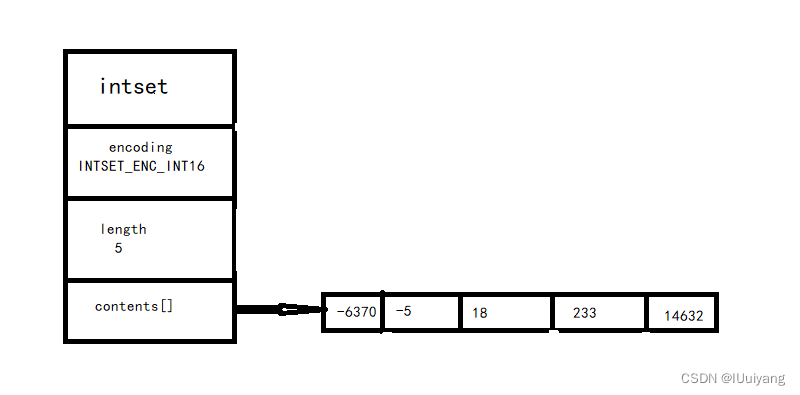
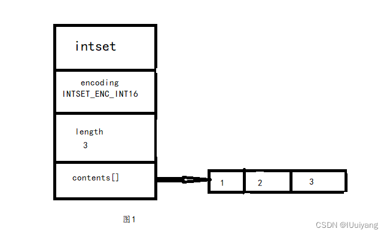
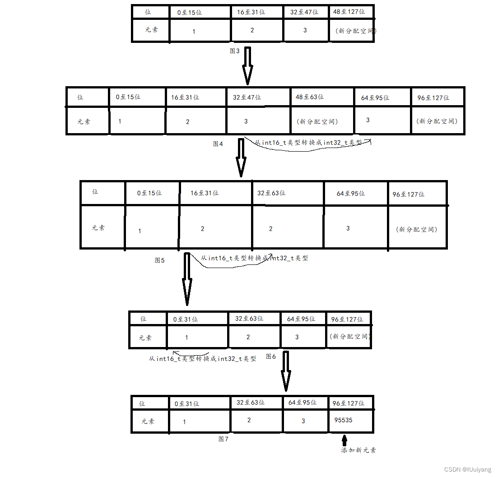
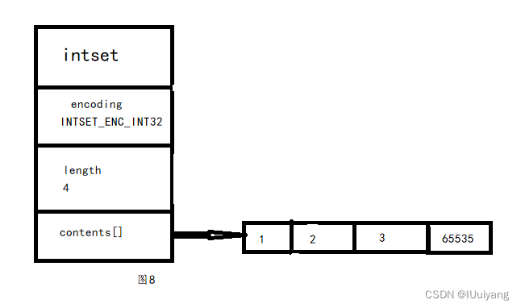

> @Date    : 2023-04-13 23:43:09
>
> @Author  : Lewis Tian (taseikyo@gmail.com)
>
> @Link    : github.com/taseikyo

# IntSet (整数集合)

> 原文：https://blog.csdn.net/weixin_43610758/article/details/127680644 2022-11-03 23:52:31 [IUuiyang](https://blog.csdn.net/weixin_43610758)

整数集合是集合键的底层实现之一，当一个集合只包含整数值元素，并且这个集合的元素数量不多时，Redis 就会使用整数集合作为集合键的底层实现。  
命令：OBJECT ENCODING key – 可查看 redis key 的底层实现的数据结构；

整数集合是 Redis 用来保存整数值的集合抽象数据结构，它可以保存数据类型为 int16_t，int32_t 或者 int64_t 的整数值，并且保证集合中不会出现重复的元素。

**每个 intset 结构由 3 个属性组成**：encoding (编码方式)，length (集合包含的元素数量)，cotents[]。
contents 数组是整数集合的底层实现：整数集合的每个元素都是 contents 数组的一个数组项 (item)，各个项正在数组中按值的大小从小到大有序的排列，并且数组不包含任何重复项。  
length 属性记录了整数集合包含的元素个数，也即是 contents 数组的长度。  

encoding:
1. 如果 encoding 属性的值为 INTSET_ENC_INT16, 那么 contents 就是一个 int_16 类型的数组，数组中的每个项都是一个 int_16 类型的整数值 (最小值为 - 32768，最大值为 32767)。  
2. 如果 encoding 属性的值为 INTSET_ENC_INT32, 那么 contents 就是一个 int_32 类型的数组，数组中的每个项都是一个 int_32 类型的整数值 (最小值为 - 2147483648，最大值为 2147483647)。  
3. 如果 encoding 属性的值为 INTSET_ENC_INT64, 那么 contents 就是一个 int_64 类型的数组，数组中的每个项都是一个 int_64 类型的整数值 (最小值为 - 9223372036854775808，最大值为 9223372036854775807)。

如图所示为一个整数集合实例:  
encoding 属性的值为 INTSET_ENC_INT16, 表示整数集合的底层实现为 int_16_t 类型的数组，而集合保存的都是 int_16_t 类型的整数值。  
length 属性的值为 5，表示整数集合包含 5 个元素。  
contents 数组按从小到大的顺序保存着集合的 5 个元素。  
因为每个元素都是 int_16_t 类型的整数值，所以 contents 数组的大小等于 `SizeOf(int_16)*5=16*5=80` 位。

**整数集合编码方式升级：**(每当我们要将一个新元素添加到整数集合里面，并且新元素的类型比整数集合现有所有元素的类型都要长时，整数集合需要先进行升级，然后才能将新元素添加到整数集合里面)  
上图 intset 的 5 个元素为 -6370，-5,18,233,14632，范围都在 int16 类型的范围内，如果这时添加一个元素 65535， 那么此时 65535 就需要用 int32_t 类型来保存。那么此时根据整数集合的升级规则，当向一个底层为 int16_t 数组的整数集合添加一个 int32_t 类型的整数值时，整数集合已有的所有元素都会被转换成 int32_t 类型，所以 contents 数组保存 6 和整数值都是 int32_t 类型的，不仅仅是 65535。

升级整数集合并添加新元素分为三步进行：  
1. 根据新元素的类型，扩展整数集合底层数组的空间大小，并为新元素分配空间。  
2. 将底层数组现有的所有元素都转换成与新元素相同的类型，并将类型转换后的元素放到正确的位上，而且在放置元素的过程中，需要继续维持底层数组的有序性质不变。  
3. 将新元素添加到底层数组里面。

eg:  
现有一个 INTSET_ENC_INT16 编码的整数集合，集合中包含三个 int16_t 的元素；(图 1)

因为每个元素都占用 16 位控件，所以整数集合底层数组的大小为 `16*3=48` 位。(图 2)

现在我们要将类型为 int32_t 的整数值 65535 添加到整数集合里面，因为 65535 的类型 int32_t 比整数集合当前所有元素的类型都长，所以在将 65535 添加到整数集合之前，程序需要先对整数集合进行升级。

升级首先要做的是，根据新类型的长度，以及集合元素的数量 (包括要添加的新元素在内)，对底层数组进行空间重分配。  
1. 整数集合目前有三个元素，再加上新元素 65535，整数集合需要分配四个元素的空间，因为每个 int32_t 整数值需要占用 32 位空间，所以在空间重分配之后，底层数组的大小将是 `32*4=128` 位。  
2. 虽然程序对底层数组进行了空间重分配，但数组原有的三个元素 1,2,3 仍然是 int16_t 类型，这些元素还保存在数组的前 48 位里面，所以程序接下来要做的就是将这三个元素转换成 int32_t 类型，并将转换后的元素放置到正确的位上面，而且在放置元素的过程中，需要维持底层数组的有序性不变。(图 3)  
3. 首先，因为元素 3 在 1,2,3,65535 四个元素中排名第三，所以它将被移动到 contents 数组的索引 2 位置上，也即是数组 64 为至 95 位的空间内。(图 4)  
4. 接着因为元素 2 在 1,2,3,65535 四个元素中排名第二，所以它将被移动到 contents 数组的索引 1 位置上，也即是数组 32 为至 63 位的空间内。(图 5)  
5. 之后，因为元素 3 在 1,2,3,65535 四个元素中排名第一，所以它将被移动到 contents 数组的索引 0 位置上，也即是数组 0 为至 31 位的空间内。(图 6)  
6. 然后，因为元素 3 在 1,2,3,65535 四个元素中排名第四，所以它将被移动到 contents 数组的索引 3 位置上，也即是数组 96 为至 127 位的空间内。(图 7)  
7. 最后，程序将整数集合 encoding 属性的值从 INTSET_ENC_INT16 改成 INTSET_ENC_INT32, 并将 length 属性的值从 3 改成 4。(图 8)

因为每次向整数集合添加新元素可能会引起升级，而每次升级都需要对底层数组中有的所有元素进行类型转换，所以向整数集合添加新元素的时间复杂度为 O (N)。

**升级的好处：**  
1. 提升整数集合的灵活性：因为数据存储为了避免类型错误，所以一般不会把两种不同类型的值放在同一个数据结构里面。比如一般只使用 int16_t 类型的数组来保存 int16_t 类型的值，只使用 int32_t 类型的数组来保存 int32_t 类型的值，诸如此类；  
因为整数集合可以通过自动升级底层数组来适应新元素，所以我们可以随意的将 int16_t,int32_t,int64_t 类型的整数添加到集合中，而不必担心类型错误。  
2. 节约内存：要让一个数组同时保存 int16_t，int32_t,int64_t 三种类型的值，最简单的做法就是直接使用 int64_t 类型的数组作为整数集合的底层实现。不过这样一来，即使添加到整数集合里面的都是 int16_t 或者 int32_t 类型的值，数组都需要使用 int64_t 类型的空间去保存它们，从而出现浪费内存的情况。  
而整数集合现在的做法即可以让集合能同时保存三种不同类型的值，又可以确保升级操作只会在有需要的时候进行，这可以尽量节约内存。

**整数集合不支持降级，一旦数组进行了升级，编码就会一直保持升级后的状态。**
