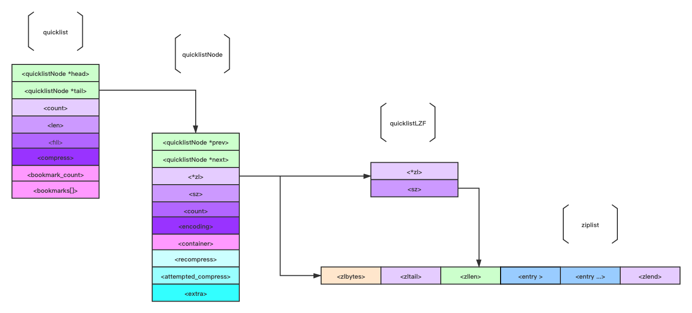

> @Date    : 2023-04-13 23:21:24
>
> @Author  : Lewis Tian (taseikyo@gmail.com)
>
> @Link    : github.com/taseikyo

# Redis - quicklist（快速列表）

> 原文：https://blog.csdn.net/m0_51504545/article/details/117603534  2022-08-03 22:04:00 [mooddance](https://blog.csdn.net/m0_51504545)

## 一 前言

这篇博文用来解读 Redis 数据类型 List 的一种实现。数据结构 quicklist。虽然 List 类型有多种实现，但 quicklist 是最常用的。

quicklist 是一个双向链表，但同时也是一个复合的结构体。结构中包括了另一种结构 ziplist。如果不熟悉这种结构体，请先阅读这篇博文：《 [ziplist - 压缩列表](https://blog.csdn.net/m0_51504545/article/details/117391204)》。

文中介绍了 ziplist 是一种十分节省内存的结构，紧凑的内存布局、变长的编码方式在内存使用量上有着不小的优势。但是修改操作下并不能像一般的链表那么容易，需要从新分配新的内存，然后复制到新的空间。

所以结合了 ziplist 节省内存和双向链表优点的 quicklist 产生了。

## 二 源码解读

### 2.1 quicklist

在 quicklist.c 中可以找到名为 quicklist 的结构体：

```C
typedef struct quicklist {
    quicklistNode *head;
    quicklistNode *tail;
    unsigned long count;        
    unsigned long len;         
    int fill : QL_FILL_BITS;             
    unsigned int compress : QL_COMP_BITS; 
    unsigned int bookmark_count: QL_BM_BITS;
    quicklistBookmark bookmarks[];
} quicklist;
```

这个结构体定义了 quicklist 的布局，在 64 位的操作系统中它使用了 40 字节。看起来不是很复杂。结构中的各项代表含义如下：

- quicklistNode：32 字节的结构体，用于描述 ziplist 的节点。这里很明显的体现了 quicklist 是一个复合的数据类型，在本版本中是且包含了 ziplist 的，未来可能会出现其他的结构体作为选项。
- count：记录所有节点中 ziplist 的所有 entry 的数量。比如有 2 个节点，每个节点中 ziplist 有 3 个 entry 。那这个值就是 6。
- len： 记录所有节点的数量。
- fill：记录控制节点中 ziplist 的最大 entry 个数，由参数 list-max-ziplist-size 控制。
- compress ：记录控制 quicklist 左右两边 quicklistNode 不被压缩的个数，由参数 list-compress-depth 控制。取 0 时候代表不压缩，大于 0 代表前后分别被压缩的个数。
- bookmark_count ：记录数组 bookmarks [] 的长度。Redis 高版本 6.0 才新加的。
- bookmarks ：quicklist 重新分配内存空间时使用，否则只是声明不张占用内存空间。同样也是 6.0 后新增。

### 2.2 quicklistNode

接下来继续解读用来描述 ziplist 的 quicklistNode 结构，同样在在 quicklist.c 中可以找到名为 quicklistNode 的结构体：

```C
typedef struct quicklistNode {
    struct quicklistNode *prev;
    struct quicklistNode *next;
    unsigned char *zl;
    unsigned int sz;             
    unsigned int count : 16;    
    unsigned int encoding : 2;  
    unsigned int container : 2; 
    unsigned int recompress : 1; 
    unsigned int attempted_compress : 1;
    unsigned int extra : 10; 
} quicklistNode;
```

Redis 会将 quicklistNode 控制在 32 个字节大小，其中每项的定义如下：

- quicklistNode `*prev`、`*next`：记录前后节点的指针，quicklist 是一个双向链表。
- `*zl`：指针类型。若当前节点没有被压缩，则指向 ziplist 结构；否则指向 quicklistLZF 结构，下面还会解读。
- sz：记录 ziplist 总字节数。包括所有的结构，若不记得了，先去看看文章：《[ziplist - 压缩列表](https://blog.csdn.net/m0_51504545/article/details/117391204)》。
- count：记录 ziplist 的 entry 总个数。
- encoding：记录当前节点是否被压缩，若被压缩则也同时指定压缩算法。当前版本只有 RAW==1 or LZF==2 取值。1 代表没压缩；2 代表被压缩且使用了 LZF 压缩算法。这个算法可以在 lzf.c 文件中了解。
- container：记录节点数据是使用那种结构存储。目前版本默认选择 ziplist ，取值范围 NONE==1 or ZIPLIST==2 ，是一个预留的字段，可能后续还会出现其他的结构。
- recompress：记录标记该节点是否需要被压缩。当取值为 1 时候需要被压缩。
- attempted_compress：自动化测试程序才有用。
- extra：预留字段，可能后面的版本会使用。

### 2.3 quicklistLZF

上面 quicklistNode 若是被压缩则会使用 quicklistLZF 机构，它的布局是比较简单的：

```C
typedef struct quicklistLZF {
    unsigned int sz; /* LZF size in bytes*/
    char compressed[];
} quicklistLZF;
```

代码中注释：quicklistLZF is a 4+N byte struct holding ‘sz’ followed by ‘compressed’。

- sz：记录压缩后 ziplist 的字节长度。
- compressed：记录存放压缩后的 ziplist 字节数组。

## 三 布局结构

首先我们思考一个问题，一个数据结构的好坏大致会受空间、时间复杂度的影响。quicklis 的出现也正是考虑到这点，想在俩者之间找到一个最佳的平衡点。所以它使用了双向链表加 ziplist 的复合组合。

1. 双向链表能在头尾在 O (1) 下找到一个元素，若是在中部查找则平均复杂度也只是 O (N)，N 是 entry 的个数。
2. ziplist 使用了紧凑布局和可变编码方式大大降低了内存的使用。这就是 quicklis 作为 List 首选的实现方案。

但是若是 quicklistNode 中 ziplist 的 entry 的个数设置的不恰当，那 quicklist 的性能也会大幅降低。比如下面的情况：

- list-max-ziplist-size 设置过小，甚至为 1 。这时候 quicklist 性能上就退化和普通双向链表一样。在内存使用上就不能体验到 ziplist 的优势。
- list-max-ziplist-size 设置过大，甚至所有的元素都存储在一个节点中，ziplist 的缺点就会被放大。ziplist 需要一段连续的内存，且修改时候会发生内存的复制。

所以在实际使用中，要根据数据特点设置一个比较合理的值。

list-max-ziplist-size 取值范围可以是正数也可以是负数，不能为 0 。当取正数时候代表每个 ziplist 可以存储的最大 entry 数。负数时候去值范围只能是 -5～-1 ，各自代表 ziplist 最大字节大小。

布局图：



## 四 操作接口

对于 List 来说：最重要、常用的操作无非就是 push、pop、len 等。在 quicklist 中定义了这些操作的函数接口。

当往 List 中 push 元素时候，若 list 不存在 。会先创建一个空的 quicklist , 初始化各项。代码比较清晰，看一下即可明白。

```C
quicklist *quicklistCreate(void) {
    // quicklist 结构体
    struct quicklist *quicklist;
	
	// 内存分配，该函数具体逻辑可以看 zmalloc.c 文件
    quicklist = zmalloc(sizeof(*quicklist));
    
	// 下面都是初始化赋值
    quicklist->head = quicklist->tail = NULL;
    quicklist->len = 0;
    quicklist->count = 0;
    quicklist->compress = 0;
    quicklist->fill = -2;
    quicklist->bookmark_count = 0;
    
    return quicklist;
}
```

若 list 存在，则调用 quicklistPush 函数进行 push 操作。

```C
void quicklistPush(quicklist *quicklist, void *value, const size_t sz, int where) {
    // 判断 push 方向 调用实际的 push 函数。
	// 头部
    if (where == QUICKLIST_HEAD) {
        quicklistPushHead(quicklist, value, sz);
    } else if (where == QUICKLIST_TAIL) {
    // 尾部
        quicklistPushTail(quicklist, value, sz);
    }
}
```

实际上 quicklistPushHead 和 quicklistPushTail 函数的逻辑是一样的，这里就只用 quicklistPushHead 进行解析。

```C
int quicklistPushHead(quicklist *quicklist, void *value, size_t sz) {

    quicklistNode *orig_head = quicklist->head;
	
	// 判断节点上的 ziplist 是否操作配置设置的大小， 若没有超过 _quicklistNodeAllowInsert 函数返回 1。
    if (likely(_quicklistNodeAllowInsert(quicklist->head, quicklist->fill, sz))) {
			
		// 调用 ziplistPush 往 ziplist 中添加一个 entry
        quicklist->head->zl = ziplistPush(quicklist->head->zl, value, sz, ZIPLIST_HEAD);
        // 更新记录 ziplist 总字节数 
        quicklistNodeUpdateSz(quicklist->head);

    } else {
		
		// 创建一个新的 节点
        quicklistNode *node = quicklistCreateNode();
  
  		// 调用 ziplistPush 往 ziplist 中添加一个 entry
        node->zl = ziplistPush(ziplistNew(), value, sz, ZIPLIST_HEAD);
 
        // 更新记录 ziplist 总字节数 
        quicklistNodeUpdateSz(node);
        
        // 实际上是调用 __quicklistInsertNode 根据 after 的值，判断 new_node 插入位置。相对于 old_node。
        _quicklistInsertNodeBefore(quicklist, quicklist->head, node);
    }
	
	// ziplist 的 entry 个数加一
    quicklist->count++;
    quicklist->head->count++;
    
    return (orig_head != quicklist->head);
}
```

解读完 push 操作后，接着解读 pop。pop 是调用函数 quicklistPop 。

```C
int quicklistPop(quicklist *quicklist, int where, unsigned char **data,unsigned int *sz, long long *slong) {

    unsigned char *vstr;
    unsigned int vlen;
    long long vlong;
    
    // 若当前 entry 为空，则直接返回 0；
    if (quicklist->count == 0)
        return 0;
     
    // 实际逻辑是调用 quicklistPopCustom 、在调用 ziplistGet 获取、 最后调用 quicklistDelIndex 删掉元素。
    // 具体的逻辑自行查阅代码
    int ret = quicklistPopCustom(quicklist, where, &vstr, &vlen, &vlong, _quicklistSaver);
    
    if (data)
        *data = vstr;
    if (slong)
        *slong = vlong;
    if (sz)
        *sz = vlen;
    return ret;
}
```

得益于 quicklist 结构的友好设计，其实就是空间换时间。获取 list 的长度，是不需要遍历节点中的 ziplist 的个数。 这种设计在 redis 的各种数据结构中是十分常见的，我们在实际开发中其实也可以采纳这种设计思想。

```C
unsigned long quicklistCount(const quicklist *ql) {
 return ql->count; 
}
```

对操作接口的解读就到这里了，感兴趣的可以直接去 quicklist.c 中查阅。

## 五 总结

1. List 数据类型的底层实现其实是 quicklist。
2. quicklist 是一个双向链表的复合结构体。quicklistNode 让它拥有链表的查询优点；ziplist 让它在内存使用上有着相对链表可以节省大量前后指针的优势。
3. 但是需要合理的配置节点中 ziplist 的 entry 个数。entry 过少，则退化成普通链表。entry 过多，则会放大 ziplist 的缺点。
