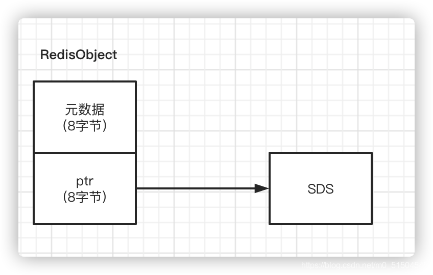

> @Date    : 2023-04-12 21:59:59
>
> @Author  : Lewis Tian (taseikyo@gmail.com)
>
> @Link    : github.com/taseikyo

# Redis - SDS（简单动态字符串）

> 原文：https://blog.csdn.net/m0_51504545/article/details/115711744
>
> 作者：https://blog.csdn.net/m0_51504545
>
> 2022-07-17 18:31:01

## 定义解释

Redis 没有直接使用 C 语言传统的字符串表示 (以空字符 \0 结尾的字符数组，以下简称 C 字符串)，而是自己构建了一种名为简单动态字符串 (simple dynamic string,SDS) 的抽象类型，并将 SDS 作为默认字符串表示。

Redis 客户端传入服务器的协议内容、 aof 缓存、 返回给客户端的回复等等， 这些重要的内容都是由 sds 类型来保存的。 只有在字符串不需要修改的时候采用 C 字符串，其余情况都采用 SDS。

不直接使用 C 字符串的原因大致下面几种：

- C 语言的字符串不记录自身长度，想要知道一个字符串的长度就必须遍历一遍字符串，复杂度为 O (N)，而 Redis 的字符串同样使用命令 STRLEN 的时候，复杂度为 O (1)。
- 二进制安全，可以存储非文本数据的，包括视频，音频，图片等。SDS 并不是像传统的 C 字符串 ([字符数组](https://so.csdn.net/so/search?q=%E5%AD%97%E7%AC%A6%E6%95%B0%E7%BB%84&spm=1001.2101.3001.7020)) 一样，而 SDS 常被称作字节数组，采用以字节为单位的形式存储数据，而最后的 \0 也是一个字节，这样数据怎么样存入的，取出来的时候还是怎么样的，因此是二进制安全的。 因为在结构中定义了 len 属性，所以及时在字符串中间出现 \0 也是可以完整存储而不会被截断。
- 可以高效地执行追加操作（append），加快追加操作的速度，并降低内存分配的次数，代价是多占用了一些内存，而且这些内存不会被主动释放。

## 源码解读

对于 SDS ，Redis 有五种实现方式 SDS_TYPE_5、 SDS_TYPE_8、 SDS_TYPE_16、 SDS_TYPE_32、 SDS_TYPE_64。根据初始化的长度决定使用哪种类型，从而减少内存的使用。

### 数据结构

位于 sds.h 头文件

```C
struct __attribute__ ((__packed__)) sdshdr8 {
    uint8_t len;   // 已经使用的字节数
    uint8_t alloc;  //总共可用的字符空间大小，应该是实际buf的大小减1 (因为c字符串末尾必须是 \0, 不计算在内)。
    unsigned char flags; //标志位，主要是识别这是sdshdr几，目前只用了3位，还有5位空余
    char buf[];   // 实际存储字符串的地方 其实就是 C 原生字符串+部分空余空间
};
```

但是当初始化为空和 `SDS_TYPE_5` 较为特殊，在源码中会强制转换为 `SDS_TYPE_8`。 理解是因这种情况下，很大可能后续会追加数据。故给一个比较合适的等级。

位于 sds.c

```C
sds sdsnewlen(const void *init, size_t initlen) {
 
...
 
 if (type == SDS_TYPE_5 && initlen == 0) type = SDS_TYPE_8;

...
 
}
```

有意思的是对于 Key 和 Value 都很小，只有 Value 会被强转，我理解是 Key 不怎么会更新。故给最小的值即可。

```C
sds sdsnewlen(const void *init, size_t initlen) {

...
 s[initlen] = '\0';
 return s;
}
```

`sdsnewlen()` 返回的 SDS 指针并不是直接指向 sdshdr 的地址，而是直接指向了 sdshdr 中 buf 的地址。因为这样可以兼容 c 原生字符串，buf 其实就是 C 原生字符串 + 部分空余空间，中间是特殊符号’\0’隔开，‘\0’是标识 C 字符串末尾的符号，这样就实现了和 C 原生字符串的兼容，部分 C 字符串的 API 也就可以直接使用。

### 扩容操作

若新申请的内存加已使用内存没有超过 `SDS_MAX_PREALLOC(1024*1024)` 则按 * 2 倍申请。反之按 `SDS_MAX_PREALLOC` 递增。

```C
// 扩大sds的实际可用空间，以便后续能拼接更多字符串。
// 这里实际不会改变sds的长度，只是增加了更多可用的空间(buf)
sds sdsMakeRoomFor(sds s, size_t addlen) {
...
 
    len = sdslen(s);
    sh = (char*)s-sdsHdrSize(oldtype);
    newlen = (len+addlen);

    // 在未超出SDS_MAX_PREALLOC前，扩容都是按2倍的方式扩容，超出后只能递增
    if (newlen < SDS_MAX_PREALLOC)// SDS_MAX_PREALLOC = 1024*1024
        newlen *= 2;
    else
        newlen += SDS_MAX_PREALLOC;
    ...
    sdssetalloc(s, newlen);
    return s;
}
```

## String 类型实现

上面提到 String 类型不仅仅只能存储字符串类型数据，所以对于赋予不同的数据类型时候，string 是会区别对待。

- 当存储的数据是整数类型时候，String 类型会使用 int 编码方式来存储。具体为使用一个 8 字节的 Long 类型来实现。
- 当存储的数据中包含字符串时候，String 类型会使用 SDS 结构体来存储。

除了记录实际数据，String 类型还需要额外的内存空间记录数据长度、空间使用、 最后一次访问的时间、被引用的次数 等元数据， 所以，Redis 会用一个 RedisObject 结构体来统一记录这些元数据，同时指向实际数据。 一个 RedisObject 包含了 8 字节的元数据和一个 8 字节指针，这个指针再进一步指向具体数据类型的实际数据所在或者为真实值。



为了节省内存使用，对 Long 和 SDS 做了不同的处理：

- 当保存的是 Long 类型整数时，RedisObject 中的指针就直接赋值为整数数据了，这样就不用额外的指针再指向整数了，节省了指针的空间开销。
-  当保存的是字符串数据，并且字符串小于等于 44 字节时，RedisObject 中的元数据、指针和 SDS 是一块连续的内存区域，这样就可以避免内存碎片。这种布局方式也被称为 embstr 编码方式。
- 当保存的是字符串数据， 并且 字符串大于 44 字节时，SDS 的数据量就开始变多了，Redis 就不再把 SDS 和 RedisObject 布局在一起了，而是会给 SDS 分配独立的空间，并用指针指向 SDS 结构。这种布局方式被称为 raw 编码模式。

## 总结

SDS 最为 Redis 最常用的数据机构，总结有下面几种原因。

- 常数复杂度获取字符串长度：O (1)
- 避免缓冲区溢出
- 减少修改字符串时带来的内存重分配次数
- 二进制安全

SDS 虽好，但是也不能乱用。可以继续看这篇文章：[Redis 请慎用 String 类型](https://blog.csdn.net/m0_51504545/article/details/109372792)
