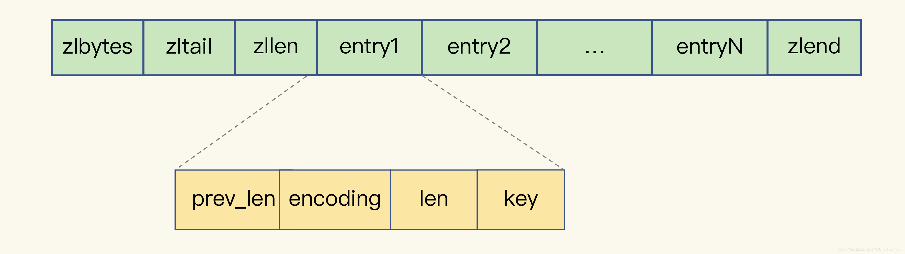

> @Date    : 2023-04-12 22:18:28
>
> @Author  : Lewis Tian (taseikyo@gmail.com)
>
> @Link    : github.com/taseikyo

# Redis 请合理使用 String 类型

> 原文：https://blog.csdn.net/m0_51504545/article/details/109372792  2022-04-21 09:08:05 [mooddance](https://blog.csdn.net/m0_51504545)

## 慎用 String?

开篇之前先给出一个组对比：

```C
1. 这是执行 flushdb 后的干净的 Redis 内存使用信息。

127.0.0.1:6379> info memory
# Memory
used_memory:502272
used_memory_human:490.50K
used_memory_rss:7901184
used_memory_peak:119628904
used_memory_peak_human:114.09M
used_memory_lua:33792
mem_fragmentation_ratio:15.73
mem_allocator:jemalloc-3.6.0

2. 执行100000次(一百万)循环执行 set 操作。

// 代码仅作参考
$redisHandle = Redis::connection('intranet_log_redis');
for ($i= 0; $i < 1000000; $i++) {
    $redisHandle->set($i, 10000000);
}

// 执行步骤2后的内存信息。
127.0.0.1:6379> info memory
# Memory
used_memory:72891064
used_memory_human:69.51M
used_memory_rss:80601088
used_memory_peak:134217744
used_memory_peak_human:128.00M
used_memory_lua:33792
mem_fragmentation_ratio:1.11
mem_allocator:jemalloc-3.6.0

// 由上信息可知除去本身redis占用的内存，一百万个键值对使用了69M的内存。

3. 再次执行 flushdb 后，改为hash类型存储，再次执行1000000(一百万)次循环。

// 代码仅供参考
$redisHandle = Redis::connection('intranet_log_redis');
for ($i= 0; $i < 1000000; $i++) {
    $redisHandle->hset('testKey', $i, 10000000);
}

// 执行步骤3后查看内存信息
127.0.0.1:6379> info memory
# Memory
used_memory:72883104
used_memory_human:3.43M
used_memory_rss:82509824
used_memory_peak:134217744
used_memory_peak_human:128.00M
used_memory_lua:33792
mem_fragmentation_ratio:1.13
mem_allocator:jemalloc-3.6.0

当当当！ 使用了hash存储，内存使用减少了 20 倍！！！这是为什么尼？？？
```

## String 类型存储结构

为什么存储同样数据量的相同数据，string 会比 hash 大了 20 倍？带着这个疑问然后学习下 string 的具体实现方式。

上面的例子中 value 部分都是 1000000 ，可用用 1 个 8 字节的 Long 类型存储。而 key 则是 0～1000000 同样可以用 Long 存储。理论上存储只需要几 M 的内存，为什么用到了 69M？

这就设计到 string 的编码和结构体了，比如说 64 位系统中保存一个整数。redis 会用一个 8 字节的 Long 类型存储，这就是 int 编码方式。

而字符串则不太一样，采用 SDS (Simple Dynamic String) 简单动态字符串结构体存储。

<table><thead><tr><th>结构</th><th>大小</th><th>描述</th></tr></thead><tbody><tr><td>len</td><td>4B</td><td>4 个字节，表示 buf 已用长度</td></tr><tr><td>alloc</td><td>4B</td><td>4 个字节，表示 buf 的实际分配长度，通常大于 len</td></tr><tr><td>buf</td><td>数组，保持实际数据。</td><td>自动在数组后面连接一个 “\0”，标志数据的结尾。占 1 个字节</td></tr></tbody></table>

从上表格中可以看出 SDS 会有额外的 len 和 alloc 的存储开销，这个有点类似 Mogodb 。当然对于 string 类型来说除了 SDS 的开销外还有 RedisObject 结构体。它的作用在于用来记录数据的元数据同时指向这些数据，

RedisObject 包含一个 8 字节的元数据和一个 8 字节的指针 (真实数据位置)。当然了为了节省内存空间，Redis 还对 Long 类型整数和 SDS 的内存布局做了专门的设计。

比如说：当保存的是 Long 类型整数时，RedisObject 中的指针就直接赋值为整数数据了，这样就不用额外的指针再指向整数了，节省了指针的空间开销。

当保存的是字符串数据，并且字符串小于等于 44 字节时，RedisObject 中的元数据、指针和 SDS 是一块连续的内存区域，这样就可以避免内存碎片。这种布局方式也被称为 embstr 编码方式。
当字符串大于 44 字节时，SDS 的数据量就开始变多了，Redis 就不再把 SDS 和 RedisObject 布局在一起了，而是会给 SDS 分配独立的空间，并用指针指向 SDS 结构。这种布局方式被称为 raw 编码模式。

上面列举的是 string 结构体和 RedisObject 带来的额外存储开销，但是不仅仅只有这一点。Redis 会使用一个全局哈希表保存所有键值对，哈希表的每一项是一个 dictEntry 的结构体，用来指向一个键值对。dictEntry 结构中有三个 8 字节的指针，分别指向 key、value 以及下一个 dictEntry，三个指针共 24 字节，如下图所示：


上面的三个指针共用了 24 字节，但是实际上 Redis 会给他分配 32 个字节，这个和 Redis 使用的内存分配 jemalloc 有关。jemalloc 在分配内存时，会根据我们申请的字节数 N，找一个比 N 大，但是最接近 N 的 2 的幂次数作为分配的空间，这样可以减少频繁分配的次数。所以接近 24 且比 24 大的只有 32。

所以上面两个原因就是主要导致存储一百万个数据是使用了 69M，因为有很多地方带来了额外的内存开销。那为什么用 hash 就小很多尼？

## 哈希存储

Redis 有一种底层数据结构，叫压缩列表（ziplist），这是一种非常节省内存的结构。压缩列表 表头有三个字段 zlbytes、zltail 和 zllen，分别表示列表长度、列表尾的偏移量，以及列表中的 entry 个数。压缩列表尾还有一个 zlend，表示列表结束。如图：



压缩列表之所以能节省内存，就在于它是用一系列连续的 entry 保存数据。不用额外的指针进行连接，所以节省空间。每个 entry 的元数据包括下面几部分。

<table><thead><tr><th>结构</th><th>描述</th></tr></thead><tbody><tr><td>prev_len</td><td>表示前一个 entry 的长度。prev_len 有两种取值情况：1 字节或 5 字节。取值 1 字节时，表示上一个 entry 的长度小于 254 字节。虽然 1 字节的值能表示的数值范围是 0 到 255，但是压缩列表中 zlend 的取值默认是 255，因此，就默认用 255 表示整个压缩列表的结束，其他表示长度的地方就不能再用 255 这个值了。所以，当上一个 entry 长度小于 254 字节时，prev_len 取值为 1 字节，否则，就取值为 5 字节。</td></tr><tr><td>len</td><td>自身长度 4 字节</td></tr><tr><td>encoding</td><td>编码方式 1 字节</td></tr><tr><td>content</td><td>存储实际数据</td></tr></tbody></table>

当然了 Hash 类型的两种底层实现结构，分别是压缩列表和哈希表。由下面两组参数控制合适使用哈希表或压缩列表。
**hash-max-ziplist-entries**：表示用压缩列表保存时哈希集合中的最大元素个数。默认 512。
**hash-max-ziplist-value**：表示用压缩列表保存时哈希集合中单个元素的最大长度。默认 60。

当 Hash 集合中写入的元素个数超过了 hash-max-ziplist-entries，或者写入的单个元素大小超过了 hash-max-ziplist-value，Redis 就会自动把 Hash 类型的实现结构由压缩列表转为哈希表。一旦从压缩列表转为了哈希表，Hash 类型就会一直用哈希表进行保存，而不会再转回压缩列表了。在节省内存空间方面，哈希表就没有压缩列表那么高效了。

所在文章前面做实验时候我把 hash-max-ziplist-entries 调到了一百万。所以但存储大量的键值对时候需要谨慎些，多想想。比如可以用 Hash 类型的二级编码方式。
