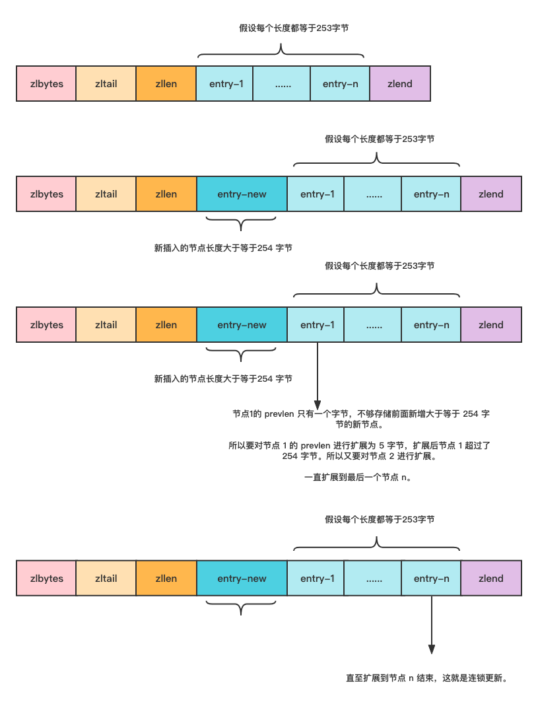

> @Date    : 2023-04-12 22:22:38
>
> @Author  : Lewis Tian (taseikyo@gmail.com)
>
> @Link    : github.com/taseikyo

# Redis - ziplist (压缩列表)

> 原文：https://blog.csdn.net/m0_51504545/article/details/117391204 2022-08-03 22:02:32 [mooddance](https://blog.csdn.net/m0_51504545)

## 一 前言

List 列表是简单的字符串列表，按照插入顺序排序，可以从头部或尾部向 List 列表添加元素。最大长度为 $2^{32} - 1$，也即每个列表支持超过 40 亿个元素。

Redis 的 List 类型有多种实现方式，由双向链表或压缩列表（v7.0 由 listpack 替代）实现的。这篇文章就是介绍其中一种实现 ziplist - 压缩列表。

ziplist 被设计成一种内存紧凑型的数据结构，占用一块连续的内存空间，不仅可以利用 CPU 缓存，而且会针对不同长度的数据，进行相应编码，这种方法可以有效地节省内存开销。

## 二 源码解读

一如既往，关于 ziplist 的定义和实现还是放在一对文件中，分别是 `ziplist.h` 和 `ziplist.c`。在 `ziplist.c` 文件的头部有着这么一段注释介绍什么是 ziplist。

> ziplist 是一个经过特殊编码的双向链表，旨在提高内存效率。它存储字符串和整数值，其中整数被编码为实际整数而不是一系列字符。它允许在 O (1) 时间内在列表的任一侧进行推送和弹出操作。但是，由于每个操作都需要重新分配 ziplist 使用的内存，因此实际复杂性与 ziplist 使用的内存量有关。

从这段话得到：对于不同的数据类型有着不同的编码方式，理解为会对数据进行压缩，从而达到减少内存使用的目的。但是随着存储的 value 数据级增加，使用 ziplist 所付出的代价也随之增加。

### 2.1 ziplist 布局

ziplist 是一个特殊双向链表，不像普通的链表使用前后指针关联在一起，它是存储在连续内存上的。

```C
/* 创建一个空的 ziplist. */
unsigned char *ziplistNew(void) {
    unsigned int bytes = ZIPLIST_HEADER_SIZE+ZIPLIST_END_SIZE;
    unsigned char *zl = zmalloc(bytes);
    ZIPLIST_BYTES(zl) = intrev32ifbe(bytes);
    ZIPLIST_TAIL_OFFSET(zl) = intrev32ifbe(ZIPLIST_HEADER_SIZE);
    ZIPLIST_LENGTH(zl) = 0;
    zl[bytes-1] = ZIP_END;
    return zl;
}
```

整体的结构布局如下图：


1. zlbytes：32 位无符号整型，记录 ziplist 整个结构体的占用空间大小。当然了也包括 zlbytes 本身。这个结构有个很大的用处，就是当需要修改 ziplist 时候不需要遍历即可知道其本身的大小。这跟 SDS 中记录字符串的长度有相似之处，这些好的设计往往在平时的开发中可以采纳一下。
2. zltail：32 位无符号整型，记录整个 ziplist 中最后一个 entry 的偏移量。所以在尾部进行 POP 操作时候不需要先遍历一次。
3. zllen：16 位无符号整型，记录 entry 的数量， 所以只能表示 $2^{16}$。但是 Redis 作了特殊的处理：当实体数超过 $2^{16}$ , 该值被固定为 $2^{16} - 1$。所以这种时候要知道所有实体的数量就必须要遍历整个结构了。
4. entry：真正存数据的结构。
5. zlend：8 位无符号整型，固定为 255 (0xFF)。为 ziplist 的结束标识。

### 2.2 entry 节点

每个 entry 都包含两条信息的元数据为前缀：  

- 第一元数据用来存储前一个 entry 的长度，以便能够从后向前遍历列表。
- 第二元数据是表示 entry 的编码形式。用来表示 entry 类型，整数或字符串，在字符串的情况下，它还表示字符串有效的长度。

```C
typedef struct zlentry {
    unsigned int prevrawlensize; /* 用于编码前一个节点字节长度*/
    unsigned int prevrawlen;     
    unsigned int lensize;        /* 用于编码此节点类型/长度的字节。
    								例如，字符串有1、2或5个字节标题。
    								整数总是使用一个字节。
    							*/
    unsigned int len;            /* 用于表示节点实际的字节。
									对于字符串，这只是字符串长度
									而对于整数，它是1、2、3、4、8或
									0,具体取决于数字范围。
								*/
    unsigned int headersize;     /* prevrawlensize + lensize. */
    unsigned char encoding;      /* 设置为ZIP_STR_*或ZIP_INT_*，具体取决于节点编码。*/
    unsigned char *p;            /* 第一个节点的地址指针，prev-entry-len */
} zlentry;
```

所以一个完整的 ziplist 是这样存储的：  


#### 2.2.1 prelen

1. 记录前一个 entry 的长度。若前一个 entry 的长度小于 254 , 则使用 1 个字节的 8 位无符号整数来表示。
2. 若前一个 entry 长度大于等于 254，则使用 5 个字节来表示。第 1 个字节固定为 254 (FE) 作为标识，剩余 4 字节则用来表示前一个 entry 的实际大小。

```
1. 前一个 entry 大小不超过 253。

<prevlen from 0 to 253> <encoding> <entry>

2. 前一个 entry 大小超过 253。

0xFE <4 bytes unsigned little endian prevlen> <encoding> <entry>
```

#### 2.2.2 encoding 编码

entry 的编码字段取决于具体值的内容，分为字符串、数字两种类型单独处理。

1. 当 entry 是字符串时，有 3 种编码方式。编码第 1 个字节的前 2 位将保存用于存储字符串长度的编码类型，后面是字符串的实际长度。

```
1. 长度小于或等于 63 字节（6 位）的字符串值。“pppppp”表示无符号的 6 位数据长度。

|00pppppp| - 1 byte


2. 长度小于或等于 16383 字节（14 位）的字符串值。14 位的数据采用  big endian 存储。
big endian 是一种字节序方式，有Little-Endian、Big-Endian两种。

|01pppppp|qqqqqqqq| - 2 bytes


3. 长度大于或等于 16384 字节的字符串值。
采用 big endian 存储且可表示的字符串长度最大2^32-1，所以第一个字节没有用到，所以低6位没有用，所以都是0。

|10000000|qqqqqqqq|rrrrrrrr|ssssssss|tttttttt| - 5 bytes
```

2. 当 entry 是整数时，有 6 种编码方式。前 2 位都固定为 1，接下来的 2 位用于指定将在此标头后存储哪种类型的整数。

与 ziplist 标头一样，所有整数都以 Little-Endian 序表示，即使此代码是在 Big-Endian 系统中编译的。

```
1. 整数编码为 int16_t（2 字节）。

|11000000| - 3 bytes


2. 整数编码为int32_t（4个字节）。

|11010000| - 5 bytes


3. 整数编码为 int64_t（8 字节）。

|11100000| - 9 bytes


4. 整数编码为24位带符号（3个字节）。

|11110000| - 4 bytes


5. 整数编码为 8 位有符号（1 字节）。

|11111110| - 2 bytes


6. 0到12的无符号整数。编码后的值实际上是1到13，因为0000和1111不能用，所以要从编码后的4位值中减去1才能得到正确的值。

|1111xxxx| - (with xxxx between 0001 and 1101) immediate 4 bit integer
```

**3. 结尾编码标识**

```
1. 表示 ziplist 结尾的标识。

|11111111|
```

## 三 连锁更新

连锁更新是 ziplist 一个比较大的缺点，这也是在 v7.0 被 listpack 所替代的一个重要原因。

ziplist 在更新或者新增时候，如空间不够则需要对整个列表进行重新分配。当新插入的元素较大时，可能会导致后续元素的 prevlen 占用空间都发生变化，从而引起「连锁更新」问题，导致每个元素的空间都要重新分配，造成访问压缩列表性能的下降。

ziplist 节点的 prevlen 属性会根据前一个节点的长度进行不同的空间大小分配：

1. **如果前一个节点的长度小于 254 字节，那么 prevlen 属性需要用 1 字节的空间来保存这个长度值。**
2. **如果前一个节点的长度大于等于 254 字节，那么 prevlen 属性需要用 5 字节的空间来保存这个长度值。**

假设有这样的一个 ziplist，每个节点都是等于 253 字节的。新增了一个大于等于 254 字节的新节点，由于之前的节点 prevlen 长度是 1 个字节。

为了要记录新增节点的长度所以需要对节点 1 进行扩展，由于节点 1 本身就是 253 字节，再加上扩展为 5 字节的 pervlen 则长度超过了 254 字节，这时候下一个节点又要进行扩展了。噩梦就开始了。



## 四 总结

1. ziplist 为了节省内存，采用了紧凑的连续存储。所以在修改操作下并不能像一般的链表那么容易，需要从新分配新的内存，然后复制到新的空间。
2. ziplist 是一个双向链表，可以在时间复杂度为 O (1) 从下头部、尾部进行 pop 或 push。
3. 新增或更新元素可能会出现连锁更新现象。
4. 不能保存过多的元素，否则查询效率就会降低。

其实使用中并没有直接指定是否使用这种数据结构，但是可以设置何种情况下使用它。可以在 Redis 的配置文件中进行设置。

支持的数据类型有 List 对象、Hash 对象、Zset 对象，有以下可选设置项：

1. hash-max-ziplist-entries：hash 类型元素数量超过指定数据后时候。使用 hash 存储， 否则使用压缩表。
2. hash-max-ziplist-value： hash 类型元素长度超过指定数据后时候。使用 hash 存储，否则使用压缩链表。
3. zset-max-ziplist-entries：zset 类型 压缩列表 ziplist 最大限制元素数。超过指定值将会使用跳表 skiplist + dict 来存储。
4. zset-max-ziplist-value：set 类型 压缩列表 ziplist 最大限制大小。超过指定将会使用跳表 skiplist+dict 来存储。
5. list-max-ziplist-value: list 保存的所有字符串元素的长度都小于 64 字节。
6. list-max-ziplist-entries：list 保存的元素数量小于 512 个。
