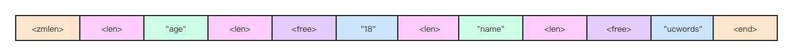
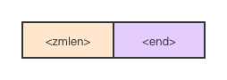

> @Date    : 2023-04-13 22:21:30
>
> @Author  : Lewis Tian (taseikyo@gmail.com)
>
> @Link    : github.com/taseikyo

# Redis - zipmap（压缩字典）

> 原文：https://blog.csdn.net/m0_51504545/article/details/117537338 2022-08-03 22:02:32 [mooddance](https://blog.csdn.net/m0_51504545)

## 一 前言

hash 数据类型是一个 string 类型的 field（字段） 和 value（值） 的映射表，hash 特别适合用于存储对象。每个 hash 可以存储 2^32 - 1 键值对（40 多亿）。

redis 在 hash 类型数量比较小的时候会选择使用 zipmap 来实现存储。先看看 Redis 是怎么定义 zipmap 的：

> String -> String Map 数据结构优化了大小。 该文件实现了一个数据结构，将字符串映射到其他字符串，实现了一个 O (n) 查找数据结构，该结构设计为非常节省内存。 Redis Hash 类型将这种数据结构用于由少量元素组成的散列，一旦达到给定的元素数量就切换到散列表。 考虑到 Redis Hashes 多次用于表示由几个字段组成的对象，这在使用内存方面是一个非常大的胜利。

在 `zipmap.c` 文件的头部注释着这句话，从文中能提炼出几点信息：

1. 使用字符串类型实现 ziplist 的基本布局，可以粗略描述为 “<key1><value1><key…><value…>”。
2. 查询时候需要遍历字符串，直至找到。
3. 使用一块连续的内存。

## 二 源码解读

其实 zipmap 的实现方式和 ziplist 有着异曲同工之处，可以看这篇博文 《[ziplist - 压缩链表](https://blog.csdn.net/m0_51504545/article/details/117391204)》。

#### 2.1 zipmap 布局

如需要储存 “age” => “19”, “name” => “ucwords” 这组数据，zipmap 的内存布局是这样的：



他是连续紧凑放到一个字符串中，所以需要放到一块连续的内存中，这就导致了这种存储方式不适合过多的属性和值。查询时候从头开始遍历，太长的字符串也会导致一定的代价。

##### zmlen

用来记录 zipmap 的元素个数，占用一个字节。但是当元素个数大于等于 254 后，想知道元素个数需要遍历整个字符串。

##### len

用来记录下一个字符串 (key 或 value) 的长度，是可变长度的。

- 当下一个字符串 (key 或 value) 的长度小于等于 253，则使用一个字节来表示。
- 当下一个字符串 (key 或 value) 的长度大于等于 254，则使用五个字节表示。第一个固定为 254，用剩下的四个字节表示具体的长度。字节顺序跟着主机一致，即 Little-Endian、Big-Endian 和主机保持一样。

##### free

用来记录随后的 value 后面的空闲未使用字节数。是一个无符号的 8 位数字。

free 的值主要是改变 key 的 value 产生的。如把 “age” => “19” 变成了 “1” ，就产生了 1 个字节的空闲空间，free 的值就变成了 1。为了保证字符串尽量紧凑，zipmapSet 操作中 zipmap 会进行调整以使整个字符串尽可能小。

##### end

用来记录 zipmap 的结尾符，占用 1 个字节，其值固定为 255 (0xFF)。

上面举的例字用 zipmap 表达如下：

```
"\x02\x03age\x02\x0018\x04name\x07\x00ucwords\xff"
```

## 三 zipmap 操作

### 3.1 创建

**空 zipmap**

```C
unsigned char *zipmapNew(void) {
    unsigned char *zm = zmalloc(2);

    zm[0] = 0; /* Length */
    zm[1] = ZIPMAP_END;
    return zm;
}
```

布局只有 zmlen 和 end 共 2 个字节的结构。



### 3.2 查询

查询只能是按照顺序遍历，所以时间复杂度是 O (N), N 是 元素个数。

```C
// 按关键字key查找zipmap，假设totlen不为NULL，函数返回后存放zipmap占用的字节数
static unsigned char *zipmapLookupRaw(unsigned char *zm, unsigned char *key, unsigned int klen, unsigned int *totlen) {
    // zipmap中第1个字节是zmlen字段。zm+1跳过第1个字节
    unsigned char *p = zm+1, *k = NULL;
    unsigned int l,llen;

    // 从前往后查找
    while(*p != ZIPMAP_END) {
        unsigned char free;

        // 确定key字符串的长度
        l = zipmapDecodeLength(p);
        
        // 确定保存key字符串长度所须要的字节数，也就是len字段所须要的字节数
        llen = zipmapEncodeLength(NULL,l);
        
        // 比較当前key与给定key是否匹配
        if (key != NULL && k == NULL && l == klen && !memcmp(p+llen,key,l)) {
         
            // 假设totlen为NULL。表示函数调用者不关心zipmap占用的字节数，此时直接返回p，否则先记录下p指针然后继续遍历
            if (totlen != NULL) {
                k = p;
            } else {
                return p;
            }
        }
        
        // p加上llen和l。到了value节点处
        p += llen+l;

        // 确定value字符串的长度
        l = zipmapDecodeLength(p);
        
        // 确定保存value字符串长度所须要的字节数，也就是len字段所须要的字节数
        p += zipmapEncodeLength(NULL,l);
        
        // 读出free字段的值（前面我们讲过：free仅仅占用一个字节）
        free = p[0];
        
        // 跳到下一个key节点的
        p += l+1+free; /* +1 to skip the free byte */
    }
    // 到这里遍历完整个zipmap。得到其占用的字节数
    if (totlen != NULL) *totlen = (unsigned int)(p-zm)+1;
    return k;
}
```

### 3.3 写操作 (写或更新)

首选判断指定 key 的键值是否存在，若存在则进行更新操作，否则进行插入操作。

```C
// 依据key设置value，假设key不存在则创建对应的键值对。參数update用来辨别更新操作和加入操作。 
unsigned char *zipmapSet(unsigned char *zm, unsigned char *key, unsigned int klen, unsigned char *val, unsigned int vlen, int *update) {
    unsigned int zmlen, offset;
    
    // 计算存储key和value所须要的字节数
    unsigned int freelen, reqlen = zipmapRequiredLength(klen,vlen);
    unsigned int empty, vempty;
    unsigned char *p;

    freelen = reqlen;
    if (update) *update = 0;
    
    // 在zipmap中查找key。函数返回后zmlen中保存了zipmap所占用的字节数。
    p = zipmapLookupRaw(zm,key,klen,&zmlen);
    
    if (p == NULL) {

        // 假设key指定的键值对不存在，则对zipmap扩容，为容纳新的键值对准备内存空间
        // zipmapResize运行的是realloc操作
        zm = zipmapResize(zm, zmlen+reqlen);
        
        // 此时p指向扩容前zipmap的结尾符，将从这里加入新的键值对
        p = zm+zmlen-1;
        
        // 更新zipmap所占用的内存空间大小
        zmlen = zmlen+reqlen;

        // 更新zipmap中保存的键值对数量，即zmlen字段
        if (zm[0] < ZIPMAP_BIGLEN) zm[0]++;

    } else {

        // 找到可对应的键值对。运行更新操作。这里须要考虑value节点的空间大小能否够容纳新值 

        if (update) *update = 1;
        // 求出旧value节点的空间大小
        freelen = zipmapRawEntryLength(p);
        if (freelen < reqlen) {
    
            // 旧节点的空间太小，须要扩容操作，zipmapResize函数会又一次分配空间，所以须要记录p指针的偏移量
            offset = p-zm;
            zm = zipmapResize(zm, zmlen-freelen+reqlen);
            p = zm+offset;
      
            // 移动旧value节点以后的元素以确保有足够的空间容纳新值（ +1是将尾部结尾符一起移动）
            memmove(p+reqlen, p+freelen, zmlen-(offset+freelen+1));
            zmlen = zmlen-freelen+reqlen;
            freelen = reqlen;
        }
    }

    // 若现在有一个合适的块，可以在其中写入键/值条目。 如果可用空间过多，请将 zipmap 的尾部移到前面几个字节并缩小 zipmap，因为我们希望 zipmap 非常节省空间。
    // freelen表示经上步骤后流出来的空余空间大小，reqlen表示插入或更新键值对所须要的空间。两者的差就是free字段	的值，假设该值过大zipmap会自己主动调整。以下为实现逻辑。
    empty = freelen-reqlen;
    if (empty >= ZIPMAP_VALUE_MAX_FREE) {
        // 首先，将尾部 <empty> 字节移到前面，然后将 zipmap 的大小调整为较小的 <empty> 字节。
        offset = p-zm;
        memmove(p+reqlen, p+freelen, zmlen-(offset+freelen+1));
        zmlen -= empty;
        zm = zipmapResize(zm, zmlen);
        p = zm+offset;
        vempty = 0;
    } else {
        vempty = empty;
    }

    // 以下的操作是讲key和value写入zipmap指定位置
    // 对key的长度编码并写入zipmap中
    p += zipmapEncodeLength(p,klen);
    
    // 写入key字符串
    memcpy(p,key,klen);
    // 移动指针到value写入位置
    p += klen;
   
    // 对value的长度编码并写入zipmap中
    p += zipmapEncodeLength(p,vlen);
    
    // 写入free字段
    *p++ = vempty;
    
    // 写入value
    memcpy(p,val,vlen);
    return zm;
}
```

### 3.4 删除

```C
unsigned char *zipmapDel(unsigned char *zm, unsigned char *key, unsigned int klen, int *deleted) {
    unsigned int zmlen, freelen;
    
    // 先查询是否存在于字符串中
    unsigned char *p = zipmapLookupRaw(zm,key,klen,&zmlen);
    if (p) {
    
    	// 进行内存的重新分配
        freelen = zipmapRawEntryLength(p);
        memmove(p, p+freelen, zmlen-((p-zm)+freelen+1));
        zm = zipmapResize(zm, zmlen-freelen);

        /* 减少 zipmap 长度 */
        if (zm[0] < ZIPMAP_BIGLEN) zm[0]--;

		// 如果找到并删除，则设置为 1。
        if (deleted) *deleted = 1;
        
    } else {
    	
    	// 如果没有找到键，则指向的整数设置为 0。
        if (deleted) *deleted = 0;
    }
    return zm;
}
```

### 四 总结

zipmap 为了节省内存使用了 字符串 - 字符串映射结构 的一种方式，其紧凑的排列方式在内存占用量上还是有不小的优化。但有利有弊，因为使用了一块连续的内存空间，zipmap 的每一次插入、删除、更新操作都有可能造成空间的又一次分配。

可以用以下参数对来控制 hash 使用 zipmap 。

- hash-max-zipmap-entries 使用 zipmap 的最大元素个数。
- hash-max-zipmap-value 使用 zipmap 的最大字符串字节长度。
