> @Date    : 2023-05-07 16:27:08
>
> @Author  : Lewis Tian (taseikyo@gmail.com)
>
> @Link    : github.com/taseikyo

# 并查集详解

> 原文：https://blog.csdn.net/LWR_Shadow/article/details/124873281 夜槿笙歌 2022-05-19 22:32:38

## 1 什么是并查集

正如它的名字一样，并查集（Union-Find）就是用来对集合进行 **合并（Union）** 与 **查询（Find）** 操作的一种数据结构。  
**合并** 就是将两个不相交的集合合并成一个集合。  
**查询** 就是查询两个元素是否属于同一集合。

## 2 并查集的优越性

对于如下图所示的两个集合，如果我们要判断 H 和 A 是否在同一个集合中，我们需要遍历 A 所在的集合，并逐一判断当前节点是否是 H 节点，直到最后遍历完整个蓝色集合，才能判断出 H 节点不在这个集合中。

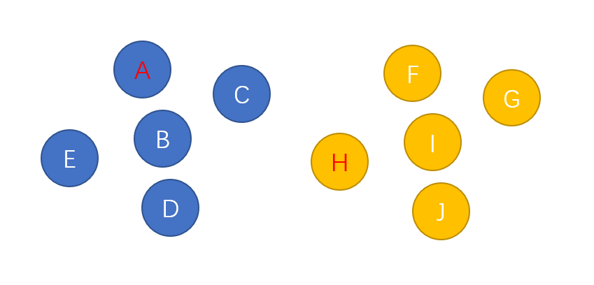

同样的，如果我们需要合并两个集合，就需要遍历整个黄色的集合，将里面的节点一个一个加入到蓝色集合中。两者都是 O (N) O(N) O(N) 的复杂度。

但倘若我们在生成集合的时候，就人为地将集合中的元素之间创建某种关联，使它们具有共同的头结点，那么查询和合并的操作将会省时很多。

就拿刚刚的两个集合举例，在创建集合的过程中，为节点之间创建 “联系”，形成如下图的结构：

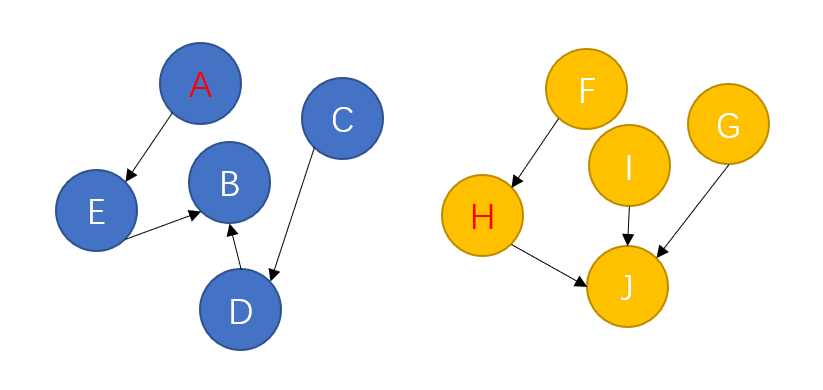

可以发现，最终生成的这个结构其实就是一个[树形结构](https://so.csdn.net/so/search?q=%E6%A0%91%E5%BD%A2%E7%BB%93%E6%9E%84&spm=1001.2101.3001.7020)。

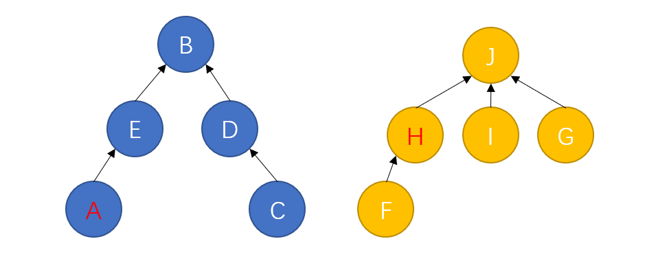

这也就意味着一个集合中的所有节点都可以找到同一个头结点。此时合并和查询操作将变得异常简单：

查询：只需要判断两个元素是否具有相同的头结点。  
合并：只需要将一个集合的头结点挂到另一个集合的头结点下即可。

可以发现，上述两个操作的时间复杂度都与 “获取头结点” 这一过程，也就是[树的高度](https://so.csdn.net/so/search?q=%E6%A0%91%E7%9A%84%E9%AB%98%E5%BA%A6&spm=1001.2101.3001.7020)有关。因此，假如生成的树只有有限高度的话，合并和查询的操作都是 O (1) O(1) O(1) 的时间复杂度。

但是话又说回来，假如生成的树的高度与集合元素个数相同，那合并和查询操作的时间复杂度就和遍历的方式差不多。

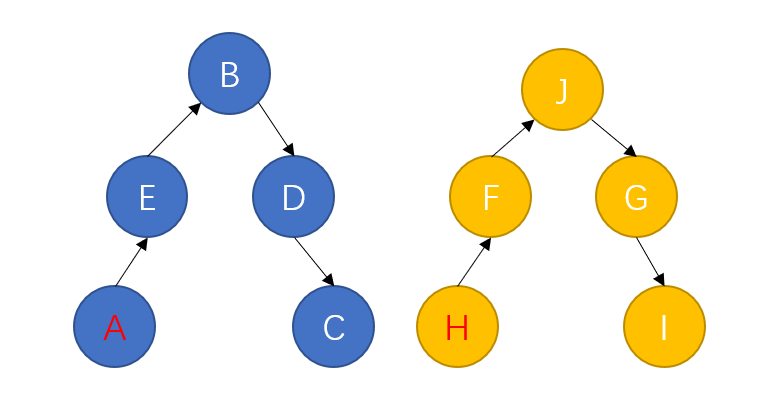

在上图所示的最差情况下，合并和查询的时间复杂度都是 O (N) O(N) O(N)。

因此，如何减少树的高度直接决定着并查集的性能如何。

那么如何尽量减少树的高度呢？

## 3 并查集的优化

### 3.1 按秩合并

在最原始的状态下，每个点自己就是一个集合，它们的指针都指向自己。就像是一片草原上的几个原始部落，一开始他们之间毫无瓜葛，各自为政，自己就是自己的主人。

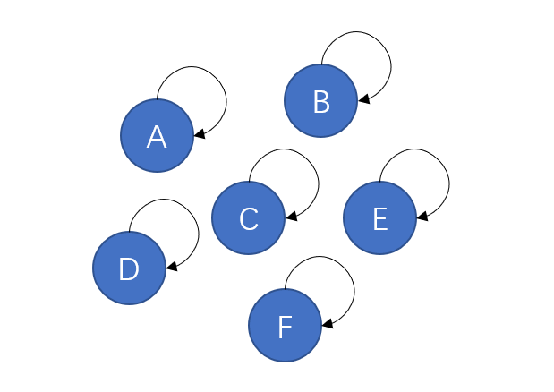

但这片草原一共就这么大点，随着某几个部落逐渐繁荣兴盛，他们的地盘也愈发显得局促，因此他们开始互相征战，吞并其他的部落形成更大的部落。在战争中落败的一方就认另一方作为首领。

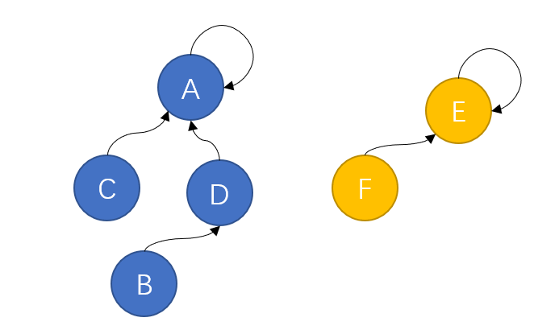

经过几轮兼并，现在草原上只剩下两个规模比较大的部落，此时两个部落继续进行战争，蓝色方凭借自身庞大的兵力轻松取胜，将黄色方纳入麾下，并形成如下的组织结构：

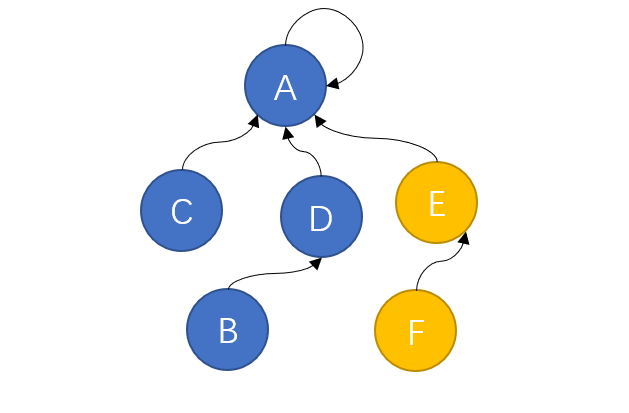

组织上离最高首领最远的 B、F 两个部落如果想要向 A 传达信息，只需要经过自己的上司 D 或 E 一个节点就可以。

但战争往往不总是尽如人意，黄色方偏偏就凭借战士们顽强的意志，拿下了这场战争的胜利，将蓝色方吞并。此时就会形成如下的组织结构：

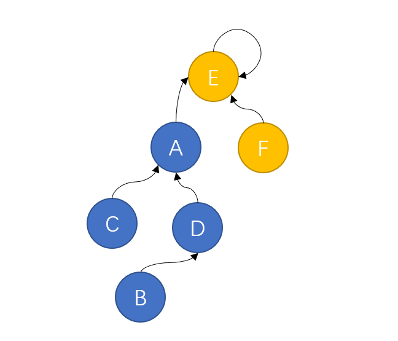

这时就出现问题了，距离最高首领最远的 B 如果想要向 E 传达消息，就需要经过 D、A 两个上司，这样的效率显然不如之前一种组织结构。

我们的并查集也是如此，当两棵深度不同的树进行合并时，往往将深度较小的树挂载到深度较大的树下，因为这样形成的树深度更小，在寻找头结点时也就有更高的效率。

**在执行合并操作时，将更小的树连接到更大的树上，这样的优化方式就称为 “按秩合并”**

### 3.2 路径压缩

随着部落日渐壮大，组织结构也越来越复杂，最底层的部落如果要向最高首领传递信息，需要经过好几个中间部落。此时我们的最高首领觉得自己的统治地位受到了威胁，因为中间经过的节点越多，自己对底层部落的控制力就越弱。所以他要想办法将底层部落的控制权全都收归自己所有。

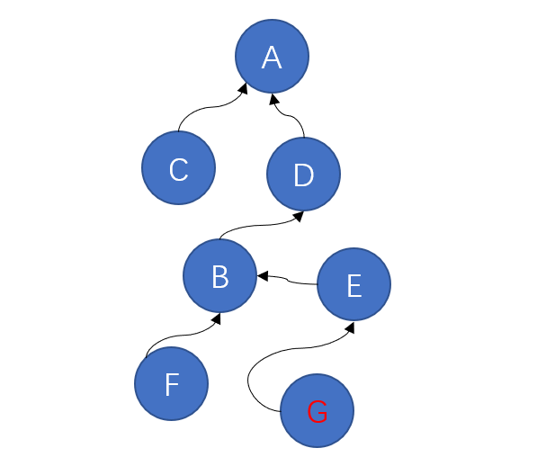

但首领并不知道自己麾下到底有多少部落，所以他颁布了一条法令：有任何部落要跟他汇报信息，都要带上他的上司一起来，他的上司也要带上他上司的上司。。。。并且以后他们都直接向最高首领进行汇报，不用再经过其他节点。

此时上图中的部落 G 想要向 A 汇报信息，沿途会经过 E、B、D，最后到达 A

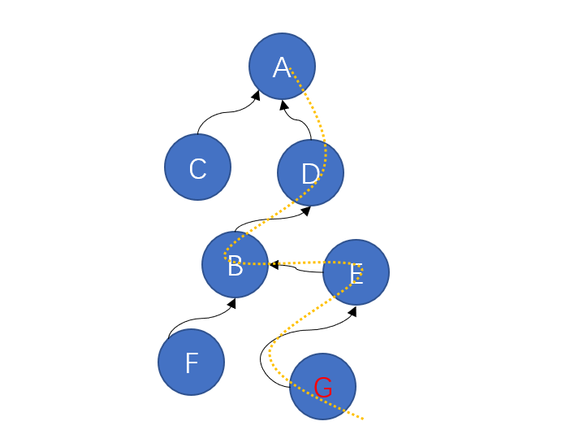

按照规定，从今往后，G、E、B、D 都直接向 A 汇报，无需再经过其他节点。

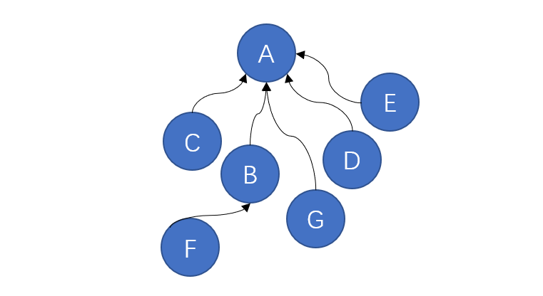

此时，树的高度就减小了很多，效率也会大大提升。

**在执行查找的过程中，扁平化树的结构，这样的优化方式称为 “路径压缩”**

在并查集中同时使用上面的这两种优化方法，会将查找与合并的平均时间复杂度降低到常数水平（渐进最优算法）。

## 4 代码实现

首先是最重要的查询头结点的操作，根据路径压缩的思想，在我们寻找头结点的过程中，需要把中途经过的节点记录下来，找到头结点后，再将它们挂载在头结点下。这一过程可以用栈或递归的方式来实现：

```Java
/**  
 * 获取头结点  
 * @param item  
 * @return  
 */  
private Element<T> getHead(Element<T> item){  
    Stack<Element<T>> stack = new Stack<>();  
    // 寻找头结点的过程中将节点加入栈  
    while(item != fatherMap.get(item)){  
        stack.push(item);  
        item = fatherMap.get(item);  
    }  
    // 依次出栈,将节点的父元素设置为头结点  
    while (!stack.isEmpty()){  
        fatherMap.put(stack.pop(),item);  
    }  
    return item;  
}
```

接下来就是合并操作了，根据按秩合并的思想，我们需要记录并查集中所有树的高度信息，在进行合并操作时，将高度较小的树挂载到高度较大的树下。这里使用了一张哈希表存储节点的子树高度：

```Java
/**  
 * 合并a和b所在的集合  
 * @param a  
 * @param b  
 */  
public void union(T a,T b){  
    if(nodesMap.containsKey(a) && nodesMap.containsKey(b)){  
        Element<T> node1 = getHead(nodesMap.get(a));  
        Element<T> node2 = getHead(nodesMap.get(b));  
        // 两个节点的头结点不相同  
        if(node1 != node2){  
            // 获取高度较大的那棵树  
            Element<T> big = heightMap.get(node1) > heightMap.get(node2) ? node1:node2;  
            // 获取高度较小的那棵树  
            Element<T> small = big==node1?node2:node1;  
            // 将小的合并入大的  
            fatherMap.put(small,big);  
            // 更新结果树的高度  
            heightMap.put(big, heightMap.get(big)+1);  
            // 将较小的那棵树的高度移除  
            heightMap.remove(small);  
        }  
    }  
}
```

最后就是查询操作，只需要判断两个节点对应的头结点是否相同即可：

```Java
/**  
 * 查询两个节点是否属于同一集合  
 * @param a  
 * @param b  
 * @return  
 */  
public boolean find(T a,T b){  
    // a和b需要在点集里  
    if(nodesMap.containsKey(a) && nodesMap.containsKey(b)){  
        // a的头节点与b的头结点是同一个节点  
        if(getHead(nodesMap.get(a))==getHead(nodesMap.get(b))){  
            return true;  
        }  
    }  
    return false;  
}
```

由于查询和合并操作都需要获取头结点，而执行获取头结点的方法时又进行了路径压缩，因此整个并查集结构是随着操作而不断调整优化的。即便数据量很大的情况下，并查集中生成的树的高度也不会很大，这也是它的时间复杂度能够达到 O (1) O(1) O(1) 的原因。

最后附上完整代码：

```Java
private static class Element<T>{  
    private T value;  
    public Element(T value) {  
        this.value = value;  
    }  
}  
  
public static class UnionFind<T>{  
    /**  
     * 值对应节点的哈希表  
     */  
    private HashMap<T,Element<T>> nodesMap;  
    /**  
     * 节点对应父节点的哈希表  
     */  
    private HashMap<Element<T>,Element<T>> fatherMap;  
    /**  
     * 节点对应树高度的哈希表  
     */  
    private HashMap<Element<T>,Integer> heightMap;  
  
    /**  
     * 构造函数  
     * @param list  
     */  
    public UnionFind(List<T> list) {  
        nodesMap = new HashMap<>();  
        fatherMap = new HashMap<>();  
        heightMap = new HashMap<>();  
        for (T item:list){  
            Element<T> ele = new Element<>(item);  
            nodesMap.put(item,ele);  
            fatherMap.put(ele,ele);  
            heightMap.put(ele,0);  
        }  
    }  
  
    /**  
     * 获取头结点  
     * @param item  
     * @return  
     */  
    private Element<T> getHead(Element<T> item){  
        Stack<Element<T>> stack = new Stack<>();  
        // 寻找头结点的过程中将节点加入栈  
        while(item != fatherMap.get(item)){  
            stack.push(item);  
            item = fatherMap.get(item);  
        }  
        // 依次出栈,将节点的父元素设置为头结点  
        while (!stack.isEmpty()){  
            fatherMap.put(stack.pop(),item);  
        }  
        return item;  
    }  
  
    /**  
     * 查询两个节点是否属于同一集合  
     * @param a  
     * @param b  
     * @return  
     */  
    public boolean find(T a,T b){  
        // a和b需要在点集里  
        if(nodesMap.containsKey(a) && nodesMap.containsKey(b)){  
            // a的头节点与b的头结点是同一个节点  
            if(getHead(nodesMap.get(a))==getHead(nodesMap.get(b))){  
                return true;  
            }  
        }  
        return false;  
    }  
  
    /**  
     * 合并a和b所在的集合  
     * @param a  
     * @param b  
     */  
    public void union(T a,T b){  
        if(nodesMap.containsKey(a) && nodesMap.containsKey(b)){  
            Element<T> node1 = getHead(nodesMap.get(a));  
            Element<T> node2 = getHead(nodesMap.get(b));  
            // 两个节点的头结点不相同  
            if(node1 != node2){  
                // 获取高度较大的那棵树  
                Element<T> big = heightMap.get(node1) > heightMap.get(node2) ? node1:node2;  
                // 获取高度较小的那棵树  
                Element<T> small = big==node1?node2:node1;  
                // 将小的合并入大的  
                fatherMap.put(small,big);  
                // 更新结果树的高度  
                heightMap.put(big, heightMap.get(big)+1);  
                // 将较小的那棵树的高度移除  
                heightMap.remove(small);  
            }  
        }  
    }  
  
    @Override  
    public String toString() {  
        String str = "";  
        for (Element<T> item : fatherMap.keySet()){  
            str+=item.value+" --> "+fatherMap.get(item).value+"\n";  
        }  
        return str;  
    }  
}
```
