> @Date    : 2023-05-07 16:40:19
>
> @Author  : Lewis Tian (taseikyo@gmail.com)
>
> @Link    : github.com/taseikyo

# 最容易懂得红黑树

> 原文：https://blog.csdn.net/sun_tttt/article/details/65445754 Sun_TTTT 2017-03-23 17:00:58

## 介绍

红黑树是一个平衡的二叉树，但不是一个完美的平衡二叉树（它是一 棵空树或它的左右两个子树的高度差的绝对值不超过 1, 并且左右两个子树都是一棵平衡二叉树）。虽然我们希望一个所有查找都能在～lgN 次比较内结束，但是这样在动态插入中保持树的完美平衡代价太高，所以，我们稍微放松逛一下限制，希望找到一个能在对数时间内完成查找的数据结构。这个时候，红黑树站了出来。

阅读以下需要了解普通二叉树的插入以及删除操作。
红黑树是在普通二叉树上，对没个节点添加一个颜色属性形成的，同时整个红黑二叉树需要同时满足一下五条性质：

1. 节点是红色或者是黑色；在树里面的节点不是红色的就是黑色的，没有其他颜色，要不怎么叫红黑树呢，是吧。
2. 根节点是黑色；根节点总是黑色的。它不能为红。
3. 每个叶节点（NIL 或空节点）是黑色；
4. 每个红色节点的两个子节点都是黑色的（也就是说不存在两个连续的红色节点）；就是连续的两个节点不能是连续的红色，连续的两个节点的意思就是父节点与子节点不能是连续的红色。
5. 从任一节点到其没个叶节点的所有路径都包含相同数目的黑色节点；

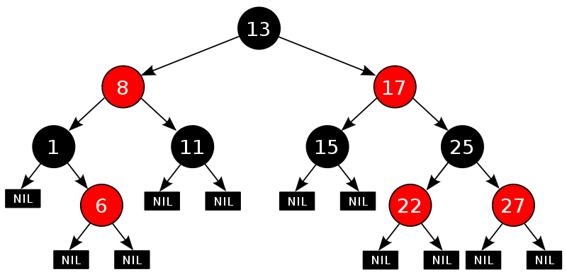

从根节点到每一个 NIL 节点的路径中，都包含了相同数量的黑色节点。  
这五条性质约束了红黑树，可以通过数学证明来证明，满足这五条性质的二叉树可以将查找删除维持在对数时间内。

## 旋转

当我们进行插入或者删除操作时所作的一切操作都是为了调整树使之符合这五条性质。  
下面我们先介绍两个基本操作，旋转。

旋转的目的是将节点多的一支出让节点给另一个节点少的一支，旋转操作在插入和删除操作中经常会用到，所以要熟记。

左旋：

右旋：  

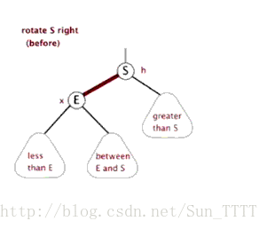

## 插入

我们先明确一下各节点的叫法

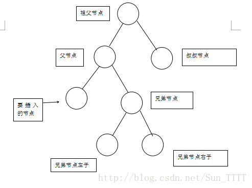

因为要满足红黑树的这五条性质，如果我们插入的是黑色节点，那就违反了性质五，需要进行大规模调整，如果我们插入的是红色节点，那就只有在要插入节点的父节点也是红色的时候违反性质四或者是当插入的节点是根节点时，违反性质二，所以，我们把要插入的节点的颜色变成红色。

下面是可能遇到的插入的几种状况：

1. 当插入的节点是根节点时，直接涂黑即可；
2. 当要插入的节点的父节点是黑色的时候。

这个时候违反了性质四，我们就需要进行调整操作，使之符合性质四，我们可以通过对祖父节点进行右旋同时将祖父节点和父节点的颜色进行互换，这样就变成了：

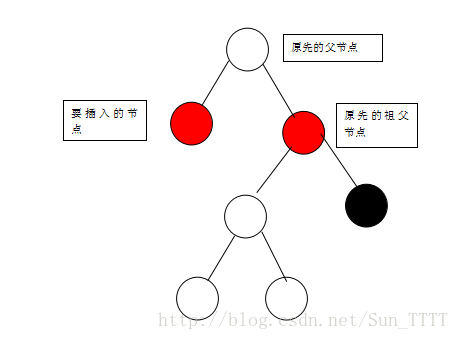

经过这样的调整可以符合性质四并且不对其他性质产生破坏。  
当插入的节点是父节点的右支的时候：

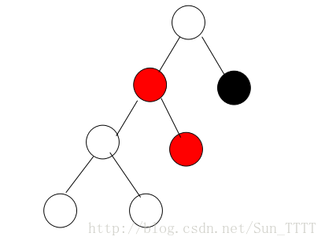

当要插入的节点是父节点的右支的时候，我们可以先对父节点进行左旋，变成如下：

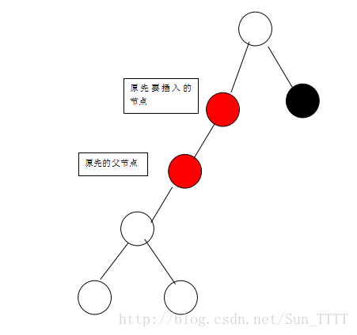

如果我们把原先的父节点看做是新的要插入的节点，把原先要插入的节点看做是新的父节点，那就变成了当要插入的节点在父节点的左支的情况，对，是的，就是按照当要插入的节点在父节点的左支的情况进行旋转，旋转完之后变成如下：

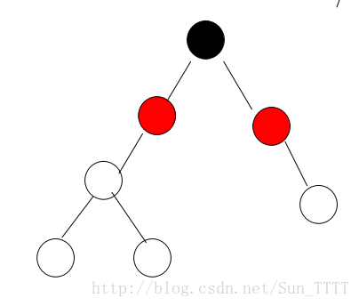

4、如果要插入的节点的父节点是红色且父节点是祖父节点的右支的时候；  
这个时候的情况跟情况 3 所表述的情况是一个镜像，将情况 3 的左和右互换一下就可以了。  
5、如果要插入的节点的父节点是红色并且叔叔节点也为红色，如下：

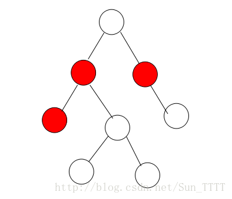
这个时候，只需将父亲节点和叔叔节点涂黑，将祖父节点涂红。

以上就是插入的全部过程。  
下面我们再讲讲删除的操作：

首先你要了解普通二叉树的删除操作：  
1. 如果删除的是叶节点，可以直接删除；  
2. 如果被删除的元素有一个子节点，可以将子节点直接移到被删除元素的位置；  
3. 如果有两个子节点，这时候就可以把被删除元素的右支的最小节点（被删除元素右支的最左边的节点）和被删除元素互换，我们把被删除元素右支的最左边的节点称之为后继节点（后继元素），然后在根据情况 1 或者情况 2 进行操作。如图：  
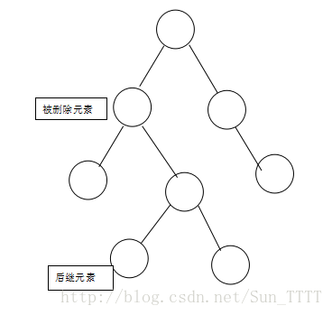
将被删除元素与其右支的最小元素互换，变成如下图所示：

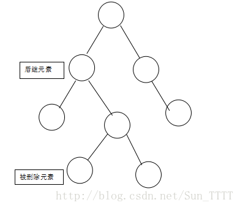
然后再将被删除元素删除：

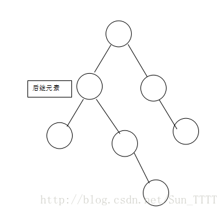

我们下面所称的被删除元素，**皆是指已经互换之后的被删除元素**。  
加入颜色之后，被删除元素和后继元素互换只是值得互换，并不互换颜色，这个要注意。

下面开始讲一下红黑树删除的规则：  
1. 当被删除元素为红时，对五条性质没有什么影响，直接删除。  
2. 当被删除元素为黑且为根节点时，直接删除。  
3. 当被删除元素为黑，且有一个右子节点为红时，将右子节点涂黑放到被删除元素的位置，如图：  
由  
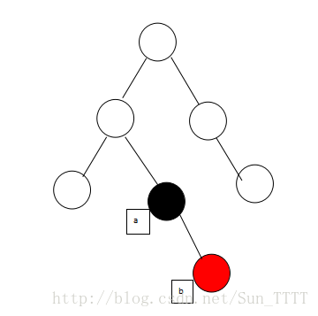
变成  
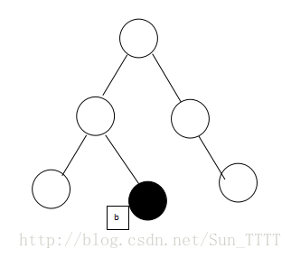

4. 当被删除元素为黑，且兄弟节点为黑，兄弟节点两个孩子也为黑，父节点为红，此时，交换兄弟节点与父节点的颜色；NIL 元素是指每个叶节点都有两个空的，颜色为黑的 NIL 元素，需要他的时候就可以把它看成两个黑元素，不需要的时候可以忽视他。  
如图：  
由  
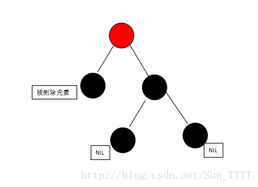
变成：  
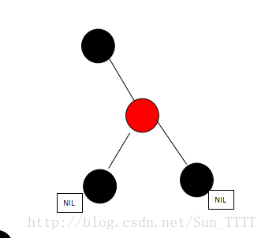
5. 当被删除元素为黑、并且为父节点的左支，且兄弟颜色为黑，兄弟的右支为红色，这个时候需要交换兄弟与父亲的颜色，并把父亲涂黑、兄弟的右支涂黑，并以父节点为中心左转。如图：  
由：

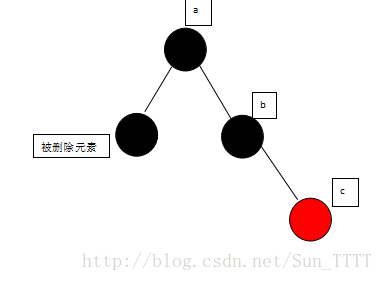
变成：

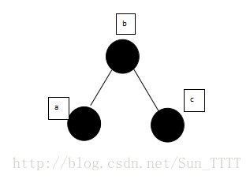
6. 当被删除元素为黑、并且为父节点的左支，且兄弟颜色为黑，兄弟的左支为红色，这个时候需要先把兄弟与兄弟的左子节点颜色互换，进行右转，然后就变成了规则 5 一样了，在按照规则 5 进行旋转。如图：  
由  
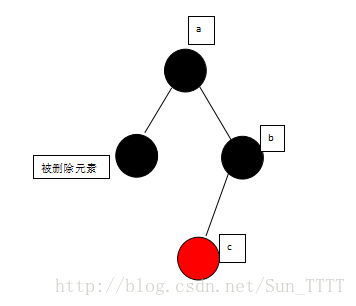
先兄弟与兄弟的左子节点颜色互换，进行右转，变成：

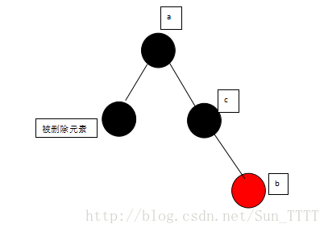
然后在按照规则 5 进行旋转，变成：  
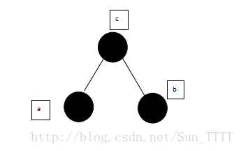
7. 当被删除元素为黑且为父元素的右支时，跟情况 5. 情况 6 互为镜像。  
8. 被删除元素为黑且兄弟节点为黑，兄弟节点的孩子为黑，父亲为黑，这个时候需要将兄弟节点变为红，再把父亲看做那个被删除的元素（只是看做，实际上不删除），看看父亲符和哪一条删除规则，进行处理变化如图：  
由：  
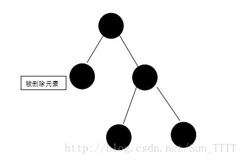
变成：  
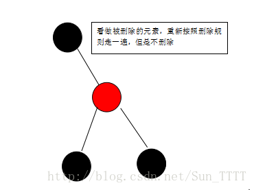
8. 当被删除的元素为黑，且为父元素的左支，兄弟节点为红色的时候，需要交换兄弟节点与父亲结点的颜色，以父亲结点进行左旋，就变成了情况 4，在按照情况四进行操作即可，变化如下：  
由：

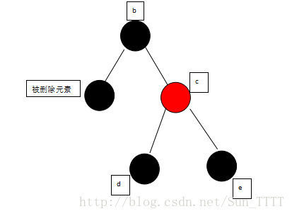
交换兄弟节点与父亲结点的颜色，以父亲结点进行左旋 变成：  
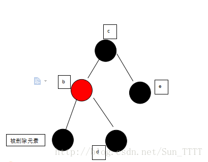
在按照情况四进行操作，变成：  
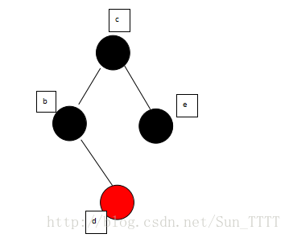

好了，删除的步骤也讲完，没有讲到的一点就是，在添加删除的时候，时刻要记得更改根元素的颜色为黑。  
这里并没有语言实现，只是讲了一下红黑树的插入删除步骤，你可以根据步骤自己把红黑树实现。

[点击这里](http://blog.chinaunix.net/uid-26548237-id-3480169.html)，照着规则一步一步的构建一个红黑树吧。

最后：  
1. 红黑树的实现其实是一个 2、3、4 树，只是将双节点或者三节点用红色进行了标示，如果你将红色节点放到和它父元素相同的高度，并把它和父元素看做是一个元素，你就会发现，变成了一个高度为 lgN 的二叉树，这个 2.3.4 树对红黑树很有启发意义。  
2. 上面的步骤其实可以不用死记硬背，是可以推导出来的，因为我们是把一个平衡但通过插入或者删除破坏了平衡的红黑树再次平衡，同过旋转让位，改变红黑颜色，使之符合那五条基本性质。比如遇到删除操作情况四的时候，我们可以把那个删除元素去除，发现左边比右边少一个黑元素，这个时候，怎么办，我们发现兄弟节点的子元素有一个红元素，操作这个不会影响那五条性质，所以我们通过变换颜色，旋转，即可让左右两边的的黑色数目一样。  
3. 旋转操作的目的是出让一个元素到另外的地方并且符合二叉树左小右大的性质，交换颜色的目的是为了保持红黑树的那五条性质。  
4. 要时刻记得 ，一切的操作都是为了保持那五条性质。

最后的最后，其实还有一种更为简单的红黑二叉树，这个简单的红黑二叉树实际上是一个 2.3 树，他只允许左节点为红节点，但是性能上肯定是不如这个红黑树。这个简单的红黑二叉树在《算法》第四版有介绍，掌握完之后再看这个简单的红黑二叉树，就会觉着简单 easy。  
最后的最后的最后，一定要尝试着自己推导一下插入删除规则啊，不然经常忘，是睡一觉起来再看就有点懵逼的那种忘。
