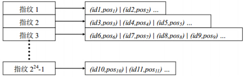
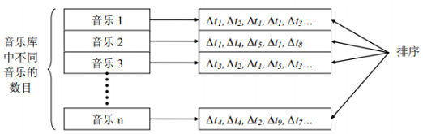
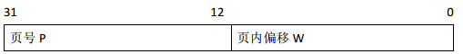
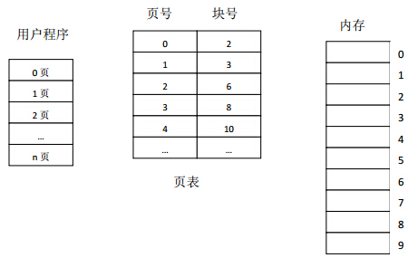
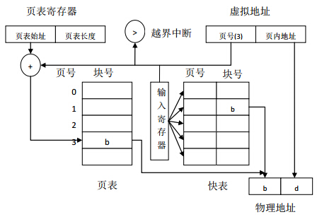
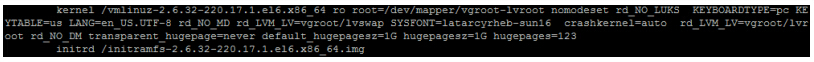
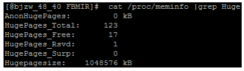
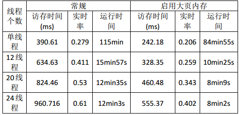

> @Date    : 2020-12-08 09:40:23
>
> @Author  : Lewis Tian (taseikyo@gmail.com)
>
> @Link    : github.com/taseikyo

# 大页内存（HugePages）在通用程序优化中的应用

为什么要保存这篇文章，因为作者较为详细的记录了他在实际工作中遇到的性能问题，以及如何用大页来进行解决的，最后得出结论：*只有耗费的内存巨大、访存随机而且访存是瓶颈的程序大页内存才会带来很明显的性能提升；...具有很好的访存局部性，采用大页内存很难获得性能提升。*，比较有说服性。

原来 GitHub 不支持 base64 编码的图片，本来想 "自己的垃圾自己处理" 的方式不增加 images 文件夹的图片数，谁知道会这样，明明本地显示没问题。

> 原文：https://blog.csdn.net/yutianzuijin/article/details/41912871 2014-12-13 20:04:04 [姚光超](https://blog.csdn.net/yutianzuijin)

## Table of Contents

- [1. 背景](#1-背景)
- [2. 基于指纹的音乐检索简介](#2-基于指纹的音乐检索简介)
- [3. 原理](#3-原理)
- [4. 小页的困境](#4-小页的困境)
- [5. 大页内存的配置和使用](#5-大页内存的配置和使用)
	- [1. 安装 libhugetlbfs 库](#1-安装-libhugetlbfs-库)
	- [2. 配置 grub 启动文件](#2-配置-grub-启动文件)
	- [3. mount](#3-mount)
	- [4. 运行应用程序](#4-运行应用程序)
- [6. 大页内存的优化效果](#6-大页内存的优化效果)
- [7. 大页内存的使用场景](#7-大页内存的使用场景)
- [8. 总结](#8-总结)

今天给大家介绍一种比较新奇的程序性能优化方法—大页内存（HugePages），简单来说就是通过增大操作系统页的大小来减小页表，从而避免快表缺失。这方面的资料比较贫乏，而且网上绝大多数资料都是介绍它在 Oracle 数据库中的应用，这会让人产生一种错觉：这种技术只能在 Oracle 数据库中应用。但其实，大页内存可以算是一种非常通用的优化技术，应用范围很广，针对不同的应用程序，最多可能会带来 50% 的性能提升，优化效果还是非常明显的。在本博客中，将通过一个具体的例子来介绍大页内存的使用方法。

在介绍之前需要强调一点，大页内存也有适用范围，程序耗费内存很小或者程序的访存局部性很好，大页内存很难获得性能提升。所以，如果你面临的程序优化问题有上述两个特点，请不要考虑大页内存。后面会详细解释为啥具有上述两个特点的程序大页内存无效。

## 1. 背景

近期一直在公司从事听歌识曲项目的开发，详细内容可参考：[基于指纹的音乐检索](http://blog.csdn.net/yutianzuijin/article/details/21547573)，目前已上线到[搜狗语音云开放平台](http://openspeech.sogou.com/Sogou/php/index.php)。在开发的过程中，遇到一个很严重的性能问题，单线程测试的时候性能还能达到要求，但是在多线程进行压力测试的时候，算法最耗时的部分突然变慢了好几倍！后来经过仔细调试，发现最影响性能的居然是一个编译选项 - pg，去掉它之后性能会好很多，但是还是会比单线程的性能慢 2 倍左右，这就会导致系统的实时率达到 1.0 以上，响应能力严重下降。

通过更加仔细的分析，我们发现系统最耗时的部分是访问指纹库的过程，但是这部分根本就没有优化余地，只能换用内存带宽更高的机器。换用内存带宽更高的机器确实带来了不少性能的提升，但是还是无法达到要求。就在山重水尽的情况下，无意中看到 MSRA 的洪春涛博士在[微博](http://weibo.com/hjk41)中提到他们用大页内存对一个随机数组的访问问题进行优化获得了很好的性能提升。然后就向他求助，终于通过大页内存这种方法使系统性能进一步提升，实时率也降到了 0.4 左右。圆满达成目标！

## 2. 基于指纹的音乐检索简介

检索过程其实和搜索引擎一样，音乐指纹就和搜索引擎中的关键词等价，指纹库就等价于搜索引擎的后台网页库。指纹库的构造和搜索引擎的网页库也是一样，采用倒排索引形式。如下图：



\**图 1 基于指纹的倒排索引表*

只不过指纹都是一个 int 型的整数（图示只占用了 24 位），包含的信息太少，所以需要提取很多个指纹完成一次匹配，大约是每秒几千个的样子。每获得一个指纹都需要访问指纹库获得对应的倒排列表，然后再根据音乐 id 构造一个正排列表，用来分析哪首音乐匹配上，如下图：



\**图 2 统计匹配的相似度*

最终的结果就是排序结果最高的音乐。

目前指纹库大约 60G，是对 25w 首歌提取指纹的结果。每一个指纹对应的倒排列表长度不固定，但是有上限 7500。正排列表的音乐个数也是 25w，每一首音乐对应的最长时间差个数为 8192。单次检索的时候会生成大约 1000 个左右的指纹（甚至更多）。

通过上面的介绍，可以看出基于指纹的音乐检索（听歌识曲）共有三部分：1. 提取指纹；2. 访问指纹库；3. 排序时间差。多线程情况下，这三部分的时间耗费比例大约是：1%、80% 和 19%，也即大部分时间都耗费在查找指纹库的操作上。更麻烦的一点是，指纹库的访问全部是乱序访问，没有一点局部性可言，所以 cache 一直在缺失，常规的优化方法都无效，只能换成内存带宽更高的服务器。

不过正是由于上述的特点—耗费内存巨大（100G 左右）、乱序访存且访存是瓶颈，导致大页内存特别适合来优化上面遇到的性能瓶颈问题。

## 3. 原理

大页内存的原理涉及到操作系统的虚拟地址到物理地址的转换过程。操作系统为了能同时运行多个进程，会为每个进程提供一个虚拟的进程空间，在 32 位操作系统上，进程空间大小为 4G，64 位系统为 2^64（实际可能小于这个值）。在很长一段时间内，我对此都非常疑惑，这样不就会导致多个进程访存的冲突吗，比如，两个进程都访问地址 0x00000010 的时候。事实上，每个进程的进程空间都是虚拟的，这和物理地址还不一样。两个进行访问相同的虚拟地址，但是转换到物理地址之后是不同的。这个转换就通过页表来实现，涉及的知识是操作系统的分页存储管理。

分页存储管理将进程的虚拟地址空间，分成若干个页，并为各页加以编号。相应地，物理内存空间也分成若干个块，同样加以编号。页和块的大小相同。假设每一页的大小是 4K，则 32 位系统中分页地址结构为：



为了保证进程能在内存中找到虚拟页对应的实际物理块，需要为每个进程维护一个映像表，即页表。页表记录了每一个虚拟页在内存中对应的物理块号，如图三。在配置好了页表后，进程执行时，通过查找该表，即可找到每页在内存中的物理块号。

在操作系统中设置有一个页表寄存器，其中存放了页表在内存的始址和页表的长度。进程未执行时，页表的始址和页表长度放在本进程的 PCB 中；当调度程序调度该进程时，才将这两个数据装入页表寄存器。

当进程要访问某个虚拟地址中的数据时，分页地址变换机构会自动地将有效地址（相对地址）分为页号和页内地址两部分，再以页号为索引去检索页表，查找操作由硬件执行。若给定的页号没有超出页表长度，则将页表始址与页号和页表项长度的乘积相加，得到该表项在页表中的位置，于是可以从中得到该页的物理块地址，将之装入物理地址寄存器中。与此同时，再将有效地址寄存器中的页内地址送入物理地址寄存器的块内地址字段中。这样便完成了从虚拟地址到物理地址的变换。



\**图 3 页表的作用*

由于页表是存放在内存中的，这使 CPU 在每存取一个数据时，都要两次访问内存。第一次时访问内存中的页表，从中找到指定页的物理块号，再将块号与页内偏移拼接，以形成物理地址。第二次访问内存时，才是从第一次所得地址中获得所需数据。因此，采用这种方式将使计算机的处理速度降低近 1/2。

为了提高地址变换速度，可在地址变换机构中，增设一个具有并行查找能力的特殊高速缓存，也即快表（TLB），用以存放当前访问的那些页表项。具有快表的地址变换机构如图四所示。由于成本的关系，快表不可能做得很大，通常只存放 16 ~ 512 个页表项。

上述地址变换机构对中小程序来说运行非常好，快表的命中率非常高，所以不会带来多少性能损失，但是当程序耗费的内存很大，而且快表命中率不高时，那么问题来了。



\**图 4 具有快表的地址变换机构*

## 4. 小页的困境

现代的计算机系统，都支持非常大的虚拟地址空间（2^32 ~ 2^64）。在这样的环境下，页表就变得非常庞大。例如，假设页大小为 4K，对占用 40G 内存的程序来说，页表大小为 10M，而且还要求空间是连续的。为了解决空间连续问题，可以引入二级或者三级页表。但是这更加影响性能，因为如果快表缺失，访问页表的次数由两次变为三次或者四次。由于程序可以访问的内存空间很大，如果程序的访存局部性不好，则会导致快表一直缺失，从而严重影响性能。

此外，由于页表项有 10M 之多，而快表只能缓存几百页，即使程序的访存性能很好，在大内存耗费情况下，快表缺失的概率也很大。那么，有什么好的方法解决快表缺失吗？大页内存！假设我们将页大小变为 1G，40G 内存的页表项也只有 40，快表完全不会缺失！即使缺失，由于表项很少，可以采用一级页表，缺失只会导致两次访存。这就是大页内存可以优化程序性能的根本原因—快表几乎不缺失！

在前面我们提到如果要优化的程序耗费内存很少，或者访存局部性很好，大页内存的优化效果就会很不明显，现在我们应该明白其中缘由。如果程序耗费内存很少，比如只有几 M，则页表项也很少，快表很有可能会完全缓存，即使缺失也可以通过一级页表替换。如果程序访存局部性也很好，那么在一段时间内，程序都访问相邻的内存，快表缺失的概率也很小。所以上述两种情况下，快表很难缺失所以大页内存就体现不出优势来。

## 5. 大页内存的配置和使用

网上很多资料在介绍大页内存的时候都会伴随它在 Oracle 数据库中的使用，这会让人产生一种错觉：大页内存只能在 Oracle 数据库中使用。通过上面的分析，我们可以知道，其实大页内存是一种很通用的优化技术。它的优化方法就是避免快表缺失。那么怎么具体应用呢，下面详细介绍使用的步骤。

### 1. 安装 libhugetlbfs 库

libhugetlbfs 库实现了大页内存的访问。安装可以通过 apt-get 或者 yum 命令完成，如果系统没有该命令，还可以从[官网](http://libhugetlbfs.sourceforge.net/)下载。

### 2. 配置 grub 启动文件

这一步很关键，决定着你分配的每个大页的大小和多少大页。具体操作是编辑 / etc/grub.conf 文件，如图五所示。



\**图 5 grub.conf 启动脚本*

具体就是在 kernel 选项的最后添加几个启动参数：transparent_hugepage=never default_hugepagesz=1G hugepagesz=1Ghugepages=123。这四个参数中，最重要的是后两个，hugepagesz 用来设置每页的大小，我们将其设置为 1G，其他可选的配置有 4K，2M（其中 2M 是默认）。如果操作系统版本太低的情况下，可能会导致 1G 的页设置失败，所以设置失败请查看自己操作系统的版本。hugepages 用来设置多少页大页内存，我们的系统内存是 128G，现在分配 123G 用来专门服务大页。这里需要注意，分配完的大页对常规程序来说是不可见的，例如我们的系统还剩余 5G 的普通内存，这时我如果按照常规方法启动一个耗费 10G 的程序就会失败。修改完 grub.conf 后，重启系统。然后运行命令 cat /proc/meminfo|grep Huge 命令查看大页设置是否生效，如果生效，将会显示如下内容：



\**图 6 当前的大页耗费情况*

我们需要关注其中的四个值，HugePages_Total 表示目前总共有多少个大页，HugePages_Free 表示程序运行起来之后还剩余多少个大页，HugePages_Rsvd 表示系统当前总共保留的 HugePages 数目，更具体点就是指程序已经向系统申请，但是由于程序还没有实质的 HugePages 读写操作，因此系统尚未实际分配给程序的 HugePages 数目。Hugepagesize 表示每个大页的大小，在此为 1GB。

我们在实验中发现一个问题，Free 的值和 Rsvd 的值可能和字面意思不太一样。如果一开始我们申请的大页不足以启动程序，系统就会提示如下错误：

ibhugetlbfs:WARNING: New heap segment map at 0x40000000 failed: Cannot allocate memory

此时，再次查看上述四个值会发现这样的情况：HugePages_Free 等于 a，HugePages_Rsvd 等于 a。这让人感到很奇怪，明明还有剩余的大页，但是系统报错，提示大页分配失败。经过多次尝试，我们认为 Free 中应该是包括 Rsvd 的大页的，所以当 Free 等于 Rsvd 的时候其实已经没有可用的大页了。Free 减 Rsvd 才是真正能够再次分配的大页。例如，在图六中还有 16 个大页可以被分配。

具体应该分配多少个大页合适，这个需要多次尝试，我们得到的一个经验是：子线程对大页的使用很浪费，最好是所有的空间都在主线程分配，然后再分配给各个子线程，这样会显著减少大页浪费。

### 3. mount

执行 mount，将大页内存映像到一个空目录。可以执行下述命令：

```Bash
if [ ! -d /search/music/libhugetlbfs ]; then
    mkdir /search/music/libhugetlbfs
fi
mount -t hugetlbfs hugetlbfs /search/music/libhugetlbfs
```

### 4. 运行应用程序

为了能启用大页，不能按照常规的方法启动应用程序，需要按照下面的格式启动：

HUGETLB_MORECORE=yesLD_PRELOAD=libhugetlbfs.so ./your_program

这种方法会加载 libhugetlbfs 库，用来替换标准库。具体的操作就是替换标准的 malloc 为大页的 malloc。此时，程序申请内存就是大页内存了。

按照上述四个步骤即可启用大页内存，所以启用大页还是很容易的。

## 6. 大页内存的优化效果

如果你的应用程序乱序访存很严重，那么大页内存会带来比较大的收益，正好我们现在做的听歌识曲就是这样的应用，所以优化效果很明显，下面是曲库为 25w 时，启用大页和不启用大页的程序性能。



可以看出，启用大页内存之后，程序的访问时间显著下降，性能提升接近 50%，达到了性能要求。

## 7. 大页内存的使用场景

任何优化手段都有它适用的范围，大页内存也不例外。前面我们一直强调，只有耗费的内存巨大、访存随机而且访存是瓶颈的程序大页内存才会带来很明显的性能提升。在我们的听歌识曲系统中，耗费的内存接近 100G，而且内存访问都是乱序访问，所以才带来明显的性能提升。网上的例子一直在用 Oracle 数据库作为例子不是没有道理的，这是因为 Oracle 数据库耗费的内存也很巨大，而且数据库的增删查改也缺乏局部性。数据库背后的增删查改基本上是对 B 树进行操作，树的操作一般缺少局部性。

什么样的程序局部性较差呢？我个人认为采用哈希和树策略实现的程序往往具有较差的访存局部性，这时如果程序性能不好可以尝试大页内存。相反，单纯的数组遍历或者图的广度遍历等操作，具有很好的访存局部性，采用大页内存很难获得性能提升。本人曾经尝试在搜狗语音识别解码器上启用大页内存，希望可以获得性能提升，但是效果令人失望，没有提升反而导致性能降低。这是因为语音识别解码器从本质上来讲就是一个图的广搜，具有很好的访存局部性，而且访存不是性能瓶颈，这时采用大页内存可能会带来其他开销，导致性能下降。

## 8. 总结

本博客以听歌识曲的例子详细介绍了大页内存的原理和使用方法。由于大数据的兴盛，目前应用程序处理的数据量越来越大，而且数据的访问越来越不规整，这些条件给大页内存的使用带来了可能。所以，如果你的程序跑得慢，而且满足大页内存的使用条件，那就尝试一下吧，反正很简单又没损失，万一能带来不错的效果呢。
