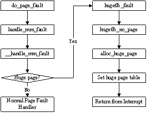

> @Date    : 2020-12-08 10:23:26
>
> @Author  : Lewis Tian (taseikyo@gmail.com)
>
> @Link    : github.com/taseikyo

# Linux 大页面使用与实现简介

developerWorks 中国 上的一些老博客质量是真的高，总有同一天我要全部保存下来。

> 原文：https://www.ibm.com/developerworks/cn/linux/l-cn-hugetlb/index.html 宏伟 唐 2009 年 9 月 10 日发布

## Table of Contents

- [引言](#引言)
- [Hugetlb FileSystem 的应用](#hugetlb-filesystem-的应用)
- [Hugetlb 特殊文件系统的内核实现](#hugetlb-特殊文件系统的内核实现)
	- [hugetlbfs 初始化](#hugetlbfs-初始化)
	- [在 hugetlbfs 中创建文件](#在-hugetlbfs-中创建文件)
	- [为 Hugetlb 文件建立映射](#为-hugetlb-文件建立映射)
	- [分配大页面、建立虚实映射](#分配大页面建立虚实映射)
- [小结](#小结)
- [相关主题](#相关主题)

## 引言

随着计算需求规模的不断增大，应用程序对内存的需求也越来越大。为了实现虚拟内存管理机制，操作系统对内存实行分页管理。自内存 “分页机制” 提出之始，内存页面的默认大小便被设置为 4096 字节（4KB），虽然原则上内存页面大小是可配置的，但绝大多数的操作系统实现中仍然采用默认的 4KB 页面。 4KB 大小的页面在 “分页机制” 提出的时候是合理的，因为当时的内存大小不过几十兆字节，然而当物理内存容量增长到几 G 甚至几十 G 的时候，操作系统仍然以 4KB 大小为页面的基本单位，是否依然合理呢？

在 Linux 操作系统上运行内存需求量较大的应用程序时，由于其采用的默认页面大小为 4KB，因而将会产生较多 TLB Miss 和缺页中断，从而大大影响应用程序的性能。当操作系统以 2MB 甚至更大作为分页的单位时，将会大大减少 TLB Miss 和缺页中断的数量，显著提高应用程序的性能。这也正是 Linux 内核引入大页面支持的直接原因。好处是很明显的，假设应用程序需要 2MB 的内存，如果操作系统以 4KB 作为分页的单位，则需要 512 个页面，进而在 TLB 中需要 512 个表项，同时也需要 512 个页表项，操作系统需要经历至少 512 次 TLB Miss 和 512 次缺页中断才能将 2MB 应用程序空间全部映射到物理内存；然而，当操作系统采用 2MB 作为分页的基本单位时，只需要一次 TLB Miss 和一次缺页中断，就可以为 2MB 的应用程序空间建立虚实映射，并在运行过程中无需再经历 TLB Miss 和缺页中断（假设未发生 TLB 项替换和 Swap）。

为了能以最小的代价实现大页面支持，Linux 操作系统采用了基于 hugetlbfs 特殊文件系统 2M 字节大页面支持。这种采用特殊文件系统形式支持大页面的方式，使得应用程序可以根据需要灵活地选择虚存页面大小，而不会被强制使用 2MB 大页面。本文将针对 hugetlb 大页面的应用和内核实现两个方面进行简单的介绍，以期起到抛砖引玉的作用。

## Hugetlb FileSystem 的应用

本文的例子摘自 Linux 内核源码中提供的有关说明文档 (`Documentation/vm/hugetlbpage.txt`) 。使用 hugetlbfs 之前，首先需要在编译内核 (make menuconfig) 时配置 `CONFIG_HUGETLB_PAGE` 和 `CONFIG_HUGETLBFS` 选项，这两个选项均可在 File systems 内核配置菜单中找到。

内核编译完成并成功启动内核之后，将 hugetlbfs 特殊文件系统挂载到根文件系统的某个目录上去，以使得 hugetlbfs 可以访问。命令如下：

```Bash
mount none /mnt/huge -t hugetlbfs
```

此后，只要是在 /mnt/huge/ 目录下创建的文件，将其映射到内存中时都会使用 2MB 作为分页的基本单位。值得一提的是，hugetlbfs 中的文件是不支持读 / 写系统调用 ( 如 `read()` 或 `write()` 等 ) 的，一般对它的访问都是以内存映射的形式进行的。为了更好地介绍大页面的应用，接下来将给出一个大页面应用的例子，该例子同样也是摘自于上述提到的内核文档，只是略有简化。

> 清单 1. Linux 大页面应用示例

```C
#include <fcntl.h>
#include <sys/mman.h>
#include <errno.h>

#define MAP_LENGTH (10*1024*1024)

int main() {
	int fd;
	void * addr;
	/* create a file in hugetlb fs */
	fd = open("/mnt/huge/test", O_CREAT | O_RDWR);
	if (fd < 0) {
		perror("Err: ");
		return -1;

	}
	/* map the file into address space of current application process */
	addr = mmap(0, MAP_LENGTH, PROT_READ | PROT_WRITE, MAP_SHARED, fd, 0);
	if (addr == MAP_FAILED) {
		perror("Err: ");
		close(fd);
		unlink("/mnt/huge/test");
		return -1;

	}
	/* from now on, you can store application data on huage pages via addr */
	munmap(addr, MAP_LENGTH);
	close(fd);
	unlink("/mnt/huge/test");
	return 0;
}
```

对于系统中大页面的统计信息可以在 Proc 特殊文件系统（/proc）中查到，如 `/proc/sys/vm/nr_hugepages` 给出了当前内核中配置的大页面的数目，也可以通过该文件配置大页面的数目，如：

```Bash
echo 20 > /proc/sys/vm/nr_hugepages
```

调整系统中的大页面的数目为 20 。 例子中给出的大页面应用是简单的，而且如果仅仅是这样的应用，对应用程序来说也是没有任何用处的。在实际应用中，为了使用大页面，还需要将应用程序与库 `libhugetlb` 链接在一起。`libhugetlb` 库对 `malloc()/free()` 等常用的内存相关的库函数进行了重载，以使得应用程序的数据可以放置在采用大页面的内存区域中，以提高内存性能。

## Hugetlb 特殊文件系统的内核实现

在简要介绍了大页面的使用之后，本文接下来将重点介绍 hugetlbfs 在内核中的实现。本文的源代码分析是基于 2.6.18.8 版本的 Linux 内核进行的。涉及到的文件主要包括 `mm/hugetlb.c` 和 `include/linux/hugetlb.h` 以及 `fs/__hugetlbfs/inode.c` 三个文件。为了能够更好地理解 hugetlbfs 的工作原理，将按照上述程序示例中给出的流程，介绍 hugetlb 特殊文件系统的初始化过程、在 hugetlbfs 伪文件系统中创建文件的内核处理流程，以及将 hugetlb 文件映射到用户地址空间的内核实现过程。

### hugetlbfs 初始化

Hugetlbfs 的初始化是通过函数`hugetlb_init()`完成的，该函数在系统初始化时执行。用于 hugetlbfs 的大页面是在这一初始化过程就分配好了的，并且在系统运行过程中不会被回收。初始化的过程大致如下：

1. 在 NUMA 机器上，每个 NUMA 节点 (node) 都有一个空闲 huge page 的链表，用数组 `hugepage_freelists[]`记录这些链表的头结构 (list_head)，每个 NUMA 节点对应数组的一个元素，在 hugetlb 伪文件系统初始化时，首先要初始化这些链表头结构。
2. 接下来，调用 `alloc_fresh_huge_page()` 在每个 NUMA node 中预分配大页面，并加入到上述的空闲页面链表中去，全局变量 `max_huge_pages` 记录了系统中支持的大页面的最大数目。在 `alloc_fresh_huge_page()` 中以 `_GFP_COMP` 为标志调用通用底层的物理页面分配函数 `alloc_page_node()` 以分配一个 2MB 的大页面，由于声明了`_GFP_COMP`标志，使得连续的 512 个 4KB 的页面作为一个 “混合” 页面，它们的 page 结构一起被分配给 hugetlbfs 。分配成功后，将这 512 个连续的 page 结构中的第二个 page 结构的 `lru.next` 指针指向一个特定的 “析构函数” —— `free_huge_page()`。
3. 最后调用 `put_page()` 将大页面放到相应的空闲链表中去，由于这个大页面被设置了 `PG_compound` 标志，进而会调用该析构函数，将页面放到该大页面所在 NUMA node 的 `hugepage_freelists[]` 链表中去。最后将 `max_huge_pages`、`free_huge_pages`（系统中空闲的大页面数目）以及 `nr_huge_pages`（系统中实际的大页面数目）等作为统计信息的全局变量初始化为成功预分配的大页面数目。

### 在 hugetlbfs 中创建文件

在示例代码中，首先调用 `open()` 系统调用在 hugetlbfs（`/mnt/huge`）创建了一个文件，相应地，在内核中由 `sys_open(）` 函数最终调用 `hugetlbfs_create()` 为该文件分配内存索引节点（`inode`）结构，并进行基本的初始化工作。其中值得一提的是，在 inode 初始化时将文件操作表指针 `inode->i_fop` 指向 hugetlbfs 特有的函数跳转表 `hugetlbfs_file_operations`，而此表中就包含了实现文件映射的 mmap 方法 `hugetlbfs_file_mmap()`，这个函数在系统调用 `sys_mmap()` 的实现中极为关键。

由于 hugetlbfs 是一个伪文件系统，在磁盘上没有相应的副本，因此在该文件系统中创建一个文件的过程也仅仅是分配虚拟文件系统（`VFS`）层的 inode、dentry 等结构。甚至连物理内存页面都不会分配，而是在对该文件映射后并访问时，才通过缺页中断进入内核分配大页面并建立虚实映射，这一过程将在 2.4 详细介绍。

### 为 Hugetlb 文件建立映射

在成功创建了 hugetlbfs 文件之后，就可以将其映射到应用进程的地址空间了，这是通过系统调用 `mmap()` 实现的。在内核中，`sys_mmap()` 调用 2.2 节中提到的函数跳转表中的 `hugetlbfs_file_mmap()` 方法为应用进程建立映射。

函数 `hugetlbfs_file_mmap()` 对虚存区域 (vma) 的偏移、边界等进行检查，并设置该 vma 的 `VM_HUGETLB` 和 `VM_RESERVED` 等标志，以区别于 4KB 映射的虚存区域，并且在进程运行过程中，该虚存区域映射的物理页面不会被回收。在这个过程中，虚拟地址并没有真正映射到物理地址空间，而这一工作则推迟到应用程序访问该内存区域并引发缺页中断（即 Page Fault）的时候进行，见 2.4 节。

### 分配大页面、建立虚实映射

以 4KB 为基本分页单位的 64 位 Linux 操作系统来采用四级页表管理虚实映射。如图 1 所示。每个页表项占据 64 位（8Bytes），因此每个作为页表的物理页面可以存放 512 个页表项，从而最末级页表所映射的物理内存大小为 512 * 4KB = 2MB，依此类推，在上一级页表（PMD）中，每一个 PMD 表项可映射 2MB 的物理内存。当采用 2MB 作为分页的基本单位时，内核中则设置了三级页表，如图 2 所示。在三级页表中，最末一级页表为 PMD 表，同样地，每一个 PMD 表项指出了一个 2MB 的大页面，也即虚拟地址的低 21 位作为大页面的页内偏移，而高位则作为大页面的页面编号（`pfn`）。为了能让 MMU 正确地进行虚实地址转换，必须告知 MMU 哪个页表项映射的是 4KB 的物理页面，哪个页表项映射的是 2MB 的大页面，这是通过页表项中的标志位 `_PAGE_PSE` 来区分的，这一般是通过内联函数 `pte_mkhuge()` 设置的。


\**图 1. 64 位 Linux 操作系统四级页表示意图*


\**图 2. 64 位 Linux 操作系统三级页表示意图*

简单介绍了采用大页面映射的页表组织后，下面将描述进程在设置为大页面的虚存区域产生 Page Fault 时的缺页中断处理流程，如图 3 所示：



\**图 3. 大页面缺页中断处理函数调用流程*

在进程访问到尚未建立虚实映射的大页面内存区域时，就会产生缺页中断，缺页中断的处理函数是大名鼎鼎的 `do_page_fault()` 函数。从 `do_page_fault()` 到函数 `__handle_mm_fault()` 是缺页中断处理的公共流程，不是我们关注的重点，在此不作介绍。在函数 `__handle_mm_fault()` 中首先会检查产生缺页中断的内存区域是否是大页面区域，即 `VM_HUGETLB` 标志是否设置，如果是，则调用函数 `hugetlb_fault()` 进行大页面的映射，这是大页面缺页中断处理的入口函数，其处理过程大致如下：

* hugetlb_fault()
    1. 根据产生 Page Fault 的虚拟地址查找或分配相应的 PMD 表项；
    2. 调用 `hugetlb_no_page()` 以分配物理内存、建立虚实映射；
    3. 如果引发缺页中断的内存操作是写操作，且该大页面被设置为只读，则预先做一次 Copy on Write 操作，以避免因 “违规操作” 再次产生 Page Fault 而影响性能。
* hugetlb_no_page()
    1. 在产生 Page Fault 的虚存区域所映射的 hugetlb 特殊文件的页面缓存（`PageCache`）中查找引发中断的虚拟地址所在的文件页面，如果找到则跳转到 3) ；
    2. 分配大页面，这是通过函数 `alloc_huge_page()` 完成的。分配成功后，将该页面加入到该 hugetlb 文件对应的 Page Cache 中，以便可以与其它进程共享该大页面。
    3. 设置相应的 PMD 表项，需要强调的是，为了区分大页面与 4KB 页面需要设置页表项的 `_PAGE_PSE` 标志位，使得 MMU 在进行虚实地址转换时能将此 PMD 表项作为最后一级映射，得到大页面的物理地址。
* alloc_huge_page()
    在 2.1 节提到，系统初始化时为每个 NUMA node 都初始化了相应的空闲大页面链表 —— `hugepage_freelists[]` ，并分配了全部的大页面，因此，在系统运行过程中分配大页面的操作即为从该链表中获取空闲大页面的过程。至于大页面的解除映射以及释放，与分配与建立映射的过程相反，在此不再赘述。

## 小结

Linux 基于 hugetlb 特殊文件系统的大页面支持为应用程序的灵活性和性能优化提供了方便。为了测试大页面对应用程序性能的影响，我们使用 Linpack 进行了一个简单的实验，实验结果表明，采用 hugetlb 大页面的情况下，Linpack 的性能相对于采用 4KB 页面时提升了 1 到 2 个百分点，这对于大规模的科学计算应用来说性能的提升是较为显著的。除了性能的显著提高外，简单的文件操作接口如 `open()`、`mmap()` 等也使得大页面机制简单易用。从总体上讲，通过 hugetlbfs 实现对大页面的支持是成功的。

但是，从本质上讲 hugetlbfs 的实现方式仅仅是一个通过 “打补丁” 的手段来支持灵活的内存页面大小，这主要是受限于 Linux 内核 “模块化” 的特征，为了尽可能少地影响到其它内核模块，hugetlbfs 无疑是一个很明智的选择，同时也注定了其无法实现对应用程序的透明性。

随着芯片制造工艺的不断进步，物理内存的容量会越来越大，因此 Linux 内核的内存分页基本单位的增大是一个必然的趋势。但如何做到对传统应用程序的完全透明性和与其它内核模块的兼容性，是实现上的难点。笔者在写作本文之前曾试图通过修改 Linux 内核中定义页面大小的宏（`PAGE_SIZE`）来实现透明的大页面支持，但内核中某些部分的代码仅仅支持 4KB 的页面大小，使得内核编译都无法通过，即使经过适当的修改勉强编译通过，内核也无法正常启动。因此可以预见的是，实现 Linux 内核透明的大页面支持将是一项繁杂的工作。

虚拟内存机制提出的动机就是解决内存容量限制的问题，而在今天内存容量已经渐渐地不再是一个限制，并且随着多核的发展，内存带宽明显地成为性能的瓶颈。在这样的发展趋势下，操作系统是否应该考虑新的内存管理方式？灵活的或者可配置的内存页面大小是否能够满足应用程序日益增长的内存需求？这些都是操作系统研发人员应该关注的问题。

## 相关主题

* Linux 内核源码（v2.6.18.8）[www.kernel.org](http://www.kernel.org/)。
* _HugeTLB - Large Page Support in the Linux Kernel._[R. Krishnakumar](http://linuxgazette.net/authors/krishnakumar.html)。
* 在 [developerWorks Linux 专区](http://www.ibm.com/developerworks/cn/linux/)寻找为 Linux 开发人员（包括 [Linux 新手入门](http://www.ibm.com/developerworks/cn/linux/newto/)）准备的更多参考资料，查阅我们[最受欢迎的文章和教程](http://www.ibm.com/developerworks/cn/linux/top10/index.html)。
* 在 developerWorks 上查阅所有 [Linux 技巧](http://www.ibm.com/developerworks/cn/views/linux/libraryview.jsp?search_by=Linux+%E6%8A%80%E5%B7%A7)和 [Linux 教程](http://www.ibm.com/developerworks/cn/views/linux/libraryview.jsp?type_by=%E6%95%99%E7%A8%8B)。
