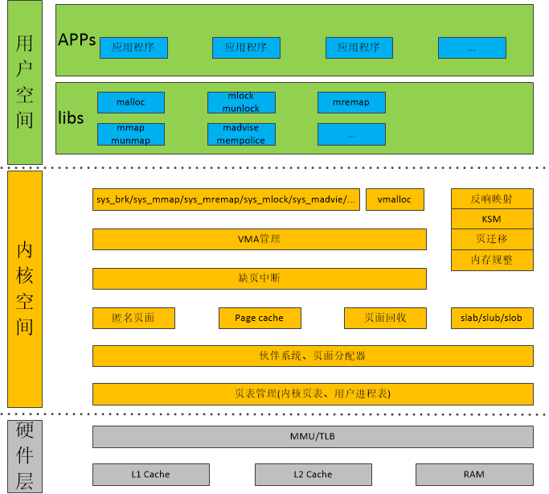

> @Date    : 2020-10-27 21:10:56
>
> @Author  : Lewis Tian (taseikyo@gmail.com)
>
> @Link    : github.com/taseikyo

# Linux 内存管理专题

> 原文：https://www.cnblogs.com/arnoldlu/p/8051674.html [Arnold Lu](https://www.cnblogs.com/arnoldlu) 2017-12-17 23:12

Linux 的内存管理涉及到的内容非常庞杂，而且与内核的方方面面耦合在一起，想要理解透彻非常困难。

在开始学习之前进行了一些准备工作《[如何展开 Linux Memory Management 学习？](http://www.cnblogs.com/arnoldlu/p/7977847.html)》

## Table of Contents

- [1 参考资料](#1-参考资料)
- [2 Linux Memory Management 框架图](#2-linux-memory-management-框架图)
- [3 代码和测试环境搭建](#3-代码和测试环境搭建)
	- [3.1 QEMU](#31-qemu)
	- [3.2 Busybox 1.24](#32-busybox-124)
	- [3.3 Kernel 4.0](#33-kernel-40)
	- [3.4 运行内核](#34-运行内核)
- [4 思考问答](#4-思考问答)

## 1 参考资料

遂决定以如下资料作为参考，进行 Linux 内存管理的研究：

《[奔跑吧 Linux 内核](http://www.epubit.com.cn/book/details/4835)》：以第 2 章为蓝本展开，这是目前能获取的紧跟当前内核发展 (Linux 4.0)，并且讲的比较全面的一本资料。

《[Understanding the Linux Virtual Memory Manager](https://www.kernel.org/doc/gorman/)》：简单说就是虽老但经典，基于 (Linux 2.4/2.6)。作者是目前仍然活跃在 Linux 社区 MM 专家。

《[wowotech Memory Management](http://www.wowotech.net/sort/memory_management)》：没有其他系列经典，也没有条理系列的介绍 MM，但是仍然值得按考。

《[tolimit Linux 内存源码分析](http://www.cnblogs.com/tolimit/)》：相对零散的介绍了内存相关分析文档

《[Linux Kernel v4.0](http://elixir.free-electrons.com/linux/v4.0/source)》：当然必不可少的，是源码了。

当逐渐深入看到 MMU 相关代码时，读一下 ARM 架构关于 MMU 的规格书有助于理解。

不然对于虚拟地址到物理地址的映射就会很虚无，这些资料包括《ARM Architecture Reference Manual ARMv7-A and ARMv7-R edition》的《Virtual Memory System Architecture》，以及相关 MMU TRM。

## 2 Linux Memory Management 框架图

 整个内存管理从宏观上可以分为三大部分：**用户空间、内核空间和相关硬件**。

**用户空间**主要是 libc 对相关系统调用进行封装，对用户程序提供 API，常用的有 malloc、mmap、munmap、remap、madvise、mempolicy 等等。

**相关硬件**包括 MMU/TLB、L1/L2 Cache 以及 DDR RAM，具体到 ARM 架构需要对照 MMU/L2 Cache 以及 RAM 规格书。

**内核空间**就复杂多了，首先介绍初始化及初始化后的布局。

[2.1 物理内存初始化](linux-memory-management-topics-1.md) 从获取内存大小、初始化页表，再进行 zone 初始化，然后在 zone 中使用伙伴系统进行物理内存初始化；

[2.2 页表的映射过程](linux-memory-management-topics-2.md) 讲述了 ARM32 和 ARM64 两种架构下的页表映射，如何从虚拟地址由 MMU 转化成物理页面地址的；

[2.3 内核内存的布局图](linux-memory-management-topics-3.md) 在内存被初始化之后，内核的内存布局基本上就确定了，ARM32 和 ARM64 下布局有很大区别。在 malloc 一节 brk 中介绍了用户空间的布局。

2.1\~2.3 是内存的一个静态状态，在有了这些基础之后，2.4\~2.9 按照从低层到上层的逐个介绍了。

[2.4 分配物理页面](linux-memory-management-topics-4.md) 介绍了基于伙伴系统的页分配和释放；

[2.5 slab 分配器](linux-memory-management-topics-5.md) 基于伙伴系统，slab 分配更小内存块；以及基于 slab 的 kmalloc；

[2.6 vmalloc](linux-memory-management-topics-6.md) 和 kmalloc 区别在于 v，即在 VMALLOC 区域分配；

[2.7 VMA](linux-memory-management-topics-7.md) 即 Virtual Memory Area，是进程内存管理的核心；

[2.8 malloc](linux-memory-management-topics-8.md) 和 [2.9 mmap](linux-memory-management-topics-9.md) 都基于 VMA，malloc/free 用于分配 / 释放一块内存；mmap/munmap 用于匿名 / 文件映射到用户空间。以及 [mmap(补充)](linux-memory-management-topics-9-1.md)。

由于 malloc/mmap 分配内存并不是立即分配，只是在用到的时候才会触发 [2.10 缺页中断处理](linux-memory-management-topics-10.md)。

在缺页但页不足的情况下，就需要进行一些操作调整内存，这些操作的基础是 [2.11 page 引用计数](linux-memory-management-topics-11.md) ，还有页面的 [2.12 反向映射 RMAP](linux-memory-management-topics-12.md)  技术。

在内存不足情况下触发 kswapd [2.13 回收页面](linux-memory-management-topics-13.md) ，其中匿名页面有着特殊的 [2.14 匿名页面生命周期](linux-memory-management-topics-14.md) 。

在 kswapd 回收依然无法满足内存分配，就需要对内存进行 [2.16 内存规整](linux-memory-management-topics-16.md) ，它依赖的技术是 [2.15 页面迁移](linux-memory-management-topics-15.md) 。

由于内存中存在一些内容完全一样的页面，使用 [2.17 KSM](linux-memory-management-topics-17.md) 技术进行合并，同时利用 COW 技术，在需要时重新分配。

还介绍了 [2.18 Dirty COW](linux-memory-management-topics-18.md)  内存漏洞，然后对内存管理数据结构和 API 进行了总结 [2.19 总结内存管理数据结构和 API](linux-memory-management-topics-19.md) 。

最后 [2.20 最新更新和展望](linux-memory-management-topics-20.md) 对新技术进行了介绍。

除了以上技术，还有如下内存技术：

- swap 计数把匿名页面写入 SWAP 分区从而释放出空闲页面
- 内存压缩技术 zram(a compressed RAM based swap device)
- zswap 技术是 zram 和 swap 的一个综合，首先将待换出页面进行压缩，存储到系统 RAM 动态分配的内存池中；达到一定阈值后再写入实际交换设备。
- 在内存极端不足情况下使用 [2.21 OOM](linux-memory-management-topics-21.md) (Out-Of-Memory) 来杀死不重要进程获取更多内存的技术
- 基于 cgroup 的 Memory 资源控制
- 解决多媒体对大量连续内存需求的 CMA(Contiguous Memory Allocator) 技术
- slub 分配器
- memory hotplug 内存热插拔支持动态更换内存物理设备

在对内存相关技术了解过后，就是如何运用的问题了？

一方面是对内存问题进行定位；另一方面是对内存行为施加影响，进行优化。

[2.22 内存检测技术](linux-memory-management-topics-22.md) 对 Linux 内存常见问题及其定位方法和工具 (slub_debug/kmemleak/kasan) 进行了讲解。

[2.23 一个内存 Oops 解析](linux-memory-management-topics-23.md) 以一个内存 Oops 为例，介绍了内存相关异常分析。

[2.24 进程占用的空间](linux-memory-management-topics-24.md)，介绍了 VSS/RSS/PSS/USS 四种进程的内存形式。【这个是我自己加的，原文没有，缺了 24 挺怪的】

[2.25 内存 sysfs 节点和工具](linux-memory-management-topics-25.md) 介绍了 linux 内存管理相关 sysfs 节点，以及工具；借助这些可以对内存进行优化。

扩展阅读：

- 关于 zram、zswap、zcache 的区别与各自优缺点《[zram vs zswap vs zcache Ultimate guide: when to use which one](https://askubuntu.com/questions/471912/zram-vs-zswap-vs-zcache-ultimate-guide-when-to-use-which-one)》



\**Linux 内存管理框架图*

## 3 代码和测试环境搭建

### 3.1 QEMU

安装 QEMU 以及相关编译工具

```Bash
sudo apt-get install qemu libncurses5-dev gcc-arm-linux-gnueabi build-essential
```

### 3.2 Busybox 1.24

下载 Busybox 1.24 代码：

```Bash
git clone https://github.com/arnoldlu/busybox.git -b 1_24_stable
```

编译 Busybox：

```Bash
export ARCH=arm
export CROSS_COMPILE=arm-linux-gnueabi-
#make menuconfig #P684，进行配置
make -j4 install
```

配置 initramfs：

```Bash
sudo cp -r running_kernel_initramfs/* _install/
sudo chmod +x _install/etc/init.d/rcS
cd _install
mkdir mnt
mkdir dev
cd dev
sudo mknod console c 5 1
sudo mknod null c 1 3
```

### 3.3 Kernel 4.0

下载 Linux Kernel 4.0 代码：

```Bash
git clone https://github.com/arnoldlu/linux.git -b running_kernel_4.0
```

编译 Linux Kernel：

```Bash
export ARCH=arm
export CROSS_COMPILE=arm-linux-gnueabi-
make vexpress_defconfig #P685进行配置
make bzImage -j4 ARCH=arm CROSS_COMPILE=arm-linux-gnueabi-
make dtbs
```

### 3.4 运行内核

```Bash
#Run Kernel+Busybox in QEMU
qemu-system-arm -M vexpress-a9 -smp 4 -m 1024M -kernel arch/arm/boot/zImage -append "rdinit=/linuxrc console=ttyAMA0 loglevel=8" -dtb arch/arm/boot/dts/vexpress-v2p-ca9.dtb -nographic
```

至此，已经有一个完整的环境，提供 shell 命令。

## 4 思考问答

1. 在系统启动时，ARM Linux 内核如何知道系统中有多大的内存空间？
2. 在 32bit Linux 内核中，用户空间和内核空间的比例通常是 3:1，可以修改成 2:2 吗？
3. 物理内存页面如何添加到伙伴系统中，是一页一页添加，还是以 2 的几次幂来加入呢？
4. 内核的一级页表存放在什么地方？二级页表又存放在什么地方？
5. 用户进程的一级页表存放在什么地方？二级页表呢？
6. 在 ARM32 系统中，页表是如何映射的？在 ARM64 系统中，页表又是如何映射的？
7. 请简述 Linux 内核在理想情况下页面分配器 (page allocator) 是如何分配出连续物理页面的。
8. 在页面分配器中，如何从分配掩码 (gfp_mask) 中确定可以从哪些 zone 中分配内存？
9. 页面分配器是按照什么方向来扫描 zone 的？
10. 为用户进程分配物理内存，分配掩码应该选用 GFP_KERNEL，还是 GFP_HIGHUSER_MOVABLE 呢？
11. slab 分配器是如何分配和释放小块内存的？
12. slab 分配器中有一个着色的概念 (cache color)，着色有什么作用？
13. slab 分配其中的 slab 对象有没有根据 Per-CPU 做一些优化？
14. slab 增长并导致大量不用的空闲对象，该如何解决？
15. 请问 kmalloc、vmalloc 和 malloc 之间有什么区别以及实现上的差异？
16. 使用用户态的 API 函数 malloc() 分配内存时，会马上为其分配物理内存吗？
17. 假设不考虑 libc 的因素，malloc 分配 100Byte，那么实际上内核是为其分配 100Byte 吗？
18. 假设两个用户进程打印的 malloc() 分配的虚拟地址是一样的，那么在内核中这两块虚拟内存是否打架了呢？
19. vm_normal_page() 函数返回的是什么样页面的 struct page 数据结构？为什么内存管理代码中需要这个函数？
20. 请简述 get_user_page() 函数的作用和实现流程？
21. 请简述 follow_page() 函数的作用和实现流程？
22. 请简述私有映射和共享映射的区别。
23. 为什么第二次调用 mmap 时，Linux 内核没有捕捉到地址重叠并返回失败呢？
24. struct page 数据结构中的_count 和_mapcount 有什么区别？
25. 匿名页面和 page cache 页面有什么区别？
26. struct page 数据结构中有一个锁，请问 trylock_page() 和 lock_page() 有什么区别？
27. 在 Linux 2.4.x 内核中，如何从一个 page 找到所有映射该页面的 VMA？反响映射可以带来哪些便利？
28. 阅读 Linux 4.0 内核 RMAP 机制的代码，画出父子进程之间 VMA、AVC、anon_vma 和 page 等数据结构之间的关系图。
29. 在 Linux 2.6.34 中，RMAP 机制采用了新的实现，在 Linux 2.6.33 和之前的版本中称为旧版本 RMAP 机制。那么在旧版本 RMAP 机制中，如果父进程有 1000 个子进程，每个子进程都有一个 VMA，这个 VMA 里面有 1000 个匿名页面，当所有的子进程的 VMA 同时发生写复制时会是什么情况呢？
30. 当 page 加入 lru 链表中，被其他线程释放了这个 page，那么 lru 链表如何知道这个 page 已经被释放了。
31. kswapd 内核线程何时会被唤醒？
32. LRU 链表如何知道 page 的活动频繁程度？
33. kswapd 按照什么原则来换出页面？
34. kswapd 按照什么方向来扫描 zone？
35. kswapd 以什么标准来退出扫描 LRU？
36. 手持设备例如 Android 系统，没有 swap 分区或者 swap 文件，kswapd 会扫描匿名页面 LRU 吗？
37. swappiness 的含义是什么？kswapd 如何计算匿名页面和 page cache 之间的扫描比重？
38. 当系统充斥着大量只访问一次的文件访问 (use-one streaming IO) 时，kswapd 如何来规避这种风暴？
39. 在回收 page cache 时，对于 dirty 的 page cache，kswapd 会马上回写吗？
40. 内核有哪些页面会被 kswapd 写回交换分区？
41. ARM32 Linux 如何模拟这个 Linux 版本的 L_PTE_YOUNG 比特位呢？
42. 如何理解 Refault Distance 算法？
43. 请简述匿名页面的生命周期。在什么情况下会产生匿名页面？在什么条件下会释放匿名页面？
44. KSM 是基于什么原理来合并页面的？
45. 在 KSM 机制里，合并过程中把 page 设置成写保护的函数 write_protect_page() 有这样一个判断：。这个判断的依据是什么？
46. 如果多个 VMA 的虚拟页面同时映射了同一个匿名页面，那么此时 page->index 应该等于多少？
47. 为什么 Dirty COW 小程序可以修改一个只读文件的内容？
48. 在 Dirty COW 内存漏洞中，如果 Diryt COW 程序没有 madviseThread 线程，即只有 procselfmemThread 线程，能否修改 foo 文件的内容呢？
49. 假设在内核空间获取了某个文件对应的 page cache 页面的 struct page 数据结构，而对应的 VMA 属性是只读，那么内核空间是否可以成功修改该文件呢？
50. 如果用户进程使用只读属性 (PROT_READ) 来 mmap 映射一个文件到用户空间，然后使用 memcpy 来写这段内存空间，会是什么样的情况？
51. 请画出内存管理中常用的数据结构的关系图，如 mm_struct、vma、vaddr、page、pfn、pte、zone、paddr 和 pg_data 等，并思考如下转换关系。
52. 请画出在最糟糕的情况下分配若干个连续物理页面的流程图。
53. 在 Android 中新添加了 LMK(Low Memory Killer)，请描述 LMK 和 OOM Killer 之间的关系。
54. 请描述一致性 DMA 映射 dma_alloc_coherent() 函数在 AEM 中是如何管理 cache 一致性的？
55. 请描述流式 DMA 映射 dma_map_single() 函数在 ARM 中是如何管理 cache 一致性的？
56. 为什么在 Linux 4.8 内核中要把基于 zone 的 LRU 链表机制迁移到基于 Node 呢？
