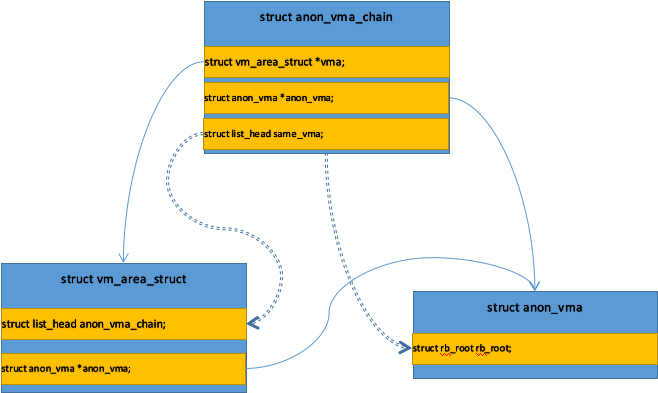

> @Date    : 2020-10-28 16:43:46
>
> @Author  : Lewis Tian (taseikyo@gmail.com)
>
> @Link    : github.com/taseikyo

# Linux 内存管理（15）反向映射 RMAP

> 原文：https://www.cnblogs.com/arnoldlu/p/8335483.html 2018-02-05 19:07

专题：[Linux 内存管理专题](linux-memory-management-topics-0.md)

关键词：RMAP、VMA、AV、AVC。

## Table of Contents

- [1 父进程分配匿名页面](#1-父进程分配匿名页面)
- [2 父进程创建子进程](#2-父进程创建子进程)
- [3 子进程发生 COW](#3-子进程发生-cow)
- [4 RMAP 应用](#4-rmap-应用)

所谓反向映射是相对于从虚拟地址到物理地址的映射，反向映射是从物理页面到虚拟地址空间 VMA 的反向映射。

RMAP 能否实现的基础是通过 struct anon_vma、struct anon_vma_chain 和 sturct vm_area_struct 建立了联系，通过物理页面反向查找到 VMA。

用户在使用虚拟内存过程中，PTE 页表项中保留着虚拟内存页面映射到物理内存页面的记录。

一个物理页面可以同时被多个进程的虚拟地址内存映射，但一个虚拟页面同时只能有一个物理页面与之映射。

不同虚拟页面同时映射到同一物理页面是因为子进程克隆父进程 VMA，和 KSM 机制的存在。

如果页面要被回收，就必须要找出哪些进程在使用这个页面，然后断开这些虚拟地址到物理页面的映射。

匿名页面实际的断开映射操作在 rmap_walk_anon 中进行的，可以看出从 struct page、到 struct anon_vma、到 struct anon_vma_chain、到 struct vm_area_struct 的关系。

## 1 父进程分配匿名页面

父进程为自己的进程地址空间 VMA 分配物理内存时，通常会产生匿名页面。

do_anonymous_page() 会分配匿名页面；do_wp_page() 发生写时复制 COW 时也会产生一个新的匿名页面。

```C
static int do_anonymous_page(struct mm_struct *mm, struct vm_area_struct *vma,
        unsigned long address, pte_t *page_table, pmd_t *pmd,
        unsigned int flags)
{
...
    /* Allocate our own private page. */
    if (unlikely(anon_vma_prepare(vma))) // 为进程地址空间准备struct anon_vma数据结构和struct anon_vma_chain链表
        goto oom;
    page = alloc_zeroed_user_highpage_movable(vma, address); // 从HIGHMEM区域分配一个zeroed页面
    if (!page)
        goto oom;
...
    inc_mm_counter_fast(mm, MM_ANONPAGES);
    page_add_new_anon_rmap(page, vma, address);-----------------------
    mem_cgroup_commit_charge(page, memcg, false);
    lru_cache_add_active_or_unevictable(page, vma);
...
}
```

RMAP 反向映射系统中有两个重要的数据结构：一个是 struct anon_vma，简称 AV；一个是 struct anon_vma_chain，简称 AVC。

```C
struct anon_vma {
    struct anon_vma *root;        /* Root of this anon_vma tree */ // 指向anon_vma数据机构中的根节点
    struct rw_semaphore rwsem;    /* W: modification, R: walking the list */ // 保护anon_vma中链表的读写信号量
    /*
     * The refcount is taken on an anon_vma when there is no
     * guarantee that the vma of page tables will exist for
     * the duration of the operation. A caller that takes
     * the reference is responsible for clearing up the
     * anon_vma if they are the last user on release
     */
    atomic_t refcount; // 对anon_vma的引用计数

    /*
     * Count of child anon_vmas and VMAs which points to this anon_vma.
     *
     * This counter is used for making decision about reusing anon_vma
     * instead of forking new one. See comments in function anon_vma_clone.
     */
    unsigned degree;

    struct anon_vma *parent;    /* Parent of this anon_vma */ // 指向父anon_vma数据结构

    /*
     * NOTE: the LSB of the rb_root.rb_node is set by
     * mm_take_all_locks() _after_ taking the above lock. So the
     * rb_root must only be read/written after taking the above lock
     * to be sure to see a valid next pointer. The LSB bit itself
     * is serialized by a system wide lock only visible to
     * mm_take_all_locks() (mm_all_locks_mutex).
     */
    struct rb_root rb_root;    /* Interval tree of private "related" vmas */ // 红黑树根节点
}
```

struct anon_vma_chain 数据结构是链接父子进程的枢纽：

```C
struct anon_vma_chain {
    struct vm_area_struct *vma; // 指向VMA
    struct anon_vma *anon_vma; // 指向anon_vma数据结构，可以指向父进程或子进程的anon_vma数据结构
    struct list_head same_vma;   /* locked by mmap_sem & page_table_lock */ // 链表节点，通常把anon_vma_chain添加到vma->anon_vma_chain链表中
    struct rb_node rb;            /* locked by anon_vma->rwsem */ // 红黑树节点，通常把anon_vma_chain添加到anon_vma->rb_root的红黑树中
    unsigned long rb_subtree_last;
#ifdef CONFIG_DEBUG_VM_RB
    unsigned long cached_vma_start, cached_vma_last;
#endif
}
```

下面分析如何建立 AV、AVC、VMA 之间的关系： 

```C
int anon_vma_prepare(struct vm_area_struct *vma) {
    struct anon_vma *anon_vma = vma->anon_vma; // vma->anon_vma指向struct anon_vma数据结构
    struct anon_vma_chain *avc;

    might_sleep();
    if (unlikely(!anon_vma)) {
        struct mm_struct *mm = vma->vm_mm;
        struct anon_vma *allocated;

        avc = anon_vma_chain_alloc(GFP_KERNEL); // 分配一个struct anon_vma_chain结构
        if (!avc)
            goto out_enomem;

        anon_vma = find_mergeable_anon_vma(vma); // 是否可以和前后vma合并
        allocated = NULL;
        if (!anon_vma) {
            anon_vma = anon_vma_alloc(); // 如果无法合并，则重新分配一个结构体
            if (unlikely(!anon_vma))
                goto out_enomem_free_avc;
            allocated = anon_vma;
        }

        anon_vma_lock_write(anon_vma);
        /* page_table_lock to protect against threads */
        spin_lock(&mm->page_table_lock);
        if (likely(!vma->anon_vma)) {
            vma->anon_vma = anon_vma; // 建立 struct vm_area_struct 和 struct anon_vma 关联
            anon_vma_chain_link(vma, avc, anon_vma); // 建立 struct anon_vma_chain 和其他结构体的关系
            /* vma reference or self-parent link for new root */
            anon_vma->degree++;
            allocated = NULL;
            avc = NULL;
        }
        spin_unlock(&mm->page_table_lock);
        anon_vma_unlock_write(anon_vma);

        if (unlikely(allocated))
            put_anon_vma(allocated);
        if (unlikely(avc))
            anon_vma_chain_free(avc);
    }
    return 0;

 out_enomem_free_avc:
    anon_vma_chain_free(avc);
 out_enomem:
    return -ENOMEM;
}
```

至此已经建立 struct vm_area_struct、struct anon_vma、struct anon_vma_chain 三者之间的链接，并插入相应链表、红黑树中。

从 AVC 可以轻松找到 VMA 和 AV；AV 可以通过红黑树找到 AVC，然后发现所有红黑树中的 AV；VMA 可以直接找到 AV，也可以通过 AVC 链表找到 AVC。



```C
static void anon_vma_chain_link(struct vm_area_struct *vma,
                struct anon_vma_chain *avc,
                struct anon_vma *anon_vma)
{
    avc->vma = vma; // 建立struct anon_vma_chain和struct vm_area_struct关联
    avc->anon_vma = anon_vma; // 建立struct anon_vma_chain和struct anon_vma关联
    list_add(&avc->same_vma, &vma->anon_vma_chain); // 将AVC添加到struct vm_area_struct->anon_vma_chain链表中
    anon_vma_interval_tree_insert(avc, &anon_vma->rb_root); // 将AVC添加到struct anon_vma->rb_root红黑树中
}
```

调用 alloc_zeroed_user_highpage_movable 分配物理内存之后，调用 page_add_new_anon_rmap 建立 PTE 映射关系

```C
void page_add_new_anon_rmap(struct page *page,
    struct vm_area_struct *vma, unsigned long address)
{
    VM_BUG_ON_VMA(address < vma->vm_start || address >= vma->vm_end, vma);
    SetPageSwapBacked(page); // 设置PG_SwapBacked表示这个页面可以swap到磁盘。
    atomic_set(&page->_mapcount, 0); /* increment count (starts at -1) */ // 设置_mapcount引用计数为0
    if (PageTransHuge(page))
        __inc_zone_page_state(page, NR_ANON_TRANSPARENT_HUGEPAGES);
    __mod_zone_page_state(page_zone(page), NR_ANON_PAGES, //增加页面所在zone的匿名页面计数
            hpage_nr_pages(page));
    __page_set_anon_rmap(page, vma, address, 1); // 设置这个页面位匿名映射
}

static void __page_set_anon_rmap(struct page *page,
    struct vm_area_struct *vma, unsigned long address, int exclusive)
{
    struct anon_vma *anon_vma = vma->anon_vma;

    BUG_ON(!anon_vma);

    if (PageAnon(page)) // 判断当前页面是否是匿名页面PAGE_MAPPING_ANON
        return;

    /*
     * If the page isn't exclusively mapped into this vma,
     * we must use the _oldest_ possible anon_vma for the
     * page mapping!
     */
    if (!exclusive)
        anon_vma = anon_vma->root;

    anon_vma = (void *) anon_vma + PAGE_MAPPING_ANON;
    page->mapping = (struct address_space *) anon_vma; // mapping指定页面所在的地址空间，这里指向匿名页面的地址空间数据结构struct anon_vma
    page->index = linear_page_index(vma, address);
}
```

结合上图，总结如下：

- 父进程每个 VMA 都有一个 anon_vma 数据结构，vma->anon_vma 指向和 VMA 相关的物理页面，page->mapping 都指向 anon_vma
- AVC 数据结构 anon_vma_chain->vma 指向 VMA，anon_vma_chain->anon_vma 指向 AV
- AVC 添加到 VMA->anon_vma_chain 链表中
- AVC 添加到 AV->anon_vma 红黑树中

## 2 父进程创建子进程

父进程通过 fork 系统调用创建子进程时，子进程会复制父进程的进程地址空间 VMA 数据结构作为自己的进程地址空间，并且会复制父进程的 PTE 页表项内容到子进程的页表中，实现父子进程共享页表。

多个不同子进程中的虚拟页面会同时映射到同一个物理页面，另外多个不相干进程虚拟页面也可以通过 KSM 机制映射到同一个物理页面。

fork() 系统调用实现在 kernel/fork.c 中，在 dup_mmap() 中复制父进程的地址空间和父进程的 PTE 页表项：

```C
static int dup_mmap(struct mm_struct *mm, struct mm_struct *oldmm) {
    struct vm_area_struct *mpnt, *tmp, *prev, **pprev;
    struct rb_node **rb_link, *rb_parent;
    int retval;
    unsigned long charge;

    uprobe_start_dup_mmap();
    down_write(&oldmm->mmap_sem);
    flush_cache_dup_mm(oldmm);
    uprobe_dup_mmap(oldmm, mm);
    /*
     * Not linked in yet - no deadlock potential:
     */
    down_write_nested(&mm->mmap_sem, SINGLE_DEPTH_NESTING);

    mm->total_vm = oldmm->total_vm;
    mm->shared_vm = oldmm->shared_vm;
    mm->exec_vm = oldmm->exec_vm;
    mm->stack_vm = oldmm->stack_vm;

    rb_link = &mm->mm_rb.rb_node;
    rb_parent = NULL;
    pprev = &mm->mmap;
    retval = ksm_fork(mm, oldmm);
    if (retval)
        goto out;
    retval = khugepaged_fork(mm, oldmm);
    if (retval)
        goto out;

    prev = NULL;
    for (mpnt = oldmm->mmap; mpnt; mpnt = mpnt->vm_next) { // for循环遍历父进程的进程地址空间VMA
        struct file *file;

        if (mpnt->vm_flags & VM_DONTCOPY) {
            vm_stat_account(mm, mpnt->vm_flags, mpnt->vm_file,
                            -vma_pages(mpnt));
            continue;
        }
        charge = 0;
        if (mpnt->vm_flags & VM_ACCOUNT) {
            unsigned long len = vma_pages(mpnt);

            if (security_vm_enough_memory_mm(oldmm, len)) /* sic */
                goto fail_nomem;
            charge = len;
        }
        tmp = kmem_cache_alloc(vm_area_cachep, GFP_KERNEL);
        if (!tmp)
            goto fail_nomem;
        *tmp = *mpnt; // 复制父进程地址空间VMA到刚创建的子进程tmp中。
        INIT_LIST_HEAD(&tmp->anon_vma_chain);
        retval = vma_dup_policy(mpnt, tmp);
        if (retval)
            goto fail_nomem_policy;
        tmp->vm_mm = mm;
        if (anon_vma_fork(tmp, mpnt)) // 为子进程创建相应的anon_vma数据结构。
            goto fail_nomem_anon_vma_fork;
        tmp->vm_flags &= ~VM_LOCKED;
        tmp->vm_next = tmp->vm_prev = NULL;
        file = tmp->vm_file;
...
        __vma_link_rb(mm, tmp, rb_link, rb_parent); // 把VMA添加到子进程红黑树中。
        rb_link = &tmp->vm_rb.rb_right;
        rb_parent = &tmp->vm_rb;

        mm->map_count++;
        retval = copy_page_range(mm, oldmm, mpnt); // 复制父进程的PTE页表项到子进程页表中。

        if (tmp->vm_ops && tmp->vm_ops->open)
            tmp->vm_ops->open(tmp);

        if (retval)
            goto out;
    }
...
}
```

## 3 子进程发生 COW

如果子进程的 VMA 发生 COW，那么会使用子进程 VMA 创建的 anon_vma 数据结构，即 page->mmaping 指针指向子进程 VMA 对应的 anon_vma 数据结构。

在 do_wp_page() 函数中处理 COW 场景情况：子进程和父进程共享的匿名页面，子进程的 VMA 发生 COW。

```
->发生缺页中断
    ->handle_pte_fault
        ->do_wp_page
            ->分配一个新的匿名页面
                ->__page_set_anon_rmap 使用子进程的anon_vma来设置page->mapping
```

## 4 RMAP 应用

内核中通过 struct page 找到所有映射到这个页面的 VMA 典型场景有：

- kswapd 内核线程回收页面需要断开所有映射了该匿名页面的用户 PTE 页表项
- 页面迁移时，需要断开所有映射到匿名页面的用户 PTE 页表项。

try_to_unmap() 是反向映射的核心函数，内核中其他模块会调用此函数来断开一个页面的所有映射：

```C
/**
 * try_to_unmap - try to remove all page table mappings to a page
 * @page: the page to get unmapped
 * @flags: action and flags
 *
 * Tries to remove all the page table entries which are mapping this
 * page, used in the pageout path.  Caller must hold the page lock.
 * Return values are:
 *
 * SWAP_SUCCESS    - we succeeded in removing all mappings // 成功解除了所有映射的PTE。
 * SWAP_AGAIN    - we missed a mapping, try again later // 可能错过了一个映射的PTE，需要重来一次。
 * SWAP_FAIL    - the page is unswappable // 失败
 * SWAP_MLOCK    - page is mlocked. // 页面被锁住了
 */
int try_to_unmap(struct page *page, enum ttu_flags flags)
{
    int ret;
    struct rmap_walk_control rwc = {
        .rmap_one = try_to_unmap_one, // 具体断开某个VMA上映射的pte
        .arg = (void *)flags,
        .done = page_not_mapped, // 判断一个页面是否断开成功的条件
        .anon_lock = page_lock_anon_vma_read, // 锁
    };

    VM_BUG_ON_PAGE(!PageHuge(page) && PageTransHuge(page), page);

    /*
     * During exec, a temporary VMA is setup and later moved.
     * The VMA is moved under the anon_vma lock but not the
     * page tables leading to a race where migration cannot
     * find the migration ptes. Rather than increasing the
     * locking requirements of exec(), migration skips
     * temporary VMAs until after exec() completes.
     */
    if ((flags & TTU_MIGRATION) && !PageKsm(page) && PageAnon(page))
        rwc.invalid_vma = invalid_migration_vma;

    ret = rmap_walk(page, &rwc);

    if (ret != SWAP_MLOCK && !page_mapped(page))
        ret = SWAP_SUCCESS;
    return ret;
}
```

内核中有三种页面需要 unmap 操作，即 KSM 页面、匿名页面、文件映射页面：

```C
int rmap_walk(struct page *page, struct rmap_walk_control *rwc) {
    if (unlikely(PageKsm(page)))
        return rmap_walk_ksm(page, rwc);
    else if (PageAnon(page))
        return rmap_walk_anon(page, rwc);
    else
        return rmap_walk_file(page, rwc);
}
```

下面以匿名页面的 unmap 为例：

```C
static int rmap_walk_anon(struct page *page, struct rmap_walk_control *rwc) {
    struct anon_vma *anon_vma;
    pgoff_t pgoff;
    struct anon_vma_chain *avc;
    int ret = SWAP_AGAIN;

    anon_vma = rmap_walk_anon_lock(page, rwc); // 获取页面page->mapping指向的anon_vma数据结构，并申请一个读者锁。
    if (!anon_vma)
        return ret;

    pgoff = page_to_pgoff(page);
    anon_vma_interval_tree_foreach(avc, &anon_vma->rb_root, pgoff, pgoff) { // 遍历anon_vma->rb_root红黑树中的AVC，从AVC得到相应的VMA。
        struct vm_area_struct *vma = avc->vma;
        unsigned long address = vma_address(page, vma);

        if (rwc->invalid_vma && rwc->invalid_vma(vma, rwc->arg))
            continue;

        ret = rwc->rmap_one(page, vma, address, rwc->arg); // 实际的断开用户PTE页表项操作。
        if (ret != SWAP_AGAIN)
            break;
        if (rwc->done && rwc->done(page))
            break;
    }
    anon_vma_unlock_read(anon_vma);
    return ret;
}
```

struct rmap_walk_control 中的 rmap_one 实现是 try_to_unmap_one，最终调用 page_remove_rmap() 和 page_cache_release() 来断开 PTE 映射关系。
