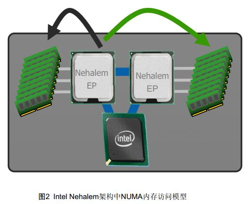
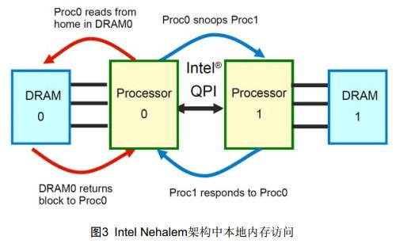
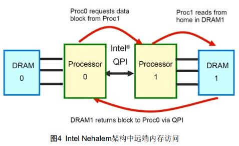
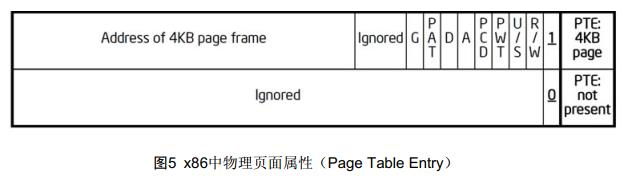
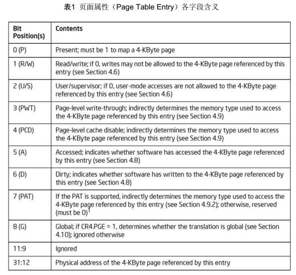
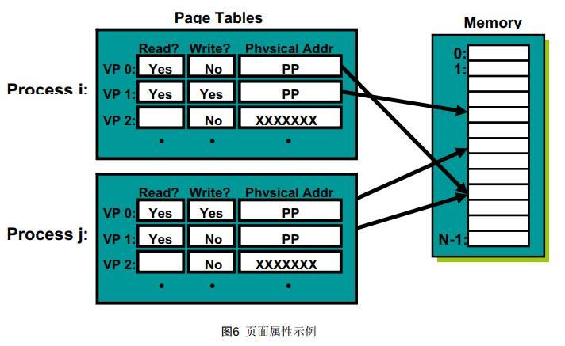
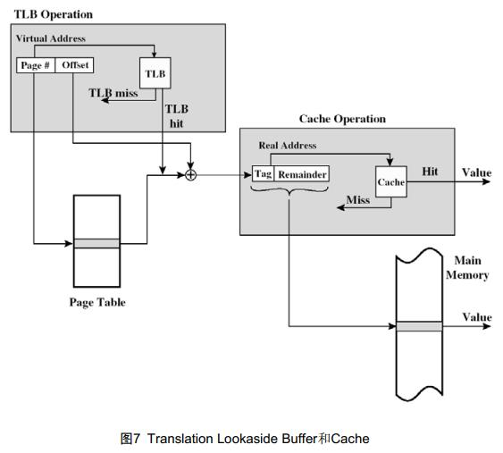
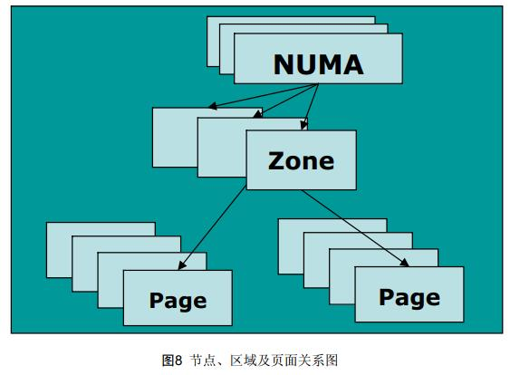
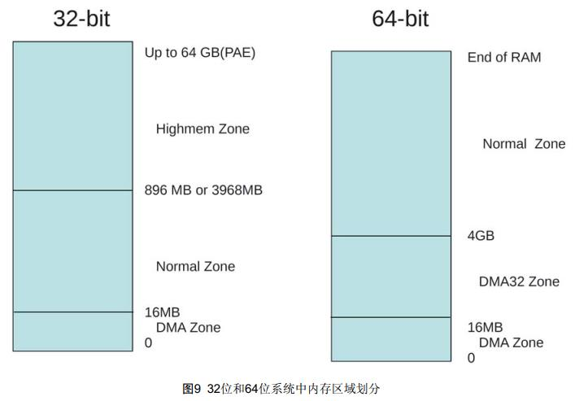

> @Date    : 2020-10-29 17:19:44
>
> @Author  : Lewis Tian (taseikyo@gmail.com)
>
> @Link    : github.com/taseikyo

# Linux 物理内存描述

## 1 概述

Linux 内核采用页式存储管理，进程的地址空间被划分成固定大小的 “页面”；物理内存同样被分为与页面大小相同的 “页帧”，由 MMU 在运行时将虚拟地址 “映射” 成某个物理内存页面上的地址。

本文以 linux-2.6.32-220.el6 版本内核源码为基础，介绍 Linux 内核中有关物理内存的概念，和如何描述物理内存。注意：本文中涉及到的仅是和物理内存有关的概念、数据结构。和地址如何映射、线性地址、物理地址；内存如何分配 / 回收等概念无关。

## 2 物理内存相关概念

### 2.1 NUMA（Non Uniform Memory Access）

在现代计算机中，CPU 访问内存的速度与两者之间的距离有关，导致访问不同内存区域的时间可能不同。如下图，是系统中有 2 个 CPU（可以超过 2 个 CPU）时，NUMA 内存访问模型。


图 2 是 Intel Nehalem（Xeon E5xxx 系列）架构中 NUMA 内存访问模型。每个 CPU 下面都有物理内存，两个 CPU 之间通过 QPI 总线通信。黑色箭头表示访问本地 CPU 下面的物理内存，绿色箭头为访问另外 CPU 下的物理内存。本地 CPU 访问其他 CPU 下面内存时，数据要通过 QPI 总线传输。显然访问本地内存速度最快，访问其他 CPU 下面的内存速度较慢。这就是 NUMA 的由来。



下面两个图分别是 Nehalem 架构下，本地内存访问和远端内存访问模型。





### 2.2 页面和虚拟内存（Paging and Virtual Memory）

当打开 Intel CPU 页面机制时，线性地址空间就划分成页面，虚拟地址的页面然后映射到物理页面。当 Linux 使用页面机制时，对上层应用程序是透明的。即 Intel CPU 就是这么实现的，采用段页式机制，所有运行在 Intel CPU 上的 OS 都要遵守页面机制，包括 Windows、Linux 都是如此。

下图是 x86/x86_64 架构中，页面大小为 4K 时，页面属性。



下面表为页面属性（Page Table Entry）各字段含义。这些字段包括线性地址对应的物理页面是否存在、页面是否可读写、是用户模式还是系统模式、页面是否为脏等。这些属性在 Linux 内核实现中都会用到。



为了便于理解页面属性的作用，我们来看一个示例。如系统有两个进程 i 和 j，内核可以设置该进程使用的物理页面属性，如进程对某些页面只能读，而不能写；对某些页面可读可写。这样既可以



#### 2.2.1 PAE（Physical Address Extensions）

在 x86 CPU 中，只有 32 位地址总线，也就意味着只有 4G 地址空间。为了实现在 32 位系统中使用更多的物理内存，Intel CPU 提供了 PAE（Physical Address Extensions）机制，这样可以使用超过 4G 物理内存。

PAE 机制的打开，需要设置 CR0、CR4 控制寄存器和 IA32_EFER MSR 寄存器。设置值为 CR0.PG = 1，CR4.PAE = 1 和 IA32_EFER.LME = 0。但 PAE 机制打开后，MMU 会将 32 位线性地址转换为 52 位物理地址。尽管物理地址是 52 位（4PB），但线性地址仍然为 32 位，即进程可使用的物理内存不超过 4GB。

#### 2.2.2 PSE（Page Size Extensions）

前面提到 x86/x86_64 CPU 中提供的是段页式机制，也介绍了页面。页面大小虽然是固定的，但 x86/x86_64 CPU 支持两种页面大小 4KB 和 4MB。大多数情况下 OS 内核使用的是 4KB 页面，但系统中多数进程使用内存较大时，如每次申请至少 4MB，则使用 4MB 页面较为合适。

当控制寄存器 CR4.PSE = 1 时，页面大小是 4MB。

### 2.3 TLB（Translation Lookaside Buffers）

在《Linux 内存地址映射》中，详细介绍了 CPU 如何将逻辑地址转换为物理地址，这个过程需要多次访问物理内存，从内存中读取页面目录表、页面表。若有 4 级映射，从内存读取地址映射表的次数更多。这个过程相对 CPU 运算能力而言，是非常耗时的。

CPU 可以将线性地址映射信息保存在 TLB 中，即 TLB 保存着线性地址与物理页面的对应关系，这样 CPU 下次访问该线性地址时，直接可以从 TLB 中找到对应的物理页面，不再需要线性地址到物理地址的繁琐映射过程，大大加快找到物理页面的速度。

我们对 CPU 的 Cache 非常熟悉，一般用缓存内存数据的指令。TLB 也是一种 Cache，也是在集成在 CPU 内部，只是它保存地址映射关系，不是数据或指令。

线性地址映射时，每次都首先会从 TLB 中查找，若命中，则直接读出物理页面地址；若未命中，再进行页式地址映射。



## 3 Linux 内核对物理内存描述

Linux 将物理内存按固定大小的页面（一般为 4K）划分内存，在内核初始化时，会建立一个全局 struct page 结构数组 mem_map[]。如系统中有 76G 物理内存，则物理内存页面数为 `76*1024*1024k/4K= 19922944` 个页面，mem_map[] 数组大小 19922944，即为数组中每个元素和物理内存页面一一对应，整个数组就代表着系统中的全部物理页面。

在服务器中，存在 NUMA 架构（如 Nehalem、Romly 等），Linux 将 NUMA 中内存访问速度一致（如按照内存通道划分）的部分称为一个节点（Node），用 struct pglist_data 数据结构表示，通常使用时用它的 typedef 定义 pg_data_t。系统中的每个结点都通过 pgdat_list 链表 pg_data_t->node_next 连接起来，该链接以 NULL 为结束标志。每个结点又进一步分为许多块，称为区域（zones） 。区域表示内存中的一块范围。区域用 struct zone_struct 数据结构表示，它的 typedef 定义为 zone_t。每个区域（Zone）中有多个页面（Pages） 组成。节点、区域、页面三者关系如下图。



### 3.1 节点（Node）

节点（Node），在 linux 中用 struct pglist_data 数据结构表示，通常使用时用它的 typedef 定义 pg_data_t，数据结构定义在文件 include/linux/mmzone.h 中。

```C
/*
* The pg_data_t structure is used in machines with CONFIG_DISCONTIGMEM
* (mostly NUMA machines?) to denote a higher-level memory zone than the
* zone denotes.

* On NUMA machines, each NUMA node would have a pg_data_t to describe
* it's memory layout.
*
* Memory statistics and page replacement data structures are
maintained on a
* per-zone basis.
*/
struct bootmem_data;
typedef struct pglist_data {
	struct zone node_zones[MAX_NR_ZONES];
	struct zonelist node_zonelists[MAX_ZONELISTS];
	int nr_zones;
#ifdef CONFIG_FLAT_NODE_MEM_MAP /* means ! SPARSEMEM
*/
	struct page *node_mem_map;
#ifdef CONFIG_CGROUP_MEM_RES_CTLR
	struct page_cgroup *node_page_cgroup;
#endif
#endif
	struct bootmem_data *bdata;
#ifdef CONFIG_MEMORY_HOTPLUG
	/*
	* Must be held any time you expect node_start_pfn,
	node_present_pages
	* or node_spanned_pages stay constant. Holding this will also
	* guarantee that any pfn_valid() stays that way.
	*
	* Nests above zone->lock and zone->size_seqlock.
	*/
	spinlock_t node_size_lock;
#endif
	unsigned long node_start_pfn;
	unsigned long node_present_pages; /* total number of physical
pages */
	unsigned long node_spanned_pages; /* total size of physical page
range, including holes */
	int node_id;
	wait_queue_head_t kswapd_wait;
	struct task_struct *kswapd;
	int kswapd_max_order;
} pg_data_t;
```

其中的成员变量含义如下：

- node_zones：这个结点的区域有，在 x86 中有，ZONE_HIGHMEM，ZONE_NORMAL，ZONE_DMA； x86_64 CPU 中区域有 DMA、DMA32 和 NORMAL 三部分。
- node_zonelists：分配区域时的顺序，由函数 free_area_init_core() 调用 mm/page_alloc.c 中函数 build_zonelists() 设置；
- nr_zones：区域的数量，值的范围为 1 ~ 3；并不是所有的结点都有三个区域；
- node_mem_map：该结点的第一页面在全局变量 mem_map 数组中地址；
- bdata：仅在系统启动分配内存时使用；
- node_start_pfn：该结点的起始物理页面号；
- node_present_pages：该结点中的总共页面数；
- node_spanned_pages：该节点中所有物理页面数，包括内存空洞（如部分地址为外设 I/O 使用）。
- node_id：结点 ID，从 0 开始；

当分配一个页面时，linux 使用本地结点分配策略，从运行的 CPU 最近的一个结点分配。因为进程倾向于在同一个 CPU 上运行，使用内存时也就更可能使用本结点的空间。

对于像 PC 之类的 UMA 系统，仅有一个静态的 pg_data_t 结构，变量名为 contig_page_data。

```C
#ifndef CONFIG_NEED_MULTIPLE_NODES
struct pglist_data __refdata contig_page_data = {.bdata = &bootmem_node_data[0] };
EXPORT_SYMBOL(contig_page_data);
#endif
```

遍历所有节点可以使用 for_each_online_pgdat(pgdat) 来实现。

```C
/**
* for_each_online_pgdat - helper macro to iterate over all online nodes
* @pgdat - pointer to a pg_data_t variable
*/
#define for_each_online_pgdat(pgdat) \
	for (pgdat = first_online_pgdat(); \
		pgdat; \
		pgdat = next_online_pgdat(pgdat))
```

### 3.2 区域（Zone）

#### 3.2.1 区域类型

节点（Node）下面可以有多个区域，共有以下几种类型：

```C
enum zone_type {
#ifdef CONFIG_ZONE_DMA
	ZONE_DMA,
#endif
#ifdef CONFIG_ZONE_DMA32
	/*
	* x86_64 needs two ZONE_DMAs because it supports devices that are
	* only able to do DMA to the lower 16M but also 32 bit devices that
	* can only do DMA areas below 4G.
	*/
	ZONE_DMA32,
#endif
	ZONE_NORMAL,
#ifdef CONFIG_HIGHMEM
	/*
	* A memory area that is only addressable by the kernel through
	* mapping portions into its own address space. This is for example
	* used by i386 to allow the kernel to address the memory beyond
	* 900MB. The kernel will set up special mappings (page
	* table entries on i386) for each page that the kernel needs to
	* access.
	*/
	ZONE_HIGHMEM,
#endif
	ZONE_MOVABLE,
	__MAX_NR_ZONES
};
```

#### ZONE_DMA

是低内存的一块区域，这块区域由标准工业架构（Industry Standard Architecture）设备使用，适合 DMA 内存。这部分区域大小和 CPU 架构有关，在 x86 架构中，该部分区域大小限制为 16MB。

#### ZONE_DMA32

该部分区域为适合支持 32 位地址总线的 DMA 内存空间。很显然，该部分仅在 64 位系统有效，在 32 位系统中，这部分区域为空。在 x86-64 架构中，这部分的区域范围为 0 ~ 4GB。

#### ZONE_NORMAL

属于 ZONE_NORMAL 的内存被内核直接映射到线性地址。这部分区域仅表示可能存在这部分区域，如在 64 位系统中，若系统只有 4GB 物理内存，则所有的物理内存都属于 ZONE_DMA32，而 ZONE_NORMAL 区域为空。

许多内核操作都仅在 ZONE_NORMAL 内存区域进行，所以这部分是系统性能关键的地方。

#### ZONE_HIGHMEM

是系统中剩下的可用内存，但因为内核的地址空间有限，这部分内存不直接映射到内核。详细内容可参考文档 [Linux 内核高端内存](http://ilinuxkernel.com/?p=1013)

在 x86 架构中内存有三种区域：ZONE_DMA，ONE_NORMAL，ZONE_HIGHMEM。不同类型的区域适合不同需要。在 32 位系统中结构中，1G（内核空间） /3G（用户空间）地址空间划分时，三种类型的区域如下：

- ZONE_DMA 内存开始的 16MB
- ZONE_NORMAL 16MB ~ 896MB
- ZONE_HIGHMEM 896MB ~ 结束

4G（内核空间）/4G（用户空间）地址空间划分时，三种类型区域划分为：

- ZONE_DMA 内存开始的 16MB
- ZONE_NORMAL 16MB ~ 3968MB
- ZONE_HIGHMEM 3968MB ~ 结束



在 64 位 Linux 系统中，内存只有三个区域 DMA、DMA32 和 NORMAL

- ZONE_DMA 内存开始的16MB
- ZONE_DMA32 16MB ~ 4GB
- ZONE_NORMAL 4GB ~ 结束

对于 64 位系统中，为什么不存在高端内存（ZONE_HIGHMEM），可参考文档 [Linux 内核高端内存](http://ilinuxkernel.com/?p=1013)

### 3.2.2 struct zone 结构体

每块区域的描述结构为 struct zone。 zone 跟踪记录一些信息，如页面的使用统计、空闲页面及锁等，数据结构定义在文件 include/linux/mmzone.h 中。

```C
struct zone {
	/* Fields commonly accessed by the page allocator */

	/* zone watermarks, access with *_wmark_pages(zone) macros
	*/
	unsigned long watermark[NR_WMARK];
	...
	unsigned long lowmem_reserve[MAX_NR_ZONES];
#ifdef CONFIG_NUMA
	int node;
	/*
	* zone reclaim becomes active if more unmapped pages exist.
	*/
	unsigned long min_unmapped_pages;
	unsigned long min_slab_pages;
	struct per_cpu_pageset *pageset[NR_CPUS];
#else
	struct per_cpu_pageset pageset[NR_CPUS];
#endif
	/*
	* free areas of different sizes
	*/
	spinlock_t lock;
#ifdef CONFIG_MEMORY_HOTPLUG
	/* see spanned/present_pages for more description */
	seqlock_t span_seqlock;
#endif
	struct free_area free_area[MAX_ORDER];
	... ...
	/* Fields commonly accessed by the page reclaim scanner */
	spinlock_t lru_lock;
	struct zone_lru {
		struct list_head list;
	} lru[NR_LRU_LISTS];

	struct zone_reclaim_stat reclaim_stat;

	unsigned long pages_scanned; /* since last reclaim */
	unsigned long flags; /* zone flags, see below */

	/* Zone statistics */
	atomic_long_t vm_stat[NR_VM_ZONE_STAT_ITEMS];

	int prev_priority;
	unsigned int inactive_ratio;
	wait_queue_head_t * wait_table;
	unsigned long wait_table_hash_nr_entries;
	unsigned long wait_table_bits;

	/*
	* Discontig memory support fields.
	*/
	struct pglist_data *zone_pgdat;
	/* zone_start_pfn == zone_start_paddr >> PAGE_SHIFT */
	unsigned long zone_start_pfn;
	unsigned long spanned_pages; /* total size, including holes
*/
	unsigned long present_pages; /* amount of memory
(excluding holes) */

	/*
	* rarely used fields:
	*/
	const char *name;

	unsigned long padding[16];
} cacheline_internodealigned_in_smp;
```

结构体中主要的成员变量含义：

- lock：spinlock 防止对区域的并发访问；
- pages_min， pages_low 和 pages_high：区域的 “水准”，即区域页面分配的不同水准；
- lowmem_reserve：针对每个区域保存的物理页面数量，保证在任何条件下，申请内存都不会失败；
- free_area：buddy 分配器使用的空闲区域位图；
- wait_table, wait_table_bits 和 wait_table_hash_nr_entries：等待空闲页面的进程 hash 表，这个对 wait_on_page() 和 unlock_page() 重要；队列上的进程等待某些条件，当条件满足时，内核就会通知进程，进程就可以继续执行。
- zone_pdgat：指向父亲 pg_data_t；
- zone_start_pfn：该区域结点的物理页面号；
- zone_present_pages：该结点中的总共页面数；
- zone_spanned_pages：该节点中所有物理页面数，包括内存空洞（如部分地址为外设 I/O 使用）。
- name：区域的名字，"DMA"，"DMA32"，"Normal"，"HighMem"；

### 3.3 页面（Page）

系统内存由固定的块组成，称为页帧，每个页帧由 struct page 结构描述。内核在初始化时，会根据内存的大小计算出由多少页帧，每个页帧都会有一个 page 结构与之对应，这些信息保存在全局数组变量 mem_map 中。 mem_map 通常存储在 ZONE_NORMAL 区域中，在内存较小的机器中，会保存在加载内核镜像后的一片保留空间里。有多少个物理页面，就会有多个 struct page 结构，如系统安装 128GB 物理内存， struct page 结构体大小为 40 字节，则 mem_map[] 数组就占用物理内存大小为 `128*1024*1024k/4k * 40 = 1280MB`，即 Linux 内核要使用 1280MB 物理内存来保存 mem_map[] 数组，这部分内存是不可被使用的。因此 struct page 结构体大小不能设计很大。

#### 3.3.1 struct page 结构体

struct page 数据结构定义在文件 include/linux/mm_types.h 文件中。

```C
struct page {
	unsigned long flags; /* Atomic flags, some possibly
						* updated asynchronously */
	atomic_t _count; /* Usage count, see below. */
	union {
		atomic_t _mapcount; /* Count of ptes mapped in mms,
							* to show when page is mapped
							* & limit reverse map searches.
							*/
		struct {
			/ * SLUB * /
			u16 inuse;
			u16 objects;
		};
	};
	union {
		struct {
			unsigned long private;
			struct address_space *mapping;
		};
#if USE_SPLIT_PTLOCKS
		spinlock_t ptl;
#endif
		struct kmem_cache *slab; /* SLUB: Pointer to slab */
		struct page *first_page; /* Compound tail pages */
	};
	union {
		pgoff_t index; /* Our offset within mapping. */
		void *freelist; /* SLUB: freelist req. slab lock */
	};
	struct list_head lru;
#if defined(WANT_PAGE_VIRTUAL)
	void *virtual; /* Kernel virtual address (NULL if
					not kmapped, ie. highmem) */
#endif /* WANT_PAGE_VIRTUAL */
#ifdef CONFIG_WANT_PAGE_DEBUG_FLAGS
	unsigned long debug_flags; /* Use atomic bitops on this */
#endif
#ifdef CONFIG_KMEMCHECK
	void *shadow;
#endif
};
```

page 结构中的参数含义如下：

- flags：描述页面状态的标志。所有的标志在 include/linux/page-flags.h 中定义，主要标志包括 PG_locked、PG_error、 PG_referenced、 PG_uptodate、 PG_active、 PG_dirty、PG_lru 等。系统中定义了许多宏来测试、清除、设置标志中的不同 bit。
- mapping：当文件或者设备映射到内存中时，它们的 inode 结构就会和 address_space 相关联。当页面属于一个文件时， mapping 就会指向这个地址空间。如果这个页面是匿名的且映射开启，则 address_space 就是 swapper_space， swapper_space 是管理交换地址空间的。
- index：这个值有两个用处，具体用处取决于页面的状态。若页面是属于一个文件的映射，则 index 是该页面在文件中的偏移量。若页面是交换缓冲区的一部分，则 index 是页面在 address_space 交换地址空间的偏移量（swapper_space）。另外，当一些页面被一个进程回收时，该回收区域的级别（2 的幂次方数量回收的页面）保存在 index 中，这个值在函数__free_pages_ok() 中设置。
- \_count：引用该页面的计数。当该值达到 0 时，页面可以被回收。当大于 0 时，意味着有一个或多个进程正在使用该页面。
- \_mapcount：页面表总共有多少项指向该页面。
- lru：为页面替换策略，可以被换出的页面可能存在于 active_list 或者 inactive_list（在 page_alloc.c 中定义）。这是 LRU（Least Recently Used）链表头。
- virtual：正常情况下只有处于 ZONE_NORMAL 的页面被内核直接映射。对于 ZONE_HIGHMEM 区域的页面，内核使用 kmap() 来映射页面。当页面被映射后， virtual 时它的虚地址。

#### 3.3.2 页面标志

页面标志尤为重要，则内存分配与回收、I/O 操作等重要内核活动过程中都会使用到页面标志。所有的标志在 include/linux/page-flags.h 中定义。

```C
enum pageflags {
	PG_locked, /* Page is locked. Don't touch. */
	PG_error,
	PG_referenced,
	PG_uptodate,
	PG_dirty,
	PG_lru,
	PG_active,
	PG_slab,
	PG_owner_priv_1, /* Owner use. If pagecache, fs may use*/
	PG_arch_1,
	PG_reserved,
	PG_private, /* If pagecache, has fs-private data */
	PG_private_2, /* If pagecache, has fs aux data */
	PG_writeback, /* Page is under writeback */
#ifdef CONFIG_PAGEFLAGS_EXTENDED
	PG_head, /* A head page */
	PG_tail, /* A tail page */
#else
	PG_compound, /* A compound page */
#endif
	PG_swapcache, /* Swap page: swp_entry_t in private */
	PG_mappedtodisk, /* Has blocks allocated on-disk */
	PG_reclaim, /* To be reclaimed asap */
	PG_buddy, /* Page is free, on buddy lists */
	PG_swapbacked, /* Page is backed by RAM/swap */
	PG_unevictable, /* Page is "unevictable" */
#ifdef CONFIG_MMU
	PG_mlocked, /* Page is vma mlocked */
#endif
#ifdef CONFIG_ARCH_USES_PG_UNCACHED
	PG_uncached, /* Page has been mapped as uncached */
#endif
#ifdef CONFIG_MEMORY_FAILURE
	PG_hwpoison, /* hardware poisoned page. Don't touch */
#endif
#ifdef CONFIG_TRANSPARENT_HUGEPAGE
	PG_compound_lock,
#endif
	__NR_PAGEFLAGS,

	/* Filesystems */
	PG_checked = PG_owner_priv_1,
	PG_fscache = PG_private_2,/* page backed by cache */
	/* XEN */
	PG_pinned = PG_owner_priv_1,
	PG_savepinned = PG_dirty,

	/* SLOB */
	PG_slob_free = PG_private,

	/* SLUB */
	PG_slub_frozen = PG_active,
	PG_slub_debug = PG_error,
};
```

这里解释一下重要的几个页面标志：

- PG_locked：页面是否被锁住，若该位设置了该位，则不允许内核其他部分访问该页面。这用来防止内存管理过程中遇到的竞争条件，如当从硬盘读取数据到一个页面时，就不允许其他内核部分访问该页面，因为读数据的过程中，其他内核部分能访问的话，则读取到的数据是不完整的。
- PG_error： I/O 出错，且操作和页面有关，就设置该标志。
- PG_referenced 和 PG_active：控制系统使用页面的活跃程度。这个信息对 swap 系统选择待交换出的页面非常重要。
- PG_update：表示成功完成从块设备上读取一个页面的数据。该标志和块设备 I/O 操作有关。
- PG_dirty：当内存页面中的数据和块设备上的数据不一致时，就设置该标志。在写数据到块设备时，为了提高将来的读性能，数据并不是立即回写到块设备上，而只是设置页面脏标志，表示该页面数据需要回写。
- PG_lru：该标志用来实现页面回收和交换。
- PG_highmem：表示该页面为属于高端内存。

## 4 Linux物理内存描述信息查看

### 4.1 /proc/zoneinfo

### 4.2 /proc/pagetypeinfo

### 4.3 /sys/devices/system/node/node0/meminfo

### 4.4 echo m > /proc/sysrq-trigger
