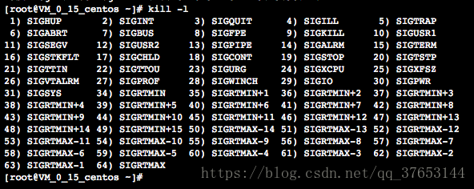

> 本文由 [简悦 SimpRead](http://ksria.com/simpread/) 转码， 原文地址 [blog.csdn.net](https://blog.csdn.net/qq_37653144/article/details/81942026) [`___Blue_H`](https://me.csdn.net/qq_37653144) 2018-08-23 13:53:42

# Linux 的信号机制

## 信号机制

信号机制是一种使用信号来进行进程之间传递消息的方法，信号的全称为软中断信号，简称软中断。信号的本质是软件层次上对中断的一种模拟（软中断）。它是一种异步通信的处理机制，事实上，进程并不知道信号何时到来。

在头文件 <signal.h> 中定义了 64 种信号，这些信号的名字都以 SIG 开头，且都被定义为正整数，称为信号编号。可以用 “kill -l” 查看信号的具体名称。



上图中编号为 1 ~ 31 的信号为早期 Linux 所支持的信号，是不可靠信号（非实时的），编号为 34 ~ 63 的信号时后来扩充的，称为可靠信号（实时信号）。不可靠信号与可靠信号的区别在于前者不支持排队（这意味着如果内核已经注册了这个信号，那么便不会再去注册，对于进程来说，便不会知道本次信号的发生），可能会造成信号丢失，而后者的注册机制是每收到一个可靠信号就会去注册这个信号，不会丢失。

## 信号的产生

Linux 中的信号可以由以下几种方式产生：

- 当用户按下某些终端按键后引发终端产生信号，如 “Ctrl+C” 等。
- 硬件产生的异常信号，例如除数为 0、无效的内存访问等。这种异常信号通常会由硬件检测并通知 Linux 内核，然后内核产生信号发送给相关进程。
- 进程使用系统调用函数 kill 可以给一个进程或者进程组发送一个信号，此时发送和接收信号的进程 / 进程组的所有者必须相同。
- 用户调用 kill 命令将信号发送给其他进程，如经常使用 kill 终止进程一样。
- 当检测到某种软件条件已经发生，并将其通知有关进程的时候也会产生信号，例如 SIGURG 信号就是在接收到一个通过网络传送的外部数据时产生的。

## 信号处理方式

Linux 的每一个信号都有一个缺省的动作，典型的缺省动作是终止进程，当一个信号到来的时候收到这个信号的进程会根据信号的具体情况提供一下三种不同的处理方式：

1. 对于需要处理的信号，指定处理函数，由该函数来处理。
2. 忽略某个信号，对该信号不做任何处理。
3. 对该信号的处理保留系统的默认值，这种缺省操作大多数使得进程终止，进程通过系统调用 signal 函数来指定进程对某个信号的处理行为。

## 信号处理过程

Linux 内核给一个进程发送软中断的方法是：在进程所在的进程表项的信号域设置对应信号的位（在 PCB 中设置）。如果信号发送给一个正在睡眠的进程，如果进程的优先级是可中断的，则唤醒进程，否则仅设置 PCB 中信号域相应的位而不唤醒进程。一个进程检查是否收到信号的时机是：一个进程在即将从内核态切换到用户态时；或者再一个进程要进入或离开一个适当的低调度优先级睡眠状态时。

内核处理一个进程收到的软中断信号是在该进程的上下文中，因此进程必须处于运行状态。如果进程收到一个需要捕获的信号，会在进程从内核态返回到用户态时执行用户定义的函数，而且内核会在用户栈上创建一个新的空间来处理，该空间将返回地址的值设置成用户定义的处理函数的地址，这样进程从内核返回栈顶时就返回到用户定义的函数处，从函数返回再弹出栈顶时，才返回原先进入内核的地方。

## Linux 信号的使用方法

### 注册信号

指的是在目标进程中注册，该目标进程中有未决信号的信息。对于已经有自己的中断处理例程的信号而言，其注册就是一个用户进程自己定义的处理函数去替换 Linux 内核预定义的函数动作。例如 “Ctrl+C” 是中止当前进程的运行，按下组合键后会产生一个中断，当前进程会接收到一个 SIGINT 信号，然后找到对应的处理例程是终止当前进程。我们也可以自己注册信号，将 SIGINT 信号对应的处理例程改为我们想要的操作。

```C
struct sigpending{
    struct sigqueue *head, **tail;
    sigset_t signal;
};
 
struct sigqueue{
    struct sigqueue *next;
    siginfo_t info;
}；
```

其中 sigqueue 结构组成的链称之为未决信号链，sigset_t 称之为未决信号集，* head，** tail 分别指向未决信号链的头部与尾部，siginfo_t info 是信号所携带的信息。

信号注册的过程就是将信号值加入到未决信号集 siginfo_t 中，将信号所携带的信息加入到未决信号链的某一个 sigqueue 中去。因此，对于可靠的信号，可能存在多个未决信号的 sigqueue 结构，对于每次信号到来都会注册。而不可靠信号只注册一次，只有一个 sigqueue 结构。只要信号在进程的未决信号集中，表明进程已经知道这些信号了，还没来得及处理，或者是这些信号被阻塞。

在 Linux 中，可以通过 signal 和 sigaction 函数注册信号并指定接收到该信号时需要完成的动作，对于已经有自己的功能动作的信号而言其注册就是用一个用户自己定义的动作去替换 Linux 内核预定义的动作。

### signal 函数

signal 函数可以为一个特定的信号（除了无法捕获的 SIGKILL 和 SIGSTOP 信号）注册相应的处理函数。如果正在运行的程序源代码里注册了针对某一信号的处理程序，不论当时程序执行到何处，一旦进程接收到该信号，相应的调用就会发生。

```C
#include <signal.h>
 
void (*signal(int signum, void (*handler)(int)))(int);
```

参数 signum 表示所注册函数针对的信号名称，参数 handler 通常是指向调用函数的函数指针，即所谓的信号处理函数。

信号处理函数 handler 可能是用户自定义的一个函数，也可能是两个在头文件 <signal.h> 中进行定义的值：

- SIG_IGN：忽略 signum 指出的信号。
- SIG_DFL：调用系统定义的缺省信号处理。

当 signal 函数调用成功后返回信号以前的处理配置，如果调用失败则返回 SIG_ERR（-1）。需要注意的是并非程序执行到 signal 调用时就立即对指定的信号进行操作，因为信号的产生式无法预期的，利用 signal 设置信号处理函数只是告诉系统对这个信号用什么程序来处理。

### sigaction 函数

相较于 signal 函数，sigaction 函数在完成信号注册工作的同时提供了更多功能选择。

```C
#include <signal.h>
 
int sigaction(int signum, const struct sigaction *act, struct sigaction *oldact);
```

其中，参数 signum 指定要处理的信号，act 和 oldact 都是指向信号动作结构的指针，该结构定义如下：

```C
struct sigaction {
    void (*sa_handler)(int);
    void (*sa_sigaction)(int, siginfo_t *, void *);
    sigset_t sa_mask;
    int sa_flags;
};
```

sa_handler 用于指向信号处理函数的地址，参数 sa_sigaction 是指向函数的指针。它指向的函数有三个参数，其中第二个为 siginfo_t 结构体，定义如下：

```C
struct siginfo_t {
    int si_signo;        //Signal number
    int si_errno;        //Errno value
    int si_code;         //Signal code
    pid_t si_pid;        //Sending process ID
    uid_t si_uid;        //Real user ID of sending process
    int si_status;       //Exit value or signal
    clock_t si_utime;    //User time consumed
    clock_t si_stime;    //System time consumed
    signal_t si_value;   //Signal value
    int si_int;          //POSIX.1b signal
    void *si_ptr;        //POSIX1.b signal
    void *si_addr;       //Memory location that caused fault
    int si_band;         //Band event
    int si_fd;           //File descriptor
};
```

sa_flags 用于指示信号处理函数的不同选项，可以通过 “|” 连接不同的参数，从而实现所需的选项设置。具体的可选参数如下表所示：

sa_flags 可选项及对应设置

|   sa_flags   |                                           对应设置                                           |
|:------------:|:--------------------------------------------------------------------------------------------:|
| SA_NOCLDSTOP | 用于指定信号 SIGCHLD，当子进程被中断时，不产生此信号，当且仅当子进程结束时产生该信号         |
| SA_NOCLDWAIT | 当信号为 SIGCHLD 时，此选项可以避免子进程的僵死                                              |
| SA_NODEFER   | 当信号处理程序正在运行时，不阻塞信号处理函数自身的信号功能                                   |
| SA_NOMASK    | 同 SA_NODEFER                                                                                |
| SA_ONESHOT   | 当用户注册的信号处理函数被调用过一次之后，该信号的处理程序恢复为缺省的处理函数               |
| SA_RESETHAND | 同 SA_ONESHOT                                                                                |
| SA_RESTART   | 使本来不能进行自动重新运行的系统调用自动重新启动                                             |
| SA_SIGINFO   | 表明信号处理函数是由 sa_sigaction 指定，而不是由 sa_handler 指定，它将显示更多处理函数的信息 |

实例如下：

```C
#include <stdio.h>
#include <stdlib.h>
#include <signal.h>
 
void signalDeal(int sig, siginfo_t *info, void *t) {
    if (sig == SIGINT) {
        printf("Ctrl+C被按下n");
    }
    else if (sig == SIGQUIT) {
        printf("Ctrl+/被按下n");
    }
    else {
        printf("其他信号n");
    }
}
 
int main(int argc, char *argv[])
{
    struct sigaction act;
    act.sa_sigacion = signalDeal;
    sigempty(&act.sa_mask);
    act.sa_flags = SA_SIGINFO;
    sigaction(SIGINT, &act, NULL);
    sigaction(SIGQUIT, &act, NULL);
    while (1) {}
    return 0;
}
```

### 发送信号


####  kill 函数

kill 函数将信号发送给进程或者进程组。

```C
#include <signal.h>
#include <sys/types.h>
 
int kill(pid_t pid, int sig);
```

其中 pid 参数的取值如下：

pid 参数取值及其定义

|          pid         |                            含义                           |
|:--------------------:|:---------------------------------------------------------:|
| pid > 0              | 将信号发送给进程号为 pid 的进程                           |
| pid = 0              | 将信号发送给与目前进程相同进程组的所有进程                |
| pid < 0 && pid != -1 | 向进程组 ID 为 pid 绝对值的进程组中的所有进程发送信号     |
| pid = -1             | 除发送给自身进程外，还向所有进程 ID 大于 1 的进程发送信号 |

sig 参数对应的是信号编码，当其为 0（即空信号）时，实际不发送任何信号，但照常进行错误检查。因此可用于检查目标进程是否存在，以及当前进程是否具有向目标发送信号的权限。

#### raise 函数

raise 函数向自身所在进程发送一个信号。

```C
#include <signal.h>
 
int raise(int sig);
```

#### sigqueue 函数

sigqueue 主要是针对实时信号提出的（当然也支持非实时信号）信号发送函数，通常与函数 sigaction 配合使用。

```C
#include <signal.h>
 
int sigqueue(pid_t pid, int sig, const union sigval value);
 
typedef union sigval {
    int sival_int;
    void *sival_ptr;
}sigval_t;
```

sigqueue 比 kill 传递了更多的附加信息，但 sigqueue 只能向一个进程发送信号，不能发送信号给一个进程组。

## Linux 信号集

在 Linux 系统的实际应用中，常常需要将多个信号组合起来使用，这种用来表示多个信号的数据类型被称为信号集（signal set），其定义格式为 sigset_t。

```C
#include <signal.h>
 
typedef struct {
    unsigned long sig[_NSIG_WORDS];
}sigset_t;
```

有 5 个函数用于信号集的操作：

```C
#include <signal.h>
 
//前4个函数若调用成功则返回0，否则返回-1
int sigemptyset(sigset_t *set);    //用于将参数set所指向的信号集设为空，即不包含任何信号
int sigfillset(sigset_t *set);    //用于将参数set所指向的信号集设定为满，即包含所有的信号
int sigaddset(sigset_t *set, int signum);    //用于将参数signum所代表的信号添加到参数set所指向的信号集中
int sigdelset(sigset_t *set, int signum);    //用于将参数signum所代表的信号从参数set所指向的信号集中删除
int sigismember(const sigset_t *set, int signum);    //用于检查参数signum是否位于参数set所指向的信号集中，如果为真则返回1，为假则返回0，出错则返回-1
```

## 信号的阻塞和挂起

在实际应用中，有时候既不希望进程在接收到信号时立刻中断，也不希望该信号完全被忽略，而是希望进程延迟处理。这可以通过阻塞信号的方法来实现。Linux 提供了 sigprocmask 函数和和 sigsuspend 函数用于信号的阻塞和挂起。

```C
#include <signal.h>
 
int sigprocmask(int how, const sigset_t *set, sigset_t *oldset);
int sigsuspend(const sigset_t *mask);
```

函数 sigprocmask 的参数 set、oldset 指向信号集。set 指向一个信号集时，参数 how 表示 sigprocmask 函数如何对 set 所指向的信号集以及信号掩码进行操作。当参数 set 的值为 NULL 时，how 的取值无效。当 oldset 不为 NULL 时，函数将进程当前的信号掩码写入 oldset 指向的信号集。

参数 how 的取值及对应功能

|     how     |                                         对应函数功能                                         |
|:-----------:|:--------------------------------------------------------------------------------------------:|
| SIG_BLOCK   | 将 set 所指向的信号集中所包含的信号加到当前的信号掩码中，即信号掩码与 set 信号集做逻辑或运算 |
| SIG_UNBLOCK | 将 set 所指向的信号集中所包含的信号从当前的信号掩码中删除                                    |
| SIG_SETMASK | 设定新的当前信号掩码为 set 所指向的信号集中所包含的信号                                      |

函数 sigsuspend 的作用是挂起信号。在调用该函数后，进程停止执行，等待着开放信号的唤醒。