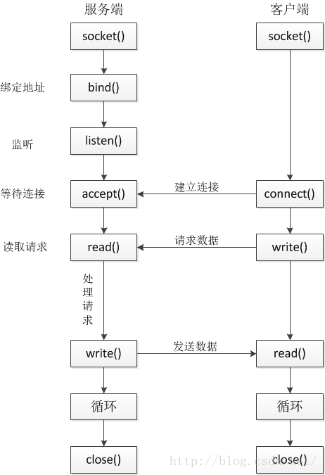
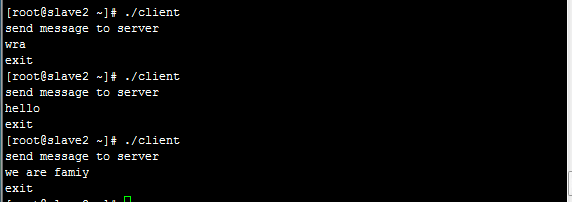
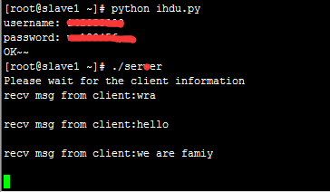
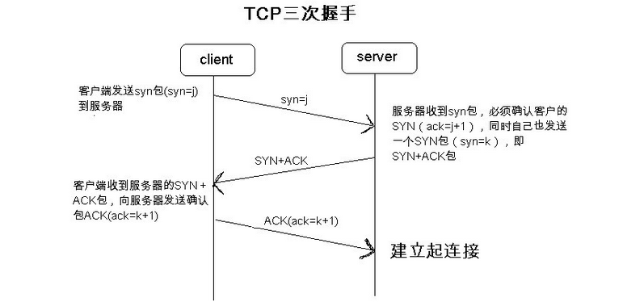
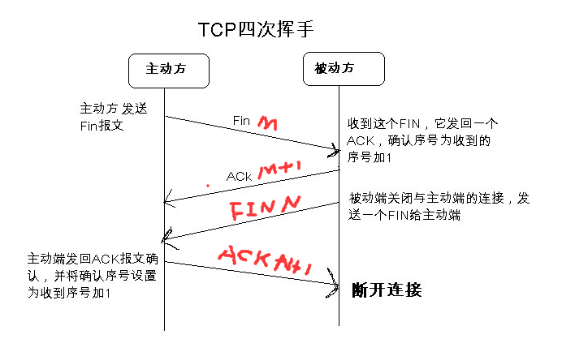
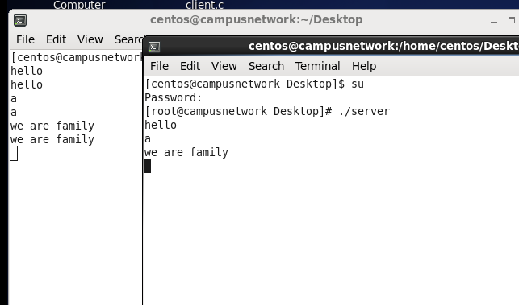

> @Date    : 2020-09-06 15:59:19
>
> @Author  : Lewis Tian (taseikyo@gmail.com)
>
> @Link    : github.com/taseikyo

# Linux socket 本地进程间通信

今天逛牛客看到这么一个问题：socket 本地通信需要通过 TCP/IP 协议栈吗？然后找了几篇博客看看...

### Table of Contents

- [Linux socket 本地进程间通信](#Linux-socket-本地进程间通信)
- [Linux 下简单的 socket 通信实例](#Linux-下简单的-socket-通信实例)
- [Linux Socket 过程详细解释](#Linux-Socket-过程详细解释)

## Linux socket 本地进程间通信

> 本文由 [简悦 SimpRead](http://ksria.com/simpread/) 转码， 原文地址 [blog.csdn.net](https://blog.csdn.net/u010073981/article/details/50734484) [GXYandSXP](https://me.csdn.net/u010073981) 2016-02-26 01:00:42

### Table of Contents

- [一、创建 socket](#一、创建-socket)
- [二、设置 socket 参数](#二、设置-socket-参数)
- [三、绑定](#三、绑定)
- [四、监听](#四、监听)
- [五、连接](#五、连接)
- [六、数据交互](#六、数据交互)

socket 起源于 Unix，而 Unix/Linux 基本哲学之一就是 “一切皆文件”，都可以用“打开 open –> 读写 write/read –> 关闭 close” 模式来操作。Socket 就是该模式的一个实现， socket 即是一种特殊的文件，一些 socket 函数就是对其进行的操作（读 / 写 IO、打开、关闭）。

说白了 Socket 是应用层与 TCP/IP 协议族通信的中间软件抽象层，它是一组接口。在设计模式中，Socket 其实就是一个门面模式，它把复杂的 TCP/IP 协议族隐藏在 Socket 接口后面，对用户来说，一组简单的接口就是全部，让 Socket 去组织数据，以符合指定的协议。

注意：其实 socket 也没有层的概念，它只是一个 facade 设计模式的应用，让编程变的更简单。是一个软件抽象层。在网络编程中，我们大量用的都是通过 socket 实现的。

使用套接字除了可以实现网络间不同主机间的通信外，还可以实现同一主机的不同进程间的通信，且建立的通信是双向的通信。socket 进程通信与网络通信使用的是统一套接口，只是地址结构与某些参数不同。

其主要流程如下：



### 一、创建 socket

创建 socket，类型为 AF_LOCAL 或 AF_UNIX，表示用于进程通信：

调用函数 socket(), 其原型如下：

```C
int socket(int domain, int type, int protocol);
```

参数：

- domain：指定协议族，对于本地套接字来说，值必须设置为 AF_UNIX 枚举值；
- type：指定套接字类型，可以被设置为 SOCK_STREAM（流式套接字）活 SOCK_DGRAM（数据报式套接字）
- protocol：指定具体的协议，应被设置为 0

返回值为生成的套接字描述符。

对于本地套接字来说，流式套接字（SOCK_STREAM）是一个有顺序的、可靠的双向字节流，相当于在本地进程之间建立起一条数据通道；数据报式套接字（SOCK_DGRAM）相当于单纯的发送消息，在进程通信过程中，理论上可能会有信息丢失、复制或者不按先后次序到达的情况，但由于其在本地通信，不通过外界网络，这些情况出现的概率很小。

### 二、设置 socket 参数

SOCK_STREAM 式本地套接字的通信双方均需要有本地地址，其中服务器端的本地地址需要明确指定，指定方法是使用 struct sockaddr_un 类型的变量

```C
struct sockaddr_un{
	sa_family_t sun_family; // AF_UNIX
	char sun_path[UNIX_PATH_MAX];// 路径名
}
```

### 三、绑定

绑定要使用 bind 系统调用，其原形如下：  

```C
int bind(int socket, const struct sockaddr *address, size_t address_len);
```

参数：

- socket：服务端套接字描述符
- address：需要绑定的服务端本地地址
- address_len：本地地址的字节长度

### 四、监听

服务器端套接字创建完毕并赋予本地地址值（名称，本例中为 CAN_SERVICE）后，需要进行监听，等待客户端连接并处理请求，监听使用 listen 系统调用，接受客户端连接使用 accept 系统调用，它们的原形如下：

```C
int listen(int socket, int backlog);  
int accept(int socket, struct sockaddr *address, size_t *address_len);  
```

参数：

- socket：表示服务器端的套接字描述符；
- backlog：表示排队连接队列的长度（若有多个客户端同时连接，则需要进行排队）；
- address：表示当前连接客户端的本地地址，该参数为输出参数，是客户端传递过来的关于自身的信息；
- address_len：表示当前连接客户端本地地址的字节长度，这个参数既是输入参数，又是输出参数。实现监听、接受和处理。

### 五、连接

客户端需要 socket 系统调用 connect() 连接到服务端，其函数原型如下：

```C
int connect(int socket, const struct sockaddr *address, size_t address_len); 
```

参数：

- socket：客户端的套接字描述符
- address：当前客户端的本地地址，是一个 struct sockaddr_un 类型的变量
- address_len：表示本地地址的字节长度

### 六、数据交互

无论客户端还是服务器，都要和对方进行数据上的交互。一个进程扮演客户端的角色，另外一个进程扮演服务器的角色，两个进程之间相互发送接收数据，这就是基于本地套接字的进程通信。

循环读取客户端发送的消息，当客户端没有发送数据时会阻塞直到有数据到来。如果想要多个连接并发处理，需要创建线程，将每个连接交给相应的线程并发处理。接收到数据后，进行相应的处理，将结果返回给客户端。发送和接收数据要使用 write 和 read 系统调用，它们的原形为：  

```C
int read(int socket, char *buffer, size_t len);  
int write(int socket, char *buffer, size_t len);
```

以下为简单的，socket 本地进程间通讯的例子：

1. 服务端

```C
#include <stdio.h>
#include <sys/types.h>
#include <sys/socket.h>
#include <sys/un.h>

#define CAN_SERVICE "CAN_SERVICE"
int main() {
	int ret;
	int len;
	int accept_fd;
	int socket_fd;
	static char recv_buf[1024];
	socklen_t clt_addr_len;
	struct sockaddr_un clt_addr;
	struct sockaddr_un srv_addr;

	socket_fd = socket(PF_UNIX, SOCK_STREAM, 0);
	if (socket_fd < 0) {
		perror("cannot create communication socket");
		return 1;
	}

	// 设置服务器参数
	srv_addr.sun_family = AF_UNIX;
	strncpy(srv_addr.sun_path, CAN_SERVICE,
	        sizeof(srv_addr.sun_path) - 1);
	unlink(CAN_SERVICE);

	// 绑定socket地址
	ret = bind(socket_fd, (struct sockaddr*)&srv_addr,
	           sizeof(srv_addr));
	if (ret == -1) {
		perror("cannot bind server socket");
		close(socket_fd);
		unlink(CAN_SERVICE);
		return 1;
	}

	// 监听
	ret = listen(socket_fd, 1);
	if (ret == -1) {
		perror("cannot listen the client connect request");
		close(socket_fd);
		unlink(CAN_SERVICE);
		return 1;
	}

	// 接受connect请求
	len = sizeof(clt_addr);
	accept_fd = accept(socket_fd, (struct sockaddr*)&clt_addr,
	                   &len);
	if (accept_fd < 0) {
		perror("cannot accept client connect request");
		close(socket_fd);
		unlink(CAN_SERVICE);
		return 1;
	}

	// 读取和写入
	memset(recv_buf, 0, 1024);
	int num = read(accept_fd, recv_buf, sizeof(recv_buf));
	printf("Message from client (%d)) :%s\n", num, recv_buf);

	// 关闭socket
	close(accept_fd);
	close(socket_fd);
	unlink(CAN_SERVICE);
	return 0;
}
```

2. 客户端

```C
#include <stdio.h>
#include <sys/types.h>
#include <sys/socket.h>
#include <sys/un.h>

#define CAN_SERVICE "CAN_SERVICE"
int main(void) {
	int ret;
	int socket_fd;
	char snd_buf[1024];
	static struct sockaddr_un srv_addr;

// 创建socket
	socket_fd = socket(PF_UNIX, SOCK_STREAM, 0);
	if (socket_fd < 0) {
		perror("cannot create communication socket");
		return 1;
	}
	srv_addr.sun_family = AF_UNIX;
	strcpy(srv_addr.sun_path, CAN_SERVICE);

// 连接到服务器
	ret = connect(socket_fd, (struct sockaddr*)&srv_addr,
	              sizeof(srv_addr));
	if (ret == -1) {
		perror("cannot connect to the server");
		close(socket_fd);
		return 1;
	}
	memset(snd_buf, 0, 1024);
	strcpy(snd_buf, "message from client");

// 读取和写入
	write(socket_fd, snd_buf, sizeof(snd_buf));
	close(socket_fd);
	return 0;
}
```

3. 编译运行

```bash
gcc -o service service.c
gcc -o client client.c
```

与本地套接字相对应的是网络套接字，可以用于在网络上传送数据，换言之，可实现不同机器上的进程通信过程。**在 TCP/IP 协议中，IP 地址的首字节为 127 即代表本地，因此本地套接字通信可以使用 IP 地址为 127.x.x.x 的网络套接字来实现。**

❤SL


## Linux 下简单的 socket 通信实例

> 本文由 [简悦 SimpRead](http://ksria.com/simpread/) 转码， 原文地址 [www.cnblogs.com](https://www.cnblogs.com/yusenwu/p/4579167.html) [Mereyct](https://www.cnblogs.com/yusenwu/) 2015-06-15 20:47

### Table of Contents

- [关于怎样介绍这个简单的实例](#关于怎样介绍这个简单的实例)
- [1、代码展示与功能介绍](#1、代码展示与功能介绍)
- [2、首先介绍一下客户端和服务端中函数的功能以及函数的原形](#2、首先介绍一下客户端和服务端中函数的功能以及函数的原形)
- [3、关于连接三次握手和 TCP 连接关闭时候的分组交换](#3、关于连接三次握手和-tcp-连接关闭时候的分组交换)
	- [三次握手](#三次握手)
	- [TCP 连接终止](#tcp-连接终止)
- [4、IPv4 与 IPv6 套接字的地址结构](#4、ipv4-与-ipv6-套接字的地址结构)
	- [IPv4 地址结构](#ipv4-地址结构)
	- [IPv6 地址结构](#ipv6-地址结构)
- [5、一些好的学习网站总结](#5、一些好的学习网站总结)
- [6、代码下载](#6、代码下载)
- [7、总结](#7、总结)
- [8、echo 实现](#8、echo-实现)

If you spend too much time thinking about a thing, you’ll never get it done. —— Bruce Lee

学习网络编程也一段时间了，刚开始看《UNIX 网络编程》的时候，觉得这本厚厚的书好难啊！看到后来，发现并没有想象中的那么难。如果你是新手，建议你看到第二部分结束后，开始着手写代码。不写代码肯定是不行的。看 100 遍也没有敲一遍实现一遍来的清楚。敲完以后，带着问题去看书，你会更加有针对性。提高的速度是飞快的，这也是学习任何一本书、一门语言的唯一手段。

写这个博客也是因为刚开始学的时候，查了好多别人写的东西，百度了以后，发现大家只是把所有的代码一贴。并没有讲解每个函数的功能。我甚至不知道哪个函数是哪个头文件下的。造成我对函数很不理解。下面我会对每个函数的功能，和它的头文件以及函数原型写出来，让大家参考，第一次写博客，有什么错误的地方，希望大家指正。可以在下面给我留言，也是我继续写下去的动力。

我很希望和大家一起分享学习网络编程遇到的种种困难与不顺，也希望和大家一起讨论其中遇到的问题，一起成长，如果你刚开始打算学习网络编程，那这篇文章一定能给你一些帮助。

### 关于怎样介绍这个简单的实例

基本上涵盖了《UNIX 网络编程》1-5 章的内容，更深，更细的，需要我们再细读这本书

1. 代码展示，功能介绍
2. 首先介绍一下客户端和服务端中函数的功能以及函数的原形。
3. 关于连接三次握手和 TCP 连接关闭时候的分组交换
4. IPv4、IPv6 套接字的地址结构
5. 一些好的学习网站总结
6. 代码下载
7. 总结
8. 实现一个 echo 的实例，代码可以到 Github 上下载

### client.c

```C
#include <stdio.h>
#include <sys/socket.h>
#include <sys/types.h>
#include <stdlib.h>
#include <netinet/in.h>
#include <errno.h>
#include <string.h>
#include <arpa/inet.h>
#include <unistd.h>
#define MAXLINE 1024

int main(int argc, char **argv) {
	char *servInetAddr = "127.0.0.1";
	int socketfd;
	struct sockaddr_in sockaddr;
	char recvline[MAXLINE], sendline[MAXLINE];
	int n;
	if (argc != 2) {
		printf("client <ipaddress> \n");
		exit(0);
	}
	socketfd = socket(AF_INET, SOCK_STREAM, 0);
	memset(&sockaddr, 0, sizeof(sockaddr));
	sockaddr.sin_family = AF_INET;
	sockaddr.sin_port = htons(10004);
	inet_pton(AF_INET, servInetAddr, &sockaddr.sin_addr)
	if ((connect(socketfd, (struct sockaddr*)&sockaddr,
	             sizeof(sockaddr))) < 0 ) {
		printf("connect error %s errno: %d\n", strerror(errno),
		       errno);
		exit(0);
	}
	printf("send message to server\n");
	fgets(sendline, 1024, stdin);
	if ((send(socketfd, sendline, strlen(sendline), 0)) < 0) {
		printf("send mes error: %s errno : %d", strerror(errno),
		       errno);
		exit(0);
	}
	close(socketfd);
	printf("exit\n");
	exit(0);
}
```

- 执行

```C
gcc client.c -o client
./server
./client
```

### server.c

```C
#include <stdio.h>
#include <sys/socket.h>
#include <sys/types.h>
#include <string.h>
#include <netinet/in.h>
#include <stdlib.h>
#include <errno.h>
#include <unistd.h>
#include <arpa/inet.h>
#define MAXLINE 1024
int main(int argc, char **argv) {
	int listenfd, connfd;
	struct sockaddr_in sockaddr;
	char buff[MAXLINE];
	int n;
	memset(&sockaddr, 0, sizeof(sockaddr));
	sockaddr.sin_family = AF_INET;
	sockaddr.sin_addr.s_addr = htonl(INADDR_ANY);
	sockaddr.sin_port = htons(10004);
	listenfd = socket(AF_INET, SOCK_STREAM, 0);
	bind(listenfd, (struct sockaddr *) &sockaddr,
	     sizeof(sockaddr));
	listen(listenfd, 1024);
	printf("Please wait for the client information\n");
	for (;;) {
		if ((connfd = accept(listenfd, (struct sockaddr*)NULL,
		                     NULL)) == -1) {
			printf("accpet socket error: %s errno :%d\n", strerror(errno),
			       errno);
			continue;
		}
		n = recv(connfd, buff, MAXLINE, 0);
		buff[n] = '0';
		printf("recv msg from client:%s", buff);
		close(connfd);
	}
	close(listenfd);
}
```

- 执行

```bash
gcc server.c -o server
gcc client.c -o client
./server
./client
```

### 1、代码展示与功能介绍

上面这个简单的 socket 通信的代码要实现的**功能**: 从客户端发送一条消息后，服务端接收这条消息，并在服务端显示（recv msg from client：****）。

### 2、首先介绍一下客户端和服务端中函数的功能以及函数的原形

```C
#include <sys/socket.h>　
int socket(int family, int type, int protocol);
//指定期望的通信协议类型，返回的文件描述符和套接字描述符类似，我们成为套接字描述符，简称sockfd  
```

 family: 协议族

| family     | 说明                 |
|------------|----------------------|
| AF_INET    | IPv4 协议　          |
| AF_INET6   | IPv6                 |
| AF_LOCAL   | Unix 域协议（15 章） |
| AF_ROUTE　 | 路由套接字（18 章）  |
| AF_KEY     | 密钥套接字（19 章）  |

 type: 套接字的类型

| type                | 说明           |
|---------------------|----------------|
| SOCK_STREAM（常用） | 字节流套接字   |
| SOCK_DGRAM          | 数据报套接字   |
| SOCK_SEQPACKET　    | 有序分组套接字 |
| SOCK_RAW            | 原始套接字     |

 protocol：协议类型的常量或**设置为 0**，以选择给定的 family 和 type 组合的系统默认值

| protocol     | 说明          |
|--------------|---------------|
| IPPROTO_TCP  | TCP 传输协议  |
| IPPROTO_UDP  | UDP 传输协议  |
| IPPROTO_SCTP | SCTP 传输协议 |

```C
#include<arpa/inet.h>
int inet_pton(int family,const char *strptr,void *addrptr);
// 成功返回1，格式不对返回0，出错返回-1
// 作用：p代表表达式 n代表数值  以后所写的所有代码中都有可能会需要这个函数，所以这个函数很重要
// 将char所指向的字符串，通过addrptr指针存放
// 他的反函数：  inet_ntop（）作用相反。可以百度查阅这个函数的功能。因为例子里我们没有涉及到，就不介绍了。以后用到的时候再说
// 需要注意的是：当他发生错误的时候，errno的值会被置为EAFNOSUPPORT 关于errno值我们一会儿介绍。
```

```C
#include <sys/socket.h> 
int connect(int sockfd,const struct sockaddr* servaddr,socklen_t addrlen);//用connect函数来建立与TCP服务器的连接
```

```C
#include<unistd.h>
int close(int sockfd);//关闭socket，并终止TCP连接
```

```C
#include <sys/socket.h>
int bind(int sockfd,const struct* myaddr,socklen_t addrlen);//把本地协议地址赋予一个套接字。也就是将32位的IPv4或128位ipv6与16位的TCP或者UDP组合。
```

```C
#include<sys/socket.h>
int listen(int sockfd,int backlog)//成功返回0,失败返回-1     listen函数仅由TCP服务器调用
//listen函数将会做两件事：
//1:我们在创建套接字的时候使用了socket函数，它创建的套接字是主动套接字，bind函数的功能就是通过这个将主动套接字，变成被动套接字，告诉内核应该接受指向这个套接字的请//求,CLOSED状态变成LISTEN状态
//2：本函数的第二个参数规定了内核要为该套接字排队的最大连接个数。
```

```C
#include <sys/socket.h>
int accept(int sockfd,struct sockaddr* cliaddr,socklen_t *addrlen);//成功返回描述符，失败返回-1
//1、如果第二三个参数为空，代表了，我们对客户的身份不感兴趣，因此置为NULL；
//2、第一个参数为socket创建的监听套接字，返回的是已连接套接字，两个套接字是有区别的，而且非常重要。区别：我们所创建的监听套接字一般服务器只创建一个，并且一直存在。而内核会为每一个服务器进程的客户连接建立一个连接套接字，当服务器完成对某个给定客户的服务时，连接套接字就会被关闭。
```





**总结：**我们学校的实验室是云计算实验室，有很多的集群，我在上面开了 2 台虚拟机，在两台 Linux 系统上跑。可以成功接收。只要将 IP 设置好即可，注意，关掉防火墙：service iptables stop;

### 3、关于连接三次握手和 TCP 连接关闭时候的分组交换

#### 三次握手

为了更好的理解 connect、bind、close 三个函数，了解一下 TCP 连接的建立和终止是很有必要的。（请务必理解理解上面的所有的函数后，再看这节）。

1. 服务器首先必须被打开，等待准备接受外来的连接。我们上面的例子用到了 socket、bind、listen 这 3 个函数。之后，我们称为服务端被**被动打开**了。
2. 客户端是通过 connect 发起**主动打开。**



3. 主动打开后，客户 TCP 发送了一个 SYN（同步）分节，它告诉服务器客户将在连接中**只发送的数据的初始序列号，**SYN 分节不携带数据。它发送的 IP 数据报，只有一个 IP 首部、一个 TCP 首部以及 TCP 选项。
4. 服务器必须确认（ACK）客户的 SYN，同时自己也发送一个 SYN 分节，它含有服务器将在同一连接中发送的数据的初始序列号。服务器在单个分节中发送 SYN 和对客户 SYN 的 ACK 确认（+1）。
5. 客户必须确认服务器的 SYN 分节。

上面的过程称为 TCP 的三次握手。

注：SYN（synchronous）是 TCP/IP 建立连接时使用的握手信号。在客户机和服务器之间建立正常的 TCP 网络连接时，客户机首先发出一个 SYN 消息，服务器使用 SYN+ACK 应答表示接收到了这个消息，最后客户机再以 ACK 消息响应。这样在客户机和服务器之间才能建立起可靠的 TCP 连接，数据才可以在客户机和服务器之间传递

#### TCP 连接终止

终止一个连接需要 4 个分节。

1. 通过调用 close，我们执行**主动关闭**，TCP 发送一个 **FIN**（finish，表示结束），表示数据发送完毕。
2. 对端接收到 FIN 后，执行**被动关闭。**
3. 一段时候后，接收到文件结束符的应用进程，将调用 close 关闭它的套接字。于是套接字也发送一个了 FIN。
4. 确认这个 FIN ACK+1   下图很清楚的表达了。
5. 我们也称它为 TCP 四次握手。



### 4、IPv4 与 IPv6 套接字的地址结构

#### IPv4 地址结构

```C
struct in_addr {
	in_addr_t  s_addr;
};
struct sockaddr_in {
	uint8_t sin_len; //无符号8位整型
	sa_family_t sin_famliy;  /*AF_INET*/
	in_port_t  sin_port;
	struct in_addr sin_addr;   /*32位 IPv4 地址*/
	char sin_zero[8];      /*unuse*/
};
// 头文件 #include <sys/types.h>
// sa_family_t和socklen_t 头文件 #include <sys/socket.h>
// in_addr_t in_port_t 头文件 #include <netinet/in.h>
```

#### IPv6 地址结构

```
struct in6_addr {
	uint8_t  s6_addr[16];
};

#define SIN6_LEN

struct sockaddr_in6 {
	uint8_t sin6_len;
	sa_family_t sin6_famliy;
	in_port_t  sin6_port;

	uint32_t sin6_flowinfo;
	struct in6_addr sin6_addr;

	uint32_t sin6_scope_id;
};
```

### 5、一些好的学习网站总结

1. 关于 51CTO 上的这个视频 http://edu.51cto.com/course/course_id-903.html 我买了，但是讲的非常烂，建议大家不要购买。教课的老师也就是照着书念，还不如自己。浪费钱。
2. http://www.cnblogs.com/skynet/archive/2010/12/12/1903949.html
   http://blog.csdn.net/hguisu/article/details/7445768/
   http://www.oschina.net/code/snippet_97047_675

  这几篇博客不错，能带你入门。

### 6、代码下载

**Github**: https://github.com/micwu/Demo

### 7、总结

学习之路是很蛮长的。想要学好，非常难，需要长期的积累。我也正在学习中。经过了很多的挫折，但是有理想，就一定能成功。希望大家想走 Linux 下服务器编程的同志们，一起加油吧。

### 8、echo 实现



代码下载：[Github](https://github.com/micwu/echotest)

## Linux Socket 过程详细解释

> 本文由 [简悦 SimpRead](http://ksria.com/simpread/) 转码， 原文地址 [www.cnblogs.com](https://www.cnblogs.com/cy568searchx/p/4211124.html) 2015-01-08 15:29  [星语海蓝](http://www.cnblogs.com/skynet)

### Table of Contents

- [1、网络中进程之间如何通信？](#1、网络中进程之间如何通信？)
- [2、什么是 Socket？](#2、什么是-socket？)
- [3、socket 的基本操作](#3、socket-的基本操作)
	- [3.1、socket() 函数](#3.1、socket()-函数)
	- [3.2、bind() 函数](#3.2、bind()-函数)
	- [3.3、listen()、connect() 函数](#3.3、listen()、connect()-函数)
	- [3.4、accept() 函数](#3.4、accept()-函数)
	- [3.5、read()、write() 等函数](#3.5、read()、write()-等函数)
	- [3.6、close() 函数](#3.6、close()-函数)
- [4、socket 中 TCP 的三次握手建立连接详解](#4、socket-中-tcp-的三次握手建立连接详解)
- [5、socket 中 TCP 的四次握手释放连接详解](#5、socket-中-tcp-的四次握手释放连接详解)
- [6、一个例子（实践一下）](#6、一个例子（实践一下）)
- [7、动动手](#7、动动手)

我们深谙信息交流的价值，那网络中进程之间如何通信，如我们每天打开浏览器浏览网页时，浏览器的进程怎么与 web 服务器通信的？当你用 QQ 聊天时，QQ 进程怎么与服务器或你好友所在的 QQ 进程通信？这些都得靠 socket？那什么是 socket？socket 的类型 有哪些？还有 socket 的基本函数，这些都是本文想介绍的。本文的主要内容如下：

### 1、网络中进程之间如何通信？

本地的进程间通信（IPC）有很多种方式，但可以总结为下面 4 类：

- 消息传递（管道、FIFO、消息队列）
- 同步（互斥量、条件变量、读写锁、文件和写记录锁、信号量）
- 共享内存（匿名的和具名的）
- 远程过程调用（Solaris 门和 Sun RPC）

但这些都不是本文的主题！我们要讨论的是网络中进程之间如何通信？首要解决的问题是如何唯一标识一个进程，否则通信无从谈起！在本地可以通过进程 PID 来唯一标识一个进程，但是在网络中这是行不通的。其实 TCP/IP 协议族已经帮我们解决了这个问题，网络层的 “**ip 地址**” 可以唯一标识网络中的主机，而传输层的 “**协议 + 端口**” 可以唯一标识主机中的应用程序（进程）。这样利用三元组（ip 地址，协议，端口）就可以标识网络的进程了，网络中的进程通信就可以利用这个标志与其它进程进行交互。

使用 TCP/IP 协议的应用程序通常采用应用编程接口：UNIX  BSD 的套接字（socket）和 UNIX System V 的 TLI（已经被淘汰），来实现网络进程之间的通信。就目前而言，几乎所有的应用程序都是采用 socket，而现在又是网络时代，网络中进程通信是无处 不在，这就是我为什么说 “一切皆 socket”。

### 2、什么是 Socket？

上面我们已经知道网络中的进程是通过 socket 来通信的，那什么是 socket 呢？socket 起源于 Unix，而 Unix/Linux 基本哲学之一就是 “一切皆文件”，都可以用“打开 open –> 读写 write/read –> 关闭 close” 模式来操作。我的理解就是 Socket 就是该模式的一个实现，socket 即是一种特殊的文件，一些 socket 函数就是对其进行的操作 （读 / 写 IO、打开、关闭），这些函数我们在后面进行介绍。

> socket 一词的起源
> 
> 在组网领域的首次使用是在 1970 年 2 月 12 日发布的文献 [IETF RFC33](http://datatracker.ietf.org/doc/rfc33/) 中 发现的，撰写者为 Stephen Carr、Steve Crocker 和 Vint Cerf。根据美国计算机历史博物馆的记载，Croker 写道：“命名空间的元素都可称为套接字接口。一个套接字接口构成一个连接的一端，而一个连接可完 全由一对套接字接口规定。” 计算机历史博物馆补充道：“这比 BSD 的套接字接口定义早了大约 12 年。”

### 3、socket 的基本操作

既然 socket 是 “open—write/read—close” 模式的一种实现，那么 socket 就提供了这些操作对应的函数接口。下面以 TCP 为例，介绍几个基本的 socket 接口函数。

#### 3.1、socket() 函数

```C
int socket(int domain, int type, int protocol);
```

socket 函数对应于普通文件的打开操作。普通文件的打开操作返回一个文件描述字，而 **socket()** 用于创建一个 socket 描述符（socket descriptor），它唯一标识一个 socket。这个 socket 描述字跟文件描述字一样，后续的操作都有用到它，把它作为参数，通过它来进行一些读写操作。

正如可以给 fopen 的传入不同参数值，以打开不同的文件。创建 socket 的时候，也可以指定不同的参数创建不同的 socket 描述符，socket 函数的三个参数分别为：

- domain：即协议域，又称为协议族（family）。常用的协议族有，AF_INET、AF_INET6、AF_LOCAL（或称 AF_UNIX，Unix 域 socket）、AF_ROUTE 等等。协议族决定了 socket 的地址类型，在通信中必须采用对应的地址，如 AF_INET 决定了要用 ipv4 地址（32 位的）与端口号（16 位的）的组合、AF_UNIX 决定了要用一个绝对路径名作为地址。
- type：指定 socket 类型。常用的 socket 类型有，SOCK_STREAM、SOCK_DGRAM、SOCK_RAW、SOCK_PACKET、SOCK_SEQPACKET 等等（socket 的类型有哪些？）。
- protocol：故名思意，就是指定协议。常用的协议有，IPPROTO_TCP、IPPTOTO_UDP、IPPROTO_SCTP、IPPROTO_TIPC 等，它们分别对应 TCP 传输协议、UDP 传输协议、STCP 传输协议、TIPC 传输协议（这个协议我将会单独开篇讨论！）。

注意：并不是上面的 type 和 protocol 可以随意组合的，如 SOCK_STREAM 不可以跟 IPPROTO_UDP 组合。当 protocol 为 0 时，会自动选择 type 类型对应的默认协议。

当我们调用 **socket** 创建一个 socket 时，返回的 socket 描述字它存在于协议族（address family，AF_XXX）空间中，但没有一个具体的地址。如果想要给它赋值一个地址，就必须调用 bind() 函数，否则就当调用 connect()、listen() 时系统会自动随机分配一个端口。

#### 3.2、bind() 函数

正如上面所说 bind() 函数把一个地址族中的特定地址赋给 socket。例如对应 AF_INET、AF_INET6 就是把一个 ipv4 或 ipv6 地址和端口号组合赋给 socket。

```C
int bind(int sockfd, const struct sockaddr *addr, socklen_t addrlen);
```

函数的三个参数分别为：

- sockfd：即 socket 描述字，它是通过 socket() 函数创建了，唯一标识一个 socket。bind() 函数就是将给这个描述字绑定一个名字。
- addr：一个 const struct sockaddr * 指针，指向要绑定给 sockfd 的协议地址。这个地址结构根据地址创建 socket 时的地址协议族的不同而不同，如 ipv4 对应的是：  
    
```C
struct sockaddr_in {
    sa_family_t    sin_family; /* address family: AF_INET */
    in_port_t      sin_port;   /* port in network byte order */
    struct in_addr sin_addr;   /* internet address */
};

/* Internet address. */
struct in_addr {
    uint32_t       s_addr;     /* address in network byte order */
};
```
    
ipv6 对应的是：  

```C
struct sockaddr_in6 { 
    sa_family_t     sin6_family;   /* AF_INET6 */ 
    in_port_t       sin6_port;     /* port number */ 
    uint32_t        sin6_flowinfo; /* IPv6 flow information */ 
    struct in6_addr sin6_addr;     /* IPv6 address */ 
    uint32_t        sin6_scope_id; /* Scope ID (new in 2.4) */ 
};

struct in6_addr { 
    unsigned char   s6_addr[16];   /* IPv6 address */ 
};
```

Unix 域对应的是：  

```C
#define UNIX_PATH_MAX    108

struct sockaddr_un { 
    sa_family_t sun_family;               /* AF_UNIX */ 
    char        sun_path[UNIX_PATH_MAX];  /* pathname */ 
};
```
    
- addrlen：对应的是地址的长度。

通常服务器在启动的时候都会绑定一个众所周知的地址（如 ip 地址 + 端口号），用于提供服务，客户就可以通过它来接连服务器；而客户端就不用指定，有系统自动分配一个端口号和自身的 ip 地址组合。这就是为什么通常服务器端在 listen 之前会调用 bind()，而客户端就不会调用，而是在 connect() 时由系统随机生成一个。

> 网络字节序与主机字节序
> 
> **主机字节序**就是我们平常说的大端和小端模式：不同的 CPU 有不同的字节序类型，这些字节序是指整数在内存中保存的顺序，这个叫做主机序。引用标准的 Big-Endian 和 Little-Endian 的定义如下：
> 
> 　　a) Little-Endian 就是低位字节排放在内存的低地址端，高位字节排放在内存的高地址端。
> 
> 　　b) Big-Endian 就是高位字节排放在内存的低地址端，低位字节排放在内存的高地址端。
> 
> **网络字节序**：4 个字节的 32 bit 值以下面的次序传输：首先是 0～7bit，其次 8～15bit，然后 16～23bit，最后是 24~31bit。这种传输次序称作大端字节序。**由于 TCP/IP 首部中所有的二进制整数在网络中传输时都要求以这种次序，因此它又称作网络字节序。**字节序，顾名思义字节的顺序，就是大于一个字节类型的数据在内存中的存放顺序，一个字节的数据没有顺序的问题了。
> 
> 所以：在将一个地址绑定到 socket 的时候，请先将主机字节序转换成为网络字节序，而不要假定主机字节序跟网络字节序一样使用的是 Big-Endian。由于 这个问题曾引发过血案！公司项目代码中由于存在这个问题，导致了很多莫名其妙的问题，所以请谨记对主机字节序不要做任何假定，务必将其转化为网络字节序再 赋给 socket。

#### 3.3、listen()、connect() 函数

如果作为一个服务器，在调用 socket()、bind() 之后就会调用 listen() 来监听这个 socket，如果客户端这时调用 connect() 发出连接请求，服务器端就会接收到这个请求。

```C
int listen(int sockfd, int backlog);
int connect(int sockfd, const struct sockaddr *addr, socklen_t addrlen);
```

listen 函数的第一个参数即为要监听的 socket 描述字，第二个参数为相应 socket 可以排队的最大连接个数。socket() 函数创建的 socket 默认是一个主动类型的，listen 函数将 socket 变为被动类型的，等待客户的连接请求。

connect 函数的第一个参数即为客户端的 socket 描述字，第二参数为服务器的 socket 地址，第三个参数为 socket 地址的长度。客户端通过调用 connect 函数来建立与 TCP 服务器的连接。

#### 3.4、accept() 函数

TCP 服务器端依次调用 socket()、bind()、listen() 之后，就会监听指定的 socket 地址了。TCP 客户端依次调用 socket()、connect() 之后就想 TCP 服务器发送了一个连接请求。TCP 服务器监听到这个请求之后，就会调用 accept() 函数取接收请求，这样连接就建立好了。之后就可以开始网络 I/O 操作了，即类同于普通文件的读写 I/O 操作。

```C
int accept(int sockfd, struct sockaddr *addr, socklen_t *addrlen);
```

accept 函数的第一个参数为服务器的 socket 描述字，第二个参数为指向 struct sockaddr * 的指针，用于返回客户端的协议地址，第三个参数为协议地址的长度。如果 accpet 成功，那么其返回值是由内核自动生成的一个全新的描述字，代表与返回客户的 TCP 连接。

注意：accept 的第一个参数为服务器的 socket 描述字，是服务器开始调用 socket() 函数生成的，称为监听 socket 描述字；而 accept 函数返回的是已连接的 socket 描述字。一个服务器通常通常仅仅只创建一个监听 socket 描述字，它在该服务器的生命周期内一直存在。内核为每个由服务器进程接受的客户连接创建了一个已连接 socket 描述字，当服务器完成了对某个客户的服务，相应的已连接 socket 描述字就被关闭。

#### 3.5、read()、write() 等函数

万事具备只欠东风，至此服务器与客户已经建立好连接了。可以调用网络 I/O 进行读写操作了，即实现了网咯中不同进程之间的通信！网络 I/O 操作有下面几组：

- read()/write()
- recv()/send()
- readv()/writev()
- recvmsg()/sendmsg()
- recvfrom()/sendto()

我推荐使用 recvmsg()/sendmsg() 函数，这两个函数是最通用的 I/O 函数，实际上可以把上面的其它函数都替换成这两个函数。它们的声明如下：

```C
#include <unistd.h>
ssize_t read(int fd, void *buf, size_t count);
ssize_t write(int fd, const void *buf, size_t count);

#include <sys/types.h>
#include <sys/socket.h>

ssize_t send(int sockfd, const void *buf, size_t len, int flags);
ssize_t recv(int sockfd, void *buf, size_t len, int flags);

ssize_t sendto(int sockfd, const void *buf, size_t len, int flags,
              const struct sockaddr *dest_addr, socklen_t addrlen);
ssize_t recvfrom(int sockfd, void *buf, size_t len, int flags,
                struct sockaddr *src_addr, socklen_t *addrlen);

ssize_t sendmsg(int sockfd, const struct msghdr *msg, int flags);
ssize_t recvmsg(int sockfd, struct msghdr *msg, int flags);
```

read 函数是负责从 fd 中读取内容. 当读成功时，read 返回实际所读的字节数，如果返回的值是 0 表示已经读到文件的结束了，小于 0 表示出现了错误。如果错误为 EINTR 说明读是由中断引起的，如果是 ECONNREST 表示网络连接出了问题。

write 函数将 buf 中的 nbytes 字节内容写入文件描述符 fd. 成功时返回写的字节数。失败时返回 - 1，并设置 errno 变量。 在网络程序中，当我们向套接字文件描述符写时有俩种可能。1)write 的返回值大于 0，表示写了部分或者是全部的数据。2) 返回的值小于 0，此时出现了 错误。我们要根据错误类型来处理。如果错误为 EINTR 表示在写的时候出现了中断错误。如果为 EPIPE 表示网络连接出现了问题 (对方已经关闭了连接)。

其它的我就不一一介绍这几对 I/O 函数了，具体参见 man 文档或者 baidu、Google，下面的例子中将使用到 send/recv。

#### 3.6、close() 函数

在服务器与客户端建立连接之后，会进行一些读写操作，完成了读写操作就要关闭相应的 socket 描述字，好比操作完打开的文件要调用 fclose 关闭打开的文件。

```C
#include <unistd.h>
int close(int fd);
```

close 一个 TCP socket 的缺省行为时把该 socket 标记为以关闭，然后立即返回到调用进程。该描述字不能再由调用进程使用，也就是说不能再作为 read 或 write 的第一个参数。

注意：close 操作只是使相应 socket 描述字的引用计数 - 1，只有当引用计数为 0 的时候，才会触发 TCP 客户端向服务器发送终止连接请求。

### 4、socket 中 TCP 的三次握手建立连接详解

我们知道 tcp 建立连接要进行 “三次握手”，即交换三个分组。大致流程如下：

- 客户端向服务器发送一个 SYN J
- 服务器向客户端响应一个 SYN K，并对 SYN J 进行确认 ACK J+1
- 客户端再想服务器发一个确认 ACK K+1

只有就完了三次握手，但是这个三次握手发生在 socket 的那几个函数中呢？请看下图：


图 1、socket 中发送的 TCP 三次握手

从图中可以看出，当客户端调用 connect 时，触发了连接请求，向服务器发送了 SYN J 包，这时 connect 进入阻塞状态；服务器监听到连接请求，即收到 SYN J 包，调用 accept 函 数接收请求向客户端发送 SYN K ，ACK J+1，这时 accept 进入阻塞状态；客户端收到服务器的 SYN K ，ACK J+1 之后，这时 connect 返回，并对 SYN K 进行确认；服务器收到 ACK K+1 时，accept 返回，至此三次握手完毕，连接建立。

> 总结：客户端的 connect 在三次握手的第二个次返回，而服务器端的 accept 在三次握手的第三次返回。

### 5、socket 中 TCP 的四次握手释放连接详解

上面介绍了 socket 中 TCP 的三次握手建立过程，及其涉及的 socket 函数。现在我们介绍 socket 中的四次握手释放连接的过程，请看下图：


图 2、socket 中发送的 TCP 四次握手

图示过程如下：

- 某个应用进程首先调用 close 主动关闭连接，这时 TCP 发送一个 FIN M；
- 另一端接收到 FIN M 之后，执行被动关闭，对这个 FIN 进行确认。它的接收也作为文件结束符传递给应用进程，因为 FIN 的接收意味着应用进程在相应的连接上再也接收不到额外数据；
- 一段时间之后，接收到文件结束符的应用进程调用 close 关闭它的 socket。这导致它的 TCP 也发送一个 FIN N；
- 接收到这个 FIN 的源发送端 TCP 对它进行确认。

这样每个方向上都有一个 FIN 和 ACK。

### 6、一个例子（实践一下）

说了这么多了，动手实践一下。下面编写一个简单的服务器、客户端（使用 TCP）——服务器端一直监听本机的 6666 号端口，如果收到连接请求，将接收请求并接收客户端发来的消息；客户端与服务器端建立连接并发送一条消息。

服务器端代码：

```C
#include<stdio.h>
#include<stdlib.h>
#include<string.h>
#include<errno.h>
#include<sys/types.h>
#include<sys/socket.h>
#include<netinet/in.h>
#define MAXLINE 4096
int main(int argc, char** argv) {
	int    listenfd, connfd;
	struct sockaddr_in     servaddr;
	char    buff[4096];
	int     n;
	if ( (listenfd = socket(AF_INET, SOCK_STREAM, 0)) == -1 ) {
		printf("create socket error: %s(errno: %d)\n",
		       strerror(errno), errno);
		exit(0);
	}
	memset(&servaddr, 0, sizeof(servaddr));
	servaddr.sin_family = AF_INET;
	servaddr.sin_addr.s_addr = htonl(INADDR_ANY);
	servaddr.sin_port = htons(6666);
	if ( bind(listenfd, (struct sockaddr*)&servaddr,
	          sizeof(servaddr)) == -1) {
		printf("bind socket error: %s(errno: %d)\n", strerror(errno),
		       errno);
		exit(0);
	}
	if ( listen(listenfd, 10) == -1) {
		printf("listen socket error: %s(errno: %d)\n",
		       strerror(errno), errno);
		exit(0);
	}
	printf("======waiting for client's request======\n");
	while (1) {
		if ( (connfd = accept(listenfd, (struct sockaddr*)NULL,
		                      NULL)) == -1) {
			printf("accept socket error: %s(errno: %d)", strerror(errno),
			       errno);
			continue;
		}
		n = recv(connfd, buff, MAXLINE, 0);
		buff[n] = '0';
		printf("recv msg from client: %s\n", buff);
		close(connfd);
	}
	close(listenfd);
}
```

客户端代码：

```C
#include<stdio.h>
#include<stdlib.h>
#include<string.h>
#include<errno.h>
#include<sys/types.h>
#include<sys/socket.h>
#include<netinet/in.h>
#define MAXLINE 4096
int main(int argc, char** argv) {
	int    sockfd, n;
	char    recvline[4096], sendline[4096];
	struct sockaddr_in    servaddr;
	if ( argc != 2) {
		printf("usage: ./client <ipaddress>\n");
		exit(0);
	}
	if ( (sockfd = socket(AF_INET, SOCK_STREAM, 0)) < 0) {
		printf("create socket error: %s(errno: %d)\n",
		       strerror(errno), errno);
		exit(0);
	}
	memset(&servaddr, 0, sizeof(servaddr));
	servaddr.sin_family = AF_INET;
	servaddr.sin_port = htons(6666);
	if ( inet_pton(AF_INET, argv[1], &servaddr.sin_addr) <= 0) {
		printf("inet_pton error for %s\n", argv[1]);
		exit(0);
	}
	if ( connect(sockfd, (struct sockaddr*)&servaddr,
	             sizeof(servaddr)) < 0) {
		printf("connect error: %s(errno: %d)\n", strerror(errno),
		       errno);
		exit(0);
	}
	printf("send msg to server: \n");
	fgets(sendline, 4096, stdin);
	if ( send(sockfd, sendline, strlen(sendline), 0) < 0) {
		printf("send msg error: %s(errno: %d)\n", strerror(errno),
		       errno);
		exit(0);
	}
	close(sockfd);
	exit(0);
}
```

当然上面的代码很简单，也有很多缺点，这就只是简单的演示 socket 的基本函数使用。其实不管有多复杂的网络程序，都使用的这些基本函数。上面的 服务器使用的是迭代模式的，即只有处理完一个客户端请求才会去处理下一个客户端的请求，这样的服务器处理能力是很弱的，现实中的服务器都需要有并发处理能 力！为了需要并发处理，服务器需要 fork() 一个新的进程或者线程去处理请求等。

### 7、动动手

留下一个问题，欢迎大家回帖回答！！！是否熟悉 Linux 下网络编程？如熟悉，编写如下程序完成如下功能：

服务器端：

接收地址 192.168.100.2 的客户端信息，如信息为 “Client Query”，则打印 “Receive Query”

客户端：

向地址 192.168.100.168 的服务器端顺序发送信息 “Client Query test”，“Cleint Query”，“Client Query Quit”，然后退出。

题目中出现的 ip 地址可以根据实际情况定。

——本文只是介绍了简单的 socket 编程。

更为复杂的需要自己继续深入。

#### [（unix domain socket）使用 udp 发送 >=128K 的消息会报 ENOBUFS 的错误](http://www.cnblogs.com/skynet/archive/2010/12/04/1881236.html)（一个实际 socket 编程中遇到的问题，希望对你有帮助）