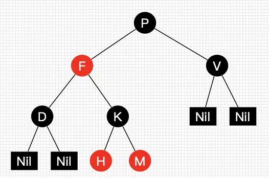
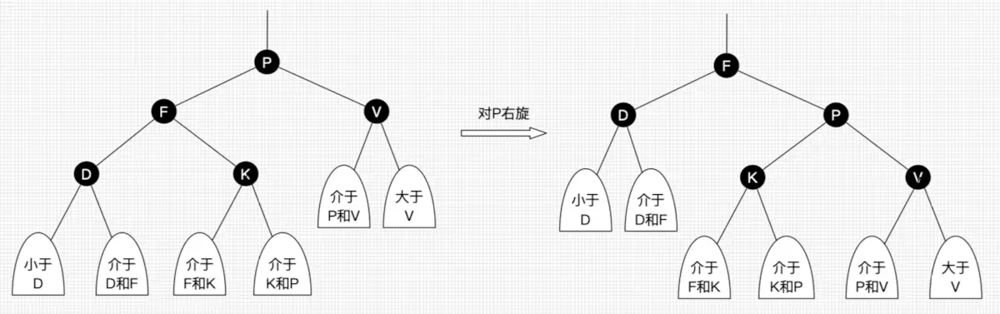
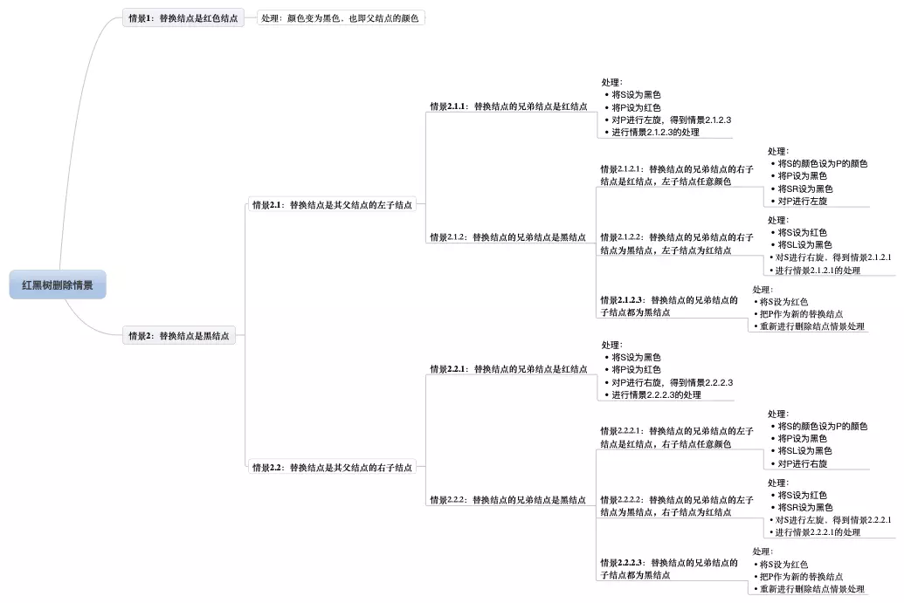
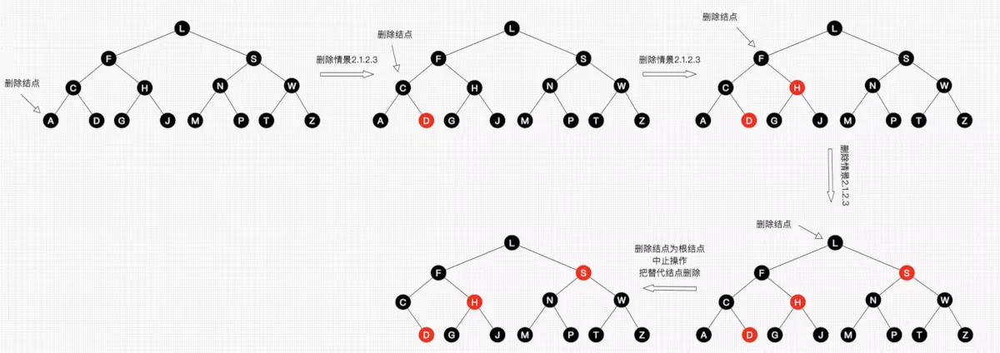

> @Date    : 2020-06-21 11:48:00
>
> @Author  : Lewis Tian (taseikyo@gmail.com)
>
> @Link    : github.com/taseikyo


红黑树（Red-Black Tree）介绍，还是找了一中一英两篇，上次 brilliant.org 讲的跳表不错，于是直接在这个网站上找红黑树的介绍。

- [Red-Black Tree](#red-black-tree)
- [30张图带你彻底理解红黑树](#30张图带你彻底理解红黑树)

## Red-Black Tree

- https://brilliant.org/wiki/red-black-tree/

Alex Chumbley, Jacob Lubecki, Debarghya Adhikari, and 2 others contributed

## Table of Contents
- [Overview](#overview)
- [Red-Black Tree Height](#red-black-tree-height)
- [Operations](#operations)
	- [1) Case 1](#1-case-1)
	- [2) Case 2](#2-case-2)
	- [3) Case 3](#3-case-3)
- [Asymptotic Complexity](#asymptotic-complexity)
- [Python Implementation](#python-implementation)
- [References](#references)

A red-black tree is a type of [binary search tree](https://brilliant.org/wiki/binary-search-trees/). It is self balancing like the [AVL tree](https://brilliant.org/wiki/avl-tree/), though it uses different properties to maintain the invariant of being balanced. Balanced binary search trees are much more efficient at search than unbalanced binary search trees, so the complexity needed to maintain balance is often worth it. They are called red-black trees because each node in the tree is labeled as red or black.

Red-black trees maintain a slightly looser height invariant than AVL trees. Because the height of the red-black tree is slightly larger, lookup will be slower in a red-black tree. However, the looser height invariant makes insertion and deletion faster. Also, red-black trees are popular due to the relative ease of implementation.

This image shows a representation of a red-black tree. Notice how each leaf is actually a black, null value. These properties will be important in proving the tree's height invariant.


### Overview

The red-black tree is similar to the [binary search tree](https://brilliant.org/wiki/binary-search-trees/) in that it is made up of nodes and each node has at most two children. However, there are new properties that are specific to the red-black tree.

1. Each node is either red or black, this can be saved in memory as a single bit (e.g. 'red' = 1, 'black' = 0).
2. The root of the tree is always black.
3. All leaves are null and they are black.
4. If a node is red, then its parent is black.
5. Any path from a given node to any of its descendant leaves contains the same amount of black nodes. This is sometimes known as the **black-depth**.
6. The height of the red-black tree is at most $ 2 \cdot \log_2(n + 1) $; this property will be proven [later](#red-black-tree-height).

When certain nodes are inserted that upset the height invariant of the tree, the tree is then rearranged using the current coloring scheme of its nodes. Once the tree is rearranged, it is repainted to ensure that the coloring properties are maintained.

### Red-Black Tree Height

Proving the height of the red-black tree is especially important because the height of the red-black tree is what allows us to calculate it asymptotic complexity and performance. This is one method of doing so.

First imagine a red-black tree with height h. Now, we merge all red nodes into their black parents. A given black node can either have:

1. 2 black children, in which case the black parent still has **2** children.
2. 1 black child and 1 red child, in which case the black parent now has **3** children.
3. 2 red children, in which case the black parent now has **4** children.


Here is a graphical example of that merging process (assume any stray arrow points to a black node).


Now, we merge all of the red nodes into their parent nodes. This means that any black node will now have $ 2 \cdot r + 2 $ pointers coming out of it, where r is the number of red children they have.


As you can see, every black node has either 2, 3, or 4 children.

This new tree has a height, $ h_1.$ Because any given path in the original red-black tree had *at most* half its nodes red, we know that this new height is at least half the original height. So,

$$
h_1 \geq h/2
$$

The number of leaves in a tree is exactly equal to n+1, so

$$
\begin{array}{c}
n+1 \geq 2^{h_{1}} \\
\log _{2}(n+1) \geq h_{1} \geq h / 2 \\
h \leq 2 \log _{2}(n+1)
\end{array}
$$

### Operations

In a red-black tree, there are two operations that can change the structure of the tree, insert and delete. These changes might involve the addition or subtraction of nodes, the changing of a node's color, or the re-organization of nodes via a rotation. By showing the various cases and algorithms for the insertion process, though, we can infer the same things about deletion.

Inserting a node involves first searching through the tree to find its rightful spot. Then the node is inserted as a *red* node. This might violate the property that a red node's parent is black, though. So, now we have three potential cases that we might have to deal with.

#### 1) Case 1

In the first case, the node we've inserted is red, its parent is red, and its parent's sibling is red. We know that the inserted node's grandparent will be black, so all we need to do is switch the coloring of the inserted node's grandparent with the coloring of the inserted node's parent and its parent's sibling. This case might need to continue to be fixed up through the root of the tree, though, because the inserted node's grandparent may have a parent who is red.

This following graphic shows this case. The node that was inserted is labeled as "INSERT". The left tree shows the case, and the right tree shows it rectified.


#### 2) Case 2

Case 2 occurs when the node's parent is red, but the parent's sibling is black, and the node's value is between those of its parent and grandparent.

We handle Case 2 by performing a rotation that takes us to Case 3. There are two kinds of rotations, a left rotation and a right rotation. Case 2 uses a left rotation because the nodes involved are rotated counter-clockwise. The following image shows the rotation in case 2. *Remember, this rotation does not fully fix the problem, but it sets it up to be solved in case 3.*


As you can see, a left rotation was performed on the node labeled "ROTATE".

#### 3) Case 3

Case 3 involves a right rotation on the grandparent. In the following graphic, the node to be rotated about it labeled "ROTATE", the inserted node is labeled "INSERT", and a third node "MIDDLE" has been labeled to show where it ends up after the rotation.


Deletion, as stated above, works in the exact same way. Once a node has been taken out of the tree, the tree can be in any of the above 3 cases. Then the issue is resolved in the same way.

### Asymptotic Complexity

We know what needs to be done in the events of an insertion or a deletion. So what's the runtime of each operation?

As we proved [earlier](#red-black-tree-height), the height is at most $ 2 \cdot \log_2(n + 1) $. This means that the process of finding an index at which we can insert or delete will be an $ O(\log_2(n)) $ operation. At that point we can fall into any of our three cases.

In case 1, we need to back out of the tree, recoloring nodes as we go. This process also takes $ O(\log_2(n)) $, so it doesn't increase our complexity at all.

In cases 2 and 3 we perform 1 or 2 rotations, respectively. At that point, we terminate. These cases have constant time operations. So, we know that insertion and deletion takes $ O(\log_2(n)) $ time.

Search in a red-black tree is the same as any balanaced binary search tree, $ O(\log_2(n)) $ time. Traversal is a O(n) [amortized](https://brilliant.org/wiki/amortized-analysis/) operation because to search through the entire tree, you simply have to enter and exit each node.

$$
\begin{array}{|l|l|}
\hline & \text { Average } \\
\hline \text { Space } & O(n) \\
\hline \text { Search } & O\left(\log _{2}(n)\right) \\
\hline \text { Traversal } & * O(n) \\
\hline \text { Insert } & O\left(\log _{2}(n)\right) \\
\hline \text { Delete } & O\left(\log _{2}(n)\right) \\
\hline
\end{array}
$$

\*amortized analysis

### Python Implementation

A python implementation might look something like this. Note that this implementation is for academic purposes only and does not guarantee any functionality.

The basic node and tree class can look something like this. Each node needs to keep track of its children, its parent, its color and its key. The `RBTree` class will start out with nothing as its leaves and nothing as its root. Only the root will change, though.

```python
class node:
    def __init__(self, key):
        self.key = key
        self.red = True
        self.left = None
        self.right = None
        self.parent = None

class RBTree:
    def __init__(self):
        self.root = None
```

A search function can be easily implemented using binary search. Note that this implementation assumes that no two keys will have the same value.

```python
def search(self, key):
    currentNode = self.root
    while currentNode != None and key != currentNode.key:
        if key < currentNode.key:
            currentNode = currentNode.left
        else:
            currentNode = currentNode.right
    return currentNode
```

The insert function will behave similarly to the search in that it will find that place in the tree that the new node should go. However, it will need to call functions that will make sure the tree is fixed afterwards.

```python
def insert(self, key):
    node = Node(key)
    #Base Case - Nothing in the tree
    if self.root == None:
        node.red = False
        self.root = node
        return
    #Search to find the node's correct place
    currentNode = self.root
    while currentNode != None:
        potentialParent = currentNode
        if node.key < currentNode.key:
            currentNode = currentNode.left
        else:
            currentNode = currentNode.right
    #Assign parents and siblings to the new node
    node.parent = potentialParent
    if node.key < node.parent.key:
        node.parent.left = node
    else:
        node.parent.right = node
    self.fixTree(node)
```

The `fixTree` method is where most of the heavy lifting takes place. It will decide what kind of case we are in and act appropriately.

```python
def fixTree(self, node):
    while node.parent.red == True and node != self.root:
        if node.parent == node.parent.parent.left:
            uncle = node.parent.parent.right
            if uncle.red:
                #This is Case 1
                node.parent.red = False
                uncle.red = False
                node.parent.parent.red = True
                node = node.parent.parent
            else:
                if node == node.parent.right:
                    #This is Case 2
                    node = node.parent
                    self.left_rotate(node)
                #This is Case 3
                node.parent.red = False
                node.parent.parent.red = True
                self.right_rotate(node.parent.parent)
        else:
            uncle = node.parent.parent.left
            if uncle.red:
                #Case 1
                node.parent.red = False
                uncle.red = False
                node.parent.parent.red = True
                node = node.parent.parent
            else:
                if node == node.parent.left:
                    #Case 2
                    node = node.parent
                    self.right_rotate(node)
                #Case 3
                node.parent.red = False
                node.parent.parent.red = True
                self.left_rotate(node.parent.parent)
    self.root.red = False
```

And here is the `left_rotate` method which will rotate about the given node. The `right_rotate` method is the exact same thing in the other direction.

```python
def left_rotate(self, node):
    sibling = node.right
    node.right = sibling.left
    #Turn sibling's left subtree into node's right subtree
    if sibling.left != None:
        sibling.left.parent = node
    sibling.parent = node.parent
    if node.parent == None:
        self.root = sibling
    else:
        if node == node.parent.left:
            node.parent.left = sibling
        else:
            node.parent.right = sibling
    sibling.left = node
    node.parent = sibling
```

### References

1. burnett, C. *Wikipedia Red-Black Trees*. Retrieved April 25, 2016, from https://en.wikipedia.org/wiki/Red–black_tree

## 30张图带你彻底理解红黑树

- https://www.jianshu.com/p/e136ec79235c

## Table of Contents
- [30张图带你彻底理解红黑树](#30张图带你彻底理解红黑树)
- [写在前面](#写在前面)
- [正文](#正文)
	- [红黑树定义和性质](#红黑树定义和性质)
	- [红黑树查找](#红黑树查找)
	- [红黑树插入](#红黑树插入)
		- [插入情景1：红黑树为空树](#插入情景1红黑树为空树)
		- [插入情景2：插入结点的Key已存在](#插入情景2插入结点的key已存在)
		- [插入情景3：插入结点的父结点为黑结点](#插入情景3插入结点的父结点为黑结点)
		- [插入情景4：插入结点的父结点为红结点](#插入情景4插入结点的父结点为红结点)
	- [红黑树删除](#红黑树删除)
		- [删除情景1：替换结点是红色结点](#删除情景1：替换结点是红色结点)
		- [删除情景2：替换结点是黑结点](#删除情景2：替换结点是黑结点)
- [写在后面](#写在后面)
	- [思考题和习题答案](#思考题和习题答案)

### 写在前面

**当在10亿数据进行不到30次比较就能查找到目标时，不禁感叹编程之魅力！人类之伟大呀！
------ 学红黑树有感。**

终于，在学习了几天的红黑树相关的知识后，我想把我所学所想和所感分享给大家。红黑树是一种比较难的数据结构，要完全搞懂非常耗时耗力，红黑树怎么自平衡？什么时候需要左旋或右旋？插入和删除破坏了树的平衡后怎么处理？等等一连串的问题在学习前困扰着我。如果你在学习过程中也会存在我的疑问，那么本文对你会有帮助，本文帮助你全面、彻底地理解红黑树！

本文将通过图文的方式讲解红黑树的知识点，并且不会涉及到任何代码，相信我，在懂得红黑树实现原理前，看代码会一头雾水的，当原理懂了，代码也就按部就班写而已，没任何难度。

阅读本文你需具备知识点：

- 二叉查找树
- 完美平衡二叉树

事不宜迟，让我们进入正题吧。

### 正文

红黑树也是二叉查找树，我们知道，二叉查找树这一数据结构并不难，而红黑树之所以难是难在它是自平衡的二叉查找树，在进行插入和删除等可能会破坏树的平衡的操作时，需要重新自处理达到平衡状态。现在在脑海想下怎么实现？是不是太多情景需要考虑了？啧啧，先别急，通过本文的学习后，你会觉得，其实也不过如此而已。好吧，我们先来看下红黑树的定义和一些基本性质。

### 红黑树定义和性质

红黑树是一种含有红黑结点并能自平衡的二叉查找树。它必须满足下面性质：

- 性质1：每个节点要么是黑色，要么是红色。
- 性质2：根节点是黑色。
- 性质3：每个叶子节点（NIL）是黑色。
- 性质4：每个红色结点的两个子结点一定都是黑色。
- **性质5：任意一结点到每个叶子结点的路径都包含数量相同的黑结点。**

从性质5又可以推出：

- 性质5.1：如果一个结点存在黑子结点，那么该结点肯定有两个子结点

图1就是一颗简单的红黑树。其中Nil为叶子结点，并且它是黑色的。(值得提醒注意的是，在Java中，叶子结点是为null的结点。)



图1 一颗简单的红黑树

红黑树并不是一个*完美*平衡二叉查找树，从图1可以看到，根结点P的左子树显然比右子树高，但左子树和右子树的黑结点的层数是相等的，也即任意一个结点到到每个叶子结点的路径都包含数量相同的黑结点(性质5)。所以我们叫红黑树这种平衡为**黑色完美平衡**。

介绍到此，为了后面讲解不至于混淆，我们还需要来约定下红黑树一些结点的叫法，如图2所示。


图2 结点叫法约定

我们把正在处理(遍历)的结点叫做当前结点，如图2中的D，它的父亲叫做父结点，它的父亲的另外一个子结点叫做兄弟结点，父亲的父亲叫做祖父结点。

前面讲到红黑树能自平衡，它靠的是什么？三种操作：左旋、右旋和变色。

- **左旋**：以某个结点作为支点(旋转结点)，其右子结点变为旋转结点的父结点，右子结点的左子结点变为旋转结点的右子结点，左子结点保持不变。如图3。
- **右旋**：以某个结点作为支点(旋转结点)，其左子结点变为旋转结点的父结点，左子结点的右子结点变为旋转结点的左子结点，右子结点保持不变。如图4。
- **变色**：结点的颜色由红变黑或由黑变红。


图3 左旋



图4 右旋

上面所说的旋转结点也即旋转的支点，图4和图5中的P结点。\
我们先忽略颜色，可以看到旋转操作不会影响旋转结点的父结点，父结点以上的结构还是保持不变的。\
**左旋**只影响旋转结点和其**右子树**的结构，把右子树的结点往左子树挪了。\
**右旋**只影响旋转结点和其**左子树**的结构，把左子树的结点往右子树挪了。

所以旋转操作是**局部**的。另外可以看出旋转能保持红黑树平衡的一些端详了：当一边子树的结点少了，那么向另外一边子树"借"一些结点；当一边子树的结点多了，那么向另外一边子树"租"一些结点。

但要保持红黑树的性质，结点不能乱挪，还得靠变色了。怎么变？具体情景又不同变法，后面会具体讲到，现在只需要记住**红黑树总是通过旋转和变色达到自平衡**。

balabala了这么多，相信你对红黑树有一定印象了，那么现在来考考你：

***思考题1：黑结点可以同时包含一个红子结点和一个黑子结点吗？***
(答案见文末)

接下来先讲解红黑树的查找热热身。

### 红黑树查找

因为红黑树是一颗二叉平衡树，并且查找不会破坏树的平衡，所以查找跟二叉平衡树的查找无异：

1. 从根结点开始查找，把根结点设置为当前结点；
2. 若当前结点为空，返回null；
3. 若当前结点不为空，用当前结点的key跟查找key作比较；
4. 若当前结点key等于查找key，那么该key就是查找目标，返回当前结点；
5. 若当前结点key大于查找key，把当前结点的左子结点设置为当前结点，重复步骤2；
6. 若当前结点key小于查找key，把当前结点的右子结点设置为当前结点，重复步骤2；

如图5所示。


图5 二叉树查找流程图

非常简单，但简单不代表它效率不好。正由于红黑树总保持黑色完美平衡，所以它的查找最坏时间复杂度为O(2lgN)，也即整颗树刚好红黑相隔的时候。能有这么好的查找效率得益于红黑树自平衡的特性，而这背后的付出，红黑树的插入操作功不可没～

### 红黑树插入

插入操作包括两部分工作：一查找插入的位置；二插入后自平衡。查找插入的父结点很简单，跟查找操作区别不大：

1. 从根结点开始查找；
2. 若根结点为空，那么插入结点作为根结点，结束。
3. 若根结点不为空，那么把根结点作为当前结点；
4. 若当前结点为null，返回当前结点的父结点，结束。
5. 若当前结点key等于查找key，那么该key所在结点就是插入结点，更新结点的值，结束。
6. 若当前结点key大于查找key，把当前结点的左子结点设置为当前结点，重复步骤4；
7. 若当前结点key小于查找key，把当前结点的右子结点设置为当前结点，重复步骤4；

如图6所示。


图6 红黑树插入位置查找

ok，插入位置已经找到，把插入结点放到正确的位置就可以啦，但插入结点是应该是什么颜色呢？答案是**红色**。理由很简单，红色在父结点（如果存在）为黑色结点时，红黑树的黑色平衡没被破坏，不需要做自平衡操作。但如果插入结点是黑色，那么插入位置所在的子树黑色结点总是多1，必须做自平衡。

所有插入情景如图7所示。


图7 红黑树插入情景

嗯，插入情景很多呢，8种插入情景！但情景1、2和3的处理很简单，而情景4.2和情景4.3只是方向反转而已，懂得了一种情景就能推出另外一种情景，所以总体来看，并不复杂，后续我们将一个一个情景来看，把它彻底搞懂。

另外，根据二叉树的性质，**除了情景2，所有插入操作都是在叶子结点进行的**。这点应该不难理解，因为查找插入位置时，我们就是在找子结点为空的父结点的。

在开始每个情景的讲解前，我们还是先来约定下，如图8所示。


图8 插入操作结点的叫法约定

图8的字母并不代表结点Key的大小。I表示插入结点，P表示插入结点的父结点，S表示插入结点的叔叔结点，PP表示插入结点的祖父结点。

好了，下面让我们一个一个来分析每个插入的情景以其处理。

##### 插入情景1：红黑树为空树

最简单的一种情景，直接把插入结点作为根结点就行，但注意，根据红黑树性质2：根节点是黑色。还需要把插入结点设为黑色。

**处理：把插入结点作为根结点，并把结点设置为黑色**。

##### 插入情景2：插入结点的Key已存在

插入结点的Key已存在，既然红黑树总保持平衡，在插入前红黑树已经是平衡的，那么把插入结点设置为将要替代结点的颜色，再把结点的值更新就完成插入。

**处理：**

- **把I设为当前结点的颜色**
- **更新当前结点的值为插入结点的值**

##### 插入情景3：插入结点的父结点为黑结点

由于插入的结点是红色的，当插入结点的黑色时，并不会影响红黑树的平衡，直接插入即可，无需做自平衡。

**处理：直接插入**。

##### 插入情景4：插入结点的父结点为红结点

再次回想下红黑树的性质2：根结点是黑色。**如果插入的父结点为红结点，那么该父结点不可能为根结点，所以插入结点总是存在祖父结点**。这点很重要，因为后续的旋转操作肯定需要祖父结点的参与。

情景4又分为很多子情景，下面将进入重点部分，各位看官请留神了。

**插入情景4.1：叔叔结点存在并且为红结点**\
从红黑树性质4可以，祖父结点肯定为黑结点，因为不可以同时存在两个相连的红结点。那么此时该插入子树的红黑层数的情况是：黑红红。显然最简单的处理方式是把其改为：红黑红。如图9和图10所示。

**处理：**

- **将P和S设置为黑色**
- **将PP设置为红色**
- **把PP设置为当前插入结点**


图9 插入情景4.1\_1


图10 插入情景4.1\_2

可以看到，我们把PP结点设为红色了，如果PP的父结点是黑色，那么无需再做任何处理；但如果PP的父结点是红色，根据性质4，此时红黑树已不平衡了，所以还需要把PP当作新的插入结点，继续做插入操作自平衡处理，直到平衡为止。

试想下PP刚好为根结点时，那么根据性质2，我们必须把PP重新设为黑色，那么树的红黑结构变为：黑黑红。换句话说，从根结点到叶子结点的路径中，黑色结点增加了。**这也是唯一一种会增加红黑树黑色结点层数的插入情景**。

我们还可以总结出另外一个经验：**红黑树的生长是自底向上的**。这点不同于普通的二叉查找树，普通的二叉查找树的生长是自顶向下的。

**插入情景4.2：叔叔结点不存在或为黑结点，并且插入结点的父亲结点是祖父结点的左子结点**\
单纯从插入前来看，也即不算情景4.1自底向上处理时的情况，叔叔结点非红即为叶子结点(Nil)。因为如果叔叔结点为黑结点，而父结点为红结点，那么叔叔结点所在的子树的黑色结点就比父结点所在子树的多了，这不满足红黑树的性质5。后续情景同样如此，不再多做说明了。

前文说了，需要旋转操作时，肯定一边子树的结点多了或少了，需要租或借给另一边。插入显然是多的情况，那么把多的结点租给另一边子树就可以了。

**插入情景4.2.1：插入结点是其父结点的左子结点**\
**处理：**

- **将P设为黑色**
- **将PP设为红色**
- **对PP进行右旋**


图11 插入情景4.2.1

由图11可得，左边两个红结点，右边不存在，那么一边一个刚刚好，并且因为为红色，肯定不会破坏树的平衡。

咦，可以把P设为红色，I和PP设为黑色吗？答案是可以！看过《算法：第4版》的同学可能知道，书中讲解的就是把P设为红色，I和PP设为黑色。但把P设为红色，显然又会出现情景4.1的情况，需要自底向上处理，做多了无谓的操作，既然能自己消化就不要麻烦祖辈们啦～

**插入情景4.2.2：插入结点是其父结点的右子结点**\
这种情景显然可以转换为情景4.2.1，如图12所示，不做过多说明了。

**处理：**

- **对P进行左旋**
- **把P设置为插入结点，得到情景4.2.1**
- **进行情景4.2.1的处理**


图12 插入情景4.2.2

**插入情景4.3：叔叔结点不存在或为黑结点，并且插入结点的父亲结点是祖父结点的右子结点**\
该情景对应情景4.2，只是方向反转，不做过多说明了，直接看图。

**插入情景4.3.1：插入结点是其父结点的右子结点**\
**处理：**

- **将P设为黑色**
- **将PP设为红色**
- **对PP进行左旋**


图13 插入情景4.3.1

**插入情景4.3.2：插入结点是其父结点的左子结点**\
**处理：**

- **对P进行右旋**
- **把P设置为插入结点，得到情景4.3.1**
- **进行情景4.3.1的处理**


图14 插入情景4.3.2

好了，讲完插入的所有情景了。可能又同学会想：上面的情景举例的都是第一次插入而不包含自底向上处理的情况，那么上面所说的情景都适合自底向上的情况吗？答案是肯定的。理由很简单，但每棵子树都能自平衡，那么整棵树最终总是平衡的。好吧，在出个习题，请大家拿出笔和纸画下试试（请务必动手画下，加深印象）：

***习题1：请画出图15的插入自平衡处理过程。***（答案见文末）


图15 习题1

------------------------------------------------------------------------

### 红黑树删除

红黑树插入已经够复杂了，但删除更复杂，也是红黑树最复杂的操作了。但稳住，胜利的曙光就在前面了！

红黑树的删除操作也包括两部分工作：一查找目标结点；而删除后自平衡。查找目标结点显然可以复用查找操作，当不存在目标结点时，忽略本次操作；当存在目标结点时，删除后就得做自平衡处理了。删除了结点后我们还需要找结点来替代删除结点的位置，不然子树跟父辈结点断开了，除非删除结点刚好没子结点，那么就不需要替代。

二叉树删除结点找替代结点有3种情情景：

- 情景1：若删除结点无子结点，直接删除
- 情景2：若删除结点只有一个子结点，用子结点替换删除结点
- 情景3：若删除结点有两个子结点，用后继结点（大于删除结点的最小结点）替换删除结点

补充说明下，情景3的后继结点是大于删除结点的最小结点，也是删除结点的右子树种最左结点。那么可以拿前继结点（删除结点的左子树最右结点）替代吗？可以的。但习惯上大多都是拿后继结点来替代，后文的讲解也是用后继结点来替代。另外告诉大家一种找前继和后继结点的直观的方法（不知为何没人提过，大家都知道？）：**把二叉树所有结点投射在X轴上，所有结点都是从左到右排好序的，所有目标结点的前后结点就是对应前继和后继结点**。如图16所示。


图16 二叉树投射x轴后有序

接下来，讲一个重要的思路：**删除结点被替代后，在不考虑结点的键值的情况下，对于树来说，可以认为删除的是替代结点！**话很苍白，我们看图17。在不看键值对的情况下，图17的红黑树最终结果是删除了Q所在位置的结点！这种思路非常重要，大大简化了后文讲解红黑树删除的情景！


图17 删除结点换位思路

基于此，上面所说的3种二叉树的删除情景可以相互转换并且最终都是转换为情景1！

- 情景2：删除结点用其唯一的子结点替换，子结点替换为删除结点后，可以认为删除的是子结点，若子结点又有两个子结点，那么相当于转换为情景3，一直自顶向下转换，总是能转换为情景1。（对于红黑树来说，根据性质5.1，只存在一个子结点的结点肯定在树末了）
- 情景3：删除结点用后继结点（肯定不存在左结点），如果后继结点有右子结点，那么相当于转换为情景2，否则转为为情景1。

二叉树删除结点情景关系图如图18所示。


图18 二叉树删除情景转换

综上所述，**删除操作删除的结点可以看作删除替代结点，而替代结点最后总是在树末。**有了这结论，我们讨论的删除红黑树的情景就少了很多，因为我们只考虑删除树末结点的情景了。

同样的，我们也是先来总体看下删除操作的所有情景，如图19所示。



图19 红黑树删除情景

哈哈，是的，即使简化了还是有9种情景！但跟插入操作一样，存在左右对称的情景，只是方向变了，没有本质区别。同样的，我们还是来约定下，如图20所示。


图20 删除操作结点的叫法约定

图20的字母并不代表结点Key的大小。R表示替代结点，P表示替代结点的父结点，S表示替代结点的兄弟结点，SL表示兄弟结点的左子结点，SR表示兄弟结点的右子结点。灰色结点表示它可以是红色也可以是黑色。

值得特别提醒的是，**R是即将被替换到删除结点的位置的替代结点，在删除前，它还在原来所在位置参与树的子平衡，平衡后再替换到删除结点的位置，才算删除完成。**

万事具备，我们进入最后的也是最难的讲解。

##### 删除情景1：替换结点是红色结点

我们把替换结点换到了删除结点的位置时，由于替换结点时红色，删除也了不会影响红黑树的平衡，只要把替换结点的颜色设为删除的结点的颜色即可重新平衡。

**处理：颜色变为删除结点的颜色**

##### 删除情景2：替换结点是黑结点

当替换结点是黑色时，我们就不得不进行自平衡处理了。我们必须还得考虑替换结点是其父结点的左子结点还是右子结点，来做不同的旋转操作，使树重新平衡。

**删除情景2.1：替换结点是其父结点的左子结点**\
**删除情景2.1.1：替换结点的兄弟结点是红结点**\
若兄弟结点是红结点，那么根据性质4，兄弟结点的父结点和子结点肯定为黑色，不会有其他子情景，我们按图21处理，得到删除情景2.1.2.3（后续讲解，这里先记住，此时R仍然是替代结点，它的新的兄弟结点SL和兄弟结点的子结点都是黑色）。

**处理：**

- **将S设为黑色**
- **将P设为红色**
- **对P进行左旋，得到情景2.1.2.3**
- **进行情景2.1.2.3的处理**


图21 删除情景2.1.1

**删除情景2.1.2：替换结点的兄弟结点是黑结点**\
当兄弟结点为黑时，其父结点和子结点的具体颜色也无法确定（如果也不考虑自底向上的情况，子结点非红即为叶子结点Nil，Nil结点为黑结点），此时又得考虑多种子情景。

**删除情景2.1.2.1：替换结点的兄弟结点的右子结点是红结点，左子结点任意颜色**\
即将删除的左子树的一个黑色结点，显然左子树的黑色结点少1了，然而右子树又又红色结点，那么我们直接向右子树"借"个红结点来补充黑结点就好啦，此时肯定需要用旋转处理了。如图22所示。

**处理：**

- **将S的颜色设为P的颜色**
- **将P设为黑色**
- **将SR设为黑色**
- **对P进行左旋**


图22 删除情景2.1.2.1

平衡后的图怎么不满足红黑树的性质？前文提醒过，R是即将替换的，它还参与树的自平衡，平衡后再替换到删除结点的位置，所以R最终可以看作是删除的。另外图2.1.2.1是考虑到第一次替换和自底向上处理的情况，如果只考虑第一次替换的情况，根据红黑树性质，SL肯定是红色或为Nil，所以最终结果树是平衡的。如果是自底向上处理的情况，同样，每棵子树都保持平衡状态，最终整棵树肯定是平衡的。后续的情景同理，不做过多说明了。

**删除情景2.1.2.2：替换结点的兄弟结点的右子结点为黑结点，左子结点为红结点**\
兄弟结点所在的子树有红结点，我们总是可以向兄弟子树借个红结点过来，显然该情景可以转换为情景2.1.2.1。图如23所示。

**处理：**

- **将S设为红色**
- **将SL设为黑色**
- **对S进行右旋，得到情景2.1.2.1**
- **进行情景2.1.2.1的处理**


图23 删除情景2.1.2.2

**删除情景2.1.2.3：替换结点的兄弟结点的子结点都为黑结点**\
好了，此次兄弟子树都没红结点"借"了，兄弟帮忙不了，找父母呗，这种情景我们把兄弟结点设为红色，再把父结点当作替代结点，自底向上处理，去找父结点的兄弟结点去"借"。但为什么需要把兄弟结点设为红色呢？显然是为了在P所在的子树中保证平衡（R即将删除，少了一个黑色结点，子树也需要少一个），后续的平衡工作交给父辈们考虑了，还是那句，当每棵子树都保持平衡时，最终整棵总是平衡的。

**处理：**

- **将S设为红色**
- **把P作为新的替换结点**
- **重新进行删除结点情景处理**


图24 情景2.1.2.3

**删除情景2.2：替换结点是其父结点的右子结点**\
好啦，右边的操作也是方向相反，不做过多说明了，相信理解了删除情景2.1后，肯定可以理解2.2。

**删除情景2.2.1：替换结点的兄弟结点是红结点**\
处理：

- **将S设为黑色**
- **将P设为红色**
- **对P进行右旋，得到情景2.2.2.3**
- **进行情景2.2.2.3的处理**


图25 删除情景2.2.1

**删除情景2.2.2：替换结点的兄弟结点是黑结点**\
**删除情景2.2.2.1：替换结点的兄弟结点的左子结点是红结点，右子结点任意颜色**\
**处理：**

- **将S的颜色设为P的颜色**
- **将P设为黑色**
- **将SL设为黑色**
- **对P进行右旋**


图26 删除情景2.2.2.1

**删除情景2.2.2.2：替换结点的兄弟结点的左子结点为黑结点，右子结点为红结点**\
**处理：**

- **将S设为红色**
- **将SR设为黑色**
- **对S进行左旋，得到情景2.2.2.1**
- **进行情景2.2.2.1的处理**


图27 删除情景2.2.2.2

**删除情景2.2.2.3：替换结点的兄弟结点的子结点都为黑结点**\
**处理：**

- **将S设为红色**
- **把P作为新的替换结点**
- **重新进行删除结点情景处理**


图28 删除情景2.2.2.3

综上，红黑树删除后自平衡的处理可以总结为：

1. 自己能搞定的自消化（情景1）
2. 自己不能搞定的叫兄弟帮忙（除了情景1、情景2.1.2.3和情景2.2.2.3）
3. 兄弟都帮忙不了的，通过父母，找远方亲戚（情景2.1.2.3和情景2.2.2.3）

哈哈，是不是跟现实中很像，当我们有困难时，首先先自己解决，自己无力了总兄弟姐妹帮忙，如果连兄弟姐妹都帮不上，再去找远方的亲戚了。这里记忆应该会好记点～

最后再做个习题加深理解（请不熟悉的同学务必动手画下）：

***习题2：请画出图29的删除自平衡处理过程。***


习题2

------------------------------------------------------------------------

------------------------------------------------------------------------

### 写在后面

耗时良久，终于写完了～自己加深了红黑树的理解的同时，也希望能帮助大家。如果你之前没学习过红黑树，看完这篇文章后可能还存在很多疑问，如果有疑问可以在评论区写出来，我会尽自己所能解答。另外给大家推荐一个支持红黑树在线生成的网站，来做各种情景梳理很有帮助：[在线生成红黑树](https://sandbox.runjs.cn/show/2nngvn8w)。（删除操作那个把替代结点看作删除结点思路就是我自己在用这个网站时自己顿悟的，我觉得这样讲解更容易理解。）

少了代码是不是觉得有点空虚？哈哈，后续我会写关于Java和HashMap和TreeMap的文章，里面都有红黑树相关的知识。相信看了这篇文章后，再去看Java和HashMap和TreeMap的源码绝对没难度！

最后来看下思考题和习题的答案吧。

------------------------------------------------------------------------

### 思考题和习题答案

思考题1：黑结点可以同时包含一个红子结点和一个黑子结点吗？

答：可以。如下图的F结点：


习题1：请画出图15的插入自平衡处理过程。


习题2：请画出图29的删除自平衡处理过程。


