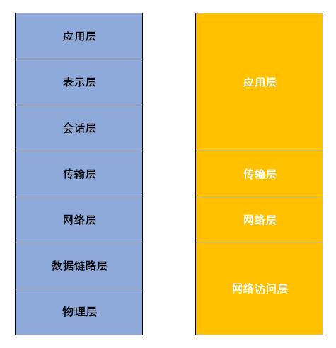
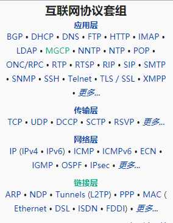
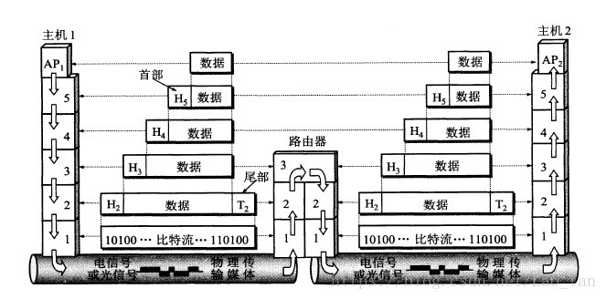
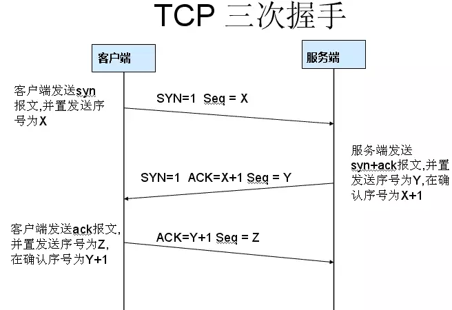
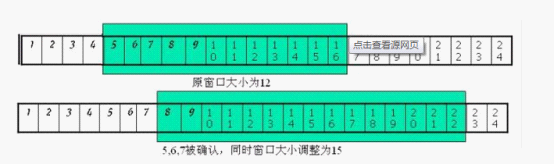
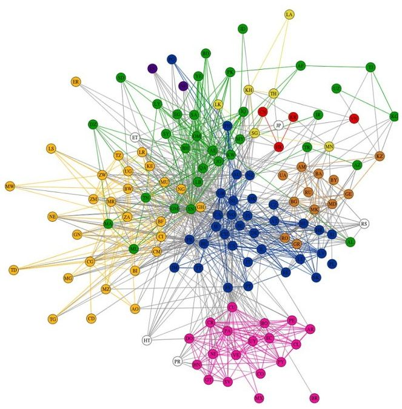

> @Date    : 2020-08-19 15:40:10
>
> @Author  : Lewis Tian (taseikyo@gmail.com)
>
> @Link    : github.com/taseikyo

今天中午微信二面，问的很细很深，其中就有一个老生常谈的问题，输入一个 URL 之后使用到的各种协议，其实一直不是很懂网络这块，不是很懂有了 IP 地址为什么还要 MAC 地址，所以从上往下说的时候漏掉了 ARP 协议，之后被追问也答得不好。于是就搜来看看，这个看了感觉还不错。

- https://www.jianshu.com/p/191625b469ec

## 目录

- [前言](#前言)
- [一、TCP/IP 参考模型是什么](#一、tcp/ip-参考模型是什么)
- [二、一次完整的网络通信过程](#二、一次完整的网络通信过程)
- [三、各阶段发生了什么](#三、各阶段发生了什么)
	- [1. DNS 查询](#1.-dns-查询)
	- [2. Mac 地址查询](#2.-mac-地址查询)
	- [3. 数据传输——套接字来帮忙](#3.-数据传输——套接字来帮忙)
	- [4. 三次握手与四次挥手](#4.-三次握手与四次挥手)
	- [接下来的路](#接下来的路)
- [参考链接](#参考链接)

## 前言

一切还要从那个经典问题出发：

当你在浏览器中输入 [https://www.google.com/](https://links.jianshu.com/go?to=https%3A%2F%2Fwww.google.com%2F) 并且按下回车之后发生了什么？

Whaaat!!! 都 9012 年了你还在问这个问题！

解析 URL，DNS 查询，获得服务器 IP 地址，向目标地址发送 HTTP 请求，服务器收到，响应，返回页面，浏览器接收，渲染，bingo！

你露出满意笑容，又是一个满分回答。

停！还没完呢。请问这位同学，你发送的请求是怎么到达目标服务器的，服务器的响应又是如何回来的？

你陷入沉默，说了一些 TCP 协议、OSI 模型、路由器之类的词。

此时问题又来了：浏览器又是如何将请求发送出去的？

空气中的沉默加深了几分，仿佛要滴出水来 ······

这篇文章，我将以网络通信常用的 TCP/IP 模型为主，解释网络通信涉及的各个阶段，不管是常规的页面访问，还是我们业务中常见的 HTTP 请求，都包含在这样的过程中，了解整体对前端开发者们很有益处。开始吧！

## 一、TCP/IP 参考模型是什么

在进入具体的解释之前，我们对 TCP/IP 协议的前世今身做一个简单回顾。

所谓无规矩不成方圆，网络诞生之初，为了保证网络通信的有序进行，相关组织开始着手制定各种通信协议，例如最早的网络控制协议（NCP），到后来耳熟能详的 OSI 七层协议等，整个因特网在这些协议的制约下迅速发展。事物总是发展变化的，技术自然更新换代。到上一世纪 80 年代，美国国防部的 ARPA 网（也就是阿帕网，互联网的鼻祖）项目中，TCP、IP 协议最早被提出来得到应用，并且由于其优异性迅速成为互联网通信的主流通用协议。

这一协议最早得名是因为两个最重要最先被提出的协议 TCP 和 IP，后来，互联网通信的各类协议（HTTP、IP、DNS、TCP、ARP）整体都被纳入这一协议体系中，被统称为 “TCP/IP 协议族”。

也就是说，TCP/IP 协议族最早的确只有 TCP 和 IP 两个协议，现在则是一系列与网络通信有关的各类协议的集合。对应这一协议族，同时发展出了 **TCP/IP 参考模型**，这一模型是一个抽象出来的**分层**模型，TCP/IP 协议族中的所有协议被归类到这一模型的 4 个层次中，每一层相互独立，下一层为上一层提供服务，各个层次间互相协作，完成了互联网通信的主要工作。

这四个层分别是：**网络访问层（又叫数据链路层或者网络接口层）**，**网络层**，**传输层**，**应用层**，大家通常将这四个层次与更为详细的 OSI 七层模型映射：

在 TCP/IP 参考模型中，各项通信协议各有归属，例如我们在浏览器中常用的：HTTP（超文本传输协议）、DNS（域名系统）、FTP（文件传输协议）、SMTP（简单邮件传输协议等）都是属于应用层协议，而 TCP、UDP 则属于传输层协议，IP 则属于网络层协议。更多的通信协议，大家可以搜索了解。我们这篇文章主要分析以 HTTP 为主的通信过程。

（常见协议）

## 二、一次完整的网络通信过程

为了对 HTTP 请求的通信过程有一个更好的理解，我将从 TCP/IP 四个层次出发，对应各个层次的通信实体，或者媒介（例如浏览器，路由器以及网线等），看各个协议是如何在这些通信实体中发生作用，将一个请求发送到服务器，服务器的响应又是如何赶回来的。

整体来讲，一次完整的通信，很像快递邮递包裹，物品被加上包装，写上地址信息和联系方式，经过一个又一个的快递中转站，到达收货人的位置，在网络请求中，请求的数据就是需要快递的物品，IP 地址和 MAC 地址就是通信的地址，网线和路由器、交换机和集线器等就是运输道路和快递中转站，网络协议则可以看做快递员和快递政策，而和快递类似的是，网络通信也会出现丢包（包裹损坏）等情况。所以说，一个简单的 HTTP 请求，要完整地拿到请求信息，中间有若干操作系统组件、通信协议、通信实体参与，才能保证通信的顺利进行。

那么，这个快递过程，具体是怎么进行的呢？

其基本原则是，通过分层的顺序，发送端由上往下发送，接收端则由下向上接收。为了保证数据顺利发送到下一个层次，会在发送在其头部加上一些必要的信息，这些信息是为了保证数据的完整和符合需求的约束信息。发送 HTTP 请求时，经常会设置 Request Header，例如 Content-Type：text/html 是向服务器说明，我需要的是 HTML 页面，你返回其他东西是不行滴。

这些头部信息还可能包含协议信息，请求路径、请求方法等，但这仅仅是发生在应用层，整个通信过程，经过四个层次，会被依次加上 HTTP 请求头，TCP 头部、IP 头部以及以太网头部。数据加上这些头部信息之后，才会被发往下一层，数据经过重重包装，从你的网卡出发，穿过若干路由器，网线，交换机，到达目标服务器所在的子网，服务器要做的则是相反的过程，它会根据前面加上的头部信息，层层解析，最后到达服务器被处理（处理就是服务端程序代码的责任），之后再将响应数据返回。整体过程如下图：

（图片来自谢希仁版《计算机网络》）

数据在各个层次间依次传递，其传递的数据单位我们可以统一理解为数据包，数据包在不同的层次有不同的称呼，我们熟悉的是，其从应用层出发时，将之称为 HTTP 请求**消息（message）**或者报文，为其加上消息头之后，发送至传输层，加上 TCP 头部，叫它**报文段（segment）**，到网络层，加上 IP 头部，成为 IP 数据**包**，到了最后的网络访问层，其已经套上层层包装，在这里在为其加上以太网首部的同时，还会加上一些尾部信息，摇身变为**帧（framing）**，这个过程叫做封装过程。不管怎么叫，数据在各个层次间，是以数据包的形式传递，当数据量大时，还会出现分包传递的情况。

接下来我将这个过程进行扩展，看看在输入 [https://www.google.com/](https://links.jianshu.com/go?to=https%3A%2F%2Fwww.google.com%2F) 之后，TCP/IP 的各个层次间，前面提到的通信协议是如何参与其中的：

## 三、各阶段发生了什么

### 1. DNS 查询

URL 只是为了人类更友好识别网络程序而设置的互联网资源的定位标识，浏览器首先会对 URL 进行解析，获取到请求的协议（https），域名（google.com），路径（/），由于没有其他子域名，也就是查询 google 的默认主页。解析完毕后，DNS 出场。

DNS，也就是域名查询系统，负责 URL 对应的 IP 地址的查询，每个操作系统会内置 Socket 协议库，协议库中有解析器（resolver）专门负责这个过程，又是一个漫长的过程（当然我们等的时间不会很长），这里不再具体展开，感兴趣的同学可以看看我在文尾列出的参考资源 How DNS works，其用生动有趣的动画形式展示了这一过程，十分有趣。

经过 DNS 查询，浏览器拿到了请求资源的 IP 地址。IP 地址，又叫网际协议地址，是分配给网络上设备的数字标识，也就是说，只要联网的设备，例如我们的电脑手机以及路由器等都是有 IP 地址的。其是我们的请求数据识别服务器在网络中的位置的必须标识。

### 2. Mac 地址查询

IP 地址在网络层使用，但在实际的数据链路上传递数据时，在同一个链路中不同的计算机，其必须要使用另一个地址来识别—— Mac 地址，又叫做物理地址。

说到这里，岔开一句，在网络通信中，我们通常提到三个地址：IP 地址、Mac 地址以及端口号，三者分别代表的是：

**IP 地址**：网络中互联的主机和路由器的标识。  
**Mac 地址**：每个网卡硬件的物理地址。  
**端口号**：识别同一个主机上不同的应用程序，也可以理解为程序地址。

所以，在一个网络通信中，我们需要用到五大识别符：源 IP 地址、目标 IP 地址、协议、源端口号和目标端口号。

言归正传，Mac 地址是每一个网卡被生产的时候就写死在其中的，所以其是不变且唯一的，那么如何得到服务器的 Mac 地址呢，又一个协议闪亮登场——ARP。

ARP，英文全称叫做 Address Resolution Protocol，也就是地址解析协议，其作用是，**根据 IP 地址获取通信设备的物理地址**，其工作原理类似于以前我们常见的广播，它会将包发送给同一以太网的所有主机，若目标主机的 Mac 地址与对应的 IP 地址命中，则找到了目标，但是，若每次查询都要给所有的主机发送 ARP 请求，网络中则会出现很多 ARP 包，因此，每个主机都会有一个 ARP 缓存，里面存放着常用的 MAC 地址，主机会优先从缓存中查询是否有需要的信息，如果有，就不再发送广播。Mac 地址会在网络层加入 IP 头部发往网络访问层，其实你会发现，为了提高效率和性能，网络通信中随处可见缓存，HTTP 缓存、DNS 缓存以及 ARP 缓存等。值得了解的是，在 IPv6 中，有一个 NDP（邻居发现协议）替代 ARP 来完成这个工作。

### 3. 数据传输——套接字来帮忙

我们前面提到操作系统中有一个协议库，负责本机中网络通信的很多功能，在 DNS 查询的时候，协议栈中的解析器就参与其中，当应用层获取到服务器的 IP 地址和 Mac 地址，已经拥有了数据传递的必要条件，接下来，浏览器会向操作系统的协议库发出委托指令，调用其中 Socket 库中的程序组件，建立套接字（socket），套接字的本质可以理解为一个数据通道的出入口，其执行的是一个 “打开，读 / 写，关闭” 的流程。

在进行数据传输时，客户端和服务器都会创建一个套接字，之后调用 socket 库中的 connect 组件，该组件会依据描述符（套接字的匹配令符，与服务端的套接字的接头暗号），服务器的 IP 地址和端口号，在浏览器和目标服务器之间建立一个传输通道（实际上并没有真实的通道，中间隔着 N 多网关、路由器和防火墙，这样说更好理解），而大名鼎鼎的 TCP 三次握手实际就是发生在这个阶段，我们会在后面具体介绍 TCP 到底做了什么。

通道建立之后，接下来就是数据的读写操作，我们的程序代码无法直接控制套接字，它依然会委托 Socket 库中的组件来完成数据的读写（write 和 read），数据传输完成后，服务器会主动执行断开操作，调用 Socket 库中的 close 组件断开连接，浏览器发现之后，也会执行断开操作，数据传输完成。

可以看到，在应用程序代码的背后，操作系统中内置的组件库和互联网协议互为网络通信的左膀右臂，共同负责整个通信过程，缺一不可。

### 4. 三次握手与四次挥手

TCP 和 UDP 是传输层中的两个主要协议，两者的区别是：前者是**面向连接的（实际就是套接字管道）、可靠的流协议**，后者则并不可靠，它采取一种 “尽最大努力” 的传输策略，大家可以记住，浏览器、邮件等应用程序一般使用 TCP 传递数据，而像 DNS 查询等较短的收发则使用 UDP。我们主要介绍 TCP。

整体来讲，之所以要在发送数据之前建立套接字，正是因为 TCP 是面向连接的传输协议，在传输协议面前，你发送的内容无关紧要，它们会将之看为一串具有一定长度的数据。

为了保证数据传输的可靠，TCP 在套接字建立连接时，采用 “三次握手” 策略传输数据。

下面是一张三次握手流程图：

图中的 syn 是 Synchronize Sequence Numbers 的简写，也就是同步序列编号，拥有数据传输序列的标识。

ack 指的是 acknowledgement，表示确认。

通俗来讲，是这样一个过程：

第一次握手：客户端尝试连接服务器，向服务器发送 syn 包（同步序列编号），syn=j，其进入 SYN_SEND 状态等待服务器确认：我已准备好，随时出发！

第二次握手：服务器接收客户端 syn 包并确认（ack=j+1），同时向客户端发送一个 syn 包（syn=k），也即 syn + ack 包，此时服务器进入 SYN_RECV 状态：收到请求，随时接收。

第三次握手：客户端收到服务器的 syn + ack 包，向服务器发送确认包 ack(ack=k+1），此包发送完毕，客户端和服务器进入 ESTABLISHED 状态，完成三次握手：OK，我知道了，那我们开始发送数据。

你可能会觉得相当麻烦，确认一次就可以了嘛，收到了吗？收到，传输，为什么需要三次握手呢？

其实，为了保证数据传输的绝对可靠，三次确认是最少的次数，试想这样一种情况：在第一次得到确认后，客户端发送数据出去，但是这个数据由于中途网络等问题，迟迟到不了服务端，服务端选择关掉通道，但通道关闭后，刚刚的数据又跑过来了，这时候，服务端会将这个数据视为来自客户端的新的传输请求，同意建立连接，而建立一个新的连接，但是，客户端并没有发送数据，所以，它会忽视服务端的确认，也不会回应给服务端，服务端就在傻傻滴等待，但这种等待是没有结果的，这就造成了服务端资源的浪费。

我在知乎上看到另外一种理解：之所以需要三次握手，本质的原因是，传输信道是不可靠的，你不知道网络会在什么时候出什么样的问题，所以，为了保证传输的确可靠，三次握手是理论上的最小值。

TCP 传输数据时，并不是将所有数据一股脑全丢出去，而是会将数据存放在一个的发送缓冲区，并且会等待应用程序的下一段程序到达，之所以这样干，是因为一收到数据立马发送，很可能会造成信道的浪费与闲置，导致网络效率太低，就像明明很宽的马路，非要像过独木桥一样通过。

而 TCP 如何决定数据什么时候会发送，其拥有一套计算机制，整体来说，是按网络包的长度以及应用程序送包过来的时间，虽然你的数据很小，但你半天不发送，我也不会一直傻等着。

还有一种情况是，当发送过来的数据包很大时，会在缓冲区对包进行拆分发送，拆分的时候，TCP 模块会计算好每一块数据的开头和结尾的字节数，并将之写在 TCP 头部信息中，以待对方确认，根据这些起始序号，接收方可以判断是否有数据遗漏的情况。

每发送一个包，就需要等待 ack 包的确认，这也是一种资源浪费，所以为了利用等待 ack 的空闲时间，数据可以不用等待 ack 直接发送，但是，这会出现一种情况，一边一味地发送，但超过了接收方的处理能力，就会出现网络拥堵，得不偿失。为了解决这个问题，TCP 采取了一种**滑动窗口**的发送策略，它的原理是这样的：

滑动窗口实际上是数据**流量控制策略**，我们可以将所有的数据想象为一个序列，而窗口则是数据可处理的数据大小，接收方会将窗口的大小写入 ack 包的头部信息中，告知发送方，发送方会据此动态调整发送的速率，由于传输的持续进行，这个窗口大小会动态变化，因此达到了流量的控制，其本质的目的是，不要发的太快，让接收方处理不过来。

（滑动窗口示意图）

### 接下来的路

上面我们只提到发送和接收，但是在浏览器和服务器之间，可能隔着极多的网关、路由器、交换机等，数据是如何在庞大无比的因特网上找到服务器的呢？

这就是网络层协议的用武之地了。

实际上，这一切在请求发送之前已经准备好了，我们使用 DNS 和 ARP 等方式，获取到了目标服务器的 IP 地址和 Mac 地址，这两个地址引导发送的数据包到达服务器，IP 地址用于在网络中的所有主机中匹配通信的目标主机，IP 地址包含**网络标识**和**主机标识**，前者用于区别不同的网段，后者找到同一网段的不同主机，数据到达路由器时，路由器会根据网络标识将数据转发到相应的网段，到达相应的网段之后，又会根据主机号，到达真正的主机。

说到这里，大家可能会有一个疑惑，既然 IP 地址都能找到目标服务器，**为什么还需要 Mac 地址**？

请容我解释：

在同一个网段内通信时，只用知道 Mac 地址，就可以精准找到目标，但是，互联网上的网络数量无比庞大，网络被各大运营商分割为多个网段，每个网段又有多个子网，如果仅仅知道一个 Mac 地址，要在所有的网络设备进行匹配，就是相当大的工程了，这时候，IP 地址的妙用体现出来了：它可以用来找路，这就类似于快递中的省市地区等，而 Mac 地址可能是唯一的名字，你在全中国找一个小强的人那就太多了，但是你要具体到某一个村或小区，就很简单了。

另外一个原因是，交换机这个东西，只认 Mac 地址，就如同路由器根据 IP 地址决定网络请求的转发路线，交换机通过 Mac 地址来确定具体的网卡位置。

路由器、交换机、网线、光纤等正是 TCP/IP 四层协议的最底层，网络访问层，也就是 OSI 模型中的数据链路层和物理层，在这一层，数据被加上以太网首部，封装成帧，在各个路由器之间转发传送，经常来说，路由器之间的传送又有常用的**点对点协议**，也就是 PPP（Point-To-Point Protocol），这是一个网络访问层协议，PPP 会在帧的前后加上帧界定符进行发送。最后，到达服务器所在子网，会将消息转交网络层向上传递。

向上传递的过程如前所述，乃是解析头部信息，最终到达服务器的相反过程，不再细述。

这个过程我们可以在前面的整体过程图清晰看到，请求数据到达服务器所在子网的路由器之后，又是一个由下而上的过程，这与客户端发送数据基本相反，每经过一个层次，都会解析前面添加到请求数据上的多层头部信息，交由上一层处理，在整个 TCP/IP 协议栈的帮助下，我们的请求数据终于到达了目标服务器，穿过服务器的网卡，服务器操作系统同样有协议栈来负责找到服务端程序对应的端口，将数据交由服务端应用程序处理。

服务器会根据我们的请求头信息，处理返回结果，之后，请求响应信息重新出发，再次回到浏览器。

浏览器收到请求后，经过解析、渲染过程，页面呈现在我们面前。

## 参考链接

1.  [How DNS works](https://links.jianshu.com/go?to=https%3A%2F%2Fhowdns.works%2F)
2.  谢希仁《计算机网络》
3.  户根勤《网络是怎样连接的》
4.  [what-happens-when...](https://links.jianshu.com/go?to=https%3A%2F%2Fgithub.com%2Fskyline75489%2Fwhat-happens-when-zh_CN)
5.  [通俗大白话来理解 TCP 协议的三次握手和四次分手](https://links.jianshu.com/go?to=https%3A%2F%2Fgithub.com%2Fjawil%2Fblog%2Fissues%2F14)