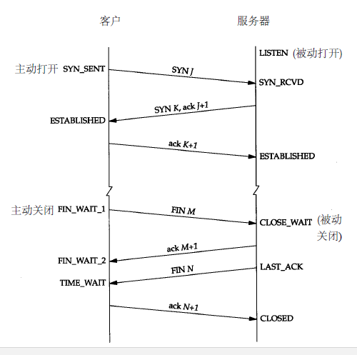

> @Data    : 2020-08-21 16:06:18
>
> @Author  : Lewis Tian (taseikyo@gmail.com)
>
> @Link    : github.com/taseikyo

# HTTPS 建立连接的详细过程

> 原文：https://www.cnblogs.com/glory0727/p/9857511.html 作者：[月光glory](https://home.cnblogs.com/u/glory0727/) 2018-10-26 17:08

## Table of Contents

- [简介](#简介)
- [对称加密和非对称加密](#对称加密和非对称加密)
- [建立连接](#建立连接)
- [tcp 的三次挥手和四次挥手](#tcp-的三次挥手和四次挥手)
	- [过程简图](#过程简图)
	- [三次挥手 (建立连接)](#三次挥手-(建立连接))
	- [四次挥手 (断开连接)](#四次挥手-(断开连接))
- [HTTP 请求过程](#http-请求过程)
- [HTTPS](#https)

## 简介

HTTPS 是在 HTTP 的基础上和 ssl/tls 证书结合起来的一种协议, 保证了传输过程中的安全性, 减少了被恶意劫持的可能. 很好的解决了解决了 http 的三个缺点（被监听、被篡改、被伪装）

## 对称加密和非对称加密

- 对称加密
    - 即加密的密钥和解密的密钥相同,
- 非对称加密
    - 非对称加密将密钥分为公钥和私钥, 公钥可以公开, 私钥需要保密, 客户端公钥加密的数据, 服务端可以通过私钥来解密

## 建立连接

- HTTP 和 HTTPS 都需要在建立连接的基础上来进行数据传输, 是基本操作
- 当客户在浏览器中输入网址的并且按下回车, 浏览器会在浏览器 DNS 缓存, 本地 DNS 缓存, 和 Hosts 中寻找对应的记录, 如果没有获取到则会请求 DNS 服务来获取对应的 ip
- 当获取到 ip 后, tcp 连接会进行三次握手建立连接

## tcp 的三次挥手和四次挥手

### 过程简图

### 三次挥手 (建立连接)

- 第一次：建立连接时，客户端发送 SYN 包 (syn=j) 到服务器，并进入 SYN_SEND 状态，等待服务器确认；
- 第二次：服务器收到 SYN 包，向客户端返回 ACK（ack=j+1），同时自己也发送一个 SYN 包（syn=k），即 SYN+ACK 包，此时服务器进入 SYN_RCVD 状态；
- 第三次：客户端收到服务器的 SYN＋ACK 包，向服务器发送确认包 ACK(ack=k+1)，此包发送完毕，客户端和服务器进入 ESTABLISHED 状态，完成三次握手。
- 完成三次握手，客户端与服务器开始传送数据，也就是 ESTABLISHED 状态。
- 三次握手保证了不会建立无效的连接，从而浪费资源。

### 四次挥手 (断开连接)

- 第一次： TCP 客户端发送一个 FIN，用来关闭客户到服务器的数据传送。
- 第二次：服务器收到这个 FIN，它发回一个 ACK，确认序号为收到的序号加 1。和 SYN 一样，一个 FIN 将占用一个序号。
- 第三次：服务器关闭客户端的连接，发送一个 FIN 给客户端。
- 第四次：客户端发回 ACK 报文确认，并将确认序号设置为收到序号加 1。

## HTTP 请求过程

- 建立连接完毕以后客户端会发送响应给服务端
- 服务端接受请求并且做出响应发送给客户端
- 客户端收到响应并且解析响应响应给客户

## HTTPS

- 在使用 HTTPS 是需要保证服务端配置正确了对应的安全证书
- 客户端发送请求到服务端
- 服务端返回公钥和证书到客户端
- 客户端接收后会验证证书的安全性, 如果通过则会随机生成一个随机数, 用公钥对其加密, 发送到服务端
- 服务端接受到这个加密后的随机数后会用私钥对其解密得到真正的随机数, 随后用这个随机数当做私钥对需要发送的数据进行对称加密
- 客户端在接收到加密后的数据使用私钥 (即生成的随机值) 对数据进行解密并且解析数据呈现结果给客户
- SSL 加密建立
